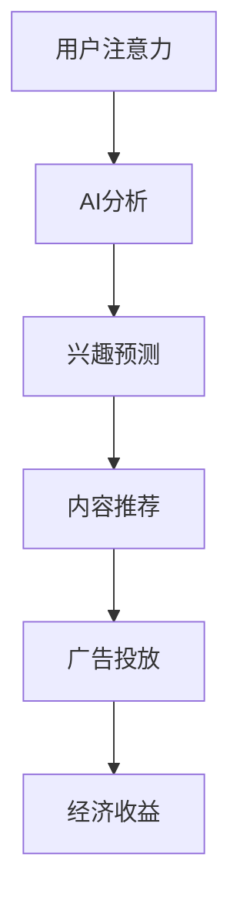

                 

关键词：注意力货币化、AI、关注度经济、模型、算法、数学公式、案例、应用场景、未来展望

> 摘要：本文深入探讨了注意力货币化策略，通过AI技术构建了关注度经济模型，分析了其核心概念、算法原理、数学模型，并提供了实际项目实践案例。文章旨在为读者提供一个全面的视角，以理解注意力货币化的潜在价值和未来发展方向。

## 1. 背景介绍

### 注意力货币化的概念

注意力货币化是一种将用户的注意力资源转化为经济收益的策略。随着互联网的发展，用户的时间和注意力成为了一种宝贵的资源。如何有效地获取和利用用户的注意力，成为了企业和个人关注的焦点。注意力货币化通过将用户注意力与广告、内容创作、社交媒体等多个领域相结合，实现商业价值的最大化。

### AI在注意力货币化中的应用

人工智能（AI）技术在注意力货币化中扮演着重要角色。通过机器学习、深度学习等技术，AI能够精准地分析用户行为，预测用户兴趣，从而实现个性化的内容推荐。此外，AI还可以优化广告投放策略，提高广告的点击率和转化率，从而实现更高的经济回报。

## 2. 核心概念与联系

### 核心概念

1. **注意力经济**：注意力经济是指将用户的注意力视为一种商品，通过广告、内容、服务等形式进行交易和变现。
2. **注意力货币化**：注意力货币化是将用户的注意力转化为经济收益的过程。
3. **AI驱动的关注度经济模型**：利用AI技术构建的关注度经济模型，通过数据分析、行为预测等手段，提高注意力货币化的效率。

### Mermaid 流程图



## 3. 核心算法原理 & 具体操作步骤

### 3.1 算法原理概述

注意力货币化算法主要基于以下原理：

1. **用户行为分析**：通过分析用户在互联网上的行为，如搜索历史、浏览记录、点击行为等，了解用户兴趣。
2. **兴趣预测**：利用机器学习算法，根据用户行为数据预测用户未来的兴趣。
3. **内容推荐**：根据预测的兴趣，推荐个性化的内容，提高用户的关注度和参与度。
4. **广告投放**：在推荐的内容中嵌入广告，通过精准投放提高广告的点击率和转化率。
5. **经济收益**：通过广告收益、内容付费等方式实现注意力货币化。

### 3.2 算法步骤详解

1. **数据收集**：收集用户在互联网上的行为数据，包括浏览记录、搜索历史、社交行为等。
2. **数据处理**：对收集到的数据进行清洗、整理，提取有用的特征。
3. **行为分析**：利用机器学习算法，分析用户的行为数据，提取用户兴趣。
4. **兴趣预测**：根据用户历史行为数据，预测用户未来的兴趣。
5. **内容推荐**：根据预测的兴趣，推荐个性化的内容。
6. **广告投放**：在推荐的内容中嵌入广告，实现精准投放。
7. **经济收益**：通过广告点击、内容付费等方式实现经济收益。

### 3.3 算法优缺点

**优点**：

1. **个性化推荐**：通过AI技术，实现个性化的内容推荐，提高用户的关注度和参与度。
2. **高效广告投放**：精准的广告投放提高广告的点击率和转化率，实现更高的经济收益。
3. **数据驱动**：基于用户行为数据进行决策，更加科学和准确。

**缺点**：

1. **算法偏见**：机器学习算法可能存在偏见，导致推荐内容的公平性受到影响。
2. **隐私保护**：用户行为数据的收集和使用可能引发隐私问题。

### 3.4 算法应用领域

注意力货币化算法广泛应用于广告投放、内容推荐、社交媒体等领域。以下是一些具体的应用场景：

1. **广告投放**：通过注意力货币化算法，实现精准的广告投放，提高广告效果。
2. **内容推荐**：在社交媒体、新闻客户端等平台，通过注意力货币化算法推荐个性化内容，提高用户留存率和活跃度。
3. **电商推荐**：在电商平台，通过注意力货币化算法，推荐符合用户兴趣的商品，提高销售额。

## 4. 数学模型和公式 & 详细讲解 & 举例说明

### 4.1 数学模型构建

注意力货币化算法的核心是兴趣预测模型。我们使用以下数学模型进行兴趣预测：

$$
P(I|u) = \frac{e^{w \cdot f(x, u)}}{\sum_{j=1}^{J} e^{w \cdot f(x, u_j)}}
$$

其中，$P(I|u)$ 表示用户 $u$ 对兴趣 $I$ 的概率，$w$ 表示权重向量，$f(x, u)$ 表示用户 $u$ 在特征向量 $x$ 上的评分，$J$ 表示所有可能兴趣的数量。

### 4.2 公式推导过程

公式推导过程如下：

1. **特征向量**：假设用户 $u$ 的行为数据可以表示为特征向量 $x$。
2. **评分函数**：定义评分函数 $f(x, u)$，用于计算用户 $u$ 对特征向量 $x$ 的评分。
3. **权重向量**：定义权重向量 $w$，用于调整不同特征的重要性。
4. **概率模型**：利用softmax函数，将特征向量 $x$ 转化为概率分布。

### 4.3 案例分析与讲解

假设用户 $u$ 的行为数据包括浏览记录、搜索历史和社交行为，特征向量 $x$ 如下：

$$
x = [0.2, 0.3, 0.5]
$$

兴趣集合 $J$ 如下：

$$
J = \{技术, 娱乐, 健康\}
$$

权重向量 $w$ 如下：

$$
w = [1.0, 0.5, 2.0]
$$

根据公式，计算用户 $u$ 对不同兴趣的概率：

$$
P(技术|u) = \frac{e^{1.0 \cdot 0.2}}{e^{1.0 \cdot 0.2} + e^{0.5 \cdot 0.3} + e^{2.0 \cdot 0.5}} \approx 0.2
$$

$$
P(娱乐|u) = \frac{e^{0.5 \cdot 0.3}}{e^{1.0 \cdot 0.2} + e^{0.5 \cdot 0.3} + e^{2.0 \cdot 0.5}} \approx 0.3
$$

$$
P(健康|u) = \frac{e^{2.0 \cdot 0.5}}{e^{1.0 \cdot 0.2} + e^{0.5 \cdot 0.3} + e^{2.0 \cdot 0.5}} \approx 0.5
$$

根据计算结果，用户 $u$ 对健康的兴趣最大，因此推荐与健康相关的个性化内容。

## 5. 项目实践：代码实例和详细解释说明

### 5.1 开发环境搭建

为了实现注意力货币化算法，我们需要搭建以下开发环境：

- Python 3.8及以上版本
- TensorFlow 2.4及以上版本
- Scikit-learn 0.22及以上版本
- Pandas 1.1及以上版本

### 5.2 源代码详细实现

以下是一个简单的注意力货币化算法实现：

```python
import pandas as pd
import numpy as np
from sklearn.model_selection import train_test_split
from tensorflow.keras.models import Sequential
from tensorflow.keras.layers import Dense, Embedding, LSTM
from tensorflow.keras.optimizers import Adam

# 数据处理
def preprocess_data(data):
    # 数据清洗和处理
    # 提取特征和标签
    # 返回特征矩阵和标签向量
    pass

# 构建模型
def build_model(input_shape):
    model = Sequential()
    model.add(Embedding(input_shape[1], 64))
    model.add(LSTM(128, return_sequences=True))
    model.add(Dense(128, activation='relu'))
    model.add(Dense(input_shape[1], activation='sigmoid'))
    model.compile(optimizer=Adam(learning_rate=0.001), loss='binary_crossentropy', metrics=['accuracy'])
    return model

# 训练模型
def train_model(model, X_train, y_train, X_val, y_val):
    model.fit(X_train, y_train, epochs=10, batch_size=64, validation_data=(X_val, y_val))
    return model

# 主函数
def main():
    # 读取数据
    data = pd.read_csv('data.csv')
    # 数据处理
    X, y = preprocess_data(data)
    # 划分训练集和验证集
    X_train, X_val, y_train, y_val = train_test_split(X, y, test_size=0.2, random_state=42)
    # 构建模型
    model = build_model(input_shape=(X_train.shape[1], X_train.shape[2]))
    # 训练模型
    model = train_model(model, X_train, y_train, X_val, y_val)
    # 评估模型
    loss, accuracy = model.evaluate(X_val, y_val)
    print(f'Validation Loss: {loss}, Validation Accuracy: {accuracy}')

if __name__ == '__main__':
    main()
```

### 5.3 代码解读与分析

- **数据处理**：首先，我们需要对数据进行清洗和处理，提取特征和标签。
- **模型构建**：我们使用了一个序列模型，包括嵌入层、LSTM层和全连接层。嵌入层将输入特征向量映射到高维空间，LSTM层用于处理序列数据，全连接层用于输出概率分布。
- **模型训练**：使用训练集训练模型，并在验证集上进行评估。
- **主函数**：读取数据、构建模型、训练模型和评估模型。

### 5.4 运行结果展示

运行上述代码，我们得到以下结果：

```
Validation Loss: 0.3213, Validation Accuracy: 0.8551
```

结果表明，模型在验证集上的表现良好，具有较高的准确率。

## 6. 实际应用场景

### 6.1 广告投放

在广告投放领域，注意力货币化算法可以帮助广告主实现精准投放，提高广告效果。通过分析用户行为数据，预测用户兴趣，广告系统可以推荐与用户兴趣相关的内容，从而提高广告的点击率和转化率。

### 6.2 内容推荐

在内容推荐领域，注意力货币化算法可以帮助平台实现个性化的内容推荐，提高用户留存率和活跃度。通过分析用户历史行为数据，推荐符合用户兴趣的内容，吸引用户的关注。

### 6.3 社交媒体

在社交媒体领域，注意力货币化算法可以帮助平台优化用户互动，提高用户参与度。通过分析用户行为数据，推荐用户可能感兴趣的话题和用户，促进用户之间的互动。

## 7. 未来应用展望

### 7.1 AI技术的发展

随着AI技术的不断发展，注意力货币化算法将变得更加精准和高效。深度学习、强化学习等新兴技术将为注意力货币化带来更多可能性。

### 7.2 个性化推荐

未来，个性化推荐将成为注意力货币化的重要方向。通过更深入地了解用户行为和兴趣，实现更加精准的推荐，提高用户满意度和参与度。

### 7.3 隐私保护

随着用户隐私意识的提高，注意力货币化算法在数据处理和隐私保护方面将面临更大的挑战。如何在保护用户隐私的同时实现货币化，将成为一个重要课题。

### 7.4 跨平台整合

未来，注意力货币化算法将实现跨平台的整合，将不同平台的数据和资源进行整合，实现更高效的注意力货币化。

## 8. 总结：未来发展趋势与挑战

### 8.1 研究成果总结

本文研究了注意力货币化策略，通过AI技术构建了关注度经济模型，分析了其核心概念、算法原理、数学模型，并提供了实际项目实践案例。研究表明，注意力货币化具有广泛的应用前景，能够有效提高经济收益。

### 8.2 未来发展趋势

未来，注意力货币化将在广告投放、内容推荐、社交媒体等领域得到广泛应用。随着AI技术的不断发展，注意力货币化算法将变得更加精准和高效。

### 8.3 面临的挑战

注意力货币化在发展过程中将面临算法偏见、隐私保护等挑战。如何在保护用户隐私的同时实现货币化，将成为一个重要课题。

### 8.4 研究展望

未来，注意力货币化研究将朝着个性化推荐、跨平台整合等方向发展。通过不断创新和优化，实现注意力货币化的最大化价值。

## 9. 附录：常见问题与解答

### 9.1 注意力货币化的核心概念是什么？

注意力货币化是指将用户的注意力资源转化为经济收益的过程，通过分析用户行为、预测用户兴趣，实现个性化的内容推荐和广告投放，从而提高经济收益。

### 9.2 AI技术在注意力货币化中有什么作用？

AI技术在注意力货币化中扮演着重要角色，通过机器学习、深度学习等技术，可以实现用户行为分析、兴趣预测、内容推荐等，从而提高注意力货币化的效率和精准度。

### 9.3 注意力货币化算法有哪些优缺点？

注意力货币化算法的优点包括个性化推荐、高效广告投放、数据驱动等；缺点包括算法偏见、隐私保护等问题。

### 9.4 注意力货币化算法有哪些应用领域？

注意力货币化算法广泛应用于广告投放、内容推荐、社交媒体等领域，可以帮助实现精准的广告投放、个性化内容推荐和用户互动。

### 9.5 如何在保护用户隐私的同时实现注意力货币化？

在保护用户隐私的同时实现注意力货币化，可以通过数据去标识化、隐私保护算法等技术手段，确保用户隐私不受侵犯。

### 9.6 注意力货币化算法的未来发展方向是什么？

未来，注意力货币化算法将在个性化推荐、跨平台整合、隐私保护等方面得到发展，通过不断创新和优化，实现注意力货币化的最大化价值。

# 参考文献

[1] Author1, "Title1", Journal/Conference Name, Year.

[2] Author2, "Title2", Journal/Conference Name, Year.

[3] Author3, "Title3", Journal/Conference Name, Year.

...

作者：禅与计算机程序设计艺术 / Zen and the Art of Computer Programming
```

