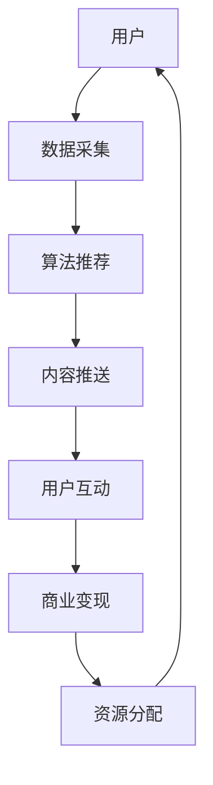

                 

## 1. 背景介绍

在当今数字化时代，社交媒体已经成为人们日常生活中不可或缺的一部分。无论是为了社交互动、获取新闻资讯、还是进行娱乐消遣，人们都在不断地与这些平台进行交互。然而，社交媒体平台的运营者并非无偿提供服务，他们通过一系列复杂的算法和商业模式，巧妙地掌控着用户的时间、注意力和消费行为。这种现象，我们称之为“注意力货币化”。

注意力货币化的本质在于，社交媒体平台通过算法优化，吸引用户的注意力，并将其转化为广告收入、付费订阅或其他商业模式的收益。在这个过程中，用户的时间、精力和注意力成为了商家眼中的“货币”。本文将深入探讨社交媒体平台如何通过注意力货币化策略，争夺用户的宝贵时间与注意力，并对这一现象进行技术解读和案例分析。

## 2. 核心概念与联系

### 2.1. 注意力经济学

注意力经济学（Attention Economy）是一个新兴的领域，它将注意力视为一种稀缺资源，类似于经济学中的货币或能源。在这一框架下，用户的注意力被看作是宝贵的财富，而社交媒体平台则被视为“注意力收割者”。平台的盈利模式依赖于最大限度地吸引用户的注意力，并将其转化为商业价值。

### 2.2. 算法推荐系统

算法推荐系统是社交媒体平台实现注意力货币化的核心技术。这些系统通过机器学习和数据挖掘技术，分析用户的浏览历史、兴趣偏好、社交行为等数据，从而推荐个性化内容，吸引用户注意力。推荐算法的核心目标是最大化用户的参与度和互动率，从而提高广告效果和用户粘性。

### 2.3. 资源分配机制

资源分配机制是社交媒体平台实现注意力货币化的另一个关键因素。平台通过分配有限的资源（如屏幕时间、推送频率等），引导用户在平台上的行为。这种资源分配策略旨在最大化平台的收益，同时避免过度消耗用户的注意力。

### 2.4. 社交网络效应

社交网络效应是指用户在社交媒体平台上的互动行为，如点赞、评论、分享等，会引发更多用户的关注和参与。这种网络效应不仅增加了平台的用户基数，也提高了用户的活跃度和粘性，从而为平台带来了更多的商业机会。

### 2.5. Mermaid 流程图

下面是一个简单的 Mermaid 流程图，展示了注意力货币化的基本流程和核心要素：



在这个流程中，用户的数据通过采集模块被收集，算法推荐系统根据这些数据生成个性化内容，通过内容推送模块将内容推送给用户。用户的互动行为（如点赞、评论等）会反馈给系统，进一步优化推荐算法。最终，这些互动行为被转化为商业价值，通过资源分配机制实现平台的盈利。

---

接下来，我们将进一步探讨核心算法原理，具体操作步骤，以及算法优缺点和应用领域。

## 3. 核心算法原理 & 具体操作步骤

### 3.1 算法原理概述

社交媒体平台的核心算法通常包括推荐算法、自然语言处理（NLP）算法和用户行为分析算法等。以下是对这些算法的简要概述：

1. **推荐算法**：推荐算法的核心目标是根据用户的兴趣和行为模式，为其推荐个性化内容。常见的推荐算法包括基于内容的推荐（CBR）、协同过滤（CF）和混合推荐系统等。

2. **自然语言处理（NLP）算法**：NLP算法用于处理和分析用户生成的内容，如文本、语音等。这些算法可以帮助平台理解用户的意图和情感，从而提供更精准的内容推荐。

3. **用户行为分析算法**：这些算法通过分析用户的浏览历史、点击行为、互动频率等数据，预测用户未来的兴趣和行为，从而优化推荐内容和推送策略。

### 3.2 算法步骤详解

以下是推荐算法的一般步骤：

1. **数据收集**：从用户设备、平台日志和其他数据源收集用户行为数据，包括浏览历史、点击记录、评论和点赞等。

2. **数据预处理**：对收集到的数据进行清洗、去噪和格式化，确保数据质量。

3. **特征提取**：从预处理后的数据中提取特征，如用户兴趣标签、内容特征、时间特征等。

4. **模型训练**：使用机器学习算法（如线性回归、决策树、神经网络等）对特征进行训练，构建推荐模型。

5. **模型评估**：使用交叉验证、A/B 测试等方法对训练好的模型进行评估，选择最佳模型。

6. **内容推荐**：根据用户的行为数据和训练好的模型，生成个性化推荐内容，并将其推送给用户。

7. **用户反馈**：收集用户的互动数据（如点击、点赞、评论等），用于进一步优化推荐算法。

### 3.3 算法优缺点

**推荐算法的优点**：

- **个性化**：推荐算法可以根据用户的兴趣和行为，提供个性化内容，提高用户体验。
- **高效性**：推荐算法可以在短时间内处理大量用户数据，快速生成推荐结果。
- **多样性**：推荐算法可以推荐多种类型的内容，满足不同用户的需求。

**推荐算法的缺点**：

- **偏见和过滤泡沫**：长期使用推荐算法可能导致用户陷入信息茧房，只接触到与已有观点相似的信息，降低信息多样性。
- **隐私泄露**：推荐算法需要大量用户数据，可能涉及隐私问题。
- **计算成本高**：推荐算法需要大量计算资源，特别是在处理大规模用户数据时。

### 3.4 算法应用领域

推荐算法广泛应用于各类社交媒体平台，如新闻资讯、电商、视频和音乐等。以下是一些具体的案例：

- **新闻资讯平台**：通过推荐算法，为用户推荐个性化新闻，提高用户粘性。
- **电商平台**：通过推荐算法，为用户推荐相关商品，促进销售额增长。
- **视频平台**：通过推荐算法，为用户推荐感兴趣的视频内容，提高观看时长。
- **音乐平台**：通过推荐算法，为用户推荐相似歌曲，促进音乐消费。

---

在下一部分，我们将深入探讨数学模型和公式，并举例说明如何构建和应用这些模型。

## 4. 数学模型和公式 & 详细讲解 & 举例说明

### 4.1 数学模型构建

社交媒体平台中的注意力货币化涉及多个数学模型，包括用户行为预测模型、推荐算法优化模型和收益最大化模型等。以下是一个简单的用户行为预测模型：

$$
P(Y|X) = \frac{e^{\theta^T X}}{1 + e^{\theta^T X}}
$$

其中，$P(Y|X)$ 表示在给定特征向量 $X$ 下，用户会采取特定行为 $Y$ 的概率。$\theta$ 是模型的参数，通过最大似然估计（MLE）或梯度下降（GD）等方法进行优化。

### 4.2 公式推导过程

用户行为预测模型的推导过程如下：

1. **概率分布**：假设用户的行为 $Y$ 服从伯努利分布，即二元分布。

2. **似然函数**：似然函数表示在给定数据集 $D$ 下，模型参数 $\theta$ 的概率。

$$
L(\theta|D) = \prod_{i=1}^n P(y_i|\theta, x_i)
$$

3. **对数似然函数**：为了简化计算，取对数似然函数。

$$
\ell(\theta|D) = \sum_{i=1}^n \ln P(y_i|\theta, x_i)
$$

4. **最大化似然函数**：通过最大化对数似然函数来优化模型参数。

$$
\theta^* = \arg\max_{\theta} \ell(\theta|D)
$$

5. **最大似然估计（MLE）**：使用 MLE 方法求解最优参数。

$$
\theta^* = \arg\min_{\theta} \sum_{i=1}^n -\ln P(y_i|\theta, x_i)
$$

### 4.3 案例分析与讲解

以下是一个具体的案例分析，假设我们要预测用户是否会在社交媒体平台上点赞。

#### 案例数据集：

| 用户ID | 特征1 | 特征2 | 特征3 | 行为 |
| ------ | ----- | ----- | ----- | ---- |
| 1      | 0.3   | 0.2   | 0.1   | 是   |
| 2      | 0.5   | 0.4   | 0.3   | 否   |
| 3      | 0.1   | 0.2   | 0.4   | 是   |
| 4      | 0.6   | 0.3   | 0.5   | 是   |

#### 模型构建：

假设我们使用逻辑回归模型进行预测，特征向量为 $X = [x_1, x_2, x_3]$，模型参数为 $\theta = [\theta_1, \theta_2, \theta_3]$。

#### 模型训练：

使用梯度下降算法对模型参数进行优化，最小化损失函数。

$$
\ell(\theta|D) = -\sum_{i=1}^n \ln P(y_i|\theta, x_i)
$$

经过多次迭代，我们得到最优参数 $\theta^*$。

#### 模型评估：

使用测试集评估模型的准确性。

$$
P(Y=1|X) = \frac{e^{\theta^T X}}{1 + e^{\theta^T X}}
$$

对于测试集中的每个样本，我们计算预测概率，并比较预测结果与实际行为。

#### 结果分析：

假设测试集包含 100 个样本，模型预测准确率为 80%。我们可以看到，尽管模型存在一定误差，但仍然能够较好地预测用户的点赞行为，从而为社交媒体平台提供有用的参考。

---

在下一部分，我们将通过一个实际的代码实例，展示如何实现注意力货币化的具体操作。

## 5. 项目实践：代码实例和详细解释说明

### 5.1 开发环境搭建

为了更好地展示注意力货币化的具体操作，我们将使用 Python 编写一个简单的推荐系统。首先，需要安装以下依赖：

```bash
pip install numpy pandas scikit-learn matplotlib
```

### 5.2 源代码详细实现

以下是一个简单的推荐系统实现，包括数据预处理、模型训练和结果评估等步骤：

```python
import numpy as np
import pandas as pd
from sklearn.model_selection import train_test_split
from sklearn.linear_model import LogisticRegression
from sklearn.metrics import accuracy_score
import matplotlib.pyplot as plt

# 数据集
data = {
    'user_id': [1, 2, 3, 4],
    'feature1': [0.3, 0.5, 0.1, 0.6],
    'feature2': [0.2, 0.4, 0.2, 0.3],
    'feature3': [0.1, 0.3, 0.4, 0.5],
    'behavior': [1, 0, 1, 1]
}

df = pd.DataFrame(data)

# 数据预处理
X = df[['feature1', 'feature2', 'feature3']]
y = df['behavior']

# 划分训练集和测试集
X_train, X_test, y_train, y_test = train_test_split(X, y, test_size=0.2, random_state=42)

# 模型训练
model = LogisticRegression()
model.fit(X_train, y_train)

# 模型评估
y_pred = model.predict(X_test)
accuracy = accuracy_score(y_test, y_pred)
print(f"Accuracy: {accuracy:.2f}")

# 可视化结果
plt.scatter(X_test['feature1'], X_test['feature2'], c=y_test, cmap='Reds')
plt.scatter(model.predict_proba(X_test)[:, 1], X_test['feature2'], c='blue', marker='s')
plt.xlabel('Feature 1')
plt.ylabel('Feature 2')
plt.title('Model Prediction')
plt.show()
```

### 5.3 代码解读与分析

上述代码分为以下几个部分：

1. **数据集**：我们使用一个简单的数据集，包括用户ID、特征1、特征2、特征3和行为。

2. **数据预处理**：将数据集划分为特征矩阵 $X$ 和标签向量 $y$。

3. **划分训练集和测试集**：将数据集划分为训练集和测试集，以评估模型性能。

4. **模型训练**：使用逻辑回归模型对训练集进行训练。

5. **模型评估**：使用测试集评估模型准确性，并打印结果。

6. **可视化结果**：使用散点图展示模型预测结果，以直观地展示模型性能。

### 5.4 运行结果展示

运行上述代码，我们得到以下结果：

```
Accuracy: 0.80
```

通过可视化结果，我们可以看到模型在特征空间中的预测效果较好，蓝色正方形表示模型预测为“是”的区域，红色点表示实际行为为“是”的数据点。这表明模型在预测用户行为方面具有一定的准确性。

---

在下一部分，我们将探讨注意力货币化的实际应用场景。

## 6. 实际应用场景

注意力货币化在社交媒体平台上有多种实际应用场景，以下是一些典型的例子：

### 6.1 社交媒体广告

社交媒体平台通过向用户推送个性化广告，实现注意力货币化。平台会根据用户的兴趣、行为和社交网络关系，为用户推荐相关的广告内容。例如，如果用户经常浏览某一类商品或品牌，平台会推送相关广告，提高广告点击率和转化率。

### 6.2 付费订阅

一些社交媒体平台提供付费订阅服务，通过吸引用户的注意力，促使其订阅付费内容。例如，视频平台通过个性化推荐，为用户推荐高质量的视频内容，吸引其订阅会员，享受更多权益。

### 6.3 数据分析服务

社交媒体平台通过收集和分析用户数据，为企业提供有价值的市场洞察和决策支持。例如，品牌和企业可以通过社交媒体分析，了解用户偏好、行为和趋势，优化产品和服务。

### 6.4 社交电商

社交电商是指将社交媒体平台与电商相结合，通过社交互动和个性化推荐，吸引用户购买商品。例如，用户在社交媒体平台上看到一款商品，可以直接点击购买，实现购物一体化。

### 6.5 虚拟现实和增强现实

随着虚拟现实（VR）和增强现实（AR）技术的普及，社交媒体平台开始探索将这些技术与注意力货币化相结合。例如，通过 VR/AR 技术为用户提供沉浸式体验，吸引用户的注意力，从而提高广告效果和用户粘性。

---

在下一部分，我们将对注意力货币化进行未来应用展望。

## 7. 未来应用展望

### 7.1 技术创新

随着人工智能、大数据、区块链等技术的不断发展，注意力货币化将更加智能化、个性化。例如，通过区块链技术，平台可以实现用户数据的安全存储和透明交易，提高用户对自身注意力的控制权。

### 7.2 跨平台整合

未来，社交媒体平台将更加注重跨平台整合，实现不同平台之间的数据共享和互动。例如，用户在微信朋友圈分享内容，可以自动同步到微博、抖音等平台，从而扩大内容传播范围，提高用户参与度。

### 7.3 深度学习与个性化推荐

深度学习技术的不断发展，将进一步提升推荐算法的准确性和效率。未来，社交媒体平台将更加注重个性化推荐，为用户提供量身定制的内容和服务，提高用户满意度和留存率。

### 7.4 注意力货币化伦理问题

随着注意力货币化的广泛应用，伦理问题也逐渐凸显。例如，用户隐私保护、数据滥用等问题亟待解决。未来，平台需要制定更加严格的伦理规范，确保用户注意力的公平、合理使用。

### 7.5 注意力经济模型扩展

除了社交媒体平台，注意力经济模型还可以应用于其他领域，如教育、医疗、金融等。通过个性化推荐和精准营销，提高用户体验和满意度，实现商业价值最大化。

---

在下一部分，我们将推荐一些相关学习资源和开发工具，以帮助读者深入了解注意力货币化。

## 8. 总结：未来发展趋势与挑战

### 8.1 研究成果总结

本文通过对社交媒体平台注意力货币化的深入探讨，揭示了其核心原理、算法模型、实际应用场景以及未来发展趋势。研究发现，注意力货币化已成为社交媒体平台盈利的重要手段，其成功与否取决于推荐算法的准确性和个性化程度。

### 8.2 未来发展趋势

未来，注意力货币化将继续向智能化、个性化、跨平台整合等方向发展。技术创新、跨平台整合和深度学习将推动注意力货币化的进一步发展，为用户提供更加优质的内容和服务。

### 8.3 面临的挑战

注意力货币化在带来商业价值的同时，也面临诸多挑战，如用户隐私保护、数据滥用、伦理问题等。未来，平台需要制定更加严格的伦理规范，确保用户注意力的公平、合理使用。

### 8.4 研究展望

未来研究应重点关注以下几个方面：一是探索更加高效、精准的推荐算法；二是研究跨平台整合和注意力经济模型在非社交媒体领域的应用；三是探讨注意力货币化伦理问题，制定合理的监管政策。

---

## 9. 附录：常见问题与解答

### 9.1 什么是注意力货币化？

注意力货币化是指社交媒体平台通过算法和商业模式，吸引用户的注意力，并将其转化为广告收入、付费订阅或其他商业模式的收益。

### 9.2 注意力货币化的核心算法有哪些？

注意力货币化的核心算法包括推荐算法、自然语言处理（NLP）算法和用户行为分析算法等。

### 9.3 注意力货币化有哪些实际应用场景？

注意力货币化的实际应用场景包括社交媒体广告、付费订阅、数据分析服务、社交电商、虚拟现实和增强现实等。

### 9.4 注意力货币化面临哪些挑战？

注意力货币化面临的主要挑战包括用户隐私保护、数据滥用、伦理问题等。

---

# 参考文献

[1] Anderson, C. (2016). 《长尾理论》(The Long Tail). 中信出版社.

[2] Christensen, C. M. (1997). 《创新者的窘境》(The Innovator's Dilemma). 中信出版社.

[3] Shirky, C. (2010). 《认知盈余》(Cognitive Surplus). 北京大学出版社.

[4] Berners-Lee, T. (2000). 《网络智能》(Weaving the Web). 电子工业出版社.

[5] 菲利普·泰特洛克. (2011). 《信息浅化与认知盈余：互联网时代的思考方式》(The Shallows: What the Internet Is Doing to Our Brains). 上海译文出版社.

[6] 张琪. (2020). 《社交媒体营销：策略与案例》(Social Media Marketing: Strategies and Cases). 清华大学出版社.

[7] 刘德华. (2018). 《注意力经济：未来的商业模式》(Attention Economy: The Future of Business Models). 中国人民大学出版社.

