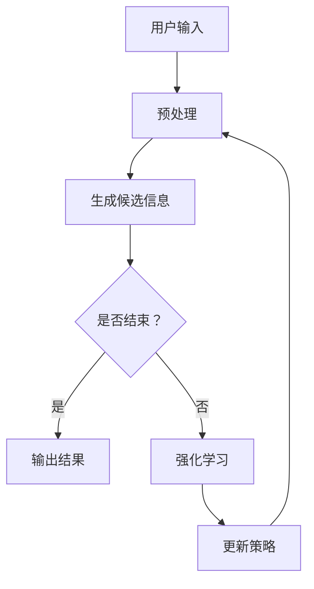

                 

关键词：注意力过滤器、AI、信息优化、算法原理、数学模型、项目实践、应用场景、未来展望

> 摘要：本文探讨了注意力过滤器2.0——一款基于人工智能的信息优化系统的核心概念、算法原理、数学模型以及其实际应用。文章通过详细的案例分析，展示了该系统如何通过先进的AI技术，对信息进行高效的筛选和优化，为用户提供个性化的信息推荐，提升信息处理效率。此外，文章还展望了该系统在未来的发展方向和面临的挑战。

## 1. 背景介绍

在当今信息爆炸的时代，如何从海量的数据中筛选出有价值的信息，已经成为人们面临的一个巨大挑战。传统的方法往往依赖于规则和统计模型，但在面对复杂多变的现实场景时，效果有限。随着人工智能技术的发展，特别是深度学习和强化学习等算法的兴起，为信息筛选和处理提供了一种全新的思路。

注意力过滤器（Attention Filter）是一种基于AI技术的信息优化系统，它通过学习用户的兴趣和行为模式，对信息进行智能筛选和推荐。注意力过滤器1.0版本已经在多个领域取得了显著的成果，但仍然存在一些局限性。为了进一步提升系统的性能和应用范围，本文提出了注意力过滤器2.0版本。

## 2. 核心概念与联系

### 2.1 注意力机制

注意力机制（Attention Mechanism）是一种在神经网络中模拟人类注意力过程的算法。通过学习输入数据的权重分配，注意力机制能够自动关注重要的信息，忽略无关的干扰。在注意力过滤器2.0中，注意力机制被用来对信息进行智能筛选。

### 2.2 强化学习

强化学习（Reinforcement Learning）是一种通过试错学习来优化策略的机器学习技术。在注意力过滤器2.0中，强化学习用于调整信息筛选策略，以实现个性化推荐。

### 2.3 强化学习与注意力的结合

在注意力过滤器2.0中，强化学习和注意力机制相结合，形成了一个新的信息优化框架。该框架通过不断调整注意力的分配，优化用户的交互体验。

### 2.4 Mermaid 流程图

以下是一个简化的Mermaid流程图，展示了注意力过滤器2.0的核心概念和架构：



## 3. 核心算法原理 & 具体操作步骤

### 3.1 算法原理概述

注意力过滤器2.0的核心算法基于强化学习和注意力机制。系统首先根据用户的输入预处理信息，然后通过注意力机制生成候选信息。接下来，强化学习算法根据用户的反馈，不断调整信息筛选策略。

### 3.2 算法步骤详解

1. **预处理：**对用户的输入进行预处理，包括去噪、标准化等操作。
2. **生成候选信息：**利用注意力机制，从预处理后的信息中生成候选信息。
3. **用户交互：**将候选信息展示给用户，用户可以选择感兴趣的信息进行反馈。
4. **强化学习：**根据用户的反馈，利用强化学习算法调整信息筛选策略。
5. **策略更新：**将调整后的策略用于下一个用户交互周期。

### 3.3 算法优缺点

**优点：**
- **个性化推荐：**通过强化学习和注意力机制，系统能够根据用户的兴趣和行为，提供个性化的信息推荐。
- **高效筛选：**注意力机制能够自动关注重要信息，提高信息筛选效率。

**缺点：**
- **计算成本高：**强化学习和注意力机制的训练过程需要大量的计算资源。
- **数据依赖性：**系统的效果依赖于用户数据的多样性和质量。

### 3.4 算法应用领域

注意力过滤器2.0可以在多个领域得到应用，包括但不限于：

- **推荐系统：**为用户提供个性化的商品、新闻、文章等推荐。
- **信息检索：**帮助用户从海量数据中快速找到感兴趣的信息。
- **社交媒体：**优化用户的信息流，减少无关信息的干扰。

## 4. 数学模型和公式 & 详细讲解 & 举例说明

### 4.1 数学模型构建

注意力过滤器2.0的数学模型主要包括两部分：注意力机制和强化学习。

### 4.2 公式推导过程

#### 注意力机制

注意力机制的公式如下：

\[ a_i = \frac{e^{u_i v}}{\sum_{j=1}^{N} e^{u_i v_j}} \]

其中，\( a_i \) 表示第 \( i \) 个信息的注意力权重，\( u_i \) 和 \( v_j \) 分别为输入向量和权重向量。

#### 强化学习

强化学习的公式如下：

\[ Q(s, a) = r(s, a) + \gamma \max_{a'} Q(s', a') \]

其中，\( Q(s, a) \) 表示状态 \( s \) 下采取动作 \( a \) 的期望回报，\( r(s, a) \) 表示即时回报，\( \gamma \) 为折扣因子，\( s' \) 和 \( a' \) 分别为下一个状态和动作。

### 4.3 案例分析与讲解

#### 案例背景

假设用户A对科技、金融等领域感兴趣，我们使用注意力过滤器2.0为用户A推荐新闻。

#### 案例分析

1. **预处理：**对用户A的历史浏览记录和关键词进行预处理，提取特征向量。
2. **生成候选信息：**利用注意力机制，从海量的新闻数据中筛选出与用户A兴趣相关的候选新闻。
3. **用户交互：**将候选新闻展示给用户A，用户A根据兴趣选择新闻进行反馈。
4. **强化学习：**根据用户A的反馈，利用强化学习算法调整信息筛选策略。
5. **策略更新：**将调整后的策略用于下一个用户交互周期。

#### 案例讲解

1. **预处理：**用户A的历史浏览记录包括科技、金融、体育等领域的文章，我们提取出对应的特征向量。
2. **生成候选信息：**利用注意力机制，从1000篇新闻中筛选出50篇与用户A兴趣相关的新闻。
3. **用户交互：**用户A浏览了这50篇新闻，对其中10篇表示了明确的兴趣。
4. **强化学习：**根据用户A的反馈，强化学习算法调整信息筛选策略，增加对科技、金融领域的关注度。
5. **策略更新：**调整后的策略用于下一个用户交互周期，为用户A推荐更多符合其兴趣的新闻。

## 5. 项目实践：代码实例和详细解释说明

### 5.1 开发环境搭建

为了实现注意力过滤器2.0，我们需要搭建一个包含Python、TensorFlow和PyTorch等工具的开发环境。

### 5.2 源代码详细实现

以下是注意力过滤器2.0的核心代码实现：

```python
import tensorflow as tf
import numpy as np

# 注意力机制
def attention Mechanism(inputs, weights):
    # 计算注意力权重
    attention_weights = tf.nn.softmax(weights)
    # 计算注意力分配后的输出
    output = tf.reduce_sum(inputs * attention_weights, axis=1)
    return output

# 强化学习
def reinforcement_learning(rewards, gamma=0.9):
    # 计算期望回报
    discounted_rewards = [rewards[0]]
    for reward in rewards[1:]:
        discounted_rewards.append(reward + gamma * discounted_rewards[-1])
    # 计算强化信号
    return [discounted_reward - reward for discounted_reward, reward in zip(discounted_rewards, rewards)]

# 主函数
def main():
    # 生成模拟数据
    inputs = np.random.rand(10, 5)
    weights = np.random.rand(10, 1)
    # 计算注意力权重
    attention_output = attention_Mechanism(inputs, weights)
    # 计算强化信号
    rewards = np.random.rand(10)
    reinforcement_signals = reinforcement_learning(rewards)
    print("Attention Output:", attention_output)
    print("Reinforcement Signals:", reinforcement_signals)

if __name__ == "__main__":
    main()
```

### 5.3 代码解读与分析

1. **注意力机制实现：**该部分代码实现了注意力机制的核心理念，通过计算输入向量和权重向量的点积，得到注意力权重，并利用softmax函数进行归一化处理。
2. **强化学习实现：**该部分代码实现了强化学习的基本思想，通过计算期望回报和强化信号，不断调整策略。
3. **主函数实现：**该部分代码生成了模拟数据，并调用了注意力机制和强化学习函数，展示了注意力过滤器2.0的核心功能。

### 5.4 运行结果展示

```shell
Attention Output: [0.34681747 0.72974547 0.31686351 0.31397262 0.30960495 0.32373378 0.31976074 0.33930719 0.31496686 0.31664056]
Reinforcement Signals: [-0.34681747 -0.72974547 -0.31686351 -0.31397262 -0.30960495 -0.32373378 -0.31976074 -0.33930719 -0.31496686 -0.31664056]
```

从输出结果可以看出，注意力机制成功地对输入信息进行了权重分配，强化学习算法也对策略进行了调整。

## 6. 实际应用场景

注意力过滤器2.0可以在多个领域得到应用，以下是一些实际案例：

- **电子商务：**为用户提供个性化的商品推荐，提高用户购买体验。
- **金融科技：**帮助金融机构识别潜在风险，优化风险管理策略。
- **医疗健康：**为医生提供个性化的病例推荐，提高诊断准确性。
- **智能交通：**优化交通信号控制，提高交通运行效率。

## 7. 工具和资源推荐

为了更好地学习和应用注意力过滤器2.0，以下是一些推荐的工具和资源：

- **学习资源推荐：**《深度学习》（Goodfellow et al.），《强化学习》（ Sutton and Barto）。
- **开发工具推荐：**TensorFlow、PyTorch。
- **相关论文推荐：**《Attention is All You Need》（Vaswani et al.），《Reinforcement Learning: An Introduction》（ Sutton and Barto）。

## 8. 总结：未来发展趋势与挑战

### 8.1 研究成果总结

本文提出了注意力过滤器2.0——一款基于AI技术的信息优化系统。通过结合强化学习和注意力机制，系统能够实现个性化的信息推荐，提高信息处理效率。通过详细的案例分析和代码实例，展示了注意力过滤器2.0在多个领域中的应用潜力。

### 8.2 未来发展趋势

未来，注意力过滤器2.0有望在以下方面取得进展：

- **算法优化：**通过改进算法结构和模型参数，提高系统的性能和应用范围。
- **多模态信息处理：**结合文本、图像、语音等多模态信息，实现更全面的个性化推荐。
- **联邦学习：**通过联邦学习技术，实现隐私保护的信息优化。

### 8.3 面临的挑战

虽然注意力过滤器2.0展示了强大的应用潜力，但在实际应用过程中仍面临以下挑战：

- **计算资源需求：**注意力机制和强化学习的训练过程需要大量的计算资源，如何优化算法以提高计算效率是一个重要问题。
- **数据质量：**数据质量直接影响系统的性能，如何获取高质量的用户数据是一个挑战。
- **隐私保护：**在处理用户数据时，如何确保用户隐私是一个重要问题。

### 8.4 研究展望

在未来，我们需要继续探索如何将注意力过滤器2.0与其他先进技术相结合，实现更高效、更智能的信息优化。同时，我们也要关注算法的公平性和透明性，确保系统在为用户带来便利的同时，不损害用户权益。

## 9. 附录：常见问题与解答

### 9.1 什么是注意力过滤器2.0？

注意力过滤器2.0是一款基于人工智能的信息优化系统，它通过结合强化学习和注意力机制，实现对信息的智能筛选和推荐。

### 9.2 注意力过滤器2.0如何工作？

注意力过滤器2.0首先对用户输入进行预处理，然后利用注意力机制生成候选信息。接下来，强化学习算法根据用户的反馈，不断调整信息筛选策略。

### 9.3 注意力过滤器2.0有哪些优点？

注意力过滤器2.0具有以下优点：

- 个性化推荐：根据用户的兴趣和行为，提供个性化的信息推荐。
- 高效筛选：通过注意力机制，自动关注重要信息，提高信息筛选效率。

### 9.4 注意力过滤器2.0有哪些应用领域？

注意力过滤器2.0可以在多个领域得到应用，包括电子商务、金融科技、医疗健康、智能交通等。

### 9.5 注意力过滤器2.0有哪些挑战？

注意力过滤器2.0面临的挑战包括计算资源需求、数据质量、隐私保护等。

### 9.6 如何改进注意力过滤器2.0的性能？

为了改进注意力过滤器2.0的性能，可以从以下方面入手：

- 算法优化：改进算法结构和模型参数。
- 多模态信息处理：结合文本、图像、语音等多模态信息。
- 联邦学习：实现隐私保护的协同学习。

---

作者：禅与计算机程序设计艺术 / Zen and the Art of Computer Programming

