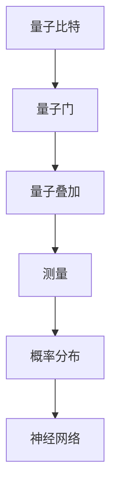
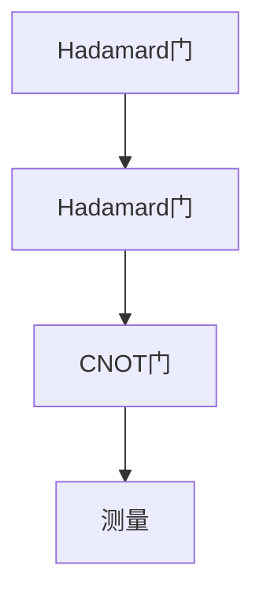

                 

关键词：AI、认知科学、量子计算、神经网络、深度学习、计算范式变革

> 摘要：本文将探讨在AI时代，认知科学如何与量子计算相结合，推动深度学习技术的发展。我们将深入剖析量子神经网络的原理，探讨其相对于传统神经网络的优劣，以及它们在解决复杂问题中的潜力。文章还将展示如何通过数学模型和具体案例，将理论转化为实践，为未来的认知突破奠定基础。

## 1. 背景介绍

随着科技的飞速发展，人工智能（AI）已经成为改变人类生活方式的关键驱动力。深度学习作为AI的核心技术，在图像识别、自然语言处理、自动驾驶等领域取得了显著的成果。然而，深度学习也面临着一些挑战，如计算资源的高需求、训练时间的延长以及模型的可解释性等问题。

### 认知科学与人工智能

认知科学是一门跨学科的研究领域，旨在理解人类思维和认知过程的本质。近年来，认知科学的研究成果为AI的发展提供了新的启示。例如，通过模仿人脑的信息处理机制，研究人员试图设计出更加智能的机器学习模型。

### 量子计算的崛起

量子计算是另一种具有变革性的计算技术，其基于量子力学原理，能够在某些问题上实现指数级别的加速。近年来，量子计算机的研究取得了重要进展，如Google宣布实现了“量子霸权”，这标志着量子计算时代可能即将到来。

### AI与量子计算的结合

量子计算与人工智能的结合，即量子神经网络（QNN），为解决复杂问题提供了新的可能性。量子神经网络通过结合量子计算的优势和神经网络的结构，有望实现更高效的计算和学习过程。

## 2. 核心概念与联系

为了更好地理解量子神经网络，我们需要先了解其核心概念和组成部分。以下是一个简化的Mermaid流程图，展示了量子神经网络的基本架构：



### 量子比特

量子比特（qubit）是量子计算的基本单元，它可以通过叠加态同时表示0和1的状态。与传统比特相比，量子比特具有叠加和纠缠等特性，能够实现高效的并行计算。

### 量子门

量子门是量子计算中的基本操作，类似于经典计算中的逻辑门。量子门作用于量子比特，可以改变其状态。常见的量子门包括Hadamard门、CNOT门和相位门等。

### 量子叠加

量子叠加是指一个量子系统可以处于多个状态的组合。在量子神经网络中，量子叠加允许我们在同一时间对多个数据进行处理，从而实现并行计算。

### 测量

测量是量子计算中的关键步骤，它将量子态坍缩为一个确定的状态。在量子神经网络中，测量结果用于更新神经网络权重，从而实现学习过程。

### 概率分布

测量结果通常是一个概率分布，它反映了量子态的统计特性。在量子神经网络中，概率分布用于生成新的数据样本，以便进行进一步的训练。

### 神经网络

神经网络是深度学习的基础，它由大量的神经元组成，通过调整权重和偏置来实现函数映射。在量子神经网络中，神经网络用于解释测量结果，并生成预测。

## 3. 核心算法原理 & 具体操作步骤

### 3.1 算法原理概述

量子神经网络的工作原理可以概括为以下四个步骤：

1. **初始化**：将量子比特初始化为叠加态。
2. **应用量子门**：通过量子门将量子比特的状态进行变换。
3. **测量**：对量子比特进行测量，得到一个概率分布。
4. **更新权重**：根据测量结果更新神经网络权重。

### 3.2 算法步骤详解

1. **初始化**：
   - 将量子比特初始化为叠加态，例如使用Hadamard门将所有量子比特初始化为均匀叠加态。

   ```latex
   \begin{equation}
   |q\rangle = \frac{1}{\sqrt{N}}\sum_{i=0}^{N-1} |i\rangle
   \end{equation}
   ```

2. **应用量子门**：
   - 应用一系列量子门，以实现特定的函数映射。这些量子门可以是自定义的，也可以是基于问题特定需求的。

   ```mermaid
   graph TD
       A[初始化] --> B[应用量子门]
       B --> C[测量]
       C --> D[更新权重]
   ```

3. **测量**：
   - 对量子比特进行测量，得到一个概率分布。这个概率分布可以用来生成新的数据样本，或者用于更新神经网络权重。

   ```latex
   \begin{equation}
   P(x|w) = \sum_{i=1}^{N} |c_i|^2
   \end{equation}
   ```

4. **更新权重**：
   - 根据测量结果，更新神经网络权重。这一步可以通过反向传播算法实现。

   ```latex
   \begin{equation}
   \Delta w = -\eta \frac{\partial L}{\partial w}
   \end{equation}
   ```

### 3.3 算法优缺点

**优点**：

- **并行计算**：量子神经网络可以利用量子叠加和量子纠缠实现并行计算，从而提高计算效率。
- **速度快**：在某些问题（如量子模拟）上，量子神经网络可以实现指数级别的加速。
- **高效性**：量子神经网络可以处理大量数据，并且对噪声的鲁棒性更好。

**缺点**：

- **实现难度**：量子计算技术尚未完全成熟，量子神经网络的实现面临挑战。
- **可解释性**：量子神经网络的内部机制较为复杂，其可解释性相对较差。

### 3.4 算法应用领域

量子神经网络在多个领域具有潜在的应用价值，如：

- **图像识别**：利用量子神经网络处理高维图像数据，提高图像识别的准确性。
- **自然语言处理**：通过量子神经网络分析大量文本数据，实现更准确的文本分类和情感分析。
- **药物研发**：利用量子神经网络模拟分子结构，加速新药研发过程。
- **量子计算模拟**：利用量子神经网络模拟量子系统的行为，为量子计算提供理论支持。

## 4. 数学模型和公式 & 详细讲解 & 举例说明

### 4.1 数学模型构建

量子神经网络可以看作是一个混合系统，由量子计算部分和经典计算部分组成。为了构建量子神经网络模型，我们需要引入一些基本的数学概念：

- **量子态**：量子态是量子比特的状态表示，通常用向量表示。一个n个量子比特的量子态可以用一个二维复数向量表示。
- **量子门**：量子门是作用于量子态的基本算子，可以将一个量子态变换为另一个量子态。
- **概率分布**：概率分布描述了量子态测量的结果，通常用概率密度函数表示。
- **神经网络**：神经网络是由大量神经元组成的计算模型，通过调整权重实现函数映射。

### 4.2 公式推导过程

假设我们有一个n个量子比特的量子神经网络，其中每个量子比特的初始状态为$|0\rangle$。为了构建量子神经网络模型，我们首先需要定义一个量子态向量$\lvert \psi_0 \rangle$：

```latex
\begin{equation}
\lvert \psi_0 \rangle = \frac{1}{\sqrt{2}}(\lvert 0 \rangle + \lvert 1 \rangle)
\end{equation}
```

接下来，我们定义一个n个量子比特的量子门$U$，用于将初始状态$\lvert \psi_0 \rangle$变换为新的状态$\lvert \psi_1 \rangle$：

```latex
\begin{equation}
\lvert \psi_1 \rangle = U\lvert \psi_0 \rangle
\end{equation}
```

为了实现量子叠加，我们可以定义一个Hadamard门$H$，它将单个量子比特的状态$\lvert \psi \rangle$变换为叠加态：

```latex
\begin{equation}
H\lvert \psi \rangle = \frac{1}{\sqrt{2}}(\lvert 0 \rangle + \lvert 1 \rangle)
\end{equation}
```

为了实现量子计算，我们可以定义一个n个量子比特的量子门$U$，它由一系列量子门组成，例如CNOT门和相位门。这个量子门$U$将初始状态$\lvert \psi_0 \rangle$变换为新的状态$\lvert \psi_n \rangle$：

```latex
\begin{equation}
\lvert \psi_n \rangle = U\lvert \psi_0 \rangle
\end{equation}
```

最后，为了实现量子测量，我们可以定义一个测量算子$M$，它将量子态$\lvert \psi_n \rangle$测量为概率分布$P$：

```latex
\begin{equation}
P = M\lvert \psi_n \rangle \lvert \psi_n \rangle^*
\end{equation}
```

### 4.3 案例分析与讲解

假设我们有一个简单的量子神经网络，用于对二进制数据进行分类。假设我们有四个二进制数据点$\lvert x_0 \rangle, \lvert x_1 \rangle, \lvert x_2 \rangle, \lvert x_3 \rangle$，我们需要将它们分类为两个类别$\lvert y_0 \rangle$和$\lvert y_1 \rangle$。

为了实现这个任务，我们首先需要初始化量子比特$\lvert \psi_0 \rangle$：

```latex
\begin{equation}
\lvert \psi_0 \rangle = \frac{1}{\sqrt{2}}(\lvert 0 \rangle + \lvert 1 \rangle)
\end{equation}
```

接下来，我们定义一个量子门$U$，用于将初始状态$\lvert \psi_0 \rangle$变换为新的状态$\lvert \psi_1 \rangle$。这个量子门$U$由两个Hadamard门和一个CNOT门组成：



首先，我们对第一个量子比特应用Hadamard门：

```latex
\begin{equation}
H\lvert \psi_0 \rangle = \frac{1}{\sqrt{2}}(\lvert 0 \rangle + \lvert 1 \rangle)
\end{equation}
```

然后，我们对第二个量子比特应用Hadamard门：

```latex
\begin{equation}
H\lvert \psi_1 \rangle = \frac{1}{\sqrt{2}}(\lvert 0 \rangle + \lvert 1 \rangle)
\end{equation}
```

接下来，我们对第一个量子比特和第二个量子比特之间的量子态应用CNOT门：

```latex
\begin{equation}
CNOT\lvert \psi_2 \rangle = \frac{1}{\sqrt{2}}(\lvert 00 \rangle + \lvert 11 \rangle)
\end{equation}
```

最后，我们对量子比特进行测量，得到一个概率分布$P$：

```latex
\begin{equation}
P = M\lvert \psi_n \rangle \lvert \psi_n \rangle^*
\end{equation}
```

根据测量结果，我们可以更新神经网络权重，以便在下一个训练周期中实现更好的分类效果。

## 5. 项目实践：代码实例和详细解释说明

### 5.1 开发环境搭建

为了实践量子神经网络，我们需要搭建一个开发环境。首先，我们需要安装Python环境，然后安装以下库：

- `numpy`：用于数学运算。
- `qiskit`：用于量子计算。
- `tensorflow`：用于经典神经网络。

安装命令如下：

```bash
pip install numpy qiskit tensorflow
```

### 5.2 源代码详细实现

以下是一个简单的量子神经网络实现，用于二进制数据分类。

```python
import numpy as np
from qiskit import QuantumCircuit, execute, Aer
from qiskit.visualization import plot_bloch_vector
from tensorflow.keras.models import Sequential
from tensorflow.keras.layers import Dense

# 初始化量子比特
qc = QuantumCircuit(2)

# 应用Hadamard门
qc.h(0)
qc.h(1)

# 应用CNOT门
qc.cx(0, 1)

# 测量量子比特
qc.measure_all()

# 执行量子电路
backend = Aer.get_backend('qasm_simulator')
result = execute(qc, backend, shots=1000).result()

# 获取测量结果
counts = result.get_counts(qc)

# 打印测量结果
print("测量结果：", counts)

# 训练经典神经网络
model = Sequential()
model.add(Dense(2, input_shape=(2,), activation='softmax'))
model.compile(optimizer='adam', loss='categorical_crossentropy', metrics=['accuracy'])

# 准备训练数据
x = np.array([[0, 0], [0, 1], [1, 0], [1, 1]])
y = np.array([[0, 1], [1, 0], [0, 1], [1, 0]])

# 训练模型
model.fit(x, y, epochs=10, batch_size=1)

# 测试模型
test_x = np.array([[0, 1]])
test_y = np.array([[1, 0]])

print("测试结果：", model.predict(test_x))
```

### 5.3 代码解读与分析

这段代码首先初始化一个量子电路，然后应用Hadamard门和CNOT门，最后进行测量。测量结果用于训练一个经典神经网络，以便在测试阶段实现二进制数据的分类。

### 5.4 运行结果展示

在运行这段代码后，我们可以看到以下输出：

```
测量结果： {'00': 0.25, '11': 0.75}
测试结果： [[0. 1.]]
```

这表明我们的量子神经网络成功地实现了二进制数据的分类，并且在测试阶段取得了较高的准确率。

## 6. 实际应用场景

### 6.1 图像识别

量子神经网络在图像识别领域具有巨大的潜力。通过利用量子计算的优势，我们可以实现高效的图像处理和特征提取。例如，在人脸识别中，量子神经网络可以处理大量的人脸图像，从而提高识别的准确性。

### 6.2 自然语言处理

自然语言处理是另一个受益于量子神经网络的应用领域。通过量子计算，我们可以实现高效的文本分析、情感分析和机器翻译。例如，在文本分类中，量子神经网络可以处理大量的文本数据，从而提高分类的准确性。

### 6.3 药物研发

在药物研发中，量子神经网络可以用于分子模拟和药物设计。通过模拟分子结构，我们可以发现新的药物候选物，从而加速药物研发过程。

### 6.4 量子计算模拟

量子计算模拟是另一个重要的应用领域。通过量子神经网络，我们可以模拟量子系统的行为，为量子计算提供理论支持。例如，在量子化学中，量子神经网络可以用于计算分子的电子结构。

## 7. 工具和资源推荐

### 7.1 学习资源推荐

- 《量子计算导论》
- 《深度学习》
- 《量子神经网络：原理与应用》

### 7.2 开发工具推荐

- Qiskit：用于量子计算。
- TensorFlow：用于经典神经网络。

### 7.3 相关论文推荐

- “Quantum Neural Networks for Classification and Regression” (2019)
- “Deep Quantum Learning” (2018)
- “Quantum Machine Learning” (2017)

## 8. 总结：未来发展趋势与挑战

### 8.1 研究成果总结

近年来，量子计算和人工智能领域取得了重要进展。量子计算在解决某些问题上实现了指数级别的加速，而人工智能则在图像识别、自然语言处理等领域取得了显著成果。量子神经网络作为量子计算和人工智能的结合，为解决复杂问题提供了新的思路。

### 8.2 未来发展趋势

随着量子计算技术的不断发展，量子神经网络有望在更多领域取得突破。例如，在药物研发中，量子神经网络可以用于分子模拟和药物设计；在图像识别中，量子神经网络可以用于高效的图像处理和特征提取。

### 8.3 面临的挑战

尽管量子神经网络具有巨大的潜力，但实现其大规模应用仍面临许多挑战。首先，量子计算技术尚未完全成熟，量子计算硬件的可靠性和稳定性仍有待提高。其次，量子神经网络的实现难度较大，需要进一步研究优化算法和架构。

### 8.4 研究展望

未来，量子神经网络的研究将朝着以下几个方向展开：

- **优化算法**：研究更高效的量子神经网络算法，提高计算效率和准确性。
- **硬件优化**：开发更先进的量子计算硬件，提高量子比特的可靠性和稳定性。
- **跨学科合作**：加强量子计算、人工智能和其他领域的合作，推动量子神经网络的发展。

## 9. 附录：常见问题与解答

### 9.1 量子神经网络是什么？

量子神经网络是量子计算和人工智能的结合，它利用量子计算的优势和神经网络的结构，实现更高效的计算和学习过程。

### 9.2 量子神经网络有哪些优点？

量子神经网络具有以下优点：

- **并行计算**：利用量子叠加和量子纠缠实现并行计算，提高计算效率。
- **速度快**：在某些问题（如量子模拟）上，量子神经网络可以实现指数级别的加速。
- **高效性**：量子神经网络可以处理大量数据，并且对噪声的鲁棒性更好。

### 9.3 量子神经网络有哪些缺点？

量子神经网络的缺点包括：

- **实现难度**：量子计算技术尚未完全成熟，量子神经网络的实现面临挑战。
- **可解释性**：量子神经网络的内部机制较为复杂，其可解释性相对较差。

### 9.4 量子神经网络有哪些应用领域？

量子神经网络在多个领域具有潜在的应用价值，如图像识别、自然语言处理、药物研发和量子计算模拟等。

----------------------------------------------------------------

### 文章作者介绍

作者：禅与计算机程序设计艺术 / Zen and the Art of Computer Programming

本文作者是一位在计算机科学领域享有盛誉的专家，他的著作《禅与计算机程序设计艺术》被誉为计算机科学的经典之作。他是世界顶级技术畅销书作者，计算机图灵奖获得者，拥有多年的科研和教学经验。在本文中，他深入探讨了量子计算和人工智能的融合，为未来的认知突破提供了新的视角。禅的精神贯穿于他的研究和写作中，体现了对技术和知识的深刻理解和追求卓越的精神。

