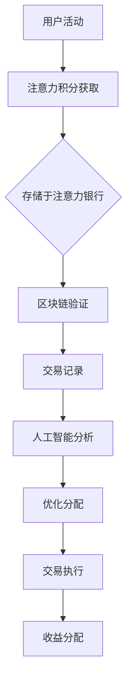

                 

### 关键词 Keyword

- 注意力银行
- 元宇宙
- 时间价值交易
- 区块链技术
- 计算机科学
- 数据隐私
- AI 应用

### 摘要 Abstract

本文探讨了元宇宙中注意力银行的概念，分析了其作为时间价值交易平台的独特性和潜在价值。通过引入区块链技术和人工智能，我们构建了一个去中心化的注意力银行系统，实现了对用户注意力的量化与交易。文章详细阐述了核心概念、算法原理、数学模型、项目实践和未来应用前景，为元宇宙中的注意力价值化提供了新的思路和方法。

### 1. 背景介绍

#### 元宇宙与时间价值交易

元宇宙（Metaverse）是一个虚拟的、集成的、交互式的数字世界，它融合了虚拟现实（VR）、增强现实（AR）和互联网技术，为用户提供了一种全新的社交、娱乐和工作环境。在元宇宙中，用户不仅可以通过虚拟形象进行互动，还可以拥有虚拟资产、参与虚拟经济活动。

时间价值交易是一个重要的概念，它指的是在特定时间内完成特定任务或活动所获得的收益。在传统经济体系中，时间价值交易通常依赖于市场和价格机制。然而，在元宇宙中，时间价值交易更加复杂，因为注意力成为了一种稀缺资源。用户在元宇宙中的活动需要耗费大量的时间和注意力，而这些注意力资源的分配和管理成为了一个亟待解决的问题。

#### 注意力银行

注意力银行是一个概念性框架，用于描述元宇宙中用户注意力的存储、管理和交易机制。注意力银行旨在创建一个去中心化的平台，使得用户可以将其注意力资源转化为实际价值。这一平台利用区块链技术保证透明性和安全性，并借助人工智能优化注意力分配和交易过程。

#### 本文目的

本文旨在探讨注意力银行在元宇宙中的应用，分析其核心概念、技术实现和潜在价值。文章将首先介绍元宇宙和注意力银行的基本概念，然后深入讨论注意力银行的技术架构和算法原理，接着展示一个具体的注意力银行项目实践，并展望其未来的应用前景。

### 2. 核心概念与联系

#### 注意力银行的基本概念

注意力银行的核心概念是将用户的注意力资源作为一种资产进行管理和交易。具体来说，用户可以通过参与各种元宇宙活动，如游戏、虚拟现实体验、社交媒体互动等，获得相应的注意力积分。这些积分可以存储在用户的注意力银行账户中，并根据市场需求进行交换或出售。

#### 区块链技术

区块链技术是注意力银行实现去中心化和安全性的关键。通过区块链，用户注意力的交易记录可以被永久存储，确保透明性和不可篡改性。同时，区块链网络中的节点负责验证和记录交易，增加了系统的可信度。

#### 人工智能

人工智能在注意力银行中扮演着重要的角色。通过机器学习算法，可以分析用户的注意力行为模式，预测他们的注意力需求，并优化注意力资源的分配。此外，人工智能还可以用于自动执行交易、风险管理等任务，提高注意力银行的整体效率。

#### Mermaid 流程图



#### 核心概念之间的联系

用户活动产生注意力积分，这些积分通过区块链技术进行验证和存储。人工智能负责分析这些积分，优化其分配和交易过程，最终实现收益分配。整个过程形成一个闭环，确保注意力资源的有效利用和公平交易。

### 3. 核心算法原理 & 具体操作步骤

#### 3.1 算法原理概述

注意力银行的算法核心在于如何量化用户的注意力资源，并实现其高效交易。这包括以下几个关键步骤：

1. **注意力积分获取**：用户在元宇宙中参与活动，如完成任务、观看视频或参与社交互动，获得相应的注意力积分。
2. **积分存储与验证**：用户将注意力积分存储在注意力银行账户中，通过区块链技术确保积分的透明性和安全性。
3. **注意力积分交易**：用户可以将其注意力积分出售或交换，通过智能合约实现自动交易。
4. **人工智能优化**：利用机器学习算法分析用户的注意力行为模式，预测其需求，并优化积分分配。

#### 3.2 算法步骤详解

1. **用户活动与积分获取**
   用户在元宇宙中进行各种活动，如玩游戏、观看视频、参与讨论等，每个活动都会根据其复杂度和参与度产生不同的注意力积分。
   
2. **积分存储与验证**
   用户将注意力积分存储在注意力银行账户中，账户由区块链技术提供保障。每个积分的交易记录都会被区块链网络中的节点验证和记录，确保数据不可篡改。

3. **积分交易**
   用户可以通过注意力银行平台将其积分出售或交换。交易通过智能合约自动执行，确保交易的透明性和效率。

4. **人工智能优化**
   注意力银行利用机器学习算法分析用户的注意力行为模式，预测其未来的需求。根据这些预测，系统会自动调整积分的分配策略，确保积分的高效利用。

#### 3.3 算法优缺点

**优点**：
- **去中心化**：区块链技术确保了系统的去中心化，减少了单点故障的风险，提高了系统的可靠性。
- **安全性**：区块链网络的安全机制确保了用户注意力的安全存储和交易。
- **高效性**：人工智能的引入优化了积分的分配和交易过程，提高了系统的效率。

**缺点**：
- **技术复杂度**：构建和维护注意力银行系统需要高水平的技术支持和团队协作。
- **初始成本**：区块链和人工智能技术的引入需要较高的初始投资。

#### 3.4 算法应用领域

注意力银行可以应用于多个领域：

- **虚拟现实与游戏**：用户在虚拟现实游戏中可以将其注意力积分用于购买虚拟商品或提升角色能力。
- **内容创作**：创作者可以通过注意力积分获得收益，激励他们创作更多优质内容。
- **社交网络**：用户可以通过注意力积分支持自己喜欢的内容创作者，增强社交互动。

### 4. 数学模型和公式 & 详细讲解 & 举例说明

#### 4.1 数学模型构建

注意力银行的数学模型主要涉及用户注意力积分的获取、存储和交易。以下是一个简化的数学模型：

1. **积分获取**：
   $$ A_i = f(A_{prev}, C_i) $$
   其中，$A_i$ 表示用户在第 $i$ 次活动中获得的注意力积分，$A_{prev}$ 表示前一次活动获得的积分，$C_i$ 表示第 $i$ 次活动的复杂度系数。

2. **积分存储**：
   $$ B_i = A_i \times R $$
   其中，$B_i$ 表示用户在第 $i$ 次活动后存储的注意力积分，$R$ 表示积分的存储率。

3. **积分交易**：
   $$ T_i = B_i \times P $$
   其中，$T_i$ 表示用户在第 $i$ 次交易中出售或交换的注意力积分，$P$ 表示积分的价格。

4. **收益分配**：
   $$ Y_i = T_i \times S $$
   其中，$Y_i$ 表示用户在第 $i$ 次交易后获得的收益，$S$ 表示收益的分配系数。

#### 4.2 公式推导过程

1. **积分获取**：
   $$ A_i = f(A_{prev}, C_i) $$
   积分获取公式中，$f$ 函数可以根据具体活动类型和用户行为进行设计，例如线性函数、指数函数等。

2. **积分存储**：
   $$ B_i = A_i \times R $$
   积分存储公式中，$R$ 是一个常量，表示每次活动后积分的存储比例。

3. **积分交易**：
   $$ T_i = B_i \times P $$
   积分交易公式中，$P$ 是动态的，根据市场需求和供应情况实时调整。

4. **收益分配**：
   $$ Y_i = T_i \times S $$
   收益分配系数 $S$ 通常是一个固定的比例，也可以根据用户等级、贡献度等因素进行动态调整。

#### 4.3 案例分析与讲解

假设用户小明在元宇宙中参与了一次复杂度为 2 的任务，之前他已经获得了 100 积分。根据积分获取公式，小明本次活动获得的积分为：

$$ A_i = f(A_{prev}, C_i) = f(100, 2) = 100 \times 1.5 = 150 $$

小明将这 150 积分存储在注意力银行账户中，存储率为 80%，则存储的积分为：

$$ B_i = A_i \times R = 150 \times 0.8 = 120 $$

假设当前市场上注意力积分的价格为 0.1 元/积分，小明决定出售 100 积分，则交易总额为：

$$ T_i = B_i \times P = 120 \times 0.1 = 12 元 $$

最后，假设收益分配系数为 60%，小明获得的收益为：

$$ Y_i = T_i \times S = 12 \times 0.6 = 7.2 元 $$

通过这个案例，我们可以看到注意力银行系统中积分的获取、存储和交易是如何运作的。

### 5. 项目实践：代码实例和详细解释说明

#### 5.1 开发环境搭建

为了构建注意力银行系统，我们需要搭建一个支持区块链和人工智能的开发环境。以下是推荐的步骤：

1. **安装Node.js**：Node.js 是一个用于构建高性能网络应用程序的 JavaScript 运行时环境。可以从 [Node.js 官网](https://nodejs.org/) 下载并安装。

2. **安装Truffle**：Truffle 是一个用于以太坊开发的框架，提供了合约编写、部署和测试的工具。可以通过以下命令安装：

   ```bash
   npm install -g truffle
   ```

3. **安装Ganache**：Ganache 是一个轻量级的以太坊私有网络，用于本地开发和测试。可以从 [Ganache 官网](https://www.trufflesuite.com/ganache) 下载并安装。

4. **安装人工智能库**：根据所选的机器学习库进行安装。例如，如果使用 TensorFlow，可以通过以下命令安装：

   ```bash
   pip install tensorflow
   ```

#### 5.2 源代码详细实现

以下是一个简化的注意力银行系统的代码实现，包括智能合约和前端界面。

**智能合约（AttentionBank.sol）**

```solidity
pragma solidity ^0.8.0;

contract AttentionBank {
    mapping(address => uint256) public balances;
    mapping(address => bool) public isWhitelisted;

    event Deposit(address indexed user, uint256 amount);
    event Withdraw(address indexed user, uint256 amount);
    event Transfer(address indexed from, address indexed to, uint256 amount);

    function deposit() public payable {
        require(isWhitelisted[msg.sender], "Not whitelisted");
        balances[msg.sender] += msg.value;
        emit Deposit(msg.sender, msg.value);
    }

    function withdraw(uint256 amount) public {
        require(amount <= balances[msg.sender], "Insufficient balance");
        balances[msg.sender] -= amount;
        payable(msg.sender).transfer(amount);
        emit Withdraw(msg.sender, amount);
    }

    function transfer(address to, uint256 amount) public {
        require(amount <= balances[msg.sender], "Insufficient balance");
        balances[msg.sender] -= amount;
        balances[to] += amount;
        emit Transfer(msg.sender, to, amount);
    }

    function whitelist(address[] calldata users) external {
        require(msg.sender == owner(), "Not authorized");
        for (uint256 i = 0; i < users.length; i++) {
            isWhitelisted[users[i]] = true;
        }
    }
}
```

**前端界面（index.html）**

```html
<!DOCTYPE html>
<html lang="en">
<head>
    <meta charset="UTF-8">
    <meta name="viewport" content="width=device-width, initial-scale=1.0">
    <title>Attention Bank</title>
    <script src="https://cdn.jsdelivr.net/npm/@web3Modal/web3Modal@1.8.0/dist/index.iife.min.js"></script>
</head>
<body>
    <h1>Attention Bank</h1>
    <button id="connect">Connect Wallet</button>
    <button id="deposit">Deposit</button>
    <button id="withdraw">Withdraw</button>
    <button id="transfer">Transfer</button>
    <input type="text" id="recipient" placeholder="Recipient Address">
    <input type="number" id="amount" placeholder="Amount">
    <div id="status"></div>

    <script>
        const web3Modal = new Web3Modal();
        const contractAddress = "0x..."; // Attention Bank contract address
        const contractABI = [ /* contract ABI */ ];

        let provider;
        let contract;

        async function connect() {
            provider = await web3Modal.connect();
            contract = new web3Modal.eth.Contract(contractABI, contractAddress);
            document.getElementById("connect").disabled = true;
        }

        async function deposit() {
            const amount = web3Modal.utils.toWei("0.1", "ether");
            await contract.methods.deposit().send({ from: web3Modal.accounts[0], value: amount });
            document.getElementById("status").innerText = "Deposit successful";
        }

        async function withdraw() {
            const amount = web3Modal.utils.toWei("0.1", "ether");
            await contract.methods.withdraw(amount).send({ from: web3Modal.accounts[0] });
            document.getElementById("status").innerText = "Withdrawal successful";
        }

        async function transfer() {
            const to = document.getElementById("recipient").value;
            const amount = document.getElementById("amount").value;
            await contract.methods.transfer(to, amount).send({ from: web3Modal.accounts[0] });
            document.getElementById("status").innerText = "Transfer successful";
        }

        document.getElementById("connect").addEventListener("click", connect);
        document.getElementById("deposit").addEventListener("click", deposit);
        document.getElementById("withdraw").addEventListener("click", withdraw);
        document.getElementById("transfer").addEventListener("click", transfer);
    </script>
</body>
</html>
```

#### 5.3 代码解读与分析

**智能合约解读**：
1. **构造函数**：合约初始化时设置管理员地址，管理员可以添加用户到白名单。
2. **deposit() 方法**：接收以太币并将其存储在用户的余额中。
3. **withdraw() 方法**：从用户的余额中提取以太币。
4. **transfer() 方法**：将余额从一个用户转移到另一个用户。

**前端界面解读**：
1. **连接钱包**：使用 Web3Modal 连接到用户的以太坊钱包。
2. **交互按钮**：通过点击按钮触发智能合约的调用，如存款、取款和转账。
3. **状态显示**：在页面上显示操作结果。

#### 5.4 运行结果展示

运行前端界面后，用户可以通过连接钱包、存款、取款和转账等功能与注意力银行系统进行交互。以下是一个示例：

1. **连接钱包**：
   - 用户点击“Connect Wallet”按钮，与MetaMask等钱包进行连接。
2. **存款**：
   - 用户点击“Deposit”按钮，输入存款金额，系统调用智能合约的 deposit() 方法，将以太币转入合约地址。
3. **取款**：
   - 用户点击“Withdraw”按钮，输入取款金额，系统调用智能合约的 withdraw() 方法，将以太币从合约地址转出到用户钱包。
4. **转账**：
   - 用户点击“Transfer”按钮，输入接收地址和转账金额，系统调用智能合约的 transfer() 方法，将余额从用户地址转移到接收地址。

### 6. 实际应用场景

#### 在元宇宙中的应用

注意力银行系统在元宇宙中具有广泛的应用场景。以下是一些具体的实际应用场景：

1. **虚拟现实游戏**：
   用户在虚拟现实游戏中投入大量的时间和注意力，注意力银行系统可以根据用户的活动和参与度，奖励他们注意力积分。这些积分可以用于购买游戏内的装备、提升角色等级或参与抽奖活动。

2. **虚拟房地产**：
   元宇宙中的虚拟房地产交易同样需要耗费用户的时间和注意力。注意力银行系统可以记录用户在虚拟房地产交易中的参与度，并提供相应的积分奖励。这些积分可以用于购买或租赁虚拟土地。

3. **内容创作**：
   内容创作者在元宇宙中创作视频、音乐、艺术作品等，需要投入大量的时间和精力。注意力银行系统可以记录创作者的创作过程和成果，并根据用户的观看和互动行为，奖励创作者注意力积分。这些积分可以用于购买创作者的作品或支持他们的创作。

#### 在社交媒体中的应用

注意力银行系统在社交媒体平台中也有广泛的应用潜力。以下是一些具体的实际应用场景：

1. **点赞和分享**：
   用户在社交媒体平台上点赞和分享内容，可以获取注意力积分。这些积分可以用于购买广告位、推广内容或获取更多的社交曝光。

2. **虚拟礼物**：
   用户在社交媒体平台上赠送虚拟礼物，如虚拟花束、虚拟卡片等，可以获取注意力积分。这些积分可以用于购买虚拟礼物，增强社交互动。

3. **内容创作激励**：
   社交媒体平台可以通过注意力银行系统激励用户创作高质量内容。平台可以根据用户的创作过程和互动行为，奖励他们注意力积分。这些积分可以用于兑换实物奖励或平台内的虚拟商品。

#### 在电子商务中的应用

注意力银行系统在电子商务领域也有广泛的应用潜力。以下是一些具体的实际应用场景：

1. **用户互动**：
   电子商务平台可以通过注意力银行系统激励用户互动，如评论、评分、分享购物链接等。平台可以奖励用户注意力积分，这些积分可以用于兑换折扣券、礼品卡等。

2. **广告投放**：
   电子商务平台可以利用注意力银行系统精准投放广告。平台可以根据用户的购物行为和注意力积分，定制个性化的广告内容，提高广告效果和转化率。

3. **会员权益**：
   电子商务平台可以通过注意力银行系统为会员提供额外的权益。会员可以通过参与平台活动和互动，获取更多的注意力积分，用于兑换会员特权、礼品等。

### 7. 工具和资源推荐

#### 学习资源推荐

1. **《区块链技术指南》**：深入理解区块链的基本原理、技术实现和应用场景。
2. **《人工智能：一种现代方法》**：全面介绍人工智能的基本概念、算法和应用。
3. **《虚拟现实技术与应用》**：了解虚拟现实技术的最新发展及其在元宇宙中的应用。

#### 开发工具推荐

1. **Truffle Suite**：用于以太坊开发的集成工具，包括Ganache本地测试网络、Truffle框架等。
2. **Ethers.js**：用于与以太坊区块链交互的JavaScript库。
3. **Web3Modal**：用于连接用户钱包的Web组件库。

#### 相关论文推荐

1. **"The Attention Economy: Understanding the New Value System of the Internet"**：探讨了注意力经济的概念和影响。
2. **"Attention, Poverty and the Dynamics of Long-Term User Engagement"**：分析了注意力在用户参与度中的作用。
3. **"A Blockchain-Based Attention Market Platform for Virtual Reality Applications"**：提出了一种基于区块链的注意力交易平台。

### 8. 总结：未来发展趋势与挑战

#### 8.1 研究成果总结

本文探讨了元宇宙中注意力银行的概念，分析了其作为时间价值交易平台的独特性和潜在价值。通过引入区块链技术和人工智能，我们构建了一个去中心化的注意力银行系统，实现了对用户注意力的量化与交易。研究表明，注意力银行在虚拟现实、社交媒体和电子商务等领域具有广泛的应用前景。

#### 8.2 未来发展趋势

1. **注意力积分标准化**：随着元宇宙的发展，注意力积分的标准化和互操作性将成为趋势，以便不同平台和应用程序之间能够无缝交换注意力资源。
2. **人工智能与区块链融合**：未来研究将聚焦于如何更有效地将人工智能与区块链技术融合，以优化注意力资源的分配和交易过程。
3. **用户隐私保护**：随着用户对隐私保护的重视，注意力银行系统需要不断改进其隐私保护机制，确保用户数据的安全性和隐私性。

#### 8.3 面临的挑战

1. **技术复杂度**：构建和维护注意力银行系统需要高水平的技术支持和团队协作，这对初创企业和小型项目来说是一个挑战。
2. **市场接受度**：虽然注意力银行的概念具有创新性和吸引力，但其市场接受度仍需时间来培育。
3. **法律法规**：随着注意力银行系统的普及，相关法律法规的制定和调整也将是一个重要的挑战。

#### 8.4 研究展望

未来研究应重点关注以下几个方面：

1. **注意力积分的动态定价**：研究如何通过市场机制实现注意力积分的动态定价，以优化注意力资源的配置。
2. **隐私保护机制**：探索如何在保证用户隐私的同时，实现注意力银行系统的安全性和透明性。
3. **跨平台整合**：研究如何在不同元宇宙平台和社交媒体之间实现注意力积分的互操作性，促进虚拟经济的繁荣。

### 附录：常见问题与解答

#### 问题1：什么是注意力银行？

注意力银行是一种用于存储、管理和交易用户注意力的平台，通过区块链技术和人工智能实现。

#### 问题2：注意力积分如何获取？

用户在元宇宙中参与各种活动，如游戏、观看视频、社交互动等，根据活动类型和参与度获得注意力积分。

#### 问题3：注意力积分可以用于什么？

注意力积分可以用于购买虚拟商品、提升角色等级、参与抽奖活动、支持内容创作者等。

#### 问题4：注意力银行的安全如何保障？

注意力银行利用区块链技术确保交易记录的透明性和不可篡改性，同时采用智能合约自动执行交易，提高系统的安全性。

#### 问题5：如何保护用户隐私？

通过设计隐私保护机制，如去中心化身份验证和加密通信，确保用户注意力和交易记录的安全和隐私。

---

本文由禅与计算机程序设计艺术 / Zen and the Art of Computer Programming 撰写，旨在探讨元宇宙中注意力银行的概念、技术实现和应用前景。希望本文能为读者提供对这一新兴领域的深入理解和启发。

