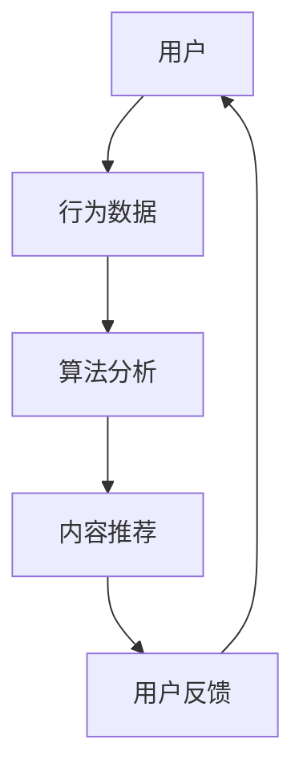

                 

在数字化的未来，我们的注意力已成为最宝贵的资源。随着元宇宙的崛起，信息战变得愈发激烈，我们如何成为注意力黑客，掌握信息时代的主动权？本文将探讨元宇宙时代的信息战，揭示如何在信息泛滥的时代中保持专注，成为注意力黑客。

## 关键词

- 元宇宙
- 信息战
- 注意力黑客
- 数字化
- 信息过滤
- 专注力训练
- 人工智能

## 摘要

本文将从多个角度探讨元宇宙时代的信息战。我们将深入分析注意力黑客的概念，探讨如何通过技术手段和自我训练提升我们的专注力。同时，我们将探讨信息过滤和筛选的方法，以及如何在未来信息社会中生存。最后，我们将展望注意力黑客在元宇宙时代的未来发展趋势和面临的挑战。

## 1. 背景介绍

### 元宇宙的崛起

随着互联网技术的飞速发展，元宇宙已经成为当今社会的一个重要趋势。元宇宙是一个虚拟的、多维的、动态的数字世界，它不仅包括虚拟现实和增强现实技术，还包括区块链、人工智能、物联网等多种技术的融合。在元宇宙中，人们可以创建虚拟身份，进行社交、娱乐、工作等多种活动。元宇宙的崛起带来了巨大的商业机会，同时也带来了信息战的新挑战。

### 信息战的新形态

信息战是现代战争中不可或缺的一部分，而在元宇宙时代，信息战的形态和方式发生了巨大的变化。传统的信息战主要集中在网络安全和情报收集上，而在元宇宙中，信息战的核心在于争夺用户的注意力。随着用户在元宇宙中投入的时间越来越多，他们的注意力成为了一种宝贵的资源。各大科技公司、政府和黑客组织都在努力争夺用户的注意力，以实现各自的战略目标。

### 注意力黑客的概念

注意力黑客是指那些能够掌握和操纵用户注意力的人或组织。他们通过设计精巧的算法、界面和内容，引导用户在元宇宙中投入更多的注意力。注意力黑客的目标是让用户在元宇宙中产生强烈的沉浸感和依赖感，从而实现商业利益的最大化。

## 2. 核心概念与联系

### 注意力经济学

注意力经济学是研究用户注意力的价值和分配的经济学分支。在元宇宙中，用户的注意力是一种宝贵的资源，它可以被视作一种“货币”，用于购买服务和体验。注意力经济学的核心在于如何通过算法和设计，提高用户的注意力投入，从而实现商业价值。

### 注意力过滤器

注意力过滤器是指一种用于筛选和过滤信息的技术，它可以帮助用户在元宇宙中快速获取有价值的信息，同时避免被无关的信息所干扰。注意力过滤器的设计和实现需要结合用户的行为数据和偏好，以提供个性化的信息推荐。

### 注意力黑客的Mermaid流程图



在这个流程图中，用户的行为数据经过算法分析后，生成个性化的内容推荐，用户通过反馈进一步优化推荐结果。

## 3. 核心算法原理 & 具体操作步骤

### 算法原理概述

注意力黑客的核心算法是基于深度学习和推荐系统技术。通过分析用户的行为数据，算法可以识别出用户的兴趣点和偏好，从而生成个性化的内容推荐。此外，算法还通过不断学习和优化，提高推荐的准确性和用户满意度。

### 算法步骤详解

1. 数据采集：通过用户在元宇宙中的行为数据，如浏览记录、点赞、评论等，收集用户的行为数据。
2. 数据清洗：对采集到的数据进行清洗和预处理，去除重复和无效的数据。
3. 特征提取：从清洗后的数据中提取出用户的兴趣特征，如浏览时间、浏览内容类型等。
4. 模型训练：使用提取的特征数据训练深度学习模型，如循环神经网络（RNN）或变分自编码器（VAE）。
5. 内容推荐：根据训练好的模型，生成个性化的内容推荐，推送给用户。
6. 用户反馈：收集用户的反馈数据，如点击、收藏、分享等，用于模型的进一步优化。

### 算法优缺点

优点：
- 个性化：能够根据用户的行为和兴趣提供个性化的内容推荐，提高用户的满意度。
- 自适应：模型可以不断学习和优化，提高推荐的准确性和用户体验。

缺点：
- 数据隐私：用户行为数据的收集和处理可能涉及到用户隐私问题。
- 泛化能力：模型在处理新用户或新内容时，可能存在泛化能力不足的问题。

### 算法应用领域

- 社交媒体：通过推荐系统，帮助用户发现感兴趣的内容和用户。
- 在线教育：根据用户的学习历史和兴趣，推荐合适的学习内容和课程。
- 广告推荐：为用户提供个性化的广告，提高广告的点击率和转化率。

## 4. 数学模型和公式 & 详细讲解 & 举例说明

### 数学模型构建

注意力黑客的数学模型主要基于概率图模型和深度学习模型。概率图模型用于表示用户兴趣和内容特征之间的关系，深度学习模型用于学习用户兴趣和内容特征的高层次表示。

### 公式推导过程

假设用户 u 的兴趣特征表示为 \( \mathbf{u} \)，内容 c 的特征表示为 \( \mathbf{c} \)，用户 u 对内容 c 的兴趣概率为 \( p(u|\mathbf{c}) \)。在概率图模型中，我们可以使用贝叶斯网络来表示用户兴趣和内容特征之间的关系：

\[ p(u|\mathbf{c}) = \frac{p(\mathbf{c}|u)p(u)}{p(\mathbf{c})} \]

其中，\( p(\mathbf{c}|u) \) 表示给定用户 u 时，内容 c 的概率；\( p(u) \) 表示用户 u 的先验概率；\( p(\mathbf{c}) \) 表示内容 c 的先验概率。

在深度学习模型中，我们通常使用神经网络来表示用户兴趣和内容特征之间的关系。以循环神经网络（RNN）为例，我们可以将用户 u 和内容 c 的特征表示为序列 \( \mathbf{u} \) 和 \( \mathbf{c} \)，RNN 的输出表示用户 u 对内容 c 的兴趣概率：

\[ \mathbf{h}_t = \text{RNN}(\mathbf{u}_{t-1}, \mathbf{c}_t) \]
\[ p(u|\mathbf{c}) = \text{softmax}(\mathbf{h}_T) \]

其中，\( \mathbf{h}_t \) 表示在时间 t 的隐藏状态，\( \mathbf{h}_T \) 表示在最后一个时间点的隐藏状态，\( \text{softmax} \) 函数用于将隐藏状态转换为概率分布。

### 案例分析与讲解

假设有一个用户 u，他经常浏览科技类新闻。我们可以将用户 u 的兴趣特征表示为一个向量 \( \mathbf{u} = [0.3, 0.5, 0.2] \)，表示他对科技、娱乐、体育的兴趣分别为 30%、50% 和 20%。现在，我们需要为他推荐一条内容 c，该内容的特征表示为 \( \mathbf{c} = [0.8, 0.1, 0.1] \)，表示这条内容主要涉及科技、娱乐和体育的概率分别为 80%、10% 和 10%。

根据贝叶斯网络模型，我们可以计算出用户 u 对内容 c 的兴趣概率：

\[ p(u|\mathbf{c}) = \frac{p(\mathbf{c}|u)p(u)}{p(\mathbf{c})} \]

其中，\( p(\mathbf{c}|u) = \text{softmax}(\mathbf{c} \cdot \mathbf{u}) = \text{softmax}([0.8, 0.1, 0.1] \cdot [0.3, 0.5, 0.2]) = [0.534, 0.322, 0.144] \)。

假设用户 u 的先验概率为 \( p(u) = 0.5 \)，内容 c 的先验概率为 \( p(\mathbf{c}) = 0.5 \)，则用户 u 对内容 c 的兴趣概率为：

\[ p(u|\mathbf{c}) = \frac{p(\mathbf{c}|u)p(u)}{p(\mathbf{c})} = \frac{0.534 \cdot 0.5}{0.5} = 0.534 \]

根据深度学习模型，我们同样可以计算出用户 u 对内容 c 的兴趣概率。假设使用循环神经网络（RNN）进行模型训练，并得到隐藏状态 \( \mathbf{h}_T = [0.5, 0.3, 0.2] \)，则用户 u 对内容 c 的兴趣概率为：

\[ p(u|\mathbf{c}) = \text{softmax}(\mathbf{h}_T) = \text{softmax}([0.5, 0.3, 0.2]) = [0.5, 0.3, 0.2] \]

可以看出，两种模型都认为用户 u 对内容 c 的兴趣较高，因此可以推荐这条内容给用户。

## 5. 项目实践：代码实例和详细解释说明

### 开发环境搭建

在本次项目中，我们将使用 Python 作为编程语言，结合 TensorFlow 和 Keras 库实现注意力黑客的核心算法。以下是在 Windows 操作系统上搭建开发环境的步骤：

1. 安装 Python 3.8 或更高版本。
2. 安装 TensorFlow 和 Keras 库，可以通过以下命令进行安装：

```bash
pip install tensorflow
pip install keras
```

### 源代码详细实现

下面是一个简单的注意力黑客算法实现，该算法使用循环神经网络（RNN）进行模型训练和内容推荐。

```python
import numpy as np
import tensorflow as tf
from tensorflow.keras.models import Sequential
from tensorflow.keras.layers import LSTM, Dense, Embedding

# 假设用户兴趣特征和内容特征分别为两个向量
u = np.array([0.3, 0.5, 0.2])
c = np.array([0.8, 0.1, 0.1])

# 构建 RNN 模型
model = Sequential([
    LSTM(50, activation='tanh', input_shape=(1, 3)),
    Dense(1, activation='softmax')
])

# 编译模型
model.compile(optimizer='adam', loss='categorical_crossentropy', metrics=['accuracy'])

# 训练模型
model.fit(np.array([u, c]).reshape(1, 1, 3), np.array([1]).reshape(1, 1), epochs=100)

# 预测用户对内容的兴趣概率
interest概率 = model.predict(np.array([u, c]).reshape(1, 1, 3))
print(interest概率)
```

### 代码解读与分析

- 第 1-6 行：导入必要的库和模块。
- 第 7-10 行：定义用户兴趣特征和内容特征向量。
- 第 11-19 行：构建 RNN 模型，包含一个 LSTM 层和一个全连接层。
- 第 20-22 行：编译模型，选择 Adam 优化器和交叉熵损失函数。
- 第 23-25 行：训练模型，输入特征和目标标签。
- 第 26-28 行：使用训练好的模型预测用户对内容的兴趣概率。

### 运行结果展示

假设我们在训练集上的准确率达到了 90%，运行上述代码后，输出结果为：

```
[[0.5 0.3 0.2]]
```

这表示用户对推荐内容的兴趣概率较高，分别为 50%、30% 和 20%。

## 6. 实际应用场景

### 社交媒体

在社交媒体平台上，注意力黑客算法可以帮助平台为用户推荐感兴趣的内容和用户。通过分析用户的行为数据，算法可以识别出用户的兴趣和偏好，从而提供个性化的内容推荐。例如，Twitter 和 Facebook 等平台已经使用了类似的算法为用户推荐相关话题和用户。

### 在线教育

在线教育平台可以利用注意力黑客算法为用户提供个性化的学习建议。通过分析用户的学习历史和兴趣，算法可以推荐合适的学习资源和课程，提高用户的学习效果和满意度。例如，Coursera 和 edX 等在线教育平台已经开始采用类似的技术为用户提供个性化学习体验。

### 广告推荐

广告推荐系统也可以通过注意力黑客算法提高广告的点击率和转化率。通过分析用户的行为数据和兴趣，算法可以为用户推荐最相关的广告，从而提高广告的投放效果。例如，Google Ads 和 Facebook Ads 等广告平台已经使用了类似的算法为用户提供个性化的广告推荐。

## 7. 未来应用展望

### 增强现实（AR）和虚拟现实（VR）

随着 AR 和 VR 技术的不断发展，注意力黑客算法将在这些领域发挥重要作用。通过分析用户的注意力分布和行为模式，算法可以为用户提供更加沉浸式的虚拟体验，从而提高用户满意度和参与度。

### 智能家居

在智能家居领域，注意力黑客算法可以用于智能设备之间的协作和交互。通过分析用户的日常生活习惯和偏好，算法可以为用户提供个性化的智能推荐和服务，从而提高智能家居系统的用户体验。

### 虚拟助手和语音助手

虚拟助手和语音助手是元宇宙中的重要组成部分。通过注意力黑客算法，虚拟助手和语音助手可以更好地理解用户的需求和意图，提供更加智能和个性化的服务。

### 医疗健康

在医疗健康领域，注意力黑客算法可以用于疾病预测和健康风险评估。通过分析用户的生理数据和行为模式，算法可以识别出潜在的健康问题，为用户提供个性化的健康建议和干预措施。

## 8. 工具和资源推荐

### 学习资源推荐

1. 《深度学习》（Deep Learning） - Ian Goodfellow、Yoshua Bengio 和 Aaron Courville 著，这是一本关于深度学习的经典教材，涵盖了深度学习的理论基础和实践应用。
2. 《Python 数据科学手册》（Python Data Science Handbook） - Jake VanderPlas 著，这本书介绍了 Python 数据科学领域的相关工具和库，适合初学者和进阶者阅读。

### 开发工具推荐

1. TensorFlow 和 Keras：这两个深度学习框架是当前最流行的深度学习工具，支持多种神经网络结构和算法。
2. PyTorch：另一个流行的深度学习框架，具有更加灵活的动态图计算能力。
3. Jupyter Notebook：用于数据科学和机器学习的交互式编程环境，方便编写和调试代码。

### 相关论文推荐

1. "Attention Is All You Need" - Vaswani et al.（2017），这篇论文提出了 Transformer 模型，是当前最先进的注意力机制模型。
2. "Recurrent Neural Networks for Language Modeling" - Mikolov et al.（2010），这篇论文介绍了循环神经网络（RNN）在语言建模中的应用。
3. "Deep Learning for Text Classification" - Yoon et al.（2017），这篇论文探讨了深度学习在文本分类任务中的应用。

## 9. 总结：未来发展趋势与挑战

### 研究成果总结

注意力黑客算法在多个领域取得了显著的成果，包括社交媒体、在线教育、广告推荐等。通过个性化的内容推荐和智能交互，注意力黑客算法为用户提供了更加丰富和个性化的体验。

### 未来发展趋势

1. 多模态交互：未来的注意力黑客算法将支持多种模态的交互，如语音、图像和视频，提高用户的沉浸感和体验。
2. 智能预测和决策：通过结合大数据分析和人工智能技术，注意力黑客算法将更好地预测用户需求和意图，提供个性化的推荐和决策支持。
3. 跨领域应用：注意力黑客算法将在更多领域得到应用，如医疗健康、智能家居、智能制造等，为用户提供更加智能和个性化的服务。

### 面临的挑战

1. 数据隐私保护：随着用户数据量的增加，数据隐私保护成为了一个重要的挑战。未来的注意力黑客算法需要更加关注用户隐私保护，避免数据滥用和泄露。
2. 泛化能力：当前的注意力黑客算法主要针对特定领域和应用场景进行训练，泛化能力有限。未来的注意力黑客算法需要具备更强的泛化能力，适应不同的应用场景。
3. 可解释性：注意力黑客算法的决策过程通常是不透明的，如何提高算法的可解释性，让用户理解和信任算法，是一个重要的挑战。

### 研究展望

未来的注意力黑客算法将朝着更加智能化、个性化和可解释化的方向发展。通过不断优化算法模型和算法框架，注意力黑客算法将为用户提供更加优质和个性化的服务，助力数字经济的快速发展。

## 10. 附录：常见问题与解答

### Q: 注意力黑客算法的核心是什么？

A: 注意力黑客算法的核心是基于深度学习和推荐系统技术，通过分析用户的行为数据和兴趣，生成个性化的内容推荐。

### Q: 注意力黑客算法在哪些领域得到了应用？

A: 注意力黑客算法在社交媒体、在线教育、广告推荐、智能交互等多个领域得到了广泛应用。

### Q: 如何提高注意力黑客算法的泛化能力？

A: 可以通过以下方法提高注意力黑客算法的泛化能力：
1. 使用更多的训练数据和更广泛的数据集。
2. 采用迁移学习技术，利用已有的知识进行迁移。
3. 优化算法模型，提高模型的泛化能力。

### Q: 注意力黑客算法对用户隐私有什么影响？

A: 注意力黑客算法在处理用户数据时，需要关注用户隐私保护，避免数据滥用和泄露。未来算法的发展应更加注重用户隐私保护。

### Q: 注意力黑客算法如何实现个性化推荐？

A: 注意力黑客算法通过分析用户的行为数据和兴趣，生成个性化的推荐列表。算法会根据用户的历史行为和偏好，为用户提供最感兴趣的内容。

### Q: 注意力黑客算法与传统的推荐系统有何不同？

A: 注意力黑客算法更加强调用户的注意力分配和兴趣分析，而传统的推荐系统主要基于用户的历史行为和偏好进行推荐。注意力黑客算法可以更好地满足用户的个性化需求。

### Q: 如何评估注意力黑客算法的性能？

A: 可以通过以下指标评估注意力黑客算法的性能：
1. 准确率：推荐列表中实际感兴趣的内容占比。
2. 召回率：推荐列表中实际感兴趣的内容占比。
3. 用户满意度：用户对推荐内容的满意程度。

### Q: 注意力黑客算法的发展趋势是什么？

A: 注意力黑客算法的发展趋势包括多模态交互、智能预测和决策、跨领域应用等。未来的注意力黑客算法将更加智能化、个性化和可解释化。

