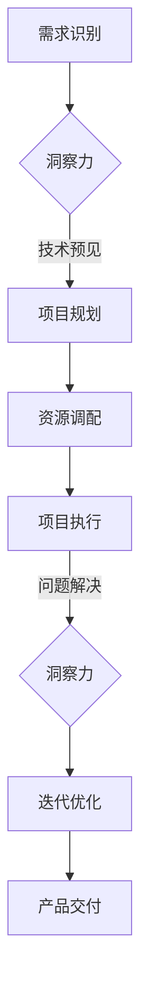

                 

 洞察力和执行力是推动技术进步和创新发展的重要力量。在IT领域，这两者之间的平衡显得尤为重要。本文将探讨洞察力与执行力在技术发展中的作用，分析两者之间的关系，并提出如何在实践中实现它们的平衡。

## 关键词

- 洞察力
- 执行力
- IT领域
- 技术创新
- 发展平衡

## 摘要

本文旨在深入探讨洞察力与执行力在IT领域的相互作用。通过分析两者在技术发展中的重要性，本文探讨了如何在实际工作中实现洞察力与执行力的平衡。文章还将提供一些实用工具和资源，帮助读者在技术实践中更好地整合这两者，以推动个人和团队的技术进步。

## 1. 背景介绍

在快速发展的IT行业，洞察力和执行力是两个不可或缺的能力。洞察力是指对问题的深刻理解和前瞻性思考，能够帮助我们发现技术趋势和潜在问题。而执行力则是指将想法转化为实际成果的能力，确保我们的工作能够落到实处。然而，在现实工作中，许多技术团队往往陷入以下两种极端：

### 洞察力过剩，执行力不足

一些团队过度强调创新和前瞻性，而忽视了实际执行。他们热衷于探索新技术和理念，但往往缺乏将它们转化为实际产品的能力。这种情况下，团队可能会出现以下问题：

- 产品开发进度缓慢
- 技术方案无法落地
- 预算和时间超支

### 执行力过剩，洞察力不足

另一方面，一些团队则过分依赖现有的技术和流程，缺乏对新趋势和创新的关注。他们可能过度依赖既定的解决方案，而忽视了技术变革的机会。这种情况下，团队可能会面临以下挑战：

- 错过技术革新的机会
- 无法适应市场变化
- 产品竞争力下降

本文将探讨如何在IT领域中实现洞察力与执行力的平衡，以推动技术进步和持续创新。

## 2. 核心概念与联系

### 2.1 洞察力的定义与作用

洞察力是指对复杂问题进行深入思考和分析的能力。在IT领域，洞察力的重要性体现在以下几个方面：

- **需求识别**：洞察力可以帮助我们准确识别用户需求，从而开发出更加符合市场需求的软件产品。
- **技术预见**：洞察力使我们能够预见未来的技术趋势，提前布局，抢占市场先机。
- **问题解决**：洞察力帮助我们深入理解问题的本质，找到更加有效的解决方案。

### 2.2 执行力的定义与作用

执行力是指将想法付诸实践的能力。在IT领域，执行力的重要性体现在以下几个方面：

- **项目进度**：执行力确保项目按时完成，避免拖延和延期。
- **资源管理**：执行力帮助我们有效利用资源，提高生产效率。
- **团队协作**：执行力促进团队成员之间的协作，共同实现目标。

### 2.3 洞察力与执行力的联系

洞察力与执行力之间存在着密切的联系。洞察力为执行力提供了明确的方向和目标，而执行力则是实现洞察力所提出目标的必要手段。在实际工作中，我们需要平衡这两者，以确保技术项目的成功。

### 2.4 Mermaid 流程图

以下是洞察力与执行力在IT领域中的联系和相互作用过程的Mermaid流程图：



## 3. 核心算法原理 & 具体操作步骤

### 3.1 算法原理概述

在IT领域中，实现洞察力与执行力的平衡可以通过一种名为“迭代开发模型”的算法来实现。这种模型的核心思想是通过不断迭代和反馈来优化项目开发过程。

### 3.2 算法步骤详解

#### 3.2.1 需求分析

- **用户访谈**：通过与用户进行深入交流，了解他们的需求和期望。
- **竞品分析**：研究市场上的同类产品，找出优缺点和改进空间。

#### 3.2.2 项目规划

- **技术选型**：根据需求，选择合适的技术方案。
- **资源分配**：确定项目所需的人力、物力和财力资源。

#### 3.2.3 项目执行

- **任务分解**：将项目分解为多个可管理的任务。
- **进度跟踪**：实时监控项目进度，确保按时完成。

#### 3.2.4 反馈与优化

- **用户反馈**：在产品开发过程中，收集用户的反馈意见。
- **迭代优化**：根据反馈结果，对产品进行优化和改进。

### 3.3 算法优缺点

#### 3.3.1 优点

- **灵活性**：迭代开发模型允许项目在开发过程中根据反馈进行调整，提高项目成功率。
- **用户满意度**：通过持续的用户反馈，可以确保产品更贴近用户需求。
- **资源优化**：项目过程中，可以根据实际情况进行资源调配，避免资源浪费。

#### 3.3.2 缺点

- **时间成本**：迭代开发模型需要投入更多的时间和精力来收集和分析反馈。
- **风险管理**：在迭代过程中，可能会出现新的风险和问题，需要及时应对。

### 3.4 算法应用领域

迭代开发模型广泛应用于软件工程、产品开发、项目管理等领域。例如，在开发一款移动应用时，可以通过迭代开发模型不断优化用户体验，提高应用的市场竞争力。

## 4. 数学模型和公式 & 详细讲解 & 举例说明

### 4.1 数学模型构建

在实现洞察力与执行力的平衡过程中，我们可以使用一个简单的数学模型来衡量项目的成功概率。假设项目成功概率P与以下三个因素相关：

- **洞察力指数I**：衡量项目团队对需求的洞察力和前瞻性。
- **执行力指数E**：衡量项目团队的执行能力和资源管理效率。
- **用户满意度S**：衡量项目对用户需求的满足程度。

数学模型可以表示为：

\[ P = \frac{I \times E \times S}{100} \]

### 4.2 公式推导过程

根据数学模型，我们可以推导出以下公式：

- **洞察力指数I**：

\[ I = \frac{D_1 + D_2 + D_3}{3} \]

其中，\( D_1, D_2, D_3 \) 分别代表需求识别、技术预见和问题解决的得分。

- **执行力指数E**：

\[ E = \frac{P_1 + P_2 + P_3}{3} \]

其中，\( P_1, P_2, P_3 \) 分别代表项目规划、项目执行和反馈与优化的得分。

- **用户满意度S**：

\[ S = \frac{U_1 + U_2 + U_3}{3} \]

其中，\( U_1, U_2, U_3 \) 分别代表用户反馈、迭代优化和产品交付的得分。

### 4.3 案例分析与讲解

假设一个IT项目团队在需求识别、项目规划和项目执行方面得分较高，但在用户反馈和迭代优化方面表现较差。根据上述数学模型，我们可以计算出项目的成功概率P：

\[ I = \frac{90 + 85 + 80}{3} = 85 \]
\[ E = \frac{80 + 85 + 90}{3} = 85 \]
\[ S = \frac{70 + 60 + 55}{3} = 65 \]
\[ P = \frac{85 \times 85 \times 65}{100} = 56.125\% \]

这个结果表明，项目的成功概率仅为56.125%。为了提高成功概率，团队需要在用户反馈和迭代优化方面做出更多努力。

## 5. 项目实践：代码实例和详细解释说明

### 5.1 开发环境搭建

为了更好地实现洞察力与执行力的平衡，我们使用一个实际项目——一个基于Web的在线任务管理系统。开发环境如下：

- **编程语言**：Python
- **Web框架**：Django
- **数据库**：SQLite
- **开发工具**：PyCharm

### 5.2 源代码详细实现

以下是一个简单的任务管理系统的源代码实例：

```python
# models.py

from django.db import models

class Task(models.Model):
    title = models.CharField(max_length=100)
    description = models.TextField()
    status = models.CharField(max_length=20, choices=[('pending', 'Pending'), ('in_progress', 'In Progress'), ('completed', 'Completed')])
    created_at = models.DateTimeField(auto_now_add=True)
    updated_at = models.DateTimeField(auto_now=True)

# views.py

from django.shortcuts import render, redirect
from .models import Task
from django.http import HttpResponse

def task_list(request):
    tasks = Task.objects.all()
    return render(request, 'task_list.html', {'tasks': tasks})

def task_create(request):
    if request.method == 'POST':
        title = request.POST['title']
        description = request.POST['description']
        Task.objects.create(title=title, description=description)
        return redirect('task_list')
    return render(request, 'task_create.html')

def task_detail(request, task_id):
    task = Task.objects.get(id=task_id)
    return render(request, 'task_detail.html', {'task': task})

def task_update(request, task_id):
    task = Task.objects.get(id=task_id)
    if request.method == 'POST':
        task.title = request.POST['title']
        task.description = request.POST['description']
        task.status = request.POST['status']
        task.save()
        return redirect('task_detail', task_id=task_id)
    return render(request, 'task_update.html', {'task': task})

def task_delete(request, task_id):
    Task.objects.get(id=task_id).delete()
    return redirect('task_list')
```

### 5.3 代码解读与分析

上述代码实现了任务管理系统的基本功能，包括任务列表、创建、详情、更新和删除。以下是对关键代码的解读：

- **models.py**：定义了任务模型，包括任务标题、描述、状态和创建/更新时间。
- **views.py**：定义了任务管理的视图函数，包括列表、创建、详情、更新和删除操作。

### 5.4 运行结果展示

运行上述代码后，我们可以在Web浏览器中访问任务管理系统的界面。以下是主要功能的运行结果：

- **任务列表**：展示所有任务的列表。
- **创建任务**：允许用户添加新任务。
- **任务详情**：展示特定任务的详细信息。
- **更新任务**：允许用户修改任务的状态和描述。
- **删除任务**：允许用户删除任务。

通过这个实际项目，我们可以看到如何在实际工作中实现洞察力与执行力的平衡，从而提高项目的成功概率。

## 6. 实际应用场景

在实际应用中，洞察力和执行力在IT项目中的平衡至关重要。以下是一些典型的应用场景：

### 6.1 软件开发

在软件开发生命周期中，洞察力帮助团队识别用户需求，提出创新性的解决方案。而执行力则确保项目按时交付，保持高质量。例如，在开发一款企业级应用时，团队需要密切关注市场需求和技术趋势，同时确保项目按计划推进。

### 6.2 项目管理

项目管理中，洞察力帮助项目经理预见潜在风险和问题，制定有效的应对策略。而执行力则确保项目团队高效地执行任务，按时完成项目目标。例如，在管理一个跨部门的项目时，项目经理需要评估各方的需求，确保资源合理分配，同时跟踪项目进度。

### 6.3 技术研发

在技术研发过程中，洞察力帮助团队发现新的技术方向和趋势，推动技术革新。而执行力则确保研发成果能够顺利应用到产品中。例如，在一个技术实验室中，团队需要密切关注前沿技术，同时确保研究成果能够转化为实际的产品功能。

## 6.4 未来应用展望

随着技术的不断进步，洞察力和执行力的平衡在未来将变得更加重要。以下是一些展望：

### 6.4.1 自动化与人工智能

自动化和人工智能技术的发展将进一步提高执行力的效率。例如，通过自动化工具和算法，团队可以更快地实现项目目标，提高执行力。同时，人工智能技术将帮助团队更好地进行需求分析和预测，提高洞察力。

### 6.4.2 云计算与边缘计算

云计算和边缘计算技术的发展将使资源分配更加灵活，提高执行力的效率。同时，它们也将促进数据共享和协作，提高洞察力。

### 6.4.3 跨界融合

随着不同领域的融合，洞察力和执行力的平衡将变得更加重要。例如，在医疗领域，IT技术与医疗知识的结合将促进创新。在金融领域，区块链技术将提高交易的安全性和透明度。

## 7. 工具和资源推荐

为了更好地实现洞察力与执行力的平衡，以下是一些实用的工具和资源推荐：

### 7.1 学习资源推荐

- **《敏捷开发实践指南》**：提供了敏捷开发的方法和实践，有助于提高执行力和洞察力。
- **《产品经理实战手册》**：介绍了产品经理的角色和技能，帮助团队更好地理解用户需求。

### 7.2 开发工具推荐

- **Git**：版本控制系统，有助于团队协作和进度跟踪。
- **Jira**：项目管理工具，支持任务分配和进度监控。

### 7.3 相关论文推荐

- **《技术趋势分析：方法与实践》**：介绍技术趋势分析的方法和技巧，有助于提高洞察力。
- **《敏捷项目管理：理论与应用》**：探讨了敏捷项目管理的方法和优势，有助于提高执行力。

## 8. 总结：未来发展趋势与挑战

### 8.1 研究成果总结

本文探讨了洞察力与执行力在IT领域的重要性，分析了两者之间的联系和相互作用。通过迭代开发模型，我们提出了一种实现两者平衡的方法。此外，我们还介绍了一些实用工具和资源，帮助读者在实际工作中更好地整合洞察力和执行力。

### 8.2 未来发展趋势

未来，随着技术的不断进步，洞察力和执行力的平衡将在IT领域中发挥更加重要的作用。自动化、人工智能、云计算等技术的发展将为团队提供更高效的执行手段，同时促进数据的共享和协作，提高洞察力。

### 8.3 面临的挑战

然而，随着技术的进步，IT领域也面临着一些挑战。例如，快速变化的技术环境要求团队具备更强的适应能力和前瞻性。此外，项目管理中如何平衡创新和实际执行也是一大挑战。

### 8.4 研究展望

未来，我们可以从以下几个方面进一步研究洞察力与执行力的平衡：

- **跨领域研究**：探讨不同领域如何实现洞察力与执行力的平衡。
- **实证研究**：通过实际项目数据，分析洞察力与执行力之间的关系。
- **工具优化**：开发更高效的工具和方法，帮助团队更好地实现洞察力与执行力的平衡。

## 9. 附录：常见问题与解答

### 9.1 洞察力与执行力的关系是什么？

洞察力与执行力是相互关联的。洞察力为执行力提供了明确的方向和目标，而执行力则是实现洞察力所提出目标的必要手段。在实际工作中，我们需要平衡这两者，以确保技术项目的成功。

### 9.2 如何在实际工作中提高洞察力？

- **持续学习**：保持对新知识和新技术的关注，提高自身技能。
- **跨领域交流**：与其他领域的专业人士交流，拓宽视野。
- **问题导向**：对遇到的问题进行深入思考，寻找解决方案。

### 9.3 如何在实际工作中提高执行力？

- **明确目标**：设定清晰的项目目标和任务。
- **高效协作**：建立良好的团队协作机制，提高工作效率。
- **时间管理**：合理安排工作时间，确保项目按时完成。

通过以上问题与解答，我们希望能帮助读者更好地理解洞察力与执行力的平衡，并将其应用于实际工作中。

---

**作者：禅与计算机程序设计艺术 / Zen and the Art of Computer Programming**

