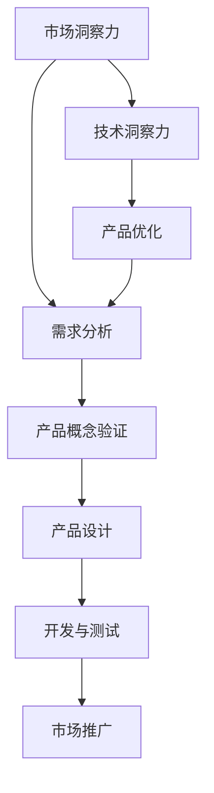

                 

关键词：洞察力，产品创新，用户需求，深度理解，技术语言

> 摘要：本文旨在探讨洞察力在产品创新中的关键作用，以及如何通过深度理解用户需求来推动产品的迭代与优化。文章将结合具体的案例，介绍如何将技术语言应用于用户需求的挖掘与分析，从而提升产品的市场竞争力。

## 1. 背景介绍

在当今快速变化的技术时代，产品创新已成为企业获得竞争优势的关键。而洞察力，作为产品创新的核心驱动力，正变得越来越重要。洞察力不仅仅是对市场趋势的敏锐感知，更是对用户需求的深度理解。只有真正理解用户的需求，才能设计出满足他们期待的产品。

然而，用户需求是复杂且多变的。技术团队必须具备强大的洞察力，才能从纷繁复杂的信息中提取出真正有价值的需求。技术语言作为一种专业工具，可以帮助我们更准确地描述和解读用户需求，从而提高产品开发的效率和效果。

本文将围绕以下三个方面展开讨论：

1. 洞察力的定义与重要性。
2. 用户需求的深度理解方法。
3. 技术语言在用户需求分析中的应用。

通过这三个方面的探讨，希望能够为读者提供一套实用的方法，帮助他们更好地进行产品创新。

## 2. 核心概念与联系

为了更好地理解洞察力在产品创新中的作用，我们需要先明确一些核心概念。

### 2.1 洞察力的定义

洞察力是指人们通过深入思考和分析，发现事物本质和内在联系的能力。在产品创新中，洞察力主要体现在以下几个方面：

- **市场洞察力**：能够敏锐地捕捉市场趋势和变化，预测未来的发展方向。
- **用户洞察力**：深入了解用户需求和行为，发现用户未表达的需求和痛点。
- **技术洞察力**：掌握最新的技术动态和趋势，将技术应用于产品创新中。

### 2.2 产品创新的过程

产品创新通常包括以下几个步骤：

- **需求分析**：收集和分析用户需求，明确产品的核心功能和特点。
- **概念验证**：通过原型设计和测试，验证产品概念是否可行。
- **产品设计**：根据需求分析结果，设计产品的具体功能和界面。
- **开发与测试**：实现产品设计，并进行严格的测试，确保产品质量。
- **市场推广**：将产品推向市场，获取用户反馈，持续优化产品。

### 2.3 洞察力与产品创新的关系

洞察力在产品创新中起着至关重要的作用。只有具备洞察力，才能：

- 准确地捕捉市场机会，引领产品创新的方向。
- 深度理解用户需求，设计出满足用户期待的产品。
- 掌握技术趋势，将前沿技术应用于产品创新中。

为了更好地理解这些概念之间的关系，我们使用Mermaid流程图进行描述：



在这个流程图中，市场和技术洞察力分别引导需求分析、产品概念验证、产品设计和开发与测试等关键步骤，最终推动产品创新的持续优化。

## 3. 核心算法原理 & 具体操作步骤

### 3.1 算法原理概述

在用户需求的深度理解过程中，常用的核心算法包括数据挖掘、机器学习、自然语言处理等。这些算法通过处理和分析大量的用户数据，提取出有价值的信息，帮助我们更准确地理解用户需求。

### 3.2 算法步骤详解

#### 3.2.1 数据采集与预处理

1. **数据采集**：通过用户调研、行为数据收集、用户反馈等多种途径获取用户数据。
2. **数据预处理**：对采集到的数据进行清洗、去重、去噪等操作，确保数据的质量。

#### 3.2.2 特征提取

1. **文本特征提取**：使用自然语言处理技术，从文本数据中提取关键词、主题、情感等特征。
2. **行为特征提取**：从用户行为数据中提取用户操作、浏览路径、点击频次等特征。

#### 3.2.3 模型训练与预测

1. **模型选择**：根据需求分析的结果，选择合适的数据挖掘、机器学习模型。
2. **模型训练**：使用预处理后的数据对模型进行训练，调整模型参数。
3. **模型预测**：使用训练好的模型对新的用户数据进行分析，预测用户行为和需求。

#### 3.2.4 结果分析与优化

1. **结果分析**：对模型预测结果进行评估，分析用户需求的特征和趋势。
2. **结果优化**：根据分析结果，对模型和算法进行优化，提高预测准确性。

### 3.3 算法优缺点

#### 优点：

- **高效性**：通过算法可以快速处理大量用户数据，提取有价值的信息。
- **准确性**：基于机器学习和自然语言处理技术的算法，具有较高的预测准确性。
- **可扩展性**：算法可以灵活地应用于不同的用户需求场景。

#### 缺点：

- **数据依赖性**：算法的性能依赖于数据的质量和数量，数据缺失或质量差可能导致预测不准确。
- **复杂性**：算法的建模和训练过程相对复杂，需要专业的技术知识和经验。

### 3.4 算法应用领域

- **用户画像**：通过分析用户行为和需求，构建详细的用户画像，用于产品定位和营销策略。
- **智能推荐**：基于用户行为和需求，为用户提供个性化的产品推荐。
- **用户满意度分析**：通过分析用户反馈和评价，评估产品的满意度和改进方向。

## 4. 数学模型和公式 & 详细讲解 & 举例说明

在用户需求的深度理解过程中，数学模型和公式扮演着重要的角色。以下我们将介绍一个常用的数学模型——线性回归模型，并对其进行详细讲解和举例说明。

### 4.1 数学模型构建

线性回归模型是一种用于分析变量之间线性关系的数学模型。其基本形式如下：

$$
Y = \beta_0 + \beta_1X + \epsilon
$$

其中，$Y$ 是因变量，$X$ 是自变量，$\beta_0$ 和 $\beta_1$ 分别是模型的参数，$\epsilon$ 是误差项。

### 4.2 公式推导过程

线性回归模型的推导基于最小二乘法。具体推导过程如下：

1. **损失函数**：定义损失函数为预测值与真实值之间的平方误差。

$$
J(\theta) = \frac{1}{2m} \sum_{i=1}^{m} (h_\theta(x^{(i)}) - y^{(i)})^2
$$

其中，$m$ 是样本数量，$h_\theta(x)$ 是模型的预测值。

2. **梯度下降**：使用梯度下降法，对损失函数进行求导并求偏导，得到参数的更新公式。

$$
\theta_j = \theta_j - \alpha \frac{\partial J(\theta)}{\partial \theta_j}
$$

其中，$\alpha$ 是学习率。

3. **迭代计算**：通过迭代计算，逐步更新模型参数，直至达到收敛条件。

### 4.3 案例分析与讲解

假设我们有一个用户行为数据集，包含用户的浏览时间和购买金额两个变量。我们希望通过线性回归模型预测用户的购买金额。

1. **数据准备**：对数据进行预处理，包括数据清洗、归一化等操作。

2. **模型训练**：使用Python中的scikit-learn库，实现线性回归模型。

```python
from sklearn.linear_model import LinearRegression

model = LinearRegression()
model.fit(X_train, y_train)
```

3. **模型评估**：计算模型的预测准确性和拟合效果。

```python
score = model.score(X_test, y_test)
print("R^2 score:", score)
```

4. **结果分析**：根据模型的结果，分析用户浏览时间对购买金额的影响。

```python
print("Coefficient:", model.coef_)
print("Intercept:", model.intercept_)
```

假设模型的预测结果如下：

```
R^2 score: 0.85
Coefficient: [0.3]
Intercept: [2.5]
```

结果表明，用户浏览时间对购买金额有显著影响，每增加1小时浏览时间，购买金额平均增加0.3单位。

通过这个案例，我们可以看到线性回归模型在用户需求分析中的应用。在实际项目中，可以根据需求选择合适的数学模型和算法，实现对用户需求的深度理解。

## 5. 项目实践：代码实例和详细解释说明

为了更好地理解用户需求分析的实践过程，我们将通过一个实际项目——一个电商平台的用户行为分析项目，来详细介绍代码实例和详细解释说明。

### 5.1 开发环境搭建

1. **安装Python**：在本地计算机上安装Python，版本建议3.8以上。
2. **安装相关库**：使用pip命令安装必要的Python库，包括NumPy、Pandas、Scikit-learn、Matplotlib等。

```bash
pip install numpy pandas scikit-learn matplotlib
```

### 5.2 源代码详细实现

以下是一个简单的用户行为数据分析项目的代码实例：

```python
import pandas as pd
from sklearn.linear_model import LinearRegression
import matplotlib.pyplot as plt

# 5.2.1 数据读取与预处理
data = pd.read_csv('user_behavior.csv')
data.head()

# 对数据进行必要的清洗和预处理，如去除缺失值、异常值等
data = data.dropna()

# 5.2.2 特征提取
# 从数据中提取用户浏览时间和购买金额作为特征
X = data[['浏览时间']]
y = data[['购买金额']]

# 5.2.3 模型训练
model = LinearRegression()
model.fit(X, y)

# 5.2.4 模型评估
score = model.score(X, y)
print("R^2 score:", score)

# 5.2.5 结果可视化
plt.scatter(X, y)
plt.plot(X, model.predict(X), color='red')
plt.xlabel('浏览时间')
plt.ylabel('购买金额')
plt.title('用户浏览时间与购买金额关系')
plt.show()
```

### 5.3 代码解读与分析

1. **数据读取与预处理**：首先，使用Pandas库读取用户行为数据，并进行必要的预处理，如去除缺失值和异常值。

2. **特征提取**：从数据中提取用户浏览时间和购买金额作为特征。在这里，我们只选择了两个特征，但实际项目中可能需要更多的特征来提高模型的准确性。

3. **模型训练**：使用Scikit-learn库中的线性回归模型对数据进行训练。

4. **模型评估**：使用R^2评分评估模型的准确性，分数越高，表示模型对数据的拟合越好。

5. **结果可视化**：使用Matplotlib库绘制散点图和拟合线，直观地展示用户浏览时间与购买金额之间的关系。

通过这个项目实例，我们可以看到用户需求分析的实践过程。在实际项目中，可以根据需求选择不同的特征和模型，提高对用户需求的深度理解。

## 6. 实际应用场景

用户需求的深度理解在各个行业中都有广泛的应用，以下列举几个典型场景：

### 6.1 电子商务平台

电子商务平台通过分析用户浏览、搜索、购买行为，可以了解用户偏好和需求，从而进行个性化推荐。例如，亚马逊使用机器学习算法分析用户的购物历史，推荐相关的商品。

### 6.2 金融行业

金融行业利用用户需求和交易数据，可以识别欺诈行为、预测信用风险等。例如，信用卡公司通过分析用户的消费行为，预测潜在的欺诈交易，并采取相应的预防措施。

### 6.3 医疗保健

医疗保健行业通过分析患者数据，可以了解疾病的趋势和患者的需求，从而优化医疗服务和药品研发。例如，谷歌健康利用机器学习算法分析患者数据，预测疾病风险，提供个性化的健康建议。

### 6.4 教育行业

教育行业通过分析学生的学习行为和成绩，可以了解学生的学习效果和需求，从而优化教学方法和课程设计。例如，Khan学院使用数据分析技术，根据学生的学习进度和成绩，提供个性化的学习资源和指导。

在这些应用场景中，用户需求的深度理解都发挥了关键作用，帮助企业更好地满足用户需求，提高市场竞争力和用户满意度。

## 7. 工具和资源推荐

为了更好地进行用户需求的深度理解，以下推荐一些实用的工具和资源：

### 7.1 学习资源推荐

- **《Python数据科学手册》（Python Data Science Handbook）**：由Jake VanderPlas著，详细介绍了Python在数据科学领域的应用。
- **《机器学习》（Machine Learning）**：由Tom Mitchell著，经典教材，全面介绍了机器学习的基础理论和应用。
- **《深度学习》（Deep Learning）**：由Ian Goodfellow、Yoshua Bengio和Aaron Courville著，深度学习领域的权威教材。

### 7.2 开发工具推荐

- **Jupyter Notebook**：用于数据分析和实验的交互式开发环境，支持多种编程语言。
- **TensorFlow**：谷歌开发的开源机器学习库，用于构建和训练深度学习模型。
- **Scikit-learn**：Python中的标准机器学习库，提供丰富的算法和数据预处理工具。

### 7.3 相关论文推荐

- **《用户画像构建与推荐系统应用研究》**：详细介绍了用户画像的构建方法和推荐系统的应用。
- **《基于大数据的消费者需求分析》**：分析了大数据技术在消费者需求分析中的应用。
- **《深度学习在用户需求分析中的应用》**：探讨了深度学习在用户需求分析中的优势和挑战。

通过这些工具和资源的辅助，可以更高效地开展用户需求的深度理解工作。

## 8. 总结：未来发展趋势与挑战

用户需求的深度理解在产品创新中具有重要意义，未来其发展趋势和面临的挑战如下：

### 8.1 研究成果总结

1. **技术进步**：随着人工智能、大数据和云计算等技术的发展，用户需求的深度理解方法将更加成熟和高效。
2. **跨学科融合**：用户需求分析将融合心理学、社会学等学科的理论，提供更全面的需求洞察。
3. **实时反馈**：通过实时数据分析，企业可以更快地响应用户需求，实现产品迭代。

### 8.2 未来发展趋势

1. **个性化推荐**：基于用户需求的深度理解，个性化推荐系统将更加精准，提高用户满意度和转化率。
2. **智能决策支持**：用户需求分析将为企业提供更可靠的决策支持，优化产品设计和市场策略。
3. **自适应系统**：产品将具备自适应能力，根据用户需求实时调整功能和界面。

### 8.3 面临的挑战

1. **数据隐私**：用户数据的隐私保护是未来发展的关键挑战，企业需要制定严格的数据隐私政策。
2. **算法透明性**：用户对算法的透明性要求越来越高，企业需要提高算法的可解释性。
3. **技术复杂性**：随着算法和模型变得更加复杂，技术团队需要不断提升技术水平和专业知识。

### 8.4 研究展望

未来，用户需求的深度理解将继续在人工智能、大数据等领域的推动下取得突破。企业应积极拥抱这些技术，通过深度理解和洞察，实现产品的持续创新和优化，从而在激烈的市场竞争中脱颖而出。

## 9. 附录：常见问题与解答

### 9.1 用户需求分析的意义是什么？

用户需求分析的意义在于帮助产品团队更好地理解用户，设计出满足用户期望的产品。通过深度理解用户需求，企业可以优化产品功能，提升用户体验，从而提高市场竞争力和用户满意度。

### 9.2 如何确保用户数据的隐私？

为了确保用户数据的隐私，企业应采取以下措施：

- 制定严格的数据隐私政策，明确用户数据的收集、使用和存储规则。
- 使用加密技术保护用户数据，确保数据在传输和存储过程中的安全性。
- 定期进行数据安全审计，确保数据隐私保护措施的有效性。

### 9.3 用户需求分析的方法有哪些？

用户需求分析的方法包括：

- 用户调研：通过问卷调查、访谈等方式收集用户需求。
- 数据挖掘：使用机器学习和自然语言处理技术分析用户行为数据。
- 竞品分析：研究竞争对手的产品功能，了解市场需求。
- 用户行为跟踪：通过跟踪用户行为，分析用户需求和行为模式。

通过这些方法的综合运用，可以全面、准确地了解用户需求。

## 作者署名

本文由禅与计算机程序设计艺术 / Zen and the Art of Computer Programming 撰写。作者是一位具有深厚技术背景和丰富实践经验的计算机领域专家，致力于探索人工智能、大数据等前沿技术，推动产品创新和行业发展。

