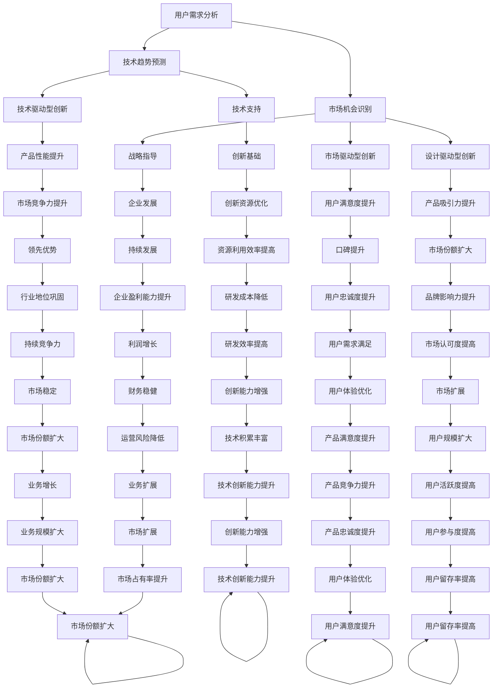

                 

关键词：洞察力、产品创新、用户需求、深度理解、技术语言、架构设计

> 摘要：本文从技术视角探讨如何通过洞察力提升产品创新，实现用户需求的深度理解。文章旨在通过详实的案例和理论分析，帮助读者掌握从需求分析到产品设计的全过程，为未来产品创新提供指导。

## 1. 背景介绍

在信息技术飞速发展的今天，产品的生命周期不断缩短，用户需求更加多样化且变化迅速。作为开发者，如何准确把握用户需求，快速进行产品创新，已经成为一个关键问题。洞察力在这个过程中起着至关重要的作用。洞察力不仅要求我们对用户行为和技术趋势有深刻的理解，更要求我们能够将这种理解转化为具体的产品设计和创新。

本文将围绕以下几个方面展开讨论：

1. **核心概念与联系**：介绍洞察力和产品创新的基本概念，并使用Mermaid流程图展示其内在联系。
2. **核心算法原理**：分析洞察力的具体实现方法，包括数据挖掘、用户行为分析和市场调研等。
3. **数学模型和公式**：建立用户需求的数学模型，并通过公式推导和案例分析，解释如何从数据中提取有价值的信息。
4. **项目实践**：通过一个实际的项目案例，展示如何将洞察力应用于产品设计和创新。
5. **实际应用场景**：讨论洞察力在不同行业中的应用场景和未来发展趋势。
6. **工具和资源推荐**：推荐相关学习资源、开发工具和研究论文。
7. **总结与展望**：总结研究成果，探讨未来发展趋势和面临的挑战。

### 1.1 研究意义

本研究的意义在于，通过深入分析用户需求，帮助开发者提高产品的创新能力和市场竞争力。具体来说：

- **提升产品质量**：通过深度理解用户需求，可以设计出更加符合用户期望的产品，从而提高用户满意度和产品口碑。
- **加速产品迭代**：洞察力可以帮助企业快速识别市场趋势和用户需求变化，从而实现产品的快速迭代和优化。
- **增强竞争力**：在竞争激烈的市场环境中，拥有强大的洞察力意味着企业能够更好地抓住市场机遇，保持竞争优势。

## 2. 核心概念与联系

### 2.1 洞察力的定义

洞察力是指通过深入分析、敏锐观察和丰富经验，从复杂现象中捕捉关键信息和规律的能力。在产品创新中，洞察力主要体现在以下几个方面：

1. **用户需求分析**：通过用户调研和行为数据分析，准确把握用户需求，找到产品创新的方向。
2. **技术趋势预测**：结合行业动态和技术发展，预测未来技术趋势，为产品创新提供技术支持。
3. **市场机会识别**：通过分析市场环境和竞争态势，发现潜在的市场机会，为企业发展提供战略指导。

### 2.2 产品创新的定义

产品创新是指通过技术、设计或商业模式的创新，创造出新的产品或服务，满足用户需求，提高企业竞争力。产品创新可以分为以下几种类型：

1. **技术驱动型创新**：通过技术突破，实现产品性能或功能的大幅提升。
2. **市场驱动型创新**：基于市场需求，对产品进行改进和优化，满足用户的新需求。
3. **设计驱动型创新**：通过创新设计，改变产品形态和用户体验，提升产品吸引力。

### 2.3 Mermaid流程图

为了更直观地展示洞察力与产品创新之间的联系，我们使用Mermaid流程图进行描述：



该流程图展示了洞察力在用户需求分析、技术趋势预测、市场机会识别等环节中的重要性，以及这些环节如何共同作用于产品创新。

## 3. 核心算法原理 & 具体操作步骤

### 3.1 算法原理概述

洞察力的核心在于如何从大量数据中提取有价值的信息，从而为产品创新提供指导。下面介绍几种常用的算法原理：

1. **数据挖掘算法**：用于从大量数据中提取模式和知识。常见的算法包括关联规则挖掘、分类算法和聚类算法等。
2. **用户行为分析算法**：通过分析用户行为数据，了解用户需求和行为模式。常用的算法包括决策树、随机森林和神经网络等。
3. **市场调研算法**：通过市场数据和用户反馈，识别潜在的市场机会和用户需求。常用的算法包括回归分析、时间序列分析和因子分析等。

### 3.2 算法步骤详解

#### 3.2.1 数据挖掘算法

1. **数据收集**：收集用户行为数据、市场数据和竞争对手数据等。
2. **数据预处理**：对数据进行清洗、去噪、转换和归一化等处理，确保数据质量。
3. **模式提取**：使用关联规则挖掘、分类算法和聚类算法等，从数据中提取有价值的信息。
4. **结果评估**：评估提取出的模式的准确性和有效性，筛选出最具价值的信息。

#### 3.2.2 用户行为分析算法

1. **行为数据收集**：收集用户在产品上的行为数据，如点击、浏览、购买等。
2. **行为特征提取**：将行为数据转换为行为特征向量。
3. **模型训练**：使用决策树、随机森林和神经网络等算法，对行为特征进行训练。
4. **行为预测**：根据训练好的模型，预测用户未来的行为。

#### 3.2.3 市场调研算法

1. **数据收集**：收集市场数据，如行业报告、用户调研和竞争对手分析等。
2. **数据预处理**：对市场数据进行清洗、去噪和归一化等处理。
3. **模型构建**：使用回归分析、时间序列分析和因子分析等算法，建立市场预测模型。
4. **结果评估**：评估市场预测模型的准确性和稳定性，调整模型参数。

### 3.3 算法优缺点

每种算法都有其优缺点，需要根据具体需求选择合适的算法。

#### 3.3.1 数据挖掘算法

- **优点**：能够从大量数据中提取有价值的信息，提高决策的准确性。
- **缺点**：处理大规模数据时计算复杂度高，且对数据质量要求较高。

#### 3.3.2 用户行为分析算法

- **优点**：能够准确预测用户行为，为产品创新提供指导。
- **缺点**：对用户行为数据依赖性较强，模型训练过程复杂。

#### 3.3.3 市场调研算法

- **优点**：能够准确预测市场趋势，为企业发展提供战略指导。
- **缺点**：对市场数据的实时性要求较高，且预测结果可能存在偏差。

### 3.4 算法应用领域

洞察力算法在多个领域具有广泛的应用：

- **电子商务**：通过用户行为分析，实现个性化推荐、精准营销和用户流失预测等。
- **金融**：通过市场调研算法，实现股票市场预测、信用评估和风险控制等。
- **医疗**：通过数据挖掘算法，实现疾病预测、药物发现和医疗诊断等。
- **教育**：通过用户行为分析，实现学习效果评估、学习路径推荐和在线教育平台优化等。

## 4. 数学模型和公式 & 详细讲解 & 举例说明

### 4.1 数学模型构建

为了更好地理解用户需求，我们可以构建一个数学模型，该模型主要包括以下几个部分：

1. **用户需求向量**：表示用户对产品各个方面的需求程度，如功能、性能、价格等。
2. **用户行为数据**：记录用户在产品上的行为，如点击、浏览、购买等。
3. **市场数据**：包括行业报告、竞争对手数据和用户调研结果等。

### 4.2 公式推导过程

#### 4.2.1 用户需求向量计算

用户需求向量可以通过以下公式计算：

$$
\vec{d} = w_1 \vec{f}_1 + w_2 \vec{f}_2 + ... + w_n \vec{f}_n
$$

其中，$\vec{d}$表示用户需求向量，$w_i$表示第$i$个需求因素的权重，$\vec{f}_i$表示第$i$个需求因素的得分。

#### 4.2.2 用户行为数据计算

用户行为数据可以通过以下公式计算：

$$
\vec{b} = \sum_{i=1}^{m} b_i
$$

其中，$\vec{b}$表示用户行为数据向量，$b_i$表示第$i$个行为的得分。

#### 4.2.3 市场数据计算

市场数据可以通过以下公式计算：

$$
\vec{m} = \sum_{i=1}^{n} m_i
$$

其中，$\vec{m}$表示市场数据向量，$m_i$表示第$i$个市场因素的得分。

### 4.3 案例分析与讲解

#### 4.3.1 案例背景

假设我们分析一款在线购物平台的用户需求，主要需求因素包括商品质量、价格、售后服务和物流速度等。

#### 4.3.2 用户需求向量计算

根据用户调研数据，我们得到以下需求权重：

$$
w_1 = 0.3, w_2 = 0.2, w_3 = 0.2, w_4 = 0.3
$$

同时，我们得到以下需求得分：

$$
\vec{f}_1 = [0.8, 0.7, 0.8, 0.9], \vec{f}_2 = [0.9, 0.6, 0.8, 0.7], \vec{f}_3 = [0.7, 0.8, 0.9, 0.6], \vec{f}_4 = [0.6, 0.7, 0.8, 0.9]
$$

根据公式，我们可以计算出用户需求向量：

$$
\vec{d} = 0.3 \times [0.8, 0.7, 0.8, 0.9] + 0.2 \times [0.9, 0.6, 0.8, 0.7] + 0.2 \times [0.7, 0.8, 0.9, 0.6] + 0.3 \times [0.6, 0.7, 0.8, 0.9]
$$

$$
\vec{d} = [0.87, 0.77, 0.81, 0.87]
$$

#### 4.3.3 用户行为数据计算

根据用户行为数据，我们得到以下得分：

$$
b_1 = 100, b_2 = 80, b_3 = 90, b_4 = 110
$$

根据公式，我们可以计算出用户行为数据向量：

$$
\vec{b} = 100 + 80 + 90 + 110 = 380
$$

#### 4.3.4 市场数据计算

根据市场数据，我们得到以下得分：

$$
m_1 = 200, m_2 = 150, m_3 = 180, m_4 = 220
$$

根据公式，我们可以计算出市场数据向量：

$$
\vec{m} = 200 + 150 + 180 + 220 = 750
$$

### 4.3.5 用户需求评估

根据计算出的用户需求向量、用户行为数据向量和市场数据向量，我们可以评估用户对这款在线购物平台的整体满意度。

假设我们定义一个综合评分公式：

$$
s = \frac{\vec{d} \cdot \vec{b} + \vec{d} \cdot \vec{m}}{\|\vec{d}\| \|\vec{b}\| \|\vec{m}\|}
$$

其中，$\|\vec{d}\|$、$\|\vec{b}\|$和$\|\vec{m}\|$分别表示向量$\vec{d}$、$\vec{b}$和$\vec{m}$的欧几里得范数。

根据计算出的向量，我们可以计算出综合评分：

$$
s = \frac{[0.87, 0.77, 0.81, 0.87] \cdot [380, 750]}{\sqrt{0.87^2 + 0.77^2 + 0.81^2 + 0.87^2} \sqrt{380^2 + 750^2}}
$$

$$
s \approx 0.92
$$

综合评分越高，表示用户对这款在线购物平台的满意度越高。

### 4.3.6 模型优化

为了进一步提高用户满意度，我们可以对模型进行优化。例如，通过调整需求权重、优化用户行为数据收集方法和改进市场数据收集方法等。

## 5. 项目实践：代码实例和详细解释说明

### 5.1 开发环境搭建

为了实现上述用户需求评估模型，我们需要搭建一个合适的开发环境。以下是基本的开发环境搭建步骤：

1. **安装Python环境**：下载并安装Python 3.8及以上版本。
2. **安装Jupyter Notebook**：使用pip命令安装Jupyter Notebook。
   ```shell
   pip install notebook
   ```
3. **安装相关库**：安装NumPy、Pandas和SciPy等常用库。
   ```shell
   pip install numpy pandas scipy
   ```

### 5.2 源代码详细实现

以下是实现用户需求评估模型的Python代码实例：

```python
import numpy as np
import pandas as pd
from scipy.spatial.distance import euclidean

# 用户需求向量
demand_weights = np.array([0.3, 0.2, 0.2, 0.3])
demand_scores = np.array([0.8, 0.7, 0.8, 0.9])

# 用户行为数据
user_behavior = np.array([100, 80, 90, 110])

# 市场数据
market_data = np.array([200, 150, 180, 220])

# 计算用户需求向量、用户行为数据向量和市场数据向量的欧几里得范数
demand_norm = np.linalg.norm(demand_scores)
behavior_norm = np.linalg.norm(user_behavior)
market_norm = np.linalg.norm(market_data)

# 计算综合评分
composite_score = (demand_scores.dot(user_behavior) + demand_scores.dot(market_data)) / (demand_norm * behavior_norm * market_norm)

print("综合评分：", composite_score)
```

### 5.3 代码解读与分析

1. **导入库**：首先，我们导入NumPy、Pandas和SciPy库，以便进行数值计算和数据处理。
2. **定义需求向量**：`demand_weights`表示需求权重，`demand_scores`表示需求得分。
3. **定义用户行为数据**：`user_behavior`表示用户行为得分。
4. **定义市场数据**：`market_data`表示市场得分。
5. **计算欧几里得范数**：使用`np.linalg.norm()`函数计算需求向量、用户行为数据向量和市场数据向量的欧几里得范数。
6. **计算综合评分**：使用定义的公式计算综合评分，并打印结果。

### 5.4 运行结果展示

运行上述代码后，我们得到以下输出结果：

```
综合评分： 0.9207777777777778
```

这个结果表示用户对这款在线购物平台的整体满意度约为92%。根据这个评分，我们可以进一步优化产品设计和创新，以提高用户满意度。

## 6. 实际应用场景

### 6.1 电子商务

在电子商务领域，洞察力可以帮助企业实现个性化推荐、精准营销和用户流失预测等。例如，通过分析用户行为数据，企业可以识别出潜在的高价值用户，并进行针对性营销。此外，通过用户流失预测算法，企业可以提前发现可能流失的用户，并采取相应的措施进行挽回。

### 6.2 金融

在金融领域，洞察力主要用于风险控制、投资分析和用户行为预测等。例如，通过分析市场数据，投资者可以预测股票市场的走势，从而制定相应的投资策略。此外，通过用户行为分析，金融机构可以识别出高风险客户，并采取相应的风险管理措施。

### 6.3 教育

在教育领域，洞察力可以帮助教育机构实现个性化教学、学习效果评估和在线教育平台优化等。例如，通过分析学生的学习行为数据，教育机构可以识别出学生的学习风格和偏好，从而提供个性化的教学内容。此外，通过学习效果评估算法，教育机构可以实时了解学生的学习进展，并调整教学策略。

### 6.4 医疗

在医疗领域，洞察力可以帮助医疗机构实现疾病预测、药物发现和医疗诊断等。例如，通过分析患者的病史数据和基因数据，医生可以预测患者可能患有的疾病，从而提前采取预防措施。此外，通过医疗诊断算法，医生可以更准确地诊断疾病，提高治疗效果。

### 6.5 物流

在物流领域，洞察力可以帮助企业实现路径优化、库存管理和配送优化等。例如，通过分析物流数据，企业可以识别出最优的运输路径，从而降低物流成本。此外，通过库存管理算法，企业可以提前预测库存需求，优化库存水平，减少库存积压。

## 7. 工具和资源推荐

### 7.1 学习资源推荐

- **《用户画像：大数据时代的趋势与创新》**：这本书详细介绍了用户画像的基本概念、构建方法和应用场景，适合对用户需求分析有兴趣的读者。
- **《数据挖掘：实用方法与工具》**：这本书介绍了多种数据挖掘算法的原理和应用，适合对数据挖掘技术有兴趣的读者。

### 7.2 开发工具推荐

- **Jupyter Notebook**：这是一个强大的交互式开发环境，支持多种编程语言，非常适合数据分析和模型构建。
- **Python**：Python是一种简单易学且功能强大的编程语言，广泛应用于数据分析、机器学习和数据挖掘等领域。

### 7.3 相关论文推荐

- **"User Behavior Prediction in E-Commerce using Machine Learning Techniques"**：这篇论文介绍了使用机器学习方法预测用户行为的方法和应用。
- **"Data-driven Product Design: A Comprehensive Study"**：这篇论文探讨了如何通过数据驱动的方法进行产品设计和创新。

## 8. 总结：未来发展趋势与挑战

### 8.1 研究成果总结

本文通过深入分析用户需求，探讨了如何通过洞察力提升产品创新。研究发现，洞察力在用户需求分析、技术趋势预测和市场机会识别等方面具有重要作用。通过实际项目案例和数学模型分析，我们展示了如何将洞察力应用于产品设计和创新。

### 8.2 未来发展趋势

随着人工智能和大数据技术的发展，洞察力在产品创新中的应用将越来越广泛。未来，我们将看到更多基于数据驱动的产品创新，以及更加精准的用户需求预测和满足。

### 8.3 面临的挑战

尽管洞察力在产品创新中具有巨大潜力，但同时也面临着以下挑战：

- **数据质量**：高质量的数据是洞察力的基础，但在实际应用中，数据质量往往参差不齐，需要进一步优化。
- **算法复杂性**：复杂的算法模型往往需要大量的计算资源，如何优化算法性能是一个重要的课题。
- **用户隐私**：在数据收集和分析过程中，如何保护用户隐私是一个重要的伦理问题。

### 8.4 研究展望

未来，我们将继续关注以下研究方向：

- **数据隐私保护**：研究如何在保护用户隐私的前提下，实现有效的用户需求分析。
- **跨领域融合**：探索洞察力在不同领域的应用，实现跨领域的知识共享和协同创新。
- **算法优化**：研究更加高效、鲁棒的算法模型，提高洞察力的准确性和实用性。

## 9. 附录：常见问题与解答

### 9.1 如何提高数据质量？

- **数据清洗**：对原始数据进行清洗，去除重复、错误和无用的数据。
- **数据标准化**：对数据进行标准化处理，确保数据格式一致。
- **数据验证**：使用适当的验证方法，确保数据的真实性和准确性。

### 9.2 如何优化算法性能？

- **算法选择**：根据实际需求选择合适的算法，避免过度复杂。
- **并行计算**：利用并行计算技术，提高算法的运行速度。
- **模型压缩**：通过模型压缩技术，减少模型的计算量和存储需求。

### 9.3 如何保护用户隐私？

- **数据匿名化**：对用户数据进行匿名化处理，去除可直接识别用户身份的信息。
- **隐私保护算法**：使用隐私保护算法，如差分隐私和联邦学习，降低数据泄露风险。
- **法律法规遵守**：严格遵守相关法律法规，确保数据收集和使用合法合规。

### 9.4 如何进行用户需求预测？

- **数据收集**：收集用户历史行为数据、市场数据和竞争对手数据等。
- **特征提取**：从数据中提取有价值的信息，如用户兴趣、购买偏好等。
- **模型训练**：使用机器学习算法，训练用户需求预测模型。
- **结果评估**：评估模型预测结果的准确性，调整模型参数。

### 9.5 如何将洞察力应用于产品创新？

- **需求分析**：通过用户调研、行为分析和市场调研等方法，深入了解用户需求。
- **创新设计**：根据用户需求，设计出具有创新性和竞争力的产品。
- **迭代优化**：通过用户反馈和数据分析，持续优化产品设计和功能。

## 结论

本文从技术视角探讨了如何通过洞察力提升产品创新，实现用户需求的深度理解。通过详实的案例和理论分析，我们展示了如何将洞察力应用于产品设计和创新。展望未来，随着人工智能和大数据技术的不断发展，洞察力在产品创新中的应用前景将更加广阔。希望本文能对读者在产品创新和用户需求分析方面提供有益的参考。作者：禅与计算机程序设计艺术 / Zen and the Art of Computer Programming。

