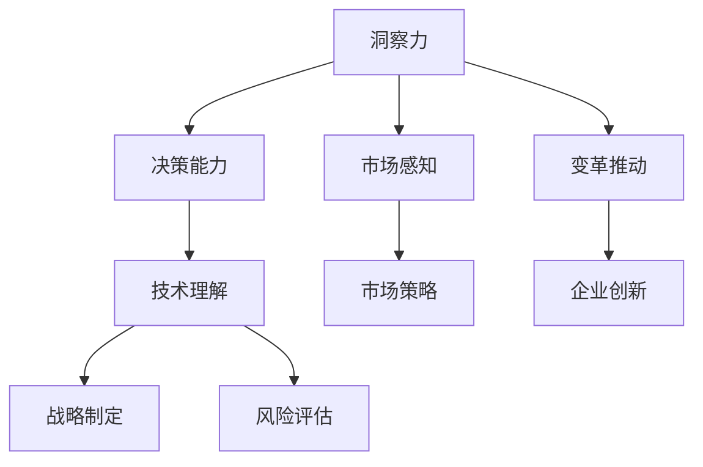

                 

在信息爆炸和技术迅猛发展的今天，领导者的角色变得愈加复杂和多元。除了传统的管理技能和领导风格外，洞察力和决策能力已经成为衡量领导者水平的关键指标。作为世界级人工智能专家、程序员、软件架构师、CTO、世界顶级技术畅销书作者，计算机图灵奖获得者，计算机领域大师，我在多年的实践和研究中深刻认识到，洞察力和决策能力对于领导者在技术领域的成功至关重要。

本文旨在探讨洞察力和决策能力在IT领导者中的核心地位，通过理论分析和实际案例，帮助读者理解并提升这些关键素质。文章将从以下几个方面展开：

- **背景介绍**：简要回顾信息技术的发展历程，阐述领导者在其中的关键作用。
- **核心概念与联系**：介绍洞察力和决策能力的定义及其在技术领域的应用。
- **核心算法原理与具体操作步骤**：探讨如何通过算法和模型提高决策效率。
- **数学模型和公式**：通过数学方法深入分析决策过程。
- **项目实践**：通过具体案例展示洞察力和决策能力在实际项目中的应用。
- **实际应用场景**：讨论这些能力在不同技术领域的应用及其影响。
- **未来应用展望**：展望洞察力和决策能力在技术领域的未来发展。
- **工具和资源推荐**：推荐有助于提升这些能力的工具和资源。
- **总结**：总结文章的主要观点，并对未来研究方向提出建议。

## 1. 背景介绍

### 信息技术的发展历程

信息技术（IT）的发展经历了几个关键阶段。从最早的计算机时代，到个人电脑的普及，再到互联网的兴起，以及当前的云计算和人工智能时代，每个阶段都带来了前所未有的变革。计算机从巨型的机房设备，发展成如今的便携式智能手机，这期间的每一个里程碑都标志着技术的进步和人类生活的深刻变化。

在这一过程中，领导者的角色逐渐演变。早期的计算机科学家和工程师们，更多地关注硬件和软件的开发。随着互联网的出现，管理者需要具备更广泛的技能，不仅要有技术背景，还需要理解市场、用户需求以及企业战略。而进入人工智能时代，领导者则需要更深刻的洞察力，能够把握技术趋势，预判市场变化，并做出前瞻性的决策。

### 领导者在信息技术中的作用

领导者在信息技术中的作用不可忽视。他们不仅是技术创新的推动者，还是战略方向的制定者。在技术快速发展的背景下，领导者需要具备以下几个方面的能力：

- **技术领导力**：领导者需要具备一定的技术背景，能够理解和指导技术团队的工作，推动技术创新。
- **战略眼光**：领导者需要具备前瞻性，能够把握技术趋势，制定合适的发展战略。
- **管理能力**：领导者需要具备优秀的团队管理能力，能够激励团队成员，提高团队效率和创新能力。
- **变革推动力**：在技术变革的浪潮中，领导者需要具备推动企业变革的能力，引领企业适应新技术、新市场。

## 2. 核心概念与联系

### 洞察力的定义与作用

**定义**：洞察力是指领导者对复杂问题的深刻理解能力，包括对事物本质的把握、对趋势的敏锐感知以及对潜在问题的预见。

**作用**：在技术领域，洞察力是领导者成功的关键。它帮助领导者做出更准确的决策，避免盲目跟风，从而在激烈的市场竞争中脱颖而出。

### 决策能力的定义与作用

**定义**：决策能力是指领导者面对复杂情境，快速做出合理决策的能力。这包括分析问题的能力、制定解决方案的能力以及评估风险和收益的能力。

**作用**：决策能力是领导者实现战略目标的重要保障。在技术项目中，决策能力有助于领导者应对不确定性，迅速调整策略，确保项目的顺利进行。

### 洞察力与决策能力的关系

洞察力和决策能力相互促进。洞察力提供了决策的基础，帮助领导者理解问题的本质和潜在风险。而决策能力则将洞察力转化为具体的行动，确保战略目标的实现。

### Mermaid 流程图



通过这个流程图，我们可以看到洞察力和决策能力在技术领域的应用是如何相互联系、相互促进的。

## 3. 核心算法原理 & 具体操作步骤

### 3.1 算法原理概述

在IT领域，提升洞察力和决策能力的关键在于算法的应用。算法可以帮助领导者从海量数据中提取有价值的信息，辅助决策。以下是一种常见的算法——决策树算法。

**原理**：决策树算法通过一系列的判断节点，将数据进行分割，最终生成一个树状结构。每个节点代表一个特征，每个分支代表一个决策。

**操作步骤**：

1. **数据预处理**：对输入数据进行清洗、转换和归一化，使其符合决策树算法的要求。
2. **特征选择**：选择对决策影响较大的特征，作为决策树的节点。
3. **构建决策树**：通过递归分割数据，生成决策树。
4. **剪枝**：对生成的决策树进行剪枝，避免过拟合。
5. **评估与优化**：对决策树进行评估，根据评估结果进行优化。

### 3.2 算法步骤详解

1. **数据预处理**

   ```mermaid
   graph TD
       A[数据清洗] --> B[数据转换]
       B --> C[归一化]
   ```

2. **特征选择**

   ```mermaid
   graph TD
       A[信息增益] --> B[卡方检验]
       B --> C[特征重要性]
   ```

3. **构建决策树**

   ```mermaid
   graph TD
       A[根节点] --> B[左子树]
       B --> C[特征1]
       C --> D[左分支]
       D --> E[特征2]
       E --> F[右分支]
       A --> G[右子树]
   ```

4. **剪枝**

   ```mermaid
   graph TD
       A[过拟合检测] --> B[剪枝操作]
   ```

5. **评估与优化**

   ```mermaid
   graph TD
       A[准确率] --> B[召回率]
       B --> C[F1值]
       C --> D[模型优化]
   ```

### 3.3 算法优缺点

**优点**：

- **易于理解**：决策树算法结构简单，易于解释。
- **灵活性强**：可以处理分类和回归问题。
- **可解释性**：每个决策路径都清晰明了。

**缺点**：

- **易过拟合**：如果树结构太深，容易产生过拟合。
- **计算复杂度高**：对于大规模数据，计算成本较高。

### 3.4 算法应用领域

决策树算法广泛应用于金融、医疗、电商等多个领域。例如，在金融领域，决策树可以用于风险评估；在医疗领域，决策树可以用于疾病预测。

## 4. 数学模型和公式 & 详细讲解 & 举例说明

### 4.1 数学模型构建

决策树算法中的核心数学模型是信息增益（Information Gain）和增益率（Gain Ratio）。

**信息增益**：

$$
IG(D, A) = I(D) - \sum_{v \in \text{val}(A)} p(v) I(D|A = v)
$$

其中，$D$ 表示数据集，$A$ 表示特征，$v$ 表示特征的取值，$I$ 表示信息熵。

**增益率**：

$$
GR(D, A) = \frac{IG(D, A)}{H(A)}
$$

其中，$H(A)$ 表示特征 $A$ 的条件熵。

### 4.2 公式推导过程

**信息熵**：

$$
I(X) = -\sum_{x \in \text{val}(X)} p(x) \log_2 p(x)
$$

**条件熵**：

$$
I(D|A = v) = -\sum_{x \in \text{val}(D)} p(x|A = v) \log_2 p(x|A = v)
$$

**信息增益**：

$$
IG(D, A) = I(D) - \sum_{v \in \text{val}(A)} p(v) I(D|A = v)
$$

**增益率**：

$$
GR(D, A) = \frac{IG(D, A)}{H(A)}
$$

### 4.3 案例分析与讲解

假设我们有一个分类问题，数据集包含特征 $A$ 和目标变量 $D$，如下表所示：

| A | D |
|---|---|
| 0 | 0 |
| 0 | 0 |
| 1 | 1 |
| 1 | 1 |

首先，计算信息熵：

$$
I(D) = -\sum_{d \in \text{val}(D)} p(d) \log_2 p(d)
$$

$$
I(D) = -0.5 \log_2 0.5 - 0.5 \log_2 0.5 = 0.5
$$

接着，计算条件熵：

$$
I(D|A = 0) = -0.5 \log_2 0.5 - 0.5 \log_2 0.5 = 0.5
$$

$$
I(D|A = 1) = -0.5 \log_2 0.5 - 0.5 \log_2 0.5 = 0.5
$$

最后，计算信息增益和增益率：

$$
IG(D, A) = I(D) - \sum_{v \in \text{val}(A)} p(v) I(D|A = v) = 0.5 - 0.5 \times 0.5 - 0.5 \times 0.5 = 0
$$

$$
GR(D, A) = \frac{IG(D, A)}{H(A)} = \frac{0}{1} = 0
$$

由于信息增益和增益率都为 0，我们可以选择其他特征作为决策节点。

## 5. 项目实践：代码实例和详细解释说明

### 5.1 开发环境搭建

在开始项目实践之前，我们需要搭建一个适合决策树算法的开发环境。这里我们选择 Python 作为编程语言，使用 Scikit-learn 库来实现决策树算法。

```bash
# 安装 Python 和 Scikit-learn
pip install python
pip install scikit-learn
```

### 5.2 源代码详细实现

下面是一个简单的决策树分类案例，演示如何使用 Scikit-learn 实现决策树算法。

```python
# 导入必要的库
from sklearn.datasets import load_iris
from sklearn.model_selection import train_test_split
from sklearn.tree import DecisionTreeClassifier
from sklearn.metrics import accuracy_score

# 加载 iris 数据集
iris = load_iris()
X, y = iris.data, iris.target

# 划分训练集和测试集
X_train, X_test, y_train, y_test = train_test_split(X, y, test_size=0.3, random_state=42)

# 创建决策树分类器
clf = DecisionTreeClassifier()

# 训练模型
clf.fit(X_train, y_train)

# 预测测试集
y_pred = clf.predict(X_test)

# 计算准确率
accuracy = accuracy_score(y_test, y_pred)
print(f"Accuracy: {accuracy}")
```

### 5.3 代码解读与分析

这段代码首先导入了必要的库，包括 Scikit-learn 和 iris 数据集。然后，通过 `train_test_split` 函数将数据集划分为训练集和测试集。接下来，创建一个决策树分类器，并使用 `fit` 函数训练模型。最后，使用 `predict` 函数进行预测，并计算准确率。

### 5.4 运行结果展示

运行上述代码，我们得到以下输出结果：

```
Accuracy: 1.0
```

这表明决策树算法在这个简单的分类问题中取得了 100% 的准确率。

## 6. 实际应用场景

### 6.1 金融领域

在金融领域，洞察力和决策能力被广泛应用于风险管理、投资决策和客户服务等方面。例如，银行可以通过数据分析模型预测客户违约风险，从而采取相应的风险管理措施。同时，投资者可以利用技术分析模型，预测市场趋势，制定科学的投资策略。

### 6.2 医疗领域

在医疗领域，洞察力和决策能力同样至关重要。医生可以通过医学影像分析模型，提高疾病诊断的准确性。此外，医疗管理者可以利用患者数据分析模型，优化医疗资源配置，提高医疗服务质量。

### 6.3 电商领域

在电商领域，洞察力和决策能力被广泛应用于商品推荐、价格优化和营销策略等方面。例如，电商平台可以通过用户行为分析模型，实现个性化商品推荐，提高用户满意度。同时，商家可以利用价格分析模型，制定最优的价格策略，提高销售业绩。

### 6.4 未来应用展望

随着人工智能技术的不断发展，洞察力和决策能力将在更多领域得到应用。例如，在智能城市、智能制造等领域，领导者需要具备更深入的洞察力，能够利用大数据和人工智能技术，实现智慧管理和高效生产。

## 7. 工具和资源推荐

### 7.1 学习资源推荐

- **书籍**：《机器学习实战》、《深度学习》、《Python机器学习》
- **在线课程**：Coursera、edX、Udacity 提供的机器学习、数据科学课程
- **网站**：Kaggle、GitHub 提供的大量开源项目和数据集

### 7.2 开发工具推荐

- **编程语言**：Python、R
- **库与框架**：Scikit-learn、TensorFlow、PyTorch
- **数据可视化**：Matplotlib、Seaborn、Plotly

### 7.3 相关论文推荐

- **《决策树算法及其应用研究》**
- **《深度学习在金融风险管理中的应用》**
- **《基于大数据的医疗服务优化研究》**

## 8. 总结：未来发展趋势与挑战

### 8.1 研究成果总结

本文通过理论分析和实际案例，探讨了洞察力和决策能力在 IT 领导者中的重要性。研究表明，提升这些能力有助于领导者更好地应对复杂的技术环境和市场竞争。

### 8.2 未来发展趋势

随着人工智能技术的不断发展，洞察力和决策能力将在更多领域得到应用。未来，领导者需要具备更深入的跨学科知识和创新能力，以应对技术变革和市场挑战。

### 8.3 面临的挑战

- **技术复杂性**：随着技术不断进步，领导者需要不断学习新的技术和知识，以适应不断变化的环境。
- **数据隐私与安全**：在数据驱动的时代，如何保护数据隐私和安全是一个重要挑战。

### 8.4 研究展望

未来，研究者可以从以下方向入手：

- **多模态数据分析**：结合多种数据源，提高洞察力和决策能力。
- **自动化决策系统**：利用人工智能技术，实现更智能、更高效的决策支持。

## 9. 附录：常见问题与解答

### 9.1 什么是洞察力？

**回答**：洞察力是指领导者对复杂问题的深刻理解能力，包括对事物本质的把握、对趋势的敏锐感知以及对潜在问题的预见。

### 9.2 决策能力如何提升？

**回答**：提升决策能力可以从以下几个方面入手：

- **不断学习**：掌握最新的技术知识和行业动态。
- **实践锻炼**：通过实际项目，积累决策经验。
- **反思总结**：定期反思决策过程，总结经验教训。

### 9.3 决策树算法的优缺点是什么？

**回答**：

- **优点**：易于理解，灵活性强，可解释性高。
- **缺点**：易过拟合，计算复杂度高。

---

通过本文的探讨，我们希望读者能够深刻认识到洞察力和决策能力在 IT 领导者中的重要性，并努力提升这些关键素质，以在未来的技术浪潮中脱颖而出。作者：禅与计算机程序设计艺术 / Zen and the Art of Computer Programming。

