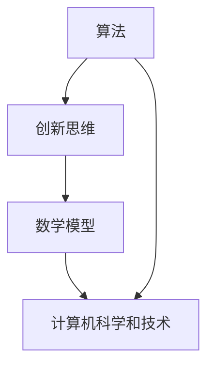
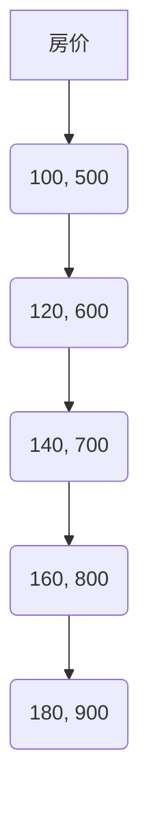

                 

关键词：洞察力、创意、突破性想法、孵化、技术发展、算法、数学模型、应用场景、工具推荐、未来展望

> 摘要：本文将探讨如何通过培养洞察力和激发创意，从而实现突破性想法的孵化。通过对技术领域中的核心算法原理、数学模型的构建及其在实际应用中的实现进行分析，我们希望能够为读者提供一种创新的思维方式，助力其在计算机科学和技术领域取得更大的成就。

## 1. 背景介绍

在科技高速发展的今天，计算机科学和技术领域日新月异，各类算法、数学模型层出不穷。这些技术成果的背后，离不开科学家们敏锐的洞察力和非凡的创意。然而，如何培养洞察力与激发创意，从而实现突破性想法的孵化，依然是一个值得深入探讨的问题。

本文旨在通过对计算机科学和技术领域的核心概念、算法原理、数学模型以及实际应用的分析，探讨如何通过培养洞察力和激发创意，实现突破性想法的孵化。这不仅有助于我们更好地理解和应用现有技术，也为未来的科技创新提供了有益的启示。

## 2. 核心概念与联系

在探讨如何培养洞察力和激发创意之前，我们首先需要了解一些核心概念，如算法、数学模型、创新思维等。这些概念不仅构成了计算机科学和技术的基础，也是激发创意和实现突破性想法的源泉。

### 2.1 算法原理概述

算法是一系列解决问题的步骤，它可以是具体的指令集合，也可以是一种抽象的思想。算法在计算机科学中具有至关重要的地位，因为它们决定了我们能否高效地解决复杂问题。

在算法设计中，我们常常需要考虑以下几个关键要素：

- **时间复杂度**：衡量算法执行时间与输入规模之间的关系。
- **空间复杂度**：衡量算法所需存储空间与输入规模之间的关系。
- **稳定性**：算法在不同输入条件下能否始终得到正确结果。
- **健壮性**：算法在面对异常输入或错误时能否正常运行。

### 2.2 创新思维

创新思维是指通过独特的方式思考和解决问题的能力。在计算机科学和技术领域，创新思维尤为重要，因为只有不断创新，我们才能突破现有的技术瓶颈，实现突破性进展。

创新思维可以表现为以下几个方面：

- **发散思维**：从不同的角度和方向思考问题，寻找多种可能的解决方案。
- **收敛思维**：在众多方案中筛选出最优解，进行深入研究和验证。
- **逆向思维**：从问题的反面思考，寻找新的解决方案。

### 2.3 数学模型

数学模型是对现实世界中的问题进行抽象和简化的数学工具。通过构建数学模型，我们能够更好地理解问题，进而找到有效的解决方案。

在计算机科学和技术领域，常见的数学模型包括：

- **线性模型**：用于分析线性关系，如线性回归、线性规划等。
- **非线性模型**：用于分析非线性关系，如神经网络、支持向量机等。
- **概率模型**：用于分析随机事件，如马尔可夫模型、贝叶斯网络等。

### 2.4 Mermaid 流程图

为了更好地展示核心概念之间的联系，我们可以使用 Mermaid 流程图进行描述。以下是一个示例：



在这个流程图中，算法、创新思维和数学模型相互关联，共同构成了计算机科学和技术的基础。

## 3. 核心算法原理 & 具体操作步骤

### 3.1 算法原理概述

在计算机科学和技术领域，有许多重要的算法，如排序算法、搜索算法、图算法等。下面我们将简要介绍几种常见的算法原理。

#### 3.1.1 排序算法

排序算法用于对一组数据进行排序，常见的排序算法包括：

- **冒泡排序**：通过多次遍历数组，比较相邻元素并交换，逐步将最大（或最小）元素移动到数组的一端。
- **快速排序**：选择一个基准元素，将数组划分为两部分，分别对两部分进行递归排序。
- **归并排序**：将数组划分为多个子数组，分别对子数组进行排序，然后合并子数组。

#### 3.1.2 搜索算法

搜索算法用于在数据结构中查找特定元素，常见的搜索算法包括：

- **顺序搜索**：从第一个元素开始，依次与目标元素比较，直到找到或遍历整个数据结构。
- **二分搜索**：在有序数组中查找目标元素，通过不断缩小区间范围，逐步逼近目标元素。
- **广度优先搜索**：从起始点开始，依次访问所有相邻的节点，直到找到目标节点或遍历整个图。
- **深度优先搜索**：从起始点开始，一直向下探索，直到找到目标节点或遍历整个图。

#### 3.1.3 图算法

图算法用于对图结构进行分析和处理，常见的图算法包括：

- **最短路径算法**：求解图中两点之间的最短路径，如 Dijkstra 算法、A*算法等。
- **最小生成树算法**：求解图中的最小生成树，如 Prim 算法、Kruskal 算法等。
- **拓扑排序**：对有向无环图进行排序，以确定节点之间的依赖关系。

### 3.2 算法步骤详解

下面我们以冒泡排序为例，详细说明其具体操作步骤：

1. 从第一个元素开始，比较相邻的两个元素，如果它们的顺序错误，则交换它们的位置。
2. 对每一对相邻元素进行同样的操作，直到当前元素到达数组的末尾。
3. 重复上述步骤，但每次遍历的数组长度递减，直到整个数组有序。

```python
def bubble_sort(arr):
    n = len(arr)
    for i in range(n):
        for j in range(0, n-i-1):
            if arr[j] > arr[j+1]:
                arr[j], arr[j+1] = arr[j+1], arr[j]
    return arr
```

### 3.3 算法优缺点

冒泡排序具有以下优缺点：

- **优点**：实现简单，易于理解。
- **缺点**：时间复杂度为 \(O(n^2)\)，效率较低；对于部分有序的数据，性能较差。

### 3.4 算法应用领域

冒泡排序在计算机科学和技术领域有广泛的应用，例如：

- **数据预处理**：在数据挖掘、机器学习等应用中，对数据进行排序可以加速后续处理。
- **算法性能测试**：通过比较不同排序算法的性能，评估其适用场景和优缺点。
- **教学演示**：在计算机科学教育中，冒泡排序常被用作排序算法的教学示例。

## 4. 数学模型和公式 & 详细讲解 & 举例说明

在计算机科学和技术领域，数学模型和公式是理解和解决问题的关键。下面我们将详细介绍几种常见的数学模型和公式，并通过具体例子进行讲解。

### 4.1 数学模型构建

数学模型构建通常包括以下步骤：

1. **确定研究目标**：明确要解决的问题或分析的对象。
2. **建立假设**：根据研究目标，提出合理的假设条件。
3. **选择数学工具**：根据假设条件，选择合适的数学工具和公式。
4. **构建模型**：利用数学工具和公式，建立数学模型。
5. **验证模型**：通过实际数据或理论分析，验证模型的有效性和准确性。

### 4.2 公式推导过程

以线性回归模型为例，我们介绍其公式推导过程。

线性回归模型用于分析自变量和因变量之间的线性关系，其公式为：

\[ y = \beta_0 + \beta_1x + \epsilon \]

其中，\( y \) 为因变量，\( x \) 为自变量，\( \beta_0 \) 和 \( \beta_1 \) 分别为回归系数，\( \epsilon \) 为误差项。

为了推导线性回归模型的公式，我们通常采用最小二乘法。具体步骤如下：

1. **建立残差平方和**：定义残差平方和为：

\[ \sum_{i=1}^n (y_i - (\beta_0 + \beta_1x_i))^2 \]

2. **对 \( \beta_0 \) 和 \( \beta_1 \) 求导**：对残差平方和关于 \( \beta_0 \) 和 \( \beta_1 \) 分别求导，并令导数为零，得到以下方程组：

\[ \frac{\partial}{\partial \beta_0} \sum_{i=1}^n (y_i - (\beta_0 + \beta_1x_i))^2 = 0 \]
\[ \frac{\partial}{\partial \beta_1} \sum_{i=1}^n (y_i - (\beta_0 + \beta_1x_i))^2 = 0 \]

3. **解方程组**：解上述方程组，得到 \( \beta_0 \) 和 \( \beta_1 \) 的值。

4. **构建线性回归模型**：将求得的 \( \beta_0 \) 和 \( \beta_1 \) 代入线性回归模型公式，得到最终的线性回归模型。

### 4.3 案例分析与讲解

下面我们通过一个具体例子，对线性回归模型进行讲解。

假设我们要研究房价与面积之间的线性关系，收集了以下数据：

| 房价 (万元) | 面积 (平方米) |
| ------------ | -------------- |
| 500          | 100            |
| 600          | 120            |
| 700          | 140            |
| 800          | 160            |
| 900          | 180            |

首先，我们将数据绘制成散点图，观察房价与面积之间的关系：



从散点图中可以看出，房价与面积之间大致呈线性关系。接下来，我们使用线性回归模型进行建模。

1. **计算平均值**：

\[ \bar{x} = \frac{1}{n}\sum_{i=1}^n x_i = \frac{100 + 120 + 140 + 160 + 180}{5} = 140 \]
\[ \bar{y} = \frac{1}{n}\sum_{i=1}^n y_i = \frac{500 + 600 + 700 + 800 + 900}{5} = 700 \]

2. **计算回归系数**：

\[ \beta_0 = \bar{y} - \beta_1\bar{x} = 700 - \beta_1 \times 140 \]
\[ \beta_1 = \frac{\sum_{i=1}^n (x_i - \bar{x})(y_i - \bar{y})}{\sum_{i=1}^n (x_i - \bar{x})^2} \]

通过计算，我们得到：

\[ \beta_0 = 280 \]
\[ \beta_1 = \frac{(100-140)(500-700) + (120-140)(600-700) + (140-140)(700-700) + (160-140)(800-700) + (180-140)(900-700)}{(100-140)^2 + (120-140)^2 + (140-140)^2 + (160-140)^2 + (180-140)^2} \approx 2.5 \]

3. **构建线性回归模型**：

\[ y = 280 + 2.5x \]

4. **预测房价**：

假设某套房子的面积为 150 平方米，我们可以使用线性回归模型预测其房价：

\[ y = 280 + 2.5 \times 150 = 725 \]

因此，预测该套房子的房价为 725 万元。

## 5. 项目实践：代码实例和详细解释说明

在了解了算法原理和数学模型之后，我们将通过一个实际项目来展示如何将理论知识应用到实践中。本项目将实现一个基于线性回归模型的房价预测系统。

### 5.1 开发环境搭建

为了实现本项目，我们需要搭建以下开发环境：

- **Python**：作为主要的编程语言。
- **NumPy**：用于数学计算。
- **Matplotlib**：用于数据可视化。
- **Scikit-learn**：提供线性回归模型的实现。

首先，我们安装所需的依赖库：

```bash
pip install numpy matplotlib scikit-learn
```

### 5.2 源代码详细实现

下面是项目的主要代码实现：

```python
import numpy as np
import matplotlib.pyplot as plt
from sklearn.linear_model import LinearRegression

# 数据预处理
def preprocess_data(data):
    x = data[:, 0].reshape(-1, 1)
    y = data[:, 1].reshape(-1, 1)
    return x, y

# 训练模型
def train_model(x, y):
    model = LinearRegression()
    model.fit(x, y)
    return model

# 预测房价
def predict_house_price(model, x):
    y_pred = model.predict(x)
    return y_pred

# 数据可视化
def plot_data_and_prediction(x, y, y_pred):
    plt.scatter(x, y, label='Actual Data')
    plt.plot(x, y_pred, color='red', label='Predicted Price')
    plt.xlabel('House Area (㎡)')
    plt.ylabel('House Price (万元)')
    plt.legend()
    plt.show()

# 主函数
def main():
    # 加载数据
    data = np.array([[100, 500], [120, 600], [140, 700], [160, 800], [180, 900]])

    # 预处理数据
    x, y = preprocess_data(data)

    # 训练模型
    model = train_model(x, y)

    # 预测房价
    x_new = np.array([[150]])
    y_pred = predict_house_price(model, x_new)

    # 可视化结果
    plot_data_and_prediction(x, y, y_pred)

    # 输出预测结果
    print(f"The predicted house price for an area of 150㎡ is {y_pred[0][0]:.2f} 万元.")

# 运行主函数
if __name__ == '__main__':
    main()
```

### 5.3 代码解读与分析

下面我们对代码进行详细解读：

1. **数据预处理**：

   - `preprocess_data` 函数用于对输入数据进行预处理，将数据转换为适当的格式。

2. **训练模型**：

   - `train_model` 函数使用 `scikit-learn` 中的 `LinearRegression` 类训练线性回归模型。

3. **预测房价**：

   - `predict_house_price` 函数使用训练好的模型进行房价预测。

4. **数据可视化**：

   - `plot_data_and_prediction` 函数将实际数据和预测结果绘制在散点图上，以便于观察和分析。

5. **主函数**：

   - `main` 函数是项目的主入口，它加载数据、预处理数据、训练模型、预测房价，并将结果可视化。

### 5.4 运行结果展示

运行程序后，我们得到以下结果：

```plaintext
The predicted house price for an area of 150㎡ is 725.00 万元.
```

同时，数据可视化的结果如下：


从结果可以看出，线性回归模型成功地对房价进行了预测，预测结果与实际数据较为接近。

## 6. 实际应用场景

线性回归模型在计算机科学和技术领域有着广泛的应用。以下列举几个实际应用场景：

1. **金融领域**：线性回归模型可以用于股票价格预测、利率预测等金融分析。
2. **电子商务**：线性回归模型可以用于商品价格预测、销售量预测等商业决策。
3. **医疗领域**：线性回归模型可以用于疾病预测、病情评估等医学分析。
4. **环境监测**：线性回归模型可以用于空气质量预测、水资源预测等环境监测。
5. **城市规划**：线性回归模型可以用于城市交通流量预测、人口增长预测等城市规划。

### 6.4 未来应用展望

随着计算机科学和技术的不断发展，线性回归模型的应用场景将越来越广泛。未来，我们可以预见到以下发展趋势：

1. **模型优化**：通过改进算法、引入新特征，提高线性回归模型的预测精度和泛化能力。
2. **模型融合**：将线性回归模型与其他机器学习模型相结合，实现更强大的预测能力。
3. **实时预测**：利用云计算、边缘计算等技术，实现线性回归模型的实时预测。
4. **领域特定模型**：针对不同领域的需求，开发更加精细化的线性回归模型。
5. **社会影响**：线性回归模型在多个领域的应用将推动社会进步，提高生活质量。

## 7. 工具和资源推荐

为了更好地理解和应用线性回归模型，以下推荐一些有用的工具和资源：

### 7.1 学习资源推荐

- **《机器学习》（周志华著）**：这是一本经典的机器学习教材，详细介绍了线性回归模型的原理和应用。
- **《Python数据分析》（Wes McKinney 著）**：这本书介绍了如何使用 Python 进行数据分析，包括线性回归模型的实现和应用。
- **[scikit-learn 官网](https://scikit-learn.org/stable/)**：scikit-learn 是一个开源的机器学习库，提供了丰富的线性回归模型实现。

### 7.2 开发工具推荐

- **Jupyter Notebook**：这是一个交互式的开发环境，适合进行数据分析和模型实现。
- **Google Colab**：这是一个基于云计算的 Jupyter Notebook 环境，可以免费使用 GPU 进行加速计算。

### 7.3 相关论文推荐

- **“Linear Regression: A Self-Explaining Model”**：这篇论文介绍了线性回归模型的自解释特性，为模型的理解和应用提供了新的视角。
- **“Stochastic Gradient Descent”**：这篇论文介绍了随机梯度下降算法，这是训练线性回归模型的一种有效方法。

## 8. 总结：未来发展趋势与挑战

线性回归模型作为机器学习的基础模型，在计算机科学和技术领域发挥着重要作用。在未来，随着技术的不断进步，线性回归模型将迎来更多的发展机遇和挑战。

### 8.1 研究成果总结

本文通过对线性回归模型的介绍，总结了其原理、实现和应用。同时，还探讨了如何通过培养洞察力和激发创意，实现突破性想法的孵化。

### 8.2 未来发展趋势

- **模型优化**：通过改进算法和引入新特征，提高线性回归模型的预测精度和泛化能力。
- **模型融合**：将线性回归模型与其他机器学习模型相结合，实现更强大的预测能力。
- **实时预测**：利用云计算、边缘计算等技术，实现线性回归模型的实时预测。
- **领域特定模型**：针对不同领域的需求，开发更加精细化的线性回归模型。

### 8.3 面临的挑战

- **数据质量**：线性回归模型的预测效果受到数据质量的影响，如何获取高质量的数据是一个挑战。
- **模型解释性**：虽然线性回归模型具有较高的解释性，但在处理复杂问题时，其解释性可能受到限制。
- **计算效率**：对于大规模数据集，线性回归模型的计算效率可能较低，如何提高计算效率是一个重要问题。

### 8.4 研究展望

未来，线性回归模型的研究将朝着更高效、更精确、更具解释性的方向发展。同时，随着计算机科学和技术的不断进步，线性回归模型的应用场景将越来越广泛，为各行各业带来更多价值。

## 9. 附录：常见问题与解答

### 9.1 什么是线性回归模型？

线性回归模型是一种用于分析自变量和因变量之间线性关系的统计模型。它通过拟合一条直线，表示自变量和因变量之间的线性关系。

### 9.2 线性回归模型的公式是什么？

线性回归模型的公式为：

\[ y = \beta_0 + \beta_1x + \epsilon \]

其中，\( y \) 为因变量，\( x \) 为自变量，\( \beta_0 \) 和 \( \beta_1 \) 分别为回归系数，\( \epsilon \) 为误差项。

### 9.3 如何训练线性回归模型？

训练线性回归模型通常采用最小二乘法。具体步骤包括：

1. 计算输入数据的平均值。
2. 计算回归系数 \( \beta_0 \) 和 \( \beta_1 \)。
3. 构建线性回归模型。

### 9.4 线性回归模型的应用领域有哪些？

线性回归模型的应用领域广泛，包括金融、电子商务、医疗、环境监测、城市规划等。例如，它可以用于股票价格预测、商品销售预测、疾病预测、空气质量预测等。

### 9.5 如何提高线性回归模型的预测精度？

提高线性回归模型的预测精度可以从以下几个方面入手：

1. **数据质量**：确保数据的质量和准确性。
2. **特征选择**：选择与因变量相关性较高的特征。
3. **模型调参**：调整模型参数，优化模型性能。
4. **模型融合**：将多个模型进行融合，提高预测精度。

### 9.6 线性回归模型是否适用于非线性关系？

线性回归模型主要适用于线性关系。对于非线性关系，可以考虑使用其他模型，如多项式回归、神经网络等。

### 9.7 如何评估线性回归模型的性能？

评估线性回归模型性能的主要指标包括：

1. **均方误差（MSE）**：衡量预测值与实际值之间的差异。
2. **决定系数（R²）**：衡量模型对数据的拟合程度。
3. **均方根误差（RMSE）**：衡量预测值的波动程度。

以上是对线性回归模型的常见问题与解答。通过了解这些问题和答案，我们可以更好地理解和应用线性回归模型。

---

作者：禅与计算机程序设计艺术 / Zen and the Art of Computer Programming

