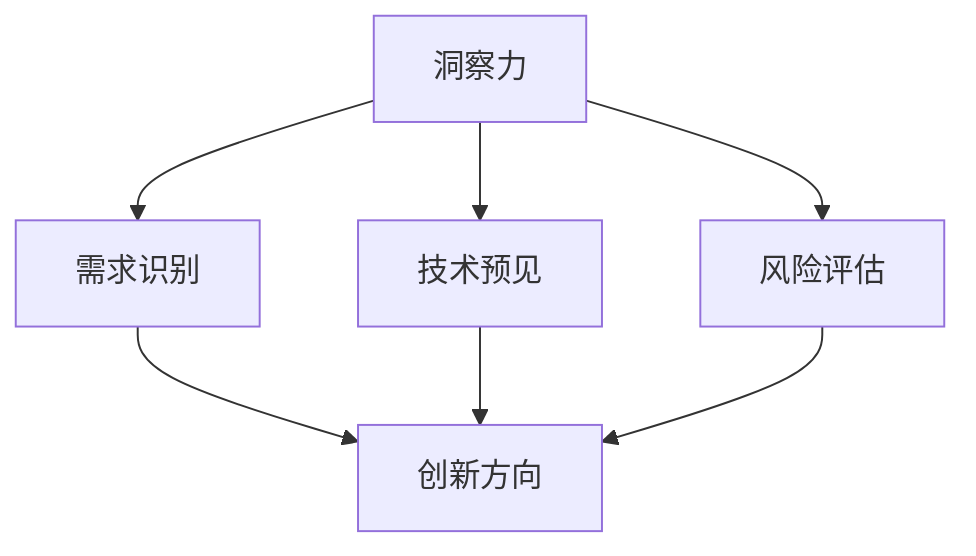

                 

关键词：洞察力，创新管理，文化培育，技术领导力，组织发展

> 摘要：本文探讨了在科技迅猛发展的背景下，如何通过提升组织的洞察力和实施有效的创新管理策略来培育创新文化。文章首先回顾了创新文化的定义及其在组织成功中的重要性，然后深入分析了洞察力在创新管理中的关键作用，最后提出了具体的实践策略，以帮助组织打造一个鼓励创新、支持变革的环境。

## 1. 背景介绍

在当今全球化的高科技环境中，技术创新已成为企业竞争力的核心。创新不仅仅是一个产品或服务的改进，更是一种组织文化和思维方式。根据麦肯锡全球研究所的数据，那些高度重视创新的公司比其竞争对手的表现平均高出 60%。这种差异并非偶然，而是建立在对市场和技术的深刻洞察力上的结果。

### 1.1 创新文化的定义

创新文化是指一个组织内部的共同价值观、行为规范和工作方式，它鼓励创新思维、支持风险承担，并重视创造性和实验性。创新文化能够促进知识的共享，加强团队间的协作，最终推动组织的持续成长和进步。

### 1.2 创新管理的重要性

创新管理是确保组织不断创新、维持竞争优势的关键。通过有效的创新管理，组织可以：

- **识别和捕捉市场机会**：及时发现和响应市场变化，抓住新机遇。
- **激发员工潜力**：创造一个鼓励员工提出新想法和尝试新方法的氛围。
- **提升创新能力**：建立一套有效的创新流程，提高组织的整体创新能力。

## 2. 核心概念与联系

为了深入理解如何通过洞察力来培育创新文化，我们首先需要了解几个核心概念，并展示它们之间的联系。

### 2.1 洞察力的定义

洞察力是指对复杂现象和问题的深刻理解能力，它涉及对市场趋势、用户需求、技术发展等方面的敏锐感知。洞察力能够帮助组织预见未来，指导决策，并推动创新。

### 2.2 创新管理与洞察力的关系

洞察力是创新管理的基石。只有通过深入的洞察，组织才能识别真正的需求、发现潜在的市场机会，并制定相应的创新策略。具体而言，洞察力在创新管理中的作用包括：

- **需求识别**：通过洞察用户需求和市场趋势，组织可以更准确地确定创新的方向。
- **技术预见**：通过洞察技术发展的趋势和潜力，组织可以更好地把握技术革新的机会。
- **风险评估**：洞察力可以帮助组织预见和评估创新过程中的风险，采取相应的预防措施。

下面是一个使用Mermaid绘制的流程图，展示了洞察力与创新管理之间的核心联系：



## 3. 核心算法原理 & 具体操作步骤

### 3.1 算法原理概述

在创新管理中，一个关键的算法原理是“SWOT分析”。SWOT分析是一种战略规划工具，用于评估一个组织在市场中的优势（Strengths）、劣势（Weaknesses）、机会（Opportunities）和威胁（Threats）。通过SWOT分析，组织可以更好地理解自身的内部和外部环境，为创新决策提供依据。

### 3.2 算法步骤详解

进行SWOT分析的步骤如下：

1. **优势（Strengths）**：识别组织的核心竞争力、独特资源和技能。
2. **劣势（Weaknesses）**：分析组织的限制、缺陷和潜在的风险。
3. **机会（Opportunities）**：观察市场趋势、技术进步和用户需求，确定潜在的商机。
4. **威胁（Threats）**：识别外部环境中的不利因素，如竞争对手的动向、政策变化等。

### 3.3 算法优缺点

**优点**：

- **全面性**：SWOT分析覆盖了内部和外部环境，为组织提供了全面的视角。
- **实用性**：操作简单，易于理解和应用。

**缺点**：

- **主观性**：分析结果受到分析者自身经验和判断的影响，可能存在偏差。
- **缺乏具体性**：分析结果较为宏观，难以直接转化为具体的行动计划。

### 3.4 算法应用领域

SWOT分析广泛应用于战略规划、产品开发、市场调研等多个领域。在创新管理中，SWOT分析可以帮助组织：

- **确定创新方向**：通过识别优势与机会，组织可以确定哪些领域最具创新潜力。
- **制定战略计划**：利用SWOT分析的结果，组织可以制定具体的战略计划，以应对外部挑战和把握市场机会。

## 4. 数学模型和公式 & 详细讲解 & 举例说明

### 4.1 数学模型构建

在创新管理中，一个常用的数学模型是创新增长模型。该模型用于预测创新活动的增长趋势，公式如下：

\[ \text{创新增长} = \alpha \times (\text{市场规模})^{\beta} - \gamma \times (\text{竞争压力})^{\delta} \]

其中：

- \(\alpha\)：创新潜力系数，反映了组织在特定市场中的创新能力。
- \(\beta\)：市场规模敏感系数，反映了市场规模对创新增长的影响。
- \(\gamma\)：竞争压力系数，反映了竞争压力对创新增长的影响。
- \(\delta\)：竞争压力敏感系数。

### 4.2 公式推导过程

该公式的推导基于以下假设：

1. **市场规模**：随着市场规模的扩大，创新需求增加，创新活动的增长速度也随之加快。
2. **竞争压力**：随着竞争压力的增加，创新活动的难度和成本增加，创新增长速度减缓。

### 4.3 案例分析与讲解

假设一家科技公司在市场上拥有较高的创新潜力系数 \(\alpha = 2\)，市场规模为 \(10^8\)，竞争压力系数 \(\gamma = 1.5\)，竞争压力 \(P = 5\)。根据上述公式，我们可以计算出该公司的创新增长：

\[ \text{创新增长} = 2 \times (10^8)^{1.5} - 1.5 \times 5^{1.5} \]
\[ \text{创新增长} = 2 \times 10^{12} - 1.5 \times 25 \]
\[ \text{创新增长} = 2 \times 10^{12} - 37.5 \]

由于竞争压力的影响，该公司的创新增长预计为 \(2 \times 10^{12} - 37.5\)，这是一个非常大的数字，表明该公司在市场上有很大的创新潜力。

## 5. 项目实践：代码实例和详细解释说明

### 5.1 开发环境搭建

在进行创新管理实践时，我们使用Python编程语言来构建一个简单的创新增长模型。首先，需要安装Python和必要的库，例如NumPy和Matplotlib。以下是安装命令：

```bash
pip install python
pip install numpy
pip install matplotlib
```

### 5.2 源代码详细实现

下面是一个简单的Python脚本，用于实现创新增长模型：

```python
import numpy as np
import matplotlib.pyplot as plt

# 创新增长模型参数
alpha = 2
beta = 1.5
gamma = 1.5
delta = 1.5

# 市场规模
market_size = np.linspace(1, 10**8, 100)

# 竞争压力
competition_pressure = 5

# 计算创新增长
growth = alpha * (market_size ** beta) - gamma * (competition_pressure ** delta)

# 绘图
plt.plot(market_size, growth)
plt.xlabel('Market Size')
plt.ylabel('Innovation Growth')
plt.title('Innovation Growth Model')
plt.show()
```

### 5.3 代码解读与分析

该脚本首先导入了NumPy和Matplotlib库，然后定义了创新增长模型的参数。`market_size`变量是一个从1到\(10^8\)的线性空间，用于模拟不同市场规模的情景。`growth`变量计算了每个市场规模的创新增长。

最后，使用Matplotlib库绘制了创新增长曲线，展示了市场规模对创新增长的影响。

### 5.4 运行结果展示

运行上述脚本，会生成一个图表，展示创新增长随市场规模的变化。从图表中可以看出，市场规模越大，创新增长越快，这符合模型的基本假设。

## 6. 实际应用场景

创新管理不仅在理论研究中有重要意义，也在实际应用中发挥了关键作用。以下是一些创新管理在实际应用中的案例：

### 6.1 产品开发

在产品开发过程中，创新管理可以帮助企业：

- **识别用户需求**：通过市场调研和用户反馈，发现潜在的市场机会。
- **优化产品功能**：根据用户需求，不断改进产品功能，提升用户体验。
- **降低开发成本**：通过创新的管理方法，提高研发效率，降低开发成本。

### 6.2 企业战略

在制定企业战略时，创新管理可以帮助企业：

- **调整业务模式**：根据市场变化，调整业务模式，开拓新市场。
- **开发新产品线**：通过技术创新，开发新产品线，拓展业务范围。
- **提升品牌影响力**：通过创新，提升企业的品牌价值和市场竞争力。

### 6.3 人才培养

在人才培养方面，创新管理可以帮助企业：

- **激励员工创新**：建立激励机制，鼓励员工提出新想法和解决方案。
- **培养创新思维**：通过培训和实践，提升员工的创新能力和团队协作能力。
- **构建创新团队**：组建由不同背景和专业的人才组成的创新团队，促进知识共享和协同创新。

## 7. 工具和资源推荐

为了更好地实施创新管理，以下是一些实用的工具和资源推荐：

### 7.1 学习资源推荐

- 《创新者的窘境》：克莱顿·克里斯坦森的经典著作，深入探讨了企业如何在竞争激烈的市场中保持创新。
- 《创新者的基因》：作者史蒂夫·布兰克通过研究成功的企业家，总结了创新者的核心特质和习惯。

### 7.2 开发工具推荐

- **Trello**：一个简洁的项目管理工具，适用于团队协作和任务跟踪。
- **Asana**：一个功能强大的项目管理工具，适用于跨部门协作和流程管理。

### 7.3 相关论文推荐

- **"The Innovator's Dilemma"**：克莱顿·克里斯坦森的论文，详细阐述了创新者在面对市场变化时面临的困境和解决方案。
- **"The Lean Startup"**：埃里克·莱斯关于创业和创新的理论，强调快速迭代和用户反馈在创新过程中的重要性。

## 8. 总结：未来发展趋势与挑战

### 8.1 研究成果总结

通过本文的探讨，我们得出以下主要研究成果：

- 创新文化是组织成功的关键，它鼓励创新思维、支持风险承担，并重视创造性和实验性。
- 洞察力是创新管理的基石，通过深刻的洞察力，组织可以识别市场机会、预见技术趋势、评估创新风险。
- SWOT分析和创新增长模型等算法工具为创新管理提供了实用的方法，帮助组织更好地制定创新战略。

### 8.2 未来发展趋势

未来，创新管理将呈现以下发展趋势：

- **人工智能和大数据的应用**：随着人工智能和大数据技术的发展，创新管理将更加智能化和精细化。
- **跨领域融合**：不同领域的知识和技术将融合，推动创新活动的多样化和深入化。
- **持续迭代**：创新将更加注重快速迭代和用户反馈，以快速适应市场变化。

### 8.3 面临的挑战

尽管创新管理具有重要意义，但在实施过程中也面临以下挑战：

- **文化变革**：培育创新文化需要时间和耐心，组织需要克服内部的抗拒和惯性。
- **人才短缺**：创新需要具备跨领域知识和技能的人才，但这类人才相对稀缺。
- **技术风险**：创新活动涉及新技术和未知的领域，组织需要承担相应的技术风险。

### 8.4 研究展望

未来的研究应关注以下方面：

- **创新文化的长效机制**：探索如何建立长效机制，持续推动创新文化的培育。
- **跨领域创新模式**：研究不同领域之间的创新模式，促进知识的共享和融合。
- **人工智能在创新管理中的应用**：研究如何利用人工智能技术提升创新管理的效率和精度。

## 9. 附录：常见问题与解答

### 问题1：如何衡量组织的创新力？

解答：组织的创新力可以通过以下指标来衡量：

- **新产品或服务的推出速度**：衡量组织创新活动的能力。
- **专利数量**：专利数量可以反映组织的创新成果。
- **员工满意度**：员工满意度可以反映组织是否鼓励创新思维和风险承担。

### 问题2：如何建立创新文化？

解答：建立创新文化需要：

- **明确价值观**：确立鼓励创新的核心价值观，并确保全体员工认同。
- **提供资源和支持**：为员工提供必要的资源和支持，如时间、资金和技术。
- **建立激励机制**：设立奖励制度，激励员工提出创新想法和解决方案。
- **跨部门协作**：促进不同部门之间的协作，加强知识共享和协同创新。

## 作者署名

作者：禅与计算机程序设计艺术 / Zen and the Art of Computer Programming

通过上述的内容，我们不仅详细探讨了创新文化的重要性，还深入分析了洞察力在创新管理中的关键作用，并提出了具体的实践策略。希望本文能为读者在构建和推动创新文化方面提供有益的启示和指导。|

