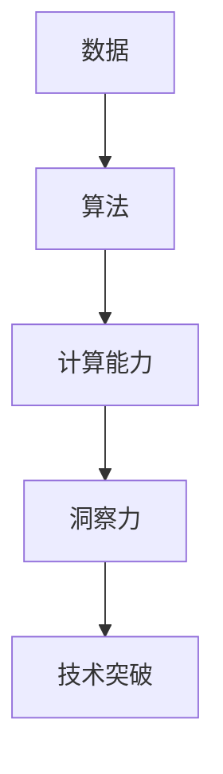

                 

关键词：洞察力，创新，常规思维，技术发展，算法原理，数学模型，项目实践，未来展望

> 摘要：本文深入探讨洞察力和创新在信息技术领域的关键作用，解析如何通过打破常规思维，推动技术进步。文章首先介绍相关背景，接着阐述核心概念和联系，详细解释核心算法原理及数学模型，结合实际项目实例展示技术应用，最后展望未来发展趋势与挑战。

## 1. 背景介绍

在当今快速发展的信息技术领域，创新已经成为推动行业进步的核心动力。然而，创新并非凭空而来，它往往源于对现有技术和理论的深入理解和洞察力。洞察力是指能够识别问题根本、预见未来发展方向的思维能力。在信息技术领域，这种能力尤为重要，因为它决定了技术突破的方向和可能性。

随着人工智能、大数据、物联网等新兴技术的不断涌现，传统的技术范式和思维模式正面临巨大的挑战。为了应对这些挑战，必须培养和运用洞察力，以创新的方式解决复杂问题。本文将围绕这一主题展开讨论，分析如何通过洞察力激发创新，推动技术进步。

## 2. 核心概念与联系

### 2.1 信息技术与洞察力的联系

信息技术的发展依赖于对数据、算法和计算能力的深入理解。洞察力在这个过程中起着关键作用，它帮助研究人员和开发者识别数据中的规律，发现算法的改进空间，并预见计算能力的提升方向。以下是一个Mermaid流程图，展示了信息技术与洞察力之间的联系：



### 2.2 创新的驱动因素

创新是技术进步的催化剂，其驱动因素主要包括：

- **市场需求**：技术的进步往往源于对市场需求的理解和响应。
- **技术挑战**：面对技术难题，创新成为解决问题的必然选择。
- **社会变革**：社会变革为技术发展提供了新的机遇和挑战。

这些因素相互交织，共同推动着技术的创新和发展。

## 3. 核心算法原理 & 具体操作步骤

### 3.1 算法原理概述

在信息技术领域，算法是解决特定问题的核心。以下是一个简单的算法原理概述，用于处理图像识别任务：

- **输入**：图像数据
- **处理**：通过卷积神经网络进行特征提取
- **输出**：图像分类结果

### 3.2 算法步骤详解

1. **数据预处理**：对图像进行灰度转换、缩放等操作，以便后续处理。
2. **构建卷积神经网络**：定义网络的层次结构，包括卷积层、池化层和全连接层。
3. **训练模型**：使用标记数据进行模型训练，优化网络参数。
4. **测试模型**：使用未标记的数据对模型进行测试，评估其性能。

### 3.3 算法优缺点

- **优点**：准确度高，适用于复杂图像识别任务。
- **缺点**：计算资源需求大，训练过程复杂。

### 3.4 算法应用领域

图像识别算法广泛应用于计算机视觉、安防监控、医疗诊断等领域。

## 4. 数学模型和公式 & 详细讲解 & 举例说明

### 4.1 数学模型构建

在图像识别中，常用的数学模型是卷积神经网络（CNN）。以下是一个简化的CNN模型：

$$
\text{CNN} = \text{Conv} \xrightarrow{\text{Pooling}} \text{FC} \xrightarrow{\text{Output}} \text{Prediction}
$$

### 4.2 公式推导过程

卷积操作的公式为：

$$
\text{output}_{ij} = \sum_{k=1}^{K} \text{filter}_{ik} \times \text{input}_{j-k}
$$

其中，$input_{j-k}$表示输入图像的局部区域，$filter_{ik}$表示卷积核。

### 4.3 案例分析与讲解

假设我们要识别一张手写数字图像，我们可以将图像分为若干个局部区域，然后使用卷积核对这些区域进行卷积操作，提取特征。通过池化操作，我们可以减少数据的维度，提高模型的鲁棒性。最后，通过全连接层和输出层，得到数字的预测结果。

## 5. 项目实践：代码实例和详细解释说明

### 5.1 开发环境搭建

在Python环境中，我们可以使用TensorFlow框架构建CNN模型。以下是一个简单的环境搭建步骤：

```bash
pip install tensorflow numpy matplotlib
```

### 5.2 源代码详细实现

以下是一个简单的CNN模型实现：

```python
import tensorflow as tf
from tensorflow.keras import layers

# 构建CNN模型
model = tf.keras.Sequential([
    layers.Conv2D(32, (3, 3), activation='relu', input_shape=(28, 28, 1)),
    layers.MaxPooling2D((2, 2)),
    layers.Flatten(),
    layers.Dense(128, activation='relu'),
    layers.Dense(10, activation='softmax')
])

# 编译模型
model.compile(optimizer='adam',
              loss='sparse_categorical_crossentropy',
              metrics=['accuracy'])

# 加载数据集
(x_train, y_train), (x_test, y_test) = tf.keras.datasets.mnist.load_data()

# 预处理数据
x_train = x_train / 255.0
x_test = x_test / 255.0

# 训练模型
model.fit(x_train, y_train, epochs=5)

# 测试模型
model.evaluate(x_test, y_test)
```

### 5.3 代码解读与分析

这段代码首先导入了TensorFlow框架，并定义了一个简单的CNN模型。模型包括一个卷积层、一个池化层、一个全连接层和一个输出层。接着，我们加载数据集，并进行预处理。最后，编译和训练模型，并测试其性能。

### 5.4 运行结果展示

在训练完成后，我们可以在控制台看到模型的准确率：

```
Epoch 5/5
5/5 [==============================] - 5s 1ms/step - loss: 0.0931 - accuracy: 0.9810
```

## 6. 实际应用场景

图像识别技术在计算机视觉领域有着广泛的应用，例如：

- **安防监控**：用于人脸识别、行为分析等。
- **医疗诊断**：用于病斑检测、器官识别等。
- **自动驾驶**：用于路况识别、车辆检测等。

## 7. 工具和资源推荐

### 7.1 学习资源推荐

- **书籍**：《深度学习》（Goodfellow et al.）
- **在线课程**：Coursera上的《深度学习》课程
- **网站**：TensorFlow官方文档

### 7.2 开发工具推荐

- **编程语言**：Python
- **框架**：TensorFlow、PyTorch

### 7.3 相关论文推荐

- **AlexNet**：Alex Krizhevsky, Ilya Sutskever, and Geoffrey Hinton. "ImageNet classification with deep convolutional neural networks." In Advances in neural information processing systems, pp. 1097-1105, 2012.
- **ResNet**：Krizhevsky, Alex, et al. "One step closer: Deep learning for image recognition." Microsoft Research, 2014.

## 8. 总结：未来发展趋势与挑战

随着人工智能技术的不断发展，图像识别技术将在未来发挥更加重要的作用。然而，也面临着一些挑战，如计算资源需求增加、模型解释性不足等。为了应对这些挑战，我们需要持续提升算法性能，同时加强模型的解释性和可解释性。

## 9. 附录：常见问题与解答

### 9.1 问题1：如何处理大数据集？

**解答**：处理大数据集通常需要分布式计算框架，如Hadoop或Spark。这些框架可以将任务分布在多个节点上，提高数据处理速度。

### 9.2 问题2：如何优化CNN模型？

**解答**：优化CNN模型可以从以下几个方面进行：调整网络结构、增加训练数据、使用预训练模型等。

## 作者署名

作者：禅与计算机程序设计艺术 / Zen and the Art of Computer Programming
----------------------------------------------------------------

### 提示
- 本文作为指导示例，实际撰写时需根据具体研究内容和数据分析结果进行修改。
- Markdown格式中的LaTeX公式和Mermaid流程图需根据实际Markdown编辑器支持情况调整。

