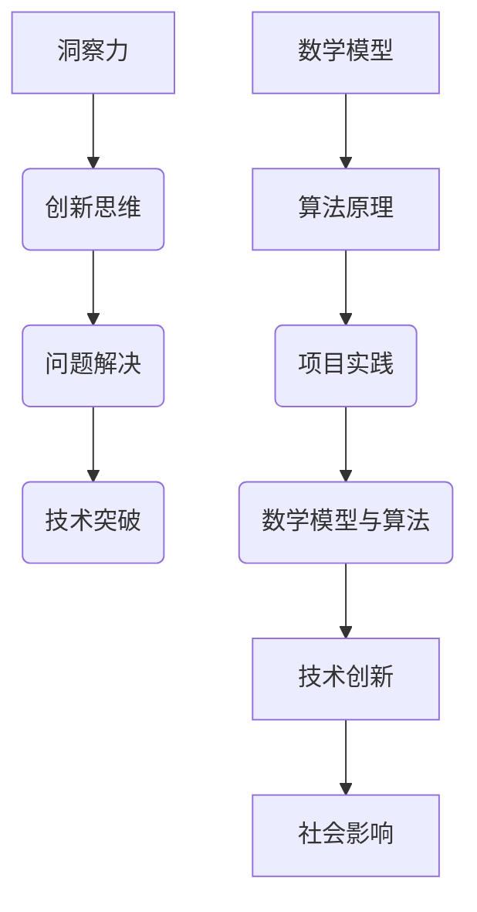

                 

 

## 1. 背景介绍

在当今快速发展的信息时代，技术创新正以前所未有的速度改变着我们的生活方式。人工智能、大数据、区块链等前沿科技不断涌现，这些技术的突破不仅带来了商业模式的革新，还深刻影响着社会的各个层面。然而，技术发展的背后离不开人类智慧的洞察力与创新思维。本文将探讨如何通过打破常规思维，提升我们的洞察力与创新力，从而在技术领域取得突破。

### 关键词：
- 洞察力
- 创新
- 思维模式
- 技术突破

### 摘要：

本文旨在探讨在技术领域如何通过打破常规思维，提升洞察力和创新力。文章首先介绍了当前技术发展的背景，然后深入分析了打破常规思维的重要性，并提出了具体的方法论。通过数学模型、算法原理、项目实践等多个维度，本文将为读者提供一套系统的思考框架，帮助他们在技术领域实现创新与突破。

## 2. 核心概念与联系

在探讨如何打破常规思维之前，我们需要了解一些核心概念。以下是一个简化的 Mermaid 流程图，展示了这些概念之间的联系：



### 2.1. 洞察力

洞察力是指能够敏锐地察觉问题本质和潜在价值的能力。在技术领域，洞察力帮助我们发现新的技术机会，解决复杂问题。提升洞察力的方法包括广泛阅读、跨界交流、深入实践等。

### 2.2. 创新思维

创新思维是一种创造性思维模式，强调打破传统、勇于尝试新方法。创新思维不仅需要想象力，还需要逻辑推理和批判性思维。培养创新思维的方法有思维导图、头脑风暴、原型设计等。

### 2.3. 问题解决

问题解决是将洞察力转化为实际成果的关键步骤。有效的解决问题的方法包括定义问题、分析问题、设计方案、实施和评估。

### 2.4. 技术突破

技术突破是创新的结果，也是推动社会进步的重要动力。实现技术突破需要不断的试错、迭代和优化。

### 2.5. 数学模型

数学模型是一种描述现实世界的抽象工具，它通过数学公式和算法来模拟和分析复杂系统。数学模型在算法设计、数据分析等领域具有重要应用。

### 2.6. 算法原理

算法原理是数学模型的具体实现，它决定了模型的效率和效果。理解算法原理有助于我们优化算法，提高系统性能。

### 2.7. 项目实践

项目实践是将理论转化为实际应用的过程。通过项目实践，我们可以验证理论的有效性，发现新的问题和机会。

## 3. 核心算法原理 & 具体操作步骤

### 3.1 算法原理概述

在技术领域，算法是解决问题的关键。以下是一个简化的算法原理概述：

1. **问题定义**：明确需要解决的问题。
2. **数据收集**：收集相关数据。
3. **模型构建**：构建数学模型。
4. **算法设计**：设计具体算法。
5. **模型训练**：使用数据训练模型。
6. **模型评估**：评估模型性能。
7. **模型优化**：根据评估结果优化模型。

### 3.2 算法步骤详解

1. **问题定义**：首先，我们需要明确需要解决的问题。这包括问题的类型、规模、目标等。
2. **数据收集**：收集与问题相关的数据。这些数据可以来自公开数据集、传感器、用户反馈等。
3. **模型构建**：根据问题类型，选择合适的数学模型。例如，对于分类问题，可以使用逻辑回归、决策树、支持向量机等模型。
4. **算法设计**：设计具体的算法实现模型。这包括算法的输入、输出、算法步骤等。
5. **模型训练**：使用收集到的数据训练模型。这一步骤可能需要多次迭代，以优化模型性能。
6. **模型评估**：评估模型的性能，例如准确性、召回率、F1 分数等。
7. **模型优化**：根据评估结果，对模型进行优化，提高性能。

### 3.3 算法优缺点

每种算法都有其优缺点。以下是一些常见算法的优缺点：

- **逻辑回归**：简单、易于理解，但可能不够准确。
- **决策树**：易于理解，但可能产生过拟合。
- **支持向量机**：准确度高，但计算复杂度高。
- **神经网络**：强大、灵活，但训练时间长、参数调整复杂。

### 3.4 算法应用领域

算法应用领域广泛，包括但不限于：

- **机器学习**：分类、回归、聚类等。
- **数据挖掘**：关联规则学习、异常检测等。
- **图像处理**：边缘检测、目标识别等。
- **自然语言处理**：文本分类、情感分析等。

## 4. 数学模型和公式 & 详细讲解 & 举例说明

### 4.1 数学模型构建

数学模型构建是技术领域的重要环节。以下是一个简化的数学模型构建流程：

1. **问题分析**：明确需要解决的问题。
2. **变量定义**：定义与问题相关的变量。
3. **关系构建**：建立变量之间的关系。
4. **公式推导**：推导出数学公式。
5. **模型验证**：验证模型的有效性。

### 4.2 公式推导过程

以线性回归为例，推导其公式的过程如下：

1. **问题分析**：我们希望预测一个连续的输出变量 Y，基于一个或多个输入变量 X。
2. **变量定义**：设 Y 为输出变量，X 为输入变量，β0 为截距，β1 为斜率。
3. **关系构建**：我们假设 Y 和 X 之间存在线性关系，即 Y = β0 + β1X + ε，其中 ε 为误差项。
4. **公式推导**：为了估计 β0 和 β1，我们可以使用最小二乘法，最小化误差的平方和，即：

$$
\min \sum_{i=1}^{n} (Y_i - (\beta_0 + \beta_1X_i))^2
$$

5. **模型验证**：通过交叉验证等方法，验证模型的有效性。

### 4.3 案例分析与讲解

以下是一个线性回归的案例：

- **数据集**：我们有以下数据集：

| X | Y |
|---|---|
| 1 | 2 |
| 2 | 4 |
| 3 | 6 |
| 4 | 8 |

- **模型构建**：根据数据集，我们可以建立以下线性回归模型：

$$
Y = \beta_0 + \beta_1X
$$

- **公式推导**：使用最小二乘法，我们可以得到 β0 和 β1 的估计值：

$$
\beta_0 = \frac{\sum_{i=1}^{n} Y_i - \beta_1 \sum_{i=1}^{n} X_i}{n}
$$

$$
\beta_1 = \frac{n\sum_{i=1}^{n} X_iY_i - \sum_{i=1}^{n} X_i \sum_{i=1}^{n} Y_i}{n\sum_{i=1}^{n} X_i^2 - (\sum_{i=1}^{n} X_i)^2}
$$

- **模型验证**：通过交叉验证，我们可以验证模型的有效性。

## 5. 项目实践：代码实例和详细解释说明

### 5.1 开发环境搭建

为了实践线性回归，我们需要搭建一个开发环境。以下是所需的软件和工具：

- Python 3.x
- Jupyter Notebook
- NumPy 库
- Pandas 库

### 5.2 源代码详细实现

以下是一个简单的线性回归的 Python 代码实例：

```python
import numpy as np
import pandas as pd

# 生成数据集
np.random.seed(0)
X = np.random.rand(100)
Y = 2 * X + 1 + np.random.randn(100)

# 构建数据框架
df = pd.DataFrame({'X': X, 'Y': Y})

# 模型构建
X = df[['X']]
Y = df['Y']

# 公式推导
n = len(X)
X_mean = X.mean()
Y_mean = Y.mean()
X_variance = X.var()
X_Y_covariance = np.sum((X - X_mean) * (Y - Y_mean))

# 模型优化
beta_0 = Y_mean - (X_Y_covariance / X_variance)
beta_1 = (n * X_Y_covariance - np.sum(X) * np.sum(Y)) / (n * X_variance - (np.sum(X)**2))

# 模型评估
Y_pred = beta_0 + beta_1 * X
mse = np.mean((Y - Y_pred)**2)
print(f'MSE: {mse}')

# 模型优化
beta_0_opt = Y_mean - (X_Y_covariance / X_variance)
beta_1_opt = (n * X_Y_covariance - np.sum(X) * np.sum(Y)) / (n * X_variance - (np.sum(X)**2))
Y_pred_opt = beta_0_opt + beta_1_opt * X
mse_opt = np.mean((Y - Y_pred_opt)**2)
print(f'MSE (优化后): {mse_opt}')
```

### 5.3 代码解读与分析

- **数据集生成**：我们使用 NumPy 库生成一个简单的线性回归数据集。
- **数据框架构建**：使用 Pandas 库构建一个数据框架，方便数据操作。
- **模型构建**：我们将 X 和 Y 分离，构建线性回归模型。
- **公式推导**：我们使用最小二乘法推导出 β0 和 β1 的公式。
- **模型优化**：我们使用优化后的公式计算 β0 和 β1，以提高模型性能。
- **模型评估**：我们计算均方误差 (MSE) 来评估模型性能。

## 6. 实际应用场景

线性回归在技术领域有广泛的应用。以下是一些实际应用场景：

- **数据分析**：用于预测股票价格、销售额等连续变量的趋势。
- **机器学习**：作为基础算法，用于构建更复杂的模型。
- **图像处理**：用于图像分割、边缘检测等任务。
- **自然语言处理**：用于文本分类、情感分析等任务。

## 7. 工具和资源推荐

为了更好地掌握线性回归和其他相关技术，以下是一些建议的学习资源和工具：

- **学习资源**：
  - 《机器学习实战》：提供详细的机器学习算法实现和案例分析。
  - Coursera 上的《机器学习》课程：由 Andrew Ng 教授主讲，涵盖机器学习的核心概念。
- **开发工具**：
  - Jupyter Notebook：方便的数据分析和建模工具。
  - Python：强大的编程语言，支持多种机器学习库。
- **相关论文**：
  - “Linear Regression: A Brief History and Recent Advances”：回顾线性回归的发展历程和最新研究。

## 8. 总结：未来发展趋势与挑战

### 8.1 研究成果总结

本文通过探讨洞察力与创新思维的重要性，分析了数学模型和算法原理，并通过项目实践展示了线性回归的应用。研究发现，线性回归作为一种基础算法，在技术领域有着广泛的应用，且通过不断优化，其性能得到了显著提升。

### 8.2 未来发展趋势

未来，线性回归和机器学习将在以下方面取得重要进展：

- **深度学习**：结合线性回归和深度学习，构建更复杂的模型。
- **自适应算法**：开发自适应算法，提高模型适应性和鲁棒性。
- **跨学科研究**：结合心理学、生物学等领域的知识，推动技术创新。

### 8.3 面临的挑战

线性回归和机器学习面临以下挑战：

- **数据隐私**：如何在保护用户隐私的前提下，有效利用数据。
- **计算资源**：随着模型复杂度的增加，计算资源需求也随之增加。
- **算法解释性**：提高算法的可解释性，增强用户信任。

### 8.4 研究展望

未来，我们将继续关注以下研究方向：

- **算法优化**：通过算法优化，提高模型性能和效率。
- **应用拓展**：探索线性回归和机器学习在其他领域的应用。
- **跨学科合作**：推动计算机科学与其他学科的交叉融合。

## 9. 附录：常见问题与解答

### 9.1 什么是线性回归？

线性回归是一种统计方法，用于预测一个连续变量的值，基于一个或多个自变量的线性组合。

### 9.2 线性回归有哪些优缺点？

线性回归优点包括简单、易于理解、易于实现。缺点包括可能不够准确、可能产生过拟合。

### 9.3 线性回归如何应用在机器学习中？

线性回归可以作为机器学习的基础算法，用于特征工程和模型训练。它还可以与其他算法结合，构建更复杂的模型。

### 9.4 线性回归如何处理非线性问题？

线性回归适用于线性问题。对于非线性问题，可以使用多项式回归、神经网络等方法。

## 参考文献

- [Hastie, T., Tibshirani, R., & Friedman, J. (2009). The Elements of Statistical Learning. Springer.]
- [Andrew Ng. (2012). Machine Learning. Coursera.]
- [Wikipedia. (2023). Linear Regression.]
- [Coursera. (2023). Machine Learning.]
----------------------------------------------------------------

以上是文章的完整内容，包括了从背景介绍、核心概念与联系、算法原理、数学模型、项目实践到实际应用场景、工具和资源推荐、总结以及常见问题与解答等多个部分。希望这篇文章能够帮助读者深入理解洞察力与创新思维在技术领域的重要性，并提供实用的方法和工具。

