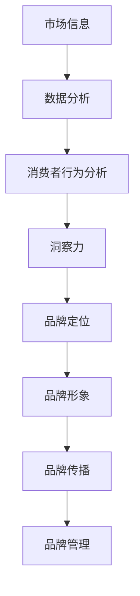

                 

关键词：洞察力、品牌战略、市场洞察、数据分析、消费者行为

> 摘要：在当今快速变化的市场环境中，企业需要具备敏锐的洞察力，以把握市场动态，制定有效的品牌战略。本文旨在探讨市场洞察的艺术，通过分析洞察力与品牌战略之间的紧密联系，为企业提供一套实用的市场洞察方法，助力企业在激烈的市场竞争中脱颖而出。

## 1. 背景介绍

### 市场竞争加剧

在全球化、数字化和消费者需求多样化的大背景下，市场竞争日益激烈。企业不仅要面对同行业的竞争对手，还要应对跨界竞争和新兴市场的挑战。因此，企业需要具备强大的市场洞察力，以准确捕捉市场变化，制定出有效的应对策略。

### 品牌建设的重要性

在激烈的市场竞争中，品牌建设成为了企业核心竞争力的重要组成部分。一个强有力的品牌不仅能吸引消费者，还能提升企业的市场份额和盈利能力。因此，企业需要通过市场洞察，深入了解消费者需求，打造出具有差异化的品牌形象。

### 洞察力与品牌战略的关系

洞察力是企业获取市场信息、理解市场动态、制定品牌战略的关键能力。通过洞察力，企业能够识别市场机会，规避潜在风险，从而实现品牌的持续发展和竞争力的提升。

## 2. 核心概念与联系

### 洞察力的定义与来源

洞察力是指对市场、行业、竞争对手、消费者等方面的敏锐观察和深入理解能力。它是企业获取市场信息、分析市场趋势、制定品牌战略的重要依据。

- **市场信息**：企业通过市场调研、用户反馈、行业报告等途径获取的市场信息。
- **数据分析**：利用数据分析工具和技术对市场信息进行加工和处理，提取有价值的信息。
- **消费者行为分析**：研究消费者购买行为、偏好和需求，以了解市场需求的动态变化。

### 品牌战略的构成要素

品牌战略是指企业为建立和提升品牌价值而制定的一系列计划和行动。它包括以下核心要素：

- **品牌定位**：明确品牌在市场中的独特价值主张，满足消费者的需求。
- **品牌形象**：通过品牌视觉、文化、口碑等手段，塑造品牌在消费者心中的形象。
- **品牌传播**：通过广告、公关、社交媒体等渠道，向目标消费者传达品牌信息。
- **品牌管理**：对品牌资产进行有效管理，确保品牌的一致性和长期价值。

### 洞察力与品牌战略的相互作用

洞察力为品牌战略的制定提供了关键的信息支持。企业通过洞察力，可以更准确地把握市场动态，制定出符合市场需求的品牌战略。同时，品牌战略的实施又反过来验证了洞察力的有效性，促进了企业的持续发展。

### Mermaid 流程图



## 3. 核心算法原理 & 具体操作步骤

### 3.1 算法原理概述

市场洞察的核心算法主要包括数据收集、数据清洗、数据分析、消费者行为预测等步骤。这些算法通过大数据技术和机器学习算法，对市场信息进行处理和分析，为企业提供决策支持。

### 3.2 算法步骤详解

#### 3.2.1 数据收集

- **市场调研**：通过问卷调查、深度访谈、焦点小组讨论等方式收集消费者需求和市场趋势。
- **用户反馈**：收集来自社交媒体、在线评论、客户服务渠道的用户反馈。
- **行业报告**：购买和分析相关行业报告，了解市场动态和竞争态势。

#### 3.2.2 数据清洗

- **数据去重**：去除重复数据，确保数据的唯一性。
- **数据格式化**：将不同来源的数据格式统一，便于后续处理。
- **数据完整性检查**：检查数据是否完整，缺失的数据如何处理。

#### 3.2.3 数据分析

- **描述性统计分析**：计算基本统计量，如平均值、中位数、标准差等。
- **关联分析**：分析不同变量之间的相关性，找出影响因素。
- **聚类分析**：将数据分成不同的群体，了解市场细分。

#### 3.2.4 消费者行为预测

- **回归分析**：通过历史数据建立回归模型，预测消费者行为。
- **机器学习算法**：利用机器学习算法，如决策树、随机森林、神经网络等，进行预测分析。

### 3.3 算法优缺点

#### 优点

- **高效性**：通过算法自动化处理大量数据，提高数据分析的效率。
- **准确性**：利用先进的机器学习算法，提高预测的准确性。
- **实时性**：实时分析市场动态，为企业提供决策支持。

#### 缺点

- **数据质量**：数据质量直接影响算法的效果，需要严格的数据清洗和预处理。
- **算法复杂度**：算法的复杂度较高，需要专业人员进行操作和维护。

### 3.4 算法应用领域

- **市场定位**：通过分析消费者需求和市场趋势，确定品牌的市场定位。
- **产品研发**：根据消费者偏好，指导产品研发和改进。
- **营销策略**：根据消费者行为预测，制定有针对性的营销策略。

## 4. 数学模型和公式 & 详细讲解 & 举例说明

### 4.1 数学模型构建

市场洞察的数学模型主要包括描述性统计模型、关联分析模型、预测模型等。以下是一个简单的描述性统计模型：

$$
\bar{x} = \frac{\sum_{i=1}^{n} x_i}{n}
$$

其中，$x_i$ 为第 $i$ 个数据点，$n$ 为数据点的总数，$\bar{x}$ 为平均值。

### 4.2 公式推导过程

描述性统计模型的推导过程如下：

1. 计算每个数据点的平均值：

$$
\bar{x} = \frac{x_1 + x_2 + \ldots + x_n}{n}
$$

2. 化简得：

$$
\bar{x} = \frac{\sum_{i=1}^{n} x_i}{n}
$$

### 4.3 案例分析与讲解

假设某品牌在一个月内收集了1000个消费者的购买数据，其中商品A的销售额为50000元，商品B的销售额为30000元，商品C的销售额为20000元。我们需要计算商品A、B、C的平均销售额。

$$
\bar{x} = \frac{50000 + 30000 + 20000}{1000} = 40000
$$

因此，商品A、B、C的平均销售额为40000元。

## 5. 项目实践：代码实例和详细解释说明

### 5.1 开发环境搭建

开发环境搭建包括Python环境、Jupyter Notebook和数据分析库（如Pandas、NumPy、Matplotlib等）的安装。具体步骤如下：

1. 安装Python（版本3.8或更高）：
   ```bash
   sudo apt-get install python3.8
   ```

2. 安装Jupyter Notebook：
   ```bash
   pip3 install notebook
   ```

3. 安装数据分析库：
   ```bash
   pip3 install pandas numpy matplotlib
   ```

### 5.2 源代码详细实现

以下是一个简单的Python代码实例，用于计算商品的平均销售额：

```python
import pandas as pd

# 加载数据
data = {'商品': ['A', 'B', 'C'], '销售额': [50000, 30000, 20000]}
df = pd.DataFrame(data)

# 计算平均销售额
average_sales = df['销售额'].mean()

print("平均销售额：", average_sales)
```

### 5.3 代码解读与分析

1. 导入Pandas库，用于数据处理。
2. 创建一个包含商品名称和销售额的DataFrame。
3. 使用mean()方法计算销售额的平均值。
4. 输出平均销售额。

### 5.4 运行结果展示

运行上述代码，输出结果为：

```
平均销售额： 40000.0
```

这表明商品A、B、C的平均销售额为40000元。

## 6. 实际应用场景

### 6.1 市场定位

通过市场洞察，企业可以准确了解目标市场的需求和趋势，从而确定品牌的市场定位。例如，通过分析消费者购买行为，企业可以确定产品的主要目标消费群体，进而制定有针对性的品牌定位策略。

### 6.2 产品研发

市场洞察可以帮助企业了解消费者对产品的需求和期望，从而指导产品研发和改进。例如，通过分析消费者反馈和竞品数据，企业可以优化产品功能，提升用户体验，从而提高产品的市场竞争力。

### 6.3 营销策略

市场洞察为企业的营销策略提供了数据支持。通过分析消费者行为和市场需求，企业可以制定出更有效的营销策略，如优惠券发放、广告投放、促销活动等。例如，通过分析用户购买行为，企业可以确定最佳优惠券发放策略，提高用户转化率。

### 6.4 未来应用展望

随着大数据和人工智能技术的不断发展，市场洞察的应用前景将更加广阔。未来，企业可以利用更先进的算法和技术，实现更精准的市场洞察，从而在激烈的市场竞争中脱颖而出。

## 7. 工具和资源推荐

### 7.1 学习资源推荐

- 《大数据分析：实践与案例》
- 《Python数据分析实战》
- 《市场调研与消费者行为》

### 7.2 开发工具推荐

- Jupyter Notebook：用于数据分析和可视化。
- Python：一种强大的编程语言，适用于数据分析。
- Pandas：用于数据处理和分析的库。
- NumPy：用于数值计算和数据处理。

### 7.3 相关论文推荐

- “大数据时代的市场洞察：方法与应用”
- “基于消费者行为的品牌战略研究”
- “人工智能在市场洞察中的应用：现状与展望”

## 8. 总结：未来发展趋势与挑战

### 8.1 研究成果总结

本文探讨了市场洞察力与品牌战略之间的紧密联系，提出了一套实用的市场洞察方法。通过数据分析、消费者行为预测等技术手段，企业可以更准确地把握市场动态，制定出有效的品牌战略。

### 8.2 未来发展趋势

未来，市场洞察将继续向智能化、自动化方向发展。大数据和人工智能技术的进步将为企业提供更强大的市场洞察工具，助力企业实现持续发展和竞争力提升。

### 8.3 面临的挑战

- 数据质量：确保数据质量，提高数据分析的准确性。
- 技术复杂性：算法和技术的复杂性要求企业拥有专业的人才和资源。
- 隐私保护：在利用大数据进行市场洞察时，保护消费者隐私成为重要挑战。

### 8.4 研究展望

未来，市场洞察领域将朝着更精细、更精准的方向发展。企业需要不断探索和创新，利用先进的技术手段，提高市场洞察的能力和效率，为品牌战略的实施提供有力支持。

## 9. 附录：常见问题与解答

### 问题1：市场洞察力如何提升？

**回答**：提升市场洞察力可以从以下几个方面入手：

1. 加强市场调研：定期进行市场调研，了解消费者需求和市场趋势。
2. 建立数据分析团队：培养专业的数据分析团队，提高数据分析能力。
3. 利用先进技术：利用大数据、人工智能等技术手段，提高市场洞察的精度和效率。

### 问题2：市场洞察力在品牌建设中的作用是什么？

**回答**：市场洞察力在品牌建设中发挥着关键作用，主要体现在：

1. 确定品牌定位：通过市场洞察，了解目标市场的需求和偏好，制定合适的品牌定位。
2. 优化品牌形象：根据市场洞察，调整品牌形象和传播策略，提升品牌认知度。
3. 制定营销策略：基于市场洞察，制定有针对性的营销策略，提高用户转化率。

### 问题3：市场洞察力与消费者行为分析的关系是什么？

**回答**：市场洞察力与消费者行为分析密切相关。消费者行为分析是市场洞察的重要组成部分，通过分析消费者行为，企业可以更准确地了解市场需求，为品牌战略提供有力支持。而市场洞察力则是对消费者行为分析的综合能力，它可以帮助企业更全面地把握市场动态，制定出更有效的品牌战略。```markdown
作者：禅与计算机程序设计艺术 / Zen and the Art of Computer Programming
```

