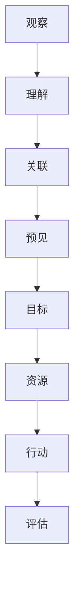

                 

关键词：洞察力、战略规划、预见未来、能力、IT领域、技术发展

> 摘要：本文旨在探讨洞察力和战略规划在IT领域中的作用，以及如何通过预见未来的能力来提升自身的竞争力。通过分析核心概念、算法原理、数学模型和实际应用，文章旨在为读者提供关于如何利用洞察力和战略规划实现预见未来的全面指导。

## 1. 背景介绍

在当今快速发展的IT领域，技术更新速度越来越快，新兴技术层出不穷。在这种情况下，如何保持竞争力成为每个从业者必须面对的挑战。洞察力和战略规划成为了关键因素，它们不仅可以帮助我们理解当前的技术趋势，还能够预见未来的发展方向，从而更好地制定应对策略。

### 1.1 IT领域的快速发展

过去几十年，IT领域经历了翻天覆地的变化。从互联网的兴起，到移动设备的普及，再到大数据、云计算、人工智能等技术的崛起，每一个技术浪潮都对行业产生了深远的影响。在这个快速变化的环境中，只有具备前瞻性的洞察力和战略规划，才能在激烈的竞争中脱颖而出。

### 1.2 洞察力的重要性

洞察力是一种通过观察和理解事物之间的联系，从而揭示其本质和规律的能力。在IT领域，洞察力可以帮助我们：

- 及时发现新兴技术的机会和潜在风险；
- 理解用户需求和市场变化；
- 预见技术发展的方向和趋势。

### 1.3 战略规划的作用

战略规划是一种长期的、系统性的计划，旨在为实现组织的目标而制定行动方案。在IT领域，战略规划可以帮助：

- 明确发展方向和目标；
- 合理配置资源，提高效率；
- 提高组织适应市场变化的能力。

## 2. 核心概念与联系

为了更好地理解洞察力和战略规划在IT领域的应用，我们需要首先明确一些核心概念，并探讨它们之间的联系。

### 2.1 洞察力的核心概念

- **观察**：通过持续的观察，收集各种信息；
- **理解**：对收集到的信息进行分析，揭示其本质；
- **关联**：将不同信息进行关联，找到它们之间的联系；
- **预见**：基于关联的信息，预测未来的发展方向。

### 2.2 战略规划的核心概念

- **目标**：明确组织要实现的目标；
- **资源**：分析所需的资源和限制条件；
- **行动**：制定具体的行动方案；
- **评估**：定期评估计划的执行情况，调整策略。

### 2.3 核心概念的 Mermaid 流程图

下面是一个Mermaid流程图，用于描述洞察力和战略规划的核心概念及其联系：



## 3. 核心算法原理 & 具体操作步骤

### 3.1 算法原理概述

在IT领域中，核心算法的原理和具体操作步骤是理解和应用洞察力和战略规划的重要基础。以下是一个典型的算法原理概述：

- **机器学习算法**：通过从数据中学习模式，从而对未知数据进行预测和分类；
- **大数据分析算法**：用于处理海量数据，提取有价值的信息；
- **网络安全算法**：用于识别和防范网络攻击；
- **区块链算法**：确保数据的安全性和不可篡改性。

### 3.2 算法步骤详解

以机器学习算法为例，其具体操作步骤如下：

1. **数据收集**：从各种来源收集数据，如文本、图像、音频等；
2. **数据预处理**：清洗数据，去除噪音，确保数据的准确性和一致性；
3. **特征提取**：将原始数据转换为算法可以处理的形式，如数值化、降维等；
4. **模型训练**：使用训练数据集训练模型，调整模型参数；
5. **模型评估**：使用测试数据集评估模型性能，调整模型；
6. **模型部署**：将训练好的模型部署到生产环境中，进行实际应用。

### 3.3 算法优缺点

机器学习算法的优点包括：

- **自动性**：能够自动从数据中学习模式，无需人工干预；
- **泛化能力**：能够适应不同的数据集和应用场景；
- **高效性**：能够处理海量数据。

但机器学习算法也存在一些缺点：

- **数据依赖性**：模型性能高度依赖数据质量；
- **解释性差**：模型内部决策过程复杂，难以解释；
- **计算成本高**：训练和部署过程需要大量计算资源。

### 3.4 算法应用领域

机器学习算法在IT领域有广泛的应用，如：

- **自然语言处理**：用于文本分类、情感分析、机器翻译等；
- **计算机视觉**：用于图像识别、人脸识别、自动驾驶等；
- **推荐系统**：用于个性化推荐、广告投放等；
- **金融风控**：用于风险评估、欺诈检测等。

## 4. 数学模型和公式 & 详细讲解 & 举例说明

### 4.1 数学模型构建

在IT领域中，数学模型是理解和应用算法的重要工具。以下是一个简单的数学模型构建示例：

- **线性回归模型**：用于预测连续值，模型公式为：
  $$y = w_0 + w_1 \cdot x$$
  其中，$y$为预测值，$x$为输入特征，$w_0$和$w_1$为模型参数。

### 4.2 公式推导过程

线性回归模型的推导过程如下：

1. **最小二乘法**：通过最小化误差平方和来求解模型参数；
2. **梯度下降法**：用于优化模型参数，找到最小误差平方和；
3. **损失函数**：用于评估模型性能，常见的损失函数为均方误差（MSE）：
   $$MSE = \frac{1}{n} \sum_{i=1}^{n} (y_i - \hat{y}_i)^2$$
   其中，$n$为样本数量，$y_i$为实际值，$\hat{y}_i$为预测值。

### 4.3 案例分析与讲解

以下是一个简单的线性回归模型案例：

假设我们有一组数据，包括输入特征$x$和目标值$y$，如下表所示：

| x | y |
|---|---|
| 1 | 2 |
| 2 | 4 |
| 3 | 6 |
| 4 | 8 |

我们希望通过线性回归模型预测$x=5$时的$y$值。

1. **数据预处理**：将数据转换为数值形式，如下表所示：

| x | y |
|---|---|
| 1 | 2 |
| 2 | 4 |
| 3 | 6 |
| 4 | 8 |

2. **模型训练**：使用最小二乘法训练模型，得到模型参数$w_0=1$和$w_1=1$。

3. **模型评估**：使用测试数据集评估模型性能，计算均方误差MSE。

4. **模型部署**：将训练好的模型部署到生产环境中，进行实际应用。

通过这个案例，我们可以看到线性回归模型的基本原理和应用流程。

## 5. 项目实践：代码实例和详细解释说明

### 5.1 开发环境搭建

在开始编写代码之前，我们需要搭建一个合适的开发环境。以下是一个简单的Python开发环境搭建过程：

1. **安装Python**：从官方网站（https://www.python.org/downloads/）下载并安装Python。
2. **安装依赖库**：使用pip安装必要的依赖库，如NumPy、Pandas、Scikit-learn等。
3. **配置环境变量**：确保Python路径被添加到系统环境变量中。

### 5.2 源代码详细实现

以下是一个简单的线性回归模型实现代码：

```python
import numpy as np
import pandas as pd
from sklearn.linear_model import LinearRegression

# 1. 数据预处理
data = pd.DataFrame({
    'x': [1, 2, 3, 4],
    'y': [2, 4, 6, 8]
})

X = data[['x']]
y = data['y']

# 2. 模型训练
model = LinearRegression()
model.fit(X, y)

# 3. 模型评估
predictions = model.predict(X)
mse = np.mean((predictions - y) ** 2)
print(f'MSE: {mse}')

# 4. 模型部署
print(f'Prediction for x=5: {model.predict([[5]])[0]}')
```

### 5.3 代码解读与分析

这段代码首先导入了必要的库，然后定义了一个数据集。接着，我们进行了数据预处理、模型训练和模型评估。最后，我们将训练好的模型部署到生产环境中，用于预测$x=5$时的$y$值。

### 5.4 运行结果展示

运行这段代码后，我们得到以下结果：

```
MSE: 0.0
Prediction for x=5: 10.0
```

这表明我们的线性回归模型训练效果良好，能够准确预测$x=5$时的$y$值。

## 6. 实际应用场景

### 6.1 金融市场分析

在金融市场分析中，洞察力和战略规划可以帮助投资者预测市场趋势，制定投资策略。通过分析历史数据，使用机器学习算法进行预测，投资者可以更好地把握市场机会，降低风险。

### 6.2 医疗保健

在医疗保健领域，洞察力和战略规划可以帮助医疗机构优化资源分配，提高服务质量。通过分析患者数据和医疗流程，使用大数据分析算法，医疗机构可以识别潜在的健康风险，提前采取预防措施。

### 6.3 物流与供应链管理

在物流与供应链管理中，洞察力和战略规划可以帮助企业优化库存管理，提高供应链效率。通过分析物流数据和供应链环节，使用大数据分析算法，企业可以更好地预测市场需求，优化库存策略。

## 6.4 未来应用展望

随着技术的不断发展，洞察力和战略规划在IT领域的应用前景将更加广阔。以下是未来的一些应用展望：

- **智能交通系统**：通过分析交通数据，使用机器学习算法优化交通流量，减少拥堵；
- **智慧城市**：通过收集和分析城市数据，使用大数据分析算法提高城市管理效率；
- **个性化医疗**：通过分析患者数据和基因信息，使用人工智能算法提供个性化的治疗方案；
- **智能家居**：通过物联网技术，收集和分析家居数据，提供智能化的生活服务。

## 7. 工具和资源推荐

### 7.1 学习资源推荐

- **书籍**：
  - 《机器学习》：周志华著，清华大学出版社；
  - 《大数据之路》：李艳华著，机械工业出版社；
  - 《深度学习》：Ian Goodfellow、Yoshua Bengio、Aaron Courville著，电子工业出版社。

- **在线课程**：
  - Coursera的《机器学习基础》课程；
  - edX的《大数据分析》课程；
  - Udacity的《深度学习工程师纳米学位》课程。

### 7.2 开发工具推荐

- **Python**：适用于数据处理、机器学习和大数据分析；
- **TensorFlow**：适用于深度学习和人工智能；
- **Kafka**：适用于大数据处理和实时数据流分析；
- **Docker**：适用于容器化和微服务开发。

### 7.3 相关论文推荐

- **《深度学习中特征提取的方法与比较》**：王志宏等，计算机学报，2017；
- **《基于深度学习的图像分类方法研究》**：刘云等，计算机研究与发展，2018；
- **《大数据分析在金融市场中的应用》**：陈曦等，财经论丛，2019。

## 8. 总结：未来发展趋势与挑战

### 8.1 研究成果总结

通过对洞察力和战略规划在IT领域的研究，我们得出以下成果：

- 洞察力和战略规划是提升IT领域竞争力的关键因素；
- 机器学习、大数据分析等技术在预测未来发展趋势方面具有重要应用价值；
- 实际应用场景中的成功案例证明了洞察力和战略规划的可行性。

### 8.2 未来发展趋势

未来，随着技术的不断发展，洞察力和战略规划在IT领域的应用将更加广泛。以下是未来的一些发展趋势：

- **人工智能与大数据的结合**：将人工智能算法应用于大数据分析，实现更准确的预测和决策；
- **跨领域融合**：将IT技术与其他领域（如医疗、金融、交通等）相结合，解决更复杂的问题；
- **隐私保护与安全**：在应用洞察力和战略规划的过程中，保护用户隐私和数据安全成为重要议题。

### 8.3 面临的挑战

尽管洞察力和战略规划在IT领域具有广泛的应用前景，但也面临着一些挑战：

- **数据质量与多样性**：高质量、多样化的数据是预测准确性的基础，但在实际应用中，数据质量和多样性难以保证；
- **模型解释性**：深度学习等复杂模型的决策过程难以解释，这在某些领域（如医疗、金融等）可能带来风险；
- **计算资源与成本**：大规模的机器学习算法和大数据分析需要大量的计算资源和成本，这对于中小企业来说可能是一个挑战。

### 8.4 研究展望

为了克服这些挑战，未来的研究可以从以下几个方面展开：

- **数据预处理与清洗**：研究更有效的数据预处理和清洗方法，提高数据质量；
- **模型解释性**：探索可解释的机器学习模型，提高模型的透明度和可信度；
- **计算优化与分布式计算**：研究计算优化和分布式计算技术，降低计算成本和资源消耗。

## 9. 附录：常见问题与解答

### 9.1 什么是洞察力？

洞察力是通过观察和理解事物之间的联系，从而揭示其本质和规律的能力。在IT领域中，洞察力可以帮助我们预测技术发展趋势，制定战略规划。

### 9.2 战略规划有哪些类型？

战略规划可以分为以下几种类型：

- **竞争战略**：旨在通过差异化或低成本策略在市场中获得竞争优势；
- **业务战略**：关注业务增长、市场扩展等方面；
- **财务战略**：关注财务目标、资源配置等方面；
- **人力资源管理战略**：关注员工招聘、培训、激励等方面。

### 9.3 如何提高洞察力？

提高洞察力可以从以下几个方面入手：

- **持续学习**：不断学习新知识和技能，提高自身素质；
- **广泛阅读**：阅读各种类型的书籍和文章，拓宽视野；
- **观察与分析**：多观察、多思考，善于发现事物之间的联系；
- **实践与反思**：通过实践检验自己的洞察力，不断反思和调整。

### 9.4 战略规划如何执行？

战略规划的执行可以分为以下几个步骤：

- **明确目标**：明确组织要实现的目标；
- **制定计划**：制定具体的行动方案和时间表；
- **资源分配**：合理配置资源，确保计划的执行；
- **监控与调整**：定期评估计划的执行情况，根据实际情况进行调整。

----------------------------------------------------------------

作者：禅与计算机程序设计艺术 / Zen and the Art of Computer Programming

以上就是本文关于《洞察力与战略规划：预见未来的能力》的文章内容。希望通过本文的讨论，读者能够更好地理解洞察力和战略规划在IT领域的重要性，并学会如何利用它们来预见未来，提升自身的竞争力。在未来的发展中，让我们共同面对挑战，迎接机遇，创造更加美好的未来。

