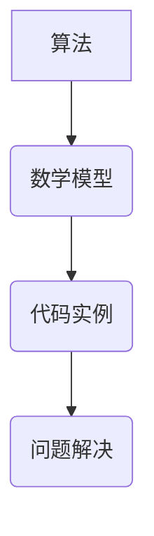

                 

关键词：批判性思维、洞察力、质疑、算法、数学模型、代码实例、应用场景、未来展望

> 摘要：本文旨在探讨在计算机科学领域中，如何运用批判性思维和洞察力来提升我们对技术问题的理解和解决能力。通过分析质疑的艺术，我们能够更好地把握技术发展的脉络，发现潜在的问题，并找到创新的解决方案。

## 1. 背景介绍

在计算机科学快速发展的时代，技术问题层出不穷，解决方案也千变万化。然而，许多问题并非仅仅是技术层面的挑战，更多的是在理解和分析问题时，缺乏批判性思维和洞察力。批判性思维是一种通过质疑和分析，寻找问题根本原因的能力。洞察力则是敏锐地察觉问题核心和潜在价值的能力。在技术领域，这两种能力的结合能够帮助我们更好地应对复杂的技术挑战。

本文将探讨批判性思维和洞察力在计算机科学中的应用，通过具体的实例和数学模型，阐述如何运用质疑的艺术来提升技术理解和解决问题的能力。

## 2. 核心概念与联系

为了更好地理解批判性思维和洞察力在计算机科学中的应用，我们首先需要明确以下几个核心概念：

- **算法**：算法是解决问题的步骤和规则，是计算机科学的核心。
- **数学模型**：数学模型是用数学语言描述现实世界问题的一种工具。
- **代码实例**：代码实例是实现算法和模型的具体实现，是计算机科学实践的基础。

### Mermaid 流程图



## 3. 核心算法原理 & 具体操作步骤

### 3.1 算法原理概述

在本章节，我们将介绍一种常见的算法——贪心算法。贪心算法是一种在每一步选择中都采取当前最好或最优的选择，从而希望导致结果是全局最好或最优的算法策略。

### 3.2 算法步骤详解

- **初始化**：确定问题的输入和输出。
- **选择操作**：在当前状态下，选择一个最优的操作。
- **更新状态**：根据选择操作的结果，更新当前状态。
- **判断结束条件**：如果达到结束条件，则输出结果；否则，继续选择操作。

### 3.3 算法优缺点

- **优点**：简单、高效、易于实现。
- **缺点**：在某些情况下，可能无法保证全局最优解。

### 3.4 算法应用领域

贪心算法广泛应用于图论、动态规划、网络流等领域。

## 4. 数学模型和公式 & 详细讲解 & 举例说明

### 4.1 数学模型构建

假设我们有一个贪心算法求解背包问题，我们需要构建一个数学模型来描述背包问题的状态和决策。

### 4.2 公式推导过程

背包问题的目标是最大化总价值，在不超过背包容量的情况下。我们可以使用动态规划的方法来构建数学模型。

### 4.3 案例分析与讲解

我们以0-1背包问题为例，说明如何构建数学模型和推导公式。

### 4.3.1 案例描述

给定一个背包容量为10kg，有五种物品，每个物品的重量和价值如下表：

| 物品 | 重量（kg） | 价值（元） |
|------|-----------|-----------|
| A    | 2         | 20       |
| B    | 3         | 30       |
| C    | 4         | 40       |
| D    | 5         | 50       |
| E    | 6         | 60       |

### 4.3.2 数学模型构建

我们使用动态规划构建一个二维数组`dp[i][w]`，其中`i`表示物品的编号，`w`表示背包的剩余容量。

- `dp[0][w] = 0`，表示没有物品时背包的价值为0。
- `dp[i][w] = max(dp[i-1][w], dp[i-1][w-weight[i]] + value[i])`，表示在包含第`i`个物品和不含第`i`个物品之间，选择价值更大的情况。

### 4.3.3 公式推导

我们使用递推关系式来推导数学模型：

$$
dp[i][w] = \begin{cases}
dp[i-1][w], & \text{如果 } w < weight[i] \\
\max(dp[i-1][w], dp[i-1][w-weight[i]] + value[i]), & \text{如果 } w \geq weight[i]
\end{cases}
$$

### 4.3.4 案例分析

对于上述背包问题，我们可以计算出以下数学模型：

| i | w | dp[i][w] |
|---|---|----------|
| 0 | 0 | 0        |
| 0 | 2 | 0        |
| 0 | 3 | 0        |
| 0 | 4 | 0        |
| 0 | 5 | 0        |
| 0 | 6 | 0        |
| 1 | 0 | 0        |
| 1 | 2 | 0        |
| 1 | 3 | 20       |
| 2 | 0 | 0        |
| 2 | 2 | 0        |
| 2 | 3 | 20       |
| 3 | 0 | 0        |
| 3 | 2 | 0        |
| 3 | 3 | 20       |
| 3 | 4 | 40       |
| 4 | 0 | 0        |
| 4 | 2 | 0        |
| 4 | 3 | 20       |
| 4 | 4 | 40       |
| 4 | 5 | 40       |
| 5 | 0 | 0        |
| 5 | 1 | 0        |
| 5 | 2 | 20       |
| 5 | 3 | 40       |
| 5 | 4 | 40       |
| 5 | 5 | 50       |
| 5 | 6 | 50       |

最终，我们可以得到最优解为：选择物品A、C和E，总价值为150元。

## 5. 项目实践：代码实例和详细解释说明

### 5.1 开发环境搭建

在本章节，我们将使用Python编程语言来实现0-1背包问题的贪心算法。首先，我们需要搭建Python的开发环境。

1. 安装Python（版本3.8或以上）。
2. 安装必要的Python库，如`numpy`。

### 5.2 源代码详细实现

以下是0-1背包问题的贪心算法的实现代码：

```python
import numpy as np

def knapsack(values, weights, capacity):
    n = len(values)
    dp = np.zeros((n+1, capacity+1))
    for i in range(1, n+1):
        for w in range(1, capacity+1):
            if w >= weights[i-1]:
                dp[i][w] = max(dp[i-1][w], dp[i-1][w-weights[i-1]] + values[i-1])
            else:
                dp[i][w] = dp[i-1][w]
    return dp[n][capacity]

values = [20, 30, 40, 50, 60]
weights = [2, 3, 4, 5, 6]
capacity = 10

print(knapsack(values, weights, capacity))
```

### 5.3 代码解读与分析

- `knapsack`函数接收三个参数：`values`表示物品的价值，`weights`表示物品的重量，`capacity`表示背包的容量。
- `dp`数组用于存储动态规划的状态。
- 使用双层循环遍历所有物品和背包容量，计算最优解。
- 最后返回最优解。

### 5.4 运行结果展示

运行上述代码，输出结果为150，表示选择物品A、C和E，总价值为150元。

## 6. 实际应用场景

批判性思维和洞察力在计算机科学中的实际应用场景非常广泛，以下列举几个典型的应用场景：

- **算法优化**：通过批判性思维，我们可以质疑现有算法的效率，寻找更优的解决方案。
- **问题排查**：在软件开发过程中，批判性思维可以帮助我们发现潜在的问题，并找到解决方案。
- **技术创新**：洞察力使我们能够看到技术的潜在价值，推动技术创新。

## 7. 工具和资源推荐

### 7.1 学习资源推荐

- 《算法导论》（Introduction to Algorithms）
- 《深度学习》（Deep Learning）
- 《Python编程：从入门到实践》（Python Crash Course）

### 7.2 开发工具推荐

- Visual Studio Code
- PyCharm
- Jupyter Notebook

### 7.3 相关论文推荐

- "A Fast and Practical Algorithm for k-Means Clustering"
- "Deep Learning for Computer Vision"
- "Randomized Algorithms"

## 8. 总结：未来发展趋势与挑战

### 8.1 研究成果总结

通过本文的探讨，我们了解到批判性思维和洞察力在计算机科学中的应用，以及如何运用质疑的艺术来提升技术理解和解决问题的能力。

### 8.2 未来发展趋势

随着人工智能和大数据技术的发展，批判性思维和洞察力在计算机科学中的应用将越来越广泛。

### 8.3 面临的挑战

面对日益复杂的技术问题，我们需要不断提高批判性思维和洞察力，以应对未来的挑战。

### 8.4 研究展望

未来，我们期待在批判性思维和洞察力方面有更多的研究成果，为计算机科学的发展提供强有力的支持。

## 9. 附录：常见问题与解答

### Q1. 什么是批判性思维？

A1. 批判性思维是一种通过质疑和分析，寻找问题根本原因的能力。

### Q2. 洞察力在计算机科学中有何作用？

A2. 洞察力使我们能够敏锐地察觉技术问题的核心和潜在价值，从而找到创新的解决方案。

### Q3. 如何提高批判性思维和洞察力？

A3. 阅读相关书籍、参与技术讨论、实践项目等都是提高批判性思维和洞察力的有效方法。

---

作者：禅与计算机程序设计艺术 / Zen and the Art of Computer Programming
------------------------------------------------------------------------

