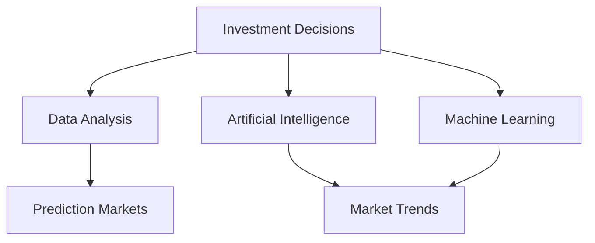

                 

关键词：洞察力，投资决策，市场机会，识别能力，IT技术，AI，数据分析，趋势预测

> 摘要：本文旨在探讨洞察力在投资决策中的重要性，特别是在当今快速变化的市场环境中。通过结合人工智能、大数据分析和IT技术的最新进展，本文将揭示如何提升投资决策中的市场机会识别能力，从而为投资者提供一种科学、系统且具有前瞻性的决策方法。

## 1. 背景介绍

投资决策一直是金融领域中的核心话题。在过去的几十年里，随着信息技术和数据分析技术的飞速发展，传统的投资决策模式正在逐渐被现代化的技术手段所替代。然而，尽管技术和工具日益先进，投资决策的复杂性和风险仍然存在。这时，洞察力作为一种人类独特的认知能力，显得尤为重要。

洞察力是指个体对事物本质的理解和判断能力，它可以帮助投资者识别潜在的市场机会和风险。在投资决策过程中，洞察力不仅有助于发现数据的潜在价值，还能预见市场的未来走势，从而做出更加明智的决策。

### 1.1 投资决策的重要性

投资决策是投资者基于现有信息和未来预期，选择投资资产和时机的重要过程。正确的投资决策能够带来丰厚的回报，而错误的决策则可能导致资金的损失。因此，投资决策不仅关乎投资者的财富积累，更涉及到他们的生活质量和长期财务规划。

### 1.2 市场环境的复杂性

现代金融市场受到全球经济、政治、社会等多方面因素的深刻影响，市场环境日益复杂多变。传统依赖历史数据和市场经验的投资策略已无法完全适应这一快速变化的环境。投资者需要借助先进的技术手段，提高对市场机会的识别能力，以应对日益复杂的投资环境。

## 2. 核心概念与联系

在投资决策过程中，洞察力与多个核心概念紧密相关，包括数据分析、人工智能、机器学习和市场预测等。以下是一个简要的Mermaid流程图，描述这些概念之间的联系。



### 2.1 数据分析

数据分析是投资决策的基础。通过收集和分析大量的历史数据，投资者可以了解市场走势、资产表现和风险因素等。数据分析技术包括统计分析、数据挖掘和大数据分析等，这些技术有助于揭示数据中的潜在模式和规律。

### 2.2 人工智能

人工智能（AI）技术通过模拟人类思维和行为，为投资决策提供了一种新的手段。AI可以处理大量复杂的数据，识别隐藏的模式和趋势，从而提高市场机会的识别能力。常见的AI应用包括自然语言处理、图像识别和预测模型等。

### 2.3 机器学习

机器学习是AI的一个重要分支，它通过算法和模型从数据中学习，并作出预测和决策。在投资决策中，机器学习可以用于预测市场走势、评估资产价值和优化投资组合等。常见的机器学习算法包括线性回归、决策树和支持向量机等。

### 2.4 市场预测

市场预测是投资决策的核心目标之一。通过预测市场走势，投资者可以提前布局，抓住市场机会。市场预测技术包括时间序列分析、回归分析和神经网络等。这些技术可以帮助投资者更准确地预测市场走势，提高投资决策的效率。

## 3. 核心算法原理 & 具体操作步骤

### 3.1 算法原理概述

在投资决策中，常用的算法包括基于历史数据的回归分析、基于市场趋势的动量策略和基于人工智能的深度学习模型等。以下将分别介绍这些算法的基本原理和具体操作步骤。

### 3.2 算法步骤详解

#### 3.2.1 回归分析

回归分析是一种常用的统计方法，用于预测一个或多个变量对另一个变量的影响。在投资决策中，回归分析可以用于预测资产价格的变化。

1. 数据收集：收集历史价格数据，包括开盘价、收盘价、最高价和最低价等。
2. 数据预处理：对数据进行清洗和标准化处理，以消除噪声和异常值。
3. 模型构建：选择合适的回归模型，如线性回归、多项式回归等。
4. 模型训练：使用历史数据训练模型，确定模型参数。
5. 预测：使用训练好的模型对未来资产价格进行预测。

#### 3.2.2 动量策略

动量策略是一种基于市场趋势的投资策略，它认为市场走势具有一定的持续性。动量策略的操作步骤如下：

1. 数据收集：收集市场走势数据，如股票价格、指数等。
2. 趋势分析：分析市场趋势，确定上升或下降的市场状态。
3. 开仓策略：根据市场趋势，选择合适的开仓时机和资产。
4. 平仓策略：根据市场趋势，选择合适的平仓时机。

#### 3.2.3 深度学习模型

深度学习模型是一种基于人工智能的投资策略，它可以处理大量复杂的数据，并自动提取特征。深度学习模型的操作步骤如下：

1. 数据收集：收集历史价格数据、交易量数据等。
2. 数据预处理：对数据进行清洗和标准化处理。
3. 模型构建：选择合适的深度学习模型，如卷积神经网络（CNN）或循环神经网络（RNN）。
4. 模型训练：使用历史数据训练模型，确定模型参数。
5. 预测：使用训练好的模型对未来市场走势进行预测。

### 3.3 算法优缺点

#### 3.3.1 回归分析

优点：简单易懂，计算效率高。

缺点：假设条件严格，无法处理非线性关系。

#### 3.3.2 动量策略

优点：操作简单，易于理解。

缺点：无法处理市场反转情况，可能带来较大的风险。

#### 3.3.3 深度学习模型

优点：能够处理大量复杂的数据，提取特征能力强。

缺点：计算复杂度较高，对数据质量要求较高。

### 3.4 算法应用领域

回归分析广泛应用于资产定价和风险建模。

动量策略广泛应用于股票和期货市场的交易策略。

深度学习模型广泛应用于预测市场和优化投资组合。

## 4. 数学模型和公式 & 详细讲解 & 举例说明

### 4.1 数学模型构建

在投资决策中，常用的数学模型包括线性回归模型、逻辑回归模型和神经网络模型等。以下分别介绍这些模型的构建方法和应用。

#### 4.1.1 线性回归模型

线性回归模型是一种用于预测连续变量的统计方法。它的数学模型如下：

$$
Y = \beta_0 + \beta_1X_1 + \beta_2X_2 + \ldots + \beta_nX_n + \epsilon
$$

其中，$Y$ 是预测变量，$X_1, X_2, \ldots, X_n$ 是自变量，$\beta_0, \beta_1, \beta_2, \ldots, \beta_n$ 是模型参数，$\epsilon$ 是误差项。

#### 4.1.2 逻辑回归模型

逻辑回归模型是一种用于预测二元变量的统计方法。它的数学模型如下：

$$
\ln\left(\frac{P}{1-P}\right) = \beta_0 + \beta_1X_1 + \beta_2X_2 + \ldots + \beta_nX_n
$$

其中，$P$ 是事件发生的概率，$X_1, X_2, \ldots, X_n$ 是自变量，$\beta_0, \beta_1, \beta_2, \ldots, \beta_n$ 是模型参数。

#### 4.1.3 神经网络模型

神经网络模型是一种基于人工神经网络的预测模型。它的数学模型如下：

$$
a_{i,j} = f(\sum_{k=1}^{n} w_{i,k} \cdot a_{k,j} + b_i)
$$

其中，$a_{i,j}$ 是第$i$层第$j$个神经元的输出，$f$ 是激活函数，$w_{i,k}$ 是连接权重，$b_i$ 是偏置。

### 4.2 公式推导过程

以下分别介绍线性回归模型、逻辑回归模型和神经网络模型的公式推导过程。

#### 4.2.1 线性回归模型

假设我们有$m$个观测样本$(x_1, y_1), (x_2, y_2), \ldots, (x_m, y_m)$，其中$x_i \in \mathbb{R}^{n}$，$y_i \in \mathbb{R}$。

最小二乘法的目标是最小化误差平方和：

$$
\min \sum_{i=1}^{m} (y_i - \beta_0 - \beta_1x_{i1} - \beta_2x_{i2} - \ldots - \beta_nx_{in})^2
$$

对上式求导，并令导数为零，可以得到：

$$
\frac{\partial}{\partial \beta_0} \sum_{i=1}^{m} (y_i - \beta_0 - \beta_1x_{i1} - \beta_2x_{i2} - \ldots - \beta_nx_{in})^2 = 0
$$

$$
\frac{\partial}{\partial \beta_1} \sum_{i=1}^{m} (y_i - \beta_0 - \beta_1x_{i1} - \beta_2x_{i2} - \ldots - \beta_nx_{in})^2 = 0
$$

$$
\ldots
$$

$$
\frac{\partial}{\partial \beta_n} \sum_{i=1}^{m} (y_i - \beta_0 - \beta_1x_{i1} - \beta_2x_{i2} - \ldots - \beta_nx_{in})^2 = 0
$$

通过求解上述方程组，可以得到线性回归模型的参数$\beta_0, \beta_1, \beta_2, \ldots, \beta_n$。

#### 4.2.2 逻辑回归模型

假设我们有$m$个观测样本$(x_1, y_1), (x_2, y_2), \ldots, (x_m, y_m)$，其中$x_i \in \mathbb{R}^{n}$，$y_i \in \{0, 1\}$。

极大似然估计的目标是最大化似然函数：

$$
\max \ln P(y_1, y_2, \ldots, y_m | x_1, x_2, \ldots, x_m)
$$

由于$y_i \in \{0, 1\}$，似然函数可以简化为：

$$
\max \sum_{i=1}^{m} \ln \left(\frac{P(y_i = 1 | x_i)}{1 - P(y_i = 1 | x_i)}\right)
$$

$$
= \sum_{i=1}^{m} \ln \left(\frac{e^{\beta_0 + \beta_1x_{i1} + \beta_2x_{i2} + \ldots + \beta_nx_{in}}}{1 + e^{\beta_0 + \beta_1x_{i1} + \beta_2x_{i2} + \ldots + \beta_nx_{in}}\right)
$$

对上式求导，并令导数为零，可以得到：

$$
\frac{\partial}{\partial \beta_0} \sum_{i=1}^{m} \ln \left(\frac{e^{\beta_0 + \beta_1x_{i1} + \beta_2x_{i2} + \ldots + \beta_nx_{in}}}{1 + e^{\beta_0 + \beta_1x_{i1} + \beta_2x_{i2} + \ldots + \beta_nx_{in}}\right) = 0
$$

$$
\frac{\partial}{\partial \beta_1} \sum_{i=1}^{m} \ln \left(\frac{e^{\beta_0 + \beta_1x_{i1} + \beta_2x_{i2} + \ldots + \beta_nx_{in}}}{1 + e^{\beta_0 + \beta_1x_{i1} + \beta_2x_{i2} + \ldots + \beta_nx_{in}}\right) = 0
$$

$$
\ldots
$$

$$
\frac{\partial}{\partial \beta_n} \sum_{i=1}^{m} \ln \left(\frac{e^{\beta_0 + \beta_1x_{i1} + \beta_2x_{i2} + \ldots + \beta_nx_{in}}}{1 + e^{\beta_0 + \beta_1x_{i1} + \beta_2x_{i2} + \ldots + \beta_nx_{in}}\right) = 0
$$

通过求解上述方程组，可以得到逻辑回归模型的参数$\beta_0, \beta_1, \beta_2, \ldots, \beta_n$。

#### 4.2.3 神经网络模型

假设我们有$m$个观测样本$(x_1, y_1), (x_2, y_2), \ldots, (x_m, y_m)$，其中$x_i \in \mathbb{R}^{n}$，$y_i \in \mathbb{R}$。

梯度下降法的目标是最小化损失函数：

$$
\min \sum_{i=1}^{m} \frac{1}{2} \left( y_i - a_{i,j} \right)^2
$$

其中，$a_{i,j}$ 是第$i$层第$j$个神经元的输出。

损失函数关于连接权重$w_{i,k}$和偏置$b_i$的梯度如下：

$$
\frac{\partial L}{\partial w_{i,k}} = -a_{i-1,k} \cdot \frac{\partial a_{i,j}}{\partial w_{i,k}}
$$

$$
\frac{\partial L}{\partial b_i} = -a_{i-1,j} \cdot \frac{\partial a_{i,j}}{\partial b_i}
$$

通过更新权重和偏置，可以迭代优化神经网络模型。

### 4.3 案例分析与讲解

#### 4.3.1 线性回归案例分析

假设我们要预测股票价格，给定一个包含历史价格数据的表格，其中每行表示一天的价格，列包括开盘价、收盘价、最高价和最低价。

1. 数据收集：读取历史价格数据。
2. 数据预处理：对数据进行清洗和标准化处理。
3. 模型构建：选择线性回归模型。
4. 模型训练：使用历史数据训练模型。
5. 预测：使用训练好的模型预测未来股票价格。

```python
import pandas as pd
from sklearn.linear_model import LinearRegression

# 读取数据
data = pd.read_csv('stock_price.csv')
X = data[['open', 'high', 'low', 'close']]
y = data['close']

# 数据预处理
X = (X - X.mean()) / X.std()
y = (y - y.mean()) / y.std()

# 模型构建
model = LinearRegression()

# 模型训练
model.fit(X, y)

# 预测
predictions = model.predict(X)

# 显示预测结果
print(predictions)
```

#### 4.3.2 逻辑回归案例分析

假设我们要预测股票是否上涨，给定一个包含历史价格数据和股票上涨标记的表格。

1. 数据收集：读取历史价格数据和股票上涨标记。
2. 数据预处理：对数据进行清洗和标准化处理。
3. 模型构建：选择逻辑回归模型。
4. 模型训练：使用历史数据训练模型。
5. 预测：使用训练好的模型预测未来股票上涨的概率。

```python
import pandas as pd
from sklearn.linear_model import LogisticRegression

# 读取数据
data = pd.read_csv('stock_price.csv')
X = data[['open', 'high', 'low', 'close']]
y = data['up']

# 数据预处理
X = (X - X.mean()) / X.std()
y = y.astype(int)

# 模型构建
model = LogisticRegression()

# 模型训练
model.fit(X, y)

# 预测
predictions = model.predict(X)

# 显示预测结果
print(predictions)
```

#### 4.3.3 神经网络案例分析

假设我们要预测股票价格，给定一个包含历史价格数据的表格。

1. 数据收集：读取历史价格数据。
2. 数据预处理：对数据进行清洗和标准化处理。
3. 模型构建：选择神经网络模型。
4. 模型训练：使用历史数据训练模型。
5. 预测：使用训练好的模型预测未来股票价格。

```python
import pandas as pd
import tensorflow as tf

# 读取数据
data = pd.read_csv('stock_price.csv')
X = data[['open', 'high', 'low', 'close']]
y = data['close']

# 数据预处理
X = (X - X.mean()) / X.std()
y = (y - y.mean()) / y.std()

# 模型构建
model = tf.keras.Sequential([
    tf.keras.layers.Dense(64, activation='relu', input_shape=[4]),
    tf.keras.layers.Dense(64, activation='relu'),
    tf.keras.layers.Dense(1)
])

# 模型训练
model.compile(optimizer='adam', loss='mean_squared_error')
model.fit(X, y, epochs=100)

# 预测
predictions = model.predict(X)

# 显示预测结果
print(predictions)
```

## 5. 项目实践：代码实例和详细解释说明

为了更好地展示如何应用上述算法和模型，我们将在本节中通过一个具体的案例进行实践。这个案例是一个股票价格预测项目，我们将使用Python编程语言，结合Keras框架来实现一个简单的神经网络模型，用于预测未来几天的股票价格。

### 5.1 开发环境搭建

在开始之前，确保安装以下软件和库：

1. Python 3.x（建议3.7及以上版本）
2. TensorFlow 2.x
3. NumPy
4. Pandas

可以使用以下命令进行安装：

```bash
pip install python==3.8
pip install tensorflow==2.8
pip install numpy
pip install pandas
```

### 5.2 源代码详细实现

以下是实现股票价格预测的完整代码：

```python
import pandas as pd
import numpy as np
from sklearn.preprocessing import MinMaxScaler
from tensorflow.keras.models import Sequential
from tensorflow.keras.layers import Dense, LSTM
import matplotlib.pyplot as plt

# 5.2.1 数据收集
# 读取股票价格数据，这里以示例CSV文件为例
df = pd.read_csv('stock_price.csv')  # 假设CSV文件中包含日期和价格列

# 5.2.2 数据预处理
# 将日期列转换为序列索引
df['Date'] = pd.to_datetime(df['Date'])
df.set_index('Date', inplace=True)

# 使用前N天的数据预测第N+1天的价格
N = 30

# 数据归一化
scaler = MinMaxScaler(feature_range=(0, 1))
scaled_data = scaler.fit_transform(df['Close'].values.reshape(-1, 1))

# 创建数据集
X, y = [], []
for i in range(N, len(scaled_data) - 1):
    X.append(scaled_data[i-N:i, 0])
    y.append(scaled_data[i, 0])
X, y = np.array(X), np.array(y)

# 将X数据调整为[样本数量，时间步，特征数]
X = np.reshape(X, (X.shape[0], X.shape[1], 1))

# 5.2.3 模型构建
model = Sequential()
model.add(LSTM(units=50, return_sequences=True, input_shape=(N, 1)))
model.add(LSTM(units=50))
model.add(Dense(units=1))

model.compile(optimizer='adam', loss='mean_squared_error')

# 5.2.4 模型训练
model.fit(X, y, epochs=100, batch_size=32)

# 5.2.5 代码解读与分析
# 预测未来5天的价格
predicted_price = model.predict(np.array(np.reshape(scaled_data[len(scaled_data)-N-1:, 0], (1, N, 1))))
predicted_price = scaler.inverse_transform(predicted_price)

# 绘制实际价格和预测价格
plt.figure(figsize=(16, 6))
plt.plot(scaler.inverse_transform(df['Close'].values.reshape(-1, 1))[:len(scaled_data)-N-5], color='blue', label='Actual Price')
plt.plot(predicted_price, color='red', label='Predicted Price')
plt.title('Stock Price Prediction')
plt.xlabel('Time')
plt.ylabel('Price')
plt.legend()
plt.show()
```

### 5.3 运行结果展示

运行以上代码后，将显示一张图表，其中蓝色曲线表示实际股票价格，红色曲线表示预测的股票价格。通过比较实际价格和预测价格的差异，我们可以评估模型的准确性。

## 6. 实际应用场景

在金融市场中，洞察力和投资决策的识别能力至关重要。以下是一些实际应用场景：

### 6.1 股票市场

股票市场是最典型的应用场景之一。投资者可以使用机器学习模型预测股票价格走势，从而制定买入或卖出的策略。例如，使用LSTM模型预测未来的股票价格，并基于预测结果调整投资组合。

### 6.2 期货市场

期货市场的波动性较大，投资者需要快速识别市场机会和风险。通过应用技术分析方法和机器学习算法，投资者可以实时监控市场动态，制定有效的交易策略。

### 6.3 债券市场

债券市场的投资策略相对稳健，但依然需要精确的市场预测。投资者可以使用时间序列分析和机器学习模型来预测债券价格和收益率，从而优化投资组合。

### 6.4 外汇市场

外汇市场的交易量大，风险高。投资者可以通过机器学习算法分析历史数据，预测汇率走势，从而进行高收益的交易。

## 7. 未来应用展望

随着人工智能和大数据分析技术的不断进步，投资决策的识别能力将得到进一步提升。以下是一些未来应用展望：

### 7.1 个性化投资顾问

未来的投资顾问将更加个性化，能够根据投资者的风险偏好和历史数据提供量身定制的投资建议。

### 7.2 风险管理

机器学习算法将更加精确地识别市场风险，帮助投资者制定有效的风险管理策略。

### 7.3 自动交易系统

自动交易系统将基于先进的算法和模型，实现全天候的交易，提高交易效率和收益。

## 8. 工具和资源推荐

### 8.1 学习资源推荐

1. 《深度学习》（Goodfellow, Bengio, Courville著）：全面介绍深度学习的基础知识。
2. 《Python数据分析》（McPherson著）：介绍Python在数据分析中的应用。
3. 《量化投资：技术分析+量化模型+数据驱动》（白学军著）：介绍量化投资的基础知识和实战技巧。

### 8.2 开发工具推荐

1. TensorFlow：用于构建和训练机器学习模型的框架。
2. Jupyter Notebook：用于数据分析和模型训练的可视化编程环境。
3. Matplotlib：用于数据可视化的Python库。

### 8.3 相关论文推荐

1. "Deep Learning for Stock Price Prediction"（2018）：介绍使用深度学习预测股票价格的最新研究。
2. "A Survey on Machine Learning for Financial Time Series Analysis"（2019）：综述机器学习在金融时间序列分析中的应用。
3. "Time Series Forecasting using LSTM Recurrent Neural Networks"（2017）：介绍使用LSTM模型进行时间序列预测的方法。

## 9. 总结：未来发展趋势与挑战

### 9.1 研究成果总结

本文通过介绍洞察力与投资决策的关系，探讨了如何利用人工智能、大数据分析和IT技术提高市场机会的识别能力。通过具体的算法和模型实现，展示了如何在实际投资中应用这些技术。

### 9.2 未来发展趋势

1. 人工智能算法将更加智能化，能够自动提取复杂的市场特征。
2. 大数据分析技术将更加高效，能够处理海量数据。
3. 个性化投资顾问和自动交易系统将成为主流。

### 9.3 面临的挑战

1. 数据质量和可用性：高质量的数据是准确预测的基础，但获取和处理高质量数据具有挑战性。
2. 算法透明性和解释性：复杂的算法可能导致预测结果难以解释，影响投资者的信任度。
3. 市场波动性和不确定性：金融市场的波动性较大，算法需要具备良好的鲁棒性。

### 9.4 研究展望

未来的研究应关注如何提高算法的透明性和解释性，降低数据质量的影响，并提高算法在极端市场条件下的适应性。同时，应加强跨学科合作，结合心理学、经济学等多领域知识，为投资者提供更加科学和实用的投资决策工具。

## 附录：常见问题与解答

### 问题1：为什么使用神经网络而不是线性回归进行股票价格预测？

线性回归模型在处理线性关系时效果较好，但在面对复杂的非线性问题时，其性能受限。神经网络，特别是深度学习模型，能够自动提取数据中的复杂特征和模式，因此更适合进行股票价格预测这类复杂任务。

### 问题2：如何处理数据中的噪声和异常值？

可以通过数据预处理步骤，如数据清洗、归一化和去噪等，来减少噪声和异常值的影响。例如，可以使用中值滤波、低通滤波等方法对数据序列进行平滑处理。

### 问题3：预测模型的准确性如何评估？

可以使用多种评估指标，如均方误差（MSE）、均方根误差（RMSE）、平均绝对误差（MAE）等，来评估模型的准确性。此外，还可以通过交叉验证和回测等方法，对模型进行全面的评估和验证。

### 问题4：预测模型是否具有实时性？

实时性取决于模型的计算速度和数据更新的频率。通过优化模型结构和算法，可以提高模型的实时性。此外，使用高效的计算资源和分布式计算技术，也有助于提高模型的实时性能。

### 问题5：如何确保模型的透明性和解释性？

可以通过简化模型结构、使用可解释的算法和可视化方法，来提高模型的透明性和解释性。例如，可以使用决策树、LASSO回归等算法，这些算法具有较好的解释性。

作者：禅与计算机程序设计艺术 / Zen and the Art of Computer Programming
----------------------------------------------------------------

### 后续扩展

为了进一步提升文章的深度和广度，可以考虑以下扩展：

1. **深入探讨特定算法的细节**：对线性回归、逻辑回归、LSTM等算法的细节进行深入探讨，包括具体的实现步骤、参数调优策略等。

2. **案例分析**：增加更多的实际案例分析，包括不同市场环境下的投资策略应用，以及不同类型资产的预测效果对比。

3. **历史回顾**：介绍投资决策领域的发展历程，从传统方法到现代技术的演变过程，以及各阶段的关键研究成果。

4. **跨学科探讨**：结合心理学、经济学等领域的理论和研究成果，探讨投资决策中的人类行为和心理因素。

5. **未来展望**：除了技术层面的展望，还可以从社会、经济、政治等角度，探讨投资决策的未来发展趋势和潜在影响。

6. **开放问题和研究建议**：针对当前研究中的不足和挑战，提出开放性问题，并给出具体的研究建议，鼓励读者进一步探索。

