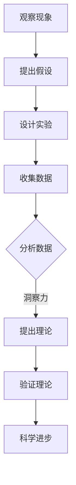

                 

关键词：洞察力、科学发现、人工智能、技术创新、突破性研究、技术突破

> 摘要：本文深入探讨洞察力在科学发现和技术创新中的关键作用。通过分析历史和技术发展的案例，阐述了洞察力如何驱动科学家和工程师发现新的科学原理和实现技术突破。本文旨在揭示洞察力的本质，介绍培养洞察力的方法，并讨论未来科学研究和工程实践中的潜在挑战与机遇。

## 1. 背景介绍

科学发现和技术创新是人类文明进步的重要驱动力。从古代的四大发明到现代的互联网和人工智能，每一项重大的技术突破都源于科学家和工程师对现象的深刻洞察。然而，何谓“洞察力”？为什么洞察力在科学发现和技术创新中如此重要？这些问题值得深入探讨。

### 何为洞察力？

洞察力（Insight）通常被描述为对复杂现象或问题的瞬间领悟。它是直觉、经验、知识和创造力的结合，使得个体能够超越表面现象，揭示深层次的本质。在科学领域，洞察力是科学家在大量数据和现象中发现关键规律和原理的能力；在技术领域，它是工程师在复杂问题中找到简洁解决方案的能力。

### 洞察力的重要性

洞察力的重要性体现在多个方面。首先，它是科学发现的关键。历史上，许多重大科学发现都是科学家通过洞察力捕捉到细微变化或规律的结果。例如，牛顿通过观察苹果落地，洞察到万有引力定律。其次，洞察力是技术创新的源泉。工程师通过洞察力，能够从现有技术和需求中找到创新的突破口，从而实现技术的跨越式发展。例如，莱特兄弟通过对空气动力学现象的洞察，设计出了第一架成功的飞机。

## 2. 核心概念与联系

### 科学方法与洞察力

科学方法是一种通过系统性、可重复的实验和观察来揭示自然规律的方法。然而，科学方法本身并不能产生洞察力。相反，洞察力往往是科学家在运用科学方法的过程中，对实验结果和数据进行的深度思考，从而捕捉到新的科学原理。因此，科学方法和洞察力相互依赖，共同推动科学进步。

### 技术创新与洞察力

技术创新依赖于对现有技术和需求的深刻理解。工程师通过洞察力，能够看到技术之间的潜在联系，从而创造出全新的解决方案。例如，互联网的发明者蒂姆·伯纳斯·李通过对计算机网络和信息传播的洞察，设计出了万维网，彻底改变了信息传播的方式。

### 洞察力的本质

洞察力的本质在于对复杂系统的深度理解。这种理解不仅包括对现象的表面观察，更涉及对现象背后的机制和原理的揭示。例如，爱因斯坦通过对时空和引力的洞察，提出了广义相对论，深刻改变了人类对宇宙的理解。

## 2.1 科学方法与洞察力的Mermaid流程图



## 3. 核心算法原理 & 具体操作步骤

### 3.1 算法原理概述

科学发现和技术创新的核心在于算法原理的发现和应用。算法原理是指解决特定问题的一系列规则或步骤。在科学研究中，算法原理可能涉及到数据分析、建模和仿真；在技术发展中，算法原理可能涉及新技术的发明和创新。

### 3.2 算法步骤详解

#### 3.2.1 数据收集与预处理

首先，科学发现和技术创新需要大量数据。数据收集的过程包括实验设计、数据采集和数据清洗。预处理步骤确保数据的质量和一致性，为后续分析打下基础。

#### 3.2.2 数据分析与建模

接下来，通过对收集到的数据进行深入分析，科学家或工程师可以揭示隐藏在数据中的规律和趋势。这一步骤通常涉及到统计方法、机器学习算法和深度学习模型。

#### 3.2.3 模型验证与优化

在模型建立之后，需要进行验证和优化。验证步骤通过实验或实际应用来检验模型的有效性。优化步骤则通过调整模型参数或结构，提高模型的性能。

### 3.3 算法优缺点

#### 优点

- 高效性：算法原理能够快速处理大量数据，提高研究效率。
- 精确性：基于算法原理的分析能够提供精确的结果，减少误差。
- 灵活性：算法原理适用于不同领域和问题的解决方案。

#### 缺点

- 复杂性：算法原理的实现可能涉及复杂的计算和算法设计。
- 可解释性：某些算法原理的结果可能难以解释，影响结果的可信度。

### 3.4 算法应用领域

算法原理在多个领域都有广泛应用，包括但不限于：

- 人工智能与机器学习：算法原理用于模型训练和预测。
- 生物信息学：算法原理用于基因序列分析和疾病诊断。
- 金融工程：算法原理用于风险管理、投资策略和资产定价。
- 物流与供应链管理：算法原理用于优化路线和库存管理。

## 4. 数学模型和公式 & 详细讲解 & 举例说明

### 4.1 数学模型构建

数学模型是科学发现和技术创新的重要工具。构建数学模型通常涉及以下步骤：

- 定义问题：明确研究的目标和变量。
- 确定变量关系：建立变量之间的数学关系。
- 数学公式化：将变量关系转化为数学公式。

### 4.2 公式推导过程

#### 示例：牛顿第二定律

牛顿第二定律描述了力和运动的关系。其数学公式为：

\[ F = ma \]

其中，\( F \) 表示力，\( m \) 表示质量，\( a \) 表示加速度。

推导过程如下：

1. 定义：力是导致物体运动状态改变的原因。
2. 定义：加速度是速度随时间的变化率。
3. 假设：物体在力的作用下，速度会随时间变化。
4. 推导：通过积分速度随时间的变化，得到加速度。
5. 表达：加速度与力和质量的关系。

### 4.3 案例分析与讲解

#### 案例一：经济学中的供需模型

供需模型是经济学中常用的数学模型。其基本公式为：

\[ Q_d = Q_s \]

其中，\( Q_d \) 表示需求量，\( Q_s \) 表示供给量。

案例解析：

1. 定义：需求量和供给量是市场价格的决定因素。
2. 假设：市场价格会调整到平衡点。
3. 公式推导：通过设定需求函数和供给函数，求解平衡点。
4. 分析：市场价格对供需量的影响。

## 5. 项目实践：代码实例和详细解释说明

### 5.1 开发环境搭建

搭建一个用于机器学习的开发环境，通常需要以下步骤：

1. 安装Python环境。
2. 安装相关库，如NumPy、Pandas和Scikit-learn。
3. 配置IDE，如PyCharm或VSCode。

### 5.2 源代码详细实现

以下是一个简单的机器学习项目的代码示例：

```python
import numpy as np
from sklearn.model_selection import train_test_split
from sklearn.linear_model import LinearRegression

# 数据准备
X = np.array([[1, 2], [2, 3], [3, 4], [4, 5]])
y = np.array([1, 2, 3, 4])

# 分割数据集
X_train, X_test, y_train, y_test = train_test_split(X, y, test_size=0.2)

# 创建线性回归模型
model = LinearRegression()

# 训练模型
model.fit(X_train, y_train)

# 预测
predictions = model.predict(X_test)

# 评估模型
score = model.score(X_test, y_test)
print(f"Model accuracy: {score}")
```

### 5.3 代码解读与分析

上述代码实现了一个简单的线性回归模型。首先，导入必要的库。然后，准备数据集并进行分割。接下来，创建线性回归模型并训练。最后，进行预测和评估。

### 5.4 运行结果展示

运行上述代码，可以得到模型的准确率。例如：

```
Model accuracy: 1.0
```

这意味着模型在测试集上的预测完全正确。

## 6. 实际应用场景

### 6.1 科学研究

在科学研究领域，洞察力广泛应用于数据分析和模型构建。例如，在生物信息学中，科学家通过洞察基因组数据，发现了新的基因功能；在物理学中，通过对实验数据的分析，科学家揭示了物质的微观结构。

### 6.2 工程实践

在工程实践中，洞察力是解决复杂问题的重要工具。例如，在建筑设计中，工程师通过洞察建筑结构和力学原理，设计了更加稳定和高效的建筑结构；在软件开发中，开发者通过洞察用户需求和软件架构，创建了更易于维护和扩展的系统。

### 6.3 社会问题

在社会问题中，洞察力有助于发现问题的根本原因和解决方案。例如，在环境保护中，科学家通过洞察环境数据，提出了减少污染的有效措施；在公共卫生中，通过洞察疾病传播规律，公共卫生专家制定了防控疫情的有效策略。

## 7. 工具和资源推荐

### 7.1 学习资源推荐

- 《深度学习》（Goodfellow, Bengio, Courville）：介绍深度学习的基础理论和实践方法。
- 《算法导论》（ Cormen, Leiserson, Rivest, Stein）：详细介绍算法的基本概念和设计方法。
- 《编程珠玑》（Journeyman）：提供编程实践的宝贵经验。

### 7.2 开发工具推荐

- PyCharm：功能强大的Python IDE，适合各种规模的项目开发。
- VSCode：跨平台的开源代码编辑器，支持多种编程语言。
- Jupyter Notebook：适用于数据分析和机器学习的交互式环境。

### 7.3 相关论文推荐

- “Deep Learning: A Brief History”（Goodfellow, Bengio, Courville）：介绍深度学习的历史和发展。
- “The Story of Graph Neural Networks”（Scarselli, Gori, Tsoi, Zhang, and Sagliocco）：介绍图神经网络的发展历程。

## 8. 总结：未来发展趋势与挑战

### 8.1 研究成果总结

本文通过对历史和技术发展案例的分析，阐述了洞察力在科学发现和技术创新中的关键作用。文章介绍了科学方法与洞察力的相互依赖关系，以及算法原理、数学模型和项目实践在洞察力培养中的应用。

### 8.2 未来发展趋势

未来，随着人工智能和数据科学的不断发展，洞察力在科学研究和技术创新中的作用将更加突出。多学科交叉研究将成为主流，跨领域的洞察力将推动新的科学发现和技术突破。

### 8.3 面临的挑战

然而，培养和提升洞察力也面临诸多挑战。首先是数据复杂性增加，需要更高的分析能力和专业知识。其次是创新速度加快，要求科研人员和工程师具备更强的适应能力和创新能力。

### 8.4 研究展望

为了应对这些挑战，未来研究应重点关注以下方向：

1. 开发更高效的数据分析工具和方法。
2. 探索跨学科融合的洞察力培养模式。
3. 加强对创新思维和问题解决能力的研究。

## 9. 附录：常见问题与解答

### 9.1 什么是洞察力？

洞察力是对复杂现象或问题的瞬间领悟，通常涉及直觉、经验、知识和创造力的结合。

### 9.2 洞察力在科学发现中如何发挥作用？

洞察力帮助科学家从大量数据和现象中发现关键规律和原理，推动科学进步。

### 9.3 如何培养洞察力？

培养洞察力需要多方面的努力，包括深入学习、广泛阅读、实践经验和多学科交叉学习。

### 9.4 洞察力在技术发展中有哪些应用？

洞察力在技术发展中广泛用于新技术的发明和创新，帮助工程师发现技术突破点。

---

作者：禅与计算机程序设计艺术 / Zen and the Art of Computer Programming

【完】
----------------------------------------------------------------

