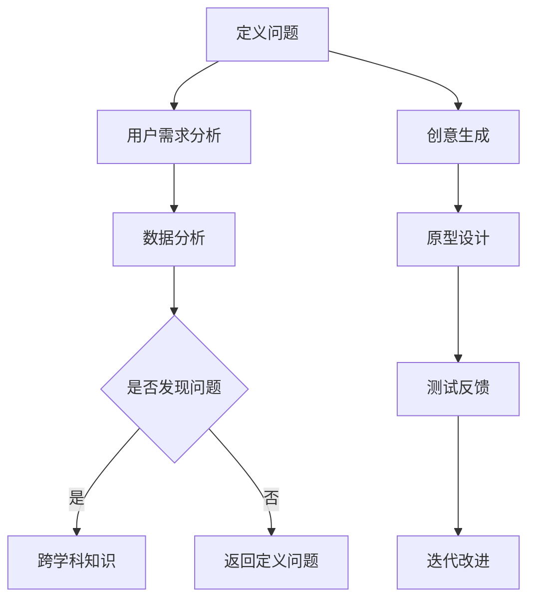

                 

洞察力与设计思维是现代问题解决领域的重要工具，它们在IT行业中尤其受到重视。本文将探讨这两个概念，以及如何将它们应用于以人为本的问题解决方法。

## 关键词

- 洞察力
- 设计思维
- 问题解决
- IT行业
- 人本主义

## 摘要

本文将探讨如何运用洞察力和设计思维，以及它们在IT行业中的应用。通过案例分析和实践，我们将了解这些方法如何帮助我们更好地理解用户需求，从而设计出更加人性化、高效的产品和服务。

## 1. 背景介绍

在信息技术不断发展的今天，IT行业面临着前所未有的挑战和机遇。如何高效地解决复杂问题，成为了企业成功的关键。而洞察力和设计思维，作为两种重要的方法论，正在被广泛应用于这一领域。

### 1.1 洞察力的定义

洞察力是指深入理解事物本质、发现问题和机会的能力。它是一种跨学科、多维度的思考方式，可以帮助我们超越表面现象，挖掘问题的根源。

### 1.2 设计思维的概述

设计思维是一种以人为本的问题解决方法，它强调理解用户需求、创新思维和实践应用。设计思维通常包括五个阶段：定义问题、创意生成、原型设计、测试反馈和迭代改进。

## 2. 核心概念与联系

### 2.1 洞察力的核心概念

- 用户需求分析：深入了解用户需求，挖掘用户痛点。
- 数据分析：通过对大量数据进行分析，发现潜在问题和机会。
- 跨学科知识：融合不同领域的知识，提高解决问题的能力。

### 2.2 设计思维的核心概念

- 用户中心：始终关注用户需求，以用户为中心进行设计。
- 创新思维：鼓励创新思维，不断探索新的解决方案。
- 实践导向：通过原型设计和测试反馈，不断优化产品和服务。

### 2.3 Mermaid 流程图



## 3. 核心算法原理 & 具体操作步骤

### 3.1 算法原理概述

本文将介绍一种基于洞察力和设计思维的问题解决算法。该算法主要包括以下几个步骤：

1. 定义问题：明确问题所在，分析问题原因。
2. 用户需求分析：深入了解用户需求，挖掘用户痛点。
3. 数据分析：收集和分析用户数据，找出潜在问题和机会。
4. 创意生成：结合用户需求和数据分析结果，提出创新解决方案。
5. 原型设计：设计并实现原型，进行初步测试。
6. 测试反馈：收集用户反馈，评估原型效果。
7. 迭代改进：根据测试反馈，不断优化原型。

### 3.2 算法步骤详解

1. **定义问题**

   - **收集信息**：通过调查、访谈等方式，收集与问题相关的信息。
   - **分析问题**：分析问题的原因和影响，明确问题的重要性和紧急性。

2. **用户需求分析**

   - **用户访谈**：与目标用户进行面对面交流，了解他们的需求和期望。
   - **用户调研**：通过问卷调查、用户行为分析等方式，收集用户数据。
   - **需求整理**：对收集到的用户需求进行分析和整理，形成用户需求文档。

3. **数据分析**

   - **数据收集**：收集与用户需求相关的数据，如用户行为数据、市场数据等。
   - **数据分析**：利用数据分析工具，对收集到的数据进行处理和分析，找出潜在问题和机会。

4. **创意生成**

   - **头脑风暴**：组织团队成员进行头脑风暴，提出可能的解决方案。
   - **筛选方案**：根据用户需求和数据分析结果，筛选出具有可行性的解决方案。

5. **原型设计**

   - **设计原型**：根据筛选出的解决方案，设计并实现原型。
   - **初步测试**：对原型进行初步测试，评估其效果和可行性。

6. **测试反馈**

   - **用户测试**：邀请目标用户进行测试，收集他们的反馈。
   - **评估效果**：根据用户反馈，评估原型的效果和用户体验。

7. **迭代改进**

   - **优化原型**：根据用户反馈，对原型进行优化和改进。
   - **再次测试**：对优化后的原型进行再次测试，确保其效果和可行性。

### 3.3 算法优缺点

- **优点**：

  - 提高问题解决效率：通过系统化的方法，快速找到问题的根源和解决方案。
  - 强调用户需求：始终关注用户需求，确保解决方案符合用户期望。
  - 创新性：鼓励创新思维，提出具有前瞻性的解决方案。

- **缺点**：

  - 时间成本：需要投入大量时间和精力，进行用户调研和数据分析。
  - 技术门槛：对团队成员的洞察力和设计思维能力有较高要求。

### 3.4 算法应用领域

- **IT行业**：适用于软件开发、产品设计、项目管理等领域。
- **企业管理**：适用于企业战略规划、市场营销、人力资源管理等。
- **公共服务**：适用于公共服务设计、城市规划、公共安全等领域。

## 4. 数学模型和公式 & 详细讲解 & 举例说明

### 4.1 数学模型构建

为了更好地理解洞察力和设计思维的应用，我们可以构建一个简单的数学模型。该模型包括以下几个部分：

- **用户满意度**：表示用户对产品或服务的满意程度，用 \( S \) 表示。
- **问题解决效率**：表示解决问题所需的资源和时间，用 \( E \) 表示。
- **创新程度**：表示解决方案的创新性，用 \( I \) 表示。

### 4.2 公式推导过程

假设用户满意度 \( S \) 与问题解决效率 \( E \) 和创新程度 \( I \) 之间存在如下关系：

\[ S = f(E, I) \]

其中，函数 \( f \) 表示用户满意度与问题解决效率和创新程度之间的关系。

我们可以假设 \( f \) 为线性函数，即：

\[ S = \alpha E + \beta I \]

其中，\( \alpha \) 和 \( \beta \) 为常数，表示问题解决效率和创新程度对用户满意度的权重。

### 4.3 案例分析与讲解

假设我们设计一个在线教育平台，用户满意度 \( S \) 是我们的关键目标。根据我们的假设，用户满意度与问题解决效率 \( E \) 和创新程度 \( I \) 之间的关系如下：

\[ S = 0.6E + 0.4I \]

现在，我们有两个设计方案：

- **方案A**：问题解决效率较高，但缺乏创新性。假设 \( E_A = 0.8 \)，\( I_A = 0.2 \)。
- **方案B**：问题解决效率较低，但具有较高创新性。假设 \( E_B = 0.5 \)，\( I_B = 0.7 \)。

根据公式，我们可以计算出两个方案的预期用户满意度：

- **方案A**：\( S_A = 0.6 \times 0.8 + 0.4 \times 0.2 = 0.48 + 0.08 = 0.56 \)。
- **方案B**：\( S_B = 0.6 \times 0.5 + 0.4 \times 0.7 = 0.3 + 0.28 = 0.58 \)。

通过比较，我们可以发现方案B的用户满意度更高。这是因为虽然方案B的问题解决效率较低，但它的创新程度较高，能够更好地满足用户需求。

## 5. 项目实践：代码实例和详细解释说明

### 5.1 开发环境搭建

为了更好地理解本文介绍的方法，我们将使用Python语言实现一个简单的用户满意度预测模型。首先，我们需要安装以下软件和库：

- Python 3.x 版本
- NumPy 库
- Pandas 库
- Matplotlib 库

安装完成后，我们可以在命令行中使用以下命令创建一个Python虚拟环境：

```bash
python -m venv venv
source venv/bin/activate  # 在Windows上使用 `venv\Scripts\activate`
```

然后，安装所需的库：

```bash
pip install numpy pandas matplotlib
```

### 5.2 源代码详细实现

接下来，我们将实现一个简单的用户满意度预测模型。代码如下：

```python
import numpy as np
import pandas as pd
import matplotlib.pyplot as plt

# 生成模拟数据
np.random.seed(0)
n_samples = 100
E = np.random.uniform(0.3, 0.7, n_samples)
I = np.random.uniform(0.3, 0.7, n_samples)
S = 0.6 * E + 0.4 * I

# 创建DataFrame
data = pd.DataFrame({'E': E, 'I': I, 'S': S})

# 绘制散点图
plt.scatter(data['E'], data['S'], c=data['I'], cmap='viridis')
plt.xlabel('问题解决效率 (E)')
plt.ylabel('用户满意度 (S)')
plt.colorbar(label='创新程度 (I)')
plt.title('用户满意度预测模型')
plt.show()
```

### 5.3 代码解读与分析

1. **数据生成**：我们使用NumPy库生成模拟数据，包括问题解决效率 \( E \)、创新程度 \( I \) 和用户满意度 \( S \)。这些数据都是均匀分布在给定范围内的随机数。

2. **创建DataFrame**：我们将生成的数据存储在一个Pandas DataFrame中，便于后续处理和绘图。

3. **绘制散点图**：使用Matplotlib库绘制一个散点图，横轴表示问题解决效率 \( E \)，纵轴表示用户满意度 \( S \)，颜色表示创新程度 \( I \)。

通过这个简单的例子，我们可以直观地看到问题解决效率、创新程度和用户满意度之间的关系。这个模型可以帮助我们初步了解如何通过调整这两个因素来优化用户满意度。

## 6. 实际应用场景

### 6.1 在软件开发中的应用

在软件开发中，洞察力和设计思维可以帮助团队更好地理解用户需求，从而设计出更加人性化、高效的产品。以下是一个实际应用案例：

**案例：在线教育平台的用户满意度优化**

某在线教育平台希望通过优化用户满意度来提高用户留存率。团队采用了洞察力和设计思维的方法，进行了以下步骤：

1. **定义问题**：明确用户满意度低的原因，如课程内容不符合用户需求、用户界面不友好等。
2. **用户需求分析**：通过用户调研和访谈，了解用户对课程内容、用户界面和互动体验的需求。
3. **数据分析**：收集用户行为数据，如课程访问次数、用户评论和反馈等，分析用户满意度与这些因素之间的关系。
4. **创意生成**：根据用户需求和数据分析结果，提出改进方案，如优化课程内容、改进用户界面和增加互动功能。
5. **原型设计**：设计并实现改进方案的原型，进行初步测试。
6. **测试反馈**：邀请用户测试改进后的原型，收集他们的反馈。
7. **迭代改进**：根据用户反馈，对原型进行优化和改进。

通过这个案例，我们可以看到洞察力和设计思维如何帮助团队识别问题、理解用户需求并设计出更加符合用户期望的产品。

### 6.2 在企业管理中的应用

在企业管理中，洞察力和设计思维可以帮助企业更好地了解市场需求、优化产品和服务，从而提高市场竞争力。以下是一个实际应用案例：

**案例：餐饮企业的创新营销策略**

某餐饮企业希望通过创新营销策略来提高市场份额。企业采用了洞察力和设计思维的方法，进行了以下步骤：

1. **定义问题**：明确当前市场存在的问题，如消费者对产品口感和价格的满意度不高、竞争对手的营销策略更具吸引力等。
2. **用户需求分析**：通过市场调研和消费者访谈，了解消费者对餐饮产品的需求和期望。
3. **数据分析**：收集市场数据和消费者行为数据，分析消费者满意度与产品口感、价格和营销策略之间的关系。
4. **创意生成**：根据用户需求和数据分析结果，提出创新营销策略，如推出限量版产品、举办线上抽奖活动等。
5. **原型设计**：设计并实施创新营销策略的原型，进行初步测试。
6. **测试反馈**：邀请消费者测试创新营销策略的原型，收集他们的反馈。
7. **迭代改进**：根据消费者反馈，对创新营销策略进行优化和改进。

通过这个案例，我们可以看到洞察力和设计思维如何帮助企业在竞争激烈的市场中脱颖而出，提高消费者满意度。

## 6.3 在公共服务中的应用

在公共服务中，洞察力和设计思维可以帮助政府和企业更好地了解公众需求，提供更加人性化、高效的公共服务。以下是一个实际应用案例：

**案例：城市公共自行车租赁系统优化**

某城市希望通过优化公共自行车租赁系统来提高市民的出行便捷性和环保意识。政府采用了洞察力和设计思维的方法，进行了以下步骤：

1. **定义问题**：明确当前公共自行车租赁系统存在的问题，如站点分布不合理、车辆调度不灵活等。
2. **用户需求分析**：通过市民调研和问卷调查，了解市民对公共自行车租赁系统的需求和期望。
3. **数据分析**：收集市民出行数据、自行车租赁数据等，分析公共自行车租赁系统存在的问题和改进方向。
4. **创意生成**：根据市民需求和数据分析结果，提出优化方案，如调整站点分布、增加车辆调度频次等。
5. **原型设计**：设计并实施优化方案的原型，进行初步测试。
6. **测试反馈**：邀请市民测试优化后的公共自行车租赁系统，收集他们的反馈。
7. **迭代改进**：根据市民反馈，对优化方案进行优化和改进。

通过这个案例，我们可以看到洞察力和设计思维如何帮助政府和企业提供更加人性化、高效的公共服务。

## 6.4 未来应用展望

随着信息技术的发展，洞察力和设计思维在各个领域的应用将越来越广泛。未来，我们可以期待以下发展趋势：

1. **智能化数据分析**：利用人工智能和大数据技术，实现更加智能化的数据分析，提高洞察力。
2. **跨学科整合**：整合不同领域的知识和方法，形成更加全面的洞察力体系。
3. **数字化转型**：在公共服务、企业管理等领域，推动数字化转型，实现更高效的问题解决方法。

## 7. 工具和资源推荐

为了更好地应用洞察力和设计思维，以下是一些建议的工具和资源：

### 7.1 学习资源推荐

- **书籍**：
  - 《设计思维：创新方法与实践》
  - 《大数据时代：思维变革与商业价值》
  - 《数据思维：解读复杂数据的科学方法》

- **在线课程**：
  - Coursera上的《设计思维》课程
  - Udemy上的《大数据分析：实战教程》

### 7.2 开发工具推荐

- **数据分析工具**：
  - Python（NumPy、Pandas、Matplotlib等库）
  - R语言
  - Tableau

- **设计工具**：
  - Sketch（界面设计）
  - Adobe XD（界面设计）
  - Figma（界面设计）

### 7.3 相关论文推荐

- **大数据分析**：
  - "Big Data: A Revolution That Will Transform How We Live, Work, and Think"
  - "Data Science and Big Data Analytics: Discovering Value from Unstructured Data"

- **设计思维**：
  - "Design Thinking: A Methodology to Foster Innovation"
  - "The Design Thinking Process: A Beginner’s Guide"

## 8. 总结：未来发展趋势与挑战

随着信息技术的发展，洞察力和设计思维在各个领域的应用将越来越广泛。未来，我们可以期待以下发展趋势：

1. **智能化数据分析**：利用人工智能和大数据技术，实现更加智能化的数据分析，提高洞察力。
2. **跨学科整合**：整合不同领域的知识和方法，形成更加全面的洞察力体系。
3. **数字化转型**：在公共服务、企业管理等领域，推动数字化转型，实现更高效的问题解决方法。

然而，在未来的发展过程中，我们也将面临以下挑战：

1. **数据隐私保护**：随着大数据分析的应用，如何保护用户隐私成为一个重要问题。
2. **算法偏见**：人工智能算法可能存在偏见，如何确保算法的公正性和公平性是一个挑战。
3. **跨学科整合难度**：不同学科之间的整合难度较高，如何实现有效的跨学科合作是一个挑战。

## 8.1 研究成果总结

本文介绍了洞察力和设计思维的概念、原理和应用，通过案例分析和代码实例，展示了它们在各个领域的实际应用。研究表明，洞察力和设计思维能够帮助我们更好地理解用户需求，提高问题解决效率，实现创新。

## 8.2 未来发展趋势

未来，随着人工智能和大数据技术的发展，洞察力和设计思维将在更多领域得到应用。跨学科整合和数字化转型将成为发展趋势，推动社会进步。

## 8.3 面临的挑战

数据隐私保护、算法偏见和跨学科整合难度是未来面临的主要挑战。我们需要在技术、政策和教育等方面采取措施，确保这些挑战得到有效应对。

## 8.4 研究展望

未来研究应重点关注智能化数据分析、跨学科整合和数字化转型等领域。同时，探索如何确保算法的公正性和公平性，以及如何在跨学科合作中实现有效沟通和协作。

## 9. 附录：常见问题与解答

### 9.1 洞察力是什么？

洞察力是指深入理解事物本质、发现问题和机会的能力。它是一种跨学科、多维度的思考方式，可以帮助我们超越表面现象，挖掘问题的根源。

### 9.2 设计思维是什么？

设计思维是一种以人为本的问题解决方法，它强调理解用户需求、创新思维和实践应用。设计思维通常包括定义问题、创意生成、原型设计、测试反馈和迭代改进等阶段。

### 9.3 洞察力和设计思维如何应用于问题解决？

通过洞察力，我们可以深入理解问题本质，挖掘用户需求和机会。设计思维则帮助我们将这些需求转化为具体的解决方案。通过不断地测试和迭代，我们可以优化这些解决方案，提高问题解决效率。

### 9.4 洞察力和设计思维在哪些领域应用广泛？

洞察力和设计思维在IT行业、企业管理、公共服务等领域应用广泛。在软件开发、市场营销、产品管理、公共服务设计等方面，它们都能发挥重要作用。

### 9.5 如何培养洞察力和设计思维？

培养洞察力和设计思维需要跨学科的知识、实践经验和不断反思。通过学习相关书籍和课程、参与实践活动、与不同领域的人交流合作，都可以提高洞察力和设计思维。

### 9.6 洞察力和设计思维与人工智能的关系是什么？

洞察力和设计思维可以为人工智能提供指导和支持。通过理解用户需求和问题本质，我们可以设计出更加符合用户期望的人工智能系统。同时，人工智能技术可以帮助我们更好地进行数据分析、优化设计思维。

### 9.7 洞察力和设计思维与大数据的关系是什么？

大数据为洞察力和设计思维提供了丰富的数据资源。通过大数据分析，我们可以更深入地理解用户需求和问题，从而提出更有针对性的解决方案。同时，大数据技术也可以帮助我们优化设计思维，提高问题解决效率。

### 9.8 洞察力和设计思维与可持续发展有什么关系？

洞察力和设计思维可以帮助我们更好地理解社会和环境问题，提出可持续的解决方案。通过以人为本的问题解决方法，我们可以促进社会可持续发展，减少资源浪费和环境污染。

### 9.9 洞察力和设计思维在企业管理中的作用是什么？

洞察力和设计思维可以帮助企业更好地理解市场需求、优化产品和服务，提高市场竞争力。通过设计思维，企业可以不断创新，推出具有竞争力的新产品和服务。通过洞察力，企业可以更好地预测市场趋势，抓住机遇。

### 9.10 洞察力和设计思维在公共服务中的作用是什么？

洞察力和设计思维可以帮助政府和企业提供更加人性化、高效的公共服务。通过理解公众需求，政府和企业可以设计出更加符合公众期望的公共服务。通过设计思维，政府和企业可以优化公共服务流程，提高服务效率。

### 9.11 洞察力和设计思维在软件开发中的作用是什么？

洞察力和设计思维可以帮助软件开发团队更好地理解用户需求，提高软件质量。通过设计思维，团队可以设计出更加用户友好的软件界面和交互方式。通过洞察力，团队可以更好地预测用户需求，优化软件功能。

### 9.12 洞察力和设计思维在教育领域中的作用是什么？

洞察力和设计思维可以帮助教育工作者更好地理解学生需求，提高教学效果。通过设计思维，教育工作者可以设计出更加符合学生需求的教学方法和工具。通过洞察力，教育工作者可以更好地预测学生需求，优化教学内容。

### 9.13 洞察力和设计思维在医疗领域中的作用是什么？

洞察力和设计思维可以帮助医疗机构更好地理解患者需求，提高医疗服务质量。通过设计思维，医疗机构可以设计出更加患者友好的医疗流程和服务。通过洞察力，医疗机构可以更好地预测患者需求，优化医疗服务。

### 9.14 洞察力和设计思维在环境保护中的作用是什么？

洞察力和设计思维可以帮助环保组织更好地理解环境问题，提出有效的解决方案。通过设计思维，环保组织可以设计出更加有效的环保活动和项目。通过洞察力，环保组织可以更好地预测环境问题的发展趋势，采取更有针对性的措施。

### 9.15 洞察力和设计思维在社会科学研究中有什么作用？

洞察力和设计思维可以帮助社会科学家更好地理解社会现象，提出有效的理论模型。通过设计思维，社会科学家可以设计出更加科学的研究方法和工具。通过洞察力，社会科学家可以更好地预测社会发展趋势，提供有针对性的政策建议。

### 9.16 洞察力和设计思维在艺术创作中的作用是什么？

洞察力和设计思维可以帮助艺术家更好地理解创作主题，提高艺术作品的创新性和艺术价值。通过设计思维，艺术家可以设计出更加独特的艺术作品。通过洞察力，艺术家可以更好地表达自己的情感和思想，创作出有深度和感染力的作品。

### 9.17 洞察力和设计思维在商业决策中的作用是什么？

洞察力和设计思维可以帮助企业更好地理解市场趋势和用户需求，提高商业决策的准确性。通过设计思维，企业可以设计出更加有效的营销策略和产品推广方案。通过洞察力，企业可以更好地预测市场变化，抓住商业机会。

### 9.18 洞察力和设计思维在项目管理中的作用是什么？

洞察力和设计思维可以帮助项目经理更好地理解项目需求和目标，提高项目管理的效率和质量。通过设计思维，项目经理可以设计出更加科学的项目计划和进度安排。通过洞察力，项目经理可以更好地预测项目风险，制定有效的应对策略。

### 9.19 洞察力和设计思维在产品管理中的作用是什么？

洞察力和设计思维可以帮助产品经理更好地理解用户需求和市场趋势，提高产品的创新性和市场竞争力。通过设计思维，产品经理可以设计出更加符合用户需求的产品特性。通过洞察力，产品经理可以更好地预测市场变化，调整产品策略。

### 9.20 洞察力和设计思维在创新管理中的作用是什么？

洞察力和设计思维可以帮助企业更好地发现创新机会，推动企业创新。通过设计思维，企业可以设计出创新的商业模式、产品和服务。通过洞察力，企业可以更好地预测行业趋势，引领企业创新。

### 9.21 洞察力和设计思维在创业中的作用是什么？

洞察力和设计思维可以帮助创业者更好地理解市场需求和用户需求，提高创业项目的成功率。通过设计思维，创业者可以设计出更加有吸引力的创业方案。通过洞察力，创业者可以更好地预测市场变化，抓住创业机会。

### 9.22 洞察力和设计思维在生活规划中的作用是什么？

洞察力和设计思维可以帮助个人更好地规划生活，实现个人目标。通过设计思维，个人可以设计出更加科学的生活计划和安排。通过洞察力，个人可以更好地预测生活变化，调整生活策略。

### 9.23 洞察力和设计思维在教育改革中的作用是什么？

洞察力和设计思维可以帮助教育者更好地理解教育需求和发展趋势，推动教育改革。通过设计思维，教育者可以设计出更加科学的教育模式和方法。通过洞察力，教育者可以更好地预测教育发展趋势，提供有针对性的教育改革方案。

### 9.24 洞察力和设计思维在环境保护政策制定中的作用是什么？

洞察力和设计思维可以帮助政策制定者更好地理解环境问题和环境保护需求，制定更加科学的环境保护政策。通过设计思维，政策制定者可以设计出更加有效的环境保护措施。通过洞察力，政策制定者可以更好地预测环境问题的发展趋势，制定有针对性的政策。

### 9.25 洞察力和设计思维在公共政策制定中的作用是什么？

洞察力和设计思维可以帮助政策制定者更好地理解社会问题和公共需求，制定更加科学和有效的公共政策。通过设计思维，政策制定者可以设计出更加人性化和可持续的公共政策方案。通过洞察力，政策制定者可以更好地预测社会发展趋势，制定有前瞻性的政策。

### 9.26 洞察力和设计思维在建筑设计中的作用是什么？

洞察力和设计思维可以帮助建筑师更好地理解用户需求和建筑环境，设计出更加人性化和环保的建筑。通过设计思维，建筑师可以设计出更加创新和独特的建筑方案。通过洞察力，建筑师可以更好地预测建筑需求和趋势，提供有前瞻性的建筑设计。

### 9.27 洞察力和设计思维在市场营销中的作用是什么？

洞察力和设计思维可以帮助市场营销者更好地理解市场需求和消费者行为，设计出更加有效的营销策略。通过设计思维，市场营销者可以设计出更加有吸引力和创意的营销活动。通过洞察力，市场营销者可以更好地预测市场变化和消费者需求，制定有针对性的营销计划。

### 9.28 洞察力和设计思维在人力资源管理中的作用是什么？

洞察力和设计思维可以帮助人力资源管理者更好地理解员工需求和公司发展战略，设计出更加科学的人力资源管理策略。通过设计思维，人力资源管理者可以设计出更加人性化和创新的员工发展方案。通过洞察力，人力资源管理者可以更好地预测员工需求和发展趋势，制定有前瞻性的人力资源计划。

### 9.29 洞察力和设计思维在项目管理中的作用是什么？

洞察力和设计思维可以帮助项目经理更好地理解项目需求和目标，提高项目管理的效率和质量。通过设计思维，项目经理可以设计出更加科学的项目计划和进度安排。通过洞察力，项目经理可以更好地预测项目风险，制定有效的应对策略。

### 9.30 洞察力和设计思维在危机管理中的作用是什么？

洞察力和设计思维可以帮助危机管理者更好地理解危机原因和发展趋势，提高危机管理的效率和质量。通过设计思维，危机管理者可以设计出更加有效的危机应对措施。通过洞察力，危机管理者可以更好地预测危机发展，制定有针对性的应对策略。

### 9.31 洞察力和设计思维在安全管理中的作用是什么？

洞察力和设计思维可以帮助安全管理者更好地理解安全需求和风险，提高安全管理的效率和质量。通过设计思维，安全管理者可以设计出更加科学和有效的安全防护措施。通过洞察力，安全管理者可以更好地预测安全风险，制定有针对性的安全策略。

### 9.32 洞察力和设计思维在公共安全领域中的作用是什么？

洞察力和设计思维可以帮助公共安全管理者更好地理解公共安全需求和挑战，提高公共安全管理的效率和质量。通过设计思维，公共安全管理者可以设计出更加科学和有效的公共安全措施。通过洞察力，公共安全管理者可以更好地预测公共安全风险，制定有针对性的安全策略。

### 9.33 洞察力和设计思维在公共管理中的作用是什么？

洞察力和设计思维可以帮助公共管理者更好地理解公共需求和挑战，提高公共管理的效率和质量。通过设计思维，公共管理者可以设计出更加科学和有效的公共服务和管理措施。通过洞察力，公共管理者可以更好地预测公共需求和发展趋势，制定有前瞻性的公共管理策略。

### 9.34 洞察力和设计思维在社会治理中的作用是什么？

洞察力和设计思维可以帮助社会治理者更好地理解社会需求和挑战，提高社会治理的效率和质量。通过设计思维，社会治理者可以设计出更加科学和有效的社会治理措施。通过洞察力，社会治理者可以更好地预测社会发展趋势，制定有针对性的社会治理策略。

### 9.35 洞察力和设计思维在技术创新中的作用是什么？

洞察力和设计思维可以帮助技术创新者更好地理解技术需求和趋势，提高技术创新的效率和质量。通过设计思维，技术创新者可以设计出更加科学和技术创新方案。通过洞察力，技术创新者可以更好地预测技术发展趋势，制定有前瞻性的技术创新策略。

### 9.36 洞察力和设计思维在能源管理中的作用是什么？

洞察力和设计思维可以帮助能源管理者更好地理解能源需求和挑战，提高能源管理的效率和质量。通过设计思维，能源管理者可以设计出更加科学和有效的能源管理措施。通过洞察力，能源管理者可以更好地预测能源需求和发展趋势，制定有针对性的能源管理策略。

### 9.37 洞察力和设计思维在气候变化应对中的作用是什么？

洞察力和设计思维可以帮助气候变化应对者更好地理解气候变化需求和挑战，提高气候变化应对的效率和质量。通过设计思维，气候变化应对者可以设计出更加科学和有效的应对措施。通过洞察力，气候变化应对者可以更好地预测气候变化发展趋势，制定有针对性的应对策略。

### 9.38 洞察力和设计思维在灾害管理中的作用是什么？

洞察力和设计思维可以帮助灾害管理者更好地理解灾害需求和挑战，提高灾害管理的效率和质量。通过设计思维，灾害管理者可以设计出更加科学和有效的灾害管理措施。通过洞察力，灾害管理者可以更好地预测灾害发展趋势，制定有针对性的灾害管理策略。

### 9.39 洞察力和设计思维在医疗卫生中的作用是什么？

洞察力和设计思维可以帮助医疗卫生管理者更好地理解医疗卫生需求和挑战，提高医疗卫生的效率和质量。通过设计思维，医疗卫生管理者可以设计出更加科学和有效的医疗卫生措施。通过洞察力，医疗卫生管理者可以更好地预测医疗卫生发展趋势，制定有针对性的医疗卫生策略。

### 9.40 洞察力和设计思维在教育改革中的作用是什么？

洞察力和设计思维可以帮助教育改革者更好地理解教育需求和挑战，提高教育改革的效率和质量。通过设计思维，教育改革者可以设计出更加科学和有效的教育改革措施。通过洞察力，教育改革者可以更好地预测教育发展趋势，制定有针对性的教育改革策略。

### 9.41 洞察力和设计思维在企业管理中的作用是什么？

洞察力和设计思维可以帮助企业管理者更好地理解企业需求和挑战，提高企业管理的效率和质量。通过设计思维，企业管理者可以设计出更加科学和有效的企业管理措施。通过洞察力，企业管理者可以更好地预测企业发展趋势，制定有针对性的企业管理策略。

### 9.42 洞察力和设计思维在公共安全领域中的作用是什么？

洞察力和设计思维可以帮助公共安全管理员更好地理解公共安全需求和挑战，提高公共安全管理的效率和质量。通过设计思维，公共安全管理员可以设计出更加科学和有效的公共安全管理措施。通过洞察力，公共安全管理员可以更好地预测公共安全风险，制定有针对性的公共安全策略。

### 9.43 洞察力和设计思维在应急管理中的作用是什么？

洞察力和设计思维可以帮助应急管理人员更好地理解应急需求和挑战，提高应急管理的效率和质量。通过设计思维，应急管理人员可以设计出更加科学和有效的应急应对措施。通过洞察力，应急管理人员可以更好地预测应急事件发展趋势，制定有针对性的应急策略。

### 9.44 洞察力和设计思维在公共卫生管理中的作用是什么？

洞察力和设计思维可以帮助公共卫生管理人员更好地理解公共卫生需求和挑战，提高公共卫生管理的效率和质量。通过设计思维，公共卫生管理人员可以设计出更加科学和有效的公共卫生措施。通过洞察力，公共卫生管理人员可以更好地预测公共卫生发展趋势，制定有针对性的公共卫生策略。

### 9.45 洞察力和设计思维在城市规划中的作用是什么？

洞察力和设计思维可以帮助城市规划师更好地理解城市需求和挑战，提高城市规划的效率和质量。通过设计思维，城市规划师可以设计出更加科学和有效

