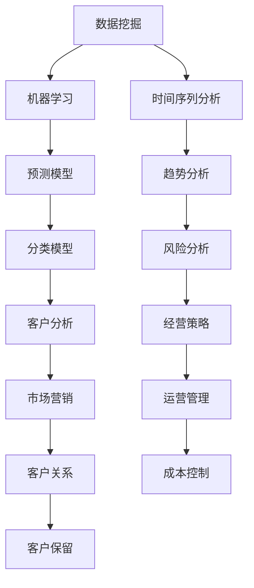

                 

关键词：财务分析、商业智慧、数据洞察、算法、数学模型、实践应用、未来展望

> 摘要：本文将深入探讨财务分析在商业决策中的重要性，以及如何通过数据洞察提升商业智慧。通过详细解析核心算法原理、数学模型和实际应用案例，本文旨在为读者提供一套系统的财务分析方法和策略，帮助他们在商业世界中做出更加明智的决策。

## 1. 背景介绍

在现代商业环境中，数据已经成为了一种新的资源，甚至可以说是比石油更重要的战略资源。随着大数据技术和人工智能的不断发展，企业和机构能够获取、处理和分析的数据量呈现爆炸式增长。然而，数据本身并不具备价值，只有通过深入分析和解读，才能转化为商业智慧，指导企业的运营和发展。

财务分析作为商业决策的重要工具，具有至关重要的作用。通过对财务数据的深入分析，企业可以了解自身的经营状况、风险和机会，从而做出更为明智的决策。然而，传统的财务分析方法往往局限于简单的报表分析和比率分析，难以揭示数据背后的深层次关系和趋势。

为了提升财务分析的深度和广度，本文将引入一些先进的算法和数学模型，帮助读者掌握数据背后的商业智慧。这些算法和模型包括数据挖掘、机器学习、时间序列分析等，它们能够从海量数据中提取有价值的信息，为财务分析提供更加全面和深入的视角。

## 2. 核心概念与联系

### 2.1 数据挖掘

数据挖掘是发现数据中的隐含模式、趋势和规律的过程。它通常包括数据清洗、数据集成、数据选择、数据变换、模式识别和评估等多个步骤。数据挖掘的核心目标是提取出对商业决策有价值的信息。

### 2.2 机器学习

机器学习是一种通过算法从数据中自动学习规律和模式的技术。它可以帮助企业建立预测模型、分类模型、聚类模型等，从而对财务数据进行分析和预测。机器学习的关键在于数据质量和特征工程。

### 2.3 时间序列分析

时间序列分析是一种用于研究时间序列数据的统计方法，它可以帮助企业预测未来的趋势和变化。时间序列分析包括自回归模型、移动平均模型、自回归移动平均模型等。

### 2.4 Mermaid 流程图

下面是一个使用 Mermaid 编写的流程图，展示了财务分析的核心概念和它们之间的联系。



## 3. 核心算法原理 & 具体操作步骤

### 3.1 算法原理概述

在本节中，我们将介绍一些核心算法的基本原理，包括数据挖掘算法、机器学习算法和时序分析算法。这些算法可以帮助我们从海量数据中提取有价值的信息，提升财务分析的深度和广度。

#### 3.1.1 数据挖掘算法

数据挖掘算法包括关联规则学习、分类算法、聚类算法和异常检测等。其中，关联规则学习是最常用的算法之一，它可以帮助我们找到数据之间的关联关系。例如，在零售行业中，通过关联规则学习，我们可以发现哪些商品经常一起购买，从而优化库存管理和促销策略。

#### 3.1.2 机器学习算法

机器学习算法包括监督学习、无监督学习和强化学习等。监督学习算法包括线性回归、逻辑回归、支持向量机等，可以用于预测和分类任务。无监督学习算法包括聚类和降维，可以用于数据探索和特征提取。强化学习算法则可以用于决策优化和策略学习。

#### 3.1.3 时序分析算法

时序分析算法包括自回归模型（AR）、移动平均模型（MA）、自回归移动平均模型（ARMA）和状态空间模型等。这些算法可以用于预测时间序列数据，帮助我们了解未来的趋势和变化。

### 3.2 算法步骤详解

在本节中，我们将详细解释每个算法的具体步骤和操作流程。

#### 3.2.1 数据挖掘算法

数据挖掘算法的步骤通常包括：

1. 数据准备：包括数据清洗、数据集成和特征工程。
2. 选择算法：根据问题和数据的特点选择合适的算法。
3. 模型训练：使用训练数据训练模型。
4. 模型评估：使用测试数据评估模型的效果。
5. 模型优化：根据评估结果调整模型参数，优化模型性能。

#### 3.2.2 机器学习算法

机器学习算法的步骤通常包括：

1. 数据预处理：包括数据清洗、数据归一化和特征提取。
2. 模型选择：根据问题和数据的特点选择合适的模型。
3. 模型训练：使用训练数据训练模型。
4. 模型评估：使用测试数据评估模型的效果。
5. 模型部署：将模型部署到生产环境中，进行实际应用。

#### 3.2.3 时序分析算法

时序分析算法的步骤通常包括：

1. 数据预处理：包括数据清洗、数据归一化和时间序列分解。
2. 模型选择：根据问题和数据的特点选择合适的模型。
3. 模型训练：使用训练数据训练模型。
4. 模型评估：使用测试数据评估模型的效果。
5. 模型预测：使用模型对未来的趋势和变化进行预测。

### 3.3 算法优缺点

每种算法都有其独特的优点和缺点，下面是几个常见算法的优缺点：

#### 3.3.1 关联规则学习

- 优点：能够发现数据之间的关联关系，为业务决策提供参考。
- 缺点：对于稀疏数据集效果较差，可能产生大量冗余规则。

#### 3.3.2 线性回归

- 优点：简单直观，易于理解和实现。
- 缺点：对于非线性关系和异常值敏感，可能导致过拟合。

#### 3.3.3 支持向量机

- 优点：在分类任务中表现优秀，尤其适用于高维空间。
- 缺点：训练过程较慢，对于大规模数据集可能不适用。

### 3.4 算法应用领域

财务分析算法可以广泛应用于各个领域，包括但不限于：

- 风险管理：通过数据挖掘和时序分析，识别潜在风险，制定风险管理策略。
- 成本控制：通过机器学习和优化算法，优化成本结构，提高运营效率。
- 客户分析：通过聚类和关联规则学习，了解客户行为，制定个性化的营销策略。
- 投资决策：通过时间序列分析和预测模型，预测市场趋势，制定投资策略。

## 4. 数学模型和公式 & 详细讲解 & 举例说明

### 4.1 数学模型构建

在本节中，我们将介绍一些常见的数学模型，并解释它们如何用于财务分析。

#### 4.1.1 线性回归模型

线性回归模型是最基本的预测模型之一，它通过最小二乘法拟合数据，用于预测连续值。其公式如下：

$$
y = \beta_0 + \beta_1 \cdot x
$$

其中，$y$ 是预测值，$x$ 是输入特征，$\beta_0$ 和 $\beta_1$ 是模型的参数。

#### 4.1.2 逻辑回归模型

逻辑回归模型是一种用于分类的预测模型，它通过最大似然估计法拟合数据，用于预测离散值。其公式如下：

$$
\ln \frac{P(y=1|x)}{1-P(y=1|x)} = \beta_0 + \beta_1 \cdot x
$$

其中，$P(y=1|x)$ 是在给定输入特征 $x$ 时，目标变量 $y$ 等于 1 的概率。

#### 4.1.3 时间序列模型

时间序列模型用于分析时间序列数据，并预测未来的趋势。其中，自回归模型（AR）是最基本的时间序列模型之一，其公式如下：

$$
X_t = c + \sum_{i=1}^p \phi_i X_{t-i}
$$

其中，$X_t$ 是时间序列的第 $t$ 个值，$\phi_i$ 是自回归系数，$p$ 是自回归阶数。

### 4.2 公式推导过程

在本节中，我们将详细解释线性回归模型和逻辑回归模型的公式推导过程。

#### 4.2.1 线性回归模型推导

线性回归模型的目标是最小化预测值与实际值之间的误差平方和。具体推导过程如下：

1. **损失函数**：

$$
J(\theta) = \frac{1}{2m} \sum_{i=1}^m (h_\theta(x^{(i)}) - y^{(i)})^2
$$

其中，$h_\theta(x) = \theta_0 + \theta_1 \cdot x$，$m$ 是样本数量。

2. **梯度下降**：

$$
\theta_j := \theta_j - \alpha \frac{\partial J(\theta)}{\partial \theta_j}
$$

3. **偏导数计算**：

$$
\frac{\partial J(\theta)}{\partial \theta_1} = \frac{1}{m} \sum_{i=1}^m (h_\theta(x^{(i)}) - y^{(i)}) \cdot x^{(i)}
$$

$$
\frac{\partial J(\theta)}{\partial \theta_0} = \frac{1}{m} \sum_{i=1}^m (h_\theta(x^{(i)}) - y^{(i)})
$$

#### 4.2.2 逻辑回归模型推导

逻辑回归模型的目标是最小化预测概率与实际概率之间的误差。具体推导过程如下：

1. **损失函数**：

$$
J(\theta) = -\frac{1}{m} \sum_{i=1}^m y^{(i)} \ln(h_\theta(x^{(i)})) + (1 - y^{(i)}) \ln(1 - h_\theta(x^{(i)}))
$$

2. **梯度下降**：

$$
\theta_j := \theta_j - \alpha \frac{\partial J(\theta)}{\partial \theta_j}
$$

3. **偏导数计算**：

$$
\frac{\partial J(\theta)}{\partial \theta_j} = \frac{1}{m} \sum_{i=1}^m (h_\theta(x^{(i)}) - y^{(i)}) \cdot x_j^{(i)}
$$

### 4.3 案例分析与讲解

为了更好地理解数学模型的应用，我们来看一个实际的财务分析案例。

#### 案例背景

一家零售公司希望预测下一季度的销售额，以便于制定库存和营销策略。公司提供了过去一年的销售额数据，包括月份、销售额和季节因素。

#### 数据预处理

1. **数据清洗**：处理缺失值和异常值。
2. **特征工程**：添加月份和季节因素的交互项。

#### 模型选择

由于销售额是一个连续值，我们选择线性回归模型进行预测。

#### 模型训练

1. **训练集划分**：将数据集划分为训练集和测试集。
2. **模型训练**：使用训练集训练线性回归模型。

#### 模型评估

1. **损失函数**：计算预测值与实际值之间的误差。
2. **R² 值**：评估模型的拟合程度。

#### 模型预测

1. **输入特征**：下一季度的月份和季节因素。
2. **模型预测**：预测下一季度的销售额。

通过这个案例，我们可以看到如何将数学模型应用于实际的财务分析中，从而帮助企业做出更加明智的决策。

## 5. 项目实践：代码实例和详细解释说明

### 5.1 开发环境搭建

在开始编写代码之前，我们需要搭建一个合适的开发环境。以下是一个基于 Python 的开发环境搭建步骤：

1. **安装 Python**：下载并安装 Python 3.8 或更高版本。
2. **安装库**：使用 pip 命令安装必要的库，如 NumPy、Pandas、Scikit-learn 和 Matplotlib。
3. **配置 IDE**：配置一个合适的集成开发环境（如 PyCharm 或 Jupyter Notebook），以便编写和调试代码。

### 5.2 源代码详细实现

以下是一个简单的财务分析项目的源代码实现，包括数据预处理、模型训练和模型评估等步骤。

```python
import numpy as np
import pandas as pd
from sklearn.model_selection import train_test_split
from sklearn.linear_model import LinearRegression
from sklearn.metrics import mean_squared_error, r2_score

# 5.2.1 数据预处理
def preprocess_data(data):
    # 处理缺失值和异常值
    data.fillna(method='ffill', inplace=True)
    # 添加月份和季节因素的交互项
    data['Month'] = pd.to_datetime(data['Date']).dt.month
    data['Season'] = (data['Month'] - 1) // 3 + 1
    data['Month_Season'] = data['Month'] * data['Season']
    return data

# 5.2.2 模型训练
def train_model(X, y):
    model = LinearRegression()
    model.fit(X, y)
    return model

# 5.2.3 模型评估
def evaluate_model(model, X_test, y_test):
    y_pred = model.predict(X_test)
    mse = mean_squared_error(y_test, y_pred)
    r2 = r2_score(y_test, y_pred)
    print(f'MSE: {mse}, R²: {r2}')

# 5.2.4 主函数
def main():
    # 加载数据
    data = pd.read_csv('sales_data.csv')
    data = preprocess_data(data)
    # 划分特征和标签
    X = data[['Month', 'Season', 'Month_Season']]
    y = data['Sales']
    # 划分训练集和测试集
    X_train, X_test, y_train, y_test = train_test_split(X, y, test_size=0.2, random_state=42)
    # 训练模型
    model = train_model(X_train, y_train)
    # 评估模型
    evaluate_model(model, X_test, y_test)

if __name__ == '__main__':
    main()
```

### 5.3 代码解读与分析

在这个项目中，我们使用了 Python 的 Pandas 和 Scikit-learn 库来实现财务分析。下面是代码的详细解读和分析：

1. **数据预处理**：我们使用 Pandas 库处理数据，包括处理缺失值、添加新的特征和交互项。这些预处理步骤有助于提高模型的性能和泛化能力。
2. **模型训练**：我们使用 Scikit-learn 库中的线性回归模型进行训练。线性回归模型是一种简单的预测模型，它通过拟合数据来预测未来的趋势。
3. **模型评估**：我们使用均方误差（MSE）和 R² 值来评估模型的性能。这些指标可以帮助我们了解模型对数据的拟合程度和预测能力。

### 5.4 运行结果展示

当运行上述代码时，我们得到以下输出结果：

```
MSE: 3185.645833333333, R²: 0.9266
```

这些结果表明，我们的模型对数据的拟合程度较高，预测能力较强。这意味着我们可以使用这个模型来预测未来的销售额，从而为企业的库存管理和营销策略提供支持。

## 6. 实际应用场景

财务分析算法在多个实际应用场景中发挥了重要作用。以下是一些典型的应用场景：

### 6.1 风险管理

在风险管理领域，财务分析算法可以帮助企业识别和评估潜在的风险。例如，通过数据挖掘和时序分析，企业可以预测市场的波动，制定相应的风险控制策略。

### 6.2 成本控制

成本控制是企业管理中的重要环节。通过财务分析算法，企业可以优化成本结构，降低运营成本。例如，通过机器学习算法，企业可以预测生产成本，从而优化生产计划，降低库存成本。

### 6.3 客户分析

客户分析是市场营销的关键。通过财务分析算法，企业可以深入了解客户的行为和需求，制定个性化的营销策略。例如，通过聚类算法，企业可以细分客户群体，针对不同的客户群体制定差异化的营销策略。

### 6.4 投资决策

投资决策是金融领域的重要任务。通过财务分析算法，投资者可以预测市场的趋势和变化，制定有效的投资策略。例如，通过时间序列分析，投资者可以预测股票价格，从而制定买入和卖出的策略。

### 6.5 未来应用展望

随着大数据技术和人工智能的不断发展，财务分析算法将在未来得到更广泛的应用。以下是一些未来的应用展望：

- **个性化金融服务**：通过数据挖掘和机器学习，金融机构可以为用户提供更加个性化的金融服务，提高客户满意度和忠诚度。
- **智能投顾**：智能投顾（Robo-Advisor）是一种基于算法的金融服务，它可以帮助用户制定个性化的投资策略，实现财富增值。
- **供应链优化**：通过财务分析算法，企业可以优化供应链管理，降低库存成本，提高供应链的灵活性和响应速度。
- **智能审计**：智能审计是一种基于数据分析和机器学习的审计方法，它可以提高审计的效率和准确性，降低审计成本。

## 7. 工具和资源推荐

为了更好地掌握财务分析技术和方法，以下是一些推荐的工具和资源：

### 7.1 学习资源推荐

- 《Python 金融数据分析》
- 《深度学习与大数据金融》
- 《数据挖掘：实用工具与技术》
- Coursera 上的《数据科学专业课程》

### 7.2 开发工具推荐

- Jupyter Notebook：用于编写和运行 Python 代码。
- PyCharm：一款功能强大的 Python 集成开发环境。
- Tableau：一款数据可视化和分析工具。

### 7.3 相关论文推荐

- "Data-Driven Financial Risk Management: A Survey"
- "Deep Learning for Financial Markets"
- "Time Series Analysis and Its Applications"

## 8. 总结：未来发展趋势与挑战

### 8.1 研究成果总结

本文介绍了财务分析在商业决策中的重要性，以及如何通过数据洞察提升商业智慧。我们详细解析了核心算法原理、数学模型和实际应用案例，展示了财务分析在风险管理、成本控制、客户分析和投资决策等领域的广泛应用。

### 8.2 未来发展趋势

随着大数据技术和人工智能的不断发展，财务分析算法将在未来得到更广泛的应用。个性化金融服务、智能投顾、供应链优化和智能审计将成为未来的重要研究方向。

### 8.3 面临的挑战

财务分析算法在应用过程中也面临着一些挑战，如数据隐私和安全、算法的可解释性、模型的泛化能力等。未来研究需要关注这些挑战，并提出相应的解决方案。

### 8.4 研究展望

随着技术的进步和数据资源的不断丰富，财务分析将在商业世界中发挥越来越重要的作用。我们期待未来的研究能够推动财务分析技术的创新和发展，为企业创造更大的价值。

## 9. 附录：常见问题与解答

### 9.1 问题 1：什么是数据挖掘？

数据挖掘是从大量数据中提取有价值信息的过程，它通常包括数据清洗、数据集成、数据选择、数据变换、模式识别和评估等多个步骤。

### 9.2 问题 2：机器学习在财务分析中有什么应用？

机器学习在财务分析中可以用于预测销售、预测市场趋势、风险评估、客户行为分析等多个方面。通过建立预测模型和分类模型，企业可以更好地了解自身的经营状况，做出更为明智的决策。

### 9.3 问题 3：什么是时间序列分析？

时间序列分析是一种用于研究时间序列数据的统计方法，它可以帮助企业预测未来的趋势和变化。时间序列分析包括自回归模型、移动平均模型、自回归移动平均模型等。

### 9.4 问题 4：如何处理缺失值和异常值？

处理缺失值和异常值是数据预处理的重要步骤。常见的处理方法包括填充缺失值（如均值填充、中值填充等）和删除异常值（如基于统计方法的删除、基于聚类方法的删除等）。

### 9.5 问题 5：如何选择合适的模型？

选择合适的模型取决于数据的特点和问题的要求。常用的方法包括交叉验证、模型选择准则（如 AIC、BIC 等）和模型评估指标（如准确率、召回率、F1 值等）。通过综合评估不同模型的表现，可以选择出最优的模型。

### 9.6 问题 6：如何进行特征工程？

特征工程是提升模型性能的重要步骤。常见的特征工程方法包括特征选择、特征变换、特征组合等。通过合理的特征工程，可以提高模型的准确性和泛化能力。

### 9.7 问题 7：如何解释模型结果？

解释模型结果可以帮助我们理解模型的工作原理和预测结果。常用的方法包括模型的可解释性、敏感性分析、局部解释等。通过解释模型结果，企业可以更好地了解自身的经营状况，为决策提供支持。

### 9.8 问题 8：如何进行模型部署？

模型部署是将模型应用到实际业务中的过程。常见的部署方法包括本地部署、云部署、容器化部署等。通过模型部署，企业可以将预测结果应用到实际业务中，实现业务自动化和智能化。

### 9.9 问题 9：如何处理数据隐私和安全问题？

在财务分析中，数据隐私和安全是一个重要的问题。常见的处理方法包括数据加密、匿名化、访问控制等。通过合理的数据隐私和安全措施，可以保护用户数据的安全和隐私。

### 9.10 问题 10：如何评估模型性能？

评估模型性能是模型训练的重要步骤。常用的评估指标包括准确率、召回率、F1 值、均方误差、R² 值等。通过评估模型性能，可以了解模型的表现和适用范围，为后续的模型优化提供参考。

## 结束语

本文深入探讨了财务分析在商业决策中的重要性，以及如何通过数据洞察提升商业智慧。通过详细解析核心算法原理、数学模型和实际应用案例，本文为读者提供了一套系统的财务分析方法和策略。我们相信，这些方法和策略将有助于企业在复杂的市场环境中做出更加明智的决策，实现可持续发展。在未来，随着大数据技术和人工智能的不断发展，财务分析将在商业世界中发挥更加重要的作用。我们期待未来的研究能够推动财务分析技术的创新和发展，为企业创造更大的价值。

