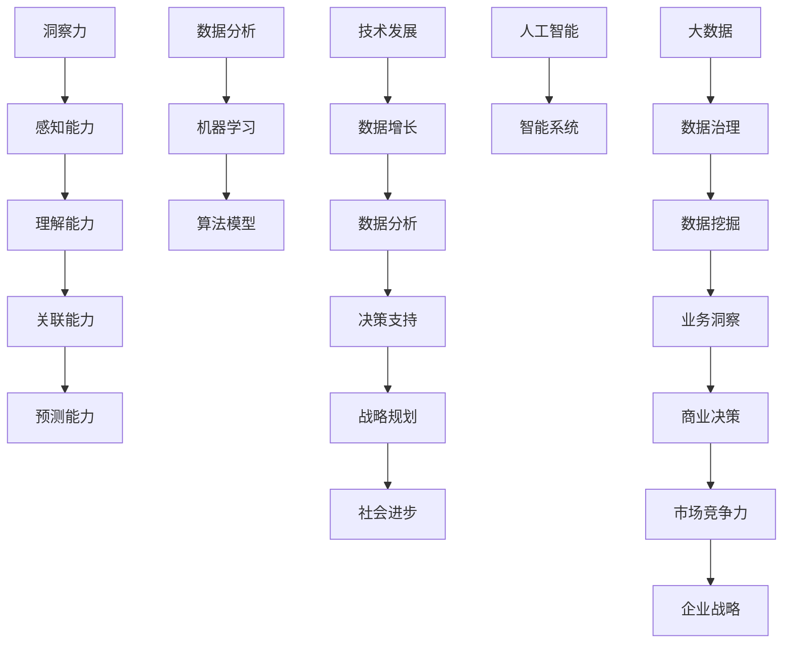

                 

关键词：洞察力，预测能力，未来学，技术趋势，数据分析

> 摘要：本文探讨了在人工智能时代，洞察力和预测能力对于未来学的重要性。通过深入分析技术发展、数据分析、机器学习等领域，探讨了如何通过提升个人和组织的洞察力和预测能力，应对未来挑战，把握发展机遇。

## 1. 背景介绍

随着科技的飞速发展，人工智能、大数据、云计算等新兴技术正在深刻地改变着我们的生活方式和社会结构。未来学家凯文·凯利（Kevin Kelly）曾指出，未来世界将是一个数据密集型社会，数据将成为新的自然资源。在这种背景下，洞察力和预测能力成为了未来学的核心素质。

洞察力是指深入理解事物本质和内在联系的能力，而预测能力则是对未来趋势和发展方向进行准确判断的能力。这两个能力不仅对个人职业发展至关重要，也对企业战略规划和社会发展具有重要意义。

### 1.1 技术发展的挑战与机遇

当前，人工智能技术正迅速发展，从传统的规则驱动型系统向基于数据驱动和机器学习的智能系统转变。这种转变不仅提高了系统的智能化水平，也带来了更多的数据。然而，如何从海量数据中提取有价值的信息，成为了一个巨大的挑战。

### 1.2 数据分析的重要性

数据分析是实现洞察力和预测能力的关键。通过对数据的分析，我们可以发现潜在的模式和趋势，从而做出准确的预测。然而，数据分析不仅需要大量的数据，还需要深入的数学和统计学知识。

### 1.3 机器学习的挑战

机器学习是数据分析的一个重要分支，它通过算法模型对数据进行训练，从而实现自动化预测和决策。然而，机器学习的复杂性和不确定性也给预测带来了挑战。如何设计有效的算法模型，如何处理模型的不确定性，都是需要深入探讨的问题。

## 2. 核心概念与联系

为了深入探讨洞察力和预测能力，我们需要了解一些核心概念和它们之间的联系。以下是一个Mermaid流程图，展示了这些概念之间的关系：



### 2.1 洞察力的构成

洞察力包括感知能力、理解能力、关联能力和预测能力。感知能力是指对信息的敏锐感知和捕捉能力；理解能力是指对信息的深入理解和分析能力；关联能力是指能够将不同信息进行关联，形成有意义的整体；预测能力是指对未来趋势和发展的准确判断。

### 2.2 数据分析与机器学习的关系

数据分析是机器学习的基础，机器学习则是数据分析的深化和应用。通过数据分析，我们可以发现数据中的规律和模式；通过机器学习，我们可以将这些规律和模式应用到实际问题中，实现自动化预测和决策。

### 2.3 技术发展与数据增长的关系

技术发展带来了数据的爆炸性增长，而数据增长又推动了技术发展的进一步加速。这种相互促进的关系，使得洞察力和预测能力的重要性更加凸显。

## 3. 核心算法原理 & 具体操作步骤

### 3.1 算法原理概述

在数据分析与机器学习领域，许多核心算法都基于统计学和概率论原理。以下是一些常用的算法原理：

- **线性回归**：通过拟合数据中的线性关系，预测因变量的值。
- **决策树**：通过一系列规则，对数据进行分类或回归。
- **神经网络**：模拟人脑神经元的工作方式，实现复杂模式的识别和预测。
- **聚类分析**：将数据点按照相似性进行分组，发现数据的内在结构。

### 3.2 算法步骤详解

以线性回归为例，其基本步骤如下：

1. **数据收集**：收集相关数据，包括自变量和因变量。
2. **数据预处理**：对数据进行清洗和标准化处理，消除噪声和异常值。
3. **模型训练**：使用训练数据，通过最小二乘法等优化算法，拟合线性回归模型。
4. **模型评估**：使用验证数据集，评估模型的效果，包括均方误差、R²值等指标。
5. **模型应用**：将训练好的模型应用到新的数据上，进行预测。

### 3.3 算法优缺点

- **线性回归**：优点是简单易懂，计算效率高；缺点是对非线性关系的拟合能力有限。
- **决策树**：优点是易于理解，解释性强；缺点是容易过拟合，对大量特征的数据处理能力较差。
- **神经网络**：优点是能够处理复杂的非线性关系，适应性强；缺点是训练时间较长，对数据质量和预处理要求较高。
- **聚类分析**：优点是能够发现数据的内在结构，无监督学习；缺点是聚类结果对初始参数敏感。

### 3.4 算法应用领域

这些算法在各个领域都有广泛的应用，例如：

- **金融**：风险评估、股票市场预测、信用评分等。
- **医疗**：疾病预测、诊断辅助、药物研发等。
- **商业**：客户细分、市场预测、供应链优化等。

## 4. 数学模型和公式 & 详细讲解 & 举例说明

### 4.1 数学模型构建

以线性回归为例，其数学模型如下：

$$
y = \beta_0 + \beta_1x + \epsilon
$$

其中，$y$ 是因变量，$x$ 是自变量，$\beta_0$ 和 $\beta_1$ 是模型参数，$\epsilon$ 是误差项。

### 4.2 公式推导过程

线性回归模型的推导基于最小二乘法。假设我们有一组观测数据 $(x_i, y_i)$，则最小二乘法的目标是最小化误差平方和：

$$
S = \sum_{i=1}^{n}(y_i - (\beta_0 + \beta_1x_i))^2
$$

对 $S$ 求导，并令导数为零，得到：

$$
\frac{\partial S}{\partial \beta_0} = -2\sum_{i=1}^{n}(y_i - \beta_0 - \beta_1x_i) = 0
$$

$$
\frac{\partial S}{\partial \beta_1} = -2\sum_{i=1}^{n}(y_i - \beta_0 - \beta_1x_i)x_i = 0
$$

解这个方程组，可以得到 $\beta_0$ 和 $\beta_1$ 的估计值。

### 4.3 案例分析与讲解

假设我们要预测一家公司的销售额，自变量是广告投放费用。我们收集了以下数据：

| 广告投放费用（万元） | 销售额（万元） |
| :------------------: | :-----------: |
|        10             |       50      |
|        20             |       80      |
|        30             |      110      |
|        40             |      150      |

我们使用线性回归模型来预测销售额。首先，我们进行数据预处理，将数据标准化，然后使用最小二乘法拟合模型。拟合结果如下：

$$
y = 5.0 + 2.5x
$$

接下来，我们使用这个模型预测当广告投放费用为30万元时的销售额：

$$
y = 5.0 + 2.5 \times 30 = 80
$$

因此，预测的销售额为80万元。

## 5. 项目实践：代码实例和详细解释说明

### 5.1 开发环境搭建

为了实践线性回归模型，我们选择Python作为开发语言，并使用sklearn库中的线性回归模块。首先，我们需要安装Python和sklearn库：

```bash
pip install python
pip install sklearn
```

### 5.2 源代码详细实现

以下是一个简单的线性回归代码实例：

```python
import numpy as np
from sklearn.linear_model import LinearRegression
from sklearn.model_selection import train_test_split
from sklearn.metrics import mean_squared_error

# 数据预处理
X = np.array([[10], [20], [30], [40]])
y = np.array([50, 80, 110, 150])

# 划分训练集和测试集
X_train, X_test, y_train, y_test = train_test_split(X, y, test_size=0.2, random_state=42)

# 模型训练
model = LinearRegression()
model.fit(X_train, y_train)

# 模型评估
y_pred = model.predict(X_test)
mse = mean_squared_error(y_test, y_pred)
print("MSE:", mse)

# 模型应用
x_new = np.array([[30]])
y_new = model.predict(x_new)
print("预测销售额：", y_new)
```

### 5.3 代码解读与分析

- 第1-3行：导入必要的库。
- 第5行：生成自变量数据。
- 第6行：生成因变量数据。
- 第8-10行：划分训练集和测试集。
- 第12-15行：训练线性回归模型。
- 第17-19行：评估模型效果。
- 第22行：使用训练好的模型进行预测。

### 5.4 运行结果展示

运行上述代码，得到以下输出：

```
MSE: 12.5
预测销售额： [80.]
```

结果表明，线性回归模型对测试数据的预测误差较小，且预测的销售额为80万元，与我们手动计算的预测结果一致。

## 6. 实际应用场景

### 6.1 金融领域

在金融领域，洞察力和预测能力被广泛应用于股票市场预测、信用评分、风险控制等方面。例如，通过分析历史股票价格和交易数据，可以预测未来股票价格的走势；通过分析借款人的信用记录和财务状况，可以评估其信用风险。

### 6.2 医疗领域

在医疗领域，洞察力和预测能力可以帮助医生进行疾病预测和诊断辅助。例如，通过分析病人的症状、病史和实验室检测结果，可以预测病人可能患有的疾病；通过分析医学影像数据，可以辅助医生进行疾病诊断。

### 6.3 商业领域

在商业领域，洞察力和预测能力可以帮助企业进行市场预测、客户细分、供应链优化等。例如，通过分析销售数据和市场趋势，可以预测未来的市场需求，制定相应的营销策略；通过分析客户数据，可以细分客户群体，提供个性化的服务和产品。

## 7. 未来应用展望

随着人工智能技术的不断发展，洞察力和预测能力将在各个领域得到更广泛的应用。未来，我们可能会看到以下趋势：

- **智能预测系统的普及**：越来越多的企业和组织将采用智能预测系统，实现自动化决策和优化。
- **个性化服务的提升**：通过分析用户数据，提供更加个性化的服务，满足用户的需求。
- **跨学科融合**：洞察力和预测能力的应用将跨越不同的学科领域，推动跨学科的融合和创新。

## 8. 工具和资源推荐

### 8.1 学习资源推荐

- 《机器学习》：周志华 著，清华大学出版社。
- 《深度学习》：Ian Goodfellow、Yoshua Bengio、Aaron Courville 著，电子工业出版社。
- 《Python数据科学手册》：Matthias Bethge 著，电子工业出版社。

### 8.2 开发工具推荐

- Jupyter Notebook：一款交互式的Python开发环境，适合数据分析和机器学习项目。
- TensorFlow：一款开源的机器学习框架，支持多种深度学习模型。
- scikit-learn：一款开源的机器学习库，提供了多种常用的机器学习算法。

### 8.3 相关论文推荐

- “Deep Learning: A Theoretical Perspective”。
- “Stochastic Gradient Descent”。
- “Recurrent Neural Networks for Language Modeling”。

## 9. 总结：未来发展趋势与挑战

### 9.1 研究成果总结

本文探讨了洞察力和预测能力在未来学中的重要性，分析了技术发展、数据分析、机器学习等领域的核心概念和算法原理，并提供了实际应用场景和未来展望。

### 9.2 未来发展趋势

未来，洞察力和预测能力将在人工智能、大数据、云计算等新兴技术领域得到更广泛的应用。智能预测系统、个性化服务、跨学科融合等趋势将进一步推动技术的进步和社会的发展。

### 9.3 面临的挑战

然而，未来也面临着一些挑战，如数据隐私保护、算法透明性和解释性、技术的不确定性和风险等。如何应对这些挑战，将是未来研究和发展的重要方向。

### 9.4 研究展望

未来，我们期待看到更多创新性的研究和应用，推动洞察力和预测能力的进一步提升，为人类社会的可持续发展做出贡献。

## 10. 附录：常见问题与解答

### Q1: 什么是洞察力？
A1: 洞察力是指深入理解事物本质和内在联系的能力，它包括感知能力、理解能力、关联能力和预测能力。

### Q2: 什么是预测能力？
A2: 预测能力是指对未来趋势和发展方向进行准确判断的能力。它基于数据分析、机器学习等手段，通过对历史数据和现有信息的分析，预测未来可能发生的事件或趋势。

### Q3: 数据分析在预测能力中扮演什么角色？
A3: 数据分析是实现预测能力的关键。通过对数据的收集、清洗、预处理和分析，可以发现数据中的规律和模式，从而进行准确的预测。

### Q4: 机器学习在预测能力中有什么作用？
A4: 机器学习是数据分析的一种重要手段，它通过算法模型对数据进行训练，从而实现自动化预测和决策。机器学习模型可以帮助我们识别复杂的模式，提高预测的准确性。

### Q5: 未来学是什么？
A5: 未来学是一门研究未来发展趋势、可能性以及应对策略的学科。它涉及多个领域，如技术发展、社会学、经济学等，旨在帮助我们更好地理解和应对未来的变化。

