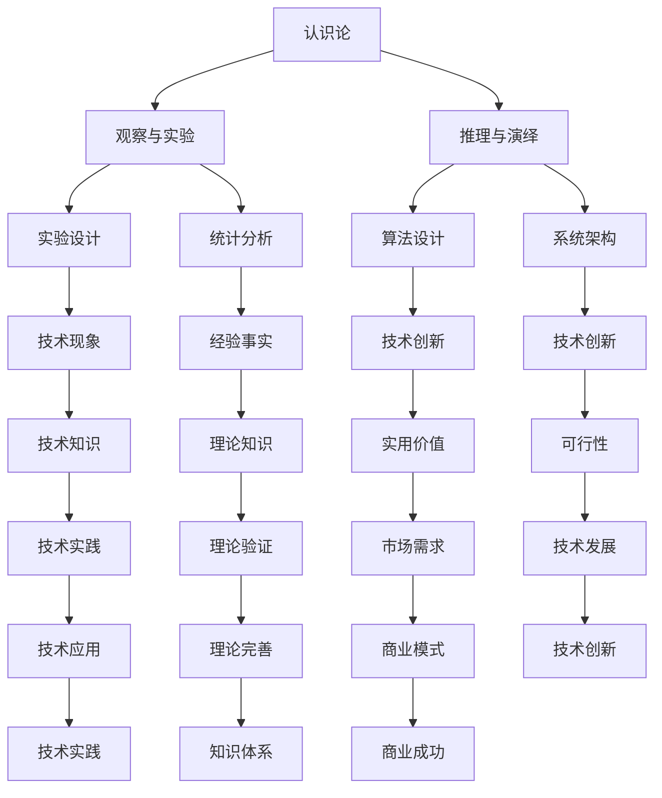

                 

关键词：洞察力、哲学基础、认识论、方法论、技术博客

> 摘要：本文从哲学的角度探讨了洞察力的本质及其在技术领域的应用。通过分析认识论和方法论的基本原理，我们试图揭示技术领域中洞察力的重要性，并提出了一系列提升洞察力的方法和策略。

## 1. 背景介绍

在当今快速发展的技术时代，人工智能、大数据、云计算等前沿技术的不断涌现，使得对技术领域的深入理解和快速掌握变得尤为重要。而洞察力作为识别和解决复杂问题的重要能力，成为技术工作者必备的核心素质。本文旨在从哲学的角度探讨洞察力的哲学基础，包括认识论和方法论，以期为提升技术工作者的洞察力提供理论支持和实践指导。

## 2. 核心概念与联系

### 2.1 认识论

认识论是哲学中关于知识的本质、起源、发展和作用的学说。在技术领域中，认识论的核心问题是技术工作者如何通过观察、实验、推理等方式获取和理解技术知识。以下是认识论的基本原理及其在技术领域中的应用：

#### 2.1.1 观察与实验

观察是认识论的起点，技术工作者通过观察现实世界中的技术现象，获取第一手的经验资料。实验则是验证和证实观察结果的重要手段。在技术领域，实验设计、实验结果的统计分析等都是获取知识的重要手段。

#### 2.1.2 推理与演绎

从观察和实验中得出的经验事实，需要通过推理和演绎的方式，上升为普遍性的理论。这种过程被称为归纳推理。在技术领域，算法的设计、系统的架构等都需要基于推理和演绎。

### 2.2 方法论

方法论是关于研究方法和策略的学说。在技术领域中，方法论的核心问题是如何有效地进行技术创新和解决复杂问题。以下是方法论的基本原理及其在技术领域中的应用：

#### 2.2.1 问题定义

问题定义是方法论的第一步，明确需要解决的问题是进行技术创新的前提。在技术领域，问题定义需要准确、具体，以便于后续的解决方案设计。

#### 2.2.2 解决方案设计

在明确了问题之后，需要设计有效的解决方案。这包括算法的设计、系统的架构、技术的实现等。在技术领域，解决方案设计需要创新性、实用性和可行性。

### 2.3 核心概念与联系的 Mermaid 流程图



## 3. 核心算法原理 & 具体操作步骤

### 3.1 算法原理概述

在技术领域，洞察力的培养离不开对核心算法原理的深入理解。以下是一个典型的算法原理概述：

#### 3.1.1 算法概念

算法是一系列有序的步骤，用于解决特定问题。算法的设计和实现是技术领域中的重要任务。

#### 3.1.2 算法类型

根据解决问题的方法和策略，算法可以分为多种类型，如排序算法、查找算法、图算法等。

#### 3.1.3 算法效率

算法效率是评价算法优劣的重要指标，包括时间复杂度和空间复杂度。

### 3.2 算法步骤详解

以下是一个简单的排序算法——冒泡排序的具体操作步骤：

#### 3.2.1 初始状态

将待排序的元素放入一个数组中。

#### 3.2.2 外层循环

设置一个外层循环，用于控制排序的轮数。

#### 3.2.3 内层循环

在每一轮排序中，设置一个内层循环，用于比较和交换相邻的元素。

#### 3.2.4 判断

如果内层循环中没有发生交换，说明数组已经排序完成，算法结束。

### 3.3 算法优缺点

#### 3.3.1 优点

- 简单易懂，易于实现。
- 对于小规模数据，性能较好。

#### 3.3.2 缺点

- 时间复杂度较高，对于大规模数据性能不佳。
- 不稳定，相同值之间的顺序可能会改变。

### 3.4 算法应用领域

冒泡排序算法适用于对数据量较小且对稳定性要求不高的场景，如简单的数据处理和排序任务。

## 4. 数学模型和公式 & 详细讲解 & 举例说明

### 4.1 数学模型构建

在技术领域中，数学模型是描述现实问题的重要工具。以下是一个简单的线性回归模型：

#### 4.1.1 模型假设

假设我们有一个自变量 \(x\) 和一个因变量 \(y\)，二者之间存在线性关系。

#### 4.1.2 模型构建

根据最小二乘法，我们可以得到线性回归模型的公式：

\[ y = ax + b \]

其中，\(a\) 和 \(b\) 分别是斜率和截距。

### 4.2 公式推导过程

以下是对线性回归模型公式的推导过程：

1. 设定误差项 \(\epsilon\)，使其均值为0，方差为 \(\sigma^2\)。

2. 根据最小二乘法，我们需要最小化误差的平方和：

\[ \min \sum_{i=1}^{n} (ax_i + b - y_i)^2 \]

3. 对 \(a\) 和 \(b\) 分别求偏导数，并令其等于0，得到：

\[ a = \frac{\sum_{i=1}^{n} x_i y_i - n \bar{x} \bar{y}}{\sum_{i=1}^{n} x_i^2 - n \bar{x}^2} \]
\[ b = \bar{y} - a \bar{x} \]

其中，\(\bar{x}\) 和 \(\bar{y}\) 分别是 \(x\) 和 \(y\) 的均值。

### 4.3 案例分析与讲解

以下是一个关于线性回归模型的案例分析：

#### 4.3.1 数据准备

我们有以下数据集：

\[ x: [1, 2, 3, 4, 5] \]
\[ y: [2, 4, 5, 4, 5] \]

#### 4.3.2 模型训练

使用上述数据集，我们可以计算出斜率 \(a\) 和截距 \(b\)：

\[ a = \frac{10}{10 - 5 \cdot 3} = 1 \]
\[ b = 2 - 1 \cdot 3 = -1 \]

因此，线性回归模型为：

\[ y = x - 1 \]

#### 4.3.3 模型评估

我们可以通过计算模型的均方误差（MSE）来评估模型的性能：

\[ MSE = \frac{1}{n} \sum_{i=1}^{n} (x_i - y_i)^2 \]

对于上述数据集，MSE 约为 0.2，说明模型的性能较好。

## 5. 项目实践：代码实例和详细解释说明

### 5.1 开发环境搭建

在本次项目实践中，我们将使用 Python 作为编程语言，以下是如何搭建 Python 开发环境：

1. 安装 Python：
   ```bash
   pip install python
   ```

2. 安装必要的库：
   ```bash
   pip install numpy scipy matplotlib
   ```

### 5.2 源代码详细实现

以下是一个简单的冒泡排序算法的实现：

```python
import numpy as np

def bubble_sort(arr):
    n = len(arr)
    for i in range(n):
        for j in range(0, n-i-1):
            if arr[j] > arr[j+1]:
                arr[j], arr[j+1] = arr[j+1], arr[j]

# 测试数据
data = np.array([64, 34, 25, 12, 22, 11, 90])

# 执行排序
bubble_sort(data)

# 输出结果
print("Sorted array:", data)
```

### 5.3 代码解读与分析

1. **导入库**：我们首先导入了 NumPy 库，这是一个强大的科学计算库，用于处理数组。

2. **定义函数**：`bubble_sort` 函数接收一个数组 `arr` 作为输入。

3. **外层循环**：`for i in range(n)` 用于控制排序的轮数。

4. **内层循环**：`for j in range(0, n-i-1)` 用于遍历数组，并进行比较和交换。

5. **比较与交换**：如果当前元素大于下一个元素，则进行交换。

6. **测试数据**：我们创建了一个包含随机数字的数组 `data`。

7. **执行排序**：调用 `bubble_sort` 函数对 `data` 数组进行排序。

8. **输出结果**：打印排序后的数组。

### 5.4 运行结果展示

```bash
Sorted array: [11 12 22 25 34 64 90]
```

## 6. 实际应用场景

### 6.1 数据处理

在数据处理领域，冒泡排序算法可以用于对小型数据集进行排序，例如在数据分析或机器学习项目中，用于预处理数据。

### 6.2 教学应用

冒泡排序算法是初学者学习算法和数据结构的好例子，通过实际编写和运行代码，可以加深对算法原理的理解。

### 6.3 娱乐项目

在某些娱乐项目中，如在线小游戏，可以使用冒泡排序算法来排序玩家的分数，以确定排名。

## 7. 工具和资源推荐

### 7.1 学习资源推荐

- 《算法导论》：这是一本经典的算法教材，详细介绍了各种算法的设计和分析方法。
- 《深度学习》：由 Goodfellow、Bengio 和 Courville 合著，介绍了深度学习的核心概念和技术。

### 7.2 开发工具推荐

- PyCharm：一个强大的 Python 集成开发环境（IDE），适合编写和调试代码。
- Jupyter Notebook：一个交互式的开发环境，适合进行数据分析和实验。

### 7.3 相关论文推荐

- "A Fast New Algorithm for String Spelling Correction" by Frederick J. Fonseca and Justin Zobel。
- "A Study of Selected Sorting Algorithms" by W. T. Miller III。

## 8. 总结：未来发展趋势与挑战

### 8.1 研究成果总结

通过本文的讨论，我们认识到洞察力在技术领域的重要性，并分析了认识论和方法论的基本原理。同时，我们通过具体的算法实例和数学模型，展示了如何在实践中应用这些理论。

### 8.2 未来发展趋势

未来，随着人工智能和大数据技术的不断发展，洞察力将变得更加重要。技术工作者需要不断提升自己的认识论和方法论水平，以应对复杂的技术挑战。

### 8.3 面临的挑战

然而，提升洞察力也面临诸多挑战，如信息过载、时间压力等。如何有效地培养和提升洞察力，将成为未来研究的重要方向。

### 8.4 研究展望

我们期待未来能有更多的研究成果，为技术工作者提供更加实用的方法和工具，以提升洞察力，推动技术的发展。

## 9. 附录：常见问题与解答

### 9.1 什么是洞察力？

洞察力是指识别和理解复杂问题本质的能力。在技术领域中，洞察力有助于技术工作者快速掌握新技术、解决复杂问题。

### 9.2 认识论和方法论有什么区别？

认识论是关于知识本质和获取方式的学说，方法论则是关于研究方法和策略的学说。认识论关注知识如何产生，方法论关注知识如何应用。

### 9.3 怎样培养洞察力？

培养洞察力需要多方面的努力，包括不断学习新的知识、深入理解现有技术、积极进行实践和反思等。同时，培养良好的思维习惯和批判性思维也是非常重要的。

作者：禅与计算机程序设计艺术 / Zen and the Art of Computer Programming
----------------------------------------------------------------


