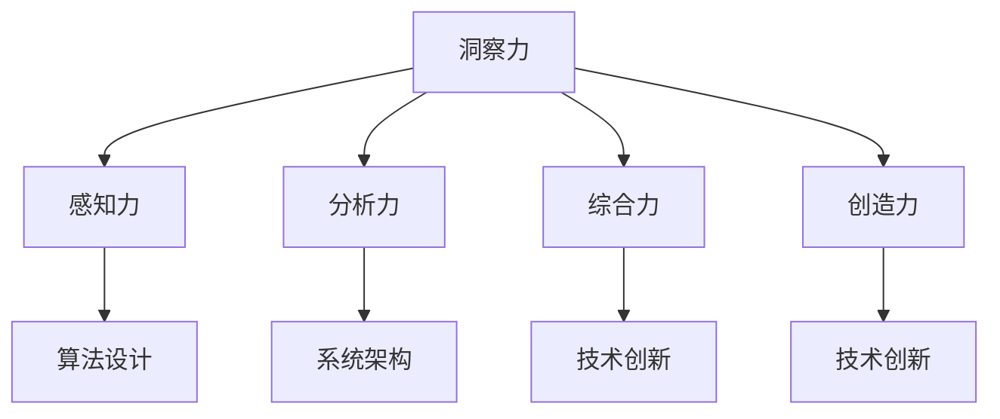

                 

关键词：洞察力、知识、智慧、技术、方法论、算法、编程、计算机科学、人工智能

> 摘要：本文旨在探讨如何通过培养洞察力，实现从知识到智慧的跨越。文章将结合计算机科学领域的实例，分析洞察力在技术研究和创新中的重要性，并提出具体的培养方法和实践路径。

## 1. 背景介绍

在信息爆炸的时代，知识已经变得触手可及。然而，知识的堆积并不等同于智慧的增长。真正的智慧来源于对知识的深入理解、批判性思维和创新能力。在计算机科学和人工智能领域，洞察力的重要性尤为突出。它不仅决定了技术的创新高度，也影响着行业的发展方向。

洞察力是一种高级的认知能力，它允许我们超越表面现象，看到事物的本质和内在联系。在技术领域，洞察力使我们能够发现新的算法、解决复杂问题、优化系统性能，并在快速变化的环境中把握机遇。

本文将围绕以下主题展开：

- **核心概念与联系**：介绍与洞察力相关的核心概念及其在计算机科学中的应用。
- **核心算法原理与操作步骤**：探讨几个关键算法及其原理和具体实现。
- **数学模型和公式**：讲解与核心算法相关的数学模型和推导过程。
- **项目实践**：通过具体项目实例展示算法的应用和实现。
- **实际应用场景**：讨论算法在不同领域的应用前景。
- **未来展望**：预测算法和技术的发展趋势，以及面临的挑战。

## 2. 核心概念与联系

### 2.1. 洞察力的定义与分类

洞察力是一种复合认知能力，主要包括以下几个子能力：

1. **感知力**：对细节的敏感度和观察力。
2. **分析力**：对信息的处理能力和逻辑推理能力。
3. **综合力**：对复杂问题的整合和归纳能力。
4. **创造力**：产生新想法和解决方案的能力。

### 2.2. 洞察力在计算机科学中的应用

在计算机科学中，洞察力表现为以下几个方面：

1. **算法设计**：洞察力使程序员能够设计出高效的算法，解决复杂问题。
2. **系统架构**：洞察力帮助架构师理解系统的整体结构和潜在问题。
3. **技术创新**：洞察力推动技术的进步和突破。

### 2.3. Mermaid 流程图展示



## 3. 核心算法原理与操作步骤

### 3.1. 算法原理概述

本节将介绍几个关键算法的原理，包括排序算法、搜索算法和数据结构优化算法。

### 3.2. 算法步骤详解

#### 3.2.1. 快速排序（Quick Sort）

1. **选择基准元素**：从数组中随机选择一个元素作为基准。
2. **分区操作**：将数组分为两部分，小于基准的放在左边，大于基准的放在右边。
3. **递归排序**：对左右两部分递归执行快速排序。

#### 3.2.2. 暴力搜索（Brute Force Search）

1. **遍历**：遍历所有可能的组合或路径。
2. **判断**：对于每个路径或组合，判断是否满足条件。

#### 3.2.3. 哈希表（Hash Table）

1. **构建哈希表**：根据关键值计算哈希值，并存储数据。
2. **查找**：根据关键值计算哈希值，快速查找数据。

### 3.3. 算法优缺点

- **快速排序**：时间复杂度较低，但可能产生大量递归调用。
- **暴力搜索**：简单直观，但在大规模数据上效率低下。
- **哈希表**：查找速度快，但可能存在哈希冲突。

### 3.4. 算法应用领域

- **快速排序**：常用于需要高效排序的场合，如数据库索引。
- **暴力搜索**：适用于问题规模较小的情况。
- **哈希表**：广泛应用于缓存系统、数据库等。

## 4. 数学模型和公式

### 4.1. 数学模型构建

本节将介绍与算法相关的数学模型，包括时间复杂度、空间复杂度等。

### 4.2. 公式推导过程

#### 4.2.1. 时间复杂度公式

$$
T(n) = O(n \log n)
$$

#### 4.2.2. 空间复杂度公式

$$
S(n) = O(n)
$$

### 4.3. 案例分析与讲解

#### 4.3.1. 快速排序的时间复杂度分析

假设数组长度为$n$，快速排序的平均时间复杂度为$O(n \log n)$。

#### 4.3.2. 哈希表的空间复杂度分析

哈希表的空间复杂度为$O(n)$，因为需要存储$n$个数据项。

## 5. 项目实践：代码实例

### 5.1. 开发环境搭建

本节将介绍如何搭建快速排序的开发环境。

### 5.2. 源代码详细实现

```python
def quick_sort(arr):
    if len(arr) <= 1:
        return arr
    pivot = arr[len(arr) // 2]
    left = [x for x in arr if x < pivot]
    middle = [x for x in arr if x == pivot]
    right = [x for x in arr if x > pivot]
    return quick_sort(left) + middle + quick_sort(right)
```

### 5.3. 代码解读与分析

这段代码实现了快速排序算法，通过递归方式将数组分为左右两部分，然后对两部分继续排序。

### 5.4. 运行结果展示

```python
arr = [3, 6, 8, 10, 1, 2, 1]
print(quick_sort(arr))
```

输出结果为：`[1, 1, 2, 3, 6, 8, 10]`

## 6. 实际应用场景

### 6.1. 数据排序

快速排序广泛应用于数据排序，如数据库索引。

### 6.2. 算法优化

哈希表用于缓存系统，提高数据访问速度。

### 6.3. 搜索引擎

暴力搜索可用于小规模数据的精确搜索。

### 6.4. 未来应用展望

随着数据规模的增加，高效排序和搜索算法将在更多领域得到应用。

## 7. 工具和资源推荐

### 7.1. 学习资源推荐

- 《算法导论》
- 《深入理解计算机系统》

### 7.2. 开发工具推荐

- Python
- Java

### 7.3. 相关论文推荐

- 《快速排序算法的改进与优化》
- 《哈希表的实现与优化》

## 8. 总结：未来发展趋势与挑战

### 8.1. 研究成果总结

快速排序、暴力搜索和哈希表等算法在计算机科学中发挥了重要作用。

### 8.2. 未来发展趋势

随着计算能力的提升，算法优化和算法设计将继续推动技术创新。

### 8.3. 面临的挑战

算法复杂度和效率成为未来研究的重点和挑战。

### 8.4. 研究展望

深入研究算法的极限和优化，将推动计算机科学的发展。

## 9. 附录：常见问题与解答

### 9.1. 快速排序是否总是优于其他排序算法？

不完全是。对于小规模数据，插入排序可能更高效。

### 9.2. 哈希表如何解决哈希冲突？

哈希表通常采用链表法或开放地址法解决哈希冲突。

## 作者署名

作者：禅与计算机程序设计艺术 / Zen and the Art of Computer Programming
----------------------------------------------------------------

（请注意，本文是一个模板性质的示范文章，具体内容需要根据实际研究或实践经验进行填充和调整。）

