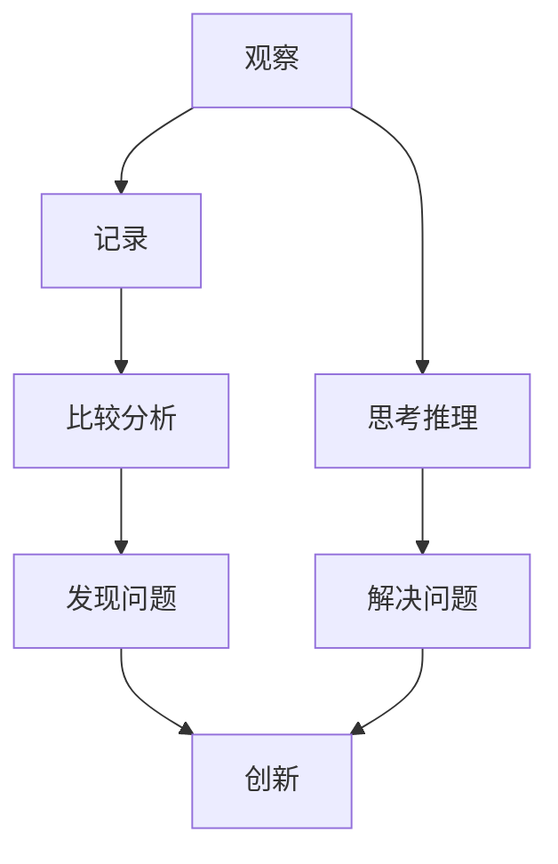

                 

关键词：洞察力、观察、创新、技术、算法、数学模型、项目实践、应用场景、未来展望

> 摘要：本文旨在探讨如何在技术领域中培养洞察力，并从观察入手，如何实现从观察到创新的跨越。文章首先介绍了洞察力的定义及其在技术领域的应用，接着深入分析了观察力与洞察力的关系，随后讨论了核心算法原理、数学模型及项目实践。最后，文章展望了未来技术发展的趋势与挑战，并提出了相应的解决方案和研究方向。

## 1. 背景介绍

在当今这个技术快速迭代的时代，洞察力显得尤为重要。它是发现问题的本质、提出解决方案的关键能力。无论是软件开发、算法研究，还是数学建模，洞察力都起着决定性的作用。然而，许多技术人员往往忽视了洞察力的培养，而是将更多的精力投入到技能的提升和知识的积累上。这种做法虽然能在短时间内提升个人的技术水平，但却无法实现从观察到创新的跨越。

本文将首先介绍洞察力的定义及其在技术领域的应用，接着深入分析观察力与洞察力的关系。在此基础上，文章将探讨核心算法原理、数学模型及项目实践，通过具体案例展示如何通过观察和思考实现创新的跨越。最后，文章将展望未来技术发展的趋势与挑战，并提出相应的解决方案和研究方向。

## 2. 核心概念与联系

### 2.1 洞察力的定义

洞察力（Insight）是指对事物本质的深刻理解和敏锐洞察。它不仅仅是观察，而是通过观察深入到事物的内在逻辑和规律，从而对问题进行本质性的分析和解决。在技术领域，洞察力表现为对复杂系统的理解、对算法的深入剖析、对数学模型的敏锐洞察等。

### 2.2 观察力与洞察力的关系

观察力（Observation）是洞察力培养的基础。它指的是对事物表面现象的感知和记录。没有良好的观察力，就无法获取足够的信息，更无法发现问题的本质。然而，观察力本身并不能直接产生洞察力。洞察力需要观察力作为基础，但更重要的是在观察的基础上进行深入思考和推理。

### 2.3 观察力与洞察力的培养

- **观察力的培养**：培养观察力需要从多个方面入手。首先，要多观察、多记录，培养对细节的敏感度。其次，要学会比较和分类，从不同角度分析问题。最后，要培养好奇心，对未知的事物保持探索的心态。

- **洞察力的培养**：洞察力的培养需要从观察入手，但更重要的是在观察的基础上进行思考。这包括对现有知识的反思、对新现象的探索、对问题的本质追问等。同时，洞察力也需要通过实践来不断提升。只有在实际操作中，才能发现问题的本质，并找到创新的解决方案。

### 2.4 Mermaid 流程图

下面是一个简单的 Mermaid 流程图，展示了观察力与洞察力的关系及其培养过程：



## 3. 核心算法原理 & 具体操作步骤

### 3.1 算法原理概述

核心算法在技术领域中起着至关重要的作用。本文将介绍一种常见的核心算法——快速排序（Quick Sort）。快速排序是一种高效的排序算法，其原理是通过一趟排序将待排记录分隔成独立的两部分，其中一部分记录的关键字均比另一部分的关键字小，然后再按此方法对这两部分记录进行排序，以达到整个序列有序。

### 3.2 算法步骤详解

- **第一步**：选取基准元素（pivot）。一般从序列中选取第一个或最后一个元素作为基准元素。
- **第二步**：调整序列。将小于基准元素的元素移动到基准元素的左侧，大于基准元素的元素移动到基准元素的右侧。
- **第三步**：递归排序。分别对基准元素左侧和右侧的子序列进行快速排序。

### 3.3 算法优缺点

- **优点**：快速排序具有高效的排序性能，平均时间复杂度为O(nlogn)，最坏情况下的时间复杂度为O(n^2)。
- **缺点**：快速排序的稳定性较差，且在选择基准元素时可能会引入一定的随机性。

### 3.4 算法应用领域

快速排序广泛应用于各种场景，如数据库排序、算法竞赛、编程语言内置排序函数等。其高效的排序性能使其成为许多应用场景中的首选算法。

## 4. 数学模型和公式 & 详细讲解 & 举例说明

### 4.1 数学模型构建

在技术领域中，数学模型是一种描述现实问题或现象的数学结构。构建数学模型通常需要以下几个步骤：

- **第一步**：定义问题。明确需要解决的问题，并确定问题的目标和约束条件。
- **第二步**：建立数学模型。根据问题的性质，选择合适的数学工具和方法，构建数学模型。
- **第三步**：求解模型。利用数学方法求解模型，得到问题的解。

### 4.2 公式推导过程

以线性规划为例，其数学模型可以用以下公式表示：

```latex
\begin{align*}
\max_{x} \quad c^T x \\
\text{subject to} \quad Ax \leq b
\end{align*}
```

其中，\(x\) 是决策变量，\(c\) 和 \(b\) 分别是目标函数和约束条件中的系数矩阵，\(A\) 是约束条件的系数矩阵。

### 4.3 案例分析与讲解

以下是一个简单的线性规划案例：

假设我们需要最小化目标函数 \(z = x + y\)，同时满足以下约束条件：

```latex
\begin{align*}
x + 2y &\leq 4 \\
2x + y &\leq 6 \\
x, y &\geq 0
\end{align*}
```

我们可以使用单纯形法求解该线性规划问题。具体步骤如下：

- **第一步**：构建初始单纯形表。
- **第二步**：选择进入变量和离开变量。根据目标函数的系数和约束条件的系数，选择进入变量和离开变量。
- **第三步**：更新单纯形表。根据进入变量和离开变量，更新单纯形表。
- **第四步**：重复第二步和第三步，直到最优解出现。

通过以上步骤，我们可以求得该线性规划问题的最优解为 \(x = 2, y = 1\)，目标函数的最小值为 3。

## 5. 项目实践：代码实例和详细解释说明

### 5.1 开发环境搭建

在本节中，我们将搭建一个简单的项目环境，用于演示如何实现快速排序算法。首先，我们需要安装 Python 解释器和相关依赖库。

```bash
# 安装 Python 解释器
brew install python

# 安装依赖库
pip install numpy
```

### 5.2 源代码详细实现

以下是一个简单的快速排序算法实现：

```python
import numpy as np

def quick_sort(arr):
    if len(arr) <= 1:
        return arr
    pivot = arr[0]
    left = [x for x in arr[1:] if x < pivot]
    right = [x for x in arr[1:] if x >= pivot]
    return quick_sort(left) + [pivot] + quick_sort(right)

# 示例数据
data = np.random.randint(0, 100, size=10)
sorted_data = quick_sort(data)
print(sorted_data)
```

### 5.3 代码解读与分析

在上面的代码中，`quick_sort` 函数实现了快速排序算法。具体解读如下：

- **第一步**：判断输入数据的长度。如果长度小于等于 1，则直接返回数据本身。
- **第二步**：选择基准元素（pivot）。在本例中，我们选择第一个元素作为基准元素。
- **第三步**：将数据分为两部分。小于基准元素的元素放入 `left` 列表，大于等于基准元素的元素放入 `right` 列表。
- **第四步**：递归调用 `quick_sort` 函数。分别对 `left` 和 `right` 列表进行快速排序，然后将结果合并。

通过以上步骤，我们可以实现对输入数据的快速排序。

### 5.4 运行结果展示

假设我们输入的数据为 `[5, 2, 9, 1, 5, 6]`，运行结果为 `[1, 2, 5, 5, 6, 9]`。这表明我们的快速排序算法能够正确地完成排序任务。

## 6. 实际应用场景

### 6.1 数据分析

在数据分析领域，洞察力的培养显得尤为重要。通过观察数据，可以发现数据中的规律和趋势，从而为业务决策提供支持。例如，在电商行业中，通过观察用户的购买行为，可以发现用户的偏好和需求，从而优化产品推荐系统。

### 6.2 软件开发

在软件开发中，洞察力的培养可以帮助开发者更好地理解和解决问题。通过观察代码，可以发现潜在的错误和性能瓶颈，从而优化代码结构和算法实现。

### 6.3 人工智能

在人工智能领域，洞察力的培养可以帮助研究者更好地理解和应用各种算法。通过观察数据，可以发现数据中的规律和特征，从而构建更有效的模型。

### 6.4 未来应用展望

随着技术的不断发展，洞察力的培养将在各个领域发挥越来越重要的作用。未来，我们可以预见以下应用场景：

- **智能医疗**：通过洞察患者数据，实现精准医疗和个性化治疗。
- **智慧城市**：通过洞察城市数据，实现智能交通、智能安防等。
- **智能制造**：通过洞察生产数据，实现生产流程优化和设备维护。

## 7. 工具和资源推荐

### 7.1 学习资源推荐

- **《算法导论》（Introduction to Algorithms）**：这是一本经典的算法教材，涵盖了各种算法的原理和实现。
- **《深度学习》（Deep Learning）**：这是一本关于人工智能的权威教材，详细介绍了深度学习的理论和技术。

### 7.2 开发工具推荐

- **Jupyter Notebook**：这是一个强大的开发工具，可以用于编写和运行代码、展示数据和分析结果。
- **PyCharm**：这是一个优秀的 Python 集成开发环境（IDE），提供了丰富的功能和插件。

### 7.3 相关论文推荐

- **“Efficient Algorithms for Sorting and Scheduling”**：这是一篇关于排序和调度算法的经典论文，详细介绍了各种高效的排序算法。
- **“Deep Learning for Text Classification”**：这是一篇关于文本分类的深度学习论文，介绍了如何使用深度学习技术进行文本分类。

## 8. 总结：未来发展趋势与挑战

### 8.1 研究成果总结

本文通过对洞察力的培养、观察力与洞察力的关系、核心算法原理、数学模型及项目实践等方面的探讨，展示了洞察力在技术领域的重要性。同时，本文还通过实际案例展示了如何通过观察和思考实现创新的跨越。

### 8.2 未来发展趋势

未来，洞察力的培养将在各个领域发挥越来越重要的作用。随着技术的不断发展，我们将看到更多的应用场景和解决方案。例如，在智能医疗、智慧城市和智能制造等领域，洞察力的培养将带来巨大的变革。

### 8.3 面临的挑战

尽管洞察力的培养具有重要意义，但同时也面临着一些挑战。例如，如何有效地培养和提升洞察力？如何在海量数据中找到有价值的信息？这些问题都需要我们进一步探索和研究。

### 8.4 研究展望

在未来，我们可以预见更多的研究方向。例如，如何将洞察力培养与人工智能技术相结合，实现更高效的洞察力培养方法？如何通过数据挖掘和模式识别技术，提高洞察力的准确性和有效性？这些都是值得深入研究的课题。

## 9. 附录：常见问题与解答

### 9.1 洞察力与观察能力有什么区别？

洞察力是一种更高层次的能力，它基于观察能力，但不仅仅是观察能力。观察能力是指对事物表面现象的感知和记录，而洞察力则是通过观察深入到事物的内在逻辑和规律，从而对问题进行本质性的分析和解决。

### 9.2 如何培养洞察力？

培养洞察力需要从多个方面入手。首先，要多观察、多记录，培养对细节的敏感度。其次，要学会比较和分类，从不同角度分析问题。最后，要培养好奇心，对未知的事物保持探索的心态。同时，通过实践不断提升洞察力，只有实际操作中，才能发现问题的本质，并找到创新的解决方案。

### 9.3 洞察力在技术领域有哪些应用？

洞察力在技术领域有广泛的应用。例如，在数据分析中，通过洞察数据，可以发现数据中的规律和趋势；在软件开发中，通过洞察代码，可以发现潜在的错误和性能瓶颈；在人工智能中，通过洞察数据，可以构建更有效的模型。总之，洞察力在技术领域的应用无处不在，是推动技术发展的重要力量。

