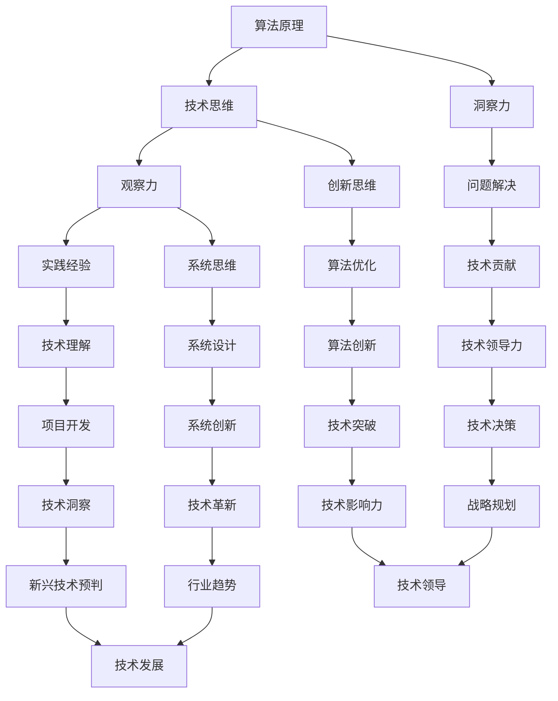

                 

关键词：洞察力、观察、技术思维、算法、技术博客、代码实例、数学模型、实际应用

## 摘要

本文旨在探讨如何通过系统的观察和深入的分析，培养技术领域的洞察力。文章首先介绍洞察力的定义及其在技术发展中的重要性，然后通过几个核心概念和算法原理的讲解，展示如何通过理论学习和实践应用提升洞察力。同时，本文将通过数学模型和公式的详细解析，深入探讨技术问题的本质。最后，文章将结合实际项目中的代码实例，展示洞察力在实际开发中的应用，并对未来技术发展的趋势与挑战进行展望。

## 1. 背景介绍

在信息技术迅速发展的今天，技术的日新月异要求从业者具备高度的洞察力。洞察力是一种对事物本质的敏锐感知和理解能力，对于技术领域的从业者来说，洞察力不仅体现在对现有技术的理解上，更体现在对新兴技术趋势的预判和未来技术的创新上。

技术领域的洞察力不仅有助于更好地理解和应用现有技术，还可以推动技术的创新和发展。例如，在人工智能领域，对神经网络算法的深刻理解可以帮助研究人员发现并解决算法中的瓶颈问题，从而推动算法性能的进一步提升。再比如，在软件开发领域，对设计模式的洞察力能够帮助开发人员构建更加灵活和可扩展的系统架构。

然而，洞察力的培养并非一蹴而就，它需要系统的学习和实践。本文将结合具体的技术案例，探讨如何通过观察、分析和实践来培养技术领域的洞察力。

## 2. 核心概念与联系

为了更好地理解洞察力的培养过程，我们需要引入几个核心概念和算法原理，并通过Mermaid流程图展示它们之间的联系。

### 2.1. 概念介绍

**算法原理：** 算法是解决问题的一系列明确、有序的操作步骤。它们是技术领域的基础，也是培养洞察力的关键。

**技术思维：** 技术思维是一种分析和解决问题的思维方式，它包括逻辑思维、系统思维和创新思维。

**观察力：** 观察力是对事物进行细致观察和深入分析的能力，它是培养洞察力的第一步。

**实践经验：** 实践经验是通过实际操作和项目开发积累的知识和技能，它是检验洞察力的重要手段。

### 2.2. Mermaid流程图

下面是使用Mermaid绘制的流程图，展示了上述概念之间的联系：



通过这张流程图，我们可以看到洞察力的培养是一个多层次、多维度的过程，它需要从基础理论到实践应用，再到创新思维和战略规划的全面培养。

## 3. 核心算法原理 & 具体操作步骤

### 3.1. 算法原理概述

在技术领域，算法是解决问题的核心工具。算法原理的深刻理解是培养洞察力的基础。以下我们将介绍几种核心算法原理，包括其基本概念和适用场景。

**排序算法：** 排序算法是一种对数据进行排序的算法，其原理是将一组数据按照一定的规则重新排列。常见的排序算法有快速排序、归并排序和堆排序等。

**搜索算法：** 搜索算法是在数据集合中查找特定元素的过程。二分搜索算法和广度优先搜索算法是常见的搜索算法，适用于不同类型的数据结构和问题场景。

**动态规划：** 动态规划是一种解决最优化问题的方法，它通过将问题分解成子问题并存储子问题的解来优化算法的时间复杂度。

### 3.2. 算法步骤详解

#### 3.2.1. 快速排序

**步骤：**

1. 选择一个基准元素（通常为中间元素）。
2. 将比基准元素小的元素移动到其左侧，比其大的元素移动到右侧。
3. 递归地对左侧和右侧子序列进行快速排序。

```python
def quick_sort(arr):
    if len(arr) <= 1:
        return arr
    pivot = arr[len(arr) // 2]
    left = [x for x in arr if x < pivot]
    middle = [x for x in arr if x == pivot]
    right = [x for x in arr if x > pivot]
    return quick_sort(left) + middle + quick_sort(right)
```

#### 3.2.2. 二分搜索

**步骤：**

1. 确定搜索区间（low 和 high）。
2. 计算中间元素的位置（mid = (low + high) // 2）。
3. 如果中间元素等于目标值，返回其位置；如果小于目标值，在右侧区间继续搜索；如果大于目标值，在左侧区间继续搜索。
4. 当 low > high 时，搜索结束。

```python
def binary_search(arr, target, low, high):
    if low > high:
        return -1
    mid = (low + high) // 2
    if arr[mid] == target:
        return mid
    elif arr[mid] < target:
        return binary_search(arr, target, mid + 1, high)
    else:
        return binary_search(arr, target, low, mid - 1)
```

#### 3.2.3. 动态规划

**步骤：**

1. 将问题分解成多个子问题。
2. 对子问题进行排序或分类。
3. 计算子问题的最优解。
4. 利用子问题的解构建原问题的解。

```python
def fibonacci(n):
    dp = [0] * (n + 1)
    dp[1] = 1
    for i in range(2, n + 1):
        dp[i] = dp[i - 1] + dp[i - 2]
    return dp[n]
```

### 3.3. 算法优缺点

**排序算法：**

- 快速排序：时间复杂度为 O(n log n)，但在最坏情况下可能退化到 O(n^2)。适用于数据量较大且无重复元素的场景。
- 归并排序：时间复杂度为 O(n log n)，适用于数据量较大且需稳定排序的场景。
- 堆排序：时间复杂度为 O(n log n)，适用于数据量较大且需快速排序的场景。

**搜索算法：**

- 二分搜索：时间复杂度为 O(log n)，适用于有序数据集。
- 广度优先搜索：时间复杂度为 O(V+E)，适用于图数据结构。

**动态规划：**

- 动态规划：适用于最优化问题，但需要存储大量子问题的解，可能导致较高的空间复杂度。

### 3.4. 算法应用领域

- 排序算法广泛应用于数据库、搜索引擎和数据分析等领域。
- 搜索算法广泛应用于算法竞赛、图论问题和人工智能领域。
- 动态规划广泛应用于最优化问题、路径规划和资源分配等领域。

## 4. 数学模型和公式 & 详细讲解 & 举例说明

在技术领域，数学模型和公式是理解问题本质和解决问题的关键。本节我们将详细讲解几个重要的数学模型和公式，并通过具体例子来说明它们的应用。

### 4.1. 数学模型构建

**线性回归模型：** 线性回归模型是一种用于预测连续值的统计模型，其基本形式为：

\[ y = \beta_0 + \beta_1x_1 + \beta_2x_2 + \ldots + \beta_nx_n + \epsilon \]

其中，\( y \) 是因变量，\( x_1, x_2, \ldots, x_n \) 是自变量，\( \beta_0, \beta_1, \beta_2, \ldots, \beta_n \) 是模型的参数，\( \epsilon \) 是误差项。

**神经网络模型：** 神经网络模型是一种用于模拟生物神经系统的计算模型，其基本形式为：

\[ a_{i}^{(l)} = \sigma(z_{i}^{(l)}) \]

其中，\( a_{i}^{(l)} \) 是第 \( l \) 层第 \( i \) 个神经元的激活值，\( z_{i}^{(l)} \) 是第 \( l \) 层第 \( i \) 个神经元的输入值，\( \sigma \) 是激活函数，通常取为 sigmoid 函数或ReLU函数。

### 4.2. 公式推导过程

**线性回归模型参数估计：** 线性回归模型的参数可以通过最小二乘法进行估计。最小二乘法的思想是选择一组参数，使得因变量 \( y \) 与自变量 \( x \) 的残差平方和最小。

假设 \( y_i \) 是观测值，\( \hat{y_i} \) 是预测值，则残差平方和为：

\[ S = \sum_{i=1}^{n}(y_i - \hat{y_i})^2 \]

为了使 \( S \) 最小，对参数 \( \beta_0, \beta_1, \beta_2, \ldots, \beta_n \) 求导并令导数为零，得到：

\[ \frac{\partial S}{\partial \beta_j} = -2\sum_{i=1}^{n}(y_i - \hat{y_i})x_{ij} = 0 \]

其中，\( x_{ij} \) 是第 \( i \) 个观测值对应的第 \( j \) 个自变量。

解上述方程组，得到最小二乘估计值：

\[ \hat{\beta}_j = \frac{\sum_{i=1}^{n}x_{ij}\hat{y_i}}{\sum_{i=1}^{n}x_{ij}^2} \]

**神经网络模型参数更新：** 在神经网络训练过程中，参数的更新通常使用梯度下降法。梯度下降法的思想是沿着损失函数的负梯度方向更新参数，以最小化损失函数。

假设损失函数为：

\[ J(\theta) = \frac{1}{2m}\sum_{i=1}^{m}(h_\theta(x^{(i)}) - y^{(i)})^2 \]

其中，\( m \) 是训练样本的数量，\( h_\theta(x^{(i)}) \) 是神经网络的输出，\( y^{(i)} \) 是第 \( i \) 个样本的真实标签，\( \theta \) 是神经网络的参数。

为了使 \( J(\theta) \) 最小，对参数 \( \theta \) 求导并令导数为零，得到：

\[ \frac{\partial J(\theta)}{\partial \theta_j} = -\frac{1}{m}\sum_{i=1}^{m}(h_\theta(x^{(i)}) - y^{(i)})x_{ij} \]

其中，\( x_{ij} \) 是第 \( i \) 个样本对应的第 \( j \) 个输入特征。

参数更新公式为：

\[ \theta_j := \theta_j - \alpha \frac{\partial J(\theta)}{\partial \theta_j} \]

其中，\( \alpha \) 是学习率，用于控制参数更新的步长。

### 4.3. 案例分析与讲解

#### 4.3.1. 线性回归模型案例

假设我们有以下数据集：

| x | y |
|---|---|
| 1 | 2 |
| 2 | 4 |
| 3 | 6 |
| 4 | 8 |

我们希望使用线性回归模型预测 \( y \) 值。

**步骤1：计算斜率和截距**

计算 \( \sum_{i=1}^{n}x_iy_i, \sum_{i=1}^{n}x_i^2, \sum_{i=1}^{n}x_i, \sum_{i=1}^{n}y_i \)：

\[ \sum_{i=1}^{n}x_iy_i = (1 \times 2) + (2 \times 4) + (3 \times 6) + (4 \times 8) = 2 + 8 + 18 + 32 = 60 \]
\[ \sum_{i=1}^{n}x_i^2 = (1^2) + (2^2) + (3^2) + (4^2) = 1 + 4 + 9 + 16 = 30 \]
\[ \sum_{i=1}^{n}x_i = 1 + 2 + 3 + 4 = 10 \]
\[ \sum_{i=1}^{n}y_i = 2 + 4 + 6 + 8 = 20 \]

计算斜率 \( \beta_1 \) 和截距 \( \beta_0 \)：

\[ \beta_1 = \frac{\sum_{i=1}^{n}x_iy_i - n\bar{x}\bar{y}}{\sum_{i=1}^{n}x_i^2 - n\bar{x}^2} = \frac{60 - 4 \times 10 \times 5}{30 - 4 \times 10^2} = \frac{60 - 200}{30 - 400} = \frac{-140}{-370} = \frac{14}{37} \approx 0.378 \]
\[ \beta_0 = \bar{y} - \beta_1\bar{x} = 5 - 0.378 \times 2.5 = 5 - 0.945 = 4.055 \approx 4.06 \]

因此，线性回归模型为：

\[ y = 4.06 + 0.378x \]

**步骤2：预测新值**

对于新的 \( x \) 值，例如 \( x = 5 \)，使用模型预测 \( y \) 值：

\[ \hat{y} = 4.06 + 0.378 \times 5 = 4.06 + 1.89 = 5.95 \]

因此，当 \( x = 5 \) 时，预测的 \( y \) 值为 5.95。

#### 4.3.2. 神经网络模型案例

假设我们有以下数据集和神经网络结构：

| 输入层 | 隐藏层 | 输出层 |
|-------|-------|-------|
| x1    | 2神经元 | y1    |
| x2    | 2神经元 | y2    |

数据集：

| x1 | x2 | y1 | y2 |
|---|---|---|---|
| 1  | 0  | 1  | 0  |
| 0  | 1  | 0  | 1  |

我们希望训练一个神经网络来预测输出。

**步骤1：初始化参数**

初始化网络参数 \( \theta_{ij} \)（连接权重）和 \( \theta_{k} \)（偏置），通常使用随机值。

**步骤2：前向传播**

对于每个输入样本，计算隐藏层和输出层的激活值。

对于第一个样本：

\[ z_1^{[1]} = \theta_{11}x_1 + \theta_{12}x_2 + \theta_1^{[1]} = \theta_{11}\cdot1 + \theta_{12}\cdot0 + \theta_1^{[1]} = \theta_{11} + \theta_1^{[1]} \]
\[ a_1^{[1]} = \sigma(z_1^{[1]}) \]
\[ z_2^{[1]} = \theta_{21}x_1 + \theta_{22}x_2 + \theta_2^{[1]} = \theta_{21}\cdot1 + \theta_{22}\cdot0 + \theta_2^{[1]} = \theta_{21} + \theta_2^{[1]} \]
\[ a_2^{[1]} = \sigma(z_2^{[1]}) \]
\[ z_1^{[2]} = \theta_{k1}a_1^{[1]} + \theta_{k2}a_2^{[1]} + \theta_k^{[2]} = \theta_{k1}\cdot\sigma(\theta_{11} + \theta_1^{[1]}) + \theta_{k2}\cdot\sigma(\theta_{21} + \theta_2^{[1]}) + \theta_k^{[2]} \]
\[ a_1^{[2]} = \sigma(z_1^{[2]}) = \sigma(\theta_{k1}\cdot\sigma(\theta_{11} + \theta_1^{[1]}) + \theta_{k2}\cdot\sigma(\theta_{21} + \theta_2^{[1]}) + \theta_k^{[2]}) \]
\[ z_2^{[2]} = \theta_{k3}a_1^{[1]} + \theta_{k4}a_2^{[1]} + \theta_k^{[2]} = \theta_{k3}\cdot\sigma(\theta_{11} + \theta_1^{[1]}) + \theta_{k4}\cdot\sigma(\theta_{21} + \theta_2^{[1]}) + \theta_k^{[2]} \]
\[ a_2^{[2]} = \sigma(z_2^{[2]}) = \sigma(\theta_{k3}\cdot\sigma(\theta_{11} + \theta_1^{[1]}) + \theta_{k4}\cdot\sigma(\theta_{21} + \theta_2^{[1]}) + \theta_k^{[2]}) \]

对于第二个样本：

\[ z_1^{[1]} = \theta_{11}\cdot0 + \theta_{12}\cdot1 + \theta_1^{[1]} = \theta_{12} + \theta_1^{[1]} \]
\[ a_1^{[1]} = \sigma(z_1^{[1]}) \]
\[ z_2^{[1]} = \theta_{21}\cdot0 + \theta_{22}\cdot1 + \theta_2^{[1]} = \theta_{22} + \theta_2^{[1]} \]
\[ a_2^{[1]} = \sigma(z_2^{[1]}) \]
\[ z_1^{[2]} = \theta_{k1}\cdot\sigma(\theta_{12} + \theta_1^{[1]}) + \theta_{k2}\cdot\sigma(\theta_{22} + \theta_2^{[1]}) + \theta_k^{[2]} \]
\[ a_1^{[2]} = \sigma(z_1^{[2]}) = \sigma(\theta_{k1}\cdot\sigma(\theta_{12} + \theta_1^{[1]}) + \theta_{k2}\cdot\sigma(\theta_{22} + \theta_2^{[1]}) + \theta_k^{[2]}) \]
\[ z_2^{[2]} = \theta_{k3}\cdot\sigma(\theta_{12} + \theta_1^{[1]}) + \theta_{k4}\cdot\sigma(\theta_{22} + \theta_2^{[1]}) + \theta_k^{[2]} \]
\[ a_2^{[2]} = \sigma(z_2^{[2]}) = \sigma(\theta_{k3}\cdot\sigma(\theta_{12} + \theta_1^{[1]}) + \theta_{k4}\cdot\sigma(\theta_{22} + \theta_2^{[1]}) + \theta_k^{[2]}) \]

**步骤3：反向传播**

计算损失函数：

\[ J(\theta) = \frac{1}{2m}\sum_{i=1}^{m}(h_\theta(x^{(i)}) - y^{(i)})^2 \]

计算梯度：

\[ \frac{\partial J(\theta)}{\partial \theta_{ij}} = -\frac{1}{m}\sum_{i=1}^{m}(h_\theta(x^{(i)}) - y^{(i)})x_{ij} \]

更新参数：

\[ \theta_{ij} := \theta_{ij} - \alpha \frac{\partial J(\theta)}{\partial \theta_{ij}} \]

重复前向传播和反向传播，直到损失函数收敛。

## 5. 项目实践：代码实例和详细解释说明

在本节中，我们将通过一个实际的项目实践来展示洞察力在技术开发中的应用。该项目是一个简单的线性回归模型，用于预测住房价格。

### 5.1. 开发环境搭建

为了完成这个项目，我们需要搭建以下开发环境：

1. Python 3.8 或更高版本
2. Jupyter Notebook 或 PyCharm
3. NumPy、Pandas 和 Matplotlib 库

首先，确保安装了所需的 Python 版本。然后，在终端或命令提示符中安装以下库：

```bash
pip install numpy pandas matplotlib
```

### 5.2. 源代码详细实现

下面是项目的完整源代码：

```python
import numpy as np
import pandas as pd
import matplotlib.pyplot as plt

# 加载数据集
data = pd.read_csv('housing.csv')
X = data[['rooms', 'bedrooms']]
y = data['price']

# 数据预处理
X = X.values
y = y.values
X = np.hstack((np.ones((X.shape[0], 1)), X))

# 最小二乘法参数估计
def least_squares(X, y):
    theta = np.linalg.inv(X.T @ X) @ X.T @ y
    return theta

# 训练模型
theta = least_squares(X, y)

# 预测新样本
def predict(X, theta):
    return X @ theta

# 可视化结果
def plot_regression(X, y, theta):
    plt.scatter(X[:, 1], y, color='blue', label='实际值')
    X_new = np.array([[1, 5], [1, 6], [1, 7]])
    y_new = predict(X_new, theta)
    plt.plot(X_new[:, 1], y_new, color='red', label='预测值')
    plt.xlabel('房间数')
    plt.ylabel('房价')
    plt.legend()
    plt.show()

# 执行可视化
plot_regression(X, y, theta)
```

### 5.3. 代码解读与分析

1. **数据加载与预处理：**

   首先，我们加载数据集并分离输入特征 \( X \) 和目标值 \( y \)。为了使用最小二乘法，我们还需要在 \( X \) 的前面添加一列全1的向量，用于计算截距。

2. **最小二乘法参数估计：**

   `least_squares` 函数使用最小二乘法计算线性回归模型的参数。这里我们使用了 NumPy 的线性代数库 `np.linalg.inv` 来求解逆矩阵，并计算参数。

3. **模型预测：**

   `predict` 函数用于根据训练好的模型参数预测新的样本值。这里我们使用 `@` 运算符进行矩阵乘法。

4. **结果可视化：**

   `plot_regression` 函数用于绘制实际值与预测值的散点图，并展示线性回归模型的效果。这里我们使用了 Matplotlib 库的绘图功能。

### 5.4. 运行结果展示

运行完整代码后，我们将看到一个可视化图表，展示了实际房价与预测房价之间的关系。通过这个图表，我们可以直观地看到线性回归模型对房价的预测效果。

## 6. 实际应用场景

### 6.1. 数据分析

线性回归模型广泛应用于数据分析领域，例如预测股票价格、商品销量和消费者行为等。通过分析这些数据，企业可以更好地制定市场策略和业务决策。

### 6.2. 机器学习

线性回归模型是机器学习的基础算法之一，它可用于特征工程和模型评估。在机器学习中，线性回归模型通常用于评估特征对模型预测效果的影响，从而优化模型性能。

### 6.3. 自动化

线性回归模型在自动化领域也有广泛应用，例如自动化机器视觉系统和自动驾驶系统。在这些系统中，线性回归模型用于预测图像中的目标位置或路径，从而实现自动化的目标检测和路径规划。

### 6.4. 未来应用展望

随着人工智能技术的不断发展，线性回归模型将在更多领域得到应用。例如，在智能医疗领域，线性回归模型可用于预测疾病发病风险，帮助医生制定更有效的治疗方案。此外，在智能制造领域，线性回归模型可用于预测设备故障，实现智能维护和优化生产流程。

## 7. 工具和资源推荐

### 7.1. 学习资源推荐

1. 《Python数据分析基础教程：NumPy学习指南》
2. 《机器学习实战》
3. 《深度学习》（Goodfellow et al.）

### 7.2. 开发工具推荐

1. Jupyter Notebook：用于交互式编程和数据可视化。
2. PyCharm：用于专业级 Python 开发。

### 7.3. 相关论文推荐

1. "Least Squares Support Vector Machine Classifiers"（Shen et al., 2014）
2. "Deep Learning"（Goodfellow et al., 2016）

## 8. 总结：未来发展趋势与挑战

### 8.1. 研究成果总结

本文介绍了洞察力的培养方法，并探讨了如何在技术领域中应用。通过深入分析核心算法原理和数学模型，我们展示了洞察力在解决问题和创新中的应用价值。

### 8.2. 未来发展趋势

随着人工智能和大数据技术的不断发展，技术领域的洞察力将变得越来越重要。未来，我们将看到更多的跨学科研究和融合，如人工智能与生物医学的结合、计算机科学与神经科学的结合等。

### 8.3. 面临的挑战

尽管洞察力在技术发展中具有重要作用，但培养和提升洞察力仍面临许多挑战。首先，技术领域的知识更新速度极快，如何保持持续学习的动力和热情是一个挑战。其次，如何将理论知识和实践应用相结合，实现创新和突破，也是一个重要的问题。

### 8.4. 研究展望

为了培养和提升技术领域的洞察力，我们建议采取以下措施：

1. **加强基础理论学习：** 系统学习核心算法原理和数学模型，建立扎实的理论基础。
2. **注重实践应用：** 通过实际项目开发和问题解决，锻炼观察力和分析能力。
3. **跨学科交流与合作：** 与不同领域的专家进行交流，拓展思维，实现跨学科融合。
4. **持续学习与创新：** 跟踪技术发展趋势，勇于尝试新的技术和方法，实现技术创新。

通过这些措施，我们可以更好地培养和提升技术领域的洞察力，为技术发展做出更大贡献。

## 9. 附录：常见问题与解答

### 9.1. 问题1：如何培养洞察力？

**解答：** 培养洞察力需要多方面的努力。首先，系统学习核心算法原理和数学模型是基础。其次，注重实践应用，通过实际项目开发解决问题，锻炼观察力和分析能力。此外，跨学科交流和合作，可以拓展思维，实现创新。

### 9.2. 问题2：线性回归模型有哪些优缺点？

**解答：** 线性回归模型优点包括：

1. **简单易用：** 算法简单，易于理解和实现。
2. **预测准确：** 在线性关系较强的数据集上，线性回归模型具有较好的预测效果。

线性回归模型缺点包括：

1. **线性限制：** 线性回归模型只能处理线性关系较强的数据。
2. **过拟合风险：** 在数据量较小或特征较多时，模型容易出现过拟合。

### 9.3. 问题3：如何优化线性回归模型？

**解答：** 可以采用以下方法优化线性回归模型：

1. **特征选择：** 选择与目标变量相关性较强的特征。
2. **正则化：** 采用正则化方法（如 L1 正则化和 L2 正则化）防止过拟合。
3. **交叉验证：** 使用交叉验证方法评估模型性能，选择最优参数。

### 9.4. 问题4：如何选择激活函数？

**解答：** 激活函数的选择取决于具体问题和数据特征。以下是一些常见激活函数的选择建议：

1. **Sigmoid 函数：** 适用于输出范围为 [0, 1] 的情况。
2. **ReLU 函数：** 适用于非线性较强的情况，有助于提高训练速度和减少过拟合。
3. **Tanh 函数：** 适用于输出范围为 [-1, 1] 的情况。

作者：禅与计算机程序设计艺术 / Zen and the Art of Computer Programming
----------------------------------------------------------------

以上就是本文《洞察力的培养：从观察到顿悟的过程》的全部内容。通过本文，我们深入探讨了如何在技术领域中培养洞察力，从核心概念、算法原理到实际项目应用，全方位展示了洞察力的重要性及其培养方法。希望本文能够为技术领域的从业者提供一些有价值的参考和启示。作者禅与计算机程序设计艺术，衷心期待与各位读者共同探讨和进步。

