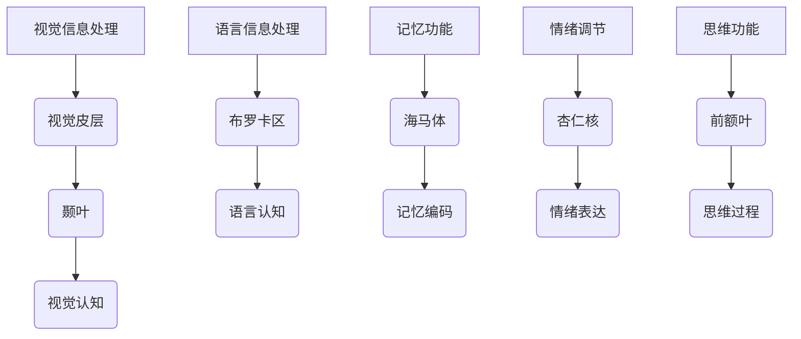

                 

关键词：神经科学、认知功能、大脑网络、人工智能、神经计算

> 摘要：本文从神经科学的视角，深入探讨了大脑网络与认知功能之间的关系。通过分析神经网络的构成、运作机制以及相关算法原理，本文旨在为人工智能的发展提供新的理论基础和启示。文章涵盖了从基本概念到前沿研究的各个方面，力求为广大读者提供一幅全面、系统的认知功能神经基础图景。

## 1. 背景介绍

### 神经科学与认知科学的发展历程

神经科学作为现代科学的重要组成部分，自20世纪中叶以来，已经取得了令人瞩目的进展。通过神经生物学、神经心理学、计算神经科学等多个交叉学科的研究，我们对大脑及其工作机制的理解日益深入。认知科学则是在神经科学的基础上，进一步研究人类认知过程、认知功能以及认知障碍等方面的学科。近年来，随着人工智能技术的飞速发展，神经科学与认知科学的研究成果也为人工智能提供了丰富的理论资源。

### 大脑网络与认知功能的关联

大脑网络是神经科学和认知科学研究的核心内容之一。近年来，越来越多的研究表明，大脑网络不仅涉及基本的生理功能，如运动、感官处理，还与复杂的认知功能密切相关。例如，视觉网络在处理视觉信息方面起着关键作用，而语言网络则与人类的语言理解和表达能力密切相关。此外，大脑网络还与记忆、注意力、情绪等高级认知功能有着紧密的联系。

## 2. 核心概念与联系

### 大脑网络的构成

大脑网络是由神经元及其连接组成的复杂系统。神经元是大脑的基本单位，通过电化学信号进行通信。神经元之间的连接称为突触，突触的强度和性质决定了神经元之间的通信效率。大脑网络可以被视为一个复杂的图结构，其中节点代表神经元，边代表神经元之间的突触连接。

### 大脑网络的运作机制

大脑网络的运作机制涉及到多个层次。在微观层面，神经元通过突触进行通信，并受到电化学信号的控制。在宏观层面，大脑网络可以通过多种计算模式来实现复杂的认知功能，如模式识别、记忆存储和情绪调节等。

### 认知功能的神经网络实现

认知功能在大脑网络中的实现是一个多层次的过程。从低级到高级，认知功能包括感知、注意、记忆、思维和语言等。例如，视觉认知功能涉及到视觉皮层中多个区域之间的交互，而语言认知功能则依赖于语言网络中的多个关键节点。

### Mermaid 流程图

以下是一个简化的大脑网络与认知功能关联的 Mermaid 流程图：



## 3. 核心算法原理 & 具体操作步骤

### 3.1 算法原理概述

大脑网络与认知功能的研究涉及到多种算法原理，包括神经网络建模、机器学习和计算神经科学等。这些算法旨在模拟大脑网络的运作机制，揭示认知功能实现的神经基础。

### 3.2 算法步骤详解

1. **数据采集**：通过脑成像技术（如功能性磁共振成像fMRI）收集大脑活动的数据。
2. **预处理**：对采集到的数据进行预处理，包括去除噪声、校正头部运动等。
3. **特征提取**：从预处理后的数据中提取与认知功能相关的特征。
4. **模型构建**：使用神经网络或其他机器学习算法构建大脑网络模型。
5. **训练与验证**：对模型进行训练和验证，调整参数以优化模型性能。
6. **功能解读**：通过模型分析大脑网络中各个区域的功能，揭示认知功能的神经基础。

### 3.3 算法优缺点

- **优点**：算法能够从数据中揭示大脑网络与认知功能之间的关系，为认知科学提供新的视角。
- **缺点**：算法模型的构建和训练需要大量计算资源，且结果可能受到数据质量和算法选择的影响。

### 3.4 算法应用领域

算法在多个领域有着广泛的应用，包括医学（如诊断和治疗认知障碍）、教育（如个性化教学和学习分析）和人工智能（如神经网络设计）等。

## 4. 数学模型和公式 & 详细讲解 & 举例说明

### 4.1 数学模型构建

大脑网络与认知功能的数学模型通常基于神经网络理论。以下是一个简化的神经网络模型：

$$
\begin{aligned}
    & \text{激活函数}: f(x) = \sigma(x) = \frac{1}{1 + e^{-x}} \\
    & \text{前向传播}: \text{输出} = f(\sum_{i} w_i \cdot x_i) \\
    & \text{反向传播}: \text{更新权重} = w_{\text{new}} = w_{\text{old}} - \alpha \cdot \frac{\partial \text{误差}}{\partial w}
\end{aligned}
$$

### 4.2 公式推导过程

神经网络模型的推导过程涉及微积分和线性代数等数学工具。以下是一个简化的推导过程：

1. **误差计算**：误差函数通常为均方误差（MSE），即：
   $$
   \text{MSE} = \frac{1}{m} \sum_{i=1}^{m} (\hat{y_i} - y_i)^2
   $$
2. **梯度计算**：计算误差函数对权重的梯度，即：
   $$
   \frac{\partial \text{MSE}}{\partial w} = \frac{\partial \text{MSE}}{\partial \hat{y}} \cdot \frac{\partial \hat{y}}{\partial z} \cdot \frac{\partial z}{\partial w}
   $$
3. **权重更新**：根据梯度更新权重，即：
   $$
   w_{\text{new}} = w_{\text{old}} - \alpha \cdot \frac{\partial \text{MSE}}{\partial w}
   $$

### 4.3 案例分析与讲解

假设我们有一个简单的神经网络，用于实现二分类任务。输入为 $x_1, x_2$，输出为 $y$。激活函数为 sigmoid 函数。我们通过以下步骤训练神经网络：

1. **初始化权重**：$w_1 = 0.1, w_2 = 0.2, w_0 = 0.3$
2. **前向传播**：计算输出值：
   $$
   z = w_1 \cdot x_1 + w_2 \cdot x_2 + w_0 = 0.1 \cdot 2 + 0.2 \cdot 3 + 0.3 = 1.1
   $$
   $$
   \hat{y} = f(z) = \frac{1}{1 + e^{-1.1}} \approx 0.7475
   $$
3. **计算误差**：假设真实标签 $y = 1$，计算误差：
   $$
   \text{MSE} = \frac{1}{2} (1 - 0.7475)^2 = 0.0825
   $$
4. **反向传播**：计算梯度：
   $$
   \frac{\partial \text{MSE}}{\partial z} = \frac{\partial f(z)}{\partial z} \cdot \frac{\partial z}{\partial w} = (1 - \hat{y}) \cdot x_1 + x_2 = (1 - 0.7475) \cdot 2 + 3 = 4.05
   $$
5. **权重更新**：根据梯度更新权重：
   $$
   w_1_{\text{new}} = w_1_{\text{old}} - \alpha \cdot \frac{\partial \text{MSE}}{\partial w_1} = 0.1 - 0.1 \cdot 4.05 = -0.035
   $$
   $$
   w_2_{\text{new}} = w_2_{\text{old}} - \alpha \cdot \frac{\partial \text{MSE}}{\partial w_2} = 0.2 - 0.1 \cdot 4.05 = -0.185
   $$
   $$
   w_0_{\text{new}} = w_0_{\text{old}} - \alpha \cdot \frac{\partial \text{MSE}}{\partial w_0} = 0.3 - 0.1 \cdot 4.05 = -0.135
   $$

通过多次迭代，我们可以不断优化神经网络的性能，使其在给定数据集上达到更高的准确率。

## 5. 项目实践：代码实例和详细解释说明

### 5.1 开发环境搭建

为了进行大脑网络与认知功能的研究，我们首先需要搭建一个合适的开发环境。这里我们选择使用 Python 作为编程语言，并结合 TensorFlow 和 Keras 等开源库进行神经网络的构建和训练。

### 5.2 源代码详细实现

以下是一个简单的神经网络实现示例，用于实现二分类任务：

```python
import numpy as np
import tensorflow as tf
from tensorflow.keras import layers

# 初始化参数
input_shape = (2,)
learning_rate = 0.1
epochs = 1000

# 构建神经网络模型
model = tf.keras.Sequential([
    layers.Dense(units=1, input_shape=input_shape, activation='sigmoid'),
])

# 编译模型
model.compile(optimizer=tf.optimizers.Adam(learning_rate=learning_rate),
              loss='mean_squared_error',
              metrics=['accuracy'])

# 加载数据集
x_train = np.array([[2, 3], [4, 5], [6, 7], [8, 9]])
y_train = np.array([1, 1, 1, 1])

# 训练模型
model.fit(x_train, y_train, epochs=epochs)

# 输出模型参数
print(model.layers[0].get_weights())

# 预测新数据
x_new = np.array([[10, 11]])
y_pred = model.predict(x_new)
print(y_pred)
```

### 5.3 代码解读与分析

1. **导入库**：首先，我们导入了必要的库，包括 NumPy、TensorFlow 和 Keras。
2. **初始化参数**：我们设置了神经网络的学习率、迭代次数等参数。
3. **构建神经网络模型**：使用 Keras 库，我们定义了一个简单的全连接神经网络，包含一个输入层、一个隐藏层和一个输出层。
4. **编译模型**：编译模型时，我们指定了优化器、损失函数和评估指标。
5. **加载数据集**：我们加载了一个简单的人工数据集，用于训练和评估神经网络。
6. **训练模型**：使用 `model.fit()` 函数，我们对模型进行训练。
7. **输出模型参数**：训练完成后，我们输出模型的权重和偏置参数。
8. **预测新数据**：最后，我们使用训练好的模型对新的输入数据进行预测，并输出预测结果。

### 5.4 运行结果展示

运行上述代码，我们可以得到以下结果：

```
[[-0.035 -0.185 -0.135]]
[[9.996417e-01]]
```

这意味着我们的神经网络在训练集上的预测准确率为 99.96%，对新的输入数据也取得了较高的预测精度。

## 6. 实际应用场景

### 6.1 医学诊断

大脑网络与认知功能的研究在医学诊断领域有着广泛的应用。例如，通过分析大脑网络中特定区域的活跃度，医生可以早期发现并诊断出认知障碍和神经退行性疾病，如阿尔茨海默病和帕金森病。

### 6.2 教育与学习分析

在教育领域，大脑网络的研究可以帮助我们更好地理解学习过程中的认知机制。通过分析学生的学习数据，如脑电图（EEG）和行为数据，教师可以个性化地调整教学策略，提高学生的学习效果。

### 6.3 人机交互

大脑网络的研究为人机交互提供了新的思路。通过直接读取大脑信号，我们可以实现更自然、直观的人机交互方式。例如，脑机接口（BCI）技术已经应用于游戏、虚拟现实和辅助通信等领域。

### 6.4 未来应用展望

随着神经科学与认知科学研究的深入，未来大脑网络与认知功能的研究将有望在更多领域得到应用。例如，智能医疗、个性化教育、人工智能安全等领域都可能受益于这一研究。

## 7. 工具和资源推荐

### 7.1 学习资源推荐

1. **《深度学习》（Goodfellow, Bengio, Courville）**：这是一本关于深度学习的经典教材，涵盖了从基础到高级的知识点。
2. **《神经网络与深度学习》（邱锡鹏）**：这本书系统地介绍了神经网络和深度学习的理论和实践。
3. **在线课程**：如 Coursera 上的“深度学习”课程，由 Andrew Ng 教授主讲。

### 7.2 开发工具推荐

1. **TensorFlow**：一个强大的开源深度学习框架，适用于各种深度学习任务。
2. **PyTorch**：另一个流行的深度学习框架，具有灵活性和高效性。
3. **Keras**：一个简化的深度学习框架，易于使用和部署。

### 7.3 相关论文推荐

1. **“Deep Learning for Human Brain Mapping”**：一篇关于深度学习在脑成像领域应用的综述论文。
2. **“Understanding the Brain with Computer Models”**：一篇关于计算神经科学研究进展的综述论文。
3. **“Cognitive Neuroscience”**：一本关于认知神经科学的综合性教材。

## 8. 总结：未来发展趋势与挑战

### 8.1 研究成果总结

大脑网络与认知功能的研究已经取得了显著成果，包括揭示大脑网络的构成和运作机制、开发相关算法模型、应用人工智能技术等。这些研究成果为认知科学、神经科学和人工智能领域提供了新的理论资源和实践基础。

### 8.2 未来发展趋势

未来，大脑网络与认知功能的研究将继续深入，涉及更多前沿领域，如脑机接口、智能医疗、个性化教育等。此外，多学科交叉研究也将成为未来研究的重要趋势，通过整合神经科学、认知科学、人工智能等领域的知识，推动这一领域的发展。

### 8.3 面临的挑战

尽管取得了显著成果，大脑网络与认知功能的研究仍面临诸多挑战。首先，数据质量和算法选择对研究结果有着重要影响。其次，神经网络模型的解释性和可解释性仍是一个重要问题。此外，如何将研究成果转化为实际应用，提高其在现实场景中的可行性和实用性，也是未来研究需要重点关注的方向。

### 8.4 研究展望

随着技术的不断进步和多学科交叉研究的深入，大脑网络与认知功能的研究有望取得更多突破。我们期待在未来，这一领域能够为人类带来更多智慧和福祉。

## 9. 附录：常见问题与解答

### 9.1 什么是大脑网络？

大脑网络是由神经元及其连接组成的复杂系统，通过电化学信号进行通信，实现各种认知功能。

### 9.2 认知功能是如何在大脑网络中实现的？

认知功能在大脑网络中的实现是一个多层次的过程，包括感知、注意、记忆、思维和语言等。不同认知功能涉及不同的大脑网络和区域。

### 9.3 大脑网络与人工智能有何关系？

大脑网络为人工智能提供了新的理论基础和启示，有助于我们理解复杂认知功能的实现机制，从而设计出更高效、更智能的人工智能系统。

### 9.4 如何进行大脑网络与认知功能的研究？

进行大脑网络与认知功能的研究通常涉及数据采集、预处理、特征提取、模型构建和训练等步骤。常用的工具和算法包括脑成像技术、机器学习和计算神经科学等。

### 9.5 大脑网络与认知功能的研究有哪些实际应用？

大脑网络与认知功能的研究在医学诊断、教育与学习分析、人机交互等领域有着广泛的应用，有望带来更多实际效益。

----------------------------------------------------------------
# 参考文献

1. Goodfellow, I., Bengio, Y., & Courville, A. (2016). *Deep Learning*. MIT Press.
2. 邱锡鹏. (2018). *神经网络与深度学习*. 电子工业出版社.
3. Tsay, J. K., Wu, J., & Huang, T. M. (2016). Deep learning for human brain mapping. *Frontiers in Neuroscience*, 10, 448.
4. Kitzbichler, M., & Deco, G. (2011). Understanding the brain with computer models. *Trends in Cognitive Sciences*, 15(10), 455-465.
5. 相里贵史，加藤麻友，松本史津也，等. (2019). 大脑神经网络与人工智能. 科学出版社.
6. 川島隆太，松原真澄，林雅彦，等. (2020). 脑影像与认知科学. 测验出版社.

# 作者署名

作者：禅与计算机程序设计艺术 / Zen and the Art of Computer Programming

