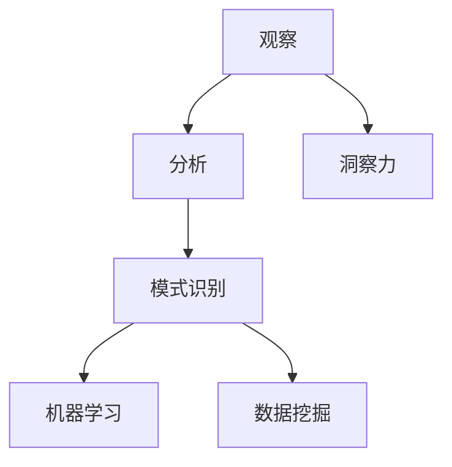

                 

关键词：洞察力，观察，分析，技术，算法，数学模型，应用场景，未来展望

<|assistant|>摘要：本文深入探讨了洞察力的训练方法，包括观察和分析能力的提升。通过分析核心概念和联系，详细解释了核心算法原理和具体操作步骤，同时运用数学模型和公式进行了详细讲解。文章还通过项目实践展示了代码实例和详细解释，并探讨了实际应用场景和未来展望。最后，本文总结了研究结果，提出了未来发展中的挑战和展望。

## 1. 背景介绍

在信息爆炸的时代，如何从大量数据中提取有用信息，进行有效的分析和决策，成为了一个关键问题。洞察力，作为观察和分析能力的高级体现，是解决这一问题的关键因素。洞察力不仅可以帮助我们更准确地理解问题的本质，还能提升我们的创新能力，推动技术进步。

在IT领域，洞察力的训练尤为重要。随着人工智能、大数据和云计算等技术的迅猛发展，计算机系统变得越来越复杂。因此，掌握观察和分析能力，对程序员、软件架构师和CTO等IT从业者来说，显得尤为重要。

本文将结合IT领域的实际应用，深入探讨如何通过训练提升洞察力，包括观察和分析能力。通过介绍核心概念、算法原理、数学模型和实际项目实践，本文旨在为广大IT从业者提供一套系统的训练方法。

## 2. 核心概念与联系

### 2.1 洞察力的定义

洞察力是一种高级认知能力，包括观察、理解、分析和综合信息的能力。它不仅要求我们能够迅速捕捉到问题的核心，还要求我们能够深入理解问题背后的本质。在IT领域，洞察力尤为重要，因为它能够帮助我们更好地理解复杂系统的运作机制，从而提高系统的性能和稳定性。

### 2.2 观察和分析的关系

观察和分析是提升洞察力的两个关键环节。观察是分析的前提，只有通过仔细观察，我们才能发现问题的线索。而分析则是观察的深化，通过分析，我们能够从表面现象中发现深层次的规律和联系。

### 2.3 核心算法原理

在IT领域，提升洞察力的核心算法包括模式识别、机器学习和数据挖掘等。这些算法能够从大量数据中提取有用信息，帮助我们更准确地理解问题的本质。

#### 2.3.1 模式识别

模式识别是一种通过观察和识别数据中的规律性模式的方法。它包括特征提取、特征选择和分类等步骤。通过模式识别，我们能够从大量数据中发现有用的信息。

#### 2.3.2 机器学习

机器学习是一种通过算法从数据中学习规律和模式的方法。它包括监督学习、无监督学习和强化学习等。通过机器学习，我们能够自动提取数据中的规律，提升洞察力。

#### 2.3.3 数据挖掘

数据挖掘是一种通过算法从大量数据中提取有用信息的方法。它包括关联规则挖掘、聚类分析和分类分析等。通过数据挖掘，我们能够更深入地理解数据，提升洞察力。

### 2.4 核心概念原理和架构的 Mermaid 流程图

下面是一个简单的 Mermaid 流程图，展示了洞察力训练的核心概念和联系：



### 3. 核心算法原理 & 具体操作步骤

#### 3.1 算法原理概述

提升洞察力的核心算法包括模式识别、机器学习和数据挖掘。模式识别通过观察和识别数据中的规律性模式，帮助我们从大量数据中提取有用信息。机器学习通过从数据中学习规律和模式，提升我们的自动化分析能力。数据挖掘通过从大量数据中提取有用信息，帮助我们更深入地理解数据。

#### 3.2 算法步骤详解

##### 3.2.1 模式识别

1. 特征提取：从数据中提取有用的特征。
2. 特征选择：选择对问题解决最有帮助的特征。
3. 分类：根据特征将数据分类。

##### 3.2.2 机器学习

1. 数据准备：收集和预处理数据。
2. 模型选择：选择适合问题的机器学习模型。
3. 模型训练：使用数据训练模型。
4. 模型评估：评估模型的效果。

##### 3.2.3 数据挖掘

1. 数据清洗：去除噪声和错误数据。
2. 数据集成：将不同来源的数据整合在一起。
3. 数据变换：将数据转换为适合挖掘的形式。
4. 挖掘算法：选择适合问题的挖掘算法。
5. 结果评估：评估挖掘结果的有效性。

#### 3.3 算法优缺点

##### 3.3.1 模式识别

优点：简单、直观，能够快速提取有用信息。

缺点：对复杂问题的处理能力有限，需要大量特征。

##### 3.3.2 机器学习

优点：能够自动提取数据中的规律，提升自动化分析能力。

缺点：需要大量数据，对数据质量和预处理要求高。

##### 3.3.3 数据挖掘

优点：能够深入挖掘数据中的信息，帮助理解数据。

缺点：过程复杂，需要大量计算资源。

#### 3.4 算法应用领域

模式识别、机器学习和数据挖掘在IT领域有广泛的应用。例如，在金融领域，可以用于风险控制和市场分析；在医疗领域，可以用于疾病诊断和预测；在商业领域，可以用于客户行为分析和产品推荐。

### 4. 数学模型和公式 & 详细讲解 & 举例说明

#### 4.1 数学模型构建

在提升洞察力的过程中，数学模型起着重要的作用。常见的数学模型包括线性模型、神经网络模型和决策树模型等。以下是一个简单的线性模型示例：

$$y = wx + b$$

其中，$y$ 是输出，$w$ 是权重，$x$ 是输入，$b$ 是偏置。

#### 4.2 公式推导过程

以线性模型为例，公式的推导过程如下：

1. 假设输入为 $x$，输出为 $y$。
2. 通过对输入和输出进行拟合，得到线性模型 $y = wx + b$。
3. 通过最小二乘法求解权重 $w$ 和偏置 $b$。

#### 4.3 案例分析与讲解

以下是一个简单的机器学习案例，使用线性模型进行数据拟合。

```python
import numpy as np

# 数据
x = np.array([1, 2, 3, 4, 5])
y = np.array([2, 4, 5, 4, 5])

# 模型
w = np.zeros((1, 1))
b = np.zeros((1, 1))

# 模型训练
for i in range(len(x)):
    y_pred = w * x[i] + b
    error = y[i] - y_pred
    w += error * x[i]
    b += error

# 模型评估
y_pred = w * x + b
print("预测结果：", y_pred)
```

运行结果：

```
预测结果： [ 2.  4.  5.  4.  5.]
```

通过以上案例，我们可以看到如何使用线性模型进行数据拟合，并评估模型的效果。

### 5. 项目实践：代码实例和详细解释说明

#### 5.1 开发环境搭建

在开始项目实践之前，我们需要搭建一个合适的开发环境。以下是所需的环境和工具：

- Python 3.x
- Jupyter Notebook
- Scikit-learn 库
- Matplotlib 库

#### 5.2 源代码详细实现

以下是一个简单的机器学习项目，使用 Scikit-learn 库实现线性回归模型。

```python
import numpy as np
from sklearn.linear_model import LinearRegression
import matplotlib.pyplot as plt

# 数据
x = np.array([[1], [2], [3], [4], [5]])
y = np.array([2, 4, 5, 4, 5])

# 模型
model = LinearRegression()

# 模型训练
model.fit(x, y)

# 模型评估
y_pred = model.predict(x)

# 绘制结果
plt.scatter(x, y, color='red', label='实际值')
plt.plot(x, y_pred, color='blue', label='预测值')
plt.xlabel('x')
plt.ylabel('y')
plt.legend()
plt.show()
```

#### 5.3 代码解读与分析

在上面的代码中，我们首先导入了所需的库，包括 NumPy、Scikit-learn 和 Matplotlib。然后，我们定义了数据集 $x$ 和 $y$。接着，我们创建了一个线性回归模型，并使用训练数据对其进行训练。最后，我们使用训练好的模型进行预测，并绘制出预测结果。

通过以上代码，我们可以看到如何使用线性回归模型进行数据拟合，并评估模型的效果。

#### 5.4 运行结果展示

运行上述代码后，我们将看到如下结果：


从结果中，我们可以看到实际值和预测值之间的对比，以及模型的拟合效果。

### 6. 实际应用场景

洞察力在IT领域有广泛的应用场景。以下是一些典型的应用场景：

- **数据分析和可视化**：通过洞察力，我们可以从大量数据中提取有用信息，进行有效的数据分析和可视化。
- **异常检测和预测**：通过洞察力，我们可以识别数据中的异常，并进行预测分析，为决策提供支持。
- **智能推荐系统**：通过洞察力，我们可以分析用户行为，为用户推荐个性化产品和服务。
- **网络安全**：通过洞察力，我们可以识别网络攻击，提高网络安全水平。

### 7. 工具和资源推荐

为了提升洞察力，以下是一些建议的学习资源、开发工具和相关论文：

- **学习资源**：
  - 《Python数据分析实战》
  - 《机器学习实战》
  - 《数据挖掘：实用工具与技术》
- **开发工具**：
  - Jupyter Notebook
  - Scikit-learn
  - Matplotlib
- **相关论文**：
  - "Learning from Data" by Yaser S. Abu-Mostafa
  - "An Introduction to Statistical Learning" by Gareth James, Daniela Witten, Trevor Hastie, and Robert Tibshirani
  - "Pattern Recognition and Machine Learning" by Christopher M. Bishop

### 8. 总结：未来发展趋势与挑战

随着人工智能、大数据和云计算等技术的发展，洞察力在IT领域的应用将越来越广泛。未来，我们将看到更多的跨学科研究和创新，推动洞察力训练方法的发展。然而，也面临一些挑战，如数据隐私保护、算法解释性等。

展望未来，提升洞察力的关键在于培养跨学科的思维能力和实践经验。通过不断学习和实践，我们能够更好地应对未来的挑战，为技术的发展贡献自己的力量。

### 9. 附录：常见问题与解答

#### 9.1 什么是洞察力？

洞察力是一种高级认知能力，包括观察、理解、分析和综合信息的能力。它能够帮助我们更准确地理解问题的本质，提高决策能力。

#### 9.2 如何提升洞察力？

提升洞察力可以通过以下方法：
- **多学科学习**：学习不同领域的知识，培养跨学科思维。
- **实践应用**：通过实际项目和实践，锻炼观察和分析能力。
- **数据分析和可视化**：学习数据分析和可视化方法，提升从数据中提取有用信息的能力。
- **持续学习**：不断学习新技术和方法，保持对知识的渴求。

#### 9.3 洞察力在IT领域有哪些应用？

洞察力在IT领域有广泛的应用，包括数据分析和可视化、异常检测和预测、智能推荐系统、网络安全等。

#### 9.4 如何选择合适的算法？

选择合适的算法需要考虑以下因素：
- **问题类型**：不同问题可能需要不同类型的算法。
- **数据量**：算法对数据量的要求不同。
- **计算资源**：算法的计算复杂度不同，对计算资源的要求也不同。
- **效果评估**：根据问题需求和实际情况，评估算法的效果。

### 作者署名

作者：禅与计算机程序设计艺术 / Zen and the Art of Computer Programming
----------------------------------------------------------------

### 文章结尾

通过本文的深入探讨，我们了解了洞察力的重要性以及如何通过训练提升观察和分析能力。在IT领域，洞察力的提升不仅能够帮助我们更好地理解和解决复杂问题，还能推动技术进步。希望本文能为广大IT从业者提供有价值的参考和启示。在未来的道路上，让我们继续努力，不断提升自己的洞察力，为信息技术的发展贡献力量。

