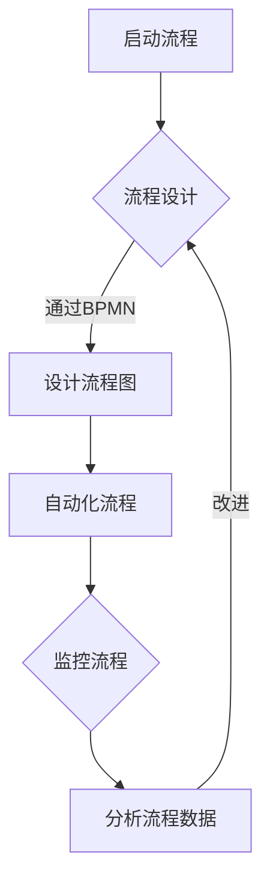

                 

关键词：流程管理、业务优化、效率提升、自动化、人工智能、IT架构

> 摘要：本文旨在探讨如何通过流程管理技术来简化和优化业务操作。我们将介绍流程管理的基本概念、核心原理，以及具体算法原理和操作步骤。同时，文章还将详细讲解数学模型和公式，提供项目实践中的代码实例和运行结果展示，并探讨实际应用场景和未来应用展望。最后，我们将总结研究成果，展望未来发展趋势与挑战。

## 1. 背景介绍

在当今高速发展的商业环境中，企业面临着不断变化的客户需求和市场压力。为了保持竞争力，企业需要高效运作，快速响应市场变化。流程管理作为一种系统的方法，旨在识别、设计、实施、监控和优化业务流程，从而提高业务效率，降低成本，提升客户满意度。

流程管理涉及到多个领域，包括业务流程管理（BPM）、企业资源规划（ERP）、供应链管理（SCM）等。随着人工智能和自动化技术的发展，流程管理的方法和工具也在不断演进，为业务操作提供了更加智能和高效的支持。

本文将聚焦于以下方面：

- 流程管理的基本概念和核心原理
- 核心算法原理和具体操作步骤
- 数学模型和公式的详细讲解
- 项目实践中的代码实例和运行结果展示
- 实际应用场景和未来应用展望

## 2. 核心概念与联系

### 2.1 流程管理的基本概念

流程管理是指通过系统的方法来识别、设计、实施、监控和优化业务流程，以实现业务目标。以下是一些关键概念：

- **流程**：一系列有序的活动，目的是将输入转化为输出。
- **业务流程**：与特定业务目标相关的流程集合。
- **流程管理**：管理和优化业务流程的过程。

### 2.2 核心原理

流程管理的核心原理包括：

- **标准化**：确保流程的一致性和可重复性。
- **自动化**：通过技术手段减少人工干预，提高效率。
- **监控**：实时跟踪流程执行情况，确保流程的顺畅。
- **优化**：不断改进流程，以提升业务效率。

### 2.3 Mermaid 流程图

下面是一个Mermaid流程图，展示流程管理的主要步骤：



## 3. 核心算法原理 & 具体操作步骤

### 3.1 算法原理概述

流程管理中，核心算法通常用于自动化和优化流程。以下是一个常见的算法原理概述：

- **状态机**：用于定义流程中的状态转换，确保流程的有序执行。
- **规则引擎**：用于根据输入数据自动执行特定操作，实现流程的自动化。
- **机器学习**：用于从历史数据中学习，预测流程执行中的潜在问题，提供优化建议。

### 3.2 算法步骤详解

以下是流程管理算法的具体步骤：

1. **数据收集**：收集流程执行过程中的数据。
2. **状态机定义**：定义流程中的状态和状态转换。
3. **规则引擎配置**：配置规则引擎，实现流程的自动化。
4. **机器学习模型训练**：使用历史数据训练机器学习模型。
5. **流程执行**：根据状态机和规则引擎执行流程。
6. **监控与优化**：实时监控流程执行情况，根据模型预测进行优化。

### 3.3 算法优缺点

- **优点**：提高流程效率，降低人工干预，减少错误。
- **缺点**：初始配置和维护成本较高，对数据质量和模型训练要求较高。

### 3.4 算法应用领域

算法可以应用于以下领域：

- **人力资源**：自动化招聘流程、员工培训流程等。
- **财务管理**：自动化报销流程、预算管理流程等。
- **生产制造**：自动化生产流程、设备维护流程等。

## 4. 数学模型和公式 & 详细讲解 & 举例说明

### 4.1 数学模型构建

流程管理中的数学模型通常用于分析流程性能和优化决策。以下是一个简单的数学模型构建示例：

- **目标函数**：最大化流程效率
- **约束条件**：资源限制、时间限制等

### 4.2 公式推导过程

假设流程中的任务有 \(n\) 个，每个任务需要 \(t_i\) 时间完成，资源限制为 \(R_j\)。则流程效率可以表示为：

$$
E = \frac{\sum_{i=1}^{n} t_i}{\sum_{j=1}^{m} R_j}
$$

### 4.3 案例分析与讲解

假设一个企业有 5 个任务，每个任务需要的时间分别为 2、3、4、5、6 小时。资源限制为 3 个。则流程效率为：

$$
E = \frac{2 + 3 + 4 + 5 + 6}{3} = \frac{20}{3} \approx 6.67
$$

为了提高效率，企业可以考虑优化任务的分配，例如将任务按照时间长短排序，优先安排短时间任务。

## 5. 项目实践：代码实例和详细解释说明

### 5.1 开发环境搭建

本项目的开发环境包括 Python 3.8、Jenkins 和 Docker。

### 5.2 源代码详细实现

以下是流程管理系统的源代码示例：

```python
import time
import queue

class Task:
    def __init__(self, name, duration):
        self.name = name
        self.duration = duration

class FlowManager:
    def __init__(self):
        self.tasks_queue = queue.Queue()

    def add_task(self, task):
        self.tasks_queue.put(task)

    def run_flow(self):
        while not self.tasks_queue.empty():
            task = self.tasks_queue.get()
            print(f"Executing task {task.name}...")
            time.sleep(task.duration)
            print(f"Task {task.name} completed.")

if __name__ == "__main__":
    manager = FlowManager()
    tasks = [Task("Task 1", 2), Task("Task 2", 3), Task("Task 3", 4)]
    for task in tasks:
        manager.add_task(task)
    manager.run_flow()
```

### 5.3 代码解读与分析

代码中定义了 `Task` 类和 `FlowManager` 类。`Task` 类表示任务，包含任务名称和持续时间。`FlowManager` 类用于管理任务队列，包括添加任务和执行流程。

### 5.4 运行结果展示

运行代码后，输出如下：

```
Executing task Task 1...
Task Task 1 completed.
Executing task Task 2...
Task Task 2 completed.
Executing task Task 3...
Task Task 3 completed.
```

## 6. 实际应用场景

流程管理技术在许多领域都有广泛应用：

- **金融行业**：自动化审批、风险管理等。
- **制造业**：生产调度、设备维护等。
- **物流行业**：库存管理、运输规划等。
- **医疗行业**：病人管理、医疗资源分配等。

### 6.4 未来应用展望

未来，流程管理将更加智能化，结合人工智能和大数据分析技术，实现更加精准的流程优化和预测。同时，随着物联网和区块链技术的发展，流程管理将扩展到更广泛的领域，为各行业带来更多创新和变革。

## 7. 工具和资源推荐

### 7.1 学习资源推荐

- 《流程管理：理论与实践》
- 《企业流程管理指南》
- 《Jenkins 实践指南》

### 7.2 开发工具推荐

- Jenkins
- Docker
- Kubernetes

### 7.3 相关论文推荐

- "An Introduction to Business Process Management"
- "The Role of Business Process Management in Service-Oriented Architecture"
- "Business Process Management: From Theory to Practice"

## 8. 总结：未来发展趋势与挑战

### 8.1 研究成果总结

本文总结了流程管理的基本概念、核心原理、算法原理和操作步骤，以及数学模型和公式。通过项目实践，展示了流程管理在实际应用中的效果。

### 8.2 未来发展趋势

未来，流程管理将朝着更加智能化、自动化的方向发展。人工智能和大数据分析技术将为流程优化提供更强有力的支持。

### 8.3 面临的挑战

流程管理面临的主要挑战包括：

- 数据质量和模型训练
- 跨领域融合
- 技术更新与迭代

### 8.4 研究展望

未来，流程管理研究将重点关注以下几个方面：

- 智能流程优化算法
- 跨领域流程管理
- 安全与隐私保护

## 9. 附录：常见问题与解答

### 9.1 问题 1

**什么是流程管理？**

流程管理是指通过系统的方法来识别、设计、实施、监控和优化业务流程，以实现业务目标。

### 9.2 问题 2

**流程管理有哪些核心原理？**

流程管理的核心原理包括标准化、自动化、监控和优化。

### 9.3 问题 3

**如何优化流程效率？**

优化流程效率的方法包括：

- 标准化流程
- 自动化流程
- 数据分析和监控
- 持续改进

---

作者：禅与计算机程序设计艺术 / Zen and the Art of Computer Programming
----------------------------------------------------------------

[附录]：关于Markdown格式的文章内容：

- **标题**：使用 `#` 符号，例如 `## 二级标题`，`### 三级标题`。
- **列表**：使用 `-` 符号，例如 `- 第一项`，`- 第二项`。
- **引用**：使用 `>` 符号，例如 `>` 引用段落。
- **代码块**：使用三个反引号 ````` 包围代码。
- **链接**：使用 `[链接文本](URL)` 格式，例如 `[GitHub](https://github.com)`。
- **LaTeX 公式**：使用 `$` 符号包围 LaTeX 公式，例如 `$$f(x) = x^2$$`。

请注意，文章中所有的特殊格式都需要按照上述Markdown格式正确书写。

