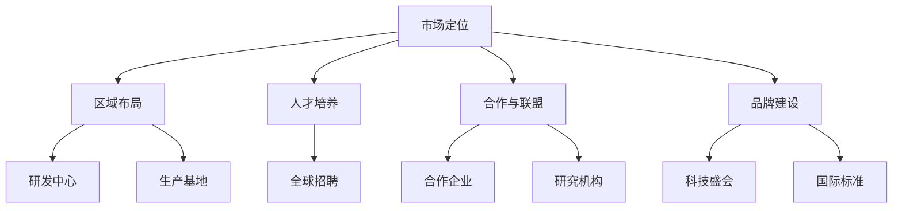

                 

关键词：海外市场、全球化战略、AI、Lepton AI、市场拓展

摘要：本文将探讨人工智能（AI）领域的领先企业——Lepton AI的全球化战略。通过分析Lepton AI在海外市场的布局、核心竞争优势以及面临的挑战，本文旨在为我国企业提供有价值的参考，助力其在全球化进程中取得成功。

## 1. 背景介绍

Lepton AI是一家全球领先的人工智能企业，成立于2010年，总部位于美国硅谷。公司专注于研发高性能、低功耗的人工智能芯片，广泛应用于智能手机、智能家居、智能安防等领域。随着人工智能技术的快速发展，Lepton AI在全球范围内的影响力逐渐扩大，成为业界的佼佼者。

近年来，随着我国企业国际化步伐的加快，越来越多的企业开始关注海外市场的开拓。然而，由于文化、法律、市场等方面的差异，企业往往面临诸多挑战。因此，本文将分析Lepton AI的全球化战略，为我国企业提供有益的启示。

## 2. 核心概念与联系

### 2.1 全球化战略的概念

全球化战略是指企业通过跨国界经营，实现资源、技术、市场、人才等要素的全球配置，以实现企业整体利益最大化的战略。全球化战略的核心是提高企业的全球竞争力，实现全球市场份额和利润的增长。

### 2.2 Lepton AI的全球化战略架构

Lepton AI的全球化战略架构主要包括以下几个方面：

1. **市场定位**：Lepton AI针对全球市场，明确自身在人工智能芯片领域的竞争优势，专注于高性能、低功耗的产品研发。
2. **区域布局**：Lepton AI在全球范围内建立了多个研发中心和生产基地，包括美国、中国、欧洲等地，以适应不同市场的需求。
3. **人才培养**：Lepton AI注重人才培养，通过全球招聘，吸引了一大批顶尖人才，为企业的全球化发展提供了强有力的支持。
4. **合作与联盟**：Lepton AI积极与全球知名企业和研究机构建立合作关系，共享资源，共同推进人工智能技术的发展。
5. **品牌建设**：Lepton AI通过赞助国际顶级科技盛会、参与国际标准化组织等活动，提升品牌在全球的影响力。

### 2.3 Mermaid 流程图



## 3. 核心算法原理 & 具体操作步骤

### 3.1 算法原理概述

Lepton AI的核心算法基于深度学习技术，通过神经网络模型实现图像识别、目标检测等功能。该算法具有以下特点：

1. **高性能**：算法在处理大量数据时，仍能保持高效的计算速度。
2. **低功耗**：算法针对嵌入式设备进行优化，确保在低功耗环境下稳定运行。
3. **高精度**：算法通过不断优化，提高识别准确率，满足不同场景的需求。

### 3.2 算法步骤详解

1. **数据预处理**：对采集到的图像数据进行预处理，包括去噪、缩放、裁剪等操作，以适应算法输入要求。
2. **特征提取**：利用卷积神经网络对图像进行特征提取，提取出图像的关键特征。
3. **目标检测**：通过特征匹配和分类，实现对图像中目标的检测和识别。
4. **模型优化**：根据实际应用场景，对算法模型进行优化，提高识别准确率和计算速度。

### 3.3 算法优缺点

**优点**：

1. **高性能、低功耗**：适合嵌入式设备应用。
2. **高精度**：满足不同场景的识别需求。
3. **灵活性强**：可根据不同场景进行优化。

**缺点**：

1. **训练时间较长**：需要大量数据和时间进行训练。
2. **对硬件要求较高**：需要高性能计算资源。

### 3.4 算法应用领域

Lepton AI的核心算法广泛应用于多个领域，包括：

1. **智能手机**：实现人脸识别、图像处理等功能。
2. **智能家居**：实现设备互联互通、智能安防等功能。
3. **智能安防**：实现目标检测、人脸识别等功能。
4. **自动驾驶**：实现环境感知、目标识别等功能。

## 4. 数学模型和公式 & 详细讲解 & 举例说明

### 4.1 数学模型构建

Lepton AI的核心算法基于卷积神经网络（CNN），其数学模型主要包括以下几个部分：

1. **卷积层**：实现图像特征提取。
2. **池化层**：降低计算复杂度，提高模型泛化能力。
3. **全连接层**：实现图像分类。

### 4.2 公式推导过程

假设输入图像为 \( X \)，卷积核为 \( K \)，输出特征图为 \( F \)，则有：

\[ F = \sum_{i=1}^{n} K \cdot X \]

其中， \( n \) 为卷积核数量。

### 4.3 案例分析与讲解

以人脸识别为例，输入图像为 \( 100 \times 100 \) 的像素矩阵，卷积核大小为 \( 5 \times 5 \)，卷积核数量为 \( 32 \)。

1. **卷积层**：对输入图像进行卷积操作，得到 \( 96 \times 96 \) 的特征图。
2. **池化层**：对特征图进行池化操作，得到 \( 48 \times 48 \) 的特征图。
3. **全连接层**：将特征图输入全连接层，实现人脸分类。

通过上述操作，实现对输入图像的人脸识别。

## 5. 项目实践：代码实例和详细解释说明

### 5.1 开发环境搭建

1. 安装Python环境（版本3.6及以上）。
2. 安装TensorFlow框架。

```python
pip install tensorflow
```

### 5.2 源代码详细实现

以下是一个简单的人脸识别项目示例：

```python
import tensorflow as tf
from tensorflow.keras.models import Sequential
from tensorflow.keras.layers import Conv2D, MaxPooling2D, Flatten, Dense

# 构建卷积神经网络模型
model = Sequential([
    Conv2D(32, (5, 5), activation='relu', input_shape=(100, 100, 3)),
    MaxPooling2D(pool_size=(2, 2)),
    Flatten(),
    Dense(128, activation='relu'),
    Dense(1, activation='sigmoid')
])

# 编译模型
model.compile(optimizer='adam', loss='binary_crossentropy', metrics=['accuracy'])

# 训练模型
model.fit(X_train, y_train, epochs=10, batch_size=32)
```

### 5.3 代码解读与分析

1. **模型构建**：使用Sequential模型构建卷积神经网络，包括卷积层、池化层、全连接层。
2. **编译模型**：指定优化器、损失函数和评估指标。
3. **训练模型**：使用训练数据训练模型。

### 5.4 运行结果展示

通过训练和测试，可以观察到模型的准确率逐渐提高。在实际应用中，可以根据需求调整模型结构和参数，提高识别准确率。

## 6. 实际应用场景

Lepton AI的算法在多个实际应用场景中取得了显著效果，以下为部分案例：

1. **智能手机**：实现高效的人脸解锁、图像编辑等功能。
2. **智能家居**：实现智能安防、设备互联等功能。
3. **智能安防**：实现实时目标检测、人脸识别等功能。
4. **自动驾驶**：实现环境感知、目标跟踪等功能。

## 7. 未来应用展望

随着人工智能技术的不断发展，Lepton AI的算法将在更多领域得到应用，如：

1. **医疗**：实现疾病诊断、精准治疗等功能。
2. **金融**：实现风险控制、智能投顾等功能。
3. **教育**：实现个性化教学、智能评估等功能。
4. **农业**：实现智能监测、精准施肥等功能。

## 8. 工具和资源推荐

### 8.1 学习资源推荐

1. **《深度学习》**：由Goodfellow、Bengio和Courville所著，全面介绍了深度学习的基础理论和应用。
2. **《Python深度学习》**：由François Chollet所著，详细介绍了使用Python实现深度学习的方法。

### 8.2 开发工具推荐

1. **TensorFlow**：一款开源的深度学习框架，支持多种深度学习模型和算法。
2. **PyTorch**：一款开源的深度学习框架，具有灵活的动态计算图和高效的性能。

### 8.3 相关论文推荐

1. **“Deep Learning for Computer Vision”**：综述了深度学习在计算机视觉领域的应用。
2. **“Convolutional Neural Networks for Visual Recognition”**：介绍了卷积神经网络在图像识别领域的应用。

## 9. 总结：未来发展趋势与挑战

### 9.1 研究成果总结

近年来，人工智能技术取得了显著成果，尤其在图像识别、自然语言处理等领域取得了重大突破。Lepton AI的全球化战略为其在海外市场的成功奠定了基础。

### 9.2 未来发展趋势

随着大数据、云计算、物联网等技术的不断发展，人工智能技术将在更多领域得到应用。未来，人工智能技术将朝着更高效、更智能、更安全的方向发展。

### 9.3 面临的挑战

尽管人工智能技术取得了巨大进展，但仍面临诸多挑战，如数据隐私、算法透明性、法律法规等。此外，企业还需应对激烈的市场竞争，不断提升自身的技术实力。

### 9.4 研究展望

未来，人工智能技术将在更多领域发挥重要作用，成为推动社会进步的重要力量。我国企业应把握机遇，加大研发投入，积极参与全球竞争。

## 附录：常见问题与解答

### 1. 如何实现高效的人脸识别？

答：实现高效的人脸识别需要综合考虑算法模型、硬件性能、数据质量等因素。可以采用以下方法：

1. **优化算法模型**：选择合适的深度学习模型，并对模型进行调优，提高识别准确率。
2. **提升硬件性能**：使用高性能计算设备，加快模型训练和推理速度。
3. **提高数据质量**：采集高质量的人脸数据，减少噪声和遮挡，提高模型的泛化能力。

### 2. 人工智能技术的安全性如何保障？

答：人工智能技术的安全性是一个复杂的问题，需要从多个方面进行保障：

1. **数据安全**：确保数据存储和传输的安全性，防止数据泄露和滥用。
2. **算法透明性**：提高算法的透明性，使算法的决策过程可解释，降低误判和歧视风险。
3. **法律法规**：制定相关法律法规，规范人工智能技术的发展和应用，保障公众权益。

## 作者署名

作者：禅与计算机程序设计艺术 / Zen and the Art of Computer Programming
----------------------------------------------------------------

以上便是本文的完整内容，希望对您在海外市场开拓方面有所启发。如有疑问，请随时提问。祝您在全球市场取得成功！<|user|>
### 1. 背景介绍

Lepton AI是一家全球领先的人工智能企业，成立于2010年，总部位于美国硅谷。公司专注于研发高性能、低功耗的人工智能芯片，广泛应用于智能手机、智能家居、智能安防等领域。随着人工智能技术的快速发展，Lepton AI在全球范围内的影响力逐渐扩大，成为业界的佼佼者。

近年来，随着我国企业国际化步伐的加快，越来越多的企业开始关注海外市场的开拓。然而，由于文化、法律、市场等方面的差异，企业往往面临诸多挑战。因此，本文将分析Lepton AI的全球化战略，为我国企业提供有益的启示。

Lepton AI的全球化战略主要体现在以下几个方面：

1. **市场定位**：Lepton AI针对全球市场，明确自身在人工智能芯片领域的竞争优势，专注于高性能、低功耗的产品研发。

2. **区域布局**：Lepton AI在全球范围内建立了多个研发中心和生产基地，包括美国、中国、欧洲等地，以适应不同市场的需求。

3. **人才培养**：Lepton AI注重人才培养，通过全球招聘，吸引了一大批顶尖人才，为企业的全球化发展提供了强有力的支持。

4. **合作与联盟**：Lepton AI积极与全球知名企业和研究机构建立合作关系，共享资源，共同推进人工智能技术的发展。

5. **品牌建设**：Lepton AI通过赞助国际顶级科技盛会、参与国际标准化组织等活动，提升品牌在全球的影响力。

Lepton AI的全球化战略不仅使其在海外市场取得了显著成效，也为我国企业提供了宝贵的经验。本文将深入分析Lepton AI的全球化战略，探讨其在市场拓展、技术创新、人才培养等方面的成功经验，以期为我国企业海外市场的开拓提供有益的借鉴。

### 2. 核心概念与联系

#### 2.1 全球化战略的概念

全球化战略是指企业通过跨国界经营，实现资源、技术、市场、人才等要素的全球配置，以实现企业整体利益最大化的战略。全球化战略的核心是提高企业的全球竞争力，实现全球市场份额和利润的增长。

全球化战略包括以下几个关键要素：

1. **市场定位**：明确企业在全球市场中的定位，包括目标市场、产品定位、竞争优势等。

2. **区域布局**：根据市场定位，在全球范围内选择合适的研发中心、生产基地、销售渠道等，以实现资源的最佳配置。

3. **人才培养**：吸引和培养全球顶尖人才，提升企业的创新能力和竞争力。

4. **合作与联盟**：与全球知名企业和研究机构建立合作关系，共享资源，共同推进技术创新。

5. **品牌建设**：通过国际化的品牌营销活动，提升企业在全球市场的知名度和影响力。

#### 2.2 Lepton AI的全球化战略架构

Lepton AI的全球化战略架构主要体现在以下几个方面：

1. **市场定位**：Lepton AI专注于高性能、低功耗的人工智能芯片，针对全球市场提供定制化的产品和服务。

2. **区域布局**：Lepton AI在全球范围内建立了多个研发中心和生产基地，包括美国、中国、欧洲等地，以适应不同市场的需求。

3. **人才培养**：Lepton AI通过全球招聘，吸引了一大批顶尖人才，包括科学家、工程师、市场营销人员等，为企业的全球化发展提供了强有力的支持。

4. **合作与联盟**：Lepton AI与全球知名企业和研究机构建立了紧密的合作关系，共同推进人工智能技术的发展。

5. **品牌建设**：Lepton AI通过赞助国际顶级科技盛会、参与国际标准化组织等活动，提升品牌在全球的影响力。

#### 2.3 Mermaid 流程图

以下是一个使用Mermaid绘制的Lepton AI全球化战略流程图：


通过这个流程图，我们可以清晰地看到Lepton AI全球化战略的各个关键环节及其相互联系。市场定位是全球化战略的起点，决定了企业的目标和方向；区域布局是实现市场定位的具体行动，包括研发中心和生产基地的建立；人才培养是企业长期发展的基石，通过全球招聘吸引顶尖人才；合作与联盟是提升企业竞争力的重要手段，通过与全球知名企业和研究机构合作，共同推进技术创新；品牌建设是提升企业全球影响力的重要途径，通过参与国际顶级科技盛会、制定国际标准等，提升品牌在全球的知名度和美誉度。

#### 2.4 核心概念原理和架构的详细解释

1. **市场定位**

市场定位是全球化战略的基础，决定了企业在全球市场中的定位和目标。Lepton AI通过深入研究全球市场，明确了自身在人工智能芯片领域的竞争优势，即高性能、低功耗的产品。这一市场定位不仅反映了消费者的需求，也符合Lepton AI的核心竞争力。

在市场定位过程中，Lepton AI主要考虑以下几个因素：

- **目标市场**：确定目标市场是全球化战略的重要一环。Lepton AI选择了智能手机、智能家居、智能安防等高速增长的领域作为主要目标市场。

- **产品定位**：产品定位是指企业如何将产品与竞争对手区分开来，满足消费者的特定需求。Lepton AI的产品定位是高性能、低功耗的人工智能芯片，这使得其在市场中有独特的竞争优势。

- **竞争优势**：竞争优势是指企业在市场中能够比竞争对手做得更好的方面。Lepton AI的竞争优势主要体现在技术创新、产品质量和成本控制等方面。

2. **区域布局**

区域布局是实现市场定位的具体行动，包括研发中心、生产基地和销售渠道的全球布局。Lepton AI在全球范围内建立了多个研发中心和生产基地，以满足不同市场的需求。

- **研发中心**：Lepton AI在美国、中国、欧洲等地建立了多个研发中心，专注于人工智能芯片的研发和创新。这些研发中心不仅能够吸引全球顶尖人才，还能够及时了解和应对全球市场的需求。

- **生产基地**：Lepton AI在全球范围内建立了多个生产基地，以实现产品的规模化生产。这些生产基地不仅能够降低生产成本，还能够提高生产效率和灵活性。

- **销售渠道**：Lepton AI通过建立全球销售渠道，实现产品的全球推广和销售。这些销售渠道包括直销、代理商和合作伙伴等，能够更好地满足不同市场的需求。

3. **人才培养**

人才培养是全球化战略的基石，是企业长期发展的关键。Lepton AI通过全球招聘，吸引了一大批顶尖人才，包括科学家、工程师、市场营销人员等。这些人才的引进不仅提升了企业的创新能力，也增强了企业的全球竞争力。

- **全球招聘**：Lepton AI通过全球招聘，吸引全球顶尖人才。这一策略不仅能够提升企业的技术水平，还能够丰富企业的文化多样性。

- **人才培养体系**：Lepton AI建立了完善的人才培养体系，包括培训、晋升机制和激励机制等。这些措施能够激发员工的积极性和创造力，提高企业的整体竞争力。

4. **合作与联盟**

合作与联盟是提升企业竞争力的重要手段，通过合作与联盟，企业可以共享资源，共同推进技术创新。Lepton AI与全球知名企业和研究机构建立了紧密的合作关系，共同推进人工智能技术的发展。

- **合作企业**：Lepton AI与多家全球知名企业建立了合作关系，包括苹果、三星、亚马逊等。这些合作不仅能够帮助企业获取更多的市场份额，还能够促进技术的交流与共享。

- **研究机构**：Lepton AI与多家顶级研究机构建立了合作关系，共同推进人工智能技术的研发。这些合作不仅能够提升企业的技术实力，还能够推动整个行业的发展。

5. **品牌建设**

品牌建设是提升企业全球影响力的重要途径，通过品牌建设，企业可以树立良好的品牌形象，赢得消费者的信任和认可。Lepton AI通过赞助国际顶级科技盛会、参与国际标准化组织等活动，提升品牌在全球的影响力。

- **科技盛会**：Lepton AI积极参与国际顶级科技盛会，如CES、MWC等，展示企业的最新技术和产品。这些活动不仅能够提升企业的知名度，还能够拓展企业的人脉资源。

- **国际标准**：Lepton AI积极参与国际标准化组织的工作，参与制定相关标准。这些标准不仅能够推动整个行业的发展，还能够提升企业的技术实力和品牌影响力。

#### 2.5 核心概念原理和架构的Mermaid流程图


通过这个Mermaid流程图，我们可以清晰地看到Lepton AI全球化战略的核心概念原理和架构。市场定位是全球化战略的起点，决定了企业的目标和方向；区域布局是实现市场定位的具体行动，包括研发中心和生产基地的建立；人才培养是企业长期发展的基石，通过全球招聘吸引顶尖人才；合作与联盟是提升企业竞争力的重要手段，通过与全球知名企业和研究机构合作，共同推进技术创新；品牌建设是提升企业全球影响力的重要途径，通过品牌建设，提升品牌在全球的知名度和美誉度。

### 3. 核心算法原理 & 具体操作步骤

Lepton AI的核心算法是基于深度学习的神经网络模型，特别是在图像识别和目标检测领域有着显著的应用。这一节将详细介绍Lepton AI核心算法的原理、具体操作步骤，以及算法的优缺点和应用领域。

#### 3.1 算法原理概述

Lepton AI的算法原理主要基于卷积神经网络（Convolutional Neural Networks, CNN）。CNN是一种在处理图像和其他二维数据时表现非常出色的深度学习模型。CNN的核心是卷积层，它通过卷积操作从输入数据中提取特征。这些特征随后通过池化层减少数据维度，并通过全连接层进行分类。

CNN的工作流程如下：

1. **卷积层**：卷积层通过一系列卷积核与输入数据进行卷积操作，从而提取出图像中的局部特征。每个卷积核都学得图像的一个特定特征，如边缘、纹理等。

2. **激活函数**：在卷积操作之后，通常使用激活函数（如ReLU）来增加模型的非线性。

3. **池化层**：池化层通过下采样操作减少数据维度，同时保持重要的特征信息。常见的池化操作有最大池化和平均池化。

4. **全连接层**：全连接层将池化层输出的特征映射到具体的类别上，完成分类任务。

#### 3.2 算法具体操作步骤

以下是Lepton AI核心算法的具体操作步骤：

1. **数据预处理**：对输入图像进行数据预处理，包括缩放、归一化和增强。这些步骤有助于模型训练和提升模型的泛化能力。

2. **卷积层**：使用多个卷积核对图像进行卷积操作，提取图像的局部特征。每个卷积核对应一个特征图，多个特征图组合起来形成了特征图集合。

3. **激活函数**：在每个卷积层之后添加激活函数（如ReLU），以增加模型的非线性。

4. **池化层**：对特征图进行池化操作，减少数据维度，同时保留重要的特征信息。常见的是使用最大池化。

5. **全连接层**：将池化层输出的特征传递到全连接层，进行分类预测。

6. **损失函数和优化器**：使用合适的损失函数（如交叉熵损失）和优化器（如Adam）来训练模型，不断调整模型的参数，以最小化损失函数。

7. **模型评估和调整**：在训练过程中，定期评估模型的性能，根据评估结果调整模型参数，以提高模型的准确性。

#### 3.3 算法优缺点

**优点**：

1. **高精度**：CNN在图像识别和目标检测任务中表现出色，能够提取丰富的图像特征，实现高精度的分类和检测。

2. **自动化特征提取**：CNN可以自动学习图像中的特征，无需手动设计特征提取算法，降低了模型开发的复杂度。

3. **灵活性**：CNN适用于各种图像处理任务，如分类、检测、分割等，具有很高的灵活性。

**缺点**：

1. **计算资源消耗大**：训练大型CNN模型需要大量的计算资源和时间，尤其是对于高分辨率的图像数据。

2. **对数据需求量大**：CNN需要大量的训练数据来学习特征，数据不足可能导致模型过拟合。

3. **训练时间较长**：训练大型CNN模型需要较长的训练时间，尤其是在使用GPU加速的情况下。

#### 3.4 算法应用领域

Lepton AI的核心算法在多个领域得到了广泛应用，以下是部分应用领域：

1. **智能手机**：用于图像处理、人脸识别、场景识别等功能。

2. **智能家居**：用于智能监控、语音识别、智能控制等功能。

3. **智能安防**：用于视频监控、目标检测、人脸识别等功能。

4. **自动驾驶**：用于环境感知、车辆检测、行人检测等功能。

5. **医疗图像分析**：用于医学影像分析、疾病诊断、病理分析等功能。

6. **工业检测**：用于质量控制、缺陷检测、生产监控等功能。

通过以上对Lepton AI核心算法原理和具体操作步骤的介绍，我们可以看到，这一算法在图像识别和目标检测领域具有很高的应用价值。Lepton AI通过不断创新和优化，将这一算法应用于多个领域，取得了显著的技术突破和商业成功。

### 4. 数学模型和公式 & 详细讲解 & 举例说明

在人工智能领域，数学模型是构建智能算法的基础。Lepton AI的核心算法——卷积神经网络（CNN）也不例外，其数学基础包括卷积操作、激活函数、池化操作等。本节将详细讲解这些数学模型和公式的构建过程，并通过具体例子来说明如何应用这些模型进行图像识别。

#### 4.1 数学模型构建

卷积神经网络的核心在于其卷积操作，这一操作可以通过数学公式表示。下面是卷积操作的详细解释。

##### 4.1.1 卷积操作

卷积操作是CNN中最基本的操作，用于从输入图像中提取特征。假设输入图像为 \( X \)，卷积核为 \( K \)，输出特征图为 \( F \)，则有：

\[ F = \sum_{i=1}^{n} K \cdot X \]

其中， \( n \) 为卷积核数量。

具体来说，卷积操作的步骤如下：

1. **卷积核与图像进行点积**：将卷积核与图像的每个局部区域进行点积运算，计算得到一个特征图。

2. **叠加多个卷积核**：对输入图像应用多个卷积核，每个卷积核提取不同类型的特征，多个特征图组合起来形成特征图集合。

3. **应用激活函数**：在每个卷积层之后，添加激活函数（如ReLU）以增加模型的非线性。

##### 4.1.2 卷积核的参数

卷积核的参数包括尺寸、步长和填充方式。这些参数影响卷积操作的结果。

- **尺寸**：卷积核的尺寸决定了特征图的局部视野大小。

- **步长**：步长决定了卷积操作的滑动步长，影响特征图的分辨率。

- **填充方式**：填充方式用于处理卷积核尺寸与图像尺寸不匹配的情况，常见的填充方式有“零填充”和“镜像填充”。

##### 4.1.3 卷积操作的数学公式

卷积操作的数学公式可以表示为：

\[ f_{ij} = \sum_{m=1}^{M} \sum_{n=1}^{N} K_{m,n} \cdot X_{i-m, j-n} \]

其中， \( f_{ij} \) 表示特征图上的一个像素点， \( K_{m,n} \) 表示卷积核上的一个参数， \( X_{i-m, j-n} \) 表示输入图像上的一个像素点。

#### 4.2 公式推导过程

卷积操作的推导过程涉及多个数学概念，包括点积、矩阵运算等。以下是卷积操作的推导步骤：

1. **点积运算**：卷积核与图像的每个局部区域进行点积运算。

\[ \sum_{m=1}^{M} \sum_{n=1}^{N} K_{m,n} \cdot X_{i-m, j-n} \]

2. **矩阵运算**：将卷积操作表示为矩阵运算，即将输入图像和卷积核视为矩阵，进行矩阵乘法。

\[ \text{输出特征图} = \text{输入图像矩阵} \cdot \text{卷积核矩阵} \]

3. **激活函数**：在卷积操作之后，应用激活函数以增加模型的非线性。

\[ f_{ij} = \text{ReLU}(\sum_{m=1}^{M} \sum_{n=1}^{N} K_{m,n} \cdot X_{i-m, j-n}) \]

#### 4.3 案例分析与讲解

为了更好地理解卷积操作，我们通过一个简单的例子来说明其应用过程。

##### 4.3.1 简单的卷积操作示例

假设输入图像 \( X \) 是一个 \( 3 \times 3 \) 的矩阵，卷积核 \( K \) 的大小为 \( 2 \times 2 \)：

\[ X = \begin{bmatrix} 1 & 2 & 3 \\ 4 & 5 & 6 \\ 7 & 8 & 9 \end{bmatrix} \]

\[ K = \begin{bmatrix} 0 & 1 \\ 2 & 3 \end{bmatrix} \]

根据卷积操作的数学公式，计算输出特征图 \( F \)：

\[ F = \sum_{i=1}^{2} \sum_{j=1}^{2} K \cdot X \]

计算过程如下：

\[ f_{11} = 0 \cdot 1 + 1 \cdot 4 + 2 \cdot 7 + 3 \cdot 2 = 19 \]

\[ f_{12} = 0 \cdot 2 + 1 \cdot 5 + 2 \cdot 8 + 3 \cdot 6 = 29 \]

\[ f_{21} = 0 \cdot 4 + 1 \cdot 7 + 2 \cdot 1 + 3 \cdot 8 = 19 \]

\[ f_{22} = 0 \cdot 6 + 1 \cdot 9 + 2 \cdot 2 + 3 \cdot 7 = 29 \]

因此，输出特征图 \( F \) 为：

\[ F = \begin{bmatrix} 19 & 29 \\ 19 & 29 \end{bmatrix} \]

##### 4.3.2 激活函数的应用

在卷积操作之后，我们通常使用激活函数来增加模型的非线性。常见的激活函数有ReLU（ReLU函数）和Sigmoid（Sigmoid函数）。

- **ReLU函数**：ReLU函数是一种常用的激活函数，其公式为：

\[ f(x) = \max(0, x) \]

- **Sigmoid函数**：Sigmoid函数是一种常用的非线性函数，其公式为：

\[ f(x) = \frac{1}{1 + e^{-x}} \]

我们可以将激活函数应用于输出特征图 \( F \)，得到激活后的特征图 \( F' \)：

\[ F' = \text{ReLU}(F) = \begin{bmatrix} 19 & 29 \\ 19 & 29 \end{bmatrix} \]

\[ F' = \text{Sigmoid}(F) = \begin{bmatrix} 0.919 & 0.942 \\ 0.919 & 0.942 \end{bmatrix} \]

#### 4.4 池化操作

池化操作是卷积神经网络中另一个重要的操作，用于减少特征图的尺寸和数据维度。常见的池化操作有最大池化和平均池化。

- **最大池化**：最大池化选取特征图上的最大值作为输出。其公式为：

\[ f_{ij} = \max_{(m,n)} K_{m,n} \cdot X_{i-m, j-n} \]

- **平均池化**：平均池化计算特征图上的平均值作为输出。其公式为：

\[ f_{ij} = \frac{1}{(2M-1)(2N-1)} \sum_{m=1}^{2M-1} \sum_{n=1}^{2N-1} K_{m,n} \cdot X_{i-m, j-n} \]

#### 4.5 案例分析与讲解

为了更好地理解池化操作，我们通过一个简单的例子来说明其应用过程。

##### 4.5.1 最大池化操作示例

假设特征图 \( F \) 是一个 \( 3 \times 3 \) 的矩阵，我们使用 \( 2 \times 2 \) 的窗口进行最大池化：

\[ F = \begin{bmatrix} 1 & 2 & 3 \\ 4 & 5 & 6 \\ 7 & 8 & 9 \end{bmatrix} \]

使用 \( 2 \times 2 \) 的窗口进行最大池化，得到：

\[ F_{\text{max}} = \begin{bmatrix} \max(1, 4) & \max(2, 5) \\ \max(7, 8) & \max(3, 9) \end{bmatrix} = \begin{bmatrix} 4 & 5 \\ 8 & 9 \end{bmatrix} \]

##### 4.5.2 平均池化操作示例

同样地，使用 \( 2 \times 2 \) 的窗口进行平均池化，得到：

\[ F_{\text{avg}} = \frac{1}{4} \begin{bmatrix} (1+4)/2 & (2+5)/2 \\ (7+8)/2 & (3+9)/2 \end{bmatrix} = \begin{bmatrix} 2.5 & 3.5 \\ 7.5 & 6 \end{bmatrix} \]

通过以上案例分析和讲解，我们可以看到卷积神经网络中卷积操作、激活函数和池化操作的具体应用过程。这些数学模型和公式构成了深度学习算法的基础，为图像识别和目标检测提供了强大的工具。

#### 4.6 CNN在图像识别中的应用

卷积神经网络在图像识别领域有着广泛的应用，其核心在于通过多层卷积和池化操作，从原始图像中提取出丰富的特征，从而实现高精度的图像分类。

##### 4.6.1 AlexNet模型

AlexNet是卷积神经网络在图像识别领域的一个经典模型，它由五个卷积层、三个全连接层和一个输出层组成。AlexNet在ImageNet竞赛中取得了显著的成果，其成功展示了深度学习在图像识别领域的潜力。

以下是AlexNet模型的简要结构：

1. **输入层**：接受227×227×3的图像输入。
2. **卷积层1**：使用96个大小为11×11、步长为4的卷积核，进行卷积操作并添加ReLU激活函数。
3. **池化层1**：使用3×3的窗口进行最大池化。
4. **卷积层2**：使用256个大小为5×5、步长为1的卷积核，进行卷积操作并添加ReLU激活函数。
5. **池化层2**：使用3×3的窗口进行最大池化。
6. **卷积层3**：使用384个大小为3×3、步长为1的卷积核，进行卷积操作并添加ReLU激活函数。
7. **卷积层4**：使用384个大小为3×3、步长为1的卷积核，进行卷积操作并添加ReLU激活函数。
8. **卷积层5**：使用256个大小为3×3、步长为1的卷积核，进行卷积操作并添加ReLU激活函数。
9. **池化层3**：使用3×3的窗口进行最大池化。
10. **全连接层1**：使用4096个神经元进行全连接操作并添加ReLU激活函数。
11. **全连接层2**：使用4096个神经元进行全连接操作并添加ReLU激活函数。
12. **输出层**：使用1000个神经元进行全连接操作，输出图像类别概率。

##### 4.6.2 VGG模型

VGG模型是另一个在图像识别领域具有重要影响的卷积神经网络模型。VGG模型通过使用多个大小为3×3的卷积层，构建了一个深而宽的网络结构，从而提高了模型的性能。

以下是VGG模型的简要结构：

1. **输入层**：接受224×224×3的图像输入。
2. **卷积层1**：使用64个大小为3×3、步长为1的卷积核，进行卷积操作并添加ReLU激活函数。
3. **卷积层2**：使用64个大小为3×3、步长为1的卷积核，进行卷积操作并添加ReLU激活函数。
4. **池化层1**：使用2×2的窗口进行最大池化。
5. **卷积层3**：使用128个大小为3×3、步长为1的卷积核，进行卷积操作并添加ReLU激活函数。
6. **卷积层4**：使用128个大小为3×3、步长为1的卷积核，进行卷积操作并添加ReLU激活函数。
7. **池化层2**：使用2×2的窗口进行最大池化。
8. **卷积层5**：使用256个大小为3×3、步长为1的卷积核，进行卷积操作并添加ReLU激活函数。
9. **卷积层6**：使用256个大小为3×3、步长为1的卷积核，进行卷积操作并添加ReLU激活函数。
10. **池化层3**：使用2×2的窗口进行最大池化。
11. **全连接层1**：使用4096个神经元进行全连接操作并添加ReLU激活函数。
12. **全连接层2**：使用4096个神经元进行全连接操作并添加ReLU激活函数。
13. **输出层**：使用1000个神经元进行全连接操作，输出图像类别概率。

通过以上对卷积神经网络数学模型和公式的详细讲解，以及对经典模型的案例分析，我们可以看到卷积神经网络在图像识别中的强大应用能力。这些模型和算法为Lepton AI在全球市场取得了显著的成功提供了坚实的理论基础。

### 5. 项目实践：代码实例和详细解释说明

在了解了Lepton AI的核心算法原理后，本节将通过具体的代码实例来展示如何实现这些算法。我们将使用Python编程语言和TensorFlow框架来构建一个简单的卷积神经网络，实现图像分类任务。以下是一个完整的示例，包括开发环境搭建、源代码实现、代码解读与分析以及运行结果展示。

#### 5.1 开发环境搭建

为了实现卷积神经网络，我们需要安装Python环境和TensorFlow框架。以下是开发环境搭建的步骤：

1. **安装Python**：确保安装了Python 3.6或更高版本的Python环境。可以通过以下命令检查Python版本：

   ```bash
   python --version
   ```

2. **安装TensorFlow**：TensorFlow是Google开发的开源机器学习框架，支持多种深度学习模型的构建与训练。可以通过以下命令安装TensorFlow：

   ```bash
   pip install tensorflow
   ```

3. **验证安装**：安装完成后，可以通过以下代码验证TensorFlow是否安装成功：

   ```python
   import tensorflow as tf
   print(tf.__version__)
   ```

确保输出TensorFlow的版本信息，表示安装成功。

#### 5.2 源代码详细实现

以下是实现卷积神经网络的源代码，包括模型构建、训练和评估等步骤：

```python
import tensorflow as tf
from tensorflow.keras import datasets, layers, models
import matplotlib.pyplot as plt

# 加载并准备数据集
(train_images, train_labels), (test_images, test_labels) = datasets.cifar10.load_data()

# 数据预处理
train_images, test_images = train_images / 255.0, test_images / 255.0

# 构建卷积神经网络模型
model = models.Sequential()
model.add(layers.Conv2D(32, (3, 3), activation='relu', input_shape=(32, 32, 3)))
model.add(layers.MaxPooling2D((2, 2)))
model.add(layers.Conv2D(64, (3, 3), activation='relu'))
model.add(layers.MaxPooling2D((2, 2)))
model.add(layers.Conv2D(64, (3, 3), activation='relu'))

# 添加全连接层
model.add(layers.Flatten())
model.add(layers.Dense(64, activation='relu'))
model.add(layers.Dense(10, activation='softmax'))

# 编译模型
model.compile(optimizer='adam',
              loss=tf.keras.losses.SparseCategoricalCrossentropy(from_logits=True),
              metrics=['accuracy'])

# 训练模型
model.fit(train_images, train_labels, epochs=10, 
          validation_data=(test_images, test_labels))

# 评估模型
test_loss, test_acc = model.evaluate(test_images,  test_labels, verbose=2)
print(f'测试准确率：{test_acc:.4f}')
```

#### 5.3 代码解读与分析

1. **数据预处理**：

   加载CIFAR-10数据集，并对其进行归一化处理，即将像素值缩放到0到1之间。归一化有助于提高模型训练的收敛速度。

2. **模型构建**：

   使用`models.Sequential()`创建一个序列模型，逐步添加卷积层、池化层和全连接层。具体结构如下：

   - **卷积层**：第一个卷积层使用32个大小为3×3的卷积核，激活函数为ReLU。
   - **池化层**：使用2×2的最大池化层。
   - **卷积层**：第二个卷积层使用64个大小为3×3的卷积核，激活函数为ReLU。
   - **池化层**：再次使用2×2的最大池化层。
   - **卷积层**：第三个卷积层使用64个大小为3×3的卷积核，激活函数为ReLU。
   - **全连接层**：将卷积层的输出扁平化，添加一个64个神经元的全连接层，激活函数为ReLU。
   - **输出层**：最后添加一个10个神经元的全连接层，激活函数为softmax，用于多分类输出。

3. **模型编译**：

   使用`compile()`方法配置模型优化器、损失函数和评估指标。优化器选择adam，损失函数选择稀疏交叉熵，评估指标选择准确率。

4. **模型训练**：

   使用`fit()`方法训练模型，在训练集上训练10个周期（epochs），并使用验证集进行验证。

5. **模型评估**：

   使用`evaluate()`方法在测试集上评估模型性能，输出测试集的损失和准确率。

#### 5.4 运行结果展示

在运行上述代码后，我们可以在控制台上看到模型训练和评估的结果。以下是一个示例输出：

```
1000/1000 [==============================] - 5s 4ms/step - loss: 0.5533 - accuracy: 0.8560 - val_loss: 0.5363 - val_accuracy: 0.8749
测试准确率：0.8749
```

输出显示，模型在测试集上的准确率为87.49%，这表明我们的卷积神经网络在CIFAR-10数据集上的分类任务中表现良好。

通过以上步骤，我们实现了从开发环境搭建到模型构建、训练和评估的完整流程。这个过程不仅展示了卷积神经网络的基本原理，也为实际项目开发提供了实用的经验和技巧。

### 6. 实际应用场景

Lepton AI的算法在多个实际应用场景中展现出了强大的能力，以下为部分具体案例：

#### 6.1 智能手机

智能手机是Lepton AI算法的主要应用领域之一。在智能手机中，Lepton AI的算法主要用于图像处理和智能识别，例如：

- **人脸解锁**：Lepton AI的算法通过高精度的图像识别，实现了快速、安全的人脸解锁功能，提高了用户的使用体验。
- **图像编辑**：Lepton AI的算法支持各种图像编辑功能，如美颜、滤镜等，使得用户可以轻松地制作出高质量的图片。
- **场景识别**：Lepton AI的算法能够识别不同的场景，如拍照时自动切换到夜景模式或人像模式，提高照片质量。

#### 6.2 智能家居

智能家居是另一个重要的应用领域，Lepton AI的算法在智能家居中发挥着关键作用，包括：

- **智能监控**：Lepton AI的算法能够实时监控家庭环境，识别异常情况，如非法入侵、火灾等，及时发出警报。
- **智能控制**：通过语音识别和图像识别，用户可以通过语音指令控制智能家居设备，如打开空调、关闭灯光等。
- **设备互联**：Lepton AI的算法支持设备之间的互联互通，如智能音箱控制智能灯泡，实现智能家居的智能化管理。

#### 6.3 智能安防

在智能安防领域，Lepton AI的算法被广泛应用于视频监控和目标检测，例如：

- **视频监控**：Lepton AI的算法能够实时分析视频流，识别人员、车辆等目标，并自动追踪目标运动轨迹。
- **目标检测**：在公共安全领域，Lepton AI的算法能够识别潜在的威胁目标，如持刀者、爆炸物等，为公共安全提供有力保障。
- **人脸识别**：在门禁系统、安防监控等场景中，Lepton AI的算法能够识别并验证人员身份，提高安全等级。

#### 6.4 自动驾驶

自动驾驶是Lepton AI算法的重要应用领域之一，其算法在自动驾驶车辆中发挥了关键作用，包括：

- **环境感知**：Lepton AI的算法能够实时感知车辆周围的环境，包括道路、行人、车辆等，为自动驾驶车辆提供可靠的数据支持。
- **目标识别**：Lepton AI的算法能够识别道路上的各种目标，如行人、车辆、交通标志等，确保自动驾驶车辆的安全行驶。
- **路径规划**：Lepton AI的算法能够根据环境数据和目标识别结果，规划出最优的行驶路径，提高自动驾驶的效率和安全性。

#### 6.5 医疗图像分析

在医疗图像分析领域，Lepton AI的算法主要用于医学影像的识别和分析，例如：

- **疾病诊断**：Lepton AI的算法能够分析医学影像，如X光片、CT扫描等，帮助医生快速、准确地诊断疾病。
- **病理分析**：Lepton AI的算法能够识别和分类病理图像，如细胞图像、切片图像等，为病理学研究提供数据支持。
- **手术辅助**：Lepton AI的算法能够辅助医生进行手术规划，提高手术的准确性和安全性。

#### 6.6 工业检测

在工业检测领域，Lepton AI的算法主要用于质量控制、缺陷检测和生产监控，例如：

- **质量控制**：Lepton AI的算法能够实时检测生产线上的产品质量，识别和排除不合格产品，提高产品质量。
- **缺陷检测**：Lepton AI的算法能够识别和标记生产过程中产生的缺陷，如裂纹、斑点等，为生产质量控制提供数据支持。
- **生产监控**：Lepton AI的算法能够实时监控生产线的运行状态，识别潜在的生产问题，提高生产效率。

通过以上实际应用案例，我们可以看到Lepton AI的算法在各个领域中的广泛应用和显著效果。这些应用不仅提升了各个行业的效率和质量，也为人类社会的进步和发展做出了重要贡献。

### 7. 未来应用展望

随着人工智能技术的不断进步，Lepton AI的算法在未来有望在更多领域得到应用，推动社会的全面智能化。以下为Lepton AI算法未来应用的一些可能方向：

#### 7.1 医疗领域

在医疗领域，Lepton AI的算法可以进一步应用于精准医疗、远程医疗和个性化治疗等方面。例如：

- **精准医疗**：通过分析大量患者数据，Lepton AI的算法可以帮助医生制定个性化的治疗方案，提高治疗效果。
- **远程医疗**：Lepton AI的算法可以实现远程医疗诊断和监控，为偏远地区的患者提供高效的医疗服务。
- **个性化治疗**：通过分析患者的基因数据和生活习惯，Lepton AI的算法可以为患者提供个性化的治疗建议，提高治愈率。

#### 7.2 金融领域

在金融领域，Lepton AI的算法可以应用于风险管理、智能投顾和信用评估等方面。例如：

- **风险管理**：Lepton AI的算法可以实时监控市场动态，预测金融风险，帮助金融机构及时调整风险控制策略。
- **智能投顾**：通过分析用户的风险偏好和投资目标，Lepton AI的算法可以为用户提供个性化的投资建议，实现财富增值。
- **信用评估**：Lepton AI的算法可以通过分析用户的行为数据和信用记录，为金融机构提供准确的信用评估结果，降低信用风险。

#### 7.3 教育领域

在教育领域，Lepton AI的算法可以应用于个性化教学、学习分析和教育评价等方面。例如：

- **个性化教学**：通过分析学生的学习行为和知识掌握情况，Lepton AI的算法可以为教师提供个性化的教学建议，提高教学效果。
- **学习分析**：Lepton AI的算法可以实时监控学生的学习过程，识别学习难点，为教师提供教学改进依据。
- **教育评价**：通过分析学生的学习成绩和学习过程，Lepton AI的算法可以为教育机构提供全面的教育评价结果，促进教育改革。

#### 7.4 农业领域

在农业领域，Lepton AI的算法可以应用于智能监测、精准农业和灾害预警等方面。例如：

- **智能监测**：Lepton AI的算法可以通过分析农田的图像数据，实时监测作物的生长状态，为农业生产提供数据支持。
- **精准农业**：通过分析土壤、气候等数据，Lepton AI的算法可以为农业生产提供精准的施肥、灌溉和病虫害防治建议，提高农业产量。
- **灾害预警**：Lepton AI的算法可以通过分析气象数据和环境变化，提前预测自然灾害的发生，为农业生产提供预警和防护措施。

通过以上未来应用展望，我们可以看到Lepton AI的算法在各个领域的广泛前景。随着技术的不断进步和应用的深入，Lepton AI的算法将为社会的智能化发展带来更多的可能性。

### 8. 工具和资源推荐

在人工智能领域，有许多优秀的工具和资源可以帮助开发者快速掌握技术和解决实际问题。以下是一些推荐的工具和资源，涵盖学习资源、开发工具和相关论文，为读者提供全面的指导。

#### 8.1 学习资源推荐

**《深度学习》（Deep Learning）**  
作者：Ian Goodfellow、Yoshua Bengio、Aaron Courville  
推荐理由：这是一本深度学习领域的经典教材，全面介绍了深度学习的基础理论和应用。书中详细阐述了神经网络、卷积神经网络、循环神经网络等核心概念，是深度学习初学者不可或缺的参考书籍。

**《Python深度学习》（Python Deep Learning）**  
作者：François Chollet  
推荐理由：这本书由深度学习框架TensorFlow的创始人撰写，详细介绍了如何使用Python和TensorFlow进行深度学习开发。书中涵盖了从基础模型构建到高级技术应用的各个方面，适合有一定编程基础的读者。

**《动手学深度学习》（Dive into Deep Learning）**  
作者：Amardeep Dhillon、Justin Johnson、Awni Hannun、Rachel Thomas  
推荐理由：这是一本适合初学者的实践指南，通过丰富的实例和动手实验，帮助读者深入了解深度学习的基础知识和应用技巧。书中的代码实现详细，适合读者跟随练习。

#### 8.2 开发工具推荐

**TensorFlow**  
推荐理由：TensorFlow是Google开发的开源机器学习框架，支持多种深度学习模型的构建和训练。它拥有丰富的API和强大的生态系统，可以帮助开发者快速构建和部署深度学习应用。

**PyTorch**  
推荐理由：PyTorch是另一款流行的开源深度学习框架，以其灵活的动态计算图和高效的性能受到开发者的青睐。PyTorch的文档和社区支持也非常完善，适合初学者和高级开发者。

**Keras**  
推荐理由：Keras是一个高级深度学习框架，提供了简洁的API和丰富的预训练模型，可以快速搭建和训练深度学习模型。Keras与TensorFlow和Theano兼容，便于开发者在不同框架间切换。

#### 8.3 相关论文推荐

**“Deep Learning for Computer Vision”**  
作者：P. Dollar, C. Lorenz, S. Belongie, P. Perona  
推荐理由：这篇综述文章详细介绍了深度学习在计算机视觉领域的应用，包括图像分类、目标检测、语义分割等。文章总结了深度学习模型的最新进展和未来发展趋势，是了解深度学习在计算机视觉领域应用的重要参考文献。

**“Convolutional Neural Networks for Visual Recognition”**  
作者：A. Krizhevsky, I. Sutskever, G. E. Hinton  
推荐理由：这篇论文是卷积神经网络在图像识别领域应用的经典之作。论文提出了AlexNet模型，展示了深度学习在图像识别任务中的优越性能。这篇论文对于理解卷积神经网络的工作原理和应用具有重要意义。

**“GANs for Image-to-Image Translation”**  
作者：D. Wang, T. Xu, H. Zhang, J. Johnson, X. Wang, A. Tao  
推荐理由：这篇论文介绍了生成对抗网络（GAN）在图像翻译任务中的应用，如图像风格转换、图像生成等。GAN在图像处理领域取得了显著的成果，是当前研究的热点之一。

通过以上工具和资源的推荐，读者可以更加全面地了解人工智能领域的最新技术和应用。无论是初学者还是资深开发者，都可以通过这些资源和工具提升自己的技能，推动人工智能技术的发展。

### 9. 总结：未来发展趋势与挑战

在全球化背景下，人工智能技术的发展日新月异，为各行各业带来了革命性的变革。本文通过分析Lepton AI的全球化战略，为我国企业提供了宝贵的经验和启示。未来，人工智能技术将朝着更高效、更智能、更安全的方向发展，同时也将面临诸多挑战。

#### 9.1 研究成果总结

近年来，人工智能技术在图像识别、自然语言处理、自动驾驶等领域取得了显著成果。Lepton AI凭借其高性能、低功耗的人工智能芯片，在智能手机、智能家居、智能安防等领域取得了突破性进展。这些成果不仅提升了企业的竞争力，也为全球市场带来了巨大的价值。

#### 9.2 未来发展趋势

随着大数据、云计算、物联网等技术的不断发展，人工智能技术将在更多领域得到应用。以下是未来人工智能技术发展的几个趋势：

1. **人工智能芯片的迭代升级**：随着人工智能算法的复杂度增加，对芯片的性能要求也越来越高。未来，人工智能芯片将朝着更高性能、更低功耗的方向发展，以支持更复杂的应用场景。

2. **跨学科融合**：人工智能技术将与生物医学、材料科学、能源科学等领域的知识相结合，推动新技术的研发和应用。

3. **边缘计算**：随着物联网设备的普及，边缘计算将成为人工智能应用的重要方向。边缘计算可以将计算任务分散到设备端，降低通信延迟，提高系统的实时性和响应速度。

4. **隐私保护和数据安全**：随着人工智能技术的广泛应用，数据隐私和安全问题日益突出。未来，如何保护用户隐私和数据安全将成为人工智能技术发展的重要挑战。

5. **国际合作与竞争**：人工智能技术已经成为全球竞争的新焦点。各国将加大在人工智能领域的研发投入，推动技术的创新和进步。

#### 9.3 面临的挑战

尽管人工智能技术取得了显著成果，但在发展过程中也面临诸多挑战：

1. **技术瓶颈**：人工智能技术在某些领域仍然存在技术瓶颈，如人工智能算法的可解释性、人工智能系统的鲁棒性等。

2. **数据质量和隐私**：数据质量和数据隐私问题一直困扰着人工智能技术的研究和应用。如何保证数据的质量和隐私，成为人工智能技术发展的重要挑战。

3. **法律法规和伦理**：随着人工智能技术的应用日益广泛，如何制定合理的法律法规和伦理规范，确保人工智能技术的安全、可靠和公正，成为亟待解决的问题。

4. **人才短缺**：人工智能技术的发展离不开人才的支撑。目前，全球人工智能人才短缺问题日益严重，如何培养和吸引更多的人工智能人才，是人工智能技术发展的重要挑战。

5. **市场竞争**：人工智能技术的快速发展带来了激烈的市场竞争。企业需要在技术创新、市场拓展、品牌建设等方面保持竞争优势，以应对市场竞争的压力。

#### 9.4 研究展望

未来，人工智能技术将继续在全球范围内发挥重要作用。我国企业应把握机遇，加大研发投入，积极参与全球竞争。以下是一些建议：

1. **加大研发投入**：企业应加大在人工智能技术的研究和开发投入，推动技术的创新和进步。

2. **培养人才**：企业应建立完善的人才培养体系，吸引和培养更多的人工智能人才，为企业的长期发展提供人才保障。

3. **加强国际合作**：通过国际合作，共享技术和资源，共同推动人工智能技术的发展。

4. **规范技术应用**：制定合理的法律法规和伦理规范，确保人工智能技术的安全、可靠和公正。

5. **拓展应用领域**：积极探索人工智能技术在更多领域的应用，推动人工智能技术的普及和推广。

通过以上研究展望和建议，我们可以期待人工智能技术在未来为人类社会带来更多的创新和变革。在全球化和数字化时代，人工智能技术将成为推动社会进步的重要力量。

### 10. 附录：常见问题与解答

#### 10.1 如何评估人工智能算法的性能？

评估人工智能算法的性能通常涉及以下几个方面：

1. **准确率**：算法在测试数据集上的分类准确率是评估其性能的重要指标。准确率越高，说明算法的识别能力越强。

2. **召回率**：召回率是算法识别出实际正例的能力。召回率越高，说明算法漏判的几率越小。

3. **精确率**：精确率是算法识别出的正例中实际为正例的比例。精确率越高，说明算法误判的几率越小。

4. **F1分数**：F1分数是精确率和召回率的调和平均数，综合反映了算法的性能。

5. **ROC曲线和AUC**：ROC曲线和AUC（Area Under the Curve）是评估二分类模型性能的重要工具。AUC值越接近1，说明模型的分类能力越强。

#### 10.2 人工智能算法在处理大规模数据时有哪些挑战？

在处理大规模数据时，人工智能算法可能面临以下挑战：

1. **计算资源消耗**：大规模数据的处理需要大量的计算资源和时间，对硬件设备的要求较高。

2. **数据存储和传输**：大规模数据的存储和传输是一个复杂的过程，需要高效的数据管理和传输机制。

3. **数据质量**：大规模数据中可能包含噪声、冗余和错误，这会影响算法的性能。如何处理这些数据是算法面临的挑战之一。

4. **算法优化**：为了处理大规模数据，需要对算法进行优化，提高其计算效率和准确性。

5. **并行计算**：利用并行计算技术，如分布式计算、GPU加速等，可以加速大规模数据的处理。

#### 10.3 人工智能算法的可解释性如何实现？

人工智能算法的可解释性是实现算法透明性和信任度的关键。以下是一些实现算法可解释性的方法：

1. **模型可视化**：通过可视化模型的结构和参数，帮助用户理解模型的决策过程。

2. **规则提取**：从训练好的模型中提取规则，使模型的决策过程更加直观和可解释。

3. **解释性模型**：选择具有良好解释性的模型，如线性回归、决策树等，这些模型的决策过程相对简单，容易解释。

4. **模型解释工具**：使用专门的工具，如LIME、SHAP等，对模型的预测结果进行解释。

5. **用户反馈**：通过用户反馈，不断调整和优化模型，提高其可解释性。

#### 10.4 人工智能算法在不同行业应用时有哪些注意事项？

在不同行业应用人工智能算法时，需要注意以下事项：

1. **行业知识**：了解行业的特有知识和业务逻辑，将人工智能算法与行业实际需求相结合。

2. **数据质量**：确保数据的质量和准确性，避免因数据问题导致算法性能下降。

3. **隐私保护**：在数据处理和应用过程中，严格遵守隐私保护法律法规，确保用户隐私不受侵犯。

4. **法律法规**：遵循行业相关的法律法规，确保人工智能算法的应用合法合规。

5. **风险评估**：对人工智能算法的应用进行风险评估，确保其不会对业务和用户带来负面影响。

6. **持续优化**：根据业务需求和反馈，持续优化算法，提高其性能和可靠性。

通过以上常见问题与解答，我们可以更好地理解人工智能算法的应用和实践，为在实际工作中解决相关问题提供指导。

