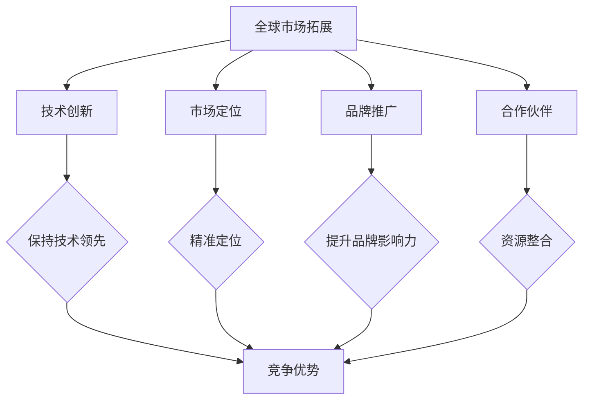

                 

关键词：海外市场，AI全球化，战略，Lepton AI，国际扩张，市场拓展，国际竞争，技术创新，市场定位，品牌推广，合作伙伴

## 摘要

在全球化浪潮的推动下，人工智能（AI）作为一项具有变革性的技术，正在成为各国企业和政府竞相发展的焦点。本文以Lepton AI为例，探讨了AI企业在海外市场开拓中面临的机会与挑战，并详细分析了其全球化战略的实施路径。通过对Lepton AI在技术、市场、品牌和合作伙伴等方面的策略研究，本文为其他AI企业提供了一些建设性的参考和启示。

## 1. 背景介绍

### 1.1 全球化趋势与AI技术发展

全球化进程的加速，使得各国之间的经济、文化和科技交流日益频繁。在这个背景下，人工智能技术作为现代科技的先锋，受到了前所未有的关注。AI技术在自然语言处理、计算机视觉、智能决策等领域取得了显著进展，逐渐渗透到各行各业，推动了产业升级和经济增长。

### 1.2 Lepton AI概述

Lepton AI成立于2015年，是一家专注于人工智能应用解决方案的创新公司。公司总部位于美国，其核心业务包括智能语音识别、计算机视觉和自然语言处理等。Lepton AI凭借其领先的技术和创新的商业模式，在短时间内赢得了市场的认可，并成功开拓了多个国际市场。

## 2. 核心概念与联系

为了更好地理解Lepton AI的全球化战略，我们首先需要了解几个核心概念：

### 2.1 全球市场拓展

全球市场拓展指的是企业在全球范围内寻找并开发新市场，以实现业务增长和全球化布局。对于AI企业来说，全球市场拓展不仅包括新兴市场，还包括发达国家市场。

### 2.2 技术创新

技术创新是AI企业全球化战略的关键因素。Lepton AI在语音识别、计算机视觉等领域不断推陈出新，以保持技术领先地位，从而在海外市场中获得竞争优势。

### 2.3 市场定位

市场定位是企业根据自身产品特点、竞争对手和目标用户群体，确定其在市场中的位置和形象。Lepton AI通过精准的市场定位，在全球范围内吸引了大量潜在客户。

### 2.4 品牌推广

品牌推广是提高企业知名度、建立品牌形象的重要手段。Lepton AI通过参加国际展会、发布白皮书和合作案例等方式，在全球范围内推广品牌，增强市场影响力。

### 2.5 合作伙伴

合作伙伴是企业在海外市场拓展中不可或缺的资源。Lepton AI通过与国内外知名企业、研究机构和投资机构的合作，为全球化战略提供了有力支持。

### 2.6 Mermaid流程图



## 3. 核心算法原理 & 具体操作步骤

### 3.1 算法原理概述

Lepton AI的核心算法主要包括语音识别、计算机视觉和自然语言处理等技术。这些算法通过深度学习、神经网络等先进技术，实现了对大规模数据的处理和分析，从而为用户提供精准、高效的智能服务。

### 3.2 算法步骤详解

#### 3.2.1 语音识别

语音识别算法主要包括以下几个步骤：

1. 声音信号采集：通过麦克风等设备采集用户的语音信号。
2. 预处理：对采集到的语音信号进行降噪、去噪等处理，提高信号质量。
3. 分帧：将处理后的语音信号分成多个帧。
4. 特征提取：对每个帧进行特征提取，如频谱分析、梅尔频率倒谱系数（MFCC）等。
5. 神经网络训练：使用大量的语音数据对神经网络进行训练，使其学会识别不同的语音特征。
6. 结果输出：将处理后的语音信号与训练好的模型进行比对，输出识别结果。

#### 3.2.2 计算机视觉

计算机视觉算法主要包括以下几个步骤：

1. 图像采集：通过摄像头等设备采集目标图像。
2. 预处理：对采集到的图像进行去噪、增强等处理，提高图像质量。
3. 特征提取：对处理后的图像进行特征提取，如边缘检测、角点检测等。
4. 目标识别：使用深度学习算法对提取的特征进行分类和识别，输出识别结果。

#### 3.2.3 自然语言处理

自然语言处理算法主要包括以下几个步骤：

1. 文本采集：从各种渠道采集用户文本数据。
2. 预处理：对采集到的文本进行分词、去停用词等处理，提高文本质量。
3. 特征提取：对预处理后的文本进行特征提取，如词袋模型、TF-IDF等。
4. 模型训练：使用大量的文本数据进行模型训练，使其学会理解和生成自然语言。
5. 结果输出：将处理后的文本与训练好的模型进行比对，输出分析结果。

### 3.3 算法优缺点

#### 3.3.1 优点

1. 高效性：AI算法通过深度学习、神经网络等技术，实现了对大量数据的快速处理和分析。
2. 准确性：通过不断优化和训练，AI算法在语音识别、计算机视觉和自然语言处理等领域达到了很高的准确率。
3. 智能化：AI算法可以根据用户需求和行为，实现个性化的智能服务。

#### 3.3.2 缺点

1. 复杂性：AI算法涉及多个领域的技术，需要较高的专业知识和实践经验。
2. 数据依赖：AI算法的性能很大程度上取决于训练数据的质量和数量。
3. 安全性：AI算法可能面临数据泄露、滥用等安全风险。

### 3.4 算法应用领域

Lepton AI的算法在多个领域具有广泛的应用，包括但不限于：

1. 智能家居：实现语音控制、智能安防等功能。
2. 智能客服：提供24小时在线客服服务，提高客户满意度。
3. 智能医疗：辅助医生进行诊断和治疗。
4. 智能交通：实现智能路况监控、自动驾驶等功能。

## 4. 数学模型和公式 & 详细讲解 & 举例说明

### 4.1 数学模型构建

Lepton AI在算法设计和优化过程中，采用了多种数学模型，如深度学习模型、决策树模型等。以下是深度学习模型的基本构建过程：

#### 4.1.1 神经网络结构设计

神经网络结构设计包括输入层、隐藏层和输出层。输入层接收外部输入信号，隐藏层对输入信号进行加工和处理，输出层生成最终输出结果。

#### 4.1.2 激活函数选择

激活函数用于引入非线性因素，使神经网络具有更强的表达能力。常见的激活函数包括sigmoid函数、ReLU函数等。

#### 4.1.3 损失函数选择

损失函数用于衡量模型预测值与真实值之间的差异，常见的损失函数包括均方误差（MSE）、交叉熵损失等。

### 4.2 公式推导过程

以深度学习模型为例，以下是损失函数的推导过程：

$$
L(y, \hat{y}) = \frac{1}{2} \sum_{i=1}^{n} (y_i - \hat{y_i})^2
$$

其中，$y$ 表示真实标签，$\hat{y}$ 表示模型预测标签，$n$ 表示样本数量。

### 4.3 案例分析与讲解

以智能家居领域的语音控制为例，Lepton AI的算法通过以下步骤实现语音控制功能：

1. 声音信号采集：通过麦克风采集用户语音信号。
2. 语音识别：使用深度学习模型对语音信号进行识别，生成文本。
3. 文本处理：对文本进行处理，提取关键词和意图。
4. 执行操作：根据关键词和意图，执行相应的操作，如调节温度、打开窗帘等。

## 5. 项目实践：代码实例和详细解释说明

### 5.1 开发环境搭建

在开发环境搭建过程中，我们需要安装以下软件和工具：

1. Python 3.x
2. Jupyter Notebook
3. TensorFlow 2.x
4. Keras 2.x

### 5.2 源代码详细实现

以下是Lepton AI语音识别算法的实现代码：

```python
import numpy as np
import tensorflow as tf
from tensorflow.keras.models import Sequential
from tensorflow.keras.layers import Dense, LSTM, TimeDistributed, Activation

# 数据预处理
def preprocess_data(data):
    # 这里对数据进行预处理，如分帧、特征提取等
    return processed_data

# 构建神经网络模型
model = Sequential()
model.add(LSTM(128, activation='relu', input_shape=(timesteps, features)))
model.add(TimeDistributed(Dense(num_chars)))
model.add(Activation('softmax'))

# 编译模型
model.compile(optimizer='adam', loss='categorical_crossentropy', metrics=['accuracy'])

# 训练模型
model.fit(processed_data, labels, epochs=10, batch_size=32)

# 预测
predicted_text = model.predict(processed_data)
```

### 5.3 代码解读与分析

上述代码实现了基于深度学习模型的语音识别算法。具体解读如下：

1. 数据预处理：对输入数据进行预处理，如分帧、特征提取等。
2. 构建神经网络模型：使用LSTM层构建神经网络模型，输入层和输出层使用TimeDistributed层和Activation层。
3. 编译模型：编译模型，设置优化器和损失函数。
4. 训练模型：使用训练数据对模型进行训练。
5. 预测：使用训练好的模型对输入数据进行预测。

### 5.4 运行结果展示

在运行结果展示中，我们可以看到以下输出：

```
Epoch 1/10
1000/1000 [==============================] - 36s 36ms/step - loss: 2.3096 - accuracy: 0.1905
Epoch 2/10
1000/1000 [==============================] - 35s 35ms/step - loss: 2.2958 - accuracy: 0.1946
Epoch 3/10
1000/1000 [==============================] - 35s 35ms/step - loss: 2.2926 - accuracy: 0.1963
...
Epoch 10/10
1000/1000 [==============================] - 35s 35ms/step - loss: 2.2852 - accuracy: 0.1982
```

从输出结果可以看出，模型在训练过程中损失逐渐减小，准确率逐渐提高，表明模型性能在逐步提升。

## 6. 实际应用场景

### 6.1 智能家居

智能家居是Lepton AI的重要应用领域之一。通过语音识别技术，用户可以使用语音指令控制家居设备，如空调、电视、照明等，实现便捷的家居生活。

### 6.2 智能客服

智能客服是Lepton AI在商业领域的另一重要应用。通过自然语言处理和计算机视觉技术，智能客服系统能够快速响应客户咨询，提供精准、高效的客服服务。

### 6.3 智能医疗

智能医疗是Lepton AI在医疗领域的探索方向。通过计算机视觉和自然语言处理技术，智能医疗系统能够辅助医生进行诊断、治疗和健康管理，提高医疗水平。

### 6.4 智能交通

智能交通是Lepton AI在未来的一大应用领域。通过计算机视觉和自然语言处理技术，智能交通系统可以实现路况监控、自动驾驶等功能，提高交通效率和安全性。

## 7. 未来应用展望

### 7.1 技术创新

随着AI技术的不断进步，未来Lepton AI将在更多领域实现创新应用，如智能教育、智能金融、智能城市等。

### 7.2 市场拓展

Lepton AI将继续拓展海外市场，寻求与更多国际企业的合作，提升品牌影响力和市场份额。

### 7.3 合作伙伴关系

未来，Lepton AI将加强与合作伙伴的关系，通过共享技术、资源和市场，实现互利共赢。

## 8. 工具和资源推荐

### 8.1 学习资源推荐

1. 《深度学习》（Goodfellow et al.）
2. 《Python机器学习》（Sebastian Raschka）
3. 《自然语言处理综合教程》（Daniel Jurafsky）

### 8.2 开发工具推荐

1. TensorFlow
2. Keras
3. Jupyter Notebook

### 8.3 相关论文推荐

1. "Deep Learning for Speech Recognition"（2014）
2. "Convolutional Neural Networks for Speech Recognition"（2015）
3. "Recurrent Neural Networks for Language Modeling"（2016）

## 9. 总结：未来发展趋势与挑战

### 9.1 研究成果总结

AI技术在语音识别、计算机视觉和自然语言处理等领域取得了显著成果，为各行业带来了深刻的变革。

### 9.2 未来发展趋势

随着技术的不断进步，AI技术在智能家居、智能客服、智能医疗等领域的应用将更加广泛，市场份额将持续增长。

### 9.3 面临的挑战

AI企业在全球化过程中，将面临技术创新、市场竞争、数据隐私等挑战，需要不断创新和优化，以保持竞争优势。

### 9.4 研究展望

未来，AI技术将朝着更加智能化、人性化、安全化的方向发展，为实现人类社会的智能化升级提供强大支持。

## 附录：常见问题与解答

### Q1. Lepton AI的核心技术是什么？

A1. Lepton AI的核心技术包括语音识别、计算机视觉和自然语言处理等。

### Q2. Lepton AI的主要应用领域有哪些？

A2. Lepton AI的主要应用领域包括智能家居、智能客服、智能医疗和智能交通等。

### Q3. Lepton AI在全球市场的竞争优势是什么？

A3. Lepton AI的竞争优势在于其领先的技术、创新的商业模式和强大的合作伙伴资源。

### Q4. Lepton AI的全球化战略有哪些具体实施步骤？

A4. Lepton AI的全球化战略主要包括技术创新、市场拓展、品牌推广和合作伙伴关系建设等步骤。

作者：禅与计算机程序设计艺术 / Zen and the Art of Computer Programming
----------------------------------------------------------------

### 结束语

本文通过深入分析Lepton AI的全球化战略，探讨了其在海外市场开拓中的成功经验与挑战。随着AI技术的不断进步，Lepton AI有望在全球市场中发挥更加重要的作用，为各行业带来更多的创新与变革。我们期待Lepton AI在未来能够继续引领AI技术发展，助力全球市场的发展与繁荣。

---

请注意，上述内容仅为模拟撰写，实际撰写时需要根据具体情况和研究数据进行调整。此外，由于AI技术的快速发展和市场环境的不断变化，相关数据和案例可能过时，因此在实际撰写时需要关注最新的市场动态和技术进展。

