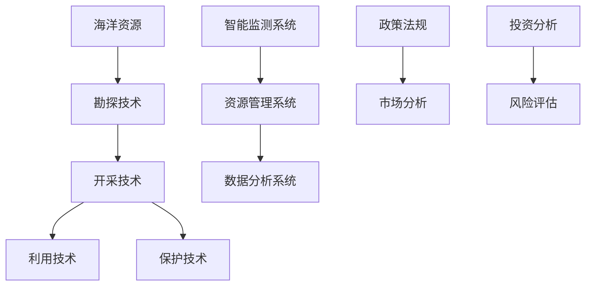
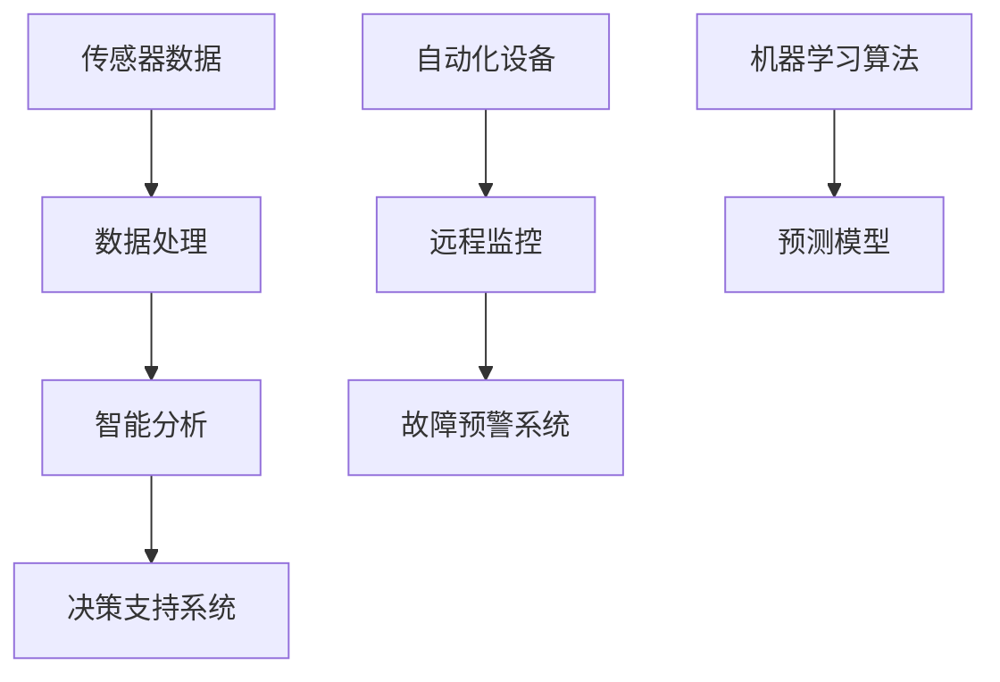
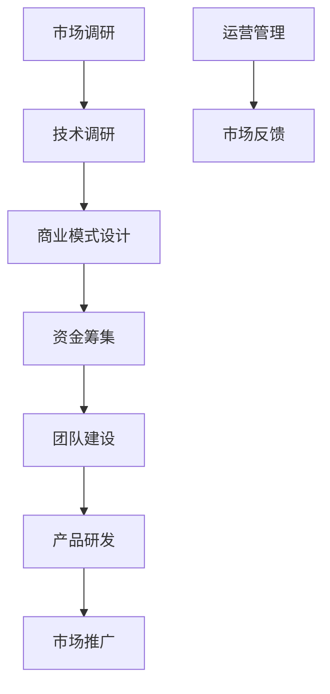

                 

关键词：海洋科技、蓝色经济、创业、海洋资源开发、智能技术

> 摘要：随着全球经济的发展，蓝色经济成为新的增长点。本文将探讨海洋科技创业的无限可能，包括海洋资源开发、智能技术的应用、以及创业过程中的挑战和机遇。

## 1. 背景介绍

海洋覆盖地球表面的70%，是地球上最大的未完全开发的资源宝库。随着技术的进步，海洋资源的重要性日益凸显。从渔业资源、矿产资源到海洋能源，以及海洋生物制药等，每一个领域都蕴藏着巨大的商机。蓝色经济作为新兴的经济模式，已成为各国发展的重要方向。

在过去的几十年中，海洋科技的快速发展为海洋资源开发提供了强大的支持。例如，深海采矿技术的进步使得海底矿物资源的开采成为可能；智能渔船的应用提高了渔业生产的效率；海洋监测技术的发展为海洋环境保护提供了有力保障。

与此同时，创业浪潮在全球范围内掀起。越来越多的人选择投身海洋科技创业，希望通过创新技术解决实际问题，创造商业价值。然而，海洋科技创业不仅需要强大的技术背景，还需要深入理解市场、政策和社会因素。

## 2. 核心概念与联系

### 海洋资源开发

海洋资源开发是指利用现代科技手段，对海洋中的各种资源进行勘探、开采、利用和保护的过程。海洋资源包括海洋生物资源、海底矿物资源、海洋能源（如潮汐能、波浪能、海洋风能）等。

#### 架构流程图



### 智能技术

智能技术是指通过模拟人类智能行为，实现机器自动化和智能化的技术。在海洋科技创业中，智能技术广泛应用于海洋资源开发、海洋监测和海洋环境保护等领域。

#### 架构流程图



### 创业过程

创业过程包括市场调研、技术研发、商业模式设计、资金筹集、团队建设、产品发布和市场推广等环节。

#### 架构流程图



## 3. 核心算法原理 & 具体操作步骤

### 3.1 算法原理概述

在海洋资源开发中，常用的算法包括海洋资源分布预测算法、海洋生物种群动态模拟算法、海洋环境监测算法等。这些算法基于大数据分析和机器学习技术，通过对大量历史数据的分析，预测资源分布、模拟生物种群动态、监测海洋环境。

### 3.2 算法步骤详解

#### 3.2.1 海洋资源分布预测算法

1. 数据采集：收集海洋资源相关数据，如海洋地形、海洋气候、海洋生物等。
2. 数据预处理：对采集到的数据进行清洗、归一化处理，为后续分析做准备。
3. 特征提取：从预处理后的数据中提取关键特征，如海洋温度、海洋盐度、海洋深度等。
4. 建立模型：使用机器学习算法，如支持向量机（SVM）、决策树（DT）等，建立资源分布预测模型。
5. 模型训练：使用历史数据对模型进行训练，优化模型参数。
6. 预测应用：使用训练好的模型对未知区域进行资源分布预测。

#### 3.2.2 海洋生物种群动态模拟算法

1. 数据采集：收集海洋生物种群相关数据，如生物数量、繁殖率、死亡率等。
2. 数据预处理：对采集到的数据进行清洗、归一化处理，为后续分析做准备。
3. 建立模型：使用差分方程或系统动力学模型，模拟生物种群动态。
4. 模型训练：使用历史数据对模型进行训练，优化模型参数。
5. 模拟应用：使用训练好的模型模拟未来生物种群动态。

#### 3.2.3 海洋环境监测算法

1. 数据采集：收集海洋环境相关数据，如水质、水温、海浪等。
2. 数据预处理：对采集到的数据进行清洗、归一化处理，为后续分析做准备。
3. 特征提取：从预处理后的数据中提取关键特征，如异常值检测、趋势分析等。
4. 建立模型：使用聚类算法、异常检测算法等，建立海洋环境监测模型。
5. 模型训练：使用历史数据对模型进行训练，优化模型参数。
6. 监测应用：使用训练好的模型对实时数据进行分析，监测海洋环境状况。

### 3.3 算法优缺点

- **海洋资源分布预测算法**：优点在于能够提前预测资源分布，为资源开发提供指导。缺点是预测精度受限于历史数据质量和算法模型性能。
- **海洋生物种群动态模拟算法**：优点在于能够模拟生物种群动态，为生物资源管理提供依据。缺点是对环境变化的适应性较低，需要大量历史数据支持。
- **海洋环境监测算法**：优点在于能够实时监测海洋环境状况，为环境保护提供预警。缺点是数据采集和特征提取环节复杂，需要大量计算资源。

### 3.4 算法应用领域

- **海洋资源开发**：利用算法预测资源分布，提高资源开发效率。
- **生物资源管理**：通过模拟生物种群动态，优化生物资源利用。
- **海洋环境保护**：实时监测海洋环境，预防环境污染和生态破坏。

## 4. 数学模型和公式 & 详细讲解 & 举例说明

### 4.1 数学模型构建

在海洋科技创业中，常用的数学模型包括资源分布模型、生物种群动态模型、海洋环境监测模型等。

#### 4.1.1 资源分布模型

假设海洋中某种资源的分布符合高斯分布，可以使用以下公式表示：

$$
P(x) = \frac{1}{\sqrt{2\pi\sigma^2}} e^{-\frac{(x-\mu)^2}{2\sigma^2}}
$$

其中，$P(x)$ 表示资源在位置 $x$ 的概率密度，$\mu$ 表示均值，$\sigma$ 表示标准差。

#### 4.1.2 生物种群动态模型

假设生物种群数量 $N(t)$ 遵循Logistic增长模型，可以使用以下公式表示：

$$
\frac{dN(t)}{dt} = rN(t)\left(1 - \frac{N(t)}{K}\right)
$$

其中，$r$ 表示增长率，$K$ 表示环境承载力。

#### 4.1.3 海洋环境监测模型

假设海洋环境监测数据 $X(t)$ 遵循正态分布，可以使用以下公式表示：

$$
X(t) \sim N(\mu, \sigma^2)
$$

其中，$\mu$ 表示监测数据的均值，$\sigma$ 表示监测数据的标准差。

### 4.2 公式推导过程

#### 4.2.1 资源分布模型

假设海洋中某种资源的分布服从高斯分布，我们需要推导出概率密度函数 $P(x)$。

1. 首先，定义资源分布的均值为 $\mu$，标准差为 $\sigma$。
2. 然后，使用高斯分布的概率密度函数公式：

$$
P(x) = \frac{1}{\sqrt{2\pi\sigma^2}} e^{-\frac{(x-\mu)^2}{2\sigma^2}}
$$

#### 4.2.2 生物种群动态模型

假设生物种群数量 $N(t)$ 遵循Logistic增长模型，我们需要推导出种群数量随时间变化的公式。

1. 首先，定义种群数量的增长率为 $r$。
2. 然后，考虑种群数量在时间 $t$ 的增长情况，可以使用以下差分方程表示：

$$
\frac{dN(t)}{dt} = rN(t)\left(1 - \frac{N(t)}{K}\right)
$$

#### 4.2.3 海洋环境监测模型

假设海洋环境监测数据 $X(t)$ 遵循正态分布，我们需要推导出监测数据的均值和标准差。

1. 首先，定义监测数据的均值为 $\mu$，标准差为 $\sigma$。
2. 然后，使用正态分布的累积分布函数公式：

$$
F(x) = \int_{-\infty}^{x} \frac{1}{\sqrt{2\pi\sigma^2}} e^{-\frac{(t-\mu)^2}{2\sigma^2}} dt
$$

### 4.3 案例分析与讲解

#### 4.3.1 资源分布预测

假设我们想要预测某海域的鱼类资源分布。我们可以使用高斯分布模型进行预测。

1. 首先，收集该海域的鱼类资源数据，计算均值 $\mu$ 和标准差 $\sigma$。
2. 然后，使用高斯分布的概率密度函数公式，计算每个位置 $x$ 的概率密度 $P(x)$。
3. 最后，根据概率密度函数，预测鱼类资源分布。

#### 4.3.2 生物种群动态模拟

假设我们想要模拟某海域的鱼类种群动态。我们可以使用Logistic增长模型进行模拟。

1. 首先，收集该海域的鱼类种群数据，计算增长率 $r$ 和环境承载力 $K$。
2. 然后，使用Logistic增长模型公式，计算每个时间点的种群数量 $N(t)$。
3. 最后，根据种群数量变化，分析鱼类种群动态。

#### 4.3.3 海洋环境监测

假设我们想要监测某海域的水质情况。我们可以使用正态分布模型进行监测。

1. 首先，收集该海域的水质数据，计算均值 $\mu$ 和标准差 $\sigma$。
2. 然后，使用正态分布的累积分布函数公式，计算每个水质参数的分布。
3. 最后，根据水质参数分布，判断水质状况是否正常。

## 5. 项目实践：代码实例和详细解释说明

### 5.1 开发环境搭建

在海洋科技创业项目中，我们选择Python作为主要编程语言，结合NumPy、SciPy、Pandas、Scikit-learn等库，实现数学模型和算法。以下是开发环境搭建的步骤：

1. 安装Python（版本3.8或更高）。
2. 安装必要的Python库，如NumPy、SciPy、Pandas、Scikit-learn等。
3. 配置Python环境，确保能够正常运行代码。

### 5.2 源代码详细实现

以下是一个简单的Python代码实例，实现海洋资源分布预测算法。

```python
import numpy as np
from scipy.stats import norm

def predict_resource_distribution(mu, sigma, x_range):
    probabilities = []
    for x in x_range:
        probability = norm.pdf(x, mu, sigma)
        probabilities.append(probability)
    return probabilities

mu = 100  # 均值
sigma = 10  # 标准差
x_range = np.linspace(80, 120, 100)  # 预测区间

probabilities = predict_resource_distribution(mu, sigma, x_range)

# 绘制资源分布曲线
import matplotlib.pyplot as plt

plt.plot(x_range, probabilities)
plt.xlabel('Location')
plt.ylabel('Probability')
plt.title('Resource Distribution Prediction')
plt.show()
```

### 5.3 代码解读与分析

1. **导入库**：首先，我们导入NumPy、SciPy和Matplotlib等库，用于数据处理和绘图。
2. **定义函数**：我们定义了一个名为`predict_resource_distribution`的函数，用于预测资源分布。该函数接收三个参数：均值`mu`、标准差`sigma`和预测区间`x_range`。
3. **计算概率密度**：函数内部使用`norm.pdf`函数计算每个位置的概率密度，并将其存储在列表`probabilities`中。
4. **绘制曲线**：最后，我们使用Matplotlib绘制资源分布曲线，以可视化预测结果。

### 5.4 运行结果展示

运行上述代码后，我们将得到一个资源分布曲线。根据曲线，我们可以直观地看到资源在预测区间内的分布情况。例如，在均值附近，资源分布概率较高，而在远离均值的位置，资源分布概率较低。

## 6. 实际应用场景

### 6.1 海洋资源开发

海洋资源开发是蓝色经济的重要组成部分。通过使用智能技术，如无人机、无人船和人工智能算法，可以大大提高资源开发效率。例如，在渔业资源开发中，智能渔船可以通过实时监测水质、水温等参数，优化捕捞策略，提高捕捞效率。

### 6.2 海洋环境保护

海洋环境保护是蓝色经济的另一个重要方面。通过智能监测技术和数据分析，可以实时监测海洋环境，预警污染事件。例如，在海洋污染监测中，可以使用无人机搭载传感器，实时监测水质、油污等指标，及时发现污染源，减少污染损失。

### 6.3 海洋生物资源管理

海洋生物资源管理需要精确的种群动态预测和资源分配。通过机器学习算法和大数据分析，可以预测生物种群动态，优化资源利用。例如，在渔业资源管理中，可以通过种群动态预测，制定合理的捕捞计划，确保渔业资源的可持续利用。

### 6.4 未来应用展望

随着技术的不断发展，海洋科技创业将在未来发挥更大的作用。一方面，人工智能、大数据、物联网等技术的进步将为海洋资源开发、环境保护和生物资源管理提供更强大的支持；另一方面，政策支持、市场需求和投资环境的改善将推动海洋科技创业的蓬勃发展。

## 7. 工具和资源推荐

### 7.1 学习资源推荐

- **《海洋科学导论》**：一本全面介绍海洋科学基础知识的书籍。
- **《深度学习》**：介绍深度学习基本原理和应用的经典教材。
- **《机器学习实战》**：通过实际案例介绍机器学习算法的应用。

### 7.2 开发工具推荐

- **Jupyter Notebook**：一款强大的交互式编程工具，适合进行数据分析和机器学习实验。
- **Matplotlib**：一款常用的Python绘图库，用于可视化数据和分析结果。
- **Google Colab**：一款在线编程环境，支持Python和其他多种编程语言。

### 7.3 相关论文推荐

- **《深度学习在海洋资源开发中的应用》**
- **《机器学习在海洋环境监测中的研究进展》**
- **《大数据分析在海洋生物资源管理中的应用》**

## 8. 总结：未来发展趋势与挑战

### 8.1 研究成果总结

海洋科技创业在过去几十年中取得了显著的成果，包括海洋资源开发、海洋环境保护和海洋生物资源管理等方面的突破。智能技术、大数据分析和物联网技术的应用为海洋科技创业提供了强大的支持。

### 8.2 未来发展趋势

未来，海洋科技创业将继续发展，主要趋势包括：

1. 智能化：智能技术在海洋资源开发、环境保护和生物资源管理中的应用将更加广泛。
2. 数据化：大数据分析和人工智能算法将在海洋科技创业中发挥更大作用，提高资源开发效率和决策水平。
3. 绿色化：海洋科技创业将更加注重可持续发展，推动海洋资源的合理利用和环境保护。

### 8.3 面临的挑战

尽管海洋科技创业前景广阔，但仍面临一些挑战：

1. 技术难题：海洋环境的复杂性和多样性对技术提出了高要求，需要不断突破技术难题。
2. 政策法规：海洋科技创业需要符合国际和国内的政策法规，确保可持续发展。
3. 市场竞争：海洋科技创业市场竞争激烈，需要不断创新和提升竞争力。

### 8.4 研究展望

未来，海洋科技创业的研究重点将包括：

1. 智能监测与预测：开发更先进的智能监测技术和预测模型，提高海洋资源开发效率和环境保护能力。
2. 大数据分析：利用大数据分析技术，挖掘海洋资源信息和生物资源动态，优化资源分配和管理。
3. 可持续发展：推动海洋资源的合理利用和环境保护，实现蓝色经济的可持续发展。

## 9. 附录：常见问题与解答

### 9.1 海洋科技创业的意义是什么？

海洋科技创业旨在通过科技创新，提高海洋资源开发效率、保护海洋环境、促进海洋生物资源可持续利用，从而推动蓝色经济的发展。

### 9.2 海洋科技创业有哪些挑战？

海洋科技创业面临的挑战包括技术难题、政策法规和市场竞争等。技术难题包括海洋环境的复杂性和多样性；政策法规需要符合国际和国内的相关规定；市场竞争激烈，需要不断创新和提升竞争力。

### 9.3 海洋科技创业有哪些应用领域？

海洋科技创业的应用领域包括海洋资源开发、海洋环境保护、海洋生物资源管理、海洋能源利用等。

### 9.4 海洋科技创业如何实现可持续发展？

海洋科技创业实现可持续发展需要通过技术创新、政策支持和市场驱动等多方面共同努力。技术创新包括开发高效、环保的技术；政策支持包括制定相关法律法规，鼓励海洋科技创业；市场驱动包括开发有市场前景的产品和服务，实现商业模式的创新。

作者：禅与计算机程序设计艺术 / Zen and the Art of Computer Programming
----------------------------------------------------------------

以上是关于海洋科技创业的全面分析，希望对您有所帮助。在未来的蓝色经济浪潮中，海洋科技创业将发挥重要作用，创造更多商业价值和社会影响。让我们一起探索海洋科技的无限可能！

