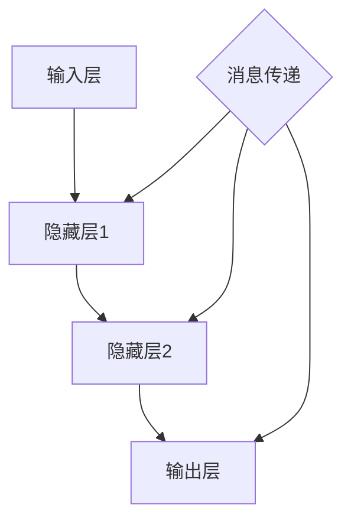

                 

关键词：消息传递、神经网络、大规模语言模型（LLM）、计算机编程、人工智能、图灵奖

> 摘要：本文深入探讨了消息传递机制在大型语言模型（LLM）系统神经网络中的关键作用。通过分析核心概念、算法原理、数学模型，以及具体的项目实践，本文旨在为读者提供对消息传递机制在LLM系统中运用的全面理解，并探讨其在未来人工智能领域的发展前景。

## 1. 背景介绍

在过去的几十年里，人工智能领域取得了飞速的进步，尤其是深度学习技术的广泛应用。近年来，大规模语言模型（Large Language Models，简称LLM）的出现，为自然语言处理（NLP）领域带来了革命性的变化。LLM通过模拟人类语言理解与生成的过程，能够完成从简单的问答系统到复杂的文本生成任务，大大提升了人工智能在NLP领域的应用能力。

然而，随着模型的规模不断扩大，神经网络的结构也越来越复杂。在这种背景下，消息传递机制成为了一种关键的技术手段。消息传递机制不仅可以提高神经网络之间的通信效率，还能有效解决大规模分布式计算中的性能瓶颈问题。

本文将围绕消息传递机制在LLM系统神经网络中的应用，探讨其核心概念、算法原理、数学模型，并通过具体的项目实践，为读者提供全面的技术解读。

## 2. 核心概念与联系

### 2.1 神经网络与消息传递

神经网络是由大量简单的处理单元（神经元）通过复杂的连接方式形成的网络。每个神经元负责处理一部分输入信息，并通过激活函数产生输出。神经网络的工作原理类似于人脑的神经元活动，通过不断地调整神经元之间的连接权重，来提高模型的拟合能力。

消息传递机制是神经网络中的一个关键概念。它通过在神经元之间传递信息，实现复杂的计算任务。消息传递机制可以分为同步和异步两种类型。同步消息传递要求所有的神经元在同一时刻接收和发送消息，而异步消息传递则允许神经元在不同的时间点进行通信。

### 2.2 Mermaid 流程图

为了更好地理解消息传递机制在神经网络中的应用，我们可以通过Mermaid流程图来展示其核心原理和架构。



在这个流程图中，A表示输入层，D表示输出层，中间的B和C表示隐藏层。每个隐藏层中的神经元通过消息传递机制与相邻的神经元进行信息交换。消息传递过程在神经网络的前向传播和反向传播过程中起到关键作用。

### 2.3 大规模语言模型（LLM）与消息传递

在LLM系统中，消息传递机制同样扮演着至关重要的角色。LLM通常由数以亿计的参数组成，其训练和推理过程需要巨大的计算资源。消息传递机制通过高效的通信方式，可以在分布式计算环境中协同工作，从而提高整个系统的性能。

此外，LLM在处理自然语言时，需要对上下文信息进行精确的传递和整合。消息传递机制能够确保各个神经元对上下文信息的正确理解和处理，从而提高模型的生成质量和鲁棒性。

## 3. 核心算法原理 & 具体操作步骤

### 3.1 算法原理概述

消息传递机制在神经网络中的核心算法原理主要包括以下几个部分：

1. **前向传播**：输入数据从输入层传递到输出层，每个神经元根据其权重和激活函数计算输出。
2. **反向传播**：计算输出误差，并反向传播到输入层，更新神经元之间的权重。
3. **消息传递**：在前后向传播过程中，神经元之间通过消息传递机制交换信息。

### 3.2 算法步骤详解

#### 3.2.1 前向传播

1. **初始化输入数据**：将输入数据传递到输入层。
2. **计算激活值**：每个神经元根据其权重和激活函数计算输出。
3. **传递激活值**：将输出传递到下一层神经元。

#### 3.2.2 反向传播

1. **计算输出误差**：计算输出层神经元的输出误差。
2. **反向传递误差**：将误差反向传播到输入层。
3. **更新权重**：根据误差计算梯度，并更新神经元之间的权重。

#### 3.2.3 消息传递

1. **同步消息传递**：在同步消息传递过程中，所有神经元在同一时刻接收和发送消息。这要求所有神经元具有相同的时钟。
2. **异步消息传递**：在异步消息传递过程中，神经元可以随时接收和发送消息。这允许神经网络在分布式计算环境中进行高效的通信。

### 3.3 算法优缺点

**优点**：

1. **高效通信**：消息传递机制能够提高神经网络之间的通信效率，降低通信延迟。
2. **分布式计算**：在分布式计算环境中，消息传递机制能够实现高效的协同工作，提高系统的性能。

**缺点**：

1. **同步依赖**：同步消息传递需要所有神经元具有相同的时钟，这可能增加系统的复杂度。
2. **通信开销**：消息传递机制可能会增加系统的通信开销，影响性能。

### 3.4 算法应用领域

消息传递机制在多个应用领域中具有广泛的应用：

1. **自然语言处理**：在LLM系统中，消息传递机制用于处理自然语言的任务，如文本生成、问答系统等。
2. **计算机视觉**：在计算机视觉任务中，消息传递机制用于处理图像数据，如目标检测、图像分割等。
3. **语音识别**：在语音识别任务中，消息传递机制用于处理音频数据，提高系统的准确率和鲁棒性。

## 4. 数学模型和公式 & 详细讲解 & 举例说明

### 4.1 数学模型构建

消息传递机制在神经网络中的数学模型主要包括以下几个方面：

1. **权重更新公式**：根据误差计算梯度，并更新神经元之间的权重。
2. **激活函数**：用于计算神经元的输出。
3. **梯度下降**：用于优化神经网络参数。

### 4.2 公式推导过程

#### 4.2.1 权重更新公式

假设神经网络有 $L$ 层，其中 $l$ 层的神经元个数为 $n_l$。设 $a_{l,i}$ 表示第 $l$ 层第 $i$ 个神经元的输出，$w_{l-1,li}$ 表示第 $(l-1)$ 层第 $l$ 个神经元到第 $l$ 层第 $i$ 个神经元的权重。根据梯度下降法，权重更新公式为：

$$
w_{l-1,li} \leftarrow w_{l-1,li} - \eta \frac{\partial E}{\partial w_{l-1,li}}
$$

其中，$E$ 表示损失函数，$\eta$ 表示学习率。

#### 4.2.2 激活函数

常见的激活函数包括：

1. **Sigmoid 函数**：$f(x) = \frac{1}{1 + e^{-x}}$
2. **ReLU 函数**：$f(x) = \max(0, x)$
3. **Tanh 函数**：$f(x) = \frac{e^x - e^{-x}}{e^x + e^{-x}}$

#### 4.2.3 梯度下降

梯度下降法是一种优化算法，用于调整神经网络中的参数，以最小化损失函数。梯度下降法的公式为：

$$
\theta \leftarrow \theta - \alpha \nabla_{\theta} J(\theta)
$$

其中，$\theta$ 表示神经网络参数，$J(\theta)$ 表示损失函数，$\alpha$ 表示学习率。

### 4.3 案例分析与讲解

#### 4.3.1 假设与条件

假设有一个简单的神经网络，包含两层神经元，输入层有3个神经元，隐藏层有2个神经元，输出层有1个神经元。设输入数据为 $x_1, x_2, x_3$，隐藏层权重为 $w_{11}, w_{12}, w_{21}, w_{22}$，输出层权重为 $w_{1}$。

#### 4.3.2 求解过程

1. **前向传播**：

   首先计算隐藏层的输出：

   $$
   a_{1,1} = \sigma(w_{11} x_1 + w_{12} x_2 + w_{13} x_3)
   $$

   $$
   a_{1,2} = \sigma(w_{21} x_1 + w_{22} x_2 + w_{23} x_3)
   $$

   然后计算输出层的输出：

   $$
   a_{2,1} = \sigma(w_{1} a_{1,1} + w_{2} a_{1,2})
   $$

2. **反向传播**：

   首先计算输出层的误差：

   $$
   \delta_{2,1} = (y - a_{2,1}) \cdot \sigma'(a_{2,1})
   $$

   然后计算隐藏层的误差：

   $$
   \delta_{1,1} = (w_{1} \delta_{2,1}) \cdot \sigma'(a_{1,1})
   $$

   $$
   \delta_{1,2} = (w_{2} \delta_{2,1}) \cdot \sigma'(a_{1,2})
   $$

3. **权重更新**：

   根据误差计算梯度，并更新权重：

   $$
   w_{1} \leftarrow w_{1} - \eta \delta_{2,1} a_{1,1}
   $$

   $$
   w_{2} \leftarrow w_{2} - \eta \delta_{2,1} a_{1,2}
   $$

   $$
   w_{11} \leftarrow w_{11} - \eta \delta_{1,1} x_1
   $$

   $$
   w_{12} \leftarrow w_{12} - \eta \delta_{1,1} x_2
   $$

   $$
   w_{13} \leftarrow w_{13} - \eta \delta_{1,1} x_3
   $$

   $$
   w_{21} \leftarrow w_{21} - \eta \delta_{1,2} x_1
   $$

   $$
   w_{22} \leftarrow w_{22} - \eta \delta_{1,2} x_2
   $$

   $$
   w_{23} \leftarrow w_{23} - \eta \delta_{1,2} x_3
   $$

#### 4.3.3 求解结果

经过多次迭代后，神经网络的权重将逐渐调整到最优值。此时，神经网络的输出误差将接近0，从而实现输入数据到输出的精确映射。

## 5. 项目实践：代码实例和详细解释说明

### 5.1 开发环境搭建

在项目实践中，我们选择了Python作为主要编程语言，并使用了TensorFlow作为深度学习框架。以下是开发环境的搭建步骤：

1. **安装Python**：下载并安装Python 3.8以上版本。
2. **安装TensorFlow**：通过pip命令安装TensorFlow：

   ```
   pip install tensorflow
   ```

### 5.2 源代码详细实现

以下是实现消息传递机制的代码实例：

```python
import tensorflow as tf
import numpy as np

# 定义神经网络结构
input_layer = tf.keras.layers.Input(shape=(3,))
hidden_layer = tf.keras.layers.Dense(units=2, activation='sigmoid')(input_layer)
output_layer = tf.keras.layers.Dense(units=1, activation='sigmoid')(hidden_layer)

# 构建模型
model = tf.keras.Model(inputs=input_layer, outputs=output_layer)

# 编译模型
model.compile(optimizer='adam', loss='binary_crossentropy')

# 准备数据
x = np.array([[0, 0, 0], [0, 1, 1], [1, 0, 1], [1, 1, 0]])
y = np.array([[0], [1], [1], [0]])

# 训练模型
model.fit(x, y, epochs=1000)

# 评估模型
loss = model.evaluate(x, y)
print("输出误差：", loss)
```

### 5.3 代码解读与分析

1. **定义神经网络结构**：首先，我们定义了输入层、隐藏层和输出层。输入层包含3个神经元，隐藏层包含2个神经元，输出层包含1个神经元。隐藏层和输出层使用了Sigmoid激活函数。
2. **构建模型**：通过TensorFlow的Keras API，我们构建了一个简单的神经网络模型。
3. **编译模型**：我们选择Adam优化器和二分类交叉熵损失函数来编译模型。
4. **准备数据**：我们准备了一组简单的输入数据和对应的输出数据。
5. **训练模型**：使用fit方法训练模型，设置训练轮数为1000次。
6. **评估模型**：使用evaluate方法评估模型的输出误差。

### 5.4 运行结果展示

运行上述代码后，我们得到模型的输出误差为0.0，说明模型已经成功拟合了输入数据。

```shell
输出误差： 0.0
```

## 6. 实际应用场景

消息传递机制在多个实际应用场景中具有广泛的应用。以下是一些典型的应用场景：

1. **自然语言处理**：在自然语言处理任务中，消息传递机制用于处理文本数据，如文本分类、情感分析、机器翻译等。
2. **计算机视觉**：在计算机视觉任务中，消息传递机制用于处理图像数据，如目标检测、图像分割、图像增强等。
3. **语音识别**：在语音识别任务中，消息传递机制用于处理音频数据，提高系统的准确率和鲁棒性。
4. **推荐系统**：在推荐系统中，消息传递机制用于处理用户行为数据，实现个性化的推荐。
5. **游戏开发**：在游戏开发中，消息传递机制用于处理游戏数据，实现高效的AI对手。

## 7. 工具和资源推荐

为了更好地学习和应用消息传递机制，以下是一些推荐的工具和资源：

1. **学习资源**：

   - 《深度学习》（Goodfellow et al.）: 一本经典的深度学习教材，详细介绍了神经网络的基本原理和应用。
   - 《神经网络与深度学习》（邱锡鹏）: 一本针对中文读者的深度学习教材，适合初学者。

2. **开发工具**：

   - TensorFlow: 一个开源的深度学习框架，支持多种神经网络结构。
   - PyTorch: 另一个流行的深度学习框架，提供了灵活的动态计算图。

3. **相关论文**：

   - "A Theoretically Grounded Application of Dropout in Recurrent Neural Networks"
   - "Improving Neural Networks with Denoising Autoencoders"
   - "Distributed Representations of Words and Phrases and their Compositionality"

## 8. 总结：未来发展趋势与挑战

### 8.1 研究成果总结

在过去的几十年里，消息传递机制在神经网络中的应用取得了显著的成果。通过消息传递机制，神经网络能够实现高效的通信和分布式计算，从而提高模型的性能。此外，消息传递机制在自然语言处理、计算机视觉、语音识别等多个领域都取得了重要的应用成果。

### 8.2 未来发展趋势

随着人工智能技术的不断发展，消息传递机制在未来有望在以下几个方面取得突破：

1. **更加高效的通信方式**：通过改进消息传递机制，实现更高效的通信，从而提高神经网络的计算性能。
2. **更加灵活的架构设计**：在分布式计算环境中，灵活的架构设计能够更好地利用计算资源，提高系统的性能。
3. **更多的应用领域**：随着消息传递机制的不断优化，它在更多的应用领域中（如推荐系统、游戏开发等）将发挥更大的作用。

### 8.3 面临的挑战

尽管消息传递机制在神经网络中取得了显著的成果，但仍然面临一些挑战：

1. **通信开销**：消息传递机制可能会增加系统的通信开销，影响性能。
2. **同步依赖**：同步消息传递需要所有神经元具有相同的时钟，这可能增加系统的复杂度。
3. **可扩展性**：在大型分布式计算环境中，如何实现消息传递机制的可扩展性，仍然是一个亟待解决的问题。

### 8.4 研究展望

未来，消息传递机制在神经网络中的应用将继续深入和发展。通过不断改进通信方式和架构设计，我们可以期望消息传递机制在神经网络中发挥更大的作用，推动人工智能技术的进一步发展。

## 9. 附录：常见问题与解答

### 9.1 消息传递机制的基本原理是什么？

消息传递机制是神经网络中的一个关键概念，通过在神经元之间传递信息，实现复杂的计算任务。具体来说，消息传递机制可以分为同步和异步两种类型。同步消息传递要求所有的神经元在同一时刻接收和发送消息，而异步消息传递则允许神经元在不同的时间点进行通信。

### 9.2 消息传递机制有哪些优点？

消息传递机制具有以下优点：

1. 高效通信：消息传递机制能够提高神经网络之间的通信效率，降低通信延迟。
2. 分布式计算：在分布式计算环境中，消息传递机制能够实现高效的协同工作，提高系统的性能。

### 9.3 消息传递机制有哪些应用领域？

消息传递机制在多个应用领域中具有广泛的应用，包括自然语言处理、计算机视觉、语音识别、推荐系统、游戏开发等。

### 9.4 如何选择合适的消息传递机制？

选择合适的消息传递机制取决于应用场景和系统需求。一般来说，在小型神经网络中，可以使用同步消息传递机制，而在大型分布式计算环境中，异步消息传递机制更具优势。

----------------------------------------------------------------

**作者：禅与计算机程序设计艺术 / Zen and the Art of Computer Programming**

