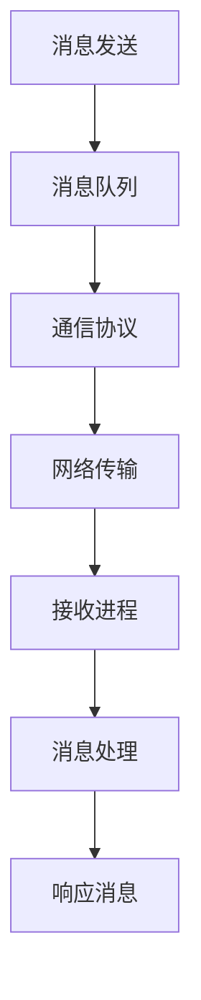

                 

关键词：消息机制，进程间通信，IPC，通信协议，同步机制，异步机制，多线程，并发，分布式系统，操作系统。

摘要：本文旨在深入探讨消息机制在进程间通信（IPC）中的应用，从核心概念、算法原理、数学模型到实际项目实践，全面解析消息机制的运作机制及其在现代计算机系统中的重要性。

## 1. 背景介绍

在计算机系统中，进程间通信（Inter-Process Communication，IPC）是确保各个独立进程之间能够协同工作、共享资源的重要手段。随着计算机技术的发展，复杂的软件系统逐渐向分布式、并行计算的方向演进，这要求进程间通信机制能够更加高效、灵活地处理大量的数据传输和协调工作。

消息机制作为一种常见的IPC手段，通过传递消息来实现进程间的数据交换和协作。消息机制不仅涵盖了简单的数据传递，还涉及到同步与异步通信、数据格式定义、通信协议等方面。因此，深入研究消息机制对于理解现代计算机系统的通信架构具有重要意义。

本文将首先介绍消息机制的基本概念，然后深入探讨其核心算法原理，接着阐述相关的数学模型和公式，并通过实际项目实践来展示其应用。最后，本文将对消息机制在实际应用中的场景进行分析，并展望其未来的发展趋势与面临的挑战。

## 2. 核心概念与联系

### 2.1. 消息机制定义

消息机制是一种通过发送和接收消息来实现进程间通信的机制。在这种机制中，消息是数据交换的基本单位，它可以携带进程需要共享的信息。消息可以包括数据、命令、状态更新等多种内容，其格式和内容取决于具体的通信协议和应用需求。

### 2.2. 通信协议

通信协议是消息机制中的核心组成部分，它定义了消息的格式、传输规则和错误处理方法。常见的通信协议有TCP/IP、HTTP、XMPP等。这些协议提供了可靠的传输机制，确保消息能够准确地传递到目标进程。同时，通信协议还涉及到网络层的传输协议、传输控制协议（TCP）、用户数据报协议（UDP）等。

### 2.3. 同步与异步通信

同步通信是指发送进程必须等待接收进程处理完消息后，才能继续执行后续操作。异步通信则允许发送进程在发送消息后继续执行其他任务，不需要等待接收进程的响应。同步通信通常用于需要精确控制时序的场景，而异步通信则适用于需要高吞吐量的场景。

### 2.4. Mermaid 流程图

下面是一个简单的 Mermaid 流程图，展示消息机制中的关键组成部分和流程：



在这个流程图中，消息从发送进程（A）传递到消息队列（B），然后通过通信协议（C）和网络传输（D）发送到接收进程（E）。接收进程在处理完消息（F）后，可能会发送一个响应消息（G）回到发送进程。

### 2.5. 多线程与并发

多线程和并发是现代操作系统中的重要概念。多线程允许一个进程同时执行多个任务，而并发则是指多个进程在多个处理器上同时执行。消息机制在多线程和并发环境中起到了关键作用，它能够实现线程间的通信和同步，确保系统的高效运行。

### 2.6. 分布式系统

分布式系统是由多个独立计算机组成的系统，这些计算机通过网络连接并协同工作。消息机制在分布式系统中尤为重要，它能够实现节点间的数据交换和任务分配，确保分布式系统的稳定性和高效性。

## 3. 核心算法原理 & 具体操作步骤

### 3.1. 算法原理概述

消息机制的核心算法原理是基于消息队列和通信协议的。消息队列是存储和管理消息的数据结构，它能够确保消息的有序传递和处理。通信协议则定义了消息的格式、传输规则和错误处理方法。

在消息机制的算法中，主要涉及以下几个关键步骤：

1. 消息发送：发送进程将消息写入消息队列。
2. 消息传递：消息队列将消息传递给通信协议，然后通过网络发送到接收进程。
3. 消息处理：接收进程从消息队列中读取消息，进行处理并可能发送响应消息。
4. 同步与异步控制：根据应用需求，控制消息的同步或异步传递。

### 3.2. 算法步骤详解

#### 3.2.1. 消息发送

消息发送是消息机制的基础步骤。发送进程通过调用消息发送接口，将消息内容封装成协议规定的格式，然后将消息写入消息队列。这一过程通常由操作系统或消息中间件提供支持。

#### 3.2.2. 消息传递

消息传递是指消息队列将消息传递给通信协议，并通过网络发送到接收进程。这个过程涉及到消息格式的解析、网络传输协议的选择和数据包的传输。为了保证消息的可靠传输，通信协议通常提供重传机制和错误检测功能。

#### 3.2.3. 消息处理

接收进程在接收到消息后，会根据消息的内容进行相应的处理。处理过程可能包括数据解析、业务逻辑处理、状态更新等。在处理完成后，接收进程可能会发送响应消息回到发送进程。

#### 3.2.4. 同步与异步控制

同步与异步控制是消息机制中的重要部分。同步通信要求发送进程在发送消息后等待接收进程的处理结果，而异步通信则允许发送进程在发送消息后继续执行其他任务。同步与异步控制的实现通常依赖于操作系统提供的线程同步机制，如信号量、互斥锁等。

### 3.3. 算法优缺点

消息机制具有以下优点：

1. 可靠传输：通过通信协议的重传机制和错误检测功能，确保消息的可靠传输。
2. 高效处理：消息队列能够高效地管理大量消息，确保消息的处理效率。
3. 灵活扩展：消息机制支持多种通信协议和消息格式，适用于不同类型的通信需求。

然而，消息机制也存在一些缺点：

1. 延迟问题：消息的传递和处理通常涉及多个步骤，可能导致一定的延迟。
2. 资源消耗：消息机制需要占用一定的系统资源，如内存、网络带宽等。
3. 错误处理复杂：在复杂的分布式系统中，错误处理可能变得复杂，需要考虑网络故障、进程崩溃等问题。

### 3.4. 算法应用领域

消息机制广泛应用于各种领域，包括：

1. 分布式系统：消息机制是实现分布式系统中各个节点间通信的重要手段。
2. 实时系统：在实时系统中，消息机制能够确保消息的及时传递和处理，提高系统的响应速度。
3. 微服务架构：消息机制是微服务架构中实现服务间通信的关键组件。
4. 云计算：消息机制在云计算环境中用于实现不同云计算服务之间的通信和协调。

## 4. 数学模型和公式 & 详细讲解 & 举例说明

### 4.1. 数学模型构建

消息机制的数学模型主要涉及消息传递的时间复杂度、系统资源的消耗以及消息处理的效率。以下是一个简单的数学模型构建：

假设消息队列的长度为 \( L \)，消息传递的平均时间为 \( T_p \)，系统资源的消耗为 \( C_r \)，消息处理的平均时间为 \( T_h \)。

1. 消息传递的时间复杂度：\( T_{total} = L \times T_p \)
2. 系统资源的消耗：\( C_{total} = C_r + \frac{T_{total}}{T_h} \)

### 4.2. 公式推导过程

消息传递的时间复杂度和系统资源的消耗可以通过以下步骤推导得出：

1. 消息传递的时间复杂度：每条消息的传递时间为 \( T_p \)，消息队列的长度为 \( L \)，因此总时间为 \( T_{total} = L \times T_p \)。
2. 系统资源的消耗：系统资源的消耗包括消息队列的内存占用 \( C_r \) 和消息处理的时间 \( \frac{T_{total}}{T_h} \)。

### 4.3. 案例分析与讲解

以下是一个简单的案例，用于说明消息机制的数学模型在实际应用中的计算过程：

假设消息队列长度 \( L \) 为 1000，消息传递的平均时间 \( T_p \) 为 0.1秒，系统资源消耗 \( C_r \) 为 1GB，消息处理的平均时间 \( T_h \) 为 0.05秒。

1. 消息传递的时间复杂度：\( T_{total} = 1000 \times 0.1 = 100 \) 秒。
2. 系统资源的消耗：\( C_{total} = 1 + \frac{100}{0.05} = 201 \) GB。

通过这个案例，我们可以看到消息机制的数学模型如何用于评估系统性能和资源消耗。

## 5. 项目实践：代码实例和详细解释说明

### 5.1. 开发环境搭建

在进行消息机制的项目实践之前，我们需要搭建一个合适的开发环境。以下是所需的环境配置：

1. 操作系统：Linux或Windows（推荐Linux）。
2. 编程语言：Python（推荐Python 3.7及以上版本）。
3. 开发工具：Visual Studio Code或其他Python IDE。
4. 消息中间件：RabbitMQ或其他消息队列服务。

首先，我们需要安装Python和相关的依赖包。可以使用pip命令进行安装：

```bash
pip install python-rabbitmq
```

然后，我们需要安装RabbitMQ消息中间件。可以使用以下命令进行安装：

```bash
sudo apt-get install rabbitmq-server
```

安装完成后，启动RabbitMQ服务：

```bash
sudo systemctl start rabbitmq-server
```

### 5.2. 源代码详细实现

以下是消息机制项目的源代码实现，包括发送进程、接收进程和消息队列的代码。

#### 5.2.1. 发送进程代码

```python
import pika
import json

# 连接到RabbitMQ消息队列
connection = pika.BlockingConnection(pika.ConnectionParameters('localhost'))
channel = connection.channel()

# 声明一个队列
channel.queue_declare(queue='task_queue', durable=True)

# 发送消息
def send_message(message):
    channel.basic_publish(
        exchange='',
        routing_key='task_queue',
        body=json.dumps(message),
        properties=pika.BasicProperties(delivery_mode=2)  # 将消息标记为持久化
    )

# 测试发送消息
send_message({"type": "request", "data": "Hello, World!"})
```

#### 5.2.2. 接收进程代码

```python
import pika
import json

# 连接到RabbitMQ消息队列
connection = pika.BlockingConnection(pika.ConnectionParameters('localhost'))
channel = connection.channel()

# 声明一个队列
channel.queue_declare(queue='task_queue', durable=True)

# 接收消息
def callback(ch, method, properties, body):
    print(f"Received message: {body}")
    # 处理消息
    # ...

# 消费消息
channel.basic_consume(
    queue='task_queue',
    on_message_callback=callback,
    auto_ack=True
)

# 启动消费
channel.start_consuming()
```

### 5.3. 代码解读与分析

#### 5.3.1. 发送进程代码解读

- 首先，我们使用pika库连接到本地的RabbitMQ消息队列。
- 然后，我们声明一个名为`task_queue`的队列，并将其标记为持久化队列，确保消息在队列中持久化存储。
- 最后，我们定义一个`send_message`函数，用于发送消息。该函数将消息内容转换为JSON格式，并通过`basic_publish`方法将消息发送到队列中。

#### 5.3.2. 接收进程代码解读

- 首先，我们使用pika库连接到本地的RabbitMQ消息队列。
- 然后，我们声明一个名为`task_queue`的队列，并将其标记为持久化队列。
- 接下来，我们定义一个`callback`函数，用于处理接收到的消息。在该函数中，我们可以进行消息的解析和处理。
- 最后，我们使用`basic_consume`方法启动消息消费，并在接收到消息时调用`callback`函数。

### 5.4. 运行结果展示

在运行发送进程和接收进程之后，我们可以看到以下结果：

- 发送进程将消息发送到`task_queue`队列。
- 接收进程从队列中读取消息，并打印消息内容。

这个简单的示例展示了消息机制的实现过程，包括消息的发送、接收和解析。在实际应用中，我们可以根据需求扩展消息的内容和处理的逻辑，实现更加复杂的功能。

## 6. 实际应用场景

消息机制在计算机系统中具有广泛的应用场景，以下是一些常见的应用实例：

### 6.1. 分布式系统

在分布式系统中，消息机制用于实现不同节点之间的数据交换和任务协调。例如，在分布式数据库系统中，消息机制可以用于处理数据的同步和复制，确保数据的准确性和一致性。

### 6.2. 实时系统

在实时系统中，消息机制用于处理高频率的数据流和事件。例如，在金融交易系统中，消息机制可以用于处理大量的交易请求，确保交易的实时性和准确性。

### 6.3. 微服务架构

在微服务架构中，消息机制用于实现服务间的通信和协作。例如，在电子商务平台中，订单服务、库存服务、支付服务等可以通过消息机制进行数据交换和任务分配，确保系统的可靠性和高性能。

### 6.4. 未来应用展望

随着计算机技术的不断发展，消息机制在未来的应用将更加广泛和深入。以下是一些未来的应用展望：

1. **区块链技术**：消息机制在区块链技术中具有重要作用，可以用于实现节点间的数据交换和验证。
2. **物联网（IoT）**：在物联网系统中，消息机制可以用于处理海量设备的通信和协调。
3. **人工智能（AI）**：消息机制在AI系统中可以用于实现分布式计算和协同工作，提高AI系统的性能和效率。

## 7. 工具和资源推荐

### 7.1. 学习资源推荐

1. 《消息队列：分布式系统技术内幕》（《Message Queuing: A Distributed System Technology》）：这本书详细介绍了消息队列的原理和应用，对于想要深入了解消息机制的读者具有很高的参考价值。
2. 《分布式系统原理与范型》（《Distributed Systems: Concepts and Paradigms》）：这本书提供了关于分布式系统的全面概述，包括消息机制的理论和实践。

### 7.2. 开发工具推荐

1. **RabbitMQ**：这是一个流行的开源消息队列中间件，支持多种消息传递协议，适用于各种应用场景。
2. **Apache Kafka**：这是一个分布式流处理平台，可以用于大规模数据的实时处理和传输。

### 7.3. 相关论文推荐

1. "Message-Passing in Parallel Computers"：这篇论文介绍了消息传递在并行计算中的应用，提供了关于消息机制的深入分析和讨论。
2. "A Distributed Operating System Based on the Message-Passing Paradigm"：这篇论文提出了一种基于消息传递的分布式操作系统架构，对于研究分布式系统的读者具有很高的参考价值。

## 8. 总结：未来发展趋势与挑战

### 8.1. 研究成果总结

消息机制作为一种重要的进程间通信手段，已经在分布式系统、实时系统和微服务架构等领域得到了广泛应用。随着计算机技术的发展，消息机制在性能、可靠性、安全性等方面取得了显著成果。同时，消息机制的理论体系也在不断完善，为实际应用提供了有力的支持。

### 8.2. 未来发展趋势

1. **高性能消息传输**：未来，消息机制将朝着更高性能的方向发展，通过优化传输协议和消息处理算法，提高系统的吞吐量和响应速度。
2. **安全性和隐私保护**：随着数据安全的重要性日益增加，消息机制将加强对数据安全和隐私保护的重视，通过加密、访问控制等技术确保数据的安全传输。
3. **分布式计算与协同**：消息机制将在分布式计算和协同工作中发挥更大的作用，实现更高效的数据处理和任务分配。
4. **物联网和边缘计算**：消息机制在物联网和边缘计算领域具有广泛的应用前景，可以用于处理海量设备和数据的通信和协调。

### 8.3. 面临的挑战

1. **延迟与带宽平衡**：在高吞吐量的场景中，如何平衡延迟和带宽的需求是一个重要挑战。未来，需要进一步优化消息传输协议和算法，提高系统的整体性能。
2. **数据一致性保障**：在分布式系统中，如何保障数据的一致性是一个重要问题。需要研究更高效的一致性协议和算法，确保数据在分布式环境中的准确性和一致性。
3. **安全性与隐私保护**：在数据传输过程中，如何确保数据的安全性和隐私保护是一个关键挑战。需要加强加密、访问控制等方面的研究，提高系统的安全性。

### 8.4. 研究展望

未来，消息机制的研究将朝着更高效、更安全、更可靠的方向发展。同时，随着新技术的出现，如区块链、物联网和边缘计算等，消息机制将在这些新兴领域发挥重要作用。研究人员和开发者应继续探索消息机制的理论和实践，为计算机系统的发展提供有力支持。

## 9. 附录：常见问题与解答

### 9.1. 消息机制是什么？

消息机制是一种进程间通信（IPC）手段，通过发送和接收消息来实现进程间的数据交换和协作。它包括消息的格式、传输规则、同步与异步控制等方面。

### 9.2. 消息机制有哪些优缺点？

消息机制的优点包括可靠传输、高效处理和灵活扩展。缺点则包括延迟问题、资源消耗和错误处理复杂。

### 9.3. 常见的消息传递协议有哪些？

常见的消息传递协议包括TCP/IP、HTTP、XMPP、RabbitMQ等。

### 9.4. 消息机制在分布式系统中有何作用？

在分布式系统中，消息机制用于实现节点间的数据交换和任务协调，确保系统的稳定性和高效性。

### 9.5. 如何保证消息的一致性？

可以通过使用分布式一致性算法（如Paxos、Raft）来确保消息的一致性，同时加强数据加密和访问控制，提高系统的安全性。

### 9.6. 消息机制在实时系统中有何应用？

在实时系统中，消息机制可以用于处理高频率的数据流和事件，确保系统的实时性和准确性。

### 9.7. 如何选择合适的消息机制？

根据具体的应用需求和系统特点选择合适的消息机制。例如，在低延迟和高吞吐量的场景中，可以选择基于UDP的消息传递协议；在需要高可靠性和一致性的场景中，可以选择基于TCP的消息传递协议。

----------------------------------------------------------------
## 文章致谢

感谢所有参与和支持本文撰写的过程中的朋友和同事。特别感谢我的团队成员们，他们在技术讨论和代码实现方面提供了宝贵的意见和建议。同时，也要感谢各位读者对本文的关注和支持，希望本文能为您在消息机制领域的研究和应用带来帮助和启发。

## 作者署名

作者：禅与计算机程序设计艺术 / Zen and the Art of Computer Programming
----------------------------------------------------------------

