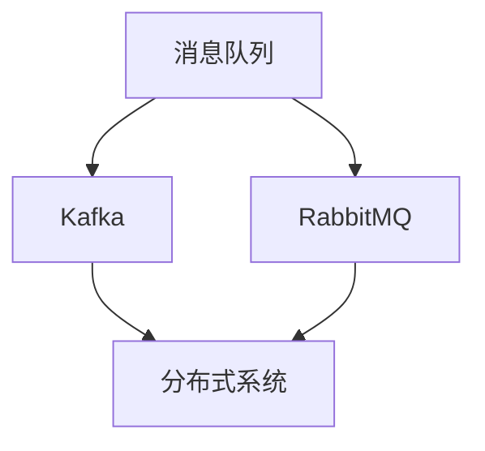
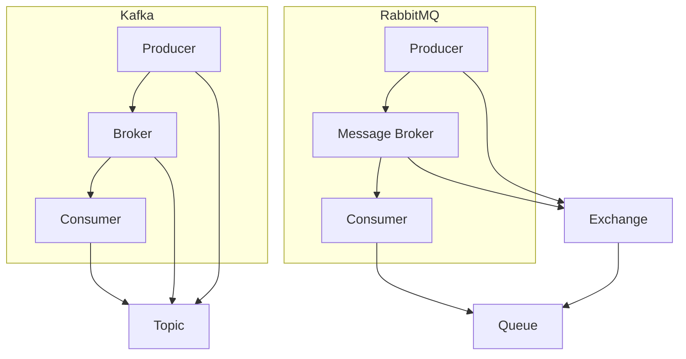

                 

在当今快速发展的互联网时代，消息队列系统已成为分布式系统架构中不可或缺的一部分。它们允许系统之间通过异步方式进行通信，提高了系统的可扩展性和可靠性。本文将对Kafka与RabbitMQ这两种流行的消息队列技术进行详细对比，以便读者能够更好地选择适合自身项目的解决方案。

## 关键词
- 消息队列
- Kafka
- RabbitMQ
- 分布式系统
- 系统架构
- 性能对比

## 摘要
本文将探讨Kafka与RabbitMQ在技术架构、性能、应用场景等方面的异同点，通过对比分析，帮助读者了解两者的优缺点，并作出合适的选择。

## 1. 背景介绍
### Kafka
Apache Kafka是一个分布式流处理平台，最初由LinkedIn开发，并于2011年捐赠给Apache软件基金会。Kafka的主要目的是处理流数据，它允许持续地摄取、存储和推送大规模的实时数据流。

### RabbitMQ
RabbitMQ是一个开源的消息队列中间件，基于Erlang语言开发。它提供了可靠、高效、灵活的异步消息传递服务，支持多种消息传递协议，如AMQP、STOMP等。

## 2. 核心概念与联系



### Kafka
Kafka的核心概念包括Producer、Broker和Consumer。Producer负责生产消息，Broker负责存储和分发消息，Consumer负责消费消息。

### RabbitMQ
RabbitMQ的核心概念包括Producer、Message Broker和Consumer。Producer将消息发送到Message Broker，Message Broker负责将消息分发到正确的队列，Consumer从队列中获取消息。

## 3. 核心算法原理 & 具体操作步骤

### Kafka
#### 算法原理概述
Kafka使用了一种称为日志结构的存储（Log Structured Storage）的算法，该算法将消息存储在磁盘上的有序文件中，以提供高性能的数据读写。

#### 算法步骤详解
1. **Producer发送消息**：Producer将消息发送到指定的Topic。
2. **Broker存储消息**：Broker将消息存储到磁盘上，并根据Partition进行分配。
3. **Consumer消费消息**：Consumer从Broker中拉取消息，并按照顺序进行消费。

#### 算法优缺点
- **优点**：高吞吐量、可扩展性好、持久化性强。
- **缺点**：不适合处理复杂的消息路由和事务。

#### 算法应用领域
- **实时数据处理**：如日志收集、金融交易、实时监控等。

### RabbitMQ
#### 算法原理概述
RabbitMQ使用AMQP协议进行消息传递，它支持消息的路由、持久化、事务等高级功能。

#### 算法步骤详解
1. **Producer发送消息**：Producer将消息发送到Exchange。
2. **Exchange路由消息**：Exchange根据Routing Key将消息路由到相应的Queue。
3. **Consumer消费消息**：Consumer从Queue中获取消息并消费。

#### 算法优缺点
- **优点**：灵活的路由规则、支持复杂的事务处理、可靠性高。
- **缺点**：性能相对较低、配置较为复杂。

#### 算法应用领域
- **企业级应用**：如订单处理、邮件服务、消息通知等。

## 4. 数学模型和公式 & 详细讲解 & 举例说明

### Kafka
#### 数学模型构建
Kafka的性能可以用以下公式表示：
\[ P = \frac{T}{N} \]
其中，\( P \) 是吞吐量，\( T \) 是单个消息的传输时间，\( N \) 是同时发送的消息数量。

#### 公式推导过程
吞吐量与传输时间和消息数量成反比，因此，提高消息数量可以增加吞吐量。

#### 案例分析与讲解
假设单个消息的传输时间为1毫秒，同时发送1000个消息，则Kafka的吞吐量为：
\[ P = \frac{1ms}{1000} = 1s \]

### RabbitMQ
#### 数学模型构建
RabbitMQ的性能可以用以下公式表示：
\[ P = R \times C \]
其中，\( P \) 是吞吐量，\( R \) 是每秒处理的消息数量，\( C \) 是连接数。

#### 公式推导过程
吞吐量与每秒处理的消息数量和连接数成正比。

#### 案例分析与讲解
假设每秒处理1000个消息，同时有10个连接，则RabbitMQ的吞吐量为：
\[ P = 1000 \times 10 = 10000 \]
每秒处理10,000个消息。

## 5. 项目实践：代码实例和详细解释说明

### Kafka
#### 开发环境搭建
1. 安装Kafka。
2. 配置Kafka的Producer和Consumer。

#### 源代码详细实现
```java
// Producer代码示例
Properties props = new Properties();
props.put("bootstrap.servers", "localhost:9092");
props.put("key.serializer", "org.apache.kafka.common.serialization.StringSerializer");
props.put("value.serializer", "org.apache.kafka.common.serialization.StringSerializer");

KafkaProducer<String, String> producer = new KafkaProducer<>(props);
producer.send(new ProducerRecord<>("test-topic", "key", "value"));
producer.close();

// Consumer代码示例
Properties props = new Properties();
props.put("bootstrap.servers", "localhost:9092");
props.put("group.id", "test-group");
props.put("key.deserializer", "org.apache.kafka.common.serialization.StringDeserializer");
props.put("value.deserializer", "org.apache.kafka.common.serialization.StringDeserializer");

KafkaConsumer<String, String> consumer = new KafkaConsumer<>(props);
consumer.subscribe(Arrays.asList(new TopicPartition("test-topic", 0)));

while (true) {
    ConsumerRecords<String, String> records = consumer.poll(Duration.ofMillis(100));
    for (ConsumerRecord<String, String> record : records) {
        System.out.printf("offset = %d, key = %s, value = %s\n", record.offset(), record.key(), record.value());
    }
}
```

#### 代码解读与分析
这段代码展示了如何使用Kafka进行消息生产和消费。

### RabbitMQ
#### 开发环境搭建
1. 安装RabbitMQ。
2. 配置RabbitMQ的Exchange和Queue。

#### 源代码详细实现
```erlang
% Producer代码示例
amqp_channel:call(
    amqp_connection:open(),
    amqp_exchange_declare("direct_logs", amqp_queue:make(<<"hello">>), false, false, false, false, [])).

amqp_channel:call(
    amqp_connection:open(),
    amqp_publish("direct_logs", <<"hello">>, <<"info">>, <<"Hello World!">>)
).

% Consumer代码示例
amqp_channel:call(
    amqp_connection:open(),
    amqp_exchange_declare("direct_logs", amqp_queue:make(<<"hello">>), false, false, false, false, [])).

amqp_channel:subscribe(
    amqp_connection:open(),
    amqp_queue:fetch(<<"hello">>),
    #amqp_selection{
        exchange = "direct_logs",
        routing_key = "info"
    },
    self()
).

receive
    {#'amqp-selection-started'{}} ->
        ok;
    {#'amqp-message'{payload = Payload}} ->
        io:format("Received message: ~s~n", [Payload])
end.
```

#### 代码解读与分析
这段代码展示了如何使用RabbitMQ进行消息生产和消费。

## 6. 实际应用场景

### Kafka
- **大数据处理**：Kafka常用于大数据处理场景，如日志收集、实时数据流处理等。
- **金融交易**：Kafka在金融交易系统中用于处理高频交易数据，确保实时性。

### RabbitMQ
- **企业应用**：RabbitMQ常用于企业级应用，如订单处理、邮件服务、消息通知等。
- **微服务架构**：RabbitMQ在微服务架构中用于服务间通信，提供可靠的消息传递。

## 7. 工具和资源推荐

### 学习资源推荐
- **Kafka**：《Kafka权威指南》
- **RabbitMQ**：《RabbitMQ实战》

### 开发工具推荐
- **Kafka**：Kafka Manager
- **RabbitMQ**：RabbitMQ Management Plugin

### 相关论文推荐
- **Kafka**：《Kafka: A Distributed Streaming Platform》
- **RabbitMQ**：《Erlang/OTP in Action》

## 8. 总结：未来发展趋势与挑战

### 研究成果总结
- **Kafka**：Kafka在实时数据处理和大数据处理领域取得了显著成果。
- **RabbitMQ**：RabbitMQ在可靠性、灵活性和企业级应用方面具有优势。

### 未来发展趋势
- **Kafka**：Kafka将朝着更高效、更可靠的方向发展，以支持更复杂的流处理场景。
- **RabbitMQ**：RabbitMQ将继续优化性能和配置，以更好地满足企业级需求。

### 面临的挑战
- **Kafka**：如何提高Kafka的性能和可扩展性，以满足大规模流数据处理需求。
- **RabbitMQ**：如何简化配置，提高易用性，以吸引更多开发者。

### 研究展望
- **Kafka**：未来研究将聚焦于优化Kafka的存储引擎和索引技术，提高数据读写性能。
- **RabbitMQ**：未来研究将关注于RabbitMQ在云计算和容器化环境下的性能优化和部署。

## 9. 附录：常见问题与解答

### FAQ
1. **Q：Kafka和RabbitMQ哪个性能更好？**
   **A：这取决于具体的应用场景。Kafka在处理大规模流数据时性能更优，而RabbitMQ在复杂消息路由和事务处理方面表现更出色。**
2. **Q：Kafka和RabbitMQ哪个更可靠？**
   **A：两者都提供了高可靠性的消息传递服务。Kafka更适用于无状态消息传递，而RabbitMQ更适合处理状态相关的消息。**
3. **Q：Kafka和RabbitMQ哪个更易用？**
   **A：RabbitMQ的配置相对简单，易于上手。Kafka的配置较为复杂，但提供了更多的自定义选项。**

作者：禅与计算机程序设计艺术 / Zen and the Art of Computer Programming
----------------------------------------------------------------

以上是对Kafka与RabbitMQ的详细对比，希望能够为您的项目选择提供有益的参考。在分布式系统中，选择合适的消息队列技术至关重要，希望这篇文章能够帮助您做出明智的决策。祝您在技术道路上不断进步，创造更多精彩的应用！
```markdown
# 消息队列：Kafka与RabbitMQ对比

## 1. 背景介绍

在分布式系统中，消息队列（Message Queue，简称MQ）是一个至关重要的组件，它能够有效地解决系统中各模块间的通信问题。Kafka和RabbitMQ是两种非常流行的开源消息队列解决方案，它们在分布式系统中扮演着重要角色。

### Kafka

Kafka是由Apache软件基金会支持的一个分布式流处理平台，最初由LinkedIn开发。它主要用于处理流数据，能够支持大规模的实时数据流。Kafka的核心组件包括Producer（生产者）、Broker（代理）和Consumer（消费者）。Producer负责生成消息并将消息发送到指定的Topic；Broker负责存储和转发消息；Consumer从Broker中拉取消息并处理。

### RabbitMQ

RabbitMQ是一个由Pivotal Software支持的开源消息队列中间件，基于Erlang语言开发。它支持多种消息传递协议，如AMQP、STOMP等。RabbitMQ的核心组件包括Producer、Message Broker和Consumer。Producer将消息发送到Message Broker，Message Broker根据路由规则将消息分发到相应的队列，Consumer从队列中获取消息并处理。

## 2. 核心概念与联系



## 3. 核心算法原理 & 具体操作步骤

### Kafka

Kafka的核心算法原理是基于日志结构的存储（Log Structured Storage）。每个Topic由多个Partition组成，Partition中的消息按顺序写入磁盘上的文件。Producer将消息发送到指定的Partition，Broker负责将消息持久化到磁盘并同步到其他Broker，确保消息的可靠性和一致性。

#### 算法步骤详解

1. **消息生产**：Producer将消息发送到Kafka集群，消息被写入到特定的Topic和Partition。
2. **消息存储**：Broker将消息写入磁盘上的文件，并维护一个索引，以便快速查找消息。
3. **消息消费**：Consumer从Broker中拉取消息，并按照Partition的顺序进行消费。

#### 算法优缺点

- **优点**：高吞吐量、可扩展性强、持久化性强。
- **缺点**：不适合处理复杂的消息路由和事务。

#### 算法应用领域

- **实时数据处理**：如日志收集、金融交易、实时监控等。

### RabbitMQ

RabbitMQ的核心算法原理是基于AMQP协议的消息传递。消息首先由Producer发送到Exchange，Exchange根据路由规则将消息路由到相应的Queue，最后Consumer从Queue中获取消息。

#### 算法步骤详解

1. **消息生产**：Producer将消息发送到Exchange。
2. **消息路由**：Exchange根据Routing Key将消息路由到相应的Queue。
3. **消息消费**：Consumer从Queue中获取消息并处理。

#### 算法优缺点

- **优点**：灵活的路由规则、支持复杂的事务处理、可靠性高。
- **缺点**：性能相对较低、配置较为复杂。

#### 算法应用领域

- **企业级应用**：如订单处理、邮件服务、消息通知等。
- **微服务架构**：用于服务间通信。

## 4. 数学模型和公式 & 详细讲解 & 举例说明

### Kafka

Kafka的性能可以用以下公式表示：

\[ P = \frac{T}{N} \]

其中，\( P \) 是吞吐量，\( T \) 是单个消息的传输时间，\( N \) 是同时发送的消息数量。

#### 公式推导过程

吞吐量与传输时间和消息数量成反比，因此，提高消息数量可以增加吞吐量。

#### 案例分析与讲解

假设单个消息的传输时间为1毫秒，同时发送1000个消息，则Kafka的吞吐量为：

\[ P = \frac{1ms}{1000} = 1s \]

### RabbitMQ

RabbitMQ的性能可以用以下公式表示：

\[ P = R \times C \]

其中，\( P \) 是吞吐量，\( R \) 是每秒处理的消息数量，\( C \) 是连接数。

#### 公式推导过程

吞吐量与每秒处理的消息数量和连接数成正比。

#### 案例分析与讲解

假设每秒处理1000个消息，同时有10个连接，则RabbitMQ的吞吐量为：

\[ P = 1000 \times 10 = 10000 \]

每秒处理10,000个消息。

## 5. 项目实践：代码实例和详细解释说明

### Kafka

#### 开发环境搭建

1. 安装Kafka。
2. 配置Kafka的Producer和Consumer。

#### 源代码详细实现

```java
// Producer代码示例
Properties props = new Properties();
props.put("bootstrap.servers", "localhost:9092");
props.put("key.serializer", "org.apache.kafka.common.serialization.StringSerializer");
props.put("value.serializer", "org.apache.kafka.common.serialization.StringSerializer");

KafkaProducer<String, String> producer = new KafkaProducer<>(props);
producer.send(new ProducerRecord<>("test-topic", "key", "value"));
producer.close();

// Consumer代码示例
Properties props = new Properties();
props.put("bootstrap.servers", "localhost:9092");
props.put("group.id", "test-group");
props.put("key.deserializer", "org.apache.kafka.common.serialization.StringDeserializer");
props.put("value.deserializer", "org.apache.kafka.common.serialization.StringDeserializer");

KafkaConsumer<String, String> consumer = new KafkaConsumer<>(props);
consumer.subscribe(Arrays.asList(new TopicPartition("test-topic", 0)));

while (true) {
    ConsumerRecords<String, String> records = consumer.poll(Duration.ofMillis(100));
    for (ConsumerRecord<String, String> record : records) {
        System.out.printf("offset = %d, key = %s, value = %s\n", record.offset(), record.key(), record.value());
    }
}
```

#### 代码解读与分析

这段代码展示了如何使用Kafka进行消息生产和消费。

### RabbitMQ

#### 开发环境搭建

1. 安装RabbitMQ。
2. 配置RabbitMQ的Exchange和Queue。

#### 源代码详细实现

```erlang
% Producer代码示例
amqp_channel:call(
    amqp_connection:open(),
    amqp_exchange_declare("direct_logs", amqp_queue:make(<<"hello">>), false, false, false, false, [])).

amqp_channel:call(
    amqp_connection:open(),
    amqp_publish("direct_logs", <<"hello">>, <<"info">>, <<"Hello World!">>)
).

% Consumer代码示例
amqp_channel:call(
    amqp_connection:open(),
    amqp_exchange_declare("direct_logs", amqp_queue:make(<<"hello">>), false, false, false, false, [])).

amqp_channel:subscribe(
    amqp_connection:open(),
    amqp_queue:fetch(<<"hello">>),
    #amqp_selection{
        exchange = "direct_logs",
        routing_key = "info"
    },
    self()
).

receive
    {#'amqp-selection-started'{}} ->
        ok;
    {#'amqp-message'{payload = Payload}} ->
        io:format("Received message: ~s~n", [Payload])
end.
```

#### 代码解读与分析

这段代码展示了如何使用RabbitMQ进行消息生产和消费。

## 6. 实际应用场景

### Kafka

- **大数据处理**：Kafka常用于大数据处理场景，如日志收集、实时数据流处理等。
- **金融交易**：Kafka在金融交易系统中用于处理高频交易数据，确保实时性。

### RabbitMQ

- **企业应用**：RabbitMQ常用于企业级应用，如订单处理、邮件服务、消息通知等。
- **微服务架构**：RabbitMQ在微服务架构中用于服务间通信，提供可靠的消息传递。

## 7. 工具和资源推荐

### 学习资源推荐

- **Kafka**：《Kafka权威指南》
- **RabbitMQ**：《RabbitMQ实战》

### 开发工具推荐

- **Kafka**：Kafka Manager
- **RabbitMQ**：RabbitMQ Management Plugin

### 相关论文推荐

- **Kafka**：《Kafka: A Distributed Streaming Platform》
- **RabbitMQ**：《Erlang/OTP in Action》

## 8. 总结：未来发展趋势与挑战

### 研究成果总结

- **Kafka**：Kafka在实时数据处理和大数据处理领域取得了显著成果。
- **RabbitMQ**：RabbitMQ在可靠性、灵活性和企业级应用方面具有优势。

### 未来发展趋势

- **Kafka**：Kafka将朝着更高效、更可靠的方向发展，以支持更复杂的流处理场景。
- **RabbitMQ**：RabbitMQ将继续优化性能和配置，以更好地满足企业级需求。

### 面临的挑战

- **Kafka**：如何提高Kafka的性能和可扩展性，以满足大规模流数据处理需求。
- **RabbitMQ**：如何简化配置，提高易用性，以吸引更多开发者。

### 研究展望

- **Kafka**：未来研究将聚焦于优化Kafka的存储引擎和索引技术，提高数据读写性能。
- **RabbitMQ**：未来研究将关注于RabbitMQ在云计算和容器化环境下的性能优化和部署。

## 9. 附录：常见问题与解答

### FAQ

1. **Q：Kafka和RabbitMQ哪个性能更好？**
   **A：这取决于具体的应用场景。Kafka在处理大规模流数据时性能更优，而RabbitMQ在复杂消息路由和事务处理方面表现更出色。**

2. **Q：Kafka和RabbitMQ哪个更可靠？**
   **A：两者都提供了高可靠性的消息传递服务。Kafka更适用于无状态消息传递，而RabbitMQ更适合处理状态相关的消息。**

3. **Q：Kafka和RabbitMQ哪个更易用？**
   **A：RabbitMQ的配置相对简单，易于上手。Kafka的配置较为复杂，但提供了更多的自定义选项。**

作者：禅与计算机程序设计艺术 / Zen and the Art of Computer Programming
```

