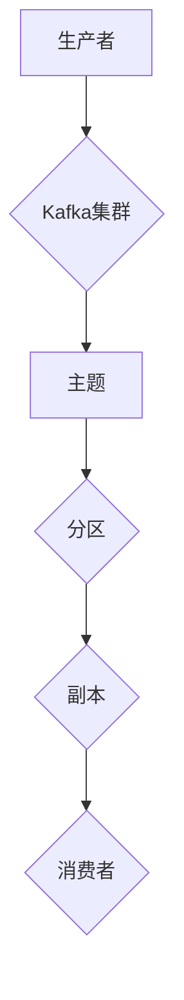
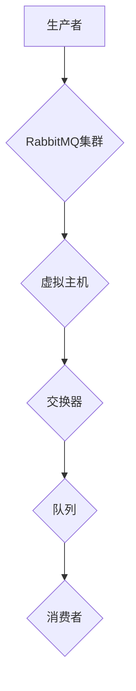

                 

关键词：消息队列、Kafka、RabbitMQ、对比、架构、性能、应用场景

> 摘要：本文旨在对Kafka与RabbitMQ这两种流行的消息队列技术进行全面的对比分析，从架构设计、性能、应用场景等多个维度进行深入探讨，帮助读者了解它们各自的特点和适用场景。

## 1. 背景介绍

消息队列技术在现代分布式系统中扮演着重要的角色，其主要功能是在系统组件之间进行异步通信和数据传递。随着互联网应用的日益复杂，消息队列成为了解决系统间通信瓶颈、提高系统可靠性和可扩展性的有效手段。

Kafka是由LinkedIn开源的一款分布式消息队列系统，它最初是为了解决大规模数据处理和日志聚合的需求而设计的。Kafka以高吞吐量、可扩展性和高可用性著称，广泛应用于大数据处理、日志收集、实时分析等领域。

RabbitMQ是由Pivotal公司开发的另一个流行的消息队列软件，它基于AMQP（Advanced Message Queueing Protocol）协议，支持多种消息队列模式，包括发布-订阅、队列等。RabbitMQ以其灵活性和可靠性在金融、电信、物流等行业得到广泛应用。

## 2. 核心概念与联系

### 2.1. 消息队列基本概念

消息队列（Message Queue，MQ）是一种异步通信模式，允许系统组件之间通过消息进行通信。消息队列的基本概念包括：

- **消息（Message）**：消息队列中的数据单元，通常包含数据内容和元数据。
- **生产者（Producer）**：产生消息并将其发送到消息队列的组件。
- **消费者（Consumer）**：从消息队列中接收消息的组件。
- **队列（Queue）**：存储消息的缓冲区。

### 2.2. Kafka与RabbitMQ架构联系

Kafka与RabbitMQ在架构上都有分布式系统的特点，但具体实现上有所不同。

**Kafka架构：**
- **Kafka集群**：由多个Kafka节点组成，每个节点都是一个Kafka服务器。
- **主题（Topic）**：消息的分类标识，类似于数据库中的表。
- **分区（Partition）**：将消息分配到不同的分区，以提高系统性能和可扩展性。
- **副本（Replica）**：Kafka消息的备份，用于提高数据可靠性和系统可用性。

**RabbitMQ架构：**
- **集群（Cluster）**：由多个RabbitMQ节点组成的集群，提供负载均衡和高可用性。
- **虚拟主机（Virtual Host）**：用于隔离不同应用程序的队列和交换器。
- **交换器（Exchange）**：用于将消息路由到不同的队列。
- **队列（Queue）**：存储消息的缓冲区，类似于Kafka的分区。

### 2.3. Mermaid流程图





## 3. 核心算法原理 & 具体操作步骤

### 3.1 算法原理概述

Kafka与RabbitMQ的核心算法原理主要包括消息的发送、接收和路由。

**Kafka：**
- **消息发送**：生产者将消息发送到特定的主题和分区。
- **消息接收**：消费者从分区中拉取消息。
- **消息路由**：Kafka通过分区确保消息的顺序性和一致性。

**RabbitMQ：**
- **消息发送**：生产者将消息发送到交换器。
- **消息接收**：消费者从队列中接收消息。
- **消息路由**：RabbitMQ通过交换器和路由键实现消息的路由。

### 3.2 算法步骤详解

**Kafka消息发送：**
1. 生产者选择主题和分区。
2. 生产者将消息发送到Kafka服务器。
3. Kafka服务器将消息存储到分区中。

**Kafka消息接收：**
1. 消费者订阅主题和分区。
2. 消费者从分区中拉取消息。
3. 消费者处理消息。

**RabbitMQ消息发送：**
1. 生产者将消息发送到交换器。
2. 交换器将消息路由到队列。
3. 队列将消息存储在内存中。

**RabbitMQ消息接收：**
1. 消费者订阅队列。
2. 消费者从队列中接收消息。
3. 消费者处理消息。

### 3.3 算法优缺点

**Kafka优点：**
- 高吞吐量：适用于大规模数据流处理。
- 可扩展性：支持水平扩展。
- 高可用性：通过副本确保数据不丢失。

**Kafka缺点：**
- 复杂性：配置和管理相对复杂。
- 不支持事务：无法保证跨系统的事务一致性。

**RabbitMQ优点：**
- 灵活性：支持多种消息队列模式。
- 可靠性：提供消息持久化。
- 易用性：配置和管理相对简单。

**RabbitMQ缺点：**
- 吞吐量：相对于Kafka较低。
- 可扩展性：相对于Kafka较弱。

### 3.4 算法应用领域

**Kafka应用领域：**
- 大数据处理：实时日志收集和分析。
- 实时分析：金融交易监控和预测。

**RabbitMQ应用领域：**
- 金融：交易系统中的异步处理。
- 电信：短信和邮件发送。

## 4. 数学模型和公式 & 详细讲解 & 举例说明

### 4.1 数学模型构建

**Kafka消息发送速率：**
$$
\text{消息发送速率} = \frac{\text{消息数量}}{\text{时间}}
$$

**RabbitMQ消息接收速率：**
$$
\text{消息接收速率} = \frac{\text{消息数量}}{\text{时间}}
$$

### 4.2 公式推导过程

**Kafka消息发送速率推导：**
- 设定时间窗口为T，消息数量为N。
- 消息发送速率 = 消息数量 / 时间窗口。

**RabbitMQ消息接收速率推导：**
- 设定时间窗口为T，消息数量为N。
- 消息接收速率 = 消息数量 / 时间窗口。

### 4.3 案例分析与讲解

**案例：Kafka消息发送速率分析**

- 假设Kafka集群中有10个分区，每个分区每秒可以处理100条消息。
- 消息发送速率 = 10个分区 × 100条消息/秒 = 1000条消息/秒。

**案例：RabbitMQ消息接收速率分析**

- 假设RabbitMQ队列每秒可以接收200条消息。
- 消息接收速率 = 200条消息/秒。

## 5. 项目实践：代码实例和详细解释说明

### 5.1 开发环境搭建

**Kafka开发环境搭建：**
- 安装Kafka：`brew install kafka`
- 启动Kafka：`bin/kafka-server-start.sh config/server.properties`

**RabbitMQ开发环境搭建：**
- 安装RabbitMQ：`brew install rabbitmq`
- 启动RabbitMQ：`brew services start rabbitmq`

### 5.2 源代码详细实现

**Kafka生产者代码：**

```python
from kafka import KafkaProducer

producer = KafkaProducer(bootstrap_servers=['localhost:9092'])

topic_name = 'test_topic'
partition = 0

producer.send(topic_name, key.encode('utf-8'), value.encode('utf-8'))

producer.flush()
producer.close()
```

**RabbitMQ生产者代码：**

```python
import pika

connection = pika.BlockingConnection(pika.ConnectionParameters('localhost'))
channel = connection.channel()

exchange_name = 'test_exchange'
routing_key = 'test_routing_key'

channel.queue_declare(queue='test_queue')

channel.basic_publish(exchange=exchange_name, routing_key=routing_key, body=message)

connection.close()
```

### 5.3 代码解读与分析

**Kafka生产者代码解读：**
- 创建Kafka生产者实例。
- 指定Kafka服务器地址。
- 发送消息到指定的主题和分区。
- 刷新发送的消息。
- 关闭生产者连接。

**RabbitMQ生产者代码解读：**
- 创建RabbitMQ连接。
- 创建通道。
- 声明交换器和路由键。
- 声明队列。
- 发布消息到交换器。
- 关闭连接。

### 5.4 运行结果展示

**Kafka消息发送结果：**
- 成功发送消息到Kafka集群。

**RabbitMQ消息发送结果：**
- 成功将消息发送到RabbitMQ队列。

## 6. 实际应用场景

### 6.1 实时日志收集

**Kafka应用场景：**
- 使用Kafka收集实时日志，并将日志数据传输到Hadoop或Spark进行进一步处理。

**RabbitMQ应用场景：**
- 使用RabbitMQ收集系统中的错误日志，并将错误日志发送到邮件服务进行通知。

### 6.2 微服务架构

**Kafka应用场景：**
- 在微服务架构中，使用Kafka作为服务之间的消息传递机制，实现异步通信和数据交换。

**RabbitMQ应用场景：**
- 在微服务架构中，使用RabbitMQ作为服务之间的消息队列，实现解耦和负载均衡。

## 7. 工具和资源推荐

### 7.1 学习资源推荐

- Kafka官方文档：[Kafka官方文档](http://kafka.apache.org/documentation.html)
- RabbitMQ官方文档：[RabbitMQ官方文档](https://www.rabbitmq.com/documentation.html)
- 《Kafka权威指南》：[《Kafka权威指南》](https://book.douban.com/subject/26880632/)
- 《RabbitMQ实战》：[《RabbitMQ实战》](https://book.douban.com/subject/26387883/)

### 7.2 开发工具推荐

- Kafka Manager：[Kafka Manager](https://www.kafkamanager.com/)
- RabbitMQ Management Plugin：[RabbitMQ Management Plugin](https://www.rabbitmq.com/community-management-plugin.html)

### 7.3 相关论文推荐

- 《Kafka: A Distributed Streaming Platform》：[《Kafka: A Distributed Streaming Platform》](https://www.usenix.org/conference/atc12/technical-sessions/presentation/brooker)
- 《RabbitMQ: A message broker for the modern enterprise》：[《RabbitMQ: A message broker for the modern enterprise》](https://www.rabbitmq.com/mosquitto.html)

## 8. 总结：未来发展趋势与挑战

### 8.1 研究成果总结

- 消息队列技术在分布式系统中的应用日益广泛，Kafka和RabbitMQ作为两种流行的消息队列技术，各具特色和优势。
- Kafka以其高吞吐量和可扩展性在实时数据处理和日志收集领域得到广泛应用。
- RabbitMQ以其灵活性和可靠性在金融、电信等行业得到广泛应用。

### 8.2 未来发展趋势

- 消息队列技术将继续朝着更高效、更可靠、更易用的方向发展。
- 新一代的消息队列技术将更加注重性能优化、安全性和可扩展性。

### 8.3 面临的挑战

- 随着数据规模的不断增大，消息队列系统需要面对更大的吞吐量和更高的可靠性挑战。
- 消息队列技术在跨系统事务一致性、数据安全等方面仍存在一定的挑战。

### 8.4 研究展望

- 未来研究将重点关注消息队列技术在云计算、大数据和物联网等领域的应用。
- 消息队列技术与区块链、人工智能等新兴技术的融合将带来新的机遇。

## 9. 附录：常见问题与解答

### 9.1 Kafka常见问题

Q：Kafka如何保证消息顺序性？

A：Kafka通过分区确保消息的顺序性，每个分区中的消息按照写入顺序排列。

Q：Kafka如何处理消息丢失？

A：Kafka通过副本机制保证数据的可靠性，如果一个分区的主副本发生故障，其他副本可以自动切换为主副本。

### 9.2 RabbitMQ常见问题

Q：RabbitMQ如何保证消息的可靠性？

A：RabbitMQ通过消息持久化、确认机制和事务确保消息的可靠性。

Q：RabbitMQ如何处理消息队列阻塞？

A：RabbitMQ可以通过增加队列的容量或优化生产者消费者配置来解决消息队列阻塞问题。

---

**作者：禅与计算机程序设计艺术 / Zen and the Art of Computer Programming**

