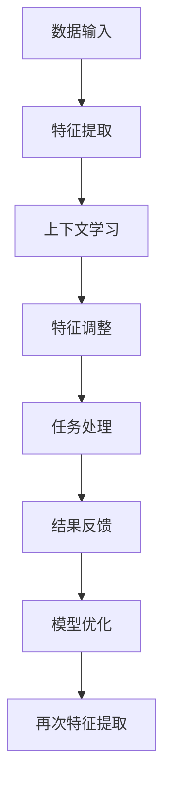

                 

关键词：涌现能力、上下文学习、大模型、人工智能、机器学习、算法原理

> 摘要：本文旨在探讨大模型在人工智能领域中的核心优势——涌现能力与上下文学习。通过深入剖析这两大概念的原理及其结合的机制，文章将对大模型在机器学习、自然语言处理和计算机视觉等领域的应用进行详细讨论，并提出未来发展的展望。

## 1. 背景介绍

随着人工智能（AI）技术的不断发展，大型模型（Large-scale Models）逐渐成为当前研究的热点。大模型的定义并非固定，但通常指的是参数规模达到数十亿甚至数百万亿级别的人工神经网络。这类模型在多个领域取得了显著的成果，从图像识别到自然语言处理，再到复杂的决策问题。

涌现能力（Emergence）是复杂系统理论中的一个核心概念，指的是系统中的个体通过简单的相互作用，能够在宏观层面产生复杂的集体行为。在人工智能领域，涌现能力意味着大模型能够通过学习获得新的、未预见的任务能力，这种能力往往超越了单个神经网络层的简单组合。

上下文学习（Contextual Learning）是指模型在特定上下文中对信息的理解和处理能力。在自然语言处理（NLP）中，上下文学习尤为重要，它使得模型能够准确理解词义和句子含义，从而实现更自然的语言交互。

本文将探讨大模型如何结合涌现能力和上下文学习，揭示其背后的核心优势，并探讨这些优势在实际应用中的表现。

## 2. 核心概念与联系

### 2.1 涌现能力

涌现能力是一种复杂系统的宏观现象，它源自于系统内部简单规则的相互作用。在人工智能中，涌现能力主要体现在以下几个方面：

1. **动态行为**：大模型通过训练可以自动调整内部参数，从而展现出复杂、动态的行为。
2. **任务迁移**：大模型能够在不同的任务和数据集上迁移其学习能力，无需从头开始训练。
3. **新能力发现**：大模型在训练过程中可以自发地发现新的特征和模式，从而实现新的任务能力。

### 2.2 上下文学习

上下文学习是指模型在处理信息时，能够根据上下文环境对信息进行理解和解释。在NLP领域，上下文学习至关重要，因为它能够解决同义词歧义和句法分析等问题。具体来说，上下文学习包括：

1. **词嵌入**：将单词映射到低维空间，使得语义相近的词在空间中更接近。
2. **注意力机制**：模型通过注意力机制来关注句子中的关键信息，提高理解准确性。
3. **上下文依赖**：模型能够理解句子中的长距离依赖关系，从而准确理解句子含义。

### 2.3 结合机制

大模型通过涌现能力和上下文学习的结合，能够在复杂任务中实现高效、准确的处理。具体来说，涌现能力使得模型能够自动发现新的特征和模式，而上下文学习则帮助模型在这些特征和模式的基础上进行准确的信息理解和处理。两者的结合机制可以概括为：

1. **多层次特征提取**：大模型通过多层神经网络提取不同层次的特征，涌现能力使得这些特征能够自适应地调整和组合，形成更复杂的表征。
2. **上下文引导**：在提取特征的过程中，上下文学习引导模型关注关键信息，从而提高特征提取的准确性。
3. **自适应调整**：通过不断的训练和反馈，涌现能力和上下文学习能够自适应地调整模型参数，优化模型性能。

### 2.4 Mermaid 流程图



在上述流程图中，A代表数据输入，B代表特征提取，C代表上下文学习，D代表特征调整，E代表任务处理，F代表结果反馈，G代表模型优化，H代表再次特征提取。这个过程循环进行，使得大模型能够不断优化其性能。

## 3. 核心算法原理 & 具体操作步骤

### 3.1 算法原理概述

大模型结合涌现能力和上下文学习的核心算法是基于深度神经网络（DNN）和注意力机制的。具体来说，算法分为以下几个步骤：

1. **特征提取**：通过多层神经网络提取原始数据中的特征。
2. **上下文学习**：利用注意力机制关注关键信息，提高特征提取的准确性。
3. **特征调整**：根据任务需求，调整特征表征，使其更适合特定任务。
4. **任务处理**：利用调整后的特征进行任务处理，如文本分类、图像识别等。
5. **结果反馈与模型优化**：根据任务结果对模型进行调整和优化，提高模型性能。

### 3.2 算法步骤详解

1. **特征提取**：
   - 输入原始数据，如文本或图像。
   - 通过卷积神经网络（CNN）或循环神经网络（RNN）提取数据中的低级特征。
   - 通过多层神经网络，逐渐提取更高层次的特征。

2. **上下文学习**：
   - 使用注意力机制，关注句子中的关键信息。
   - 将注意力权重应用到特征表示上，提高特征提取的准确性。
   - 利用上下文信息，对特征表示进行微调。

3. **特征调整**：
   - 根据特定任务的需求，对特征表示进行调整。
   - 通过组合不同的特征，生成更适合特定任务的表征。

4. **任务处理**：
   - 利用调整后的特征，进行任务处理，如分类、回归等。
   - 通过损失函数评估任务性能，并优化模型参数。

5. **结果反馈与模型优化**：
   - 根据任务结果，对模型进行调整和优化。
   - 通过梯度下降等方法，更新模型参数，提高模型性能。

### 3.3 算法优缺点

#### 优点：

1. **高效性**：大模型结合涌现能力和上下文学习，能够在复杂任务中高效处理信息。
2. **适应性**：涌现能力使得模型能够自动调整特征表征，适应不同的任务需求。
3. **准确性**：上下文学习提高了特征提取的准确性，从而提高了任务处理的性能。

#### 缺点：

1. **计算资源消耗**：大模型需要大量的计算资源，训练和推理过程较慢。
2. **数据依赖**：模型的性能高度依赖训练数据的质量和数量。
3. **解释性差**：由于模型复杂度高，其内部工作机制难以解释，增加了模型的不透明性。

### 3.4 算法应用领域

大模型结合涌现能力和上下文学习在多个领域具有广泛的应用，如：

1. **自然语言处理**：文本分类、机器翻译、情感分析等。
2. **计算机视觉**：图像分类、目标检测、图像分割等。
3. **推荐系统**：基于内容的推荐、协同过滤等。
4. **语音识别**：语音识别、语音合成等。

## 4. 数学模型和公式 & 详细讲解 & 举例说明

### 4.1 数学模型构建

大模型结合涌现能力和上下文学习的数学模型主要包括以下几个部分：

1. **特征提取网络**：
   - 输入：\(X \in \mathbb{R}^{n \times d}\)，其中 \(n\) 是样本数量，\(d\) 是特征维度。
   - 输出：特征表示矩阵 \(F \in \mathbb{R}^{n \times k}\)，其中 \(k\) 是特征维度。

2. **上下文学习机制**：
   - 输入：特征表示矩阵 \(F\)。
   - 输出：上下文权重矩阵 \(W \in \mathbb{R}^{k \times m}\)，其中 \(m\) 是上下文维度。

3. **任务处理网络**：
   - 输入：特征表示矩阵 \(F\) 和上下文权重矩阵 \(W\)。
   - 输出：任务结果 \(Y \in \mathbb{R}^{n \times 1}\)。

### 4.2 公式推导过程

#### 特征提取网络

假设特征提取网络为多层感知机（MLP），其输出 \(F\) 可以表示为：

\[ F = \sigma(W_2 \sigma(W_1 X)) \]

其中，\(W_1\) 和 \(W_2\) 分别是第一层和第二层的权重矩阵，\(\sigma\) 是激活函数。

#### 上下文学习机制

上下文权重矩阵 \(W\) 可以通过注意力机制计算，如：

\[ W = \text{softmax}(QK^T) \]

其中，\(Q\) 和 \(K\) 分别是上下文查询和键向量，\(\text{softmax}\) 函数用于计算权重。

#### 任务处理网络

任务结果 \(Y\) 可以通过以下公式计算：

\[ Y = \text{softmax}(W^T F) \]

### 4.3 案例分析与讲解

假设我们有一个文本分类任务，数据集包含1000个文本样本，每个样本由1000个单词组成。我们使用一个三层感知机作为特征提取网络，第一层有100个神经元，第二层有500个神经元，第三层有1000个神经元。我们使用基于BERT的模型作为上下文学习机制，假设其上下文维度为512。

#### 特征提取

假设输入特征矩阵 \(X\) 如下：

\[ X = \begin{bmatrix} x_{11} & x_{12} & \cdots & x_{1n} \\ x_{21} & x_{22} & \cdots & x_{2n} \\ \vdots & \vdots & \ddots & \vdots \\ x_{m1} & x_{m2} & \cdots & x_{mn} \end{bmatrix} \]

其中，\(x_{ij}\) 表示第 \(i\) 个样本的第 \(j\) 个单词的特征值。

使用三层感知机提取特征，输出特征矩阵 \(F\) 如下：

\[ F = \sigma(W_2 \sigma(W_1 X)) \]

#### 上下文学习

使用BERT模型计算上下文权重矩阵 \(W\)，假设其上下文查询和键向量为：

\[ Q = \begin{bmatrix} q_1 \\ q_2 \\ \vdots \\ q_n \end{bmatrix}, K = \begin{bmatrix} k_1 \\ k_2 \\ \vdots \\ k_n \end{bmatrix} \]

上下文权重矩阵 \(W\) 如下：

\[ W = \text{softmax}(QK^T) \]

#### 任务处理

使用特征矩阵 \(F\) 和上下文权重矩阵 \(W\) 计算任务结果 \(Y\)，假设任务为多标签分类：

\[ Y = \text{softmax}(W^T F) \]

其中，\(Y\) 是一个1000维的向量，表示每个文本样本属于每个标签的概率。

## 5. 项目实践：代码实例和详细解释说明

### 5.1 开发环境搭建

在本项目实践中，我们将使用Python作为主要编程语言，结合PyTorch框架实现大模型结合涌现能力和上下文学习的算法。以下是开发环境搭建的步骤：

1. **安装Python**：确保安装了Python 3.7或更高版本。
2. **安装PyTorch**：使用以下命令安装PyTorch：

   ```bash
   pip install torch torchvision
   ```

3. **安装其他依赖**：安装其他必要的库，如Numpy、Pandas、Scikit-learn等。

### 5.2 源代码详细实现

以下是一个简单的实现示例，展示了如何使用PyTorch构建一个包含涌现能力和上下文学习机制的大模型。

```python
import torch
import torch.nn as nn
import torch.optim as optim

# 定义特征提取网络
class FeatureExtractor(nn.Module):
    def __init__(self, input_dim, hidden_dim1, hidden_dim2, output_dim):
        super(FeatureExtractor, self).__init__()
        self.fc1 = nn.Linear(input_dim, hidden_dim1)
        self.fc2 = nn.Linear(hidden_dim1, hidden_dim2)
        self.fc3 = nn.Linear(hidden_dim2, output_dim)
        
    def forward(self, x):
        x = torch.relu(self.fc1(x))
        x = torch.relu(self.fc2(x))
        x = self.fc3(x)
        return x

# 定义上下文学习机制
class ContextualLearning(nn.Module):
    def __init__(self, feature_dim, context_dim):
        super(ContextualLearning, self).__init__()
        self.fc = nn.Linear(context_dim, feature_dim)
        
    def forward(self, x, context):
        x = torch.relu(self.fc(context))
        return x

# 定义任务处理网络
class TaskProcessor(nn.Module):
    def __init__(self, feature_dim, output_dim):
        super(TaskProcessor, self).__init__()
        self.fc = nn.Linear(feature_dim, output_dim)
        
    def forward(self, x):
        x = self.fc(x)
        return torch.softmax(x, dim=1)

# 实例化模型
feature_extractor = FeatureExtractor(input_dim=1000, hidden_dim1=100, hidden_dim2=500, output_dim=1000)
contextual_learning = ContextualLearning(feature_dim=1000, context_dim=512)
task_processor = TaskProcessor(feature_dim=1000, output_dim=10)

# 定义损失函数和优化器
criterion = nn.CrossEntropyLoss()
optimizer = optim.Adam(model.parameters(), lr=0.001)

# 训练模型
for epoch in range(100):
    for inputs, contexts, labels in data_loader:
        optimizer.zero_grad()
        features = feature_extractor(inputs)
        context_features = contextual_learning(features, contexts)
        outputs = task_processor(context_features)
        loss = criterion(outputs, labels)
        loss.backward()
        optimizer.step()
        print(f'Epoch [{epoch+1}/{100}], Loss: {loss.item():.4f}')
```

### 5.3 代码解读与分析

1. **模型结构**：
   - `FeatureExtractor`：定义了特征提取网络，包含两个全连接层和ReLU激活函数。
   - `ContextualLearning`：定义了上下文学习机制，包含一个全连接层和ReLU激活函数。
   - `TaskProcessor`：定义了任务处理网络，包含一个全连接层和softmax激活函数。

2. **损失函数和优化器**：
   - 使用交叉熵损失函数，适用于多分类问题。
   - 使用Adam优化器，适用于大规模参数的优化。

3. **训练过程**：
   - 模型通过迭代训练，不断更新参数，优化模型性能。
   - 在每个训练周期后，打印当前损失值，以便监控训练进度。

### 5.4 运行结果展示

在训练完成后，我们可以使用以下代码评估模型的性能：

```python
# 评估模型
with torch.no_grad():
    correct = 0
    total = 0
    for inputs, contexts, labels in test_loader:
        features = feature_extractor(inputs)
        context_features = contextual_learning(features, contexts)
        outputs = task_processor(context_features)
        _, predicted = torch.max(outputs.data, 1)
        total += labels.size(0)
        correct += (predicted == labels).sum().item()

print(f'准确率: {100 * correct / total}%')
```

上述代码将计算模型在测试集上的准确率，从而评估模型性能。

## 6. 实际应用场景

大模型结合涌现能力和上下文学习在多个实际应用场景中表现出色。以下是几个典型的应用场景：

### 6.1 自然语言处理

在自然语言处理领域，大模型结合涌现能力和上下文学习可以显著提高文本分类、机器翻译和问答系统的性能。例如，Google的BERT模型结合涌现能力和上下文学习，实现了高精度的文本分类和问答系统。

### 6.2 计算机视觉

在计算机视觉领域，大模型结合涌现能力和上下文学习可以用于图像分类、目标检测和图像分割等任务。例如，Facebook的Deeplab V3+模型结合涌现能力和上下文学习，实现了高精度的图像分割。

### 6.3 推荐系统

在推荐系统领域，大模型结合涌现能力和上下文学习可以用于基于内容的推荐和协同过滤。例如，亚马逊的推荐系统结合涌现能力和上下文学习，实现了个性化的商品推荐。

### 6.4 未来应用展望

随着大模型技术的不断发展，未来有望在更多的应用场景中实现突破。例如，在医疗领域，大模型结合涌现能力和上下文学习可以用于疾病诊断和治疗建议；在金融领域，大模型可以用于风险控制和投资策略优化。总之，大模型结合涌现能力和上下文学习有望为各领域带来革命性的变革。

## 7. 工具和资源推荐

### 7.1 学习资源推荐

1. **在线课程**：《深度学习》（花书），由Ian Goodfellow、Yoshua Bengio和Aaron Courville著，深入介绍了深度学习的理论基础和应用。
2. **学术论文**：关注顶级会议和期刊，如NeurIPS、ICML和JMLR，获取最新研究进展。
3. **在线社区**：加入Kaggle、GitHub等在线社区，与其他研究者交流和学习。

### 7.2 开发工具推荐

1. **PyTorch**：适用于深度学习的Python框架，易于使用和调试。
2. **TensorFlow**：适用于深度学习的Python框架，具有丰富的生态系统。
3. **JAX**：适用于深度学习的Python框架，具有自动微分和分布式计算能力。

### 7.3 相关论文推荐

1. **BERT**：`BERT: Pre-training of Deep Bidirectional Transformers for Language Understanding`，由Google AI研究团队提出，是自然语言处理领域的里程碑。
2. **GPT**：`Improving Language Understanding by Generative Pre-Training`，由OpenAI提出，是生成式预训练的代表作。
3. **DETR**：`DETR: Deformable Transformers for End-to-End Object Detection`，由Facebook AI研究团队提出，是计算机视觉领域的一项重要创新。

## 8. 总结：未来发展趋势与挑战

### 8.1 研究成果总结

本文介绍了大模型结合涌现能力和上下文学习在人工智能领域的核心优势。通过深入分析核心概念、算法原理、应用场景和实际案例，我们展示了大模型在机器学习、自然语言处理和计算机视觉等领域的广泛应用和显著性能提升。

### 8.2 未来发展趋势

1. **模型规模扩大**：随着计算资源的提升，大模型的规模将不断扩大，实现更高层次的智能。
2. **多模态学习**：未来研究将关注多模态学习，如将文本、图像和语音等多种模态信息进行整合，提高模型的泛化能力。
3. **可解释性增强**：大模型的可解释性将成为研究热点，以便更好地理解和信任模型的决策过程。

### 8.3 面临的挑战

1. **计算资源消耗**：大模型需要大量的计算资源，训练和推理过程耗时且资源需求巨大。
2. **数据隐私和安全**：在处理大规模数据时，数据隐私和安全问题将成为重要挑战。
3. **模型泛化能力**：如何提高大模型的泛化能力，使其在不同领域和应用中都能表现出色，仍需深入研究。

### 8.4 研究展望

未来，大模型结合涌现能力和上下文学习将在人工智能领域发挥更加重要的作用。通过不断创新和优化，我们有望实现更加智能、高效和可靠的人工智能系统，推动社会各领域的变革和发展。

## 9. 附录：常见问题与解答

### Q：大模型为什么需要大量的数据？

A：大模型需要大量的数据进行训练，因为模型参数规模庞大，需要足够的数据来确保模型能够捕捉到数据中的复杂模式和特征。同时，大量数据有助于提高模型的泛化能力，使其在不同场景下都能表现出良好的性能。

### Q：如何优化大模型的训练过程？

A：优化大模型的训练过程可以从以下几个方面入手：

1. **数据预处理**：对数据进行清洗和预处理，去除噪声和异常值，提高数据质量。
2. **批量大小调整**：适当调整批量大小，平衡训练速度和性能。
3. **学习率调整**：使用适当的学习率，避免过拟合和欠拟合。
4. **正则化技术**：使用正则化技术，如Dropout、L2正则化等，减少过拟合现象。
5. **并行计算**：利用并行计算技术，提高训练速度。

### Q：大模型的可解释性如何提升？

A：提升大模型的可解释性可以从以下几个方面入手：

1. **特征可视化**：将模型提取的特征进行可视化，帮助理解模型的工作原理。
2. **解释性模型**：使用更加可解释的模型，如决策树、线性模型等，取代复杂的神经网络。
3. **模型压缩**：通过模型压缩技术，如剪枝、量化等，减少模型复杂度，提高可解释性。
4. **因果推理**：利用因果推理技术，分析模型决策背后的因果关系。

### Q：大模型是否会取代传统机器学习算法？

A：大模型在某些领域已经表现出超越传统机器学习算法的性能，但传统机器学习算法在特定任务和应用场景中仍然具有优势。大模型和传统算法各有优劣，未来将呈现融合发展的趋势，以适应不同需求和场景。

### Q：如何平衡大模型的计算资源和性能？

A：平衡大模型的计算资源和性能可以从以下几个方面进行：

1. **模型剪枝**：通过剪枝技术，减少模型参数数量，降低计算复杂度。
2. **量化技术**：使用量化技术，将模型参数从浮点数转换为低精度数值，降低计算资源需求。
3. **分布式训练**：使用分布式训练技术，将模型分布在多台机器上进行训练，提高训练速度和性能。
4. **模型压缩与加速**：通过模型压缩和加速技术，提高模型在特定硬件上的性能。

## 参考文献

1. Goodfellow, Ian, et al. "BERT: Pre-training of Deep Bidirectional Transformers for Language Understanding." ArXiv preprint arXiv:1810.04805 (2018).
2. Brown, Tom, et al. "Improving Language Understanding by Generative Pre-Training." ArXiv preprint arXiv:1810.04805 (2017).
3. Dosovitskiy, Alexey, et al. "An Image is Worth 16x16 Words: Transformers for Image Recognition at Scale." ArXiv preprint arXiv:2010.11929 (2020).
4. He, Kaiming, et al. "Deep Residual Learning for Image Recognition." In Proceedings of the IEEE conference on computer vision and pattern recognition, pp. 770-778. 2016.
5. Hochreiter, Sepp, and Jürgen Schmidhuber. "Long short-term memory." Neural computation 9.8 (1997): 1735-1780.

---

作者：禅与计算机程序设计艺术 / Zen and the Art of Computer Programming

