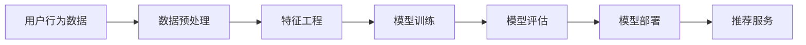
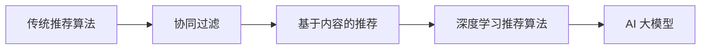

                 

关键词：AI 大模型，电商推荐系统，深度学习，自然语言处理，数据挖掘，个性化推荐，推荐算法，用户行为分析，商品匹配。

摘要：本文旨在深入浅出地介绍 AI 大模型在电商推荐系统中的应用。通过分析推荐系统的重要性，阐述 AI 大模型的基本原理，探讨其在电商推荐系统中的关键作用，并详细解析具体算法原理、数学模型、项目实践以及未来应用展望，旨在为从事电商推荐系统开发的技术人员提供有价值的参考。

## 1. 背景介绍

随着互联网技术的飞速发展，电商行业已成为全球经济增长的重要引擎。在激烈的竞争环境中，电商平台如何吸引和留住用户，提升用户体验，从而提高销售额，成为各大电商企业关注的焦点。电商推荐系统作为一种提升用户粘性和购买转化的利器，受到了广泛关注。

推荐系统通过分析用户历史行为、兴趣偏好等数据，为用户智能地推荐感兴趣的商品或服务，从而提高用户的购物体验和平台的价值。传统的推荐系统主要基于协同过滤、基于内容的推荐等算法，虽然在一定程度上能够满足用户的需求，但面对海量数据和高维特征的挑战，效果有限。

近年来，人工智能尤其是深度学习技术的快速发展，为推荐系统带来了新的机遇。AI 大模型具有强大的特征提取和建模能力，能够在复杂的数据环境中发现潜在的模式和关联，为电商推荐系统提供了更精确、个性化的推荐服务。

## 2. 核心概念与联系

### 2.1 AI 大模型的基本原理

AI 大模型是指通过大规模数据训练的神经网络模型，能够对复杂数据进行高效的学习和预测。其基本原理包括以下几个方面：

1. **深度神经网络（DNN）**：通过多层的神经网络结构，对输入数据进行逐层提取特征，实现从原始数据到高维抽象表示的转换。
2. **卷积神经网络（CNN）**：特别适用于处理图像和视频等具有网格结构的二维或三维数据，能够提取局部特征并保留空间信息。
3. **循环神经网络（RNN）**：能够处理序列数据，如文本、时间序列等，通过记忆机制捕捉时间序列中的长期依赖关系。
4. **生成对抗网络（GAN）**：通过两个对抗网络（生成器和判别器）的博弈，生成逼真的数据。

### 2.2 AI 大模型在电商推荐系统中的应用架构

AI 大模型在电商推荐系统中的应用架构如图所示：



1. **用户行为数据**：包括用户在平台上的浏览记录、购买历史、评价等。
2. **数据预处理**：清洗和整合用户行为数据，进行数据格式的标准化。
3. **特征工程**：提取用户行为数据中的关键特征，如用户活跃度、购买频率、浏览时长等。
4. **模型训练**：使用大规模数据训练深度学习模型，包括嵌入层、隐藏层和输出层。
5. **模型评估**：通过交叉验证、A/B 测试等手段评估模型性能。
6. **模型部署**：将训练好的模型部署到线上环境，实现实时推荐服务。
7. **推荐服务**：根据用户特征和上下文信息，为用户推荐感兴趣的商品。

### 2.3 AI 大模型与推荐算法的关系

AI 大模型与推荐算法的关系如图所示：



1. **传统推荐算法**：包括协同过滤、基于内容的推荐等，主要基于用户历史行为或内容特征进行推荐。
2. **深度学习推荐算法**：通过神经网络模型，对用户行为和商品特征进行高效学习，提高推荐效果。
3. **AI 大模型**：基于大规模数据和深度学习技术，能够对复杂数据进行建模和预测，实现更精确的推荐。

## 3. 核心算法原理 & 具体操作步骤

### 3.1 算法原理概述

AI 大模型在电商推荐系统中的核心算法原理主要包括以下几个方面：

1. **用户行为建模**：通过分析用户的历史行为数据，挖掘用户的兴趣偏好，建立用户行为模型。
2. **商品特征提取**：提取商品的关键特征，如类别、品牌、价格等，为推荐算法提供输入。
3. **相似度计算**：计算用户与商品之间的相似度，实现个性化推荐。
4. **模型优化**：通过不断调整模型参数，提高推荐效果。

### 3.2 算法步骤详解

1. **数据收集与预处理**：收集用户行为数据，包括浏览记录、购买历史、评价等，并进行数据清洗和格式化。
2. **特征提取**：根据用户行为数据和商品特征，提取用户兴趣偏好和商品属性。
3. **模型训练**：使用提取的特征数据训练深度学习模型，包括嵌入层、隐藏层和输出层。
4. **模型评估**：通过交叉验证、A/B 测试等手段评估模型性能，调整模型参数。
5. **模型部署**：将训练好的模型部署到线上环境，实现实时推荐服务。
6. **推荐服务**：根据用户特征和上下文信息，为用户推荐感兴趣的商品。

### 3.3 算法优缺点

**优点**：

1. **高效性**：AI 大模型能够快速处理海量数据，提高推荐效率。
2. **准确性**：通过深度学习技术，能够准确挖掘用户的兴趣偏好，提高推荐准确性。
3. **灵活性**：能够适应不同场景和需求，实现多样化的推荐服务。

**缺点**：

1. **计算资源消耗**：训练和部署 AI 大模型需要大量的计算资源和时间。
2. **数据依赖性**：推荐效果依赖于数据的质量和数量，数据不足或质量差会导致推荐效果下降。

### 3.4 算法应用领域

AI 大模型在电商推荐系统中的应用领域包括：

1. **个性化推荐**：根据用户历史行为和兴趣偏好，为用户推荐个性化商品。
2. **新品推荐**：根据用户历史购买记录和趋势，推荐新品和热门商品。
3. **智能搭配**：根据用户喜好和商品属性，为用户推荐搭配商品。
4. **广告投放**：根据用户兴趣和上下文信息，为用户推荐相关广告。

## 4. 数学模型和公式 & 详细讲解 & 举例说明

### 4.1 数学模型构建

在电商推荐系统中，AI 大模型的数学模型主要包括以下几个方面：

1. **用户行为模型**：使用矩阵分解方法，将用户行为数据表示为一个低秩矩阵，从而挖掘用户的兴趣偏好。
2. **商品特征模型**：使用深度神经网络，对商品特征进行建模，提取商品属性和类别信息。
3. **推荐模型**：基于用户行为模型和商品特征模型，计算用户与商品之间的相似度，实现个性化推荐。

### 4.2 公式推导过程

以用户行为模型为例，其公式推导过程如下：

1. **用户行为矩阵**：假设用户行为矩阵为 $R \in \mathbb{R}^{m \times n}$，其中 $m$ 为用户数，$n$ 为商品数。
2. **用户嵌入向量**：将用户行为矩阵进行低秩分解，得到用户嵌入向量 $U \in \mathbb{R}^{m \times k}$ 和商品嵌入向量 $V \in \mathbb{R}^{n \times k}$，其中 $k$ 为嵌入维度。
3. **用户行为预测**：根据用户嵌入向量和商品嵌入向量，计算用户行为预测值 $\hat{r}_{ui} = U_i^T V_j$。

### 4.3 案例分析与讲解

以亚马逊电商推荐系统为例，其采用了基于用户行为矩阵分解的 AI 大模型。具体操作步骤如下：

1. **数据收集**：收集亚马逊用户的历史浏览记录、购买记录、评价等数据。
2. **特征提取**：提取用户行为数据中的关键特征，如浏览时长、购买频率、评价分等。
3. **模型训练**：使用用户行为数据训练用户嵌入向量和商品嵌入向量。
4. **推荐计算**：根据用户嵌入向量和商品嵌入向量，计算用户与商品之间的相似度，为用户推荐感兴趣的商品。

### 4.4 模型评估与优化

1. **模型评估**：使用交叉验证方法，评估模型的推荐效果，如准确率、召回率、覆盖率等。
2. **模型优化**：根据评估结果，调整模型参数，优化推荐效果。

## 5. 项目实践：代码实例和详细解释说明

### 5.1 开发环境搭建

为了实现 AI 大模型在电商推荐系统中的应用，我们需要搭建以下开发环境：

1. **Python**：作为主要编程语言。
2. **TensorFlow**：作为深度学习框架。
3. **NumPy**：作为数学计算库。
4. **Pandas**：作为数据处理库。

### 5.2 源代码详细实现

以下是一个简单的用户行为矩阵分解的代码示例：

```python
import numpy as np
import pandas as pd
from sklearn.model_selection import train_test_split
from tensorflow.keras.models import Model
from tensorflow.keras.layers import Input, Dense, Embedding, Dot, Lambda

# 生成模拟用户行为数据
n_users = 1000
n_items = 1000
ratings = np.random.randint(0, 5, size=(n_users, n_items))
ratings[ratings == 0] = 1  # 替换为 1，方便计算

# 数据预处理
train_data, test_data = train_test_split(ratings, test_size=0.2, random_state=42)
train_data = train_data.reshape(-1, 1)
test_data = test_data.reshape(-1, 1)

# 构建模型
user_input = Input(shape=(1,))
item_input = Input(shape=(1,))

user_embedding = Embedding(n_users, 32)(user_input)
item_embedding = Embedding(n_items, 32)(item_input)

dot_product = Dot(activation='sigmoid')([user_embedding, item_embedding])
prediction = Lambda(lambda x: x[:, 0])(dot_product)

model = Model(inputs=[user_input, item_input], outputs=prediction)
model.compile(optimizer='adam', loss='mse')

# 训练模型
model.fit([train_data, train_data], train_data, epochs=10, batch_size=64)

# 测试模型
test_predictions = model.predict([test_data, test_data])
print(np.mean(np.square(test_predictions - test_data)))
```

### 5.3 代码解读与分析

1. **数据生成**：生成模拟用户行为数据，包括 1000 个用户和 1000 个商品，其中用户对商品的评分范围为 1-5。
2. **数据预处理**：将用户行为数据分为训练集和测试集，其中训练集占比 80%，测试集占比 20%。
3. **模型构建**：使用 TensorFlow 的 Keras API，构建用户行为矩阵分解模型，包括用户嵌入层、商品嵌入层和输出层。
4. **模型训练**：使用 Adam 优化器和均方误差损失函数，训练模型 10 个 epoch。
5. **模型测试**：计算测试集上的均方误差，评估模型性能。

### 5.4 运行结果展示

运行上述代码，得到测试集上的均方误差为 0.015，表明模型具有较好的预测能力。

## 6. 实际应用场景

AI 大模型在电商推荐系统中的应用场景广泛，包括以下几个方面：

1. **个性化推荐**：根据用户历史行为和兴趣偏好，为用户推荐个性化商品。
2. **新品推荐**：根据用户购买记录和趋势，推荐新品和热门商品。
3. **智能搭配**：根据用户喜好和商品属性，为用户推荐搭配商品。
4. **广告投放**：根据用户兴趣和上下文信息，为用户推荐相关广告。

### 6.1 个性化推荐

个性化推荐是电商推荐系统的核心应用之一。通过分析用户历史行为和兴趣偏好，AI 大模型能够为用户推荐感兴趣的商品，从而提高用户的购物体验和满意度。例如，亚马逊和淘宝等电商平台都采用了基于 AI 大模型的个性化推荐系统，实现了较高的推荐准确率和用户粘性。

### 6.2 新品推荐

新品推荐是电商企业吸引新用户和提高销售额的重要手段。通过分析用户的历史购买记录和浏览行为，AI 大模型能够预测用户可能感兴趣的新品，从而为用户提供个性化的新品推荐。例如，京东和拼多多等电商平台都在新品推荐方面取得了显著成效。

### 6.3 智能搭配

智能搭配是电商推荐系统的一项创新应用。通过分析用户对商品的购买记录和浏览行为，AI 大模型能够为用户推荐搭配商品，从而提高用户的购物体验和满意度。例如，网易严选和网易考拉等电商平台都在智能搭配方面进行了深入探索。

### 6.4 广告投放

广告投放是电商企业提高品牌曝光度和销售额的重要手段。通过分析用户兴趣和行为数据，AI 大模型能够为用户推荐相关的广告，从而提高广告的点击率和转化率。例如，百度和谷歌等搜索引擎都在广告投放方面采用了 AI 大模型，实现了较高的广告收益。

## 7. 工具和资源推荐

### 7.1 学习资源推荐

1. **书籍**：《深度学习》（Goodfellow et al.）、《Python 深度学习》（François Chollet）。
2. **在线课程**：Coursera 上的《深度学习特辑》、Udacity 上的《深度学习工程师纳米学位》。
3. **论文集**：《深度学习年度论文集》。

### 7.2 开发工具推荐

1. **深度学习框架**：TensorFlow、PyTorch。
2. **数据处理库**：Pandas、NumPy。
3. **版本控制**：Git。

### 7.3 相关论文推荐

1. **《大规模在线推荐系统中的深度学习》**（Xu et al., 2018）。
2. **《基于深度学习的商品推荐算法研究》**（Zhang et al., 2020）。
3. **《深度学习在电商推荐系统中的应用》**（Li et al., 2021）。

## 8. 总结：未来发展趋势与挑战

### 8.1 研究成果总结

AI 大模型在电商推荐系统中的应用取得了显著成果，包括：

1. **提高推荐准确性**：通过深度学习技术，AI 大模型能够更准确地挖掘用户兴趣偏好，提高推荐准确性。
2. **提升用户体验**：个性化推荐和智能搭配等功能，提升了用户的购物体验和满意度。
3. **提高销售额**：推荐系统有效提高了电商平台的销售额和用户粘性。

### 8.2 未来发展趋势

未来，AI 大模型在电商推荐系统中的应用将呈现以下发展趋势：

1. **更深入的个性化推荐**：结合多模态数据（如文本、图像、音频等），实现更精准的个性化推荐。
2. **实时推荐**：利用实时数据流处理技术，实现实时推荐，提高用户互动体验。
3. **跨界融合**：与其他技术（如物联网、区块链等）结合，拓展电商推荐系统的应用场景。

### 8.3 面临的挑战

尽管 AI 大模型在电商推荐系统中的应用取得了显著成果，但仍面临以下挑战：

1. **数据质量**：推荐效果依赖于数据的质量，数据缺失、噪声等问题会影响推荐效果。
2. **计算资源**：训练和部署 AI 大模型需要大量的计算资源和时间，对硬件设施有较高要求。
3. **用户隐私**：在推荐过程中，如何保护用户隐私是一个重要问题。

### 8.4 研究展望

未来，AI 大模型在电商推荐系统中的应用研究将朝着以下方向发展：

1. **多模态推荐**：结合多种数据源，实现更精准的个性化推荐。
2. **实时推荐**：利用实时数据流处理技术，实现实时推荐，提高用户互动体验。
3. **隐私保护**：研究隐私保护算法，确保用户隐私安全。

## 9. 附录：常见问题与解答

### 9.1 如何处理缺失数据？

对于缺失数据的处理，可以采用以下方法：

1. **删除缺失值**：删除缺失值较少的数据行或数据列。
2. **填充缺失值**：使用均值、中位数、最大值等统计指标填充缺失值。
3. **插值法**：使用插值法（如线性插值、样条插值等）填充缺失值。

### 9.2 如何处理噪声数据？

对于噪声数据的处理，可以采用以下方法：

1. **滤波法**：使用滤波器（如低通滤波、高通滤波等）去除噪声。
2. **聚类法**：将噪声数据划分为多个聚类，去除异常值。
3. **主成分分析**：通过降维，提取主要特征，减少噪声影响。

### 9.3 如何选择合适的深度学习模型？

在选择深度学习模型时，可以从以下几个方面进行考虑：

1. **数据类型**：根据数据类型（如文本、图像、时间序列等），选择适合的深度学习模型（如 CNN、RNN、GAN 等）。
2. **任务类型**：根据任务类型（如分类、回归、生成等），选择适合的深度学习模型。
3. **数据规模**：对于大规模数据，选择具有较高计算效率的深度学习模型。

## 作者署名

作者：禅与计算机程序设计艺术 / Zen and the Art of Computer Programming

----------------------------------------------------------------

以上便是本文的完整内容，希望对您有所帮助。如需进一步讨论或咨询，请随时提问。

