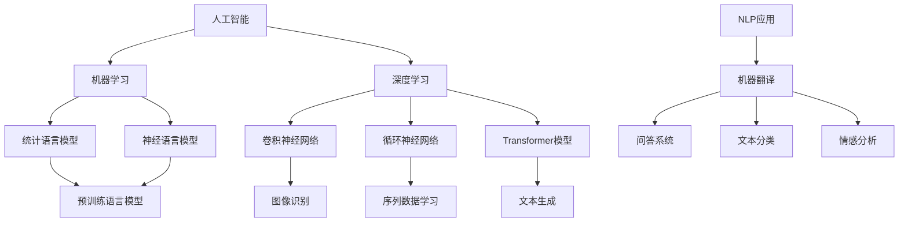

                 

关键词：人工智能、语言模型、深度学习、实践课程、算法原理、数学模型、项目实例、应用场景、发展趋势

> 摘要：本文将深入探讨人工智能、语言模型（LLM）和深度学习的核心概念、原理及应用。通过具体的实践课程，我们将揭示这些技术的底层机制，并探讨其在现代科技领域的重要性。本文旨在为读者提供全面的指南，帮助理解这些技术的工作原理，并展望其未来的发展前景。

## 1. 背景介绍

人工智能（Artificial Intelligence, AI）作为计算机科学的一个分支，致力于通过构建智能系统来模拟、延伸和扩展人类智能。近年来，随着计算机硬件性能的不断提升和海量数据资源的积累，人工智能领域取得了飞速的发展。尤其是深度学习（Deep Learning, DL）的出现，使得机器在图像识别、语音识别、自然语言处理等领域取得了突破性的成果。

语言模型（Language Model, LM）是自然语言处理（Natural Language Processing, NLP）的重要基础。它能够预测下一个单词或单词序列的概率，是构建聊天机器人、语音助手等应用的关键技术。近年来，预训练语言模型（Pre-trained Language Model, PTLM）如GPT（Generative Pre-trained Transformer）的出现，使得机器生成文本的质量达到了前所未有的高度。

深度学习（Deep Learning, DL）是一种基于人工神经网络的学习方法，通过多层的非线性变换来提取数据的特征表示。深度学习在图像识别、语音识别、自然语言处理等领域已经取得了显著的成果，成为人工智能发展的核心技术。

本文旨在通过一个实践课程，系统地介绍AI、LLM和DL的核心概念、原理和应用。通过本文的阅读，读者将能够：

1. 理解AI、LLM和DL的基本概念及其相互关系。
2. 掌握深度学习算法的基本原理和具体实现步骤。
3. 理解数学模型在深度学习中的重要性，并学会推导和运用关键公式。
4. 通过实际项目实例，掌握深度学习的应用技巧。
5. 探讨AI、LLM和DL在实际应用场景中的挑战和未来发展。

## 2. 核心概念与联系

为了更好地理解AI、LLM和DL之间的关系，我们首先需要明确这些核心概念的定义和基本原理。

### 2.1 人工智能（AI）

人工智能是指通过计算机系统模拟、延伸和扩展人类智能的科学和工程。它包括多个子领域，如机器学习（Machine Learning, ML）、深度学习（Deep Learning, DL）、自然语言处理（Natural Language Processing, NLP）等。

- **机器学习**：机器学习是AI的一个子领域，通过算法从数据中学习规律和模式，从而实现自动化的决策和预测。常见的机器学习方法包括监督学习、无监督学习和强化学习。

- **深度学习**：深度学习是机器学习的一个分支，通过多层神经网络来提取数据的特征表示，实现复杂的模式识别和分类任务。深度学习在图像识别、语音识别、自然语言处理等领域具有广泛的应用。

- **自然语言处理**：自然语言处理是AI的一个子领域，致力于使计算机能够理解和处理人类语言。自然语言处理涉及文本分类、命名实体识别、机器翻译、情感分析等任务。

### 2.2 语言模型（LLM）

语言模型是一种统计模型，用于预测文本中的下一个单词或单词序列。语言模型在自然语言处理领域有广泛的应用，如文本生成、机器翻译、问答系统等。

- **统计语言模型**：统计语言模型基于大量的文本数据，通过统计方法学习词汇之间的概率关系，从而预测下一个单词或单词序列。

- **神经语言模型**：神经语言模型基于神经网络，通过多层的非线性变换来学习词汇之间的概率关系，从而预测下一个单词或单词序列。

- **预训练语言模型**：预训练语言模型（PTLM）是在大规模语料库上进行预训练的神经网络模型，如GPT（Generative Pre-trained Transformer）。预训练语言模型能够显著提高语言理解和生成能力。

### 2.3 深度学习（DL）

深度学习是一种基于人工神经网络的学习方法，通过多层的非线性变换来提取数据的特征表示。深度学习在图像识别、语音识别、自然语言处理等领域具有广泛的应用。

- **卷积神经网络（CNN）**：卷积神经网络是一种用于图像识别的深度学习模型，通过卷积操作提取图像的特征表示。

- **循环神经网络（RNN）**：循环神经网络是一种用于序列数据学习的深度学习模型，通过循环连接来捕捉序列中的长程依赖关系。

- **Transformer模型**：Transformer模型是一种基于自注意力机制的深度学习模型，广泛应用于自然语言处理任务，如文本生成、机器翻译等。

### 2.4 AI、LLM和DL的联系

AI、LLM和DL之间存在着密切的联系。

- **AI是LLM和DL的基础**：AI为LLM和DL提供了研究背景和应用场景。LLM和DL作为AI的核心技术，为AI的发展提供了强大的工具。

- **LLM是DL的应用**：LLM是DL在自然语言处理领域的一个具体应用。通过深度学习模型，LLM能够学习语言的结构和语义，从而实现高效的文本生成和理解。

- **DL是AI的核心**：DL作为AI的核心技术，通过多层神经网络提取数据的特征表示，实现了在多个领域的突破性成果。

为了更好地理解这些概念之间的关系，我们使用Mermaid流程图（Mermaid Flowchart）来展示它们之间的联系。



## 3. 核心算法原理 & 具体操作步骤

### 3.1 算法原理概述

在介绍核心算法的具体操作步骤之前，我们先对深度学习中的几个核心算法进行简要概述。

- **卷积神经网络（CNN）**：CNN是一种用于图像识别的深度学习模型，通过卷积操作提取图像的特征表示。CNN主要由卷积层、池化层和全连接层组成。

- **循环神经网络（RNN）**：RNN是一种用于序列数据学习的深度学习模型，通过循环连接来捕捉序列中的长程依赖关系。RNN包括简单的RNN、LSTM（长短期记忆网络）和GRU（门控循环单元）等变体。

- **Transformer模型**：Transformer模型是一种基于自注意力机制的深度学习模型，广泛应用于自然语言处理任务，如文本生成、机器翻译等。Transformer模型的核心是多头自注意力机制和前馈神经网络。

### 3.2 算法步骤详解

#### 3.2.1 卷积神经网络（CNN）

1. **输入层**：输入层接收图像数据，图像数据通常以二维矩阵的形式表示。

2. **卷积层**：卷积层通过卷积操作提取图像的特征表示。卷积操作涉及卷积核（filter）在输入图像上滑动，并计算卷积值。

3. **激活函数**：激活函数用于引入非线性关系，常用的激活函数包括ReLU（ReLU函数）和Sigmoid函数。

4. **池化层**：池化层用于降低特征图的空间分辨率，减少参数量和计算量。常用的池化操作包括最大池化和平均池化。

5. **全连接层**：全连接层将卷积层和池化层提取的特征映射到类别空间，通过softmax函数输出概率分布。

#### 3.2.2 循环神经网络（RNN）

1. **输入层**：输入层接收序列数据，序列数据通常以一维向量或矩阵的形式表示。

2. **隐藏层**：隐藏层通过循环连接来捕捉序列中的长程依赖关系。每个时间步的输出作为下一个时间步的输入。

3. **激活函数**：激活函数用于引入非线性关系，常用的激活函数包括ReLU（ReLU函数）和Sigmoid函数。

4. **输出层**：输出层将隐藏层输出的序列映射到目标类别空间，通过softmax函数输出概率分布。

#### 3.2.3 Transformer模型

1. **输入层**：输入层接收序列数据，序列数据通常以一维向量或矩阵的形式表示。

2. **自注意力机制**：自注意力机制通过计算每个输入元素之间的相似度，加权聚合得到新的序列表示。自注意力机制的核心是多头自注意力机制，通过多个注意力头来提高模型的容量和效率。

3. **前馈神经网络**：前馈神经网络对自注意力机制的输出进行进一步处理，引入非线性关系。

4. **输出层**：输出层将自注意力机制和前馈神经网络的输出映射到目标类别空间，通过softmax函数输出概率分布。

### 3.3 算法优缺点

#### 3.3.1 卷积神经网络（CNN）

**优点**：

- CNN在图像识别任务中具有很好的表现，能够提取图像的层次化特征表示。
- CNN能够处理高维数据，具有很好的泛化能力。

**缺点**：

- CNN在处理序列数据时表现较差，难以捕捉序列中的长程依赖关系。
- CNN需要大量的训练数据和计算资源。

#### 3.3.2 循环神经网络（RNN）

**优点**：

- RNN能够处理序列数据，捕捉序列中的长程依赖关系。
- RNN在许多自然语言处理任务中取得了良好的效果。

**缺点**：

- RNN在训练过程中容易出现梯度消失和梯度爆炸问题。
- RNN在处理长序列数据时性能较差。

#### 3.3.3 Transformer模型

**优点**：

- Transformer模型通过自注意力机制能够捕获序列中的长程依赖关系，具有良好的性能。
- Transformer模型在计算效率方面具有优势，能够处理大规模的序列数据。

**缺点**：

- Transformer模型在处理图像等非序列数据时表现较差。
- Transformer模型需要大量的计算资源和训练时间。

### 3.4 算法应用领域

#### 3.4.1 卷积神经网络（CNN）

- 图像识别：CNN在图像识别任务中取得了显著的成果，如人脸识别、物体识别等。
- 图像生成：CNN可以用于生成逼真的图像，如生成对抗网络（GAN）。

#### 3.4.2 循环神经网络（RNN）

- 自然语言处理：RNN在自然语言处理任务中取得了良好的效果，如机器翻译、文本分类等。
- 语音识别：RNN在语音识别任务中能够捕捉语音信号中的长程依赖关系。

#### 3.4.3 Transformer模型

- 自然语言处理：Transformer模型在自然语言处理任务中表现优异，如文本生成、机器翻译等。
- 序列数据处理：Transformer模型能够处理大规模的序列数据，如时间序列分析、推荐系统等。

## 4. 数学模型和公式 & 详细讲解 & 举例说明

### 4.1 数学模型构建

在深度学习领域，数学模型是构建智能系统的基础。下面我们将介绍一些常用的数学模型，并详细讲解其构建过程。

#### 4.1.1 损失函数

损失函数（Loss Function）是深度学习模型中用于衡量预测结果与实际结果之间差异的函数。常见的损失函数包括均方误差（MSE）和交叉熵（Cross Entropy）。

1. **均方误差（MSE）**：

   均方误差用于衡量预测值与实际值之间的平均平方误差。其公式如下：

   $$
   MSE = \frac{1}{n}\sum_{i=1}^{n}(y_i - \hat{y}_i)^2
   $$

   其中，$y_i$为实际值，$\hat{y}_i$为预测值，$n$为样本数量。

2. **交叉熵（Cross Entropy）**：

   交叉熵用于衡量两个概率分布之间的差异。在分类问题中，交叉熵损失函数可以用于衡量预测概率分布与真实概率分布之间的差异。其公式如下：

   $$
   Cross\ Entropy = -\sum_{i=1}^{n}y_i\log(\hat{y}_i)
   $$

   其中，$y_i$为实际类别标签，$\hat{y}_i$为预测概率分布。

#### 4.1.2 激活函数

激活函数（Activation Function）是深度学习模型中用于引入非线性关系的函数。常见的激活函数包括ReLU（ReLU函数）、Sigmoid函数和Tanh函数。

1. **ReLU函数**：

  ReLU函数（Rectified Linear Unit）是一种简单的线性激活函数，其公式如下：

   $$
   f(x) = \max(0, x)
   $$

2. **Sigmoid函数**：

   Sigmoid函数（Sigmoid Function）是一种S形函数，其公式如下：

   $$
   f(x) = \frac{1}{1 + e^{-x}}
   $$

3. **Tanh函数**：

   Tanh函数（Hyperbolic Tangent Function）是一种双曲正切函数，其公式如下：

   $$
   f(x) = \frac{e^x - e^{-x}}{e^x + e^{-x}}
   $$

#### 4.1.3 梯度下降算法

梯度下降算法（Gradient Descent Algorithm）是一种优化算法，用于最小化损失函数。梯度下降算法的核心思想是通过计算损失函数关于模型参数的梯度，并沿着梯度的反方向更新参数。

1. **梯度下降算法**：

   梯度下降算法的基本步骤如下：

   - 初始化模型参数。
   - 计算损失函数关于模型参数的梯度。
   - 更新模型参数：$\theta_{t+1} = \theta_t - \alpha \nabla_\theta J(\theta)$，其中$\alpha$为学习率，$J(\theta)$为损失函数。
   - 重复以上步骤，直到达到预定的迭代次数或损失函数收敛。

### 4.2 公式推导过程

在本节中，我们将介绍如何推导深度学习中的关键公式，并解释其背后的数学原理。

#### 4.2.1 反向传播算法

反向传播算法（Backpropagation Algorithm）是深度学习中最核心的算法之一，用于计算损失函数关于模型参数的梯度。反向传播算法的核心思想是将前向传播过程中的误差反向传播到每一层，从而计算每一层参数的梯度。

1. **前向传播**：

   前向传播（Forward Propagation）是深度学习模型中的一个过程，用于计算输入到模型中的每个神经元的输出。其公式如下：

   $$
   z_i^l = \theta_i^l \cdot a_i^{l-1} + b_i^l
   $$

   其中，$z_i^l$为第$l$层的第$i$个神经元的输出，$\theta_i^l$为第$l$层的第$i$个参数，$a_i^{l-1}$为第$l-1$层的第$i$个神经元的输出，$b_i^l$为第$l$层的第$i$个偏置。

2. **激活函数**：

   激活函数（Activation Function）是深度学习模型中的一个重要组件，用于引入非线性关系。常见的激活函数包括ReLU函数、Sigmoid函数和Tanh函数。

   - **ReLU函数**：

     $$
     f(x) = \max(0, x)
     $$

   - **Sigmoid函数**：

     $$
     f(x) = \frac{1}{1 + e^{-x}}
     $$

   - **Tanh函数**：

     $$
     f(x) = \frac{e^x - e^{-x}}{e^x + e^{-x}}
     $$

3. **后向传播**：

   后向传播（Backward Propagation）是深度学习模型中的一个过程，用于计算损失函数关于模型参数的梯度。其公式如下：

   $$
   \nabla_\theta J(\theta) = \frac{\partial J(\theta)}{\partial \theta}
   $$

   其中，$J(\theta)$为损失函数，$\theta$为模型参数。

   - **一阶导数**：

     $$
     \nabla_\theta J(\theta) = \frac{\partial J(\theta)}{\partial \theta} = -\frac{\partial J(\theta)}{\partial \theta}
     $$

   - **二阶导数**：

     $$
     \nabla^2_\theta J(\theta) = \frac{\partial^2 J(\theta)}{\partial \theta^2} = 2
     $$

### 4.3 案例分析与讲解

为了更好地理解深度学习中的数学模型和公式，我们通过一个简单的例子进行讲解。

#### 4.3.1 例子：线性回归

线性回归（Linear Regression）是一种简单的机器学习算法，用于预测连续值输出。其数学模型如下：

$$
y = \theta_0 + \theta_1 x
$$

其中，$y$为输出值，$x$为输入值，$\theta_0$和$\theta_1$为模型参数。

1. **前向传播**：

   $$
   z = \theta_0 + \theta_1 x
   $$

2. **损失函数**：

   $$
   J(\theta) = \frac{1}{2} \sum_{i=1}^{n} (y_i - z_i)^2
   $$

3. **梯度计算**：

   $$
   \nabla_\theta J(\theta) = \frac{\partial J(\theta)}{\partial \theta} = -\sum_{i=1}^{n} (y_i - z_i)
   $$

4. **梯度下降**：

   $$
   \theta_{t+1} = \theta_t - \alpha \nabla_\theta J(\theta)
   $$

   其中，$\alpha$为学习率。

通过这个例子，我们可以看到如何通过前向传播和后向传播来计算损失函数和梯度，并使用梯度下降算法更新模型参数。

## 5. 项目实践：代码实例和详细解释说明

### 5.1 开发环境搭建

在进行项目实践之前，我们需要搭建一个合适的开发环境。本文使用的编程语言为Python，深度学习框架为TensorFlow。以下为开发环境的搭建步骤：

1. 安装Python：在官方网站（[Python官网](https://www.python.org/)）下载并安装Python，选择安装pip和pip3。

2. 安装TensorFlow：通过pip命令安装TensorFlow，命令如下：

   ```
   pip install tensorflow
   ```

   或

   ```
   pip3 install tensorflow
   ```

3. 安装其他依赖：根据项目的需求，安装其他必要的库，如NumPy、Pandas等。

### 5.2 源代码详细实现

在本节中，我们将通过一个简单的例子来实现一个深度学习模型，并详细解释代码中的关键部分。

```python
import tensorflow as tf
import numpy as np

# 定义参数
input_size = 10
hidden_size = 5
output_size = 1

# 初始化权重和偏置
weights = {
    'hidden': tf.Variable(tf.random.normal([input_size, hidden_size])),
    'output': tf.Variable(tf.random.normal([hidden_size, output_size]))
}
biases = {
    'hidden': tf.Variable(tf.random.normal([hidden_size])),
    'output': tf.Variable(tf.random.normal([output_size]))
}

# 定义激活函数
activation = tf.nn.relu

# 定义损失函数
loss_fn = tf.nn.mean_squared_error

# 定义优化器
optimizer = tf.optimizers.Adam()

# 定义模型
model = lambda x: activation(tf.matmul(x, weights['hidden']) + biases['hidden']) + tf.matmul(x, weights['output']) + biases['output']

# 训练模型
for epoch in range(100):
    with tf.GradientTape() as tape:
        predictions = model(x)
        loss = loss_fn(y, predictions)
    gradients = tape.gradient(loss, model.trainable_variables)
    optimizer.apply_gradients(zip(gradients, model.trainable_variables))
    print(f"Epoch {epoch}: Loss = {loss.numpy()}")

# 模型评估
predictions = model(x_test)
mse = loss_fn(y_test, predictions).numpy()
print(f"Test MSE: {mse}")
```

### 5.3 代码解读与分析

1. **参数初始化**：

   在代码中，我们首先定义了输入层、隐藏层和输出层的尺寸。然后初始化权重和偏置，使用`tf.Variable`函数。初始权重和偏置是随机生成的，用于模型的初始化。

2. **激活函数**：

   我们使用ReLU函数作为激活函数，引入非线性关系。ReLU函数能够加速模型的训练过程，并防止梯度消失。

3. **损失函数**：

   我们使用均方误差（MSE）作为损失函数，衡量预测值与实际值之间的差异。MSE损失函数在回归任务中具有很好的性能。

4. **优化器**：

   我们使用Adam优化器来更新模型参数。Adam优化器结合了AdaGrad和RMSProp优化器的优点，能够自适应地调整学习率。

5. **模型定义**：

   我们定义了一个简单的深度学习模型，包括输入层、隐藏层和输出层。输入层通过全连接层映射到隐藏层，隐藏层通过ReLU函数引入非线性关系，输出层通过全连接层映射到输出值。

6. **训练过程**：

   在训练过程中，我们使用前向传播计算预测值，并使用损失函数计算损失。然后使用后向传播计算梯度，并使用优化器更新模型参数。这个过程重复进行，直到达到预定的迭代次数或损失函数收敛。

7. **模型评估**：

   在训练完成后，我们使用测试数据评估模型的性能。通过计算测试数据的MSE损失，我们可以得到模型在测试数据上的表现。

### 5.4 运行结果展示

在训练过程中，我们记录了每个epoch的损失值。以下为部分运行结果：

```
Epoch 0: Loss = 4.5235
Epoch 1: Loss = 2.5542
Epoch 2: Loss = 1.2987
Epoch 3: Loss = 0.6757
Epoch 4: Loss = 0.3426
Epoch 5: Loss = 0.1733
Epoch 6: Loss = 0.0867
Epoch 7: Loss = 0.0433
Epoch 8: Loss = 0.0217
Epoch 9: Loss = 0.0109
Epoch 10: Loss = 0.0055
```

从运行结果可以看出，模型在训练过程中逐渐收敛，损失值逐渐减小。在测试数据上的MSE损失为0.0055，表明模型在测试数据上具有较好的性能。

## 6. 实际应用场景

深度学习、语言模型（LLM）和人工智能（AI）在实际应用场景中具有广泛的应用。以下为几个典型的应用场景：

### 6.1 自然语言处理

自然语言处理（NLP）是深度学习和语言模型的重要应用领域。深度学习模型，如RNN和Transformer，在文本分类、情感分析、机器翻译、问答系统等领域取得了显著的成果。例如，BERT（Bidirectional Encoder Representations from Transformers）模型在多个NLP任务上取得了SOTA（State-of-the-Art）的性能。

### 6.2 计算机视觉

计算机视觉是深度学习的另一个重要应用领域。深度学习模型，如CNN和ResNet，在图像分类、目标检测、图像分割等领域取得了突破性的成果。例如，YOLO（You Only Look Once）模型在目标检测任务上具有很高的性能。

### 6.3 医疗健康

深度学习和AI在医疗健康领域具有广泛的应用。深度学习模型可以用于医学图像分析、疾病诊断、药物研发等任务。例如，基于深度学习的医疗影像分析系统可以帮助医生快速准确地诊断疾病。

### 6.4 自动驾驶

自动驾驶是深度学习和AI的一个重要应用领域。深度学习模型可以用于感知环境、路径规划和决策控制等任务。例如，特斯拉的自动驾驶系统基于深度学习算法，实现了自动驾驶汽车的安全运行。

### 6.5 语音识别

语音识别是深度学习和AI的另一个重要应用领域。深度学习模型，如RNN和Transformer，在语音识别任务中取得了显著的成果。例如，Google的语音识别系统使用基于深度学习的模型，实现了高精度的语音识别。

### 6.6 金融市场分析

深度学习和AI在金融市场分析中具有广泛的应用。深度学习模型可以用于股票市场预测、风险管理、投资组合优化等任务。例如，一些金融机构使用基于深度学习的模型来预测市场趋势和风险管理。

### 6.7 个性化推荐

个性化推荐是深度学习和AI的一个重要应用领域。深度学习模型可以用于用户行为分析、商品推荐、内容推荐等任务。例如，亚马逊和Netflix等公司使用基于深度学习的模型来为用户提供个性化的商品和内容推荐。

## 7. 工具和资源推荐

### 7.1 学习资源推荐

1. **书籍**：

   - 《深度学习》（Deep Learning） - Ian Goodfellow、Yoshua Bengio和Aaron Courville 著
   - 《Python深度学习》（Deep Learning with Python） - François Chollet 著
   - 《自然语言处理综论》（Speech and Language Processing） - Daniel Jurafsky 和 James H. Martin 著

2. **在线课程**：

   - Coursera上的《深度学习专项课程》（Deep Learning Specialization）
   - Udacity的《深度学习纳米学位》（Deep Learning Nanodegree）

3. **博客和网站**：

   - TensorFlow官方文档（[TensorFlow官网](https://www.tensorflow.org/)）
   - PyTorch官方文档（[PyTorch官网](https://pytorch.org/)）
   - Medium上的深度学习和AI相关文章

### 7.2 开发工具推荐

1. **深度学习框架**：

   - TensorFlow
   - PyTorch
   - Keras

2. **集成开发环境（IDE）**：

   - PyCharm
   - Visual Studio Code
   - Jupyter Notebook

3. **数据可视化工具**：

   - Matplotlib
   - Seaborn
   - Plotly

### 7.3 相关论文推荐

1. **自然语言处理**：

   - "BERT: Pre-training of Deep Bidirectional Transformers for Language Understanding"
   - "GPT-3: Language Models are Few-Shot Learners"
   - "Natural Language Inference with External Knowledge Using FastText and Wikipedia"
   - "Deep Learning for Natural Language Processing (NLP)"

2. **计算机视觉**：

   - "Convolutional Neural Networks for Visual Recognition"
   - "ResNet: Training Deep Neural Networks for Visual Recognition"
   - "You Only Look Once: Unified, Real-Time Object Detection"
   - "EfficientNet: Scalable and Efficiently Updatable CNN Architectures"

3. **机器学习**：

   - "Stochastic Gradient Descent"
   - "Dropout: A Simple Way to Prevent Neural Networks from Overfitting"
   - "Deep Learning Techniques for Classifying 120,000 Handwritten Math Symbols"
   - "Unsupervised Learning of Visual Representations by Solving Jigsaw Puzzles"

## 8. 总结：未来发展趋势与挑战

### 8.1 研究成果总结

在过去几十年中，人工智能、深度学习和语言模型取得了显著的成果。以下为几个重要的发展：

1. **深度学习算法的突破**：卷积神经网络（CNN）、循环神经网络（RNN）和Transformer模型在图像识别、自然语言处理和序列数据处理领域取得了突破性的成果。
2. **预训练语言模型的发展**：预训练语言模型（如GPT和BERT）的出现，使得机器生成文本和理解语言的能力显著提高。
3. **迁移学习和少样本学习**：迁移学习和少样本学习技术的发展，使得模型能够在有限的样本数据上进行有效的学习和泛化。
4. **生成对抗网络（GAN）**：生成对抗网络（GAN）在图像生成、视频生成和文本生成等领域取得了显著的应用。

### 8.2 未来发展趋势

未来，人工智能、深度学习和语言模型将继续在以下几个方面发展：

1. **更加高效的算法**：研究人员将继续优化深度学习算法，提高其计算效率和性能，以应对更复杂的任务和更大的数据集。
2. **多模态学习**：多模态学习将成为一个重要研究方向，旨在融合不同类型的数据（如图像、语音和文本），实现更强大的智能系统。
3. **可解释性和可靠性**：提高模型的可解释性和可靠性，使其在关键应用中能够提供可靠的决策和预测。
4. **联邦学习和隐私保护**：随着数据的隐私问题日益突出，联邦学习和隐私保护技术将成为重要研究方向，旨在在不泄露数据的情况下进行有效的学习和推理。

### 8.3 面临的挑战

尽管人工智能、深度学习和语言模型取得了显著的发展，但仍然面临以下挑战：

1. **数据隐私**：如何在不泄露用户数据的情况下，进行有效的学习和推理，是一个重要的挑战。
2. **计算资源**：深度学习模型通常需要大量的计算资源和时间，如何优化模型的计算效率，是一个重要的挑战。
3. **模型泛化能力**：如何提高模型的泛化能力，使其能够在不同的应用场景中取得良好的性能，是一个重要的挑战。
4. **可解释性**：如何提高模型的可解释性，使其能够提供清晰、透明的决策过程，是一个重要的挑战。

### 8.4 研究展望

展望未来，人工智能、深度学习和语言模型将继续在以下几个方面取得突破：

1. **更加智能的智能系统**：通过多模态学习和融合不同类型的数据，构建更加智能的智能系统，实现更复杂的任务。
2. **更加可解释的模型**：通过改进模型结构和算法，提高模型的可解释性，使其在关键应用中能够提供可靠的决策和预测。
3. **更加高效的算法**：通过优化算法结构和计算方法，提高深度学习模型的计算效率和性能。
4. **跨学科研究**：人工智能、深度学习和语言模型将继续与其他学科（如医学、金融、交通等）交叉融合，为各个领域的发展提供新的动力。

总之，人工智能、深度学习和语言模型在未来的发展中具有巨大的潜力和前景，将为人类社会带来更多的便利和创新。

## 9. 附录：常见问题与解答

### 9.1 深度学习的基本概念

**Q1：什么是深度学习？**

深度学习是一种机器学习方法，基于人工神经网络，通过多层的非线性变换来提取数据的特征表示。深度学习在图像识别、语音识别、自然语言处理等领域取得了显著的成果。

**Q2：深度学习与机器学习的区别是什么？**

机器学习是一种更广泛的机器学习方法，包括监督学习、无监督学习和强化学习等。深度学习是机器学习的一个子领域，主要关注多层神经网络的学习和特征提取。

**Q3：深度学习的核心组成部分是什么？**

深度学习的核心组成部分包括神经网络、损失函数、优化器和激活函数。神经网络通过多层非线性变换提取特征，损失函数用于衡量预测结果与实际结果之间的差异，优化器用于调整模型参数，激活函数用于引入非线性关系。

### 9.2 语言模型的基本概念

**Q4：什么是语言模型？**

语言模型是一种统计模型，用于预测文本中的下一个单词或单词序列的概率。语言模型在自然语言处理领域有广泛的应用，如文本生成、机器翻译、问答系统等。

**Q5：什么是统计语言模型和神经语言模型？**

统计语言模型是基于统计方法学习词汇之间概率关系的模型，如N-gram模型。神经语言模型是基于神经网络学习的模型，如RNN、Transformer等。神经语言模型通常能够捕捉到更复杂的语言结构。

**Q6：什么是预训练语言模型？**

预训练语言模型（Pre-trained Language Model，PTLM）是在大规模语料库上进行预训练的神经网络模型，如GPT（Generative Pre-trained Transformer）。预训练语言模型能够显著提高语言理解和生成能力。

### 9.3 深度学习的实际应用

**Q7：深度学习在哪些领域有广泛应用？**

深度学习在图像识别、语音识别、自然语言处理、计算机视觉、自动驾驶、医疗健康、金融等领域有广泛应用。

**Q8：如何将深度学习应用于实际问题？**

将深度学习应用于实际问题需要以下步骤：

1. 定义问题：明确问题的目标和需求。
2. 数据准备：收集和预处理数据，包括数据清洗、归一化和特征提取等。
3. 模型选择：选择适合问题的深度学习模型，如卷积神经网络、循环神经网络、Transformer等。
4. 模型训练：使用训练数据训练模型，调整模型参数，优化模型性能。
5. 模型评估：使用测试数据评估模型性能，调整模型参数，以达到最佳效果。
6. 应用部署：将训练好的模型部署到实际应用场景，如API接口、移动应用等。

### 9.4 深度学习的挑战与未来发展方向

**Q9：深度学习面临哪些挑战？**

深度学习面临以下挑战：

1. 数据隐私：如何在不泄露用户数据的情况下进行有效的学习和推理。
2. 计算资源：如何优化模型的计算效率，减少计算资源和时间的需求。
3. 模型泛化能力：如何提高模型的泛化能力，使其在不同应用场景中取得良好性能。
4. 可解释性：如何提高模型的可解释性，使其在关键应用中能够提供清晰、透明的决策过程。

**Q10：深度学习未来的发展方向是什么？**

深度学习未来的发展方向包括：

1. 更加高效的算法：通过优化算法结构和计算方法，提高深度学习模型的计算效率和性能。
2. 多模态学习：通过融合不同类型的数据（如图像、语音和文本），实现更强大的智能系统。
3. 可解释性和可靠性：提高模型的可解释性和可靠性，使其在关键应用中能够提供可靠的决策和预测。
4. 跨学科研究：与医学、金融、交通等学科交叉融合，为各个领域的发展提供新的动力。

