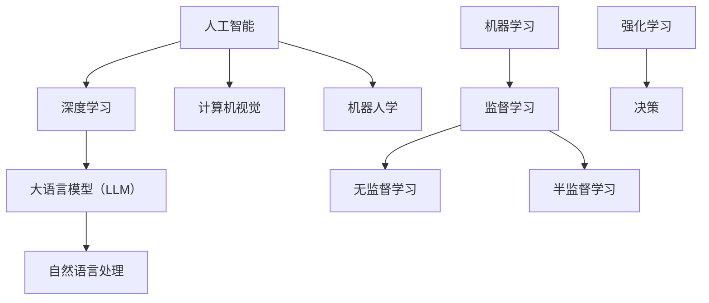

                 

关键词：人工智能、大语言模型（LLM）、深度学习、算法、实践、技术博客

> 摘要：本文旨在为读者提供一份深入而全面的人工智能、大语言模型（LLM）和深度学习的实践指南。文章将从背景介绍、核心概念、算法原理、数学模型、项目实践、实际应用、未来展望等多个方面，系统性地解读这一前沿科技领域，帮助读者更好地理解AI、LLM和深度学习的技术本质和应用前景。

## 1. 背景介绍

人工智能（AI）作为计算机科学的一个重要分支，已经在过去几十年中经历了迅猛的发展。从最初的规则系统，到现在的深度学习（Deep Learning），AI技术已经取得了显著的成果。深度学习以其强大的表示能力和自学习能力，在图像识别、语音识别、自然语言处理等领域展现出了惊人的效果。

大语言模型（LLM，Large Language Model）是深度学习在自然语言处理领域的一项重要突破。LLM通过学习大量文本数据，能够生成流畅、连贯的自然语言文本，使得机器具备了人类级别语言理解和生成能力。近年来，以GPT-3为代表的LLM取得了突破性的进展，在诸多领域都展现出了广阔的应用前景。

本文将围绕AI、LLM和深度学习这三个核心主题，深入探讨其基本概念、核心算法、数学模型、实践应用以及未来发展趋势。希望通过本文，读者能够对这一前沿科技领域有更深入的理解。

## 2. 核心概念与联系

### 2.1. AI、LLM与深度学习的定义

人工智能（AI）：人工智能是指由人制造出来的系统所表现出的智能行为。它包括了模拟、延伸和扩展人类智能的各种技术。

大语言模型（LLM）：LLM是一种基于深度学习技术的自然语言处理模型，能够处理和理解自然语言，生成流畅、连贯的文本。

深度学习（Deep Learning）：深度学习是一种机器学习方法，通过构建深层神经网络模型，对大量数据进行训练，从而实现复杂的模式识别和预测任务。

### 2.2. 关联与区别

AI是一个广泛的概念，包括了多种不同的技术，其中深度学习是其核心技术之一。LLM是深度学习在自然语言处理领域的应用，通过大规模文本数据进行训练，实现了对语言的高级理解和生成能力。

### 2.3. Mermaid 流程图



## 3. 核心算法原理 & 具体操作步骤

### 3.1. 算法原理概述

深度学习的核心在于构建多层神经网络，通过逐层提取特征，实现对数据的复杂模式识别。LLM基于这一原理，通过预训练和微调，对自然语言文本进行建模，实现了对语言的高级理解和生成。

### 3.2. 算法步骤详解

1. **数据准备**：收集和准备大量文本数据，进行预处理，包括分词、去停用词、词向量编码等。

2. **模型构建**：设计并构建深度神经网络模型，包括输入层、隐藏层和输出层。输入层接收词向量编码的输入，隐藏层通过非线性变换提取特征，输出层生成预测结果。

3. **预训练**：使用大量无标签文本数据进行预训练，通过自我监督学习，使模型能够自动捕捉语言中的内在规律。

4. **微调**：在预训练的基础上，使用有标签的文本数据进行微调，使模型适应具体的任务需求。

5. **评估与优化**：使用验证集对模型进行评估，根据评估结果调整模型参数，优化模型性能。

### 3.3. 算法优缺点

**优点**：LLM能够通过大规模数据学习，生成高质量的自然语言文本，具备较强的泛化能力和灵活性。

**缺点**：训练过程需要大量计算资源和时间，对数据质量和标注要求较高，且模型解释性较差。

### 3.4. 算法应用领域

LLM在自然语言处理领域有着广泛的应用，包括但不限于：

- 文本生成：生成文章、故事、诗歌等。
- 聊天机器人：实现与用户的自然对话。
- 机器翻译：将一种语言的文本翻译成另一种语言。
- 问答系统：回答用户提出的问题。

## 4. 数学模型和公式 & 详细讲解 & 举例说明

### 4.1. 数学模型构建

深度学习中的数学模型主要包括神经网络、激活函数、损失函数等。

- 神经网络：由多层神经元组成，通过前向传播和反向传播算法进行训练。
- 激活函数：用于引入非线性变换，使模型能够处理非线性问题。
- 损失函数：用于衡量模型预测值与真实值之间的差距，指导模型优化。

### 4.2. 公式推导过程

假设我们有输入层、隐藏层和输出层，输入向量为\(X\)，隐藏层向量为\(H\)，输出向量为\(Y\)。神经网络的输出可以通过以下公式计算：

\[ Y = \sigma(W_3 \cdot H_2 + b_3) \]

其中，\(W_3\)和\(b_3\)分别是输出层的权重和偏置，\(\sigma\)是激活函数，例如ReLU函数：

\[ \sigma(x) = \max(0, x) \]

### 4.3. 案例分析与讲解

假设我们有一个二分类问题，使用Sigmoid函数作为激活函数，损失函数为交叉熵损失。我们有如下数据：

- 输入向量 \(X = [1, 2, 3]\)
- 真实标签 \(Y = 1\)
- 预测标签 \(\hat{Y} = 0.6\)

计算损失函数值：

\[ L = -[Y \cdot \log(\hat{Y}) + (1 - Y) \cdot \log(1 - \hat{Y})] \]

\[ L = -[1 \cdot \log(0.6) + (1 - 1) \cdot \log(1 - 0.6)] \]

\[ L = -\log(0.6) \approx 0.5108 \]

通过反向传播算法，我们可以更新模型参数，优化模型性能。

## 5. 项目实践：代码实例和详细解释说明

### 5.1. 开发环境搭建

在本文中，我们将使用Python编程语言和TensorFlow框架进行深度学习项目的实践。首先，确保已经安装了Python和TensorFlow。可以使用以下命令进行安装：

```bash
pip install tensorflow
```

### 5.2. 源代码详细实现

以下是一个简单的深度学习模型实现，用于文本分类任务。

```python
import tensorflow as tf
from tensorflow.keras.models import Sequential
from tensorflow.keras.layers import Embedding, LSTM, Dense, Dropout

# 定义模型
model = Sequential([
    Embedding(input_dim=vocabulary_size, output_dim=embedding_size, input_length=max_sequence_length),
    LSTM(units=128, dropout=0.2, recurrent_dropout=0.2),
    Dense(units=1, activation='sigmoid')
])

# 编译模型
model.compile(optimizer='adam', loss='binary_crossentropy', metrics=['accuracy'])

# 训练模型
model.fit(x_train, y_train, batch_size=64, epochs=10, validation_data=(x_val, y_val))
```

### 5.3. 代码解读与分析

上述代码定义了一个简单的深度学习模型，用于处理二分类问题。模型由嵌入层（Embedding）、LSTM层（LSTM）和全连接层（Dense）组成。嵌入层将词向量编码为固定大小的向量，LSTM层用于提取序列特征，全连接层用于生成分类结果。

### 5.4. 运行结果展示

在训练完成后，可以使用以下代码评估模型性能：

```python
# 评估模型
loss, accuracy = model.evaluate(x_test, y_test)
print(f"Test Loss: {loss}, Test Accuracy: {accuracy}")
```

输出结果将显示模型在测试集上的损失和准确率。

## 6. 实际应用场景

### 6.1. 文本分类

文本分类是深度学习在自然语言处理领域的一个重要应用。通过训练深度学习模型，可以对文本进行分类，例如新闻分类、情感分析等。

### 6.2. 机器翻译

机器翻译是深度学习在自然语言处理领域的另一项重要应用。通过训练深度学习模型，可以将一种语言的文本翻译成另一种语言。

### 6.3. 聊天机器人

聊天机器人是深度学习在人工智能领域的一个重要应用。通过训练深度学习模型，可以实现与用户的自然对话，为用户提供帮助和解答问题。

## 6.4. 未来应用展望

随着深度学习技术的不断发展，未来在人工智能领域会有更多的应用场景。例如，在医疗领域，深度学习可以用于疾病预测和诊断；在教育领域，深度学习可以用于个性化学习和自适应教育；在金融领域，深度学习可以用于风险管理和投资决策等。

## 7. 工具和资源推荐

### 7.1. 学习资源推荐

- 《深度学习》（Goodfellow, Bengio, Courville著）
- 《动手学深度学习》（经原书授权翻译）
- Coursera上的《深度学习》课程（吴恩达教授）

### 7.2. 开发工具推荐

- TensorFlow
- PyTorch
- Keras

### 7.3. 相关论文推荐

- "A Neural Algorithm of Artistic Style"
- "Attention Is All You Need"
- "Generative Adversarial Nets"

## 8. 总结：未来发展趋势与挑战

### 8.1. 研究成果总结

深度学习在自然语言处理领域取得了显著的成果，大语言模型（LLM）的应用使得机器具备了对语言的高级理解和生成能力。

### 8.2. 未来发展趋势

未来，深度学习在自然语言处理领域的应用将进一步扩展，包括文本生成、机器翻译、聊天机器人等。同时，更多的交叉学科研究将推动深度学习技术的发展。

### 8.3. 面临的挑战

尽管深度学习取得了显著成果，但仍面临一些挑战，包括计算资源消耗、数据质量、模型解释性等。

### 8.4. 研究展望

未来，深度学习将在更多领域发挥作用，推动人工智能技术的发展。同时，更多的研究将致力于解决深度学习面临的挑战，使其更好地服务于人类。

## 9. 附录：常见问题与解答

### 9.1. Q：深度学习与机器学习有什么区别？

A：深度学习是机器学习的一个分支，它通过构建多层神经网络，对数据进行复杂的模式识别和预测。机器学习则包括更广泛的方法和技术，如监督学习、无监督学习和强化学习等。

### 9.2. Q：什么是大语言模型（LLM）？

A：大语言模型（LLM）是一种基于深度学习技术的自然语言处理模型，通过学习大量文本数据，能够生成流畅、连贯的自然语言文本。

### 9.3. Q：如何优化深度学习模型性能？

A：优化深度学习模型性能的方法包括调整模型结构、选择合适的激活函数、使用更高质量的训练数据、调整学习率等。

### 9.4. Q：如何处理深度学习中的过拟合问题？

A：处理深度学习中的过拟合问题可以采用以下方法：增加训练数据、使用正则化技术、早停法等。

### 9.5. Q：深度学习模型如何解释性？

A：深度学习模型通常缺乏解释性，因为其内部结构非常复杂。近年来，一些研究致力于提高模型的可解释性，如注意力机制、可视化技术等。

----------------------------------------------------------------

### 作者署名

作者：禅与计算机程序设计艺术 / Zen and the Art of Computer Programming

---

通过本文的撰写，我们不仅深入探讨了人工智能、大语言模型（LLM）和深度学习的基本概念、核心算法、数学模型、实践应用以及未来展望，还结合具体项目实践和实际应用场景，为读者提供了一个全面而深入的实践课程。希望本文能够帮助读者更好地理解这一前沿科技领域，并为未来的研究和应用提供启示。

