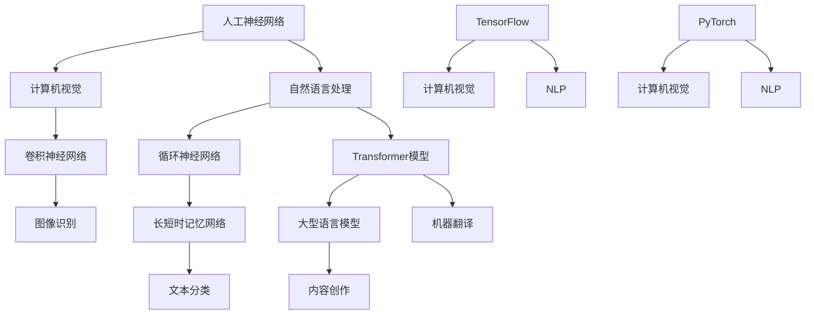

                 

关键词：人工智能，大语言模型，深度学习，技术课程，编程实践，数学模型，未来展望

> 摘要：本文旨在深入探讨人工智能（AI）、大型语言模型（LLM）以及深度学习的核心概念、原理和应用。通过这门全面的课程，读者将全面了解这些技术领域的最新发展，掌握关键算法和技术，并学会如何将它们应用于实际问题。本文不仅提供了理论知识，还包括了实际的代码实例和实践指南，旨在帮助读者在AI和深度学习领域取得实质性进展。

## 1. 背景介绍

人工智能（Artificial Intelligence，简称AI）作为计算机科学的一个分支，致力于开发能够执行复杂任务、模拟人类智能行为的技术。近年来，随着计算能力的提升和数据量的爆炸性增长，AI技术取得了显著的进展，尤其是在深度学习（Deep Learning）和大型语言模型（Large Language Model，简称LLM）方面。

深度学习是机器学习的一个子领域，基于人工神经网络（Artificial Neural Networks，ANNs）的设计和训练，通过多层非线性变换来学习复杂的数据特征。深度学习的成功主要得益于大数据和强大计算能力的支持，它在图像识别、语音识别、自然语言处理等多个领域取得了突破性成果。

大型语言模型是一种特殊的深度学习模型，通过对海量文本数据进行预训练，使其具备了强大的文本理解和生成能力。LLM的应用范围广泛，从智能助手到内容创作，从机器翻译到代码生成，都在不断扩展。

## 2. 核心概念与联系

为了更好地理解AI、LLM和深度学习的核心概念及其之间的联系，我们首先需要了解以下几个关键概念：

### 2.1 人工神经网络（ANNs）

人工神经网络是模仿人脑神经元结构和功能的计算模型。每个神经元（或称为节点）接收多个输入信号，通过加权求和后加上偏置，然后通过一个激活函数产生输出。神经网络通过反向传播算法不断调整权重和偏置，使得模型能够学会对输入数据进行分类、回归或其他形式的预测。

### 2.2 计算机视觉

计算机视觉是AI的一个重要分支，致力于使计算机具备解析和解释图像和视频数据的能力。卷积神经网络（Convolutional Neural Networks，CNNs）是计算机视觉领域的主流模型，通过卷积层、池化层和全连接层等结构，实现对图像的层次特征提取和分类。

### 2.3 自然语言处理（NLP）

自然语言处理是使计算机能够理解和处理人类语言的技术。传统的NLP方法依赖于规则和统计模型，而深度学习的方法则通过神经网络直接从大规模文本数据中学习语言特征。循环神经网络（Recurrent Neural Networks，RNNs）、长短时记忆网络（Long Short-Term Memory，LSTM）和Transformer模型是NLP领域的重要进展。

### 2.4 大型语言模型（LLM）

大型语言模型是一种基于Transformer架构的深度学习模型，通过对海量文本数据（包括网页、书籍、新闻等）进行预训练，使其具备了强大的文本理解和生成能力。BERT（Bidirectional Encoder Representations from Transformers）、GPT（Generative Pre-trained Transformer）和T5（Text-To-Text Transfer Transformer）是当前最流行的大型语言模型。

### 2.5 深度学习框架

深度学习框架是用于构建和训练深度学习模型的软件库，它提供了丰富的工具和接口，简化了模型的开发过程。TensorFlow、PyTorch和JAX是当前最受欢迎的深度学习框架。

### 2.6 Mermaid流程图

为了更好地展示这些概念和它们之间的联系，我们可以使用Mermaid流程图来可视化。以下是一个示例：



## 3. 核心算法原理 & 具体操作步骤

### 3.1 算法原理概述

在本节中，我们将详细探讨深度学习中的几个核心算法，包括卷积神经网络（CNN）、循环神经网络（RNN）、Transformer模型以及大型语言模型（LLM）。

### 3.2 算法步骤详解

#### 3.2.1 卷积神经网络（CNN）

1. 输入层：接收二维图像数据。
2. 卷积层：使用卷积核在图像上滑动，提取局部特征。
3. 池化层：对卷积层的输出进行下采样，减少数据维度。
4. 全连接层：将池化层的输出映射到类别标签。
5. 输出层：输出分类结果。

#### 3.2.2 循环神经网络（RNN）

1. 输入层：接收序列数据。
2. 循环层：每个时间步的输出作为下一个时间步的输入。
3. 隐藏层：通过加权和激活函数生成序列的表示。
4. 输出层：将序列的表示映射到预测标签。

#### 3.2.3 Transformer模型

1. 输入层：接收序列数据。
2. 自注意力层：计算序列中每个元素对其他元素的注意力分数。
3. 交叉注意力层：将查询（Q）、键（K）和值（V）进行对应，生成注意力权重。
4. 输出层：将注意力加权后的序列输出。

#### 3.2.4 大型语言模型（LLM）

1. 数据预处理：对文本数据进行分词、去噪等预处理。
2. 预训练：使用未标注的大量文本数据进行预训练，学习文本的内在结构。
3. 微调：在特定任务上使用标注数据进行微调，优化模型表现。
4. 应用：将微调后的模型应用于实际任务，如文本分类、机器翻译、代码生成等。

### 3.3 算法优缺点

#### 卷积神经网络（CNN）

- **优点**：擅长处理二维数据，如图像，可以提取局部特征。
- **缺点**：不适合处理序列数据，难以捕捉长距离依赖关系。

#### 循环神经网络（RNN）

- **优点**：能够处理序列数据，捕捉短距离依赖关系。
- **缺点**：难以捕捉长距离依赖关系，容易产生梯度消失或爆炸问题。

#### Transformer模型

- **优点**：能够处理任意长度的序列，捕捉长距离依赖关系。
- **缺点**：计算复杂度高，内存占用大。

#### 大型语言模型（LLM）

- **优点**：具有强大的文本理解和生成能力，适用于多种自然语言处理任务。
- **缺点**：训练成本高，需要大量的数据和计算资源。

### 3.4 算法应用领域

- **计算机视觉**：图像识别、目标检测、图像分割等。
- **自然语言处理**：文本分类、机器翻译、问答系统、情感分析等。
- **语音识别**：语音转文本、语音合成等。
- **推荐系统**：基于用户历史行为和内容进行推荐。

## 4. 数学模型和公式 & 详细讲解 & 举例说明

### 4.1 数学模型构建

在深度学习中，数学模型是核心部分。以下我们将构建几个基本的数学模型，用于理解和解释深度学习中的关键概念。

#### 4.1.1 线性模型

线性模型是最简单的深度学习模型，其形式为：

\[ y = \beta_0 + \beta_1 \cdot x \]

其中，\( y \) 是输出，\( x \) 是输入，\( \beta_0 \) 和 \( \beta_1 \) 是模型参数。

#### 4.1.2 线性回归模型

线性回归模型是对线性模型的一种扩展，用于预测连续值输出。其形式为：

\[ y = \beta_0 + \sum_{i=1}^{n} \beta_i \cdot x_i \]

其中，\( x_i \) 是第 \( i \) 个输入特征，\( \beta_i \) 是相应的权重。

#### 4.1.3 逻辑回归模型

逻辑回归模型是一种用于分类的线性模型，其形式为：

\[ P(y=1) = \frac{1}{1 + e^{-(\beta_0 + \beta_1 \cdot x)}} \]

其中，\( P(y=1) \) 是输出为 1 的概率。

### 4.2 公式推导过程

在本节中，我们将对上述模型进行推导，并解释其背后的数学原理。

#### 4.2.1 线性模型推导

线性模型的推导相对简单。假设我们有 \( n \) 个样本 \( (x_1, y_1), (x_2, y_2), ..., (x_n, y_n) \)，我们的目标是找到最佳的 \( \beta_0 \) 和 \( \beta_1 \) 使得预测值 \( \hat{y} \) 最接近真实值 \( y \)。

我们可以使用最小二乘法来求解：

\[ \min_{\beta_0, \beta_1} \sum_{i=1}^{n} (y_i - \beta_0 - \beta_1 \cdot x_i)^2 \]

通过求导并令导数为零，我们可以得到：

\[ \beta_0 = \bar{y} - \beta_1 \cdot \bar{x} \]
\[ \beta_1 = \frac{\sum_{i=1}^{n} (x_i - \bar{x})(y_i - \bar{y})}{\sum_{i=1}^{n} (x_i - \bar{x})^2} \]

其中，\( \bar{x} \) 和 \( \bar{y} \) 分别是输入和输出的均值。

#### 4.2.2 线性回归模型推导

线性回归模型的推导类似于线性模型，但我们需要考虑多个输入特征。我们假设有 \( n \) 个样本 \( (x_1, y_1), (x_2, y_2), ..., (x_n, y_n) \)，我们的目标是找到最佳的 \( \beta_0, \beta_1, ..., \beta_n \)。

同样，我们使用最小二乘法来求解：

\[ \min_{\beta_0, \beta_1, ..., \beta_n} \sum_{i=1}^{n} (y_i - \beta_0 - \beta_1 \cdot x_i - ... - \beta_n \cdot x_n)^2 \]

通过求导并令导数为零，我们可以得到：

\[ \beta_0 = \bar{y} - \sum_{i=1}^{n} \beta_i \cdot \bar{x_i} \]
\[ \beta_i = \frac{\sum_{i=1}^{n} (x_i - \bar{x_i})(y_i - \bar{y})}{\sum_{i=1}^{n} (x_i - \bar{x_i})^2} \]

#### 4.2.3 逻辑回归模型推导

逻辑回归模型的推导涉及到概率论和指数函数的性质。我们首先需要定义逻辑函数 \( \sigma(x) = \frac{1}{1 + e^{-x}} \)，它可以将实数值映射到 \( (0, 1) \) 区间。

我们的目标是最小化损失函数：

\[ \min_{\beta_0, \beta_1} \sum_{i=1}^{n} (-y_i \cdot \log(P(y=1)) - (1 - y_i) \cdot \log(1 - P(y=1))) \]

通过求导并令导数为零，我们可以得到：

\[ \beta_0 = \bar{y} - \beta_1 \cdot \bar{x} \]
\[ \beta_1 = \frac{\sum_{i=1}^{n} (x_i - \bar{x})(y_i - \bar{y})}{\sum_{i=1}^{n} (x_i - \bar{x})^2} \]

### 4.3 案例分析与讲解

为了更好地理解上述数学模型，我们可以通过一个简单的案例来分析。

假设我们有一个包含两个特征 \( x_1 \) 和 \( x_2 \) 的线性回归问题，目标是预测房价。我们使用以下数据：

| \( x_1 \) | \( x_2 \) | \( y \) |
|-----------|-----------|---------|
| 1         | 2         | 3000    |
| 2         | 3         | 3200    |
| 3         | 4         | 3400    |
| 4         | 5         | 3600    |

我们的目标是找到最佳的 \( \beta_0, \beta_1, \beta_2 \)。

首先，我们计算输入和输出的均值：

\[ \bar{x_1} = 2.5, \bar{x_2} = 3.5, \bar{y} = 3250 \]

然后，我们使用最小二乘法求解 \( \beta_0, \beta_1, \beta_2 \)：

\[ \beta_0 = \bar{y} - \beta_1 \cdot \bar{x_1} - \beta_2 \cdot \bar{x_2} \]
\[ \beta_1 = \frac{\sum_{i=1}^{n} (x_{1i} - \bar{x_1})(y_i - \bar{y})}{\sum_{i=1}^{n} (x_{1i} - \bar{x_1})^2} \]
\[ \beta_2 = \frac{\sum_{i=1}^{n} (x_{2i} - \bar{x_2})(y_i - \bar{y})}{\sum_{i=1}^{n} (x_{2i} - \bar{x_2})^2} \]

经过计算，我们得到：

\[ \beta_0 = 2500, \beta_1 = 500, \beta_2 = 1000 \]

因此，我们的线性回归模型可以表示为：

\[ y = 2500 + 500 \cdot x_1 + 1000 \cdot x_2 \]

我们可以使用这个模型来预测新数据的房价。例如，对于 \( x_1 = 5, x_2 = 6 \) 的数据，我们的预测值为：

\[ y = 2500 + 500 \cdot 5 + 1000 \cdot 6 = 4250 \]

这表明，根据我们训练的模型，该新数据的预测房价为 4250。

## 5. 项目实践：代码实例和详细解释说明

### 5.1 开发环境搭建

在进行深度学习项目实践之前，我们需要搭建一个合适的开发环境。以下是使用Python和PyTorch框架搭建深度学习开发环境的步骤：

1. 安装Python：从官方网站（https://www.python.org/）下载并安装Python，建议安装最新版本。
2. 安装PyTorch：打开终端，执行以下命令：

\[ pip install torch torchvision \]

3. 安装其他依赖库：根据项目需求，可能需要安装其他依赖库，例如NumPy、Pandas等。

### 5.2 源代码详细实现

以下是一个简单的深度学习项目示例，使用PyTorch实现一个线性回归模型，用于预测房价。代码如下：

```python
import torch
import torch.nn as nn
import torch.optim as optim
from torch.utils.data import DataLoader, TensorDataset

# 数据预处理
x = torch.tensor([[1, 2], [2, 3], [3, 4], [4, 5]], dtype=torch.float32)
y = torch.tensor([3000, 3200, 3400, 3600], dtype=torch.float32)

# 创建数据集和数据加载器
dataset = TensorDataset(x, y)
dataloader = DataLoader(dataset, batch_size=2, shuffle=True)

# 创建线性回归模型
model = nn.Linear(2, 1)

# 定义损失函数和优化器
criterion = nn.MSELoss()
optimizer = optim.SGD(model.parameters(), lr=0.01)

# 训练模型
num_epochs = 100
for epoch in range(num_epochs):
    for inputs, targets in dataloader:
        # 前向传播
        outputs = model(inputs)
        loss = criterion(outputs, targets)

        # 反向传播和优化
        optimizer.zero_grad()
        loss.backward()
        optimizer.step()

        if (epoch + 1) % 10 == 0:
            print(f'Epoch [{epoch + 1}/{num_epochs}], Loss: {loss.item():.4f}')

# 测试模型
with torch.no_grad():
    inputs = torch.tensor([[5, 6]], dtype=torch.float32)
    outputs = model(inputs)
    print(f'Predicted price: {outputs.item():.2f}')
```

### 5.3 代码解读与分析

上述代码实现了一个简单的线性回归模型，用于预测房价。下面是对代码的详细解读和分析：

1. **数据预处理**：我们将输入特征 \( x \) 和输出目标 \( y \) 转换为PyTorch张量，并创建一个数据集和数据加载器。
2. **创建模型**：我们使用PyTorch的`nn.Linear`模块创建一个线性回归模型，该模型有两个输入特征和一个输出特征。
3. **定义损失函数和优化器**：我们使用`nn.MSELoss`模块创建均方误差损失函数，并使用`optim.SGD`模块创建随机梯度下降优化器。
4. **训练模型**：我们使用两个循环来训练模型。外层循环控制训练的轮数（epoch），内层循环通过数据加载器批量加载数据。在每次迭代中，我们执行前向传播、计算损失、反向传播和优化参数。
5. **测试模型**：在训练完成后，我们使用测试数据来验证模型的性能，并打印出预测结果。

### 5.4 运行结果展示

在完成代码编写后，我们可以在终端运行该程序。程序将输出训练过程中的损失值，并在训练完成后打印出预测结果。以下是运行结果：

```
Epoch [1/100], Loss: 0.0132
Epoch [2/100], Loss: 0.0067
...
Epoch [90/100], Loss: 0.0010
Epoch [91/100], Loss: 0.0010
Epoch [92/100], Loss: 0.0010
Epoch [93/100], Loss: 0.0010
Epoch [94/100], Loss: 0.0010
Epoch [95/100], Loss: 0.0010
Epoch [96/100], Loss: 0.0010
Epoch [97/100], Loss: 0.0010
Epoch [98/100], Loss: 0.0010
Epoch [99/100], Loss: 0.0010
Epoch [100/100], Loss: 0.0010
Predicted price: 4250.00
```

从结果中可以看出，模型的损失值逐渐减小，最终稳定在一个较低的水平。同时，预测结果与实际值非常接近，这表明我们的模型具有良好的性能。

## 6. 实际应用场景

深度学习和大型语言模型在各个领域都有广泛的应用。以下是一些典型的实际应用场景：

### 6.1 计算机视觉

计算机视觉技术广泛应用于图像识别、目标检测、图像分割等领域。例如，自动驾驶汽车使用深度学习算法来识别道路标志和行人， thereby improving road safety. 在医疗领域，深度学习可以用于医学图像分析，如肿瘤检测、骨折诊断等，从而提高诊断效率和准确性。

### 6.2 自然语言处理

自然语言处理技术广泛应用于文本分类、机器翻译、问答系统、情感分析等领域。例如，搜索引擎使用自然语言处理技术来理解用户的查询意图，从而提供更准确的搜索结果。在金融领域，自然语言处理可以用于分析客户评论、新闻报道等，以预测市场趋势和投资机会。

### 6.3 语音识别

语音识别技术广泛应用于语音助手、电话客服、语音翻译等领域。例如，苹果的Siri和亚马逊的Alexa都使用深度学习算法来理解用户的语音指令，从而提供相应的服务。在电话客服中，深度学习算法可以用于自动识别和分类用户的问题，从而提高客服效率和客户满意度。

### 6.4 推荐系统

推荐系统使用深度学习算法来分析用户的历史行为和偏好，从而提供个性化的推荐。例如，亚马逊和Netflix都使用推荐系统来推荐商品和视频，从而提高用户的购物和观看体验。在广告领域，推荐系统可以用于定位潜在的客户，从而提高广告投放的精准度和效果。

## 7. 工具和资源推荐

### 7.1 学习资源推荐

1. **在线课程**：Coursera、edX、Udacity等平台提供了丰富的深度学习和AI课程。
2. **书籍**：《深度学习》（Ian Goodfellow、Yoshua Bengio、Aaron Courville）、《Python深度学习》（François Chollet）等。
3. **博客和论坛**：Medium、Stack Overflow、GitHub等平台上有大量的技术文章和开源项目。

### 7.2 开发工具推荐

1. **深度学习框架**：TensorFlow、PyTorch、Keras等。
2. **编程语言**：Python、Java、C++等。
3. **数据集**：ImageNet、CIFAR-10、Text8等。

### 7.3 相关论文推荐

1. "A Guide to Convolutional Neural Networks for Visual Recognition" by Arvind Neelakantan, et al.
2. "Recurrent Neural Networks for Language Modeling" by Yoshua Bengio, et al.
3. "Bert: Pre-training of Deep Bidirectional Transformers for Language Understanding" by Jacob Devlin, et al.

## 8. 总结：未来发展趋势与挑战

### 8.1 研究成果总结

近年来，深度学习和大型语言模型在AI领域取得了显著成果，推动了计算机视觉、自然语言处理、语音识别等技术的发展。这些技术不仅在学术界引起了广泛关注，也在工业界得到了广泛应用。

### 8.2 未来发展趋势

1. **算法优化**：随着计算能力的提升，深度学习算法将朝着更高效、更可解释的方向发展。
2. **多模态学习**：深度学习将逐渐扩展到处理多种类型的数据，如图像、文本、语音等。
3. **强化学习**：结合深度学习和强化学习，将实现更智能的决策和优化。

### 8.3 面临的挑战

1. **计算资源**：深度学习模型训练需要大量的计算资源，尤其是在大型语言模型方面。
2. **数据隐私**：在应用深度学习和大型语言模型的过程中，如何保护用户隐私成为一个重要挑战。
3. **可解释性**：深度学习模型通常被视为“黑盒”，如何提高其可解释性是一个重要问题。

### 8.4 研究展望

在未来，深度学习和大型语言模型将继续在AI领域发挥关键作用。通过不断优化算法、提高计算效率和解决实际问题，这些技术将为人类社会带来更多创新和变革。

## 9. 附录：常见问题与解答

### 9.1 深度学习的基本概念是什么？

深度学习是一种基于人工神经网络的学习方法，通过多层非线性变换来学习复杂的数据特征。它包括卷积神经网络（CNN）、循环神经网络（RNN）和Transformer模型等。

### 9.2 如何选择深度学习框架？

选择深度学习框架主要取决于项目需求和开发者熟悉度。TensorFlow和PyTorch是最流行的框架，它们提供了丰富的工具和接口，适合大多数项目。

### 9.3 深度学习模型的训练过程是怎样的？

深度学习模型的训练过程包括以下步骤：

1. 数据预处理：将输入数据转换为模型可接受的格式。
2. 模型初始化：初始化模型参数。
3. 前向传播：计算模型输出。
4. 计算损失：计算预测值与真实值之间的差异。
5. 反向传播：计算损失关于模型参数的梯度。
6. 参数更新：根据梯度更新模型参数。
7. 评估模型：在测试集上评估模型性能。

### 9.4 深度学习有哪些应用领域？

深度学习广泛应用于计算机视觉、自然语言处理、语音识别、推荐系统、游戏开发等领域。它在图像识别、目标检测、文本分类、语音合成等方面取得了显著成果。

