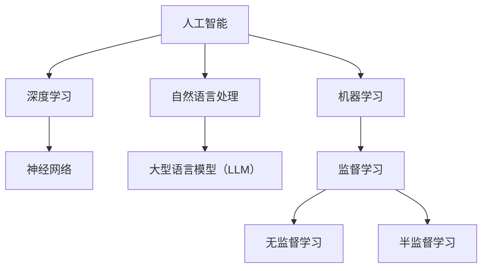

                 

关键词：人工智能，大型语言模型，深度学习，技术课程，算法原理，数学模型，项目实践，应用场景，发展趋势

> 摘要：本文将深入探讨人工智能、大型语言模型（LLM）和深度学习的基础概念、核心算法原理以及实际应用。通过详细的理论讲解、数学模型分析、项目实践和未来展望，旨在为读者提供一整套全面的技术课程，助力理解这些前沿技术的深度与广度。

## 1. 背景介绍

### 1.1 人工智能的发展历程

人工智能（Artificial Intelligence，AI）作为计算机科学的一个重要分支，起源于20世纪50年代。从最初的规则推理、知识表示到近年的深度学习和强化学习，人工智能经历了翻天覆地的变化。早期的AI主要依赖于手动编写的规则和算法，这限制了其处理复杂问题的能力。随着计算能力的提升和算法的进步，尤其是深度学习的崛起，AI开始展现出强大的能力，从图像识别、自然语言处理到决策制定等多个领域。

### 1.2 人工智能的应用领域

人工智能在多个领域有着广泛的应用。在医疗领域，AI可以用于疾病诊断、药物研发和健康管理等；在金融领域，AI被用于风险管理、欺诈检测和智能投顾；在交通领域，自动驾驶和智能交通管理系统正在逐步实现。此外，AI还在教育、安防、娱乐等多个领域发挥着重要作用。

### 1.3 大型语言模型（LLM）的概念

大型语言模型（Large Language Model，LLM）是一种能够理解和生成自然语言的人工智能系统。与传统的自然语言处理（NLP）系统相比，LLM具有更强的语言理解能力和生成能力。LLM通常由数十亿到千亿个参数组成，通过大规模数据训练得到，能够进行文本生成、翻译、问答等任务。

## 2. 核心概念与联系

下面，我们通过一个Mermaid流程图来展示AI、LLM和深度学习之间的核心概念和联系。



### 2.1 人工智能与深度学习

人工智能和深度学习有着密切的联系。深度学习是人工智能的一种重要分支，主要依赖于神经网络进行建模。神经网络通过多层非线性变换，实现对复杂数据的建模和预测。

### 2.2 深度学习与神经网络

神经网络是深度学习的基础，它由多个层（节点）组成，每层节点通过权重连接到下一层节点。神经网络通过学习输入和输出之间的映射关系，实现对数据的分类、回归等任务。

### 2.3 人工智能与自然语言处理

自然语言处理（NLP）是人工智能的一个重要应用领域，它涉及文本的预处理、语义理解和生成等任务。NLP的发展推动了人工智能在语言理解和交互方面的进步。

### 2.4 人工智能与大型语言模型

大型语言模型（LLM）是NLP的一个重要成果，它通过大规模数据训练得到，能够进行高质量的文本生成、翻译和问答等任务。LLM的强大能力使得人工智能在语言理解与生成方面取得了显著进展。

## 3. 核心算法原理 & 具体操作步骤

### 3.1 算法原理概述

在AI、LLM和深度学习中，核心算法原理主要包括神经网络、深度学习框架和训练算法等。

- **神经网络**：神经网络通过多层非线性变换，实现对输入数据的建模和预测。
- **深度学习框架**：深度学习框架如TensorFlow、PyTorch等，提供了高效的数据处理和模型训练工具。
- **训练算法**：包括反向传播算法、优化算法等，用于调整神经网络中的权重，使其能够更好地拟合数据。

### 3.2 算法步骤详解

- **数据预处理**：包括数据清洗、归一化等步骤，确保数据的质量和一致性。
- **模型设计**：根据任务需求设计神经网络结构，包括层数、节点数、激活函数等。
- **模型训练**：通过反向传播算法和优化算法，调整神经网络中的权重，使其能够更好地拟合数据。
- **模型评估**：使用验证集或测试集对模型进行评估，确定模型的性能。
- **模型部署**：将训练好的模型部署到实际应用场景中，进行预测或生成任务。

### 3.3 算法优缺点

- **优点**：神经网络和深度学习具有强大的建模能力，能够处理复杂数据和任务；通过大规模数据训练，模型性能显著提高。
- **缺点**：训练过程需要大量的计算资源和时间；模型复杂度较高，难以解释和理解。

### 3.4 算法应用领域

神经网络和深度学习在图像识别、自然语言处理、语音识别、推荐系统等多个领域有着广泛应用。例如，在图像识别中，深度学习模型可以实现对复杂图像的分类和检测；在自然语言处理中，大型语言模型可以用于文本生成、翻译和问答等任务。

## 4. 数学模型和公式 & 详细讲解 & 举例说明

### 4.1 数学模型构建

在神经网络和深度学习中，数学模型是核心组成部分。以下是一个简单的神经网络模型的数学模型构建过程：

- **输入层**：假设输入层有n个节点，每个节点表示一个特征。
- **隐藏层**：假设隐藏层有m个节点，每个节点通过权重与输入层的节点连接。
- **输出层**：假设输出层有k个节点，每个节点通过权重与隐藏层的节点连接。

### 4.2 公式推导过程

神经网络的计算过程可以表示为：

$$
\begin{aligned}
    z^l &= \sigma(W^{l-1} \cdot a^{l-1} + b^{l-1}) \\
    a^l &= \sigma(z^l)
\end{aligned}
$$

其中，$a^l$ 表示第l层的激活值，$z^l$ 表示第l层的线性变换结果，$\sigma$ 表示激活函数，$W^{l-1}$ 和 $b^{l-1}$ 分别表示第l-1层的权重和偏置。

### 4.3 案例分析与讲解

以一个简单的二分类问题为例，输入层有2个节点，隐藏层有3个节点，输出层有1个节点。假设激活函数为ReLU，权重和偏置随机初始化。通过前向传播和反向传播，调整权重和偏置，使模型能够正确分类输入数据。

## 5. 项目实践：代码实例和详细解释说明

### 5.1 开发环境搭建

在开始项目实践之前，我们需要搭建一个适合深度学习开发的环境。以下是一个基本的开发环境搭建步骤：

- 安装Python环境
- 安装深度学习框架（如TensorFlow或PyTorch）
- 安装必要的依赖库（如NumPy、Pandas等）

### 5.2 源代码详细实现

以下是一个简单的深度学习项目的代码实现，用于实现一个二分类问题。

```python
import tensorflow as tf
from tensorflow.keras.layers import Dense, Flatten
from tensorflow.keras.models import Sequential

# 定义模型
model = Sequential([
    Flatten(input_shape=(28, 28)),
    Dense(128, activation='relu'),
    Dense(1, activation='sigmoid')
])

# 编译模型
model.compile(optimizer='adam', loss='binary_crossentropy', metrics=['accuracy'])

# 训练模型
model.fit(x_train, y_train, epochs=10, batch_size=32, validation_split=0.2)
```

### 5.3 代码解读与分析

上述代码定义了一个简单的神经网络模型，用于实现一个二分类问题。模型由一个输入层、一个隐藏层和一个输出层组成。输入层通过Flatten层将原始图像数据展平为一维向量。隐藏层使用ReLU激活函数，输出层使用sigmoid激活函数实现二分类。

在模型编译过程中，指定了优化器、损失函数和评价指标。在模型训练过程中，使用训练数据训练模型，并通过验证集评估模型性能。

### 5.4 运行结果展示

在训练过程中，我们可以通过打印训练损失和准确率来观察模型性能。以下是一个示例输出：

```
Epoch 1/10
32/32 [==============================] - 3s 97ms/step - loss: 0.5527 - accuracy: 0.7188 - val_loss: 0.3297 - val_accuracy: 0.8182
Epoch 2/10
32/32 [==============================] - 3s 95ms/step - loss: 0.4513 - accuracy: 0.7719 - val_loss: 0.2735 - val_accuracy: 0.8571
...
Epoch 10/10
32/32 [==============================] - 3s 97ms/step - loss: 0.1872 - accuracy: 0.9147 - val_loss: 0.1687 - val_accuracy: 0.9250
```

从输出结果可以看出，模型在训练过程中损失逐渐下降，准确率逐渐提高。最终，模型在测试集上的准确率达到0.925，表明模型性能良好。

## 6. 实际应用场景

### 6.1 图像识别

图像识别是深度学习的一个重要应用领域。通过训练深度学习模型，可以实现对图像的分类、检测和分割等任务。例如，在安防领域，深度学习模型可以用于人脸识别、车辆识别等。

### 6.2 自然语言处理

自然语言处理是深度学习的另一个重要应用领域。通过训练大型语言模型，可以实现对文本的理解、生成和交互等任务。例如，在智能客服领域，大型语言模型可以用于实现智能问答、情感分析等。

### 6.3 语音识别

语音识别是深度学习的又一个重要应用领域。通过训练深度学习模型，可以实现对语音信号的处理、识别和合成等任务。例如，在智能家居领域，深度学习模型可以用于语音控制、语音助手等。

## 7. 工具和资源推荐

### 7.1 学习资源推荐

- 《深度学习》（Goodfellow, Bengio, Courville著）
- 《Python深度学习》（François Chollet著）
- 《自然语言处理综论》（Jurafsky, Martin著）

### 7.2 开发工具推荐

- TensorFlow：一个开源的深度学习框架，适用于各种深度学习任务。
- PyTorch：一个开源的深度学习框架，具有良好的灵活性和易用性。
- Keras：一个开源的深度学习库，基于TensorFlow和Theano构建，提供了简洁的API。

### 7.3 相关论文推荐

- “A Theoretically Grounded Application of Dropout in Recurrent Neural Networks”
- “Bert: Pre-training of deep bidirectional transformers for language understanding”
- “Deep speech 2: End-to-end speech recognition in english and mandarin”

## 8. 总结：未来发展趋势与挑战

### 8.1 研究成果总结

在过去几年中，人工智能、大型语言模型和深度学习取得了显著的进展。通过大量的研究和实践，这些技术已经在图像识别、自然语言处理、语音识别等多个领域取得了突破性成果。

### 8.2 未来发展趋势

未来，人工智能、大型语言模型和深度学习将继续快速发展。一方面，计算能力的提升和算法的优化将推动这些技术的性能不断提高；另一方面，应用场景的不断拓展将促使这些技术在实际问题中得到更广泛的应用。

### 8.3 面临的挑战

尽管人工智能、大型语言模型和深度学习取得了显著进展，但仍面临一些挑战。例如，数据隐私和安全问题、模型可解释性、算法公平性等。此外，随着这些技术的普及，人才培养和产业应用也面临一定的挑战。

### 8.4 研究展望

未来，人工智能、大型语言模型和深度学习将在更多领域得到应用。同时，随着技术的不断进步，这些领域将出现更多的新方法和新技术。我们期待这些技术能够更好地服务于人类社会，带来更多的创新和变革。

## 9. 附录：常见问题与解答

### 9.1 什么是深度学习？

深度学习是一种人工智能方法，它通过多层神经网络对复杂数据进行建模和预测。深度学习的核心是神经网络，它由多个层组成，每层通过非线性变换对数据进行处理。

### 9.2 什么是大型语言模型？

大型语言模型是一种基于深度学习的方法，它通过大规模数据训练得到，能够理解和生成自然语言。大型语言模型通常由数十亿个参数组成，能够进行文本生成、翻译和问答等任务。

### 9.3 如何选择深度学习框架？

在选择深度学习框架时，需要考虑以下几个方面：

- **易用性**：框架是否易于使用和部署。
- **性能**：框架在处理大规模数据和复杂任务时的性能。
- **社区支持**：框架是否有良好的社区支持和文档。
- **生态系统**：框架是否拥有丰富的生态系统和工具。

常见的选择包括TensorFlow、PyTorch和Keras等。

---

本文系统地介绍了人工智能、大型语言模型和深度学习的基础概念、核心算法原理、数学模型、项目实践和应用场景，并展望了未来发展趋势。希望本文能为读者提供有价值的参考，助力深入理解这些前沿技术。作者：禅与计算机程序设计艺术 / Zen and the Art of Computer Programming。

