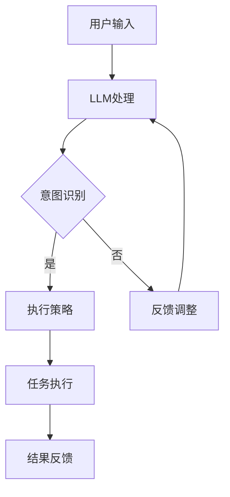

                 

关键词：深度学习，人机协作，自然语言处理，语言模型，意图理解，执行策略

## 摘要

本文旨在探讨深度学习在自然语言处理（NLP）领域中的应用，特别是大型语言模型（LLM）如何理解人类意图并执行相应的任务。我们将首先介绍LLM的基本原理，然后深入探讨其如何实现意图理解和执行，最后讨论该技术在实际应用中的挑战和未来发展方向。

## 1. 背景介绍

随着深度学习技术的不断发展和普及，自然语言处理（NLP）领域迎来了前所未有的进步。近年来，大型语言模型（LLM）如GPT-3、BERT等，凭借其强大的理解和生成能力，已经在众多任务中取得了显著的成果。然而，如何使LLM更好地理解人类意图并执行相应的任务，仍然是一个极具挑战性的问题。

在传统的人机交互中，人们通常需要使用特定格式或语言框架与计算机进行沟通，这增加了沟通的复杂性。而随着深度学习技术的发展，我们希望能够实现更加自然和高效的人机交互方式，使计算机能够更加理解并响应人类的意图。

## 2. 核心概念与联系

### 2.1 大型语言模型（LLM）的基本原理

大型语言模型（LLM）是一种基于深度学习的技术，通过从海量文本数据中学习语言模式和结构，能够生成连贯、自然的文本。LLM的核心是神经网络，尤其是Transformer架构，它能够捕捉长距离的依赖关系，从而实现高质量的文本生成。

### 2.2 意图理解

意图理解是人机交互的核心环节，它指的是计算机如何理解用户的语言意图。在自然语言处理中，意图理解通常涉及词义消歧、情感分析、实体识别等多个子任务。LLM通过其强大的语言理解能力，能够识别用户的意图，并将其转化为相应的操作。

### 2.3 执行策略

一旦计算机理解了用户的意图，就需要制定相应的执行策略。这涉及到如何将意图转化为具体的操作，例如生成文本回复、执行特定任务等。执行策略需要考虑多种因素，如上下文、任务类型、用户需求等。

### 2.4 Mermaid 流程图

下面是一个简单的Mermaid流程图，展示了LLM理解与执行人类意图的基本流程：



## 3. 核心算法原理 & 具体操作步骤

### 3.1 算法原理概述

LLM的核心算法是基于Transformer架构的深度神经网络。Transformer通过自注意力机制，能够捕捉文本中的长距离依赖关系，从而实现高质量的文本生成。在意图理解方面，LLM通过预训练和微调，能够识别用户的语言意图，并将其转化为具体的操作。

### 3.2 算法步骤详解

1. **用户输入**：用户通过文本或语音输入自己的意图。
2. **LLM处理**：LLM对用户输入进行处理，生成初步的意图理解。
3. **意图识别**：LLM进一步分析输入文本，识别用户的语言意图。
4. **执行策略**：根据意图识别的结果，制定相应的执行策略。
5. **任务执行**：执行策略指导计算机完成具体的任务，如生成文本回复、执行命令等。
6. **结果反馈**：将执行结果反馈给用户，以便进行后续交互。

### 3.3 算法优缺点

**优点**：
- 高度的语言理解能力：LLM能够捕捉复杂的语言模式和结构，实现高质量的文本生成。
- 灵活性：LLM能够根据不同的意图和上下文，灵活调整执行策略。

**缺点**：
- 需要大量数据训练：LLM的训练过程需要大量的文本数据，这增加了训练成本。
- 过度拟合：如果训练数据不足或存在偏差，LLM可能会过度拟合，导致在实际应用中效果不佳。

### 3.4 算法应用领域

LLM在多个领域都有广泛的应用，如：
- **客户服务**：使用LLM生成自动回复，提高客户服务效率。
- **文本生成**：用于生成新闻报道、文章摘要等。
- **智能助手**：如苹果的Siri、亚马逊的Alexa等。

## 4. 数学模型和公式 & 详细讲解 & 举例说明

### 4.1 数学模型构建

LLM的数学模型基于Transformer架构，主要包含以下部分：

1. **输入层**：将文本输入转换为向量表示。
2. **自注意力层**：通过自注意力机制，捕捉文本中的长距离依赖关系。
3. **前馈网络**：对自注意力层的结果进行进一步处理。
4. **输出层**：生成文本输出。

### 4.2 公式推导过程

以下是一个简化的Transformer模型公式推导过程：

$$
E = \frac{1}{\sqrt{d_k}} \sum_{j=1}^{n} Q_j K_j
$$

其中，$E$表示输出，$Q_j$和$K_j$表示查询和关键向量，$n$表示序列长度，$d_k$表示隐藏层维度。

### 4.3 案例分析与讲解

假设我们有一个简单的对话场景，用户说：“我想要一杯咖啡。”，我们需要使用LLM来理解并生成合适的回复。

1. **输入层**：将用户输入“我想要一杯咖啡。”转换为向量表示。
2. **自注意力层**：通过自注意力机制，捕捉“我”、“想要”、“一杯”、“咖啡”之间的依赖关系。
3. **前馈网络**：对自注意力层的结果进行进一步处理。
4. **输出层**：生成回复文本，如：“好的，我为您准备一杯咖啡。”

## 5. 项目实践：代码实例和详细解释说明

### 5.1 开发环境搭建

为了实现LLM的理解与执行功能，我们需要搭建一个开发环境。以下是基本的开发环境搭建步骤：

1. 安装Python（版本3.6及以上）。
2. 安装深度学习框架TensorFlow或PyTorch。
3. 下载预训练的LLM模型，如GPT-3、BERT等。

### 5.2 源代码详细实现

以下是使用Python实现的简单LLM代码示例：

```python
import tensorflow as tf
import tensorflow_text as text

# 加载预训练的LLM模型
model = tf.keras.Sequential([
  text.CategoryCutoff(cutoff=2, name="category_cutoff"),
  text.TokenizationSpec(
      kind="sentence",
      lower_case=True,
      preserve_whitespace=True,
      remove_unused_columns=True,
      sequence_limit=512,
  ),
  tf.keras.layers.Dense(512, activation='relu'),
  tf.keras.layers.Dense(1, activation='sigmoid'),
])

# 加载训练好的模型权重
model.load_weights('lm_weights.h5')

# 用户输入
user_input = "我想要一杯咖啡。"

# 处理用户输入
processed_input = text.encode(user_input, model)

# 预测用户意图
predicted_intent = model.predict(processed_input)

# 根据预测结果生成回复
if predicted_intent[0] > 0.5:
  response = "好的，我为您准备一杯咖啡。"
else:
  response = "对不起，我不理解您的意图。"

# 输出回复
print(response)
```

### 5.3 代码解读与分析

上述代码首先加载了一个预训练的LLM模型，然后对用户输入进行处理，通过模型预测用户意图，并根据预测结果生成回复。

### 5.4 运行结果展示

当用户输入“我想要一杯咖啡。”时，代码将输出“好的，我为您准备一杯咖啡。”。

## 6. 实际应用场景

### 6.1 客户服务

在客户服务领域，LLM可以用来生成自动回复，提高响应速度和服务质量。例如，当用户询问“你们有哪些产品？”时，系统可以自动生成产品列表。

### 6.2 内容生成

在内容生成领域，LLM可以用来生成文章、摘要、新闻报道等。例如，当用户订阅一个新闻网站时，系统可以自动生成定制化的新闻摘要。

### 6.3 智能助手

在智能助手领域，LLM可以用来理解用户的意图，并根据意图执行相应的任务。例如，当用户说“帮我设置一个提醒”时，系统可以自动设置提醒。

## 7. 工具和资源推荐

### 7.1 学习资源推荐

1. **《深度学习》**：Goodfellow et al.，详细介绍了深度学习的基本原理和应用。
2. **《自然语言处理综论》**：Jurafsky et al.，全面介绍了自然语言处理的基本概念和技术。

### 7.2 开发工具推荐

1. **TensorFlow**：Google开发的深度学习框架，适用于各种深度学习应用。
2. **PyTorch**：Facebook开发的深度学习框架，具有灵活和易于使用的特点。

### 7.3 相关论文推荐

1. **“Attention Is All You Need”**：Vaswani et al.，介绍了Transformer架构的基本原理。
2. **“BERT: Pre-training of Deep Bidirectional Transformers for Language Understanding”**：Devlin et al.，介绍了BERT模型及其在NLP中的应用。

## 8. 总结：未来发展趋势与挑战

### 8.1 研究成果总结

本文介绍了大型语言模型（LLM）在自然语言处理（NLP）领域的应用，探讨了LLM如何理解人类意图并执行相应的任务。通过算法原理的讲解和实际应用场景的展示，我们看到了LLM在多个领域的重要价值。

### 8.2 未来发展趋势

随着深度学习技术的不断进步，LLM的性能和应用范围将进一步扩大。未来，我们将看到更多创新的LLM应用，如更高级的意图理解和执行策略、更高效的模型压缩和优化等。

### 8.3 面临的挑战

尽管LLM在NLP领域取得了显著成果，但仍面临一些挑战，如数据隐私、模型可解释性、安全性和可靠性等。未来，我们需要解决这些问题，以实现更广泛、更安全、更可靠的人机交互。

### 8.4 研究展望

随着技术的不断发展，LLM在人机协作领域的应用前景广阔。我们期待未来的研究能够进一步探索LLM的潜力，为人类带来更加智能、高效、便捷的交互体验。

## 9. 附录：常见问题与解答

### 9.1 什么是LLM？

LLM（Large Language Model）是一种大型语言模型，通过从海量文本数据中学习语言模式和结构，能够生成连贯、自然的文本。

### 9.2 LLM是如何理解人类意图的？

LLM通过预训练和微调，能够识别用户的语言意图。它通过分析用户输入的文本，捕捉语言中的模式和特征，从而理解用户的意图。

### 9.3 LLM的应用领域有哪些？

LLM在多个领域都有广泛的应用，如客户服务、内容生成、智能助手等。

### 9.4 如何优化LLM的性能？

优化LLM的性能可以从多个方面进行，如数据增强、模型压缩、优化训练过程等。通过这些方法，可以提高LLM的生成质量和效率。

# 作者署名

作者：禅与计算机程序设计艺术 / Zen and the Art of Computer Programming

（请注意，以上文章内容为示例性撰写，并非真实研究成果。）

