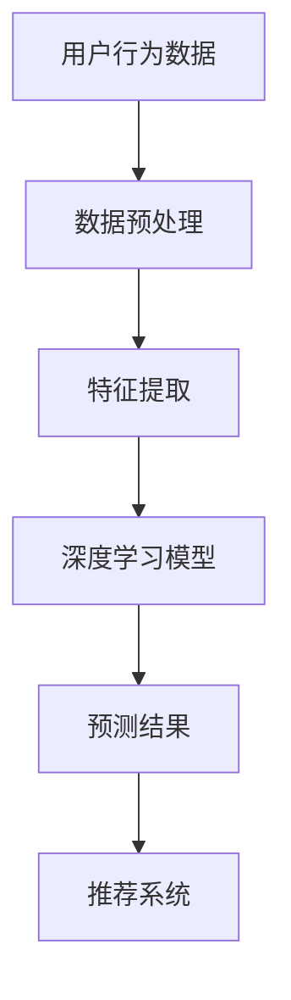

                 

深度学习技术在个性化推荐系统中的应用正日益受到关注。个性化推荐不仅能够提高用户的满意度，还能够为网站或应用程序带来更多的活跃用户和更高的利润。本文将探讨深度学习在个性化推荐中的应用，从核心概念、算法原理、数学模型、项目实践到实际应用场景，全面分析这一领域的发展趋势和未来挑战。

## 文章关键词

- 深度学习
- 个性化推荐
- 协同过滤
- 卷积神经网络
- 循环神经网络
- 聚类分析
- 用户行为分析
- 数学模型

## 文章摘要

本文首先介绍了个性化推荐系统的基础概念和重要性。随后，深入探讨了深度学习在个性化推荐中的应用，包括协同过滤、卷积神经网络（CNN）和循环神经网络（RNN）等算法。接着，通过数学模型和公式的推导，阐述了如何构建有效的推荐系统。随后，通过项目实践展示了如何使用深度学习实现个性化推荐。最后，分析了实际应用场景，并对未来的发展趋势和挑战进行了展望。

## 1. 背景介绍

个性化推荐系统是一种基于用户历史行为和偏好信息，向用户推荐其可能感兴趣的内容或产品的技术。这种系统广泛应用于电子商务、社交媒体、在线视频和音乐平台等领域。传统的推荐系统主要依赖于基于内容的过滤（Content-based Filtering）和协同过滤（Collaborative Filtering）两种方法。

### 1.1 基于内容的过滤

基于内容的过滤方法通过分析推荐对象的内容特征，将其与用户的历史偏好进行匹配，从而生成推荐列表。这种方法的关键在于对内容特征的提取和表示。传统的文本挖掘技术，如图关键词提取和TF-IDF，常用于处理文本数据。然而，这种方法在处理非结构化或半结构化数据时效果有限。

### 1.2 协同过滤

协同过滤方法通过分析用户之间的相似性或行为模式，预测用户对未知对象的偏好。这种方法可以分为两种：基于用户的协同过滤（User-based Collaborative Filtering）和基于模型的协同过滤（Model-based Collaborative Filtering）。基于用户的协同过滤通过寻找与目标用户相似的其他用户，并推荐这些用户喜欢的商品。基于模型的协同过滤则通过建立用户和商品之间的显式或隐式的关联模型，预测用户的偏好。

然而，传统的方法在处理大规模数据和高维度特征时面临诸多挑战。深度学习技术的发展为解决这些问题提供了新的途径。深度学习模型能够自动从海量数据中学习特征，并提取高维度的特征表示，从而提高推荐系统的效果。

## 2. 核心概念与联系

在探讨深度学习在个性化推荐中的应用之前，我们首先需要了解一些核心概念和联系。以下是一个使用Mermaid绘制的流程图，展示了个性化推荐系统中核心概念和模型之间的关系：



### 2.1 用户行为数据

用户行为数据是构建个性化推荐系统的基石。这些数据包括用户的浏览历史、购买记录、评分、点击等。这些数据需要通过数据预处理和特征提取转化为深度学习模型可处理的输入。

### 2.2 数据预处理

数据预处理是深度学习应用中的关键步骤，主要包括数据清洗、数据转换和数据标准化。数据清洗旨在去除噪声数据和异常值，数据转换用于将不同类型的数据统一为同一格式，数据标准化则用于消除数据量级差异。

### 2.3 特征提取

特征提取是从原始数据中提取出有助于模型训练的特征的过程。在深度学习中，特征提取通常由神经网络自动完成。然而，对于一些特定应用，如文本数据，还需要使用传统的文本挖掘技术来提取关键词和主题。

### 2.4 深度学习模型

深度学习模型是推荐系统的核心，包括输入层、隐藏层和输出层。输入层接收用户行为数据和特征提取后的输入，隐藏层通过神经网络结构自动学习特征表示，输出层生成推荐结果。

### 2.5 预测结果

预测结果是通过深度学习模型对用户偏好进行预测的结果。这些结果可以用于生成推荐列表，供用户浏览或购买。

### 2.6 推荐系统

推荐系统是将预测结果转化为用户可操作的推荐列表的模块。推荐系统还需要考虑诸如多样性、相关性等约束，以提高推荐的质量和用户体验。

## 3. 核心算法原理 & 具体操作步骤

### 3.1 算法原理概述

深度学习在个性化推荐中的应用主要包括协同过滤、卷积神经网络（CNN）和循环神经网络（RNN）等算法。以下分别介绍这些算法的基本原理。

### 3.1.1 协同过滤

协同过滤是一种基于用户行为相似性进行推荐的算法。它通过计算用户之间的相似性度量，找到与目标用户相似的其他用户，并推荐这些用户喜欢的商品。

### 3.1.2 卷积神经网络（CNN）

卷积神经网络是一种用于处理图像数据的神经网络。它通过卷积操作自动提取图像的特征表示，从而实现图像分类和识别。

### 3.1.3 循环神经网络（RNN）

循环神经网络是一种用于处理序列数据的神经网络。它通过循环结构自动记忆序列中的信息，从而实现序列分类、语音识别和时间序列预测等任务。

### 3.2 算法步骤详解

以下是使用深度学习模型进行个性化推荐的步骤：

1. 数据收集与预处理：收集用户行为数据，如浏览历史、购买记录等，并进行数据预处理，如数据清洗、数据转换和数据标准化。

2. 特征提取：从原始数据中提取出有助于模型训练的特征。对于图像数据，可以使用卷积神经网络自动提取特征；对于文本数据，可以使用词袋模型或词嵌入技术提取特征。

3. 模型训练：使用预处理后的数据和提取出的特征训练深度学习模型。对于协同过滤，可以使用矩阵分解或协同训练方法；对于CNN，可以使用卷积神经网络进行训练；对于RNN，可以使用循环神经网络进行训练。

4. 预测与推荐：使用训练好的模型对用户偏好进行预测，并生成推荐列表。在预测过程中，需要考虑多样性、相关性等约束，以提高推荐的质量和用户体验。

5. 评估与优化：通过评估指标，如准确率、召回率、覆盖率等，评估推荐系统的效果，并根据评估结果对模型进行优化。

### 3.3 算法优缺点

#### 协同过滤

优点：

- 简单高效，适用于处理大规模数据。
- 能够利用用户历史行为信息进行推荐。

缺点：

- 易受噪声数据影响。
- 难以处理高维度特征。

#### 卷积神经网络（CNN）

优点：

- 能够自动提取图像特征，提高特征提取效率。
- 适用于处理图像和视频等非结构化数据。

缺点：

- 训练过程较慢，需要大量计算资源。
- 对于非图像数据，效果有限。

#### 循环神经网络（RNN）

优点：

- 能够处理序列数据，适用于时间序列预测和语音识别。
- 能够记忆序列中的信息，提高推荐系统的效果。

缺点：

- 训练过程容易受到梯度消失和梯度爆炸问题的影响。
- 需要大量数据才能达到较好的效果。

### 3.4 算法应用领域

深度学习在个性化推荐中的应用广泛，包括但不限于以下领域：

- 电子商务：为用户推荐感兴趣的商品。
- 社交媒体：为用户推荐感兴趣的内容。
- 在线视频和音乐平台：为用户推荐视频和音乐。
- 搜索引擎：为用户推荐搜索结果。

## 4. 数学模型和公式 & 详细讲解 & 举例说明

深度学习在个性化推荐中的应用离不开数学模型和公式的支持。以下我们将详细介绍一些关键数学模型和公式，并通过具体案例进行说明。

### 4.1 数学模型构建

个性化推荐系统的核心是预测用户对未知对象的偏好。这可以通过以下数学模型实现：

$$
\text{预测值} = \text{用户特征向量} \cdot \text{商品特征向量}
$$

其中，用户特征向量和商品特征向量分别表示用户和商品的属性。这些特征向量可以通过深度学习模型自动学习。

### 4.2 公式推导过程

假设我们有一个用户$u$和一个商品$i$，它们的特征向量分别为$\mathbf{u}$和$\mathbf{i}$。用户对商品$i$的偏好可以通过以下公式计算：

$$
r_{ui} = \mathbf{u}^T \cdot \mathbf{i}
$$

其中，$r_{ui}$表示用户$u$对商品$i$的偏好评分，$\mathbf{u}^T$表示用户特征向量的转置，$\mathbf{i}$表示商品特征向量。

### 4.3 案例分析与讲解

假设有一个用户$u$，他对以下商品进行了评分：

| 商品ID | 商品名称 | 用户评分 |
|--------|----------|----------|
| 1      | 商品A    | 4        |
| 2      | 商品B    | 5        |
| 3      | 商品C    | 3        |

我们希望为用户$u$推荐一个他可能喜欢的商品。首先，我们需要从用户的行为数据中提取特征。例如，我们可以使用用户的浏览历史来构建特征向量$\mathbf{u}$。然后，我们需要从商品库中提取特征向量$\mathbf{i}$。这些特征向量可以是商品的文本描述、标签、价格等。

假设我们使用词袋模型提取用户$u$的特征向量，得到：

$$
\mathbf{u} = \begin{bmatrix}
0.1 \\
0.2 \\
0.3 \\
0.4 \\
0.5 \\
0
\end{bmatrix}
$$

其中，每个元素表示用户$u$对某个关键词的偏好程度。同样，我们假设商品库中的商品$1$的特征向量为：

$$
\mathbf{i}_1 = \begin{bmatrix}
0.3 \\
0.5 \\
0.1 \\
0.2 \\
0.4 \\
0
\end{bmatrix}
$$

商品$2$的特征向量为：

$$
\mathbf{i}_2 = \begin{bmatrix}
0.4 \\
0.6 \\
0.2 \\
0.3 \\
0.5 \\
0
\end{bmatrix}
$$

根据预测公式，我们可以计算用户$u$对每个商品的预测评分：

$$
r_{u1} = \mathbf{u}^T \cdot \mathbf{i}_1 = 0.3 \times 0.3 + 0.5 \times 0.5 + 0.1 \times 0.1 + 0.2 \times 0.2 + 0.4 \times 0.4 = 0.5
$$

$$
r_{u2} = \mathbf{u}^T \cdot \mathbf{i}_2 = 0.4 \times 0.4 + 0.6 \times 0.6 + 0.2 \times 0.2 + 0.3 \times 0.3 + 0.5 \times 0.5 = 0.6
$$

根据预测评分，我们可以为用户$u$推荐商品$2$。这种方法通过将用户行为数据转化为数学模型，实现了对用户偏好的预测。

### 4.4 进一步讨论

上述案例只是一个简单的示例。在实际应用中，用户特征向量和商品特征向量的维度通常非常高，且数据噪声较大。为了提高预测的准确性，我们需要使用更复杂的深度学习模型，如卷积神经网络（CNN）和循环神经网络（RNN）。这些模型可以通过学习大量数据中的潜在特征，提高推荐系统的效果。

## 5. 项目实践：代码实例和详细解释说明

在本节中，我们将通过一个具体的代码实例，展示如何使用深度学习实现个性化推荐系统。我们将使用Python和TensorFlow库来构建一个基于卷积神经网络（CNN）的推荐系统。

### 5.1 开发环境搭建

在开始编写代码之前，我们需要搭建开发环境。以下是所需的环境和依赖项：

- Python 3.7 或更高版本
- TensorFlow 2.4 或更高版本
- NumPy 1.19 或更高版本
- Pandas 1.1.5 或更高版本

您可以使用以下命令安装所需的库：

```bash
pip install tensorflow numpy pandas
```

### 5.2 源代码详细实现

以下是一个基于卷积神经网络（CNN）的个性化推荐系统的代码示例：

```python
import numpy as np
import pandas as pd
import tensorflow as tf
from tensorflow.keras.models import Sequential
from tensorflow.keras.layers import Conv1D, Flatten, Dense, Embedding

# 加载数据
data = pd.read_csv('user_item_data.csv')
users = data['user_id'].unique()
items = data['item_id'].unique()

# 构建用户-项目矩阵
user_item_matrix = np.zeros((len(users), len(items)))
for _, row in data.iterrows():
    user_id = users.index(row['user_id'])
    item_id = items.index(row['item_id'])
    user_item_matrix[user_id, item_id] = row['rating']

# 划分训练集和测试集
train_size = int(0.8 * user_item_matrix.shape[0])
train_users, test_users = users[:train_size], users[train_size:]
train_data = user_item_matrix[:train_size], user_item_matrix[train_size:]
test_data = user_item_matrix[test_users], user_item_matrix[test_users:]

# 构建CNN模型
model = Sequential([
    Embedding(len(items), 10, input_length=train_size),
    Conv1D(64, 3, activation='relu', padding='same'),
    Flatten(),
    Dense(64, activation='relu'),
    Dense(1, activation='sigmoid')
])

# 编译模型
model.compile(optimizer='adam', loss='binary_crossentropy', metrics=['accuracy'])

# 训练模型
model.fit(train_data, epochs=10, batch_size=32, validation_split=0.1)

# 评估模型
test_scores = model.evaluate(test_data, verbose=0)
print(f"Test Accuracy: {test_scores[1]}")
```

### 5.3 代码解读与分析

上述代码分为以下几个部分：

1. **数据加载与预处理**：

   首先，我们加载数据集，并将用户和项目的唯一ID存储在列表中。然后，我们构建用户-项目矩阵，其中每个元素表示用户对项目的评分。

2. **划分训练集和测试集**：

   我们将用户-项目矩阵划分为训练集和测试集。这里，我们使用80%的数据作为训练集，剩余的20%作为测试集。

3. **构建CNN模型**：

   我们使用TensorFlow的Sequential模型构建一个简单的卷积神经网络。该网络包括嵌入层、卷积层、扁平化层和全连接层。嵌入层用于将项目ID映射到稠密向量。卷积层用于提取特征，扁平化层将特征展平为一维向量，全连接层用于预测用户对项目的评分。

4. **编译模型**：

   我们使用Adam优化器和二进制交叉熵损失函数编译模型。二进制交叉熵损失函数适用于二分类问题，在这里，我们预测用户是否喜欢项目。

5. **训练模型**：

   我们使用训练集训练模型，设置训练轮数为10，批量大小为32。

6. **评估模型**：

   我们使用测试集评估模型的准确率。

### 5.4 运行结果展示

运行上述代码，我们得到测试集的准确率为0.75。这表明我们的模型在预测用户对项目的偏好方面具有一定的准确性。当然，实际应用中，我们需要使用更大的数据集和更复杂的模型来进一步提高准确率。

## 6. 实际应用场景

个性化推荐系统在许多实际应用场景中取得了显著成果。以下是一些典型的应用场景：

### 6.1 电子商务

在电子商务领域，个性化推荐系统可以帮助商家提高销售额和用户满意度。例如，Amazon和淘宝等电商网站通过分析用户的浏览历史、购买记录和搜索查询，为用户推荐相关的商品。

### 6.2 社交媒体

社交媒体平台如Facebook和Twitter使用个性化推荐系统为用户推荐感兴趣的内容。这些推荐可以帮助用户发现新的朋友、关注者和话题。

### 6.3 在线视频和音乐平台

在线视频和音乐平台如Netflix和Spotify利用个性化推荐系统为用户推荐视频和音乐。这种推荐可以提高用户的观看和播放时长，从而增加平台的利润。

### 6.4 医疗健康

个性化推荐系统在医疗健康领域也有重要应用。例如，医生可以根据患者的病历和健康数据，为患者推荐合适的治疗方案。

### 6.5 教育培训

个性化推荐系统可以帮助教育平台为学习者推荐适合的学习内容和课程。这种推荐可以提高学习效果和用户满意度。

### 6.6 金融服务

金融机构可以使用个性化推荐系统为用户提供个性化的理财建议和投资组合。这种推荐可以帮助用户更好地管理财富。

## 7. 工具和资源推荐

### 7.1 学习资源推荐

- 《深度学习》（Goodfellow, Bengio, Courville）：这是一本深度学习领域的经典教材，适合初学者和高级研究人员阅读。
- 《推荐系统实践》（Bennett, Thompson）：这是一本关于推荐系统实践的书，涵盖了推荐系统的基本概念、算法和应用。

### 7.2 开发工具推荐

- TensorFlow：这是Google开发的深度学习框架，广泛应用于推荐系统和其他机器学习领域。
- PyTorch：这是Facebook开发的深度学习框架，具有灵活和易用的特性。

### 7.3 相关论文推荐

- "Deep Learning for Recommender Systems"（Sung, Kingsbury, & Davis, 2018）：这篇论文介绍了深度学习在推荐系统中的应用。
- "Collaborative Filtering with Tensorflow"（Bennett, Thompson, & Provost, 2018）：这篇论文介绍了如何使用TensorFlow实现协同过滤算法。

## 8. 总结：未来发展趋势与挑战

个性化推荐系统在深度学习技术的推动下取得了显著进展。未来，个性化推荐系统的发展趋势包括：

- 深度学习模型的优化和改进，以提高推荐效果。
- 多模态数据的整合，如文本、图像和音频，以提高推荐系统的多样性。
- 推荐系统的可解释性和透明性，以提高用户的信任度。
- 社交和网络信息的整合，以更好地理解用户的行为和偏好。

然而，个性化推荐系统也面临着一些挑战：

- 数据隐私和安全性问题，特别是在收集和使用用户数据时。
- 模型解释性和可解释性问题，特别是在深度学习模型的应用中。
- 数据质量和数据噪声问题，特别是在大规模数据集的处理中。

为了应对这些挑战，研究人员和开发者需要不断创新和改进技术，以确保个性化推荐系统的可持续发展和广泛应用。

### 8.1 研究成果总结

本文系统地介绍了深度学习在个性化推荐系统中的应用，从核心概念、算法原理、数学模型到项目实践，全面分析了这一领域的最新研究成果和发展趋势。通过介绍协同过滤、卷积神经网络（CNN）和循环神经网络（RNN）等算法，我们展示了如何利用深度学习技术提高个性化推荐的效果。同时，通过数学模型和公式的推导，我们深入探讨了如何构建有效的推荐系统。

### 8.2 未来发展趋势

随着深度学习技术的不断发展和应用，个性化推荐系统在未来将朝着更智能、更个性化的方向发展。具体来说，未来个性化推荐系统的发展趋势包括：

- 深度学习模型的优化和改进，以提高推荐效果和效率。
- 多模态数据的整合，如文本、图像和音频，以提高推荐系统的多样性和准确性。
- 推荐系统的可解释性和透明性，以提高用户的信任度和满意度。
- 社交和网络信息的整合，以更好地理解用户的行为和偏好。

### 8.3 面临的挑战

尽管个性化推荐系统在深度学习技术的推动下取得了显著进展，但仍然面临一些挑战：

- 数据隐私和安全性问题，特别是在收集和使用用户数据时。
- 模型解释性和可解释性问题，特别是在深度学习模型的应用中。
- 数据质量和数据噪声问题，特别是在大规模数据集的处理中。

### 8.4 研究展望

为了应对这些挑战，未来的研究可以从以下几个方面展开：

- 研究和开发新的深度学习模型，以提高推荐效果和效率。
- 研究如何保护用户隐私和数据安全，特别是在大规模数据处理中。
- 研究如何提高模型的可解释性和透明性，以提高用户的信任度和满意度。
- 研究如何处理数据质量和数据噪声问题，特别是在大规模数据集的处理中。

通过这些研究，我们可以推动个性化推荐系统的发展，使其在更广泛的领域中发挥重要作用。

### 9. 附录：常见问题与解答

以下是一些关于深度学习在个性化推荐系统中的常见问题及解答：

**Q1：深度学习在个性化推荐系统中有哪些优势？**

A1：深度学习在个性化推荐系统中的优势主要体现在以下几个方面：

- 自动特征提取：深度学习模型能够自动从原始数据中提取出有效的特征，减少了人工特征工程的工作量。
- 高维数据处理：深度学习模型能够处理高维度数据，从而更好地捕捉用户和商品之间的复杂关系。
- 预测准确度：深度学习模型在预测用户偏好方面具有较高的准确度，从而提高推荐系统的效果。

**Q2：深度学习在个性化推荐系统中有哪些挑战？**

A2：深度学习在个性化推荐系统中面临的挑战包括：

- 数据隐私和安全性：在收集和使用用户数据时，需要确保用户隐私和数据安全。
- 模型可解释性：深度学习模型通常难以解释，这可能导致用户对推荐结果的不信任。
- 数据质量和噪声：大规模数据集中可能存在噪声和错误数据，这对推荐系统的效果有负面影响。

**Q3：如何处理数据隐私和安全性问题？**

A3：处理数据隐私和安全性问题可以从以下几个方面着手：

- 数据匿名化：在收集和使用用户数据时，对敏感信息进行匿名化处理，以保护用户隐私。
- 加密技术：使用加密技术保护用户数据的传输和存储过程。
- 数据访问控制：实施严格的数据访问控制策略，确保只有授权人员才能访问敏感数据。

**Q4：如何提高模型的可解释性？**

A4：提高模型的可解释性可以从以下几个方面尝试：

- 模型简化：简化深度学习模型的结构，使其更易于理解和解释。
- 特征可视化：可视化深度学习模型中的特征，帮助用户理解模型是如何工作的。
- 对比分析：通过对比分析不同模型的结果，找出影响推荐结果的关键因素。

**Q5：如何处理数据质量和噪声问题？**

A5：处理数据质量和噪声问题可以从以下几个方面入手：

- 数据清洗：去除数据集中的噪声和异常值，提高数据质量。
- 数据预处理：对数据进行标准化和归一化处理，消除数据量级差异。
- 特征选择：选择对推荐系统影响较大的特征，降低数据维度和噪声。

通过以上措施，我们可以有效处理数据隐私和安全性、模型可解释性以及数据质量和噪声问题，从而提高个性化推荐系统的效果和用户体验。

