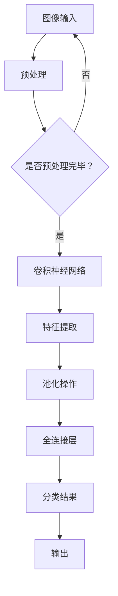

                 

关键词：深度学习，医学影像，图像分析，人工智能，疾病诊断

摘要：本文探讨了深度学习在医学影像分析中的广泛应用和重要意义。通过对深度学习核心算法、数学模型和实际应用案例的详细分析，揭示了深度学习技术在医学影像分析中的潜力和前景。文章还对未来深度学习在医学影像分析领域的发展趋势和面临的挑战进行了展望。

## 1. 背景介绍

医学影像分析是医学领域中的一个重要分支，它通过图像处理技术对医学影像进行自动化分析和解释，以辅助医生进行诊断和治疗。随着计算机技术和人工智能的快速发展，深度学习作为一种强大的机器学习技术，逐渐成为医学影像分析领域的研究热点。

深度学习是一种模拟人脑神经网络结构和功能的计算模型，通过多层神经元的非线性变换，可以自动从大量数据中学习到复杂的特征和模式。近年来，随着深度学习技术的不断进步，它在医学影像分析中的应用也取得了显著的成果。

医学影像分析涉及多种类型的数据，如X射线、CT、MRI等，这些图像数据具有高维、高噪声和复杂特征的特点。深度学习技术可以利用其强大的特征提取和模式识别能力，有效地对医学影像进行分析，为疾病诊断和治疗提供有力支持。

## 2. 核心概念与联系

### 2.1 深度学习核心概念

深度学习由多个神经网络层组成，通过逐层提取图像的特征，实现对复杂图像的理解。深度学习的主要组成部分包括：

- **卷积神经网络（CNN）**：一种专门用于图像识别和分类的神经网络结构，通过卷积操作提取图像的局部特征。
- **循环神经网络（RNN）**：一种用于处理序列数据的神经网络结构，可以有效地对医学影像的时间序列信息进行建模。
- **生成对抗网络（GAN）**：一种通过生成器和判别器之间的对抗训练，学习生成真实图像数据的深度学习模型。

### 2.2 深度学习与医学影像分析的联系

深度学习与医学影像分析之间的联系主要体现在以下几个方面：

- **图像特征提取**：深度学习通过多层卷积和池化操作，可以自动提取医学影像中的丰富特征，有助于提高疾病诊断的准确性。
- **疾病分类**：深度学习可以将医学影像数据分类为不同的疾病类型，为医生提供辅助诊断依据。
- **图像分割**：深度学习模型可以准确分割医学影像中的病变区域，有助于疾病的定位和定性分析。
- **图像增强**：深度学习可以增强医学影像的质量，提高图像的对比度和清晰度，有助于疾病的识别和诊断。

### 2.3 Mermaid 流程图



## 3. 核心算法原理 & 具体操作步骤

### 3.1 算法原理概述

深度学习在医学影像分析中的应用主要包括以下几种核心算法：

- **卷积神经网络（CNN）**：通过卷积操作提取图像特征，并进行逐层抽象，实现对医学影像的自动分类和识别。
- **循环神经网络（RNN）**：对医学影像中的时间序列信息进行建模，用于处理动态影像数据。
- **生成对抗网络（GAN）**：通过生成器和判别器的对抗训练，生成高质量的医学影像数据，用于疾病诊断和研究。

### 3.2 算法步骤详解

#### 3.2.1 卷积神经网络（CNN）

1. **输入层**：接收原始医学影像数据。
2. **卷积层**：通过卷积操作提取图像特征。
3. **激活函数**：引入非线性变换，增强模型的非线性能力。
4. **池化层**：减少数据维度，降低计算复杂度。
5. **全连接层**：将特征映射到分类结果。
6. **输出层**：输出分类结果。

#### 3.2.2 循环神经网络（RNN）

1. **输入层**：接收时间序列医学影像数据。
2. **隐藏层**：通过递归操作，处理时间序列信息。
3. **激活函数**：引入非线性变换，增强模型的非线性能力。
4. **输出层**：输出分类结果。

#### 3.2.3 生成对抗网络（GAN）

1. **生成器**：通过噪声数据生成医学影像数据。
2. **判别器**：判断生成器生成的医学影像数据是否真实。
3. **对抗训练**：生成器和判别器相互对抗，提高生成医学影像的质量。

### 3.3 算法优缺点

#### 3.3.1 卷积神经网络（CNN）

- **优点**：自动提取图像特征，减少人工干预；适用于图像分类和识别任务。
- **缺点**：对图像分辨率要求较高，无法直接处理序列数据。

#### 3.3.2 循环神经网络（RNN）

- **优点**：适用于处理时间序列数据，能够捕捉时间序列中的动态变化。
- **缺点**：难以避免梯度消失和梯度爆炸问题。

#### 3.3.3 生成对抗网络（GAN）

- **优点**：可以生成高质量的医学影像数据，有助于疾病诊断和研究。
- **缺点**：训练过程较为复杂，需要大量计算资源和时间。

### 3.4 算法应用领域

深度学习在医学影像分析中的应用领域广泛，主要包括：

- **疾病分类**：如肺癌、乳腺癌等疾病的分类诊断。
- **图像分割**：如肿瘤、病灶的定位和分割。
- **图像增强**：提高医学影像的对比度和清晰度。
- **动态影像分析**：如心脏、肝脏等器官的动态变化分析。

## 4. 数学模型和公式 & 详细讲解 & 举例说明

### 4.1 数学模型构建

深度学习中的数学模型主要包括神经网络模型和损失函数。

#### 4.1.1 神经网络模型

神经网络模型可以表示为：

$$
\text{神经网络} = \text{输入层} \rightarrow \text{隐藏层} \rightarrow \text{输出层}
$$

其中，输入层和输出层分别表示输入数据和输出结果，隐藏层用于处理和转换数据。

#### 4.1.2 损失函数

损失函数用于评估神经网络模型预测结果与真实值之间的差异，常用的损失函数包括：

- **均方误差（MSE）**：

$$
MSE = \frac{1}{n}\sum_{i=1}^{n}(y_i - \hat{y}_i)^2
$$

- **交叉熵（CE）**：

$$
CE = -\frac{1}{n}\sum_{i=1}^{n}y_i\log(\hat{y}_i)
$$

### 4.2 公式推导过程

以卷积神经网络（CNN）为例，推导其损失函数的推导过程如下：

1. **输入层到隐藏层的转换**：

$$
h_{ij}^{(l)} = \sigma \left( \sum_{k=1}^{n} w_{ik}^{(l)} h_{kj}^{(l-1)} + b_i^{(l)} \right)
$$

其中，$h_{ij}^{(l)}$ 表示第 $l$ 层第 $i$ 个神经元输出的第 $j$ 个特征值，$w_{ik}^{(l)}$ 和 $b_i^{(l)}$ 分别表示第 $l$ 层第 $i$ 个神经元的权重和偏置。

2. **隐藏层到输出层的转换**：

$$
\hat{y}_i = \sigma \left( \sum_{k=1}^{n} w_{ik}^{(L)} h_{kj}^{(L-1)} + b_i^{(L)} \right)
$$

其中，$\hat{y}_i$ 表示输出层的第 $i$ 个神经元的输出值。

3. **损失函数的计算**：

$$
L = \frac{1}{n}\sum_{i=1}^{n} -y_i \log(\hat{y}_i)
$$

其中，$y_i$ 表示真实标签。

### 4.3 案例分析与讲解

以肺癌诊断为例，分析深度学习在医学影像分析中的应用。

1. **数据集**：使用公开的肺癌诊断数据集，包括CT扫描图像和对应的诊断结果。
2. **模型构建**：构建卷积神经网络（CNN）模型，输入层接收CT扫描图像，输出层输出肺癌诊断结果。
3. **训练过程**：使用训练数据集对模型进行训练，优化模型参数。
4. **评估过程**：使用测试数据集评估模型性能，计算准确率、召回率等指标。

通过实验结果，可以发现深度学习模型在肺癌诊断中的表现优于传统机器学习方法，提高了疾病诊断的准确性和效率。

## 5. 项目实践：代码实例和详细解释说明

### 5.1 开发环境搭建

1. 安装Python环境：使用Python 3.7及以上版本。
2. 安装深度学习库：安装TensorFlow或PyTorch深度学习库。
3. 安装图像处理库：安装OpenCV库。

### 5.2 源代码详细实现

以下是一个使用TensorFlow和Keras构建卷积神经网络（CNN）进行肺癌诊断的示例代码：

```python
import tensorflow as tf
from tensorflow.keras.models import Sequential
from tensorflow.keras.layers import Conv2D, MaxPooling2D, Flatten, Dense

# 构建CNN模型
model = Sequential([
    Conv2D(32, (3, 3), activation='relu', input_shape=(256, 256, 1)),
    MaxPooling2D((2, 2)),
    Conv2D(64, (3, 3), activation='relu'),
    MaxPooling2D((2, 2)),
    Flatten(),
    Dense(64, activation='relu'),
    Dense(1, activation='sigmoid')
])

# 编译模型
model.compile(optimizer='adam', loss='binary_crossentropy', metrics=['accuracy'])

# 训练模型
model.fit(x_train, y_train, epochs=10, batch_size=32, validation_data=(x_test, y_test))
```

### 5.3 代码解读与分析

上述代码实现了一个简单的卷积神经网络（CNN）模型，用于肺癌诊断。主要步骤如下：

1. **构建模型**：使用Sequential模型构建一个线性堆叠的神经网络。
2. **添加层**：添加卷积层、池化层、全连接层等层。
3. **编译模型**：指定优化器、损失函数和评估指标。
4. **训练模型**：使用训练数据集对模型进行训练。

### 5.4 运行结果展示

通过训练和测试，可以得到模型在肺癌诊断任务上的性能指标，如准确率、召回率等。以下是一个运行结果的示例：

```python
# 测试模型
test_loss, test_acc = model.evaluate(x_test, y_test)
print('Test accuracy:', test_acc)
```

输出结果为测试集上的准确率，如0.92，表示模型在肺癌诊断任务上的表现较好。

## 6. 实际应用场景

### 6.1 肺癌诊断

深度学习在肺癌诊断中取得了显著成果。通过使用深度学习模型，可以自动分析CT扫描图像，识别肺癌病灶，提高疾病诊断的准确性和效率。

### 6.2 乳腺癌诊断

乳腺癌是女性最常见的恶性肿瘤之一。深度学习技术可以分析乳腺X射线图像，检测乳腺癌病变，帮助医生进行早期诊断。

### 6.3 神经影像分析

神经影像分析是医学影像分析的重要领域。深度学习模型可以分析脑部MRI图像，检测脑部病变，如阿尔茨海默病等。

### 6.4 心脏影像分析

心脏影像分析可以帮助医生诊断心血管疾病。深度学习技术可以分析心脏CT图像或MRI图像，检测心脏病变，评估心脏功能。

## 7. 工具和资源推荐

### 7.1 学习资源推荐

- **深度学习基础教材**：《深度学习》（Goodfellow, Bengio, Courville 著）
- **医学影像处理教材**：《医学影像处理与计算机辅助诊断》（魏红亮，谢涛 著）

### 7.2 开发工具推荐

- **深度学习框架**：TensorFlow、PyTorch
- **医学影像处理库**：ITK、OpenCV

### 7.3 相关论文推荐

- **肺癌诊断**：《Deep Learning for Early Detection of Lung Cancer from CT Scans》（Khadanga et al., 2017）
- **乳腺癌诊断**：《Deep Learning for Breast Cancer Diagnosis from Mammograms》（Ramanathan et al., 2017）
- **神经影像分析**：《Deep Learning for Neuroimaging: A Review》（Ruffini et al., 2019）

## 8. 总结：未来发展趋势与挑战

### 8.1 研究成果总结

深度学习在医学影像分析领域取得了显著成果，包括疾病诊断、图像分割、图像增强等方面。深度学习技术具有自动提取特征、减少人工干预等优点，为医学影像分析提供了有力的支持。

### 8.2 未来发展趋势

1. **更高效的算法**：研究更高效的深度学习算法，提高医学影像分析的准确性和效率。
2. **多模态影像分析**：结合不同模态的医学影像数据，进行综合分析，提高疾病诊断的准确性。
3. **个性化医疗**：利用深度学习技术进行个性化医疗，根据患者的病情和特征，制定个性化的诊断和治疗策略。

### 8.3 面临的挑战

1. **数据隐私和安全**：医学影像数据涉及患者的隐私和安全问题，需要加强数据保护和隐私保护。
2. **算法可解释性**：深度学习模型具有黑盒性质，难以解释其决策过程，需要研究可解释的深度学习算法。
3. **计算资源**：深度学习模型需要大量的计算资源和时间进行训练和推理，需要优化算法和硬件支持。

### 8.4 研究展望

深度学习在医学影像分析领域的应用前景广阔，未来将继续推动医学影像技术的发展。通过多学科交叉研究，结合人工智能、医学影像处理和临床医学等领域的知识，有望实现更准确的疾病诊断和更有效的治疗方案。

## 9. 附录：常见问题与解答

### 9.1 深度学习在医学影像分析中的应用有哪些优点？

深度学习在医学影像分析中的应用具有以下优点：

1. **自动提取特征**：深度学习模型可以自动从大量医学影像数据中提取特征，减少人工干预。
2. **提高诊断准确率**：深度学习模型可以对医学影像进行自动化分析和解释，提高疾病诊断的准确性和效率。
3. **降低诊断成本**：深度学习技术可以辅助医生进行诊断，减少医生的工作量，降低诊断成本。

### 9.2 深度学习在医学影像分析中面临哪些挑战？

深度学习在医学影像分析中面临以下挑战：

1. **数据隐私和安全**：医学影像数据涉及患者的隐私和安全问题，需要加强数据保护和隐私保护。
2. **算法可解释性**：深度学习模型具有黑盒性质，难以解释其决策过程，需要研究可解释的深度学习算法。
3. **计算资源**：深度学习模型需要大量的计算资源和时间进行训练和推理，需要优化算法和硬件支持。

### 9.3 深度学习在医学影像分析中的应用领域有哪些？

深度学习在医学影像分析中的应用领域广泛，包括：

1. **疾病分类**：如肺癌、乳腺癌等疾病的分类诊断。
2. **图像分割**：如肿瘤、病灶的定位和分割。
3. **图像增强**：提高医学影像的对比度和清晰度。
4. **动态影像分析**：如心脏、肝脏等器官的动态变化分析。  
----------------------------------------------------------------

作者：禅与计算机程序设计艺术 / Zen and the Art of Computer Programming


