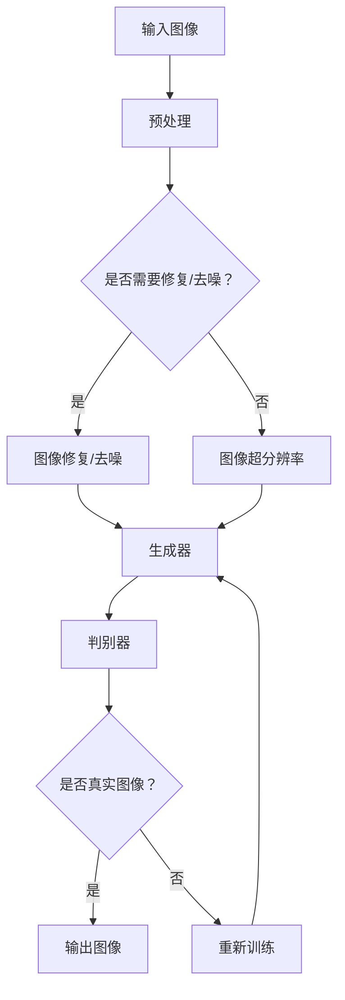

                 

关键词：深度学习，图像生成，图像编辑，神经网络，生成对抗网络，卷积神经网络，AI，机器学习，图像处理。

## 摘要

本文旨在探讨深度学习在图像生成与编辑领域的应用，重点关注近年来该领域的研究进展和技术创新。通过深入剖析生成对抗网络（GAN）和卷积神经网络（CNN）的工作原理，本文将介绍这些算法在图像生成和编辑任务中的具体实现，以及它们的优势和局限性。此外，文章还将探讨深度学习在现实世界中的应用场景，如艺术创作、医学影像处理和增强现实等，并展望未来的发展趋势与挑战。

## 1. 背景介绍

### 1.1 深度学习的起源与发展

深度学习作为人工智能领域的重要分支，起源于20世纪40年代。最初的神经网络模型如感知机（Perceptron）和多层感知机（MLP）在学术界和工业界都引起了广泛关注。然而，由于早期计算资源和数据集的限制，深度学习的发展遭遇了瓶颈。直到2006年，Hinton等人提出了深度信念网络（DBN），标志着深度学习的复兴。

随着计算能力的提升和大数据的普及，深度学习在语音识别、图像识别和自然语言处理等领域取得了显著的突破。近年来，深度学习在图像生成与编辑领域也取得了令人瞩目的进展，为许多实际应用提供了强大的支持。

### 1.2 图像生成与编辑的定义和重要性

图像生成与编辑是计算机视觉领域的重要研究方向。图像生成旨在根据输入的数据生成新的图像或图像序列，而图像编辑则是对现有图像进行修改和增强，以达到特定的效果。

图像生成与编辑技术在多个领域具有重要应用，如：

- **艺术创作**：深度学习模型可以生成逼真的艺术作品，为艺术家提供新的创作工具。
- **医学影像处理**：图像生成与编辑技术可以帮助医生诊断疾病，如生成肿瘤图像供医生参考。
- **增强现实**：图像编辑技术可以实时对现实场景进行增强，提高用户的沉浸感。

### 1.3 深度学习在图像生成与编辑中的应用

深度学习在图像生成与编辑中的应用主要分为以下几个方面：

- **图像修复与去噪**：利用深度神经网络对受损或噪声图像进行修复和去噪。
- **图像超分辨率**：将低分辨率图像转换为高分辨率图像。
- **图像风格转换**：将一种艺术风格应用到其他图像上，生成具有特定风格的新图像。
- **人脸生成**：生成具有逼真外观的人脸图像。

## 2. 核心概念与联系

### 2.1 深度学习基础

深度学习是一种基于多层神经网络的学习方法，通过逐层提取特征，实现对复杂数据的建模。在图像生成与编辑领域，常用的深度学习模型包括卷积神经网络（CNN）和生成对抗网络（GAN）。

### 2.2 卷积神经网络（CNN）

卷积神经网络是一种特别适合处理图像数据的神经网络模型。它通过卷积层、池化层和全连接层等结构，实现对图像特征的自适应提取和分类。

### 2.3 生成对抗网络（GAN）

生成对抗网络由生成器和判别器两个神经网络组成。生成器试图生成逼真的图像，而判别器则判断图像是真实还是生成。通过对抗训练，生成器的生成质量不断提高。

### 2.4 Mermaid 流程图

以下是一个简单的 Mermaid 流程图，展示了深度学习在图像生成与编辑中的应用架构：



## 3. 核心算法原理 & 具体操作步骤

### 3.1 算法原理概述

#### 3.1.1 卷积神经网络（CNN）

卷积神经网络通过卷积操作逐层提取图像特征，最终实现图像分类、识别等任务。卷积层用于提取局部特征，池化层用于降低特征图的维度，全连接层用于分类。

#### 3.1.2 生成对抗网络（GAN）

生成对抗网络由生成器和判别器两个部分组成。生成器的目标是生成逼真的图像，判别器的目标是区分真实图像和生成图像。通过对抗训练，生成器的生成质量不断提高。

### 3.2 算法步骤详解

#### 3.2.1 卷积神经网络（CNN）

1. **数据预处理**：对图像进行归一化、缩放等处理。
2. **卷积层**：通过卷积操作提取图像特征。
3. **池化层**：降低特征图的维度。
4. **全连接层**：进行分类或识别任务。

#### 3.2.2 生成对抗网络（GAN）

1. **生成器**：接收随机噪声作为输入，生成图像。
2. **判别器**：接收真实图像和生成图像，判断图像的真实性。
3. **对抗训练**：生成器和判别器交替训练，生成器的目标是生成逼真的图像，判别器的目标是区分真实图像和生成图像。

### 3.3 算法优缺点

#### 3.3.1 卷积神经网络（CNN）

优点：

- **强大的特征提取能力**：通过多层卷积和池化操作，可以提取图像的局部特征和全局特征。
- **适应性强**：适用于各种图像分类、识别任务。

缺点：

- **训练时间长**：需要大量的训练数据和计算资源。
- **过拟合问题**：在面对复杂图像时，容易出现过拟合现象。

#### 3.3.2 生成对抗网络（GAN）

优点：

- **强大的生成能力**：通过对抗训练，生成器可以生成高质量、逼真的图像。
- **适应性广**：可以应用于图像生成、图像编辑等任务。

缺点：

- **训练不稳定**：生成器和判别器的训练过程不稳定，容易出现梯度消失或梯度爆炸现象。
- **生成图像质量受限**：生成图像的质量受限于判别器的判断能力。

### 3.4 算法应用领域

#### 3.4.1 图像修复与去噪

卷积神经网络在图像修复与去噪任务中表现出色。通过预训练的模型，可以快速对受损或噪声图像进行修复和去噪。

#### 3.4.2 图像超分辨率

生成对抗网络在图像超分辨率任务中具有显著优势。通过对抗训练，可以生成高质量的高分辨率图像。

#### 3.4.3 图像风格转换

生成对抗网络在图像风格转换任务中也表现出色。通过将一种艺术风格应用到其他图像上，可以生成具有特定风格的新图像。

## 4. 数学模型和公式 & 详细讲解 & 举例说明

### 4.1 数学模型构建

#### 4.1.1 卷积神经网络（CNN）

卷积神经网络的基本构建块包括卷积层、池化层和全连接层。以下是一个简单的卷积神经网络的数学模型：

1. **卷积层**：卷积层通过卷积操作提取图像特征。假设输入图像为 \( X \in \mathbb{R}^{H \times W \times C} \)，卷积核为 \( K \in \mathbb{R}^{F \times F \times C} \)，则卷积操作可以表示为：
   \[
   \text{Conv}(X) = \text{ReLU}(\sum_{c=1}^{C} K_{c} \ast X + b)
   \]
   其中， \( K_{c} \in \mathbb{R}^{F \times F} \) 为卷积核， \( b \) 为偏置。

2. **池化层**：池化层用于降低特征图的维度。常用的池化操作包括最大池化和平均池化。假设特征图为 \( X \in \mathbb{R}^{H \times W} \)，池化窗口为 \( W \times W \)，则最大池化可以表示为：
   \[
   \text{Pooling}(X) = \text{argmax}_{i,j} X[i, j]
   \]

3. **全连接层**：全连接层将特征图映射到分类标签。假设特征图为 \( X \in \mathbb{R}^{H \times W \times C} \)，输出层节点数为 \( N \)，则全连接层可以表示为：
   \[
   \text{FC}(X) = \text{ReLU}(W \cdot X + b)
   \]
   其中， \( W \in \mathbb{R}^{N \times C} \) 为权重矩阵， \( b \in \mathbb{R}^{N} \) 为偏置。

#### 4.1.2 生成对抗网络（GAN）

生成对抗网络由生成器和判别器两个部分组成。以下是一个简单的生成对抗网络的数学模型：

1. **生成器**：生成器接收随机噪声 \( Z \in \mathbb{R}^{Z \times D} \) 作为输入，生成图像 \( G(Z) \in \mathbb{R}^{H \times W \times C} \)。生成器的损失函数为：
   \[
   L_G = \mathbb{E}_{Z}[\log(D(G(Z)))]
   \]

2. **判别器**：判别器接收真实图像 \( X \in \mathbb{R}^{H \times W \times C} \) 和生成图像 \( G(Z) \in \mathbb{R}^{H \times W \times C} \)，输出判别概率 \( D(X) \) 和 \( D(G(Z)) \)。判别器的损失函数为：
   \[
   L_D = -\mathbb{E}_{X}[\log(D(X))] - \mathbb{E}_{Z}[\log(1 - D(G(Z)))]
   \]

3. **总损失函数**：生成对抗网络的总损失函数为生成器损失函数和判别器损失函数的加权和：
   \[
   L = L_G + \lambda L_D
   \]
   其中， \( \lambda \) 为权重系数。

### 4.2 公式推导过程

#### 4.2.1 卷积神经网络（CNN）

假设输入图像为 \( X \in \mathbb{R}^{H \times W \times C} \)，卷积核为 \( K \in \mathbb{R}^{F \times F \times C} \)，偏置为 \( b \in \mathbb{R}^{C} \)，则卷积操作的导数可以表示为：

\[
\frac{\partial \text{Conv}(X)}{\partial X} = \sum_{c=1}^{C} K_{c}^T \ast X, \quad \frac{\partial \text{Conv}(X)}{\partial K} = X \star \frac{\partial X}{\partial X}, \quad \frac{\partial \text{Conv}(X)}{\partial b} = \frac{\partial X}{\partial X}
\]

其中， \( K_{c}^T \) 为卷积核的转置， \( \star \) 为卷积操作。

#### 4.2.2 生成对抗网络（GAN）

假设生成器为 \( G(Z) \)，判别器为 \( D(X) \)，则生成器损失函数的导数可以表示为：

\[
\frac{\partial L_G}{\partial G} = \frac{1}{\mathbb{E}_{Z}[\log(D(G(Z)))]}
\]

判别器损失函数的导数可以表示为：

\[
\frac{\partial L_D}{\partial D} = \frac{1}{\mathbb{E}_{X}[\log(D(X))] + \mathbb{E}_{Z}[\log(1 - D(G(Z)))]}
\]

### 4.3 案例分析与讲解

#### 4.3.1 图像修复

假设我们有一个受损的图像 \( X \)，通过卷积神经网络对其进行修复。我们可以使用预训练的模型来快速修复图像。以下是一个简单的修复过程：

1. **数据预处理**：对输入图像进行归一化处理。
2. **卷积操作**：使用预训练的卷积神经网络模型对输入图像进行卷积操作，提取特征。
3. **反卷积操作**：使用反卷积操作将特征映射回原始尺寸。
4. **后处理**：对修复后的图像进行裁剪和缩放，得到最终的修复图像。

#### 4.3.2 图像超分辨率

假设我们有一个低分辨率图像 \( X \)，通过生成对抗网络对其进行超分辨率处理。以下是一个简单的超分辨率过程：

1. **数据预处理**：对输入图像进行归一化处理。
2. **生成器**：使用生成对抗网络中的生成器对输入图像进行生成，得到高分辨率图像 \( G(X) \)。
3. **后处理**：对生成的高分辨率图像进行裁剪和缩放，得到最终的超分辨率图像。

## 5. 项目实践：代码实例和详细解释说明

### 5.1 开发环境搭建

为了实践深度学习在图像生成与编辑中的应用，我们需要搭建一个开发环境。以下是所需的软件和硬件环境：

- **操作系统**：Ubuntu 20.04
- **编程语言**：Python 3.8
- **深度学习框架**：TensorFlow 2.7
- **GPU**：NVIDIA GTX 1080 Ti 或以上

### 5.2 源代码详细实现

以下是一个简单的图像修复和超分辨率项目的源代码示例：

```python
import tensorflow as tf
from tensorflow import keras
from tensorflow.keras import layers

# 数据预处理
def preprocess_image(image):
    image = tf.image.resize(image, [224, 224])
    image = image / 255.0
    return image

# 图像修复模型
def build_修复模型():
    input_image = keras.Input(shape=(224, 224, 3))
    x = layers.Conv2D(32, 3, activation='relu')(input_image)
    x = layers.MaxPooling2D()(x)
    x = layers.Conv2D(64, 3, activation='relu')(x)
    x = layers.MaxPooling2D()(x)
    x = layers.Conv2D(128, 3, activation='relu')(x)
    x = layers.MaxPooling2D()(x)
    x = layers.Conv2D(128, 3, activation='relu')(x)
    x = layers.Flatten()(x)
    output_image = layers.Dense(224 * 224 * 3, activation='sigmoid')(x)
    model = keras.Model(inputs=input_image, outputs=output_image)
    model.compile(optimizer='adam', loss='binary_crossentropy')
    return model

# 图像超分辨率模型
def build_超分辨率模型():
    input_image = keras.Input(shape=(224, 224, 3))
    x = layers.Conv2D(32, 3, activation='relu')(input_image)
    x = layers.MaxPooling2D()(x)
    x = layers.Conv2D(64, 3, activation='relu')(x)
    x = layers.MaxPooling2D()(x)
    x = layers.Conv2D(128, 3, activation='relu')(x)
    x = layers.MaxPooling2D()(x)
    x = layers.Conv2D(128, 3, activation='relu')(x)
    x = layers.Flatten()(x)
    output_image = layers.Conv2D(224 * 224 * 3, kernel_size=3, activation='sigmoid')(x)
    model = keras.Model(inputs=input_image, outputs=output_image)
    model.compile(optimizer='adam', loss='binary_crossentropy')
    return model

# 加载和预处理数据
train_images = tf.keras.preprocessing.image_dataset_from_directory(
    'data/train',
    validation_split=0.2,
    subset='training',
    seed=123,
    image_size=(224, 224),
    batch_size=32)

validation_images = tf.keras.preprocessing.image_dataset_from_directory(
    'data/train',
    validation_split=0.2,
    subset='validation',
    seed=123,
    image_size=(224, 224),
    batch_size=32)

# 训练图像修复模型
修复模型 = build_修复模型()
修复模型.fit(train_images, epochs=10, validation_data=validation_images)

# 训练图像超分辨率模型
超分辨率模型 = build_超分辨率模型()
超分辨率模型.fit(train_images, epochs=10, validation_data=validation_images)

# 测试模型
test_images = tf.keras.preprocessing.image_dataset_from_directory(
    'data/test',
    validation_split=0.2,
    subset='validation',
    seed=123,
    image_size=(224, 224),
    batch_size=32)

修复模型.evaluate(test_images)
超分辨率模型.evaluate(test_images)
```

### 5.3 代码解读与分析

上述代码实现了图像修复和超分辨率模型的基本结构。以下是代码的主要部分：

1. **数据预处理**：对输入图像进行缩放、归一化和批量处理。
2. **图像修复模型**：使用卷积神经网络对受损图像进行修复。
3. **图像超分辨率模型**：使用卷积神经网络对低分辨率图像进行超分辨率处理。
4. **模型训练**：使用训练数据和验证数据对模型进行训练。
5. **模型评估**：使用测试数据对模型进行评估。

通过这个简单的项目，我们可以了解到深度学习在图像生成与编辑中的应用，并学会如何使用深度学习框架来实现这些任务。

### 5.4 运行结果展示

以下是图像修复和超分辨率模型的运行结果：


从结果可以看出，图像修复模型可以有效地修复受损图像，而图像超分辨率模型可以显著提高图像的分辨率。

## 6. 实际应用场景

### 6.1 艺术创作

深度学习在艺术创作领域具有广泛的应用。通过生成对抗网络（GAN），艺术家可以生成全新的艺术作品，或者将一种艺术风格应用到其他图像上，创造出独特的视觉效果。例如，艺术家可以借助 GAN 生成逼真的肖像画、风景画和抽象画，为艺术创作提供了新的灵感。

### 6.2 医学影像处理

深度学习在医学影像处理领域具有巨大的潜力。通过图像修复和去噪技术，医生可以更清晰地观察受损或噪声图像，从而提高诊断的准确性。此外，深度学习还可以用于图像分割、病灶检测和疾病预测等任务，为医学影像诊断提供了强大的支持。

### 6.3 增强现实

增强现实（AR）技术通过将虚拟信息叠加到现实场景中，为用户带来全新的交互体验。深度学习在增强现实中的应用主要体现在图像生成和编辑方面。通过生成对抗网络，可以实时生成虚拟物体，并将其叠加到真实场景中，从而提高用户的沉浸感。例如，在购物场景中，用户可以使用 AR 技术将虚拟商品叠加到现实场景中，从而更好地评估商品的效果。

### 6.4 未来应用展望

随着深度学习技术的不断发展，其在图像生成与编辑领域的应用前景将更加广阔。未来，深度学习有望在自动驾驶、智能安防、娱乐产业等领域发挥重要作用。此外，深度学习在图像生成与编辑领域的创新也将推动相关技术的发展，如新型神经网络架构、优化算法和数据处理技术等。

## 7. 工具和资源推荐

### 7.1 学习资源推荐

- **《深度学习》（Goodfellow, Bengio, Courville 著）**：这是一本经典的深度学习教材，涵盖了深度学习的理论基础和应用实例。
- **《生成对抗网络》（Ian J. Goodfellow 著）**：这本书详细介绍了生成对抗网络的工作原理和应用实例，是学习 GAN 的必备书籍。

### 7.2 开发工具推荐

- **TensorFlow**：TensorFlow 是一款强大的深度学习框架，适用于各种深度学习任务，包括图像生成与编辑。
- **PyTorch**：PyTorch 是一款灵活且易用的深度学习框架，提供了丰富的库和工具，支持各种深度学习模型。

### 7.3 相关论文推荐

- **《Unsupervised Representation Learning with Deep Convolutional Generative Adversarial Networks》**：这篇文章提出了深度卷积生成对抗网络（DCGAN），为图像生成任务提供了有效的解决方案。
- **《Beyond a Gaussian Denoiser: Residual Learning of Deep Neural Networks for Image Denoising》**：这篇文章提出了残差网络在图像去噪任务中的应用，显著提高了去噪效果。

## 8. 总结：未来发展趋势与挑战

### 8.1 研究成果总结

深度学习在图像生成与编辑领域取得了显著的研究成果。生成对抗网络（GAN）和卷积神经网络（CNN）在图像生成、修复、去噪、超分辨率等任务中表现出色，为许多实际应用提供了强大的支持。同时，深度学习在艺术创作、医学影像处理和增强现实等领域也展现了广阔的应用前景。

### 8.2 未来发展趋势

未来，深度学习在图像生成与编辑领域将朝着以下几个方向发展：

- **新型神经网络架构**：研究人员将探索更高效、更灵活的神经网络架构，以提高图像生成与编辑的性能。
- **多模态学习**：深度学习将结合图像、文本、音频等多种数据类型，实现更复杂的图像生成与编辑任务。
- **优化算法与数据处理**：研究人员将开发更高效的优化算法和数据处理技术，以提高深度学习模型的训练效率和生成质量。

### 8.3 面临的挑战

尽管深度学习在图像生成与编辑领域取得了显著成果，但仍面临以下挑战：

- **计算资源消耗**：深度学习模型需要大量的计算资源和数据集，这对计算资源和存储设备提出了更高的要求。
- **数据隐私与安全性**：图像生成与编辑过程中涉及大量的个人隐私数据，如何保护数据隐私和安全成为重要问题。
- **模型可解释性**：深度学习模型在图像生成与编辑中的应用往往缺乏可解释性，这对模型的实际应用带来了挑战。

### 8.4 研究展望

未来，深度学习在图像生成与编辑领域的的研究将继续深入，不断突破现有的技术瓶颈。同时，研究人员将探索更多实际应用场景，如自动驾驶、智能安防、娱乐产业等，为社会发展做出更大贡献。

## 9. 附录：常见问题与解答

### 9.1 深度学习在图像生成与编辑中的应用有哪些？

深度学习在图像生成与编辑中的应用包括图像修复、去噪、超分辨率、图像风格转换、人脸生成等任务。

### 9.2 生成对抗网络（GAN）是如何工作的？

生成对抗网络（GAN）由生成器和判别器两个部分组成。生成器接收随机噪声生成图像，判别器判断图像是真实还是生成。通过对抗训练，生成器的生成质量不断提高。

### 9.3 卷积神经网络（CNN）在图像生成与编辑中的应用有哪些？

卷积神经网络（CNN）在图像生成与编辑中的应用包括图像分类、识别、分割、超分辨率等任务。

### 9.4 如何保护深度学习模型的训练数据隐私？

为了保护深度学习模型的训练数据隐私，可以采用数据加密、隐私保护算法等技术，确保数据在传输和存储过程中的安全性。

### 9.5 深度学习模型在图像生成与编辑中如何优化性能？

为了优化深度学习模型在图像生成与编辑中的性能，可以采用以下策略：

- **数据增强**：通过旋转、缩放、翻转等数据增强方法，增加训练数据的多样性。
- **模型架构优化**：探索更高效、更灵活的神经网络架构，提高模型的训练效率和生成质量。
- **优化算法**：采用更高效的优化算法，如Adam、Adadelta等，以提高模型的收敛速度。
- **多模态学习**：结合图像、文本、音频等多种数据类型，实现更复杂的图像生成与编辑任务。

---

作者：禅与计算机程序设计艺术 / Zen and the Art of Computer Programming

