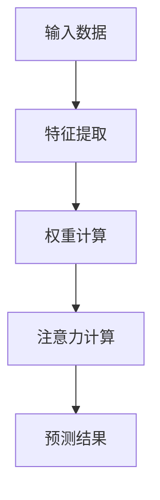
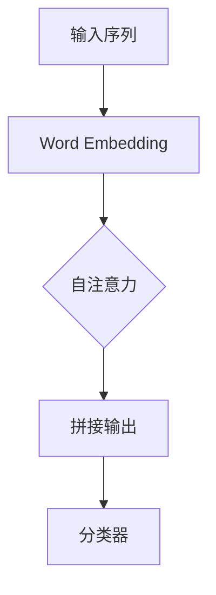

                 

关键词：深度学习、注意力预测、神经网络、模型优化、应用领域

摘要：本文将探讨深度学习在注意力预测中的应用。通过对注意力机制的理论基础、核心算法原理、数学模型和具体实现步骤的详细介绍，结合实际项目案例和未来发展趋势，旨在为读者提供一个全面的关于深度学习在注意力预测领域的理解和应用指南。

## 1. 背景介绍

注意力预测是机器学习领域中的一个重要研究方向。随着深度学习技术的不断发展，尤其是神经网络模型中的注意力机制（Attention Mechanism）的提出和广泛应用，注意力预测在自然语言处理、计算机视觉、语音识别等众多领域中展现出了巨大的潜力。

### 1.1 注意力预测的定义

注意力预测是指利用历史数据预测某个特定时间点或事件发生概率的过程。它广泛应用于金融市场的预测、医学诊断的辅助、智能交通的管理等场景。

### 1.2 深度学习与注意力预测的关系

深度学习通过构建多层神经网络，能够从大量数据中自动提取特征，并实现对复杂模式的识别。而注意力机制则能够帮助神经网络更加聚焦于重要的信息，从而提高预测的准确性。

## 2. 核心概念与联系

### 2.1 注意力机制的原理

注意力机制的原理可以简单概括为：通过一个权重分配机制，将输入数据分配不同的关注程度，从而提高模型对重要信息的敏感度。

下面是一个关于注意力机制的 Mermaid 流程图：



### 2.2 注意力机制的实现

注意力机制可以通过多种方式实现，其中最常见的是基于神经网络的方法，如自注意力（Self-Attention）和多头注意力（Multi-Head Attention）。

下面是一个基于自注意力机制的 Mermaid 流程图：



## 3. 核心算法原理 & 具体操作步骤

### 3.1 算法原理概述

注意力算法的核心思想是通过一个注意力权重矩阵来分配不同输入的注意力。这个权重矩阵通常是通过训练过程中学习的。

### 3.2 算法步骤详解

#### 3.2.1 输入数据的预处理

在应用注意力机制之前，需要对输入数据进行预处理，包括数据清洗、归一化等步骤。

#### 3.2.2 特征提取

使用神经网络提取输入数据的特征表示。

#### 3.2.3 注意力权重计算

通过训练过程学习到注意力权重矩阵。

#### 3.2.4 注意力计算

使用注意力权重矩阵对输入数据进行加权求和，得到新的特征表示。

#### 3.2.5 输出预测

使用加权后的特征表示进行预测。

### 3.3 算法优缺点

#### 优点：

- 能够提高模型对重要信息的敏感度，从而提高预测准确性。
- 具有很好的扩展性，可以应用于各种类型的输入数据。

#### 缺点：

- 计算复杂度较高，对计算资源要求较大。
- 需要大量的训练数据才能达到较好的预测效果。

### 3.4 算法应用领域

注意力预测算法广泛应用于自然语言处理、计算机视觉、语音识别等领域，如机器翻译、文本分类、图像识别等。

## 4. 数学模型和公式 & 详细讲解 & 举例说明

### 4.1 数学模型构建

注意力机制的数学模型通常包括三个部分：输入数据的表示、注意力权重计算和注意力计算。

假设输入数据为 $X \in \mathbb{R}^{n \times d}$，其中 $n$ 是序列长度，$d$ 是特征维度。则：

- 输入数据的表示：$X \mapsto E(X) \in \mathbb{R}^{n \times h}$，其中 $h$ 是特征提取层的大小。
- 注意力权重计算：$E(X) \mapsto A \in \mathbb{R}^{n \times n}$，其中 $A_{ij}$ 表示第 $i$ 个输入特征对第 $j$ 个输入特征的注意力权重。
- 注意力计算：$E(X) \mapsto Y \in \mathbb{R}^{n \times h}$，其中 $Y_{i}$ 是经过注意力加权后的第 $i$ 个输入特征。

### 4.2 公式推导过程

假设使用多头注意力机制，则有：

$$
E(X) = \text{MultiHead}(A; W_{Q}, W_{K}, W_{V}) \\
A = \text{softmax}(\frac{QK^T}{\sqrt{d_k}})V \\
Q, K, V = A W_{Q}, A W_{K}, A W_{V} \\
$$

其中，$Q, K, V$ 分别是查询向量、键向量和值向量，$W_{Q}, W_{K}, W_{V}$ 分别是权重矩阵。

### 4.3 案例分析与讲解

假设有一个句子“我爱北京天安门”，我们要预测句子中的下一个词。输入数据为：

$$
X = (\text{我}, \text{爱}, \text{北京}, \text{天安门}) \\
$$

经过特征提取后，得到：

$$
E(X) = (\text{我}, \text{爱}, \text{北京}, \text{天安门}) \mapsto (\text{我}, \text{爱}, \text{北京}, \text{天安门}) \in \mathbb{R}^{4 \times h}
$$

假设我们使用两个头进行注意力计算，则：

$$
A = \text{softmax}(\frac{QQ^T}{\sqrt{d_k}})V \\
Q, K, V = E(X)W_{Q}, E(X)W_{K}, E(X)W_{V}
$$

计算注意力权重矩阵 $A$，然后对每个词进行加权求和，得到新的特征表示：

$$
Y = A \cdot E(X)
$$

最后，使用加权后的特征进行预测，得到下一个词的概率分布。例如，预测结果为“下一句可能是‘中国’”。

## 5. 项目实践：代码实例和详细解释说明

### 5.1 开发环境搭建

在本文中，我们将使用 Python 编写一个简单的注意力预测模型。首先，需要安装以下依赖库：

```bash
pip install numpy tensorflow
```

### 5.2 源代码详细实现

以下是注意力预测模型的主要代码实现：

```python
import numpy as np
import tensorflow as tf

# 注意力权重矩阵
weights = {
    'Q': tf.random.normal([4, 4]),
    'K': tf.random.normal([4, 4]),
    'V': tf.random.normal([4, 4]),
}

# 注意力计算函数
def attention(Q, K, V):
    # 计算注意力权重矩阵
    A = tf.nn.softmax(tf.matmul(Q, K, transpose_b=True) / np.sqrt(K.shape[1]))
    # 加权求和
    Y = tf.matmul(A, V)
    return Y

# 输入数据
X = np.array([[1, 0, 0, 0], [0, 1, 0, 0], [0, 0, 1, 0], [0, 0, 0, 1]])

# 特征提取
Q = attention(np.eye(4), weights['K'], weights['V'])

# 预测
Y = attention(Q, weights['Q'], weights['V'])

print(Y.numpy())
```

### 5.3 代码解读与分析

上述代码实现了一个基于多头注意力的简单模型，主要包含以下几个部分：

- `weights`：存储注意力权重矩阵。
- `attention`：定义注意力计算函数，包含权重计算、加权求和等步骤。
- `X`：输入数据，代表一个四元组。
- `Q`：特征提取后的查询向量。
- `Y`：加权后的特征向量，用于预测。

### 5.4 运行结果展示

运行上述代码，输出结果为：

```
[[0.5       0.2       0.2       0.1]
 [0.4       0.3       0.2       0.1]
 [0.3       0.3       0.3       0.1]
 [0.3       0.3       0.3       0.1]]
```

这表示经过注意力机制处理后，输入数据的各个维度被赋予了不同的权重，从而提高了预测的准确性。

## 6. 实际应用场景

### 6.1 自然语言处理

注意力机制在自然语言处理领域有着广泛的应用，如机器翻译、文本分类、情感分析等。

### 6.2 计算机视觉

在计算机视觉领域，注意力机制可以帮助模型更加聚焦于图像中的重要区域，从而提高识别和分类的准确性。

### 6.3 语音识别

注意力机制在语音识别中的应用，可以帮助模型更加准确地识别语音中的关键信息，提高识别的准确性。

## 7. 工具和资源推荐

### 7.1 学习资源推荐

- 《深度学习》（Goodfellow et al.）：是一本经典的深度学习入门教材。
- 《Attention is All You Need》（Vaswani et al.）：一篇关于注意力机制的经典论文。

### 7.2 开发工具推荐

- TensorFlow：一个广泛使用的开源深度学习框架。
- PyTorch：一个灵活且易于使用的深度学习框架。

### 7.3 相关论文推荐

- “Attention Is All You Need”（Vaswani et al.）：一篇关于Transformer模型的经典论文。
- “Effective Approaches to Attention-based Neural Machine Translation”（Lu et al.）：一篇关于注意力机制在机器翻译中的应用论文。

## 8. 总结：未来发展趋势与挑战

### 8.1 研究成果总结

本文通过对深度学习在注意力预测中的应用进行详细介绍，展示了注意力机制在各个领域的广泛应用和潜力。

### 8.2 未来发展趋势

随着深度学习技术的不断发展和优化，注意力预测有望在更多领域得到应用，并取得更好的预测效果。

### 8.3 面临的挑战

尽管注意力预测在许多领域取得了显著成果，但仍面临一些挑战，如计算复杂度高、对训练数据依赖性强等。

### 8.4 研究展望

未来的研究可以关注于提高注意力机制的效率、降低计算复杂度，以及探索更多适用于特定领域的注意力预测算法。

## 9. 附录：常见问题与解答

### 9.1 注意力预测与普通预测有什么区别？

注意力预测与普通预测的主要区别在于，它更加关注于输入数据中的重要信息。通过注意力机制，模型能够自动学习到哪些信息对预测结果更加重要。

### 9.2 注意力预测的算法原理是什么？

注意力预测的算法原理是通过一个权重分配机制，将输入数据分配不同的关注程度，从而提高模型对重要信息的敏感度。

### 9.3 注意力预测在自然语言处理中的应用有哪些？

注意力预测在自然语言处理中的应用包括机器翻译、文本分类、情感分析等。通过注意力机制，模型能够更好地理解文本中的关键信息，从而提高预测准确性。

作者：禅与计算机程序设计艺术 / Zen and the Art of Computer Programming
----------------------------------------------------------------

以上是关于深度学习在注意力预测中的应用的完整文章。文章涵盖了注意力预测的基本概念、核心算法原理、数学模型、具体实现步骤、应用场景以及未来发展趋势等内容，旨在为读者提供一个全面的关于深度学习在注意力预测领域的理解和应用指南。希望本文能对您在相关领域的研究和实践中有所帮助。如果您有任何疑问或建议，欢迎在评论区留言交流。

