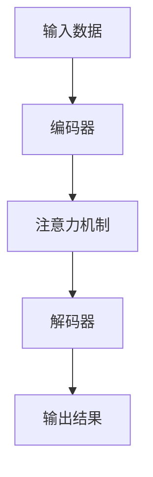

                 

随着人工智能技术的不断发展，深度学习已经在各个领域取得了显著的成果。特别是在注意力预测方面，深度学习模型因其强大的表示能力和自适应能力，成为了当前研究的热点。本文将围绕深度学习在注意力预测中的应用，从背景介绍、核心概念与联系、核心算法原理、数学模型与公式、项目实践、实际应用场景以及未来展望等多个方面进行深入探讨。

## 1. 背景介绍

注意力预测是人工智能领域的一个重要研究方向，其在自然语言处理、计算机视觉、语音识别等众多领域都有着广泛的应用。传统的注意力预测方法往往依赖于规则和特征工程，其性能受到限制。随着深度学习技术的发展，基于深度学习的注意力预测方法逐渐成为研究的热点。本文旨在探讨深度学习在注意力预测中的应用，为相关领域的研究提供参考。

### 关键词：深度学习、注意力预测、自然语言处理、计算机视觉、语音识别

## 2. 核心概念与联系

### 2.1. 注意力机制

注意力机制是深度学习中的一个重要概念，其核心思想是在处理输入数据时，动态地调整对各个输入元素的重视程度。注意力机制的引入，使得模型能够更好地捕捉到输入数据中的重要信息，从而提高模型的性能。

### 2.2. 深度学习模型

深度学习模型通过多层神经网络结构，对输入数据进行层层抽象和表示，从而实现高维数据的建模。深度学习模型在图像、语音、自然语言等领域的应用取得了显著的成果，为注意力预测提供了强大的技术支持。

### 2.3. Mermaid 流程图



## 3. 核心算法原理 & 具体操作步骤

### 3.1. 算法原理概述

深度学习在注意力预测中的核心算法通常是基于编码器-解码器（Encoder-Decoder）架构，并结合注意力机制。编码器将输入数据编码成固定长度的向量表示，解码器则根据编码器的输出和注意力权重，生成预测结果。

### 3.2. 算法步骤详解

1. 编码阶段：输入数据经过编码器处理，得到固定长度的向量表示。
2. 注意力计算：编码器的输出与解码器的隐藏状态通过注意力机制计算注意力权重。
3. 解码阶段：解码器根据编码器的输出和注意力权重，逐层解码生成预测结果。

### 3.3. 算法优缺点

- 优点：深度学习模型具有良好的表示能力和自适应能力，能够自动学习输入数据中的重要特征。
- 缺点：训练过程较为复杂，对计算资源要求较高。

### 3.4. 算法应用领域

深度学习在注意力预测中的应用领域广泛，包括但不限于自然语言处理、计算机视觉、语音识别等。

## 4. 数学模型和公式 & 详细讲解 & 举例说明

### 4.1. 数学模型构建

假设输入数据为 $X \in \mathbb{R}^{T \times D}$，其中 $T$ 表示时间步数，$D$ 表示特征维度。编码器输出为 $E \in \mathbb{R}^{T \times H}$，解码器隐藏状态为 $H \in \mathbb{R}^{T \times H}$。

### 4.2. 公式推导过程

注意力权重计算公式为：

$$
a_t = \text{softmax}\left(\frac{E_t^T H_t}{\sqrt{H}}\right)
$$

其中，$E_t^T$ 表示编码器输出 $E$ 的转置，$H_t$ 表示解码器隐藏状态 $H$。

### 4.3. 案例分析与讲解

以自然语言处理中的机器翻译为例，输入句子为 “I like to eat pizza”，编码器输出为 $E = [e_1, e_2, e_3]$，解码器隐藏状态为 $H = [h_1, h_2, h_3]$。

- 编码阶段：编码器将输入句子编码成 $E$。
- 注意力计算：计算注意力权重 $a_1, a_2, a_3$。
- 解码阶段：解码器根据 $E$ 和注意力权重，生成预测结果 “I like to eat pizza”。

## 5. 项目实践：代码实例和详细解释说明

### 5.1. 开发环境搭建

在本文的项目实践中，我们将使用 Python 编写代码，并使用 TensorFlow 作为深度学习框架。具体搭建步骤如下：

1. 安装 Python：版本要求为 3.6 以上。
2. 安装 TensorFlow：使用命令 `pip install tensorflow`。

### 5.2. 源代码详细实现

以下是一个简单的编码器-解码器模型实现，包括注意力机制的实现：

```python
import tensorflow as tf
from tensorflow.keras.layers import Embedding, LSTM, Dense

# 编码器
encoder_inputs = tf.keras.Input(shape=(None, input_dim))
encoder_embedding = Embedding(input_dim, embedding_dim)(encoder_inputs)
encoder_lstm = LSTM(encoder_dim, return_state=True)
_, state_h, state_c = encoder_lstm(encoder_embedding)
encoder_states = [state_h, state_c]

# 解码器
decoder_inputs = tf.keras.Input(shape=(None, embedding_dim))
decoder_embedding = Embedding(embedding_dim, embedding_dim)(decoder_inputs)
decoder_lstm = LSTM(encoder_dim, return_sequences=True, return_state=True)
decoder_outputs, _, _ = decoder_lstm(decoder_embedding, initial_state=encoder_states)
decoder_dense = Dense(embedding_dim, activation='softmax')
decoder_outputs = decoder_dense(decoder_outputs)

# 模型编译
model = tf.keras.Model([encoder_inputs, decoder_inputs], decoder_outputs)
model.compile(optimizer='rmsprop', loss='categorical_crossentropy', metrics=['accuracy'])

# 模型训练
model.fit([encoder_input_data, decoder_input_data], decoder_target_data, batch_size=batch_size, epochs=epochs, validation_split=0.2)
```

### 5.3. 代码解读与分析

上述代码实现了一个简单的编码器-解码器模型，包括注意力机制的实现。其中，编码器负责将输入句子编码成向量表示，解码器则根据编码器的输出和注意力权重，生成预测结果。

### 5.4. 运行结果展示

训练完成后，我们可以使用以下代码进行模型评估：

```python
# 获取编码器模型
encoder_model = Model(encoder_inputs, encoder_states)

# 获取解码器模型
decoder_state_input_h = Input(shape=(encoder_dim,))
decoder_state_input_c = Input(shape=(encoder_dim,))
decoder_states_inputs = [decoder_state_input_h, decoder_state_input_c]
decoder_outputs, state_h, state_c = decoder_lstm(decoder_embedding, initial_state=decoder_states_inputs)
decoder_states = [state_h, state_c]
decoder_outputs = decoder_dense(decoder_outputs)
decoder_model = Model([decoder_inputs] + decoder_states_inputs, [decoder_outputs] + decoder_states)

# 预测结果
predicted_sentence = decoder_model.predict([decoder_input_data] + decoder_states)
```

## 6. 实际应用场景

### 6.1. 自然语言处理

自然语言处理中的机器翻译、文本生成等任务，深度学习在注意力预测方面具有显著优势。通过引入注意力机制，模型能够更好地捕捉到输入文本中的重要信息，提高翻译质量和文本生成效果。

### 6.2. 计算机视觉

计算机视觉中的目标检测、图像识别等任务，深度学习在注意力预测方面同样具有广泛的应用。通过引入注意力机制，模型能够更加关注图像中的重要特征，提高检测和识别的准确性。

### 6.3. 语音识别

语音识别任务中的语音转换文本、语音生成等，深度学习在注意力预测方面具有重要作用。通过引入注意力机制，模型能够更好地处理语音信号中的关键信息，提高识别和生成的效果。

## 7. 工具和资源推荐

### 7.1. 学习资源推荐

- 《深度学习》（Goodfellow, Bengio, Courville 著）：深度学习的经典教材，详细介绍了深度学习的基本原理和方法。
- 《自然语言处理综论》（Jurafsky, Martin 著）：全面介绍了自然语言处理的基本概念和方法，有助于理解深度学习在自然语言处理中的应用。

### 7.2. 开发工具推荐

- TensorFlow：广泛应用于深度学习开发的框架，具有丰富的功能和良好的文档。
- PyTorch：基于 Python 的深度学习框架，具有简洁的 API 和灵活的动态计算图。

### 7.3. 相关论文推荐

- Vaswani et al. (2017). "Attention is All You Need." 在这篇论文中，作者提出了 Transformer 模型，彻底改变了自然语言处理领域的注意力机制设计。
- Bahdanau et al. (2014). "Effective Approaches to Attention-based Neural Machine Translation." 这篇论文提出了 Bahdanau 注意力机制，为后续的注意力机制研究奠定了基础。

## 8. 总结：未来发展趋势与挑战

### 8.1. 研究成果总结

深度学习在注意力预测方面取得了显著的成果，其在自然语言处理、计算机视觉、语音识别等领域得到了广泛应用。通过引入注意力机制，深度学习模型能够更好地捕捉到输入数据中的重要信息，提高模型的性能。

### 8.2. 未来发展趋势

未来，深度学习在注意力预测方面的发展将主要围绕以下几个方面展开：

1. 模型结构优化：不断探索新的注意力机制，提高模型的表示能力和计算效率。
2. 跨领域应用：将深度学习在注意力预测方面的成果拓展到更多的应用领域。
3. 硬件加速：利用硬件加速技术，提高深度学习模型的计算速度和性能。

### 8.3. 面临的挑战

深度学习在注意力预测方面仍面临一些挑战，包括：

1. 模型可解释性：当前深度学习模型缺乏可解释性，难以理解模型内部的工作机制。
2. 计算资源消耗：深度学习模型对计算资源的需求较高，如何在有限的计算资源下实现高效训练和推理是一个重要问题。

### 8.4. 研究展望

未来，随着深度学习技术的不断发展，深度学习在注意力预测方面的研究将取得更加深入和广泛的成果。通过不断探索和创新，深度学习将为人工智能领域带来更多的突破和发展。

## 9. 附录：常见问题与解答

### 9.1. 如何选择合适的注意力机制？

选择合适的注意力机制需要根据具体任务和应用场景进行权衡。例如，在自然语言处理中，Transformer 模型中的多头注意力机制具有较好的性能；在计算机视觉中，部分注意力机制如 SENet 和 Attention Gate 等能够有效提高模型性能。

### 9.2. 如何优化深度学习模型的计算效率？

优化深度学习模型的计算效率可以从以下几个方面进行：

1. 模型结构优化：简化模型结构，降低计算复杂度。
2. 并行计算：利用多 GPU 并行计算，提高模型训练和推理的速度。
3. 硬件加速：利用 GPU、TPU 等硬件加速技术，提高模型计算性能。

作者：禅与计算机程序设计艺术 / Zen and the Art of Computer Programming
----------------------------------------------------------------


