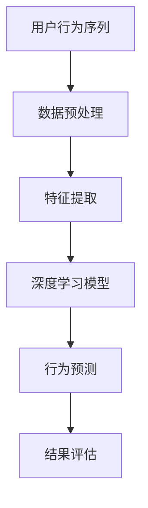

                 

关键词：用户行为序列分析，深度学习，行为模式，时间序列预测，神经网络

> 摘要：本文旨在探讨深度学习在用户行为序列分析中的应用。通过深入分析用户的行为模式，深度学习能够预测用户的未来行为，从而为电子商务、个性化推荐、智能广告等领域提供强有力的支持。本文将详细阐述深度学习在用户行为序列分析中的核心概念、算法原理、数学模型，并通过实际项目实践，展示其在现实世界中的应用。

## 1. 背景介绍

用户行为序列分析是近年来信息技术领域的一个重要研究方向。随着互联网和智能设备的普及，用户的行为数据被大量收集和存储。如何从这些数据中提取有价值的信息，成为当前研究的热点问题。用户行为序列分析旨在通过分析用户在时间维度上的行为数据，挖掘用户的行为模式，进而预测用户未来的行为。

传统的用户行为序列分析方法主要基于统计模型和机器学习算法，如Markov模型、隐马尔可夫模型（HMM）、条件随机场（CRF）等。然而，这些方法在处理复杂的行为序列时存在一定的局限性。随着深度学习技术的不断发展，深度学习在用户行为序列分析中的应用逐渐成为一种新的研究趋势。

深度学习具有自动特征提取的能力，能够从原始数据中自动学习出有意义的特征表示，这使得它非常适合处理复杂的行为序列数据。本文将详细介绍深度学习在用户行为序列分析中的应用，包括核心概念、算法原理、数学模型，并通过实际项目实践展示其应用效果。

## 2. 核心概念与联系

### 2.1 用户行为序列

用户行为序列是指用户在一段时间内产生的行为事件的序列。这些行为事件可以是点击、浏览、购买、评论等。用户行为序列具有时间维度上的连续性和动态性，能够反映用户的行为模式和兴趣偏好。

### 2.2 深度学习

深度学习是一种基于人工神经网络的学习方法，通过多层的神经网络结构自动学习数据中的复杂特征表示。深度学习在图像识别、自然语言处理、语音识别等领域取得了显著成果，成为当前人工智能研究的重要方向。

### 2.3 用户行为序列分析与深度学习

用户行为序列分析与深度学习有着密切的联系。深度学习能够自动提取用户行为序列中的潜在特征，从而更好地挖掘用户的行为模式。同时，深度学习能够处理长序列数据，适应用户行为序列的动态变化。

### 2.4 Mermaid 流程图

## 3. 核心算法原理 & 具体操作步骤

### 3.1 算法原理概述

深度学习在用户行为序列分析中的应用主要基于循环神经网络（RNN）和长短期记忆网络（LSTM）。RNN是一种能够处理序列数据的神经网络，其通过循环机制将前一个时间步的输出作为当前时间步的输入。然而，传统的RNN存在梯度消失和梯度爆炸的问题，使得其在处理长序列数据时效果不佳。LSTM是RNN的一种改进，通过引入门控机制，有效解决了梯度消失问题，使得LSTM在处理长序列数据时表现出更好的性能。

### 3.2 算法步骤详解

1. 数据预处理：对用户行为序列进行数据清洗、去重、填充等操作，确保数据的质量和一致性。

2. 特征提取：利用词袋模型（Bag-of-Words）或词嵌入（Word Embedding）技术将用户行为序列转换为数值表示。

3. 构建深度学习模型：选择合适的深度学习模型，如LSTM、GRU（门控循环单元）等，构建用户行为序列分析模型。

4. 训练模型：使用训练数据集对深度学习模型进行训练，优化模型参数。

5. 行为预测：将测试数据输入到训练好的深度学习模型中，预测用户未来的行为。

6. 结果评估：通过评估指标（如准确率、召回率、F1值等）对模型进行评估，调整模型参数，提高预测效果。

### 3.3 算法优缺点

#### 优点：

1. 自动特征提取：深度学习能够自动学习用户行为序列中的潜在特征，降低人工特征工程的工作量。

2. 处理长序列：LSTM等深度学习模型能够处理长序列数据，适应用户行为序列的动态变化。

3. 高预测性能：深度学习模型在用户行为序列分析中表现出较高的预测性能。

#### 缺点：

1. 计算成本高：深度学习模型需要大量的计算资源和时间进行训练和预测。

2. 数据需求大：深度学习模型需要大量的训练数据进行训练，对数据量有较高要求。

## 3.4 算法应用领域

深度学习在用户行为序列分析中的应用非常广泛，主要包括以下领域：

1. 电子商务：通过分析用户在电子商务平台上的行为序列，预测用户购买意向，为商家提供个性化推荐服务。

2. 个性化推荐：根据用户的历史行为序列，为用户推荐感兴趣的商品或内容。

3. 智能广告：通过分析用户在广告平台上的行为序列，预测用户对广告的点击倾向，为广告主提供优化广告投放策略。

4. 客户行为分析：通过分析客户在客户关系管理（CRM）系统中的行为序列，预测客户的流失风险，为企业提供客户保留策略。

## 4. 数学模型和公式 & 详细讲解 & 举例说明

### 4.1 数学模型构建

在深度学习框架下，用户行为序列分析通常采用循环神经网络（RNN）或其变种LSTM进行建模。以下是LSTM的数学模型构建过程：

#### LSTM单元

LSTM单元由三个门控单元和一个记忆单元组成，包括：

1. 遗忘门（Forget Gate）：决定哪些信息需要从记忆单元中丢弃。

2. 输入门（Input Gate）：决定哪些新的信息需要存储到记忆单元。

3. 输出门（Output Gate）：决定哪些信息需要输出。

#### LSTM单元的数学模型

1. 遗忘门：

   $$ f_t = \sigma(W_f \cdot [h_{t-1}, x_t] + b_f) $$

   其中，$f_t$表示遗忘门的输出，$W_f$和$b_f$分别表示遗忘门的权重和偏置，$h_{t-1}$和$x_t$分别表示前一时间步的隐藏状态和当前输入。

2. 输入门：

   $$ i_t = \sigma(W_i \cdot [h_{t-1}, x_t] + b_i) $$

   其中，$i_t$表示输入门的输出。

3. 输出门：

   $$ o_t = \sigma(W_o \cdot [h_{t-1}, x_t] + b_o) $$

   其中，$o_t$表示输出门的输出。

4. 计算候选值：

   $$ \tilde{C}_t = tanh(W_c \cdot [h_{t-1}, x_t] + b_c) $$

   其中，$\tilde{C}_t$表示候选值。

5. 计算新的记忆单元：

   $$ C_t = f_t \odot C_{t-1} + i_t \odot \tilde{C}_t $$

   其中，$C_t$表示新的记忆单元。

6. 计算隐藏状态：

   $$ h_t = o_t \odot tanh(C_t) $$

   其中，$h_t$表示隐藏状态。

### 4.2 公式推导过程

LSTM单元的数学模型推导如下：

1. 遗忘门：

   遗忘门的输出$f_t$表示为：

   $$ f_t = \sigma(W_f \cdot [h_{t-1}, x_t] + b_f) $$

   其中，$\sigma$表示sigmoid函数，$W_f$和$b_f$分别表示遗忘门的权重和偏置，$h_{t-1}$和$x_t$分别表示前一时间步的隐藏状态和当前输入。

2. 输入门：

   输入门的输出$i_t$表示为：

   $$ i_t = \sigma(W_i \cdot [h_{t-1}, x_t] + b_i) $$

   其中，$\sigma$表示sigmoid函数，$W_i$和$b_i$分别表示输入门的权重和偏置，$h_{t-1}$和$x_t$分别表示前一时间步的隐藏状态和当前输入。

3. 输出门：

   输出门的输出$o_t$表示为：

   $$ o_t = \sigma(W_o \cdot [h_{t-1}, x_t] + b_o) $$

   其中，$\sigma$表示sigmoid函数，$W_o$和$b_o$分别表示输出门的权重和偏置，$h_{t-1}$和$x_t$分别表示前一时间步的隐藏状态和当前输入。

4. 计算候选值：

   计算候选值$\tilde{C}_t$表示为：

   $$ \tilde{C}_t = tanh(W_c \cdot [h_{t-1}, x_t] + b_c) $$

   其中，$tan

