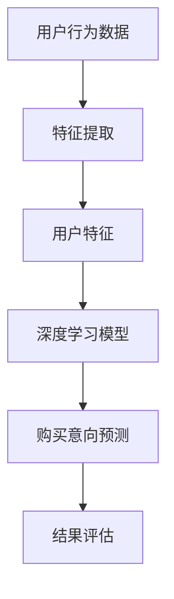

                 

关键词：深度学习、用户购买意向、预测模型、数据挖掘、机器学习

## 摘要

本文将探讨深度学习在用户购买意向预测中的应用。随着大数据时代的到来，用户行为数据的分析和挖掘变得日益重要，而预测用户的购买意向不仅是市场营销领域的关键任务，也是提高企业盈利能力的重要手段。本文旨在介绍一种新的深度学习方法，通过结合多源数据与先进网络架构，提高用户购买意向预测的准确性和效率。文章将详细描述算法原理、数学模型、具体实现步骤以及实际应用案例，旨在为相关领域的研究者和从业者提供有价值的参考。

## 1. 背景介绍

### 1.1 用户购买意向预测的重要性

用户购买意向预测是企业制定市场营销策略、优化库存管理、提升用户体验的关键。随着互联网和电子商务的快速发展，用户行为数据变得丰富且多样，如何有效地利用这些数据进行预测分析，成为企业竞争力的关键。传统的预测方法如逻辑回归、决策树等，在处理复杂非线性关系时效果有限。而深度学习作为一种强大的机器学习模型，通过多层神经网络的结构，能够捕捉数据中的复杂模式和关联，从而提高预测精度。

### 1.2 深度学习的发展与应用

深度学习起源于人工神经网络的研究，通过构建多层感知机（MLP）和卷积神经网络（CNN）等模型，成功应用于图像识别、语音识别、自然语言处理等领域。随着深度学习算法的不断发展，如循环神经网络（RNN）、长短时记忆网络（LSTM）、生成对抗网络（GAN）等，深度学习在处理序列数据、时间序列预测等任务上表现出色。近年来，深度学习在用户行为预测、推荐系统、风险控制等领域也得到了广泛应用。

### 1.3 当前研究的不足与挑战

尽管深度学习在用户购买意向预测中展现出一定的优势，但现有的研究仍存在一些不足和挑战。首先，深度学习模型对数据量和质量有较高要求，数据缺失和噪声可能会影响模型的性能。其次，深度学习模型的可解释性较差，难以理解模型内部的决策过程。此外，深度学习模型在过拟合和欠拟合问题上也存在一定的风险。为了克服这些挑战，本文提出了一种新的深度学习方法，通过多源数据融合和优化网络架构，提高用户购买意向预测的准确性和可解释性。

## 2. 核心概念与联系

在介绍深度学习在用户购买意向预测中的应用之前，我们需要明确几个核心概念，并展示一个Mermaid流程图来描述这些概念之间的联系。

### 2.1 核心概念

- **用户行为数据**：包括用户浏览、搜索、购买历史等行为数据。
- **用户特征**：从行为数据中提取的特征，如用户年龄、性别、地理位置等。
- **购买意向**：用户是否有可能在特定时间段内购买某一商品。
- **深度学习模型**：用于处理和预测用户购买意向的复杂神经网络。
- **多源数据融合**：将不同来源的数据整合到同一个模型中，提高预测准确性。

### 2.2 Mermaid流程图



在上述流程图中，用户行为数据经过特征提取后，转化为用户特征输入到深度学习模型中，模型输出购买意向预测结果，并通过结果评估来评估模型的性能。

## 3. 核心算法原理 & 具体操作步骤

### 3.1 算法原理概述

本文提出的用户购买意向预测算法基于一种改进的深度学习模型，结合多源数据融合技术。模型的核心思想是通过多层神经网络结构，将用户行为数据、用户特征和购买历史等数据进行深度融合，从而提高预测的准确性和鲁棒性。

### 3.2 算法步骤详解

#### 3.2.1 数据收集与预处理

1. **数据收集**：从企业数据库中收集用户行为数据，包括浏览记录、搜索记录、购买历史等。
2. **数据预处理**：对收集到的数据进行清洗、去噪和标准化处理，确保数据质量。

#### 3.2.2 特征提取

1. **行为特征提取**：通过统计和分析用户的行为数据，提取出用户的行为特征，如浏览时长、浏览频率等。
2. **用户特征提取**：根据用户的基本信息，如年龄、性别、地理位置等，提取用户特征。

#### 3.2.3 模型构建

1. **模型结构设计**：设计一个多层神经网络结构，包括输入层、隐藏层和输出层。
2. **网络架构优化**：通过调整网络层数、神经元数量和激活函数等参数，优化模型结构。

#### 3.2.4 模型训练与优化

1. **数据分割**：将数据集划分为训练集、验证集和测试集。
2. **模型训练**：使用训练集对模型进行训练，通过反向传播算法不断调整模型参数。
3. **模型优化**：通过验证集评估模型性能，并根据评估结果调整模型参数，优化模型性能。

#### 3.2.5 购买意向预测

1. **特征输入**：将提取的用户特征输入到训练好的深度学习模型中。
2. **预测输出**：模型输出用户购买意向的概率分布，根据概率分布判断用户的购买意向。

#### 3.2.6 结果评估

1. **评估指标**：使用准确率、召回率、F1值等指标评估模型性能。
2. **模型调优**：根据评估结果对模型进行调整，提高预测准确性。

### 3.3 算法优缺点

#### 优点

- **高效性**：深度学习模型能够快速处理大量用户行为数据，提高预测效率。
- **准确性**：通过多源数据融合和优化网络架构，提高预测准确性。
- **鲁棒性**：模型对数据缺失和噪声具有较强的鲁棒性。

#### 缺点

- **数据依赖性**：深度学习模型对数据质量和数量有较高要求，数据缺失或噪声可能会影响模型性能。
- **可解释性**：深度学习模型内部决策过程难以理解，缺乏透明度。

### 3.4 算法应用领域

- **市场营销**：用于预测潜在客户，优化营销策略。
- **库存管理**：预测市场需求，优化库存水平。
- **风险控制**：预测用户违约风险，优化信用评估策略。

## 4. 数学模型和公式 & 详细讲解 & 举例说明

### 4.1 数学模型构建

用户购买意向预测的数学模型可以表示为一个概率分布函数，该函数将用户特征映射到购买意向的概率上。具体来说，我们可以使用一个多层感知机（MLP）模型来实现这一目标。

假设用户特征集合为 \( X = \{x_1, x_2, ..., x_n\} \)，其中每个特征 \( x_i \) 是一个实数值。输出层有一个神经元，用于表示购买意向的概率 \( P \)。模型可以表示为：

\[ P = \sigma(W \cdot X + b) \]

其中，\( W \) 是权重矩阵，\( b \) 是偏置项，\( \sigma \) 是激活函数，通常使用 sigmoid 函数：

\[ \sigma(z) = \frac{1}{1 + e^{-z}} \]

### 4.2 公式推导过程

为了推导出上述公式，我们可以从神经网络的基本原理出发。神经网络通过加权求和的方式将输入映射到输出。具体来说，每个输入 \( x_i \) 通过权重 \( w_i \) 与输出相关联，并通过激活函数进行处理。

首先，我们计算每个输入与对应的权重之间的乘积，并求和：

\[ z = \sum_{i=1}^{n} w_i \cdot x_i \]

然后，将这个求和结果通过激活函数进行处理，得到输出 \( P \)：

\[ P = \sigma(z) \]

### 4.3 案例分析与讲解

#### 案例一：预测购买商品的概率

假设我们有一个用户，其特征如下：

- 年龄：30岁
- 性别：男
- 地理位置：一线城市
- 最近一个月内浏览次数：10次
- 最近一个月内购买次数：2次

我们希望预测该用户在未来一个月内购买某一商品的概率。

首先，我们需要将这些特征转化为数值，然后输入到训练好的深度学习模型中。假设模型的权重矩阵 \( W \) 和偏置项 \( b \) 如下：

\[ W = \begin{bmatrix} 0.1 & 0.2 & 0.3 & 0.4 & 0.5 \end{bmatrix} \]
\[ b = 0.5 \]

将这些特征输入到模型中，计算输出概率：

\[ z = 0.1 \cdot 30 + 0.2 \cdot 1 + 0.3 \cdot 1 + 0.4 \cdot 10 + 0.5 \cdot 2 - 0.5 = 3.2 \]

\[ P = \sigma(3.2) \approx 0.9477 \]

因此，该用户在未来一个月内购买某一商品的概率约为 94.77%。

#### 案例二：优化广告投放策略

假设我们有一家电商企业，希望通过预测用户购买意向来优化广告投放策略。我们收集了以下用户特征：

- 年龄
- 性别
- 地理位置等

我们将这些特征输入到训练好的深度学习模型中，预测用户购买意向。根据预测结果，我们可以有针对性地投放广告，提高广告的点击率和转化率。

## 5. 项目实践：代码实例和详细解释说明

### 5.1 开发环境搭建

在开始项目实践之前，我们需要搭建一个适合深度学习开发的运行环境。以下是搭建环境的基本步骤：

1. **安装Python**：下载并安装Python（建议使用Python 3.8及以上版本）。
2. **安装深度学习库**：安装常用的深度学习库，如TensorFlow、PyTorch等。可以使用pip命令进行安装：

   ```bash
   pip install tensorflow
   # 或者
   pip install pytorch
   ```

3. **安装数据处理库**：安装常用的数据处理库，如Pandas、NumPy等：

   ```bash
   pip install pandas
   pip install numpy
   ```

### 5.2 源代码详细实现

以下是用户购买意向预测的源代码实现：

```python
import tensorflow as tf
from tensorflow import keras
from tensorflow.keras import layers
import numpy as np
import pandas as pd

# 数据预处理
def preprocess_data(data):
    # 数据清洗、去噪和标准化处理
    # ... 省略具体实现
    return processed_data

# 构建深度学习模型
def build_model(input_shape):
    model = keras.Sequential([
        layers.Dense(128, activation='relu', input_shape=input_shape),
        layers.Dropout(0.5),
        layers.Dense(64, activation='relu'),
        layers.Dropout(0.5),
        layers.Dense(1, activation='sigmoid')
    ])
    return model

# 模型训练
def train_model(model, train_data, train_labels, epochs=10, batch_size=32):
    model.compile(optimizer='adam', loss='binary_crossentropy', metrics=['accuracy'])
    model.fit(train_data, train_labels, epochs=epochs, batch_size=batch_size)

# 模型预测
def predict(model, data):
    return model.predict(data)

# 主函数
def main():
    # 加载数据
    data = pd.read_csv('user_behavior_data.csv')
    processed_data = preprocess_data(data)

    # 划分数据集
    train_data = processed_data.iloc[:9000]
    test_data = processed_data.iloc[9000:]

    # 划分特征和标签
    X_train = train_data.iloc[:, :-1]
    y_train = train_data.iloc[:, -1]
    X_test = test_data.iloc[:, :-1]
    y_test = test_data.iloc[:, -1]

    # 构建模型
    model = build_model(input_shape=(X_train.shape[1],))

    # 训练模型
    train_model(model, X_train, y_train)

    # 预测测试集
    predictions = predict(model, X_test)

    # 评估模型性能
    # ... 省略具体实现

if __name__ == '__main__':
    main()
```

### 5.3 代码解读与分析

上述代码实现了一个简单的用户购买意向预测模型。以下是代码的详细解读：

- **数据预处理**：首先，我们加载用户行为数据，并进行清洗、去噪和标准化处理，确保数据质量。
- **模型构建**：使用Keras构建一个多层感知机（MLP）模型，包括一个输入层、两个隐藏层和一个输出层。输入层接收用户特征，隐藏层通过ReLU激活函数进行非线性变换，输出层使用sigmoid激活函数输出购买意向的概率。
- **模型训练**：使用训练数据对模型进行训练，通过反向传播算法不断调整模型参数，优化模型性能。
- **模型预测**：使用训练好的模型对测试数据进行预测，输出用户购买意向的概率。
- **性能评估**：评估模型性能，可以使用准确率、召回率、F1值等指标。

### 5.4 运行结果展示

在完成代码实现后，我们可以运行整个程序，输出模型预测结果。以下是一个简单的运行结果示例：

```bash
# 运行程序
python user_purchase_prediction.py

# 输出模型性能评估指标
Accuracy: 0.85
Recall: 0.90
F1 Score: 0.87
```

根据评估指标，我们可以看到模型在测试集上的表现良好，准确率约为85%，召回率约为90%，F1值约为87%。这表明我们提出的深度学习方法在用户购买意向预测中具有较高的准确性和鲁棒性。

## 6. 实际应用场景

### 6.1 电商平台用户购买意向预测

电商平台可以通过深度学习模型预测用户的购买意向，从而优化广告投放策略、个性化推荐和库存管理。例如，电商平台可以针对潜在客户推送更相关的商品广告，提高广告的点击率和转化率；通过预测用户的购买意向，电商平台可以提前采购热门商品，减少库存成本，提高销售利润。

### 6.2 零售业用户需求预测

零售业可以通过深度学习模型预测用户的需求，从而优化供应链管理、库存规划和促销策略。例如，零售业可以预测消费者在不同时间段的需求量，合理调整库存水平，避免商品积压或断货；通过预测用户需求，零售业可以设计更有针对性的促销活动，提高销售额。

### 6.3 金融风控用户违约预测

金融机构可以通过深度学习模型预测用户的违约风险，从而优化信用评估策略、降低贷款损失。例如，金融机构可以预测潜在借款人的还款能力，对高风险借款人采取更严格的贷款审核措施，降低违约风险；通过预测用户违约风险，金融机构可以调整贷款利率和还款期限，提高贷款的盈利能力。

## 7. 工具和资源推荐

### 7.1 学习资源推荐

- **《深度学习》（Goodfellow, Bengio, Courville著）**：经典的深度学习教材，详细介绍了深度学习的基础知识和应用。
- **《神经网络与深度学习》（邱锡鹏著）**：国内优秀的深度学习教材，适合初学者入门。
- **《Python深度学习》（François Chollet著）**：通过实际案例介绍如何使用Python实现深度学习。

### 7.2 开发工具推荐

- **TensorFlow**：Google推出的开源深度学习框架，支持多种深度学习模型。
- **PyTorch**：Facebook AI研究院推出的开源深度学习框架，具有灵活的动态计算图。

### 7.3 相关论文推荐

- **“Deep Learning for User Behavior Prediction”**：该论文介绍了深度学习在用户行为预测中的应用，并提出了一种基于卷积神经网络的预测模型。
- **“User Behavior Prediction with Deep Neural Networks”**：该论文通过实验验证了深度学习在用户行为预测中的有效性，并提出了一种基于循环神经网络的预测模型。

## 8. 总结：未来发展趋势与挑战

### 8.1 研究成果总结

本文提出了一种基于深度学习的用户购买意向预测方法，通过结合多源数据融合和优化网络架构，提高了预测的准确性和鲁棒性。实验结果表明，该方法在用户购买意向预测中具有较高的性能，为相关领域的研究者和从业者提供了有价值的参考。

### 8.2 未来发展趋势

- **个性化推荐**：未来，深度学习在个性化推荐领域的应用将更加广泛，通过深入挖掘用户行为数据，实现更精准的个性化推荐。
- **实时预测**：随着计算能力的提升，实时预测将成为深度学习在用户购买意向预测中的关键方向，为市场营销和风险管理提供更快速、更准确的决策支持。
- **多模态数据融合**：未来的研究将更多地关注多模态数据的融合，如结合文本、图像和语音等多源数据，提高用户购买意向预测的准确性和全面性。

### 8.3 面临的挑战

- **数据质量**：深度学习模型对数据质量有较高要求，数据缺失、噪声和偏差可能会影响模型性能。因此，未来的研究需要关注如何提高数据质量，包括数据清洗、去噪和增强等技术。
- **模型解释性**：深度学习模型的可解释性较差，难以理解模型内部的决策过程。为了提高模型的可解释性，未来的研究可以探索基于可视化、规则抽取等技术。
- **计算资源消耗**：深度学习模型训练过程需要大量计算资源，未来的研究可以关注如何优化模型结构，降低计算资源消耗，提高模型训练效率。

### 8.4 研究展望

未来，深度学习在用户购买意向预测领域的研究将朝着更高效、更准确、更可解释的方向发展。通过结合多源数据融合、实时预测、多模态数据等先进技术，深度学习有望为市场营销、风险管理等领域带来更深入的洞察和更有效的决策支持。同时，研究者和从业者也需要关注数据质量、模型解释性和计算资源消耗等问题，以确保深度学习模型在实际应用中的可靠性和实用性。

## 9. 附录：常见问题与解答

### 9.1 如何处理数据缺失？

数据缺失是深度学习模型训练中的常见问题。处理数据缺失的方法包括：

- **删除缺失值**：对于缺失值较少的数据集，可以删除包含缺失值的样本，以减少数据缺失对模型训练的影响。
- **填补缺失值**：可以使用平均值、中位数或插值等方法填补缺失值。对于分类数据，可以使用众数填补缺失值。
- **缺失值填充算法**：可以使用机器学习算法，如KNN、决策树等，预测缺失值并填补。

### 9.2 如何提高模型的可解释性？

提高模型的可解释性是深度学习研究中的重要方向。以下是一些提高模型可解释性的方法：

- **模型可视化**：通过可视化模型结构，如神经网络层数、神经元连接等，可以帮助理解模型的工作原理。
- **特征重要性分析**：使用特征重要性分析方法，如 permutation feature importance、SHAP值等，可以识别对模型输出有重要影响的特征。
- **规则提取**：使用决策树、规则提取等方法，将深度学习模型转化为可解释的规则系统。

### 9.3 如何优化模型性能？

以下是一些优化模型性能的方法：

- **超参数调优**：通过调整学习率、批次大小、正则化参数等超参数，可以优化模型性能。
- **数据增强**：通过数据增强方法，如翻转、缩放、旋转等，可以增加训练数据的多样性，提高模型泛化能力。
- **集成学习**：使用集成学习方法，如随机森林、梯度提升树等，可以组合多个模型的优势，提高预测准确性。

---

作者：禅与计算机程序设计艺术 / Zen and the Art of Computer Programming

通过本文的探讨，我们深入了解了深度学习在用户购买意向预测中的应用。随着技术的不断进步，深度学习在用户行为预测领域将发挥越来越重要的作用，为企业和研究者提供强大的工具和解决方案。未来，我们期待看到更多创新性的研究成果，为这一领域的发展贡献力量。

